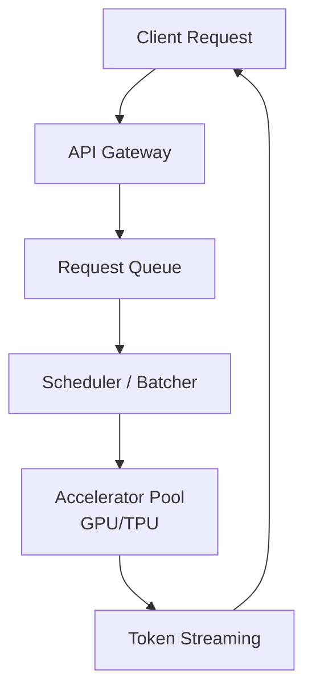
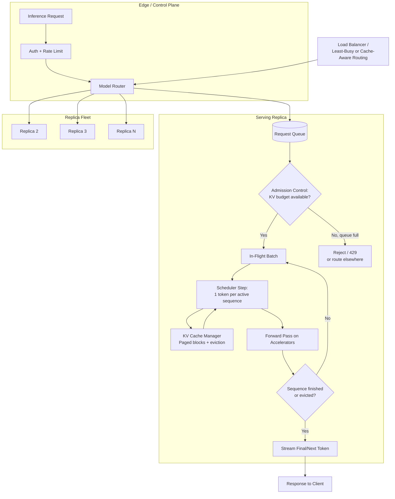
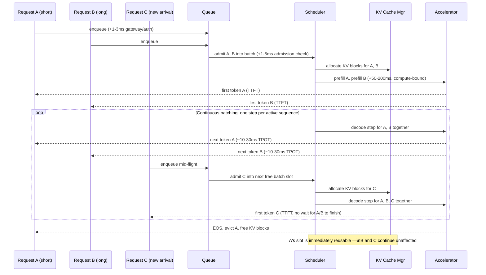
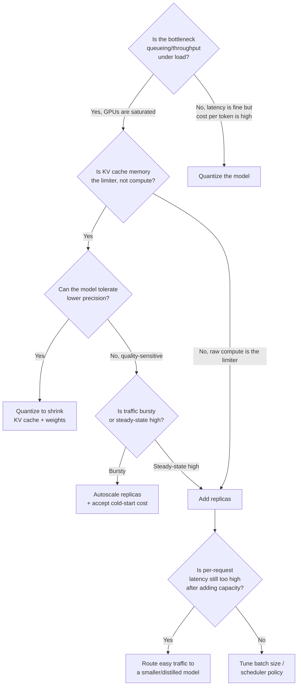

# Model Serving Architecture

## Overview

Model serving is the runtime system responsible for executing inference requests against a deployed model while jointly optimizing two metrics that are frequently in tension: **throughput** (aggregate tokens generated per second across all concurrent users on a given fleet of accelerators) and **latency** (time-to-first-token and time-per-output-token experienced by one individual request). It is the layer that sits between a trained model's weights and a usable API — accepting requests, deciding how to group and schedule them across available accelerators, running the forward pass, and streaming tokens back to callers.

The gap between a naive and a well-engineered serving layer is not marginal. The same weights on the same GPU can cost $0.50 or $5.00 per million tokens, and a user can wait 200ms or 4 seconds for the first word of a response — purely based on how the serving stack schedules and batches requests. This chapter covers the complete architecture: how the problem arises, what the stack looks like, and what the knobs are.

---

## The Problem Serving Solves

Without a dedicated serving layer, the obvious implementation — load the model once, run one request through it at a time — is correctness-preserving but throws away most of the hardware. LLM token generation (the decode phase) is **memory-bandwidth-bound**, not compute-bound: for each new token, the accelerator reads the entire set of model weights and the growing KV cache from high-bandwidth memory, performs a comparatively small amount of arithmetic, and writes one token back. A single request cannot saturate the GPU's compute units no matter how large the model is, because the bottleneck is data movement, not math. Run requests one at a time and a GPU capable of computing thousands of tokens/sec in parallel sits at single-digit-percent utilization serving one user at a time.

The first-generation fix — collect requests into a batch, run them together — creates a different problem: **head-of-line blocking**. If requests must be batched and dispatched together, a short request (a 5-token answer) is stuck in the same batch as a long one (a 2,000-token essay) until the longest request finishes, because classic batched execution doesn't return individual sequences early. Throughput improves; latency variance gets much worse.

**Continuous batching** (in-flight batching), pioneered by Orca (2022) and popularized by vLLM, restructured the execution loop around individual decode iterations rather than whole request lifecycles. At each scheduling step, the engine generates one next token for every in-flight request, immediately evicts any request that just produced an end-of-sequence token, and immediately admits a newly arrived request into the freed slot — without waiting for any other sequence to finish. This shift made high GPU utilization and low per-request latency variance compatible goals instead of competing ones. The mechanics are covered at depth in [Batching & Continuous Batching](02-batching-and-continuous-batching.md).

A second pressure point pushed the architecture further: even with perfect batching, every in-flight sequence needs its KV cache resident in accelerator memory for its entire duration, and that memory — not raw FLOPs — became the binding constraint on concurrency. That fact reshaped serving-engine design around memory management as a first-class concern; see [KV Cache Management](03-kv-cache-management.md).

---

## Key Metrics and Concepts

- **Prefill vs. decode** — prefill is the single forward pass over the entire input prompt, computing attention over all prompt tokens at once; it is compute-bound and produces the first output token. Decode is the repeated, one-token-at-a-time loop that follows; it is memory-bandwidth-bound, dominated by reading weights and KV cache rather than arithmetic. These opposite hardware profiles are why some architectures schedule the two phases separately (see [Disaggregated Prefill/Decode](../17-distributed-inference/02-disaggregated-prefill-decode.md)).
- **Time-to-first-token (TTFT)** — latency from request arrival to the first streamed token; dominated by prefill time and queueing delay.
- **Time-per-output-token (TPOT)** — the steady-state latency between successive streamed tokens; dominated by decode-phase memory bandwidth and current batch occupancy.
- **KV cache** — the cached key/value attention tensors for every token already processed, kept resident so each new token's attention doesn't recompute over the entire prior context from scratch. Its size grows linearly with sequence length and batch size, and at production scale it is typically the dominant consumer of accelerator memory — ahead of the model weights — for long-context, high-concurrency workloads.
- **Batch occupancy / utilization** — the fraction of an accelerator's compute or memory-bandwidth capacity actually used; the purpose of a serving engine is to push this up without blowing the latency budget.
- **Throughput vs. latency tension** — larger batches raise aggregate tokens/sec (more requests sharing the same weight-read cost per step) but raise TPOT for every request in the batch (more total memory traffic per step), until the batch's KV cache exceeds available memory — the hard ceiling on how far batching alone can go.
- **Cold start / model loading latency** — the time to load weights into accelerator memory and warm up the execution graph (CUDA graph capture, kernel autotuning) before a replica can serve its first request; tens of seconds to minutes for large models, which makes autoscaling a slower lever than it is for stateless web services.

---

## The Serving Stack

The detailed view shows what the scheduler and accelerator boxes actually contain in a production engine: admission control, a continuous-batching loop, KV cache paging, and routing across many model replicas.

---

## Components

| Component | Responsibility | Does NOT own |
|---|---|---|
| API gateway | AuthN/AuthZ, request validation, rate limiting, request shaping | Scheduling, batching |
| Model router | Picks which model/replica/version serves a request (see [Multi-Model Serving & Routing](05-multi-model-serving-and-routing.md)) | Token generation |
| Request queue | Holds admitted-but-not-yet-scheduled requests; provides backpressure when full | Memory management |
| Scheduler / batcher | Decides which requests run in the next decode step; implements continuous batching | The forward pass itself |
| KV cache manager | Allocates, pages, and evicts attention cache memory per sequence | Request admission policy |
| Accelerator pool | Executes the forward pass (prefill and decode) | Routing, queueing |
| Token streaming layer | Pushes generated tokens back to the client incrementally (SSE/gRPC streaming) | Generation correctness |
| Load balancer | Distributes traffic across replicas, ideally cache- or load-aware | Per-replica scheduling |
| Autoscaler | Adds/removes replicas based on queue depth and utilization signals | Per-request latency guarantees during scale-up |

---

## Continuous Batching in Action

The critical property: Request C's first token does not wait for Request A or B to complete, and Request A's completion does not stall B or C. That decoupling — only possible because scheduling happens per-token, not per-batch — is the entire reason continuous batching replaced static batching in every serious serving engine.

---

## Scheduling Patterns

```mermaid
flowchart LR
    subgraph T0["t=0"]
        A0[Req A: prefill]
        B0[Req B: prefill]
    end
    subgraph T1["t=1"]
        A1[Req A: decode tok 1]
        B1[Req B: decode tok 1]
    end
    subgraph T2["t=2"]
        A2[Req A: decode tok 2]
        B2[Req B: decode tok 2]
        C2[Req C: prefill, just arrived]
    end
    subgraph T3["t=3"]
        A3[Req A: EOS, evicted]
        B3[Req B: decode tok 3]
        C3[Req C: decode tok 1]
        D3[Req D: prefill, fills A's slot]
    end
    T0 --> T1 --> T2 --> T3
```

The batch composition is fluid across scheduling steps. The patterns built on top of this core loop, roughly in order of how production engines layer them in:

1. **Static batching (legacy baseline)** — fixed-membership batches, padded to the longest sequence, dispatched as a unit. Still seen in older serving stacks or for workloads with uniform, short, fixed-length outputs (e.g., classification-style single-token outputs) where the downsides don't bite.
2. **Continuous / in-flight batching** — per-step admission and eviction, as shown above. The default in vLLM, TensorRT-LLM, and SGLang.
3. **Prefix / prompt caching** — when multiple requests share an identical prefix (a system prompt, a few-shot template, a long shared document), the KV cache for that prefix is computed once and reused, turning a repeated prefill into a cache hit.
4. **Speculative decoding** — a small draft model proposes several tokens ahead, and the main model verifies them in a single batched forward pass; see [Speculative Decoding at Scale](../17-distributed-inference/03-speculative-decoding-at-scale.md).
5. **Disaggregated prefill/decode** — running prefill (compute-bound) and decode (bandwidth-bound) on physically separate accelerator pools; see [Disaggregated Prefill/Decode](../17-distributed-inference/02-disaggregated-prefill-decode.md).
6. **Tiered/multi-model routing** — sending easy queries to a small, cheap model and hard queries to a large one behind a single logical endpoint; see [Multi-Model Serving & Routing](05-multi-model-serving-and-routing.md).

---

## Multi-LoRA Serving: One Base, Many Adapters

Fine-tuned LoRA adapters are small (50–500 MB) relative to their base model (10–70 GB). This size asymmetry enables **multi-LoRA serving**: one GPU replica holds the base model weights in GPU memory, and multiple adapters are loaded or swapped at request time, letting a single physical deployment serve hundreds of fine-tuned variants.

**Why this matters for product architectures:**

A common pattern in enterprise AI is per-customer fine-tuning — a legal AI platform might have 50 law-firm-specific adapters, each fine-tuned on that firm's documents and style. Without multi-LoRA, serving 50 variants means 50 GPU replicas, each holding a full copy of the base model. With multi-LoRA, you hold the base model once and hot-load adapters as requests arrive.

**How it works:**

1. The serving engine keeps the base model weights in GPU HBM at all times.
2. For each request, the adapter ID is resolved from a routing header or tenant identifier.
3. The adapter's weight deltas (the LoRA matrices) are loaded into GPU memory and applied to the relevant base weight matrices during the forward pass.
4. A small adapter cache (typically 10–50 adapters in GPU memory simultaneously) keeps recently-used adapters warm; cold adapters are loaded from host memory or storage in 10–100ms.

**Sizing multi-LoRA deployments:**

- GPU memory required = base model weights + active adapter cache + KV cache for current batch.
- A 7B model at BF16 uses ~14 GB; 50 rank-16 LoRA adapters for common layers add ~2–5 GB total. A single A100 80 GB can hold the base model and an adapter cache comfortably alongside KV cache for dozens of concurrent requests.
- For very large adapter counts (thousands), store adapters on NVMe SSDs and pre-warm the top-N most-used adapters in GPU memory.

**Limitations:** Multi-LoRA requires all adapters to be trained against the same base model at the same precision. Mixing adapters from different base models or ranks on one replica is not supported.

---

## Batch and Offline Inference

The serving patterns above optimise for **online inference**: interactive, latency-sensitive requests where users wait for a response. A large category of AI workloads doesn't fit that model — they process large volumes of data in the background where throughput is the only metric that matters.

**When offline/batch inference is the right pattern:**

- **Embedding generation pipelines** — embedding 10 million documents for a RAG corpus update.
- **Bulk classification or scoring** — running a content-safety classifier over a week of uploaded images overnight.
- **Pre-computing summaries or structured extractions** — processing a corpus of legal documents to extract structured data for downstream search.
- **Eval suite execution** — running 2,000 golden-set examples through an LLM judge.

| Dimension | Online serving | Offline batch |
|---|---|---|
| Latency target | p50/p95 SLO (100ms–3s) | None — throughput per hour |
| KV cache strategy | Minimise resident time, rapid eviction | Large batches, no eviction pressure |
| Batch size | Dynamically bounded by KV cache | Maximise to GPU memory limit |
| Request ordering | FIFO with priority lanes | Sort by sequence length to minimise padding waste |
| Infrastructure | Always-on replicas | Spot or preemptible instances, start/stop per job |
| Cost target | p99 latency SLO | Cost per 1M tokens processed |

Do not run batch jobs on the same serving infrastructure as real-time user traffic. Batch workloads use large KV cache allocations and long-running sequences that crowd out the short, latency-sensitive requests that arrive interactively. Use a separate GPU pool optimised independently for throughput.

---

## Choosing the Right Optimization Lever

| Advantages | Disadvantages |
|---|---|
| Order-of-magnitude better GPU utilization than naive per-request serving | Significant engineering complexity vs. a simple model.generate() call |
| Decoupled per-request latency — one slow request doesn't stall others | KV cache memory becomes a hard, easy-to-underestimate ceiling on concurrency |
| Horizontal scaling handles steady-state load growth cleanly | Cold start makes autoscaling a slow lever, not an instant one |
| Quantization buys latency/memory headroom with a measured quality cost | Every lever (batch size, precision, replica count) interacts with the others |
| Multiple independent levers give real flexibility | Requires production-grade observability to know which lever is actually the bottleneck |

---

## Scaling Properties

- **Batch size vs. latency**: at batch size 1, TTFT might be ~80ms and steady-state throughput is a few dozen tokens/sec — almost entirely wasted bandwidth. Raising to ~32 concurrent sequences can push aggregate throughput up 10–20x with TPOT rising only modestly. Past a certain batch size (commonly 64–256 depending on model size, sequence length, and VRAM), the KV cache exceeds available memory and throughput gains flatten or reverse.
- **GPU utilization, naive vs. continuous batching**: serving one request at a time commonly leaves single-digit-percent compute utilization during decode. A well-tuned continuous-batching scheduler delivers 3–10x throughput-per-GPU improvement over that baseline on the same hardware.
- **Replica scaling** handles load growth horizontally once a single replica is well-tuned, but each replica has fixed KV cache and compute capacity.
- **Cold start** is the wrinkle that differs from typical web-service autoscaling: loading a large model's weights and warming the execution graph takes tens of seconds to minutes, so reactive autoscaling arrives too late for sudden spikes — production systems pre-warm a buffer of idle-but-loaded replicas or scale predictively from leading traffic signals.
- **Sequence length** compounds both axes: a 10x increase in average context length roughly 10x's the KV cache footprint per sequence, cutting concurrency and increasing prefill time simultaneously.

---

## Reliability

| Failure | Degradation strategy |
|---|---|
| Accelerator/replica crash mid-generation | Route to a healthy replica; client-visible effect is a dropped stream, retryable |
| Queue saturation under load spike | Return fast, explicit backpressure (HTTP 429) rather than accepting requests that will time out anyway |
| KV cache exhaustion | Evict the lowest-priority in-flight sequence rather than crashing the process |
| Cold replica during scale-up | Keep a warm buffer of pre-loaded standby replicas for latency-sensitive tiers |
| Model weight corruption / bad deploy | Canary new model versions on a small traffic slice with automatic rollback |
| Upstream provider outage | Fall back to a secondary model/provider; see [Multi-Model Serving & Routing](05-multi-model-serving-and-routing.md) |

Track **TTFT p50/p95/p99** and **TPOT p50/p95/p99** as separate SLOs — they have different causes and regress independently. Track **admission rejection rate** as a leading indicator of capacity shortfall before it becomes a latency incident.

---

## Security

A serving layer's attack surface is different from a typical API's because the "compute" being protected is expensive, shared, and stateful across requests.

- **Resource exhaustion via the KV cache** — a small number of maliciously long-context requests can consume a disproportionate share of shared accelerator memory, starving other tenants. Per-tenant memory quotas and admission-time limits on context length are the standard mitigation.
- **Cross-tenant leakage through prefix caching** — a cache keyed only on token content (not also on tenant/session identity) can let one tenant's cached computation influence timing or behavioral signals observable by another. Cache keys must be scoped to the appropriate isolation boundary.
- **Side-channel timing on shared infrastructure** — response timing on shared multi-tenant accelerators can, in principle, leak information about other tenants' concurrent batch composition. Relevant in regulated multi-tenant deployments.

---

## Cost Optimization

An unbatched deployment might cost $5–15 per million output tokens purely from GPU-hours wasted on idle compute. A well-tuned continuous-batching deployment of the same model on the same hardware commonly costs $0.50–2 per million tokens. The levers, ordered by leverage:

- **Maximize batch occupancy before adding hardware.** Tuning the scheduler and batch size to keep accelerators busy is almost always the highest-leverage lever.
- **Quantize where quality tolerance allows.** Moving from FP16 to INT8 or INT4 roughly halves or quarters both weight memory and KV cache memory — see [Quantization & Compression](04-quantization-and-compression.md).
- **Route by difficulty, not uniformly to the largest model.** Simple queries to a smaller model is frequently a 50–80% cost reduction on the redirected fraction — see [Multi-Model Serving & Routing](05-multi-model-serving-and-routing.md).
- **Exploit prefix caching for shared system prompts.** A large shared instruction block repeated across most requests turns a meaningful fraction of every prefill into a cache hit.
- **Right-size replica count to traffic shape, not peak-forever.**

---

## Monitoring

- **TTFT and TPOT at p50/p95/p99**, tracked separately — the two most important latency signals.
- **Tokens/sec per accelerator (throughput)** and **batch occupancy / KV cache utilization** — the core efficiency signals.
- **Queue depth and admission rejection rate** — the leading indicator that capacity is falling behind demand.
- **Per-replica error rate and crash/restart frequency** — accelerator-level failures are a normal operating condition at fleet scale.
- **Cost per million tokens, tracked over time** — catches silent regressions (a config change that quietly drops batch occupancy).
- **Cold-start / model-load duration** for new replicas — directly informs whether the autoscaler's reaction time matches real traffic spike timescales.

---

## Production Best Practices

- Default to **continuous batching** — static batching's head-of-line blocking is a solved problem.
- Treat **KV cache budget as the primary capacity-planning unit**, not raw GPU count.
- **Separate TTFT and TPOT SLOs** explicitly in dashboards and alerting.
- **Pre-warm replica capacity** ahead of known traffic patterns rather than relying purely on reactive autoscaling.
- **Canary model and config changes on a small traffic slice** with automated rollback on regression.
- **Measure before reaching for the next lever.** Adding replicas when the real bottleneck is poor batch occupancy, or quantizing when it's queueing delay, fixes the wrong problem.

---

## Cold-Start Latency and Warm Pool Management

Cold-start latency — the delay between a model first being loaded onto a GPU and serving its first request — is a distinct problem from per-request latency.

- **What causes it.** Loading a 70B model from NVMe to GPU HBM takes 10–60 seconds at PCIe speeds. CUDA graph capture adds 10–30 more seconds.
- **Warm pools.** Keep at least one replica of each model always loaded, even at zero traffic. The carrying cost is idle GPU memory.
- **Speculative pre-warming.** Pre-warm additional replicas 5–15 minutes before expected traffic peaks.
- **Multi-LoRA cold-start.** In multi-LoRA deployments, the base model is always warm; only adapter loading is cold (~seconds). Adapter loads can be hidden behind the preceding request's decode time using background prefetch.
- **Serverless trade-off.** Platforms like Modal and Replicate scale to zero at low traffic. Acceptable for async/batch workloads; not for real-time interactive products without a minimum-replica floor.

---

## Tools and Ecosystem

| Category | Tools | When to prefer |
|---|---|---|
| **Self-hosted serving engines** | vLLM, SGLang, TGI (HuggingFace), TensorRT-LLM (NVIDIA), llama.cpp | vLLM: widest model support, PagedAttention, best default; SGLang: RadixAttention for shared-prefix workloads; TRT-LLM: maximum throughput for fixed NVIDIA hardware; llama.cpp: CPU and edge |
| **Managed inference (API)** | Together.ai, Fireworks AI, Groq, Anyscale, Modal, Replicate | Together/Fireworks: production-grade open-model APIs; Groq: lowest latency (LPU); Modal: serverless with autoscale to zero |
| **LLM gateway / multi-provider** | LiteLLM, Portkey, OpenRouter, Martian, Helicone | LiteLLM: open-source, OpenAI-compatible for 100+ providers; Portkey: caching + fallback + observability |
| **Multi-LoRA serving** | vLLM (`--enable-lora`), TGI LoRA adapter support, S-LoRA | vLLM multi-LoRA: up to ~100 adapters; S-LoRA: thousands of adapters via paged adapter cache |
| **Load balancing** | vLLM's built-in load balancer, NGINX, Traefik, Kubernetes Ingress | vLLM can load-balance with cache-aware routing across replicas |
| **Quantisation tools** | bitsandbytes, AutoAWQ, AutoGPTQ, llama.cpp quantise | AWQ: best quality at INT4; GGUF + llama.cpp: CPU serving |

---

## Real-World Examples

The exact internal serving architectures of frontier-model providers are not public, but the publicly described shape is consistent enough to describe at a pattern level:

- **OpenAI, Anthropic, and Google** all serve frontier models from fleets of accelerator replicas behind load balancers, with traffic distributed across multiple regions. Each has publicly discussed continuous-batching-style scheduling, KV cache optimization, and tiered model routing — consistent with this chapter's architecture.
- **vLLM** popularized PagedAttention-style KV cache management and continuous batching as accessible, off-the-shelf techniques. The most common reference implementation cited when discussing these mechanics.
- **NVIDIA's TensorRT-LLM** targets the same problem from the compiled-kernel-optimization angle: aggressive kernel fusion, in-flight batching, and quantization tuned tightly to NVIDIA accelerators.
- **SGLang** extended the same family of ideas toward structured generation and complex multi-call workloads with RadixAttention for shared-prefix workloads.

---

## Interview Questions

### Beginner

**Q: Why can't you just call model.generate() once per incoming request in production?**

LLM decode is memory-bandwidth-bound, not compute-bound: each step reads the full model weights and KV cache from memory and does relatively little arithmetic per token. A single request can't use most of a modern accelerator's parallel compute capacity, so one-at-a-time serving leaves the GPU mostly idle. Batching requests together lets each weight-read serve many requests' worth of useful work simultaneously — the entire reason a dedicated serving layer exists instead of a bare inference call.

**Q: What's the difference between time-to-first-token and time-per-output-token, and why track them separately?**

TTFT is latency from request arrival to the first streamed token; dominated by queueing delay and the compute-bound prefill pass. TPOT is the steady-state latency between subsequent tokens; dominated by memory-bandwidth-bound decode and current batch occupancy. They have different causes and regress independently — a blended average latency metric hides which one actually broke.

---

### Intermediate

**Q: Explain why continuous batching replaced static batching.**

Static batching fixes a batch's membership and length at dispatch time: every sequence is padded to the longest member, and the whole batch is held until its slowest member finishes. This wastes compute on padding and causes head-of-line blocking. Continuous batching schedules at the level of individual decode steps: every active sequence gets one new token per step, finished sequences are evicted and freed immediately, and new requests are admitted into the freed slot without waiting for the batch to drain. This decouples one request's latency from its batch-mates' length.

**Q: What determines how many concurrent requests a single GPU replica can serve?**

Primarily the KV cache memory budget, not raw compute. Each in-flight sequence needs its KV cache resident for its entire duration, growing with both sequence length and batch size. Once aggregate KV cache approaches available memory (after model weights), no more sequences can be admitted regardless of spare compute — which is why capacity planning is done in KV cache budget, not GPU-count, units.

---

### Senior

**Q: A serving fleet's GPU utilization metrics look high, but p99 latency is still bad. What do you check?**

High utilization with bad tail latency usually means a subset of requests are starved or stuck behind disproportionately expensive peers: long-context outliers dominating batch slots; a scheduler not fairly rotating admission priority; KV cache pressure causing eviction-and-requeue cycles; or queueing delay at the gateway/router before requests reach the scheduler (which accelerator-level utilization metrics won't show at all). The fix is rarely "add more GPUs" — it's almost always a scheduling-fairness or admission-control issue.

**Q: How would you decide between adding replicas, increasing batch size, and quantizing, for a serving fleet under cost pressure?**

Identify the actual bottleneck first. If KV cache is the limiting resource, quantization is usually highest-leverage — it shrinks both weights and KV cache, raising the batch size that fits in memory. If compute is genuinely saturated and quality tolerance for quantization is low, horizontal scaling is the right lever. If the issue is bursty traffic with healthy steady-state utilization, the answer is neither — it's better autoscaling and pre-warming. Reaching for the wrong lever burns engineering time and can regress quality for no throughput gain.

---

### Staff

**Q: Design a serving architecture for a product with two traffic shapes: 90% short (sub-100-token) chat completions needing sub-second latency, and 10% long-document summarization (10K+ token inputs) where 5–10 second latency is acceptable. One shared fleet, or split?**

Split, behind a router that classifies request shape at admission time, once traffic reaches meaningful scale. Co-locating both shapes creates a memory-contention variant of head-of-line blocking: long-document requests carry disproportionately large KV cache footprints and prefill times, crowding out latency-sensitive batch slots even with continuous batching, because per-token scheduling alone doesn't solve memory contention. The pragmatic split: a latency-tuned pool sized for the short-chat profile's SLO, and a separate throughput-tuned pool (candidate for disaggregated prefill/decode, given the heavier compute-bound prefill) for summarization.

**Q: Your serving fleet's cost-per-token has crept up 3x over six months with no traffic-mix change and no code deploys. How do you find the cause?**

Treat it as a utilization regression. Check, in order: (1) average context length drift — prompts or retrieved context growing over time (common as RAG corpora grow) quietly shrinks effective batch occupancy; (2) scheduler/config drift — an unflagged change to batch-size caps, admission policy, or kernel selection; (3) accelerator fleet composition drift toward a less efficient instance type; (4) a dependency regression silently falling back to a slower unquantized path. The unifying diagnostic: plot tokens/sec per accelerator and batch occupancy over the six months — if utilization tracks the cost increase inversely, the cause is almost certainly in the first two buckets.

---

## Google-Level Follow-Ups

**"Your batch size keeps growing and aggregate throughput keeps improving — when does that stop being true, and what specifically breaks?"**
Probes whether the candidate understands that KV cache memory, not compute or an arbitrary scheduler limit, is the actual ceiling, and can describe what happens at that ceiling (eviction, queueing, OOM).

**"If you could only instrument three metrics for this entire serving stack, which three, and why those?"**
Probes prioritization under real constraints; a strong answer picks signals that are causally distinct (TTFT, TPOT, KV cache utilization) rather than three variations on latency, and justifies why each catches a different failure mode.

**"How does this architecture change for a model so large it doesn't fit on a single accelerator?"**
Probes whether the candidate connects this chapter to tensor/pipeline parallelism and understands that cross-device communication becomes part of every forward pass's latency budget (see [Tensor and Pipeline Parallelism](../17-distributed-inference/01-tensor-and-pipeline-parallelism.md)).

**"Convince me continuous batching is strictly better than static batching — is there any workload where static batching is still the right choice?"**
Probes whether the candidate can find the real exception (extremely uniform, very short, fixed-length outputs — single-token classification — where head-of-line blocking barely exists) instead of defending continuous batching dogmatically.

---

## Common Mistakes

- **Serving one request at a time and calling it "deployed."** This is correct but leaves a GPU at single-digit-percent utilization during decode — a prototype, not a production serving layer, and the cost difference at any real traffic volume is enormous.
- **Treating GPU count as the primary capacity metric.** Two fleets with identical accelerator counts can support very different concurrent-request ceilings depending on context length and precision; KV cache budget is the real capacity unit.
- **Blending TTFT and TPOT into one "average latency" number.** This hides which phase regressed and routinely sends an on-call engineer down the wrong debugging path.
- **Reactive-only autoscaling for workloads with large, fast traffic spikes.** Cold start for large models is tens of seconds to minutes; scaling only after queueing is observed means the spike has already caused a latency incident.
- **Quantizing without first measuring which resource is actually the bottleneck.** Each lever fixes a different problem; applying the wrong one burns engineering effort and frequently doesn't move the metric that prompted the change.
- **Sharing a single prefix/KV cache without correct tenant scoping.** A cache keyed purely on token content is a latent cross-tenant data-handling risk.

---

## Key Takeaways

- Model serving exists because naive one-request-at-a-time inference leaves accelerators mostly idle during decode — batching multiple requests together is the entire point.
- Continuous (in-flight) batching replaced static batching by scheduling at the granularity of individual decode steps, decoupling one request's latency from its batch-mates' length.
- The KV cache, not raw FLOPs, is the dominant memory constraint at production scale — capacity planning should be done in KV cache budget terms, not GPU-count terms.
- Throughput and latency are genuinely in tension: larger batches raise aggregate tokens/sec but raise per-request TPOT, until KV cache memory becomes the hard limit.
- A well-tuned continuous-batching stack can run at roughly 1/10th the cost-per-million-tokens of a poorly batched one on identical hardware — the gap is almost entirely utilization, not hardware pricing.
- Quantization, horizontal replica scaling, and tiered model routing are complementary levers that each solve a different bottleneck — diagnose which resource is actually constrained before reaching for any of them.
- Cold start (tens of seconds to minutes for large models) makes serving-fleet autoscaling fundamentally slower than stateless-web-service autoscaling, which argues for pre-warmed capacity over purely reactive scaling.

---

*Part of [Model Serving](index.md) · [Batching & Continuous Batching](02-batching-and-continuous-batching.md) · [KV Cache Management](03-kv-cache-management.md) · [Quantization & Compression](04-quantization-and-compression.md) · [Multi-Model Serving & Routing](05-multi-model-serving-and-routing.md) · [On-Device and Edge Inference](06-on-device-and-edge-inference.md) · [The Inference Stack](../14-ai-infrastructure/02-the-inference-stack.md)*
