# Batching & Continuous Batching

## Overview

Batching is the single biggest lever on GPU utilization in LLM serving. It determines whether a GPU runs at 20% or 90% utilization under identical traffic, using the same model weights and the same hardware. The batching strategy — how the scheduler groups concurrent requests — is what separates a serving stack costing $5/million tokens from one costing $0.50/million tokens on the same infrastructure.

This chapter starts from the hardware economics that make batching necessary, walks through static batching's failure mode, explains how continuous batching solved it, and then covers the full set of techniques that production systems layer on top: prefill-decode disaggregation, chunked prefill, speculative decoding, and the practical configuration parameters that a serving engineer actually tunes.

See also: [Model Serving Architecture](01-model-serving-architecture.md) for the broader serving stack this chapter fits into, and [The Inference Stack](../14-ai-infrastructure/02-the-inference-stack.md) for the four-layer stack overview.

---

## Why Batching Exists: The Hardware Economics

LLM decode is **memory-bandwidth-bound**, not compute-bound. Each decode step reads the entire set of model weights plus the growing KV cache from VRAM, performs a comparatively small matrix multiply (one token's query against the KV cache), and writes one token back. The bottleneck is data movement, not arithmetic.

The key number: for a 70B BF16 model (140 GB of weights) on an H100 with 3.35 TB/s HBM3 bandwidth, each decode step takes roughly:

```
140 GB ÷ 3,350 GB/s ≈ 42ms per token (single request)
```

But that 42ms reads 140 GB of weights regardless of whether the GPU serves 1 request or 64 requests simultaneously. The memory subsystem cost is fixed. Batching routes that fixed cost across many requests at once.

| Batch size | Weight read per step | Tokens produced | Effective throughput |
|---|---|---|---|
| 1 | 140 GB | 1 | 1x |
| 8 | 140 GB | 8 | ~8x |
| 32 | 140 GB | 32 | ~32x |
| 64 | 140 GB | 64 | ~64x |

A single request uses roughly 1–5% of an H100's parallel compute capacity during decode. The rest is wasted. Batching is the mechanism that amortizes the per-step weight-read cost across many requests simultaneously.

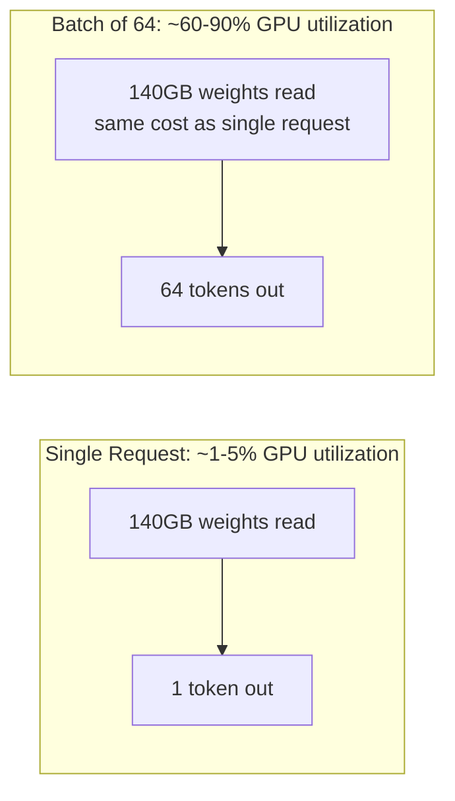

---

## Static Batching and the Head-of-Line Blocking Problem

The naive batching approach works like this: the scheduler waits until N requests have accumulated (or a timeout fires), groups them into one batch, runs the full batch through the model, and returns all results when the entire batch finishes.

This is **static batching**. It improves utilization over one-at-a-time serving, but it has a structural flaw that makes it unacceptable for autoregressive generation.

### The Core Problem

In autoregressive generation, different requests in the same batch produce different output lengths. A request that generates 20 tokens finishes in 20 decode steps. A request that generates 2,000 tokens takes 2,000 decode steps. In static batching, the batch is frozen at dispatch time: the 20-token request must wait in the batch until the 2,000-token request finishes — its GPU slot sits idle for 1,980 decode steps, burning VRAM and blocking the caller.

This is **head-of-line blocking**: a short request pays the latency cost of the longest request in its batch.

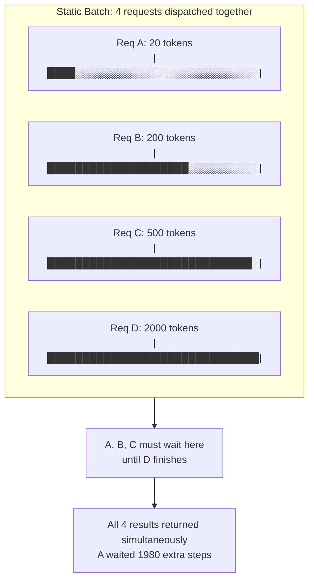

The wasted compute is not hypothetical. In a batch where one request generates 2,000 tokens and three generate 20 tokens, the three short requests occupy GPU slots for ~1,980 steps producing nothing — 99% of their slot time is idle. Padding to the longest sequence wastes additional compute on the attention over empty positions.

### Static Batching Timeline

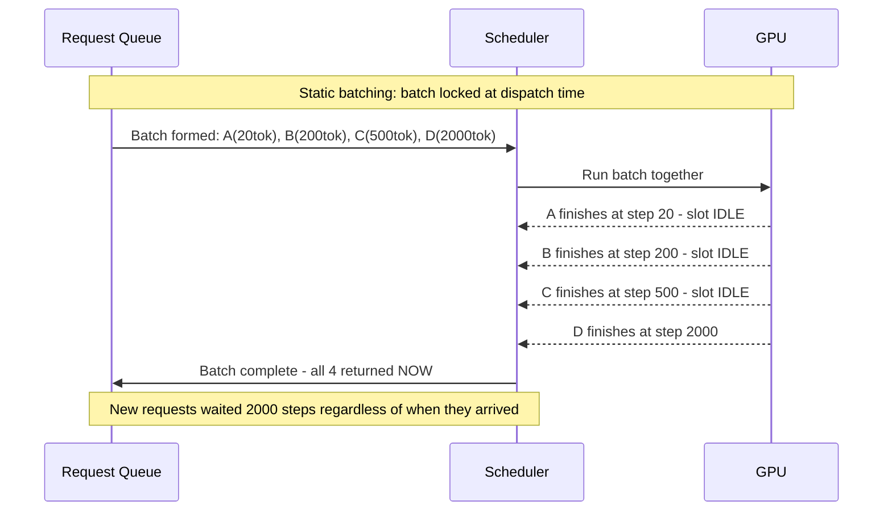

---

## Continuous Batching: The Solution

**Continuous batching** (also called in-flight batching or iteration-level scheduling) was introduced by the Orca paper (2022) and popularized in production by vLLM. Instead of scheduling at the request level, it schedules at the decode iteration level.

### The Core Mechanic

After each decode step, the scheduler checks: did any requests in the current batch finish (emit EOS or reach max tokens)? If yes, their slots are freed immediately and waiting requests from the queue are inserted for the next decode step. No request needs to wait for other requests to finish.

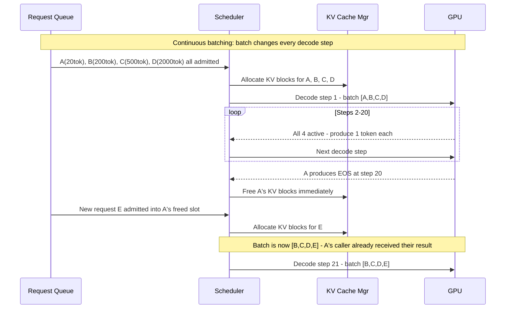

### Batch State Evolution

The batch composition changes at every iteration. This diagram shows 10 decode steps as requests enter and leave:

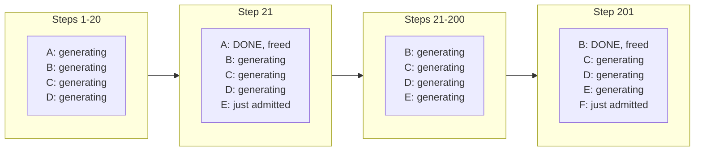

The critical property: Request E's first token does not wait for B, C, or D to complete. Request A's completion does not stall B, C, or D. Every completed request immediately frees capacity for the next waiting request.

### Why This Requires PagedAttention

Continuous batching creates a problem for memory management: when a new request is inserted mid-batch, the serving engine cannot pre-allocate contiguous VRAM for it because it doesn't yet know how many tokens the request will generate. Classic CUDA memory allocation requires contiguous blocks — you must request the full allocation upfront.

PagedAttention solves this by managing KV cache in fixed-size pages (blocks), so new requests can be allocated pages incrementally as they generate tokens. This is covered in depth in [KV Cache Management](03-kv-cache-management.md).

---

## The Throughput vs. Latency Tradeoff as Batch Size Grows

Increasing batch size improves aggregate throughput but at a cost to per-request latency. This tradeoff is not linear — there's a regime of good scaling, a knee, and a cliff.

### The Three Regimes

**Regime 1 — Scaling regime (batch size 1 → ~32)**: Each additional request in the batch costs almost nothing in per-request latency (the weight-read was happening anyway) but adds one more token per decode step. Throughput scales nearly linearly with batch size. TPOT barely changes because VRAM bandwidth is the bottleneck, and adding requests doesn't increase per-step VRAM bandwidth consumption significantly.

**Regime 2 — Saturation regime (batch size ~32 → ~128)**: The batch begins to stress available VRAM bandwidth and KV cache memory. Each new request adds more KV cache data to read per step. TPOT begins rising. Throughput continues growing but more slowly.

**Regime 3 — KV cache limit (batch size > memory ceiling)**: The aggregate KV cache for the batch approaches available VRAM. The scheduler must begin evicting or queuing requests. TTFT rises sharply as requests wait for slots. Past this point, adding more concurrent requests reduces throughput (eviction overhead) and spikes latency.

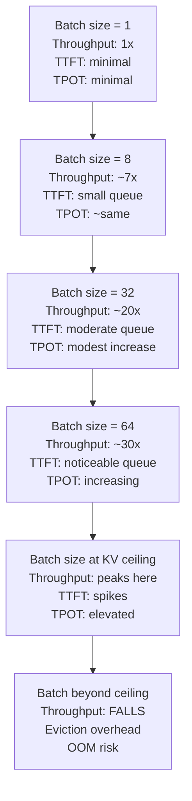

### SLA-Differentiated Operating Points

Different application classes require different points on this curve:

| Application class | Latency requirement | Optimal operating point |
|---|---|---|
| Real-time voice AI | TTFT < 300ms | Small batch, low queue depth |
| Interactive chat | TTFT < 800ms, TPOT < 50ms | Moderate batch, ~32-64 |
| Coding assistant | TTFT < 2s, TPOT < 30ms | Moderate-large batch |
| Document summarization | TTFT < 10s | Large batch, maximize throughput |
| Batch/async processing | No latency SLO | Maximum batch size, highest throughput |

---

## Prefill vs. Decode Disaggregation

The two phases of LLM inference have fundamentally different compute characteristics. Running them on the same hardware in the same batch is efficient for small traffic, but becomes a bottleneck at scale.

### Why the Phases Conflict

**Prefill** (processing the input prompt) is **compute-bound**: all input tokens are processed in parallel in a single forward pass. For a 1,000-token prompt, all 1,000 tokens' key-value pairs are computed simultaneously. This saturates GPU tensor cores — the matrix multiplications are large. A 512-token prefill on an H100 takes ~100-300ms depending on model size.

**Decode** (generating each output token) is **memory-bandwidth-bound**: each step loads the full model weights and KV cache from VRAM to compute attention for just one new token. The matrix multiplications are small (1 token × model_dim) and do not saturate tensor cores. The bottleneck is how fast weights can be streamed from HBM.

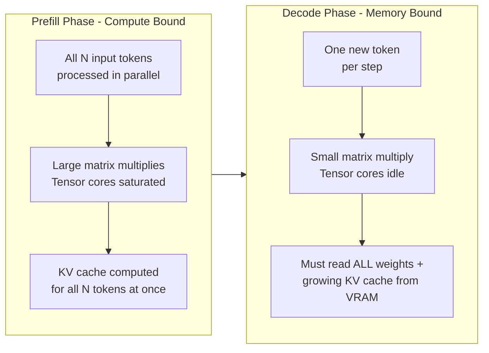

### The Mixing Problem

When prefill and decode are mixed in the same batch, a large prefill request stalls the decode of other requests in the same batch. The prefill's compute-intensive forward pass monopolizes the GPU for its duration, delaying the next decode step for every other active request. This inflates TPOT for all concurrent users sharing the batch.

### Disaggregated Architecture

**Prefill-decode disaggregation** (also called chunked prefill or split KV) uses separate GPU pools for each phase:

- **Prefill servers**: optimize for high compute throughput, large batch of prompt tokens
- **Decode servers**: optimize for memory bandwidth, serving many concurrent decode streams

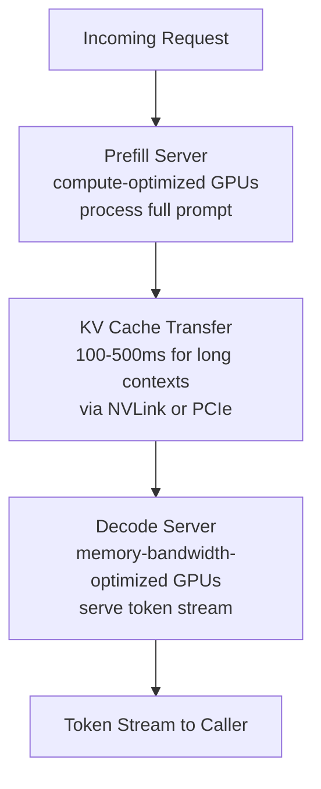

### KV Transfer Cost

The KV cache computed on a prefill server must be transferred to a decode server. This transfer cost is real:

| Context length | KV cache size (Llama 3 70B BF16) | Transfer time at 32 GB/s PCIe |
|---|---|---|
| 1,000 tokens | ~327 MB | ~10ms |
| 8,000 tokens | ~2.6 GB | ~81ms |
| 32,000 tokens | ~10.5 GB | ~328ms |

Disaggregation is worth it when the prefill-decode mixing penalty exceeds the transfer cost — typically for high-concurrency systems with variable prompt lengths where long prefills are frequently disrupting decode batches.

---

## Chunked Prefill: The Middle Ground

Chunked prefill is a middle ground between full disaggregation and naive mixing. Instead of running an entire long prompt's prefill as one uninterruptible block, the prefill is broken into fixed-size chunks processed across multiple decode iterations, interleaved with decode steps for existing requests.

### How It Works

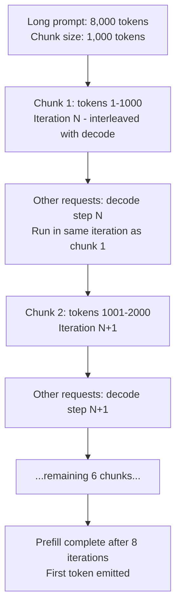

### The TTFT Tradeoff

Chunked prefill increases the TTFT of the prefilled request (its prefill is spread across 8 iterations instead of 1 uninterrupted pass), but it prevents one large prefill from causing TPOT spikes for every other request in the batch.

| Configuration | Long request TTFT | Short requests TPOT impact |
|---|---|---|
| No chunked prefill | Low (prefill runs once, uninterrupted) | High spike while long prefill runs |
| Chunked prefill, 1K chunks | Higher (8 iterations for 8K prompt) | Minimal - decode interleaved |

### When Chunked Prefill Is Needed

Chunked prefill matters when the traffic mix includes both very long and very short prompts. A system serving only short prompts (512 tokens) doesn't need it. A system with a p99 prompt length of 16,000 tokens in a batch with 64-token chat requests needs it badly.

Typical chunk sizes: 512–2048 tokens per chunk. Smaller chunks = more scheduler overhead but smoother decode. Larger chunks = more TPOT disruption but faster TTFT for the long request.

---

## Speculative Decoding

Speculative decoding is a batching-compatible optimization that reduces the effective number of full model forward passes needed per output token.

### The Mechanism

A small **draft model** generates k candidate tokens for each decode step in a single pass. The main model then verifies all k candidates in one parallel forward pass. If the draft's prediction matches the main model's distribution for all k tokens, the main model accepts them — effectively generating k tokens for roughly the cost of one step plus verification overhead.

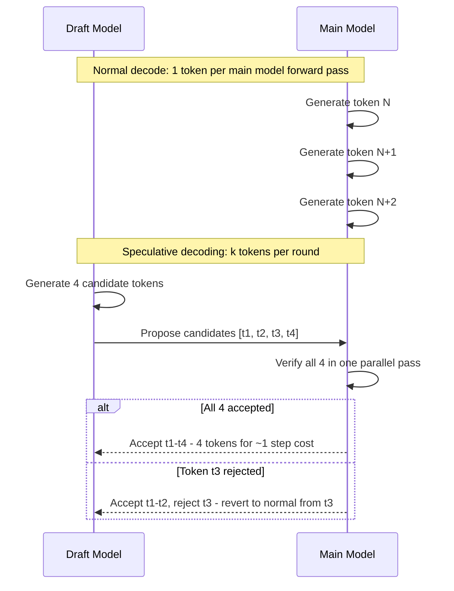

### Acceptance Rate: The Key Metric

The speedup from speculative decoding depends entirely on the draft model's **acceptance rate** — the fraction of proposed tokens the main model accepts:

| Acceptance rate | Effective speedup |
|---|---|
| 90% | ~3-4x fewer main model steps |
| 70% | ~2x fewer main model steps |
| 50% | ~1.5x fewer main model steps |
| 30% | Negligible benefit, overhead may outweigh gains |

### When Speculative Decoding Works

**Works well**: tasks with predictable, formulaic output — code completion, SQL generation, structured JSON, repeated-template text. The draft model's predictions are accurate because the output distribution is concentrated.

**Works poorly**: high-entropy creative generation, reasoning chains where each step depends unpredictably on the previous. Draft accuracy is low, the main model rejects frequently, and the overhead of running two models doesn't pay off.

Speculative decoding is compatible with continuous batching: each request can have its own draft model running in parallel with the main model's decode.

---

## Worked Example: Batch Size Budget

Given:
- GPU: NVIDIA H100 (80 GB VRAM)
- Model: Llama 3 70B at INT4 (35 GB weights)
- Remaining VRAM for KV cache: 80 GB − 35 GB = **45 GB**
- Average sequence length: 1,000 tokens input + 500 tokens output = 1,500 tokens total
- KV cache per token (Llama 3 70B, BF16): 80 layers × 8 KV heads × 128 head_dim × 2 × 2 bytes = **327 KB/token**
- KV cache per sequence: 327 KB × 1,500 = **491 MB**
- Maximum concurrent sequences: 45 GB ÷ 491 MB ≈ **91 sequences**

But INT4 KV cache (FP8 KV): KV cache remains BF16 unless explicitly quantized. If FP8 KV cache is used (halving it to 163 KB/token): 45 GB ÷ 245 MB per sequence ≈ **183 sequences**.

Expected throughput on H100 at batch size 91:
- Decode step time: 35 GB ÷ 3350 GB/s ≈ 10ms per step
- Tokens/sec: 91 sequences × (1000ms ÷ 10ms) = **9,100 tokens/sec**

This is the order-of-magnitude gain: the same GPU serving one request at a time produces ~100 tokens/sec; batching to 91 concurrent sequences produces ~9,100 tokens/sec — a 91x throughput improvement from batching alone.

---

## Practical Configuration Parameters

The parameters a serving engineer tunes in vLLM and TensorRT-LLM:

| Parameter | What it controls | Tuning guidance |
|---|---|---|
| `max_num_seqs` | Maximum concurrent sequences in the batch | Set based on VRAM KV cache budget ÷ max KV cache per sequence |
| `max_num_batched_tokens` | Maximum total tokens across all requests per iteration | Limits both prefill and decode together; typically 2048–32768 |
| `max_model_len` | Maximum sequence length (prompt + output) | Longer → fewer concurrent sequences; set to p99 of production sequence lengths, not theoretical max |
| `chunked_prefill_size` | Tokens per prefill chunk | 512–2048; lower = smoother decode, higher TTFT for long requests |
| `gpu_memory_utilization` | Fraction of VRAM vLLM allocates for KV cache | Default 0.90; leave headroom for CUDA kernels and activations |

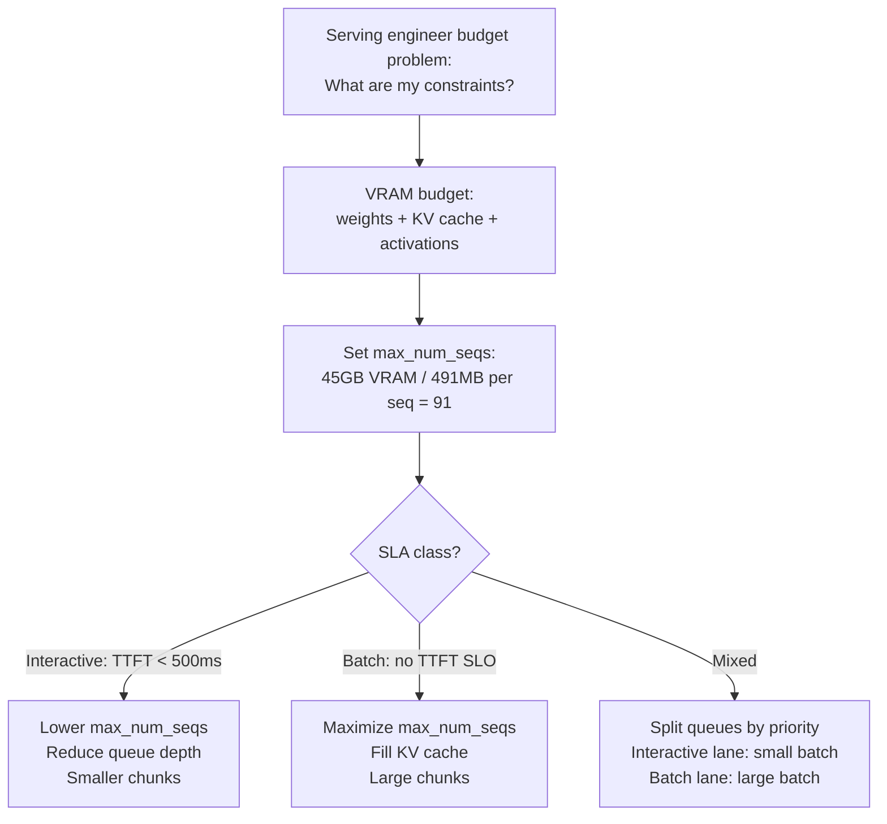

---

## Interview Questions

### Beginner

**Q: Why does batching improve GPU utilization for LLM serving?**

LLM decode is memory-bandwidth-bound: each decode step reads the entire model weights from VRAM regardless of how many requests are being served. A single request uses ~1–5% of a modern GPU's compute capacity because the bottleneck is weight-read bandwidth, not arithmetic. Batching 64 requests together amortizes that single weight-read across 64 requests simultaneously — the same VRAM bandwidth that produced 1 token now produces 64 tokens. The GPU's compute capacity is finally utilized, not just its memory subsystem.

**Q: What is head-of-line blocking in static batching, and why is it harmful?**

In static batching, a batch is locked at dispatch: all requests in the batch run together until every request finishes. Autoregressive generation produces unpredictable output lengths — one request may finish in 20 tokens while another needs 2,000. The 20-token request's GPU slot sits idle for 1,980 steps while the 2,000-token request finishes, and its caller waits for a result that was computed long ago. Both VRAM and caller time are wasted. Head-of-line blocking is why static batching is inadequate for production LLM serving.

---

### Intermediate

**Q: How does continuous batching eliminate head-of-line blocking? Walk through the mechanics.**

Continuous batching schedules at the decode iteration level, not the request level. After every decode step, the scheduler checks which requests emitted EOS or reached their token limit. Those requests are evicted immediately — their KV cache is freed, their callers receive their final token, and their GPU slots open. In the same scheduler tick, waiting requests from the queue are admitted into the freed slots. No request needs to wait for its batch-mates to complete. A 20-token request that finishes at step 20 is done at step 20; the 2,000-token request continues unaffected. The batch composition is fluid — it changes after every single decode step.

This requires PagedAttention or equivalent paged memory management, because incoming requests cannot pre-allocate contiguous VRAM blocks when output length is unknown. Pages are allocated incrementally as the request generates tokens.

**Q: Explain the tradeoff between batch size and latency. What happens at the extremes?**

At small batch sizes, throughput scales nearly linearly with batch size because the per-step weight-read cost is amortized across more requests without materially increasing VRAM pressure or per-request latency. As batch size grows into the saturation regime, TPOT begins rising because the total KV cache traffic per step increases, consuming more bandwidth per step. TTFT also rises as the queue behind the batch grows.

At the extreme, once the batch's aggregate KV cache exceeds available VRAM, the serving engine must evict sequences or reject new requests — throughput stops growing and may fall due to eviction overhead. The operating point for a given SLA class is the batch size that maximizes throughput while keeping TTFT and TPOT within the SLO budget. Interactive services run smaller batches; batch-processing pipelines run at or near the KV cache ceiling.

---

### Senior

**Q: Describe prefill-decode disaggregation. When is the KV transfer cost worth paying?**

Prefill is compute-bound: a long prompt's forward pass runs large matrix multiplications that saturate GPU tensor cores. Decode is memory-bandwidth-bound: each step generates one token by reading the full model weights and KV cache. Mixing them in the same batch means a large prefill monopolizes the GPU during its compute-intensive forward pass, delaying the next decode step for all other requests in the batch and spiking their TPOT.

Disaggregation uses separate GPU pools: prefill servers process prompts and hand off the resulting KV cache to decode servers via PCIe or NVLink. The transfer cost is real — moving 10 GB of KV cache for a 32K-token context takes ~300ms at PCIe bandwidth. This cost is worth paying when the prefill-decode interference penalty exceeds the transfer overhead: typically in high-concurrency systems where frequent long-context prefills are degrading the TPOT SLO for interactive decode streams. For low-concurrency or uniform-prompt-length systems, the added operational complexity rarely pays off.

**Q: A production system has excellent average latency but terrible p99 TTFT. Your batch size is already well-tuned. What are the three most likely causes?**

First, **long-prompt outliers**: a small fraction of requests with very long prompts monopolize the GPU during prefill, blocking decode steps for all other requests in the batch and causing TPOT spikes for everyone sharing the batch. The fix is chunked prefill — break the long prefill into smaller chunks interleaved with decode steps.

Second, **KV cache eviction cycles**: under memory pressure, the scheduler evicts sequences to free KV pages for new arrivals. The evicted requests must restart their prefill from scratch, inflating their TTFT dramatically. The tail is caused by these unlucky evictions. The fix is better admission control (reject early rather than evict mid-generation) or increasing the KV cache budget by quantizing weights.

Third, **queue starvation behind large-batch requests**: if the scheduler isn't doing fair admission, some requests can wait many decode steps before being admitted into the batch. Improving admission fairness with explicit queue time limits fixes this without adding hardware.

---

### Staff

**Q: Design the batching architecture for a system serving both real-time chat (p99 TTFT < 500ms) and asynchronous document analysis (p99 TTFT < 30s) on the same GPU fleet. What goes wrong if you use a single pool?**

A single pool mixes the two latency profiles: when document analysis requests (with multi-thousand-token prompts) are in the batch, their prefill computation blocks decode iterations for chat requests, spiking their TPOT. Simultaneously, the large KV caches of long document sessions crowd out batch slots for short chat sessions, reducing available concurrency for the interactive tier. The p99 for chat degrades whenever the document workload is active.

The correct architecture is **two separate pools behind a traffic-shaping router**:

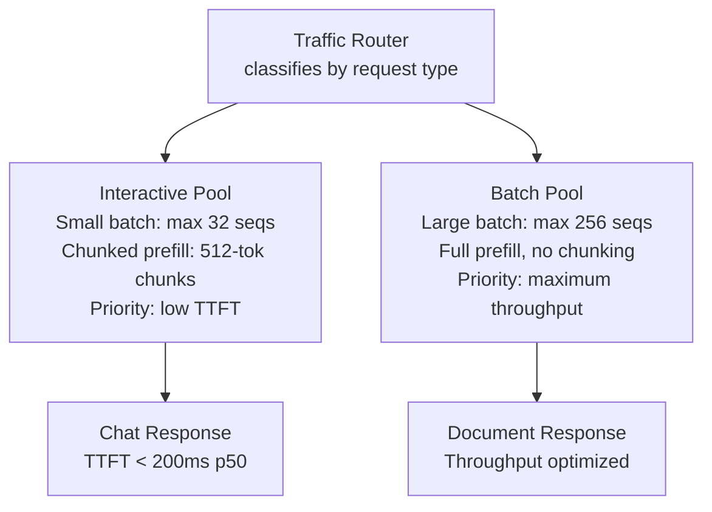

The interactive pool is tuned for low queue depth and chunked prefill to protect TPOT. The async pool is tuned for maximum batch size and throughput with no latency SLO. The router classifies at the API gateway level using request metadata (caller identity, API endpoint, explicit tier tag) — not model inference on the request content, which would add latency on the hot path.

If budgets force a single pool, use priority queuing with a separate queue per tier: the scheduler preferentially admits interactive requests into freed slots, and caps the KV cache allocation per document request to protect the interactive tier's concurrency.

---

## Google-Level Follow-Ups

**"You said continuous batching is better than static batching. Is there any workload where static batching is the right choice?"**
Tests: whether the candidate can find real exceptions vs. defending continuous batching dogmatically.

Yes: extremely uniform, fixed-length-output workloads where head-of-line blocking barely exists. Examples: single-token classification (sentiment scoring), embedding generation (fixed-length output = the embedding vector itself), or any use case where all requests in a batch produce exactly one output token. For these, static batching's simplicity has genuine value because the key downside — blocking short requests behind long ones — doesn't exist when all outputs are the same length.

**"Your decode throughput scales well with batch size until batch size 64, then plateaus. What explains the plateau, and what are the possible causes?"**
Tests: deep understanding of VRAM, memory bandwidth, and the interaction between them.

Multiple possible causes: (1) KV cache memory pressure — the aggregate KV cache at batch size 64 is approaching available VRAM, so adding more sequences requires evicting existing ones, and eviction overhead cancels the throughput gains; (2) memory bandwidth saturation — at batch 64, the per-step KV cache reads (which grow linearly with batch size) are now saturating HBM bandwidth even though model weight reads are amortized; (3) CUDA graph size — vLLM pre-compiles CUDA graphs for specific batch sizes; at size 64 you may have fallen off the end of the pre-compiled range and reverted to slower eager execution.

**"Speculative decoding's acceptance rate drops from 85% to 30% after a new fine-tuned version of your model is deployed. What changed and what do you do?"**
Tests: understanding of why speculative decoding works and what breaks it.

The fine-tuned model's output distribution has shifted relative to the base model that the draft model was trained against. The draft model was likely a smaller variant of the original base model — when the main model was fine-tuned, its token probabilities changed, and the draft model's predictions no longer align with the main model's distribution. The fix: re-train or fine-tune the draft model against the new fine-tuned main model. If the fine-tune was minor (instruction following), the acceptance rate loss may be recoverable with a short distillation run. If it was a large domain-specific fine-tune, the draft model needs to be fully retrained against the new target distribution.

**"Walk me through the arithmetic for the maximum batch size on a specific GPU. Include all the terms that engineers forget."**
Tests: whether the candidate can do the full VRAM budget calculation including all components.

Full calculation: total VRAM = model weights + KV cache + activations + CUDA context + framework overhead. Engineers typically forget: (1) activations during prefill can be significant — for a 2,048-token chunked prefill at FP16, the activation memory is model_layers × hidden_dim × seq_len × 2 bytes ≈ several GB for large models; (2) CUDA context and framework overhead — vLLM typically reserves ~2–3 GB for kernel state and page table structures; (3) the difference between BF16 KV cache (default in most engines) and FP8/INT8 KV cache (which halves or quarters the KV budget). Setting `gpu_memory_utilization=0.90` in vLLM accounts for items 2 and 3, but understanding what's behind that 10% headroom matters when debugging OOM crashes.

---

## Common Mistakes

1. **Treating batch size as a simple "more is always better" knob.** Batch size beyond the KV cache ceiling reduces throughput and can cause OOM. The correct framing is: batch size is bounded by KV cache budget, and the budget should be computed explicitly, not discovered by crashing.

2. **Confusing throughput (tokens/sec aggregate) with latency (ms per token per user).** Maximizing throughput requires large batches that increase per-request TPOT. These are genuinely competing objectives. Engineering for one without measuring the other produces bad SLOs.

3. **Deploying speculative decoding without measuring acceptance rate on production traffic.** Acceptance rates measured on benchmarks often don't reflect actual production output distributions. The wrong draft model can actively increase latency by adding verification overhead without accepting enough tokens to compensate.

4. **Ignoring the interaction between chunked prefill chunk size and TTFT.** A chunk size of 256 tokens makes TPOT very smooth but TTFT very long for large prompts. A chunk size of 4096 makes TTFT fast for large prompts but allows prefill to stall decode. Chunk size must be tuned against both SLOs simultaneously.

5. **Sizing the serving fleet based on average batch size, not p99.** Average batch size may be 32; p99 may be 128 during a traffic spike. If the serving stack is tuned for 32, the p99 hits the KV cache ceiling and latency spikes badly at the 99th percentile. Budget for p95 load with a small burst headroom.

6. **Assuming prefill-decode disaggregation is always worth it.** The KV cache transfer cost (100–500ms for long contexts) is a real latency floor for the prefill server's requests. Disaggregation is worth it only when prefill-decode interference in a co-located setup is worse than the transfer overhead. For most deployments below ~1,000 concurrent users per GPU, co-located serving with chunked prefill is simpler and nearly as efficient.

---

## Key Takeaways

- **Batching amortizes the weight-read cost**: decode is memory-bandwidth-bound, and the cost of reading model weights from VRAM is fixed per step regardless of batch size. Batching routes that fixed cost across many requests simultaneously.
- **Static batching's head-of-line blocking is a solved problem**: continuous batching schedules at the decode iteration level, allowing finished requests to exit the batch immediately and new requests to enter without waiting for any batch-mate.
- **The KV cache is the hard ceiling on batch size**: throughput scales with batch size until the aggregate KV cache fills VRAM; beyond that, eviction and queueing overhead cause throughput to plateau or fall.
- **Prefill and decode have opposite hardware profiles**: prefill is compute-bound (large matrix multiplications), decode is memory-bandwidth-bound (reading weights per token). Mixing them in the same batch causes prefill to stall decode; disaggregation or chunked prefill mitigates this.
- **Chunked prefill is the practical middle ground**: it prevents long-prompt prefills from spiking TPOT for other requests without the operational complexity of full prefill-decode disaggregation.
- **Speculative decoding requires high acceptance rate to be worth it**: on predictable outputs it provides 2–4x throughput improvement; on high-entropy outputs it can make latency worse.

---

*Part of [Model Serving](index.md) · [Model Serving Architecture](01-model-serving-architecture.md) · [KV Cache Management](03-kv-cache-management.md) · [The Inference Stack](../14-ai-infrastructure/02-the-inference-stack.md)*
