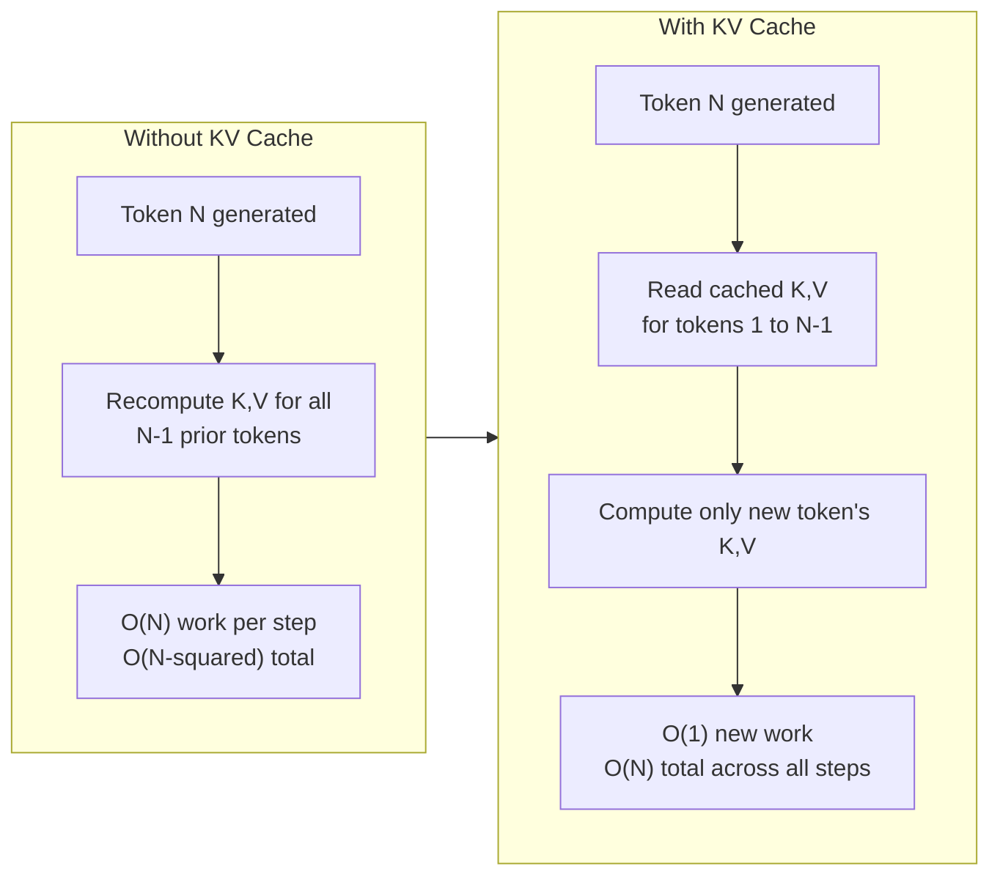
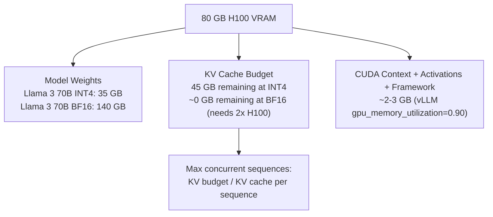
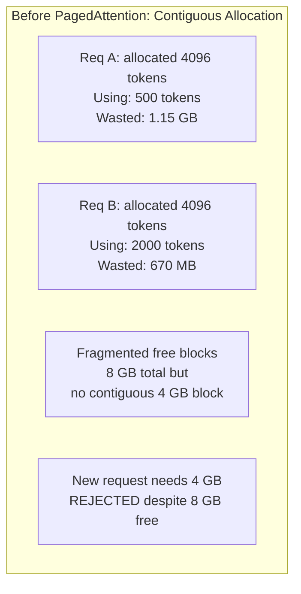
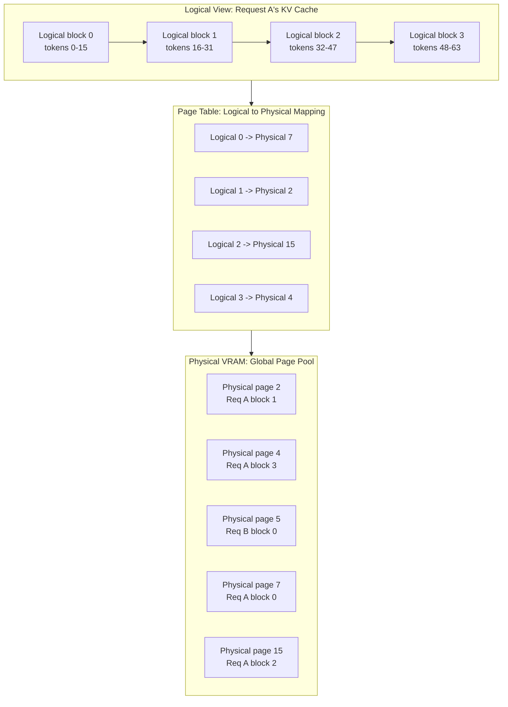
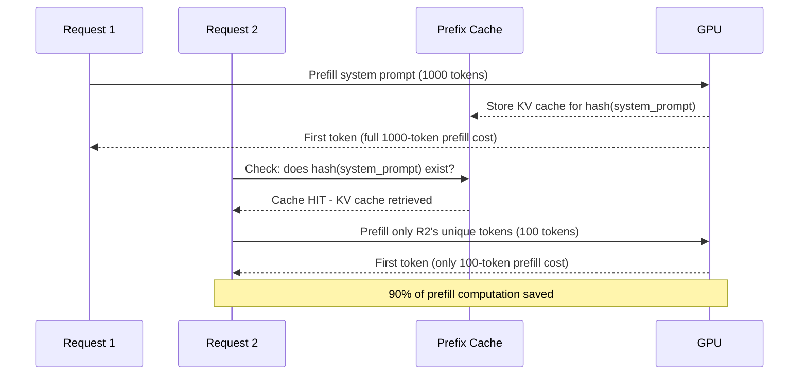
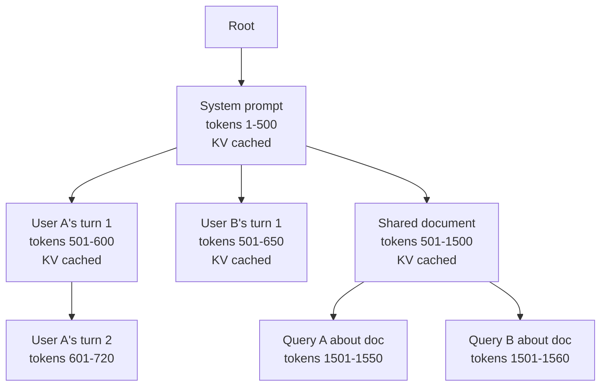
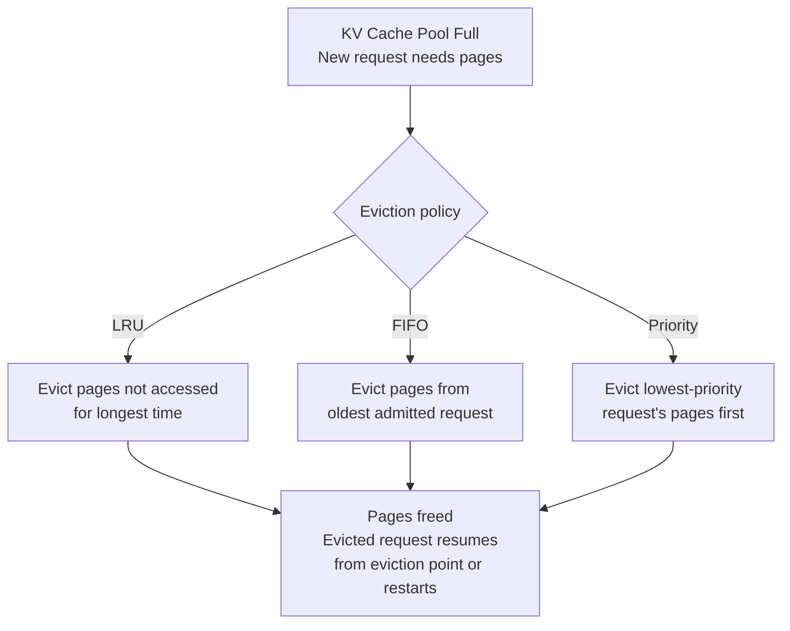
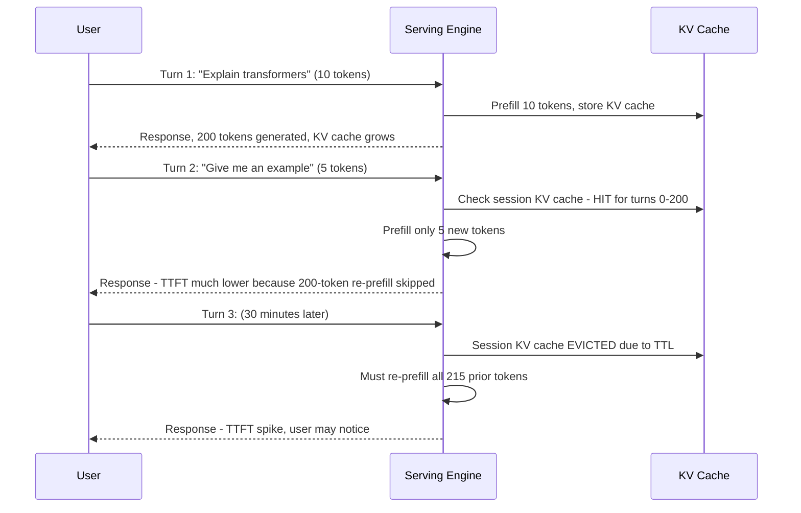
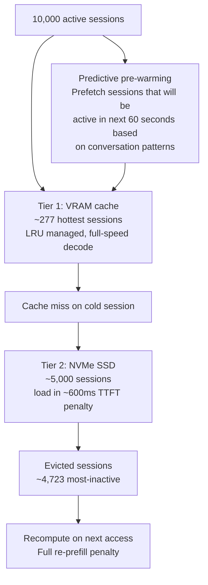

# KV Cache Management

## Overview

The KV cache is the data structure that makes autoregressive decoding computationally tractable at production scale — and the binding memory constraint in virtually every production LLM serving system. Not the model weights, not the activations: the KV cache. On a system serving 100 concurrent 4,096-token sequences, a 70B model's KV cache consumes more VRAM than the model weights themselves. Understanding KV cache arithmetic, the fragmentation problem it creates, and the management techniques that solve it is prerequisite knowledge for any capacity planning, architecture, or performance debugging conversation involving LLMs.

This chapter covers: the mathematical foundation, the memory arithmetic every engineer must know, PagedAttention's solution to the fragmentation problem, prefix sharing techniques, eviction policies, and the emerging techniques (quantized KV cache, multi-turn persistence) that push utilization further.

See also: [Model Serving Architecture](01-model-serving-architecture.md), [Batching & Continuous Batching](02-batching-and-continuous-batching.md), [Context Window Budgeting](../04-context-engineering/02-context-window-budgeting.md), and [Context Compression and Summarization](../04-context-engineering/03-context-compression-and-summarization.md).

---

## What the KV Cache Is and Why It Exists

In the transformer attention mechanism, each token computes three vectors: a **query** (Q), a **key** (K), and a **value** (V). During the prefill pass, all input tokens compute their Q, K, and V simultaneously. During decode, to generate token N, the model must compute attention between token N's query and the keys and values of all previous tokens 1..N-1.

Without caching, generating token N requires recomputing K and V for all previous tokens at every decode step:

- Generating token 1: compute K, V for 0 prior tokens → 1 attention operation
- Generating token 2: recompute K, V for token 1 → 1 attention operation
- Generating token N: recompute K, V for all N-1 prior tokens → O(N) work

Total work for generating N tokens = O(1 + 2 + ... + N) = **O(N²)**

The KV cache stores the key and value tensors for all previously processed tokens. Each decode step only needs to compute the new token's K and V, then perform attention against the cached tensors:

- Generating token N: K/V already cached for tokens 1..N-1 → O(N) attention lookup, O(1) new computation

Total work with caching = **O(N)** — a fundamental reduction from quadratic to linear.



---

## KV Cache Size: The Arithmetic Every Engineer Must Know

KV cache memory per token is a direct function of model architecture:

```
KV cache per token = num_layers × num_kv_heads × head_dim × 2 (K and V) × dtype_bytes
```

### Representative Model Calculations

**Llama 3 8B (BF16, 2 bytes/param)**:
- 32 layers × 8 KV heads × 128 head_dim × 2 × 2 bytes = **131 KB per token**

**Llama 3 70B (BF16)**:
- 80 layers × 8 KV heads × 128 head_dim × 2 × 2 bytes = **327 KB per token**

**Llama 3 70B at different context lengths**:

| Sequence length | KV cache per sequence | Max concurrent seqs on 45 GB |
|---|---|---|
| 512 tokens | 163 MB | 275 |
| 2,048 tokens | 654 MB | 69 |
| 4,096 tokens | 1.3 GB | 34 |
| 8,192 tokens | 2.6 GB | 17 |
| 32,768 tokens | 10.5 GB | 4 |

A 10x increase in sequence length reduces concurrent capacity by 10x. This is the direct tradeoff that long-context products must plan for explicitly.

### The VRAM Partition



This diagram illustrates why quantizing weights is primarily valuable for enabling larger KV cache budgets (more concurrency) on a fixed GPU, not just for reducing weight-read latency. Moving a 70B model from BF16 to INT4 frees ~105 GB — enough for ~200 additional concurrent 4K-token sequences.

---

## The Memory Fragmentation Problem

Before PagedAttention, serving engines pre-allocated a contiguous block of VRAM for each request's KV cache at request arrival time. The CUDA memory allocator requires contiguous blocks — you cannot give a request a scattered collection of free memory fragments.

This caused two forms of waste:

**Internal fragmentation**: A request allocated for a maximum of 4,096 tokens but generating only 500 tokens holds 3,596 tokens' worth of KV cache memory as idle reserved space for its entire duration. For a Llama 3 70B request: 3,596 × 327 KB ≈ 1.15 GB wasted per request.

**External fragmentation**: Many small free blocks scattered through VRAM cannot satisfy a request that needs one large contiguous block, even if the total free memory is sufficient. A GPU with 8 GB of free VRAM in 100 scattered 80 MB fragments cannot admit a request requiring 4 GB of contiguous KV cache.



Both forms directly reduce the number of concurrent requests the GPU can serve — and they compound: a 50% internal fragmentation rate on top of 20% external fragmentation can reduce effective concurrency to under 40% of the theoretical maximum.

---

## PagedAttention: Virtual Memory for KV Cache

PagedAttention (Kwon et al., vLLM 2023) applies operating system virtual memory principles to KV cache management. The key insight: the attention computation can address non-contiguous physical memory if a page table maps logical token positions to physical page locations — exactly as a CPU's MMU maps virtual addresses to physical RAM pages.

### Architecture

Instead of pre-allocating contiguous blocks, the KV cache is divided into fixed-size **pages** (also called blocks — typically 16 or 32 tokens per page). The KV cache for each request consists of pages assigned from a global pool of free pages. Pages from different requests can be physically non-contiguous in VRAM.



### Eliminating Fragmentation

**Internal fragmentation eliminated**: Pages are allocated on demand, one page at a time, as the request generates new tokens. A request is never allocated more pages than it has filled. If a request generates 500 tokens and each page holds 16 tokens, it holds exactly 32 pages — not 256 pages pre-allocated for its maximum length.

**External fragmentation eliminated**: All free VRAM is uniformly a pool of free pages of equal size. There are no gaps of varying sizes. Any request that needs one more page can be given any free page from the pool, regardless of where it is physically located.

### Copy-on-Write for Prefix Sharing

PagedAttention enables safe sharing of KV cache pages between requests with identical prefixes (such as a shared system prompt). The pages for the shared prefix are marked read-only and reference-counted. When a request modifies (appends to) a shared page, it triggers a copy-on-write: the page is copied to a new physical location before being modified, preserving the original for other requests that still share it.

---

## Prefix Caching: Computing the Prompt Once

Many requests share a common prefix — a system prompt, a few-shot example block, a shared document context. Without prefix caching, every request recomputes the KV cache for the shared prefix from scratch during prefill, paying the full prefill cost every time.

**Prefix caching** stores the KV cache for a prefix in a dedicated cache keyed by a hash of the prefix tokens. Subsequent requests with the same prefix find their prefix's KV cache already computed and stored, skipping the prefill computation for those tokens entirely.



### Cache Hit Rate and Cost Savings

Cache hit rate depends on how much traffic shares the same prefix. A system prompt present in every request achieves 100% hit rate on the system prompt portion. Anthropic and OpenAI both charge discounted rates for prompt cache hits — approximately 10x cheaper than fresh prefill tokens.

### Cache Invalidation

The prefix cache must be invalidated when the prefix changes. This means prompt cache efficiency falls to zero if system prompts are dynamically generated (e.g., templated with per-user state that changes frequently). The architecture decision: keep system prompts static across users (shared cache, full savings) vs. per-user dynamic prompts (no cache, full prefill cost every time).

---

## Prefix Sharing via RadixAttention

RadixAttention (SGLang, 2024) extends prefix caching beyond a fixed prefix to any common prefix among concurrent requests, using a **radix tree** (trie) to efficiently match shared prefixes of arbitrary length.

### The Radix Tree Data Structure

A radix tree stores KV cache entries indexed by token sequences. Each path from root to leaf represents a token sequence; each node stores a reference to the KV cache pages for that sequence segment. When a new request arrives, it navigates the tree matching its tokens against cached branches until it finds the longest matching prefix.



In this tree, two different users querying the same shared document (10,000 tokens) can both reference the same physical KV cache pages for those 10,000 tokens. The pages are stored once; both requests read from them. This is an O(N) savings for N requests sharing the same document context.

### Memory Efficiency of RadixAttention

Without RadixAttention: 10 requests each with a 10,000-token shared document → 10 × (10,000 × 327 KB) = **32.7 GB** of KV cache for the document alone.

With RadixAttention: 1 copy of the shared document KV cache → **3.27 GB**, shared by reference across all 10 requests. The remaining 9 copies are freed for other requests' unique tokens.

---

## Eviction Policies Under Memory Pressure

When the KV cache pool is full and a new request needs pages, the scheduler must evict some existing pages to make room. The eviction policy determines which requests' KV cache pages are freed, and consequently which requests are disrupted.

### Eviction Policy Comparison

**LRU (Least Recently Used)**: Evict pages that have not been accessed for the longest time. LRU is generally good at protecting recently active requests while evicting pages from completed or paused sequences. The weakness: it may evict pages from a nearly-complete long request that would have freed its memory in 2 more decode steps anyway.

**FIFO (First In, First Out)**: Evict the oldest admitted request's pages first. Simpler than LRU and good for workloads with roughly uniform sequence lengths, where the oldest request is typically closest to completion.

**Priority-aware eviction**: High-priority requests (premium tier, real-time voice) have their pages protected from eviction. Low-priority requests are evicted first. This requires the scheduler to maintain explicit priority metadata per request.



### What Happens to Evicted Requests?

An evicted request has two recovery paths:

**Recomputation (restart)**: The request is restarted, replaying the prefill from scratch using the original input tokens. This adds latency equal to the full prefill time. It is faster when the context is short (prefill takes < 1 second) and when CPU offloading bandwidth is insufficient to restore the cache faster than recomputation.

**CPU offloading (swapping)**: The KV cache pages are moved to CPU DRAM via PCIe. When the request resumes, the pages are loaded back. PCIe bandwidth is ~32 GB/s — moving 1 GB of KV cache takes ~30ms. CPU offloading is faster than recomputation for long contexts where re-prefilling would take hundreds of milliseconds, and the CPU DRAM is large enough to absorb the evicted pages.

| Context length | Recomputation time | CPU swap time (32 GB/s) | Preferred |
|---|---|---|---|
| 512 tokens | ~50ms | ~5ms | Swap |
| 2,048 tokens | ~150ms | ~20ms | Swap |
| 8,192 tokens | ~400ms | ~80ms | Swap |
| 32,768 tokens | ~1,500ms | ~330ms | Swap |

For almost all production contexts, CPU offloading is faster than recomputation.

---

## KV Cache for Multi-Turn Conversations

A multi-turn conversation is a long concatenated sequence: each new user turn appends to the end of the prior context. If turn N-1's KV cache is retained on the serving engine, turn N only needs to prefill the new tokens since the last turn (the user's latest message), dramatically reducing TTFT for follow-on turns.



### Session KV Cache Management

Per-session KV cache retention trades VRAM against TTFT improvements for multi-turn users. The management challenges:

**Accumulation**: Active sessions grow their KV cache with every turn. A 20-turn conversation at 200 tokens/turn = 4,000 tokens of accumulated KV cache. For 100 concurrent active sessions on Llama 3 70B: 100 × 4,000 × 327 KB = **128 GB** — more than one H100's total VRAM.

**TTL-based eviction**: Sessions that have been inactive for a configurable time window (e.g., 10 minutes) have their KV cache evicted. When the user returns, the first request of the new session pays the full re-prefill cost. This is the right tradeoff for most deployments — the memory cost of retaining cold session KV caches across thousands of idle users far exceeds the TTFT benefit for the occasional user who returns.

---

## Quantized KV Cache

The KV cache tensors themselves can be quantized to reduce VRAM consumption independently of weight quantization.

### Why KV Cache Quantization is Different from Weight Quantization

Weight quantization stores model parameters at lower precision. The dequantization happens once per forward pass and the error is absorbed into the model's learned representations.

KV cache quantization stores intermediate attention state at lower precision. The error affects every attention computation that reads the cached tensors — this is a direct perturbation to the attention mechanism and can degrade output quality in ways that weight quantization does not.

### FP8 KV Cache: The Current Standard

FP8 KV cache (E4M3 format) halves the KV cache memory vs. BF16 while maintaining acceptable quality. On H100, FP8 KV cache is read by native FP8 tensor cores, providing a memory bandwidth reduction (half the data read per attention step) with minimal additional compute overhead.

| KV cache precision | Memory per token (70B) | Quality impact | Notes |
|---|---|---|---|
| BF16 | 327 KB | Baseline | Default in most engines |
| FP8 E4M3 | 163 KB | Minimal, typically < 0.5% perplexity | Native on H100 |
| INT8 | 163 KB | Small | Requires careful scale factor management |
| INT4 | 82 KB | Noticeable on long contexts | Limited production adoption |

FP8 KV cache effectively doubles the maximum batch size at constant VRAM budget — at the cost of a very small quality regression that is usually within acceptable bounds. It is increasingly standard on H100 deployments.

---

## Interview Questions

### Beginner

**Q: What is the KV cache and why does it exist?**

The KV cache stores the key and value tensors computed by the transformer's attention mechanism for all previously processed tokens. Without it, generating token N requires recomputing the keys and values for all N-1 prior tokens — O(N²) total work for an N-token output. With the KV cache, each decode step only computes the new token's key and value, then performs attention against the cached tensors — O(N) total work. The cache trades VRAM for a fundamental reduction in computational complexity that makes production-scale generation tractable.

**Q: What is the KV cache size formula, and why does it matter for capacity planning?**

KV cache per token = num_layers × num_kv_heads × head_dim × 2 (K and V) × dtype_bytes. For Llama 3 70B at BF16: 80 × 8 × 128 × 2 × 2 = 327 KB per token. At 4,096 tokens per sequence, that's 1.3 GB per concurrent request. On an 80 GB GPU with 35 GB of INT4 weights, 45 GB remains for KV cache — enough for ~34 concurrent 4,096-token sequences. This calculation is the foundation of all serving capacity planning: more concurrent requests means more KV cache, and KV cache — not compute — is almost always the binding constraint.

---

### Intermediate

**Q: What problem does PagedAttention solve, and how?**

Before PagedAttention, serving engines pre-allocated contiguous VRAM blocks for each request's maximum possible KV cache at request arrival. This caused two problems: internal fragmentation (a request allocated for 4,096 tokens but generating 500 tokens wastes 3,596 tokens' worth of VRAM for its entire duration) and external fragmentation (scattered free blocks can't satisfy a request needing one large contiguous block).

PagedAttention applies OS virtual memory principles: the KV cache is divided into fixed-size pages. Pages from different requests can be physically non-contiguous in VRAM. A page table maps each request's logical token positions to physical page locations. Requests are allocated pages on demand as they generate tokens — no pre-allocation, no wasted reserved space. The result is dramatically better VRAM utilization and higher maximum concurrent batch size.

**Q: Explain prefix caching and RadixAttention. When does each provide the most benefit?**

Prefix caching stores the KV cache for a shared prefix (typically a system prompt) keyed by a hash of the prefix tokens. Any request whose prompt starts with that prefix can skip its prefill and reuse the cached KV tensors directly — typically a 10-90% TTFT reduction depending on what fraction of the total context is shared. Prefix caching is most valuable when a large, static system prompt is present in every request (e.g., a product assistant with extensive instructions).

RadixAttention (SGLang) generalizes this to arbitrary shared prefixes using a radix tree. Rather than caching only one predefined prefix, it caches any prefix that has been computed and matches new requests via trie traversal. This is most valuable for document-grounded workloads where multiple users query the same large document context — the 10,000-token document KV cache is stored once and referenced by all concurrent queries against it. RadixAttention delivers O(N) memory savings for N requests sharing a prefix.

---

### Senior

**Q: A production system has high KV cache utilization (>90%) with frequent evictions. Describe the failure mode and two distinct remediation approaches.**

At high KV cache utilization, new requests can only be admitted after evicting existing ones. The eviction itself takes time (CPU swap or recomputation of the evicted request), and the evicted request's TTFT spikes when it resumes. This creates a vicious cycle: high utilization → eviction → re-admission → re-eviction, causing significant TTFT variance and tail latency degradation without necessarily increasing average latency.

**Remediation 1 — Reduce KV cache consumption**: (a) Quantize KV cache from BF16 to FP8, doubling the effective KV budget; (b) reduce `max_model_len` to match p95 production sequence lengths, preventing rarely-needed long-context reservations from consuming disproportionate pages; (c) enable prefix caching for shared system prompts to avoid storing duplicate KV data.

**Remediation 2 — Improve admission control**: Instead of optimistically admitting requests and evicting under pressure, use proactive admission control: estimate the request's likely KV cache consumption at admission time (from prompt length and a predicted output length distribution), and queue or reject requests when admitting them would push utilization above a safe threshold (e.g., 80%). This trades higher queue depth for smoother, eviction-free execution.

**Q: How would you implement session-level KV cache persistence for a multi-turn chat product? What are the memory management challenges?**

Implementation: associate each conversation session with a session ID. After each turn, serialize the KV cache to fast NVMe storage (not just keep it in VRAM). On subsequent turns, load the KV cache back to VRAM before adding new tokens. The serving engine only needs to prefill the new turn's tokens rather than the full conversation history.

Memory challenges: (a) **VRAM vs. NVMe latency tradeoff**: loading a 2 GB session KV cache from NVMe takes ~600ms at 3 GB/s — this can dominate TTFT for turns with short new messages; (b) **session accumulation**: without TTL enforcement, session KV caches grow indefinitely and NVMe storage fills; (c) **format compatibility**: session KV caches must be re-loadable if the serving engine version changes (new quantization, new page size) — versioning the KV cache format adds operational complexity; (d) **hot session management**: frequently active sessions should be pinned in VRAM; cold sessions should be evicted to storage. The decision boundary (how many active sessions to keep warm in VRAM) is the key tuning parameter.

---

### Staff

**Q: Design the KV cache management system for a serving fleet handling 10,000 concurrent multi-turn conversations, each averaging 8 turns of 500 tokens each. Model: Llama 3 70B BF16. Fleet: 8× H100 GPUs. What fits in VRAM, what goes to NVMe, and what gets evicted?**

First, the arithmetic:

- KV cache per token: 80 × 8 × 128 × 2 × 2 = 327 KB
- Average session after 8 turns × 500 tokens: 4,000 tokens → 1.3 GB per session
- 10,000 sessions: 13 TB total KV cache if all sessions are hot
- Fleet VRAM: 8 × 80 GB = 640 GB total; minus weights (8 × 140 GB BF16 = 1.12 TB — doesn't fit)

This reveals the first constraint: BF16 70B doesn't fit on 8× H100 without tensor parallelism. Switch to INT4 (35 GB/GPU after TP across 8 GPUs): 8 × (80 - 35) = 360 GB for KV cache fleet-wide. At 1.3 GB per session, VRAM holds ~277 sessions hot.

The system design:



Key decisions: (1) FP8 KV cache doubles the VRAM tier capacity to ~554 sessions with minimal quality loss; (2) NVMe tier handles sessions inactive for >5 minutes — the NVMe load latency (~600ms) is hidden behind the user typing their next message in most interactive chat sessions; (3) sessions inactive for >30 minutes are dropped from NVMe and recomputed on next access; (4) predictive pre-warming (loading the NVMe-tier KV cache for sessions whose users are actively typing, detected by WebSocket activity signals) hides the NVMe load latency behind user input time.

---

## Google-Level Follow-Ups

**"Why does quantizing model weights not solve the KV cache memory problem?"**
Tests: whether the candidate understands that KV cache and model weights are separate VRAM consumers that must each be managed independently.

Weight quantization (e.g., INT4) shrinks the model weight footprint but has no direct effect on the KV cache, which is computed from BF16 activations during the forward pass and stored separately. Quantizing weights from BF16 to INT4 frees ~105 GB on a 70B model, which can then be used for KV cache. But the KV cache itself remains BF16 until explicitly quantized via KV cache quantization (FP8, INT8). The two optimizations are independent and complementary — weight quantization frees budget, KV cache quantization uses that budget more efficiently.

**"PagedAttention claims to eliminate fragmentation. Does it truly eliminate it, or does some form of fragmentation remain?"**
Tests: deep understanding of how paged allocation works in practice.

Paged allocation eliminates external fragmentation (no more unusable gaps between allocations) and nearly eliminates internal fragmentation (pages are allocated on demand, so waste is bounded by at most one unfilled page per request — for 16-token pages, maximum internal fragmentation is 15 tokens' worth of KV cache per request). In practice, a small amount of fragmentation remains: (1) the last partially-filled page of each request wastes up to page_size - 1 tokens of KV cache; (2) prefix-shared pages are reference-counted and cannot be freed until all referencing requests complete, holding pages in use even after some referencing requests are done; (3) page table overhead (the mapping structure itself) consumes a small amount of VRAM that grows with the number of active sequences.

**"How would the KV cache architecture change if you needed to support 1M-token contexts?"**
Tests: ability to extend current techniques to extreme scale.

At 1M tokens, a single Llama 3 70B sequence's KV cache is: 327 KB × 1,000,000 = **327 GB** — more than four H100s just for one sequence's KV cache. This requires: (1) KV cache offloading to CPU DRAM or NVMe as a primary mechanism, not a fallback — with streaming attention that loads pages from CPU to GPU on demand during the attention computation; (2) KV cache compression (using attention sinks and sliding window patterns where only the most relevant KV cache pages are kept fully resident, with the rest compressed or dropped); (3) model architecture changes — MLA (Multi-head Latent Attention, used in DeepSeek V2) compresses the KV cache by projecting keys and values through a low-rank bottleneck, reducing KV cache by 5-13x at the model architecture level; (4) distributed KV cache across multiple GPUs using KV cache disaggregation.

**"Walk me through what happens to a request when the KV cache eviction policy triggers. Include all the state that needs to be restored."**
Tests: operational depth on what eviction actually means.

When a request's KV cache pages are evicted: (1) the page table entries for the evicted request are marked invalid; (2) the physical pages are returned to the free pool for immediate reuse by other requests; (3) the evicted request is moved to a suspended state in the scheduler queue with its metadata (original prompt tokens, generation config, output tokens generated so far) preserved; (4) when the evicted request is re-scheduled (based on priority policy), two recovery paths: recomputation — the scheduler replays the prefill from scratch using the preserved prompt tokens and previously generated output tokens (the full context = original prompt + all generated tokens to date); or CPU swap — if the pages were swapped to CPU DRAM rather than freed, they are loaded back to GPU VRAM and the page table is restored. The caller never sees the eviction — they simply observe a TTFT spike when the request resumes.

---

## Common Mistakes

1. **Planning capacity based on model weights alone, ignoring KV cache.** This is the most common capacity planning error. A fleet appears to have sufficient VRAM for the model, then runs out of headroom for KV cache under moderate load. Budget VRAM for weights + KV cache + overhead together.

2. **Assuming prefix caching works for dynamic system prompts.** A system prompt templated with per-user variables (name, preferences, session state) produces a different hash on every request. Prefix caching degrades to zero effectiveness. Keep the static portion of system prompts separate from the dynamic portion and only cache the static part.

3. **Conflating weight quantization with KV cache memory savings.** INT4 weights shrink the weight footprint. BF16 KV cache remains BF16 unless separately configured. Observing that INT4 quantization "freed 100 GB" and assuming that means 100 GB more for KV cache is correct — but the KV cache itself is still as large as before per sequence; only the budget has grown.

4. **Setting max_model_len to the model's theoretical maximum (128K, 1M tokens).** This reserves proportionally large page table entries and blocks the scheduler from accurately estimating KV cache consumption at admission time. Set max_model_len to p99 of actual production sequence lengths, with a headroom multiplier. Running at 128K-token max_model_len when p99 is 4,000 tokens wastes 97% of the page table address space and leads to pessimistic admission control.

5. **Ignoring the KV cache transfer cost in disaggregated serving.** Moving a 10 GB KV cache from prefill server to decode server takes ~300ms at PCIe speeds. This transfer time is part of the TTFT budget for that request and must be accounted for in SLO calculations.

6. **Not monitoring KV cache hit rate alongside TTFT.** A TTFT spike that looks like increased load is often a prefix cache eviction under memory pressure. Without a separate KV cache hit rate metric, this failure mode is invisible in standard metrics dashboards.

---

## Key Takeaways

- **The KV cache is almost always the binding VRAM constraint**, not model weights — capacity planning must start with the KV cache budget, not GPU count.
- **KV cache size is directly computable**: layers × kv_heads × head_dim × 2 × dtype_bytes per token; at production scale this exceeds model weights for long-context, high-concurrency workloads.
- **PagedAttention eliminates fragmentation** by applying OS virtual memory principles to KV cache management — the single most important serving engine innovation for enabling large-batch continuous batching in practice.
- **Prefix caching and RadixAttention** turn repeated prefix computation from a full prefill cost into a cache hit — essential for any system with shared system prompts or multi-user document contexts.
- **FP8 KV cache is the practical sweet spot** for H100 deployments: 2x memory reduction with minimal quality impact, native hardware acceleration, and no operational complexity beyond weight quantization.
- **Session KV cache management** for multi-turn products requires explicit TTL-based eviction and NVMe tiering — the VRAM cost of retaining all active sessions hot is proportional to session count × session length × KV cache per token, and cannot scale to thousands of sessions without a tiered approach.

---

*Part of [Model Serving](index.md) · [Model Serving Architecture](01-model-serving-architecture.md) · [Batching & Continuous Batching](02-batching-and-continuous-batching.md) · [Context Window Budgeting](../04-context-engineering/02-context-window-budgeting.md) · [RAG Architecture](../06-rag/01-rag-architecture.md)*
