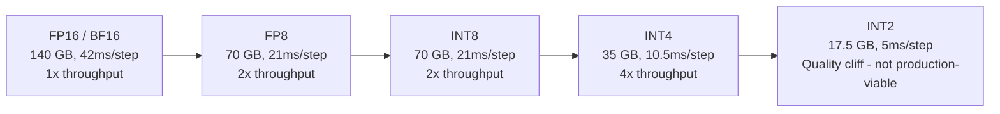
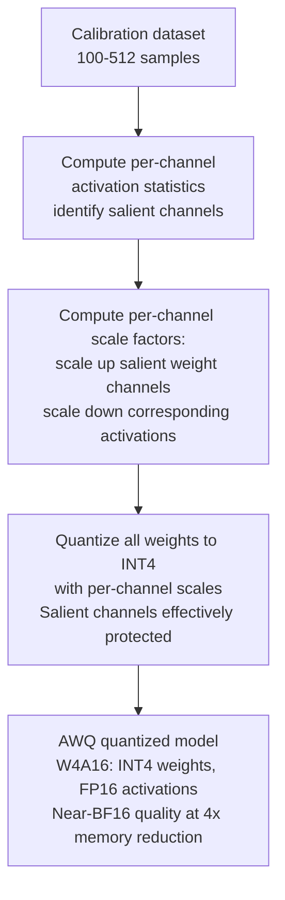
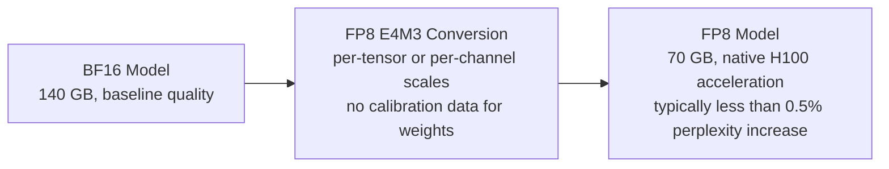
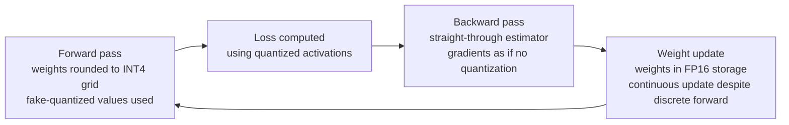
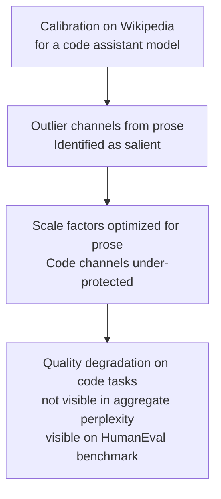
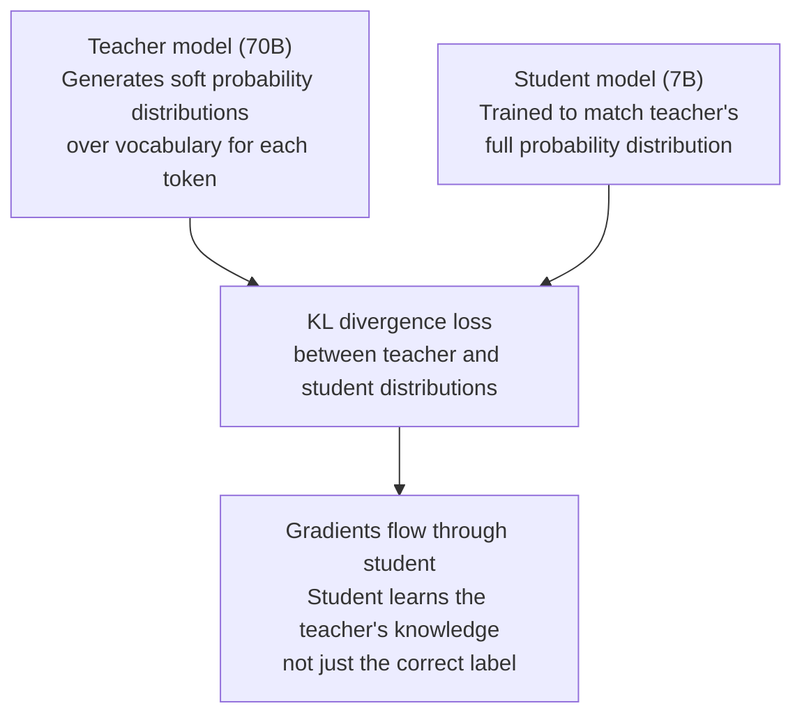
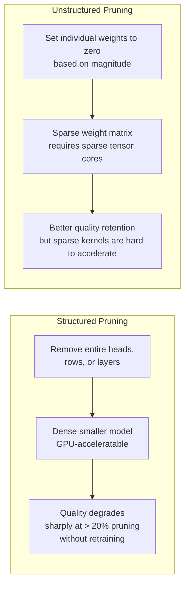
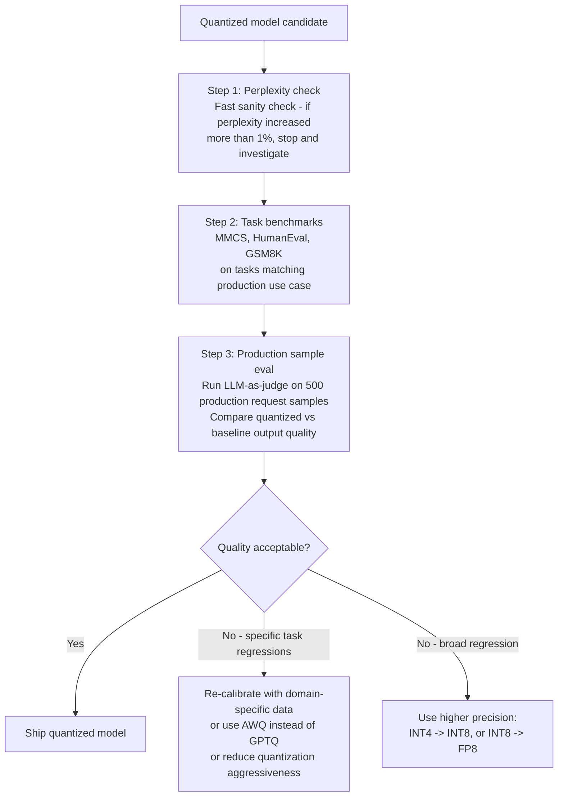

# Quantization & Compression

## Overview

A 70B model at FP16 requires 140 GB of VRAM and runs on two H100s at $16/hour. The same model at INT4 fits in 35 GB, runs on a single GPU at $8/hour, and generates tokens 4x faster during decode — because decode is memory-bandwidth-bound, and reading 35 GB is 4x faster than reading 140 GB per decode step. Understanding which technique achieves which result, where quality is lost, and how to measure that loss is the core skill this chapter covers.

This is not an abstract precision-vs-quality tradeoff. It is a direct engineering decision that determines hardware cost, serving throughput, and deployment feasibility for every production LLM system. A model that doesn't fit on one GPU cannot be served from one GPU. A model with unacceptable quality at INT4 cannot be shipped at INT4 regardless of the cost savings. The chapter walks the precision ladder from top to bottom, then covers each compression technique with the specificity needed to apply it correctly.

See also: [Model Serving Architecture](01-model-serving-architecture.md), [KV Cache Management](03-kv-cache-management.md), and [The Inference Stack](../14-ai-infrastructure/02-the-inference-stack.md).

---

## Why Weight Quantization Helps More Than You'd Expect

LLM serving during decode is dominated by one operation: reading model weights from VRAM. Each decode step generates one new token, which requires computing that token's attention (a small operation), but first requires loading the entire model's weight matrices from HBM to compute the forward pass. The bottleneck is memory bandwidth, not arithmetic.

The fundamental relationship:

```
Decode step latency ≈ model_size_bytes / GPU_memory_bandwidth
```

For a 70B model on an H100 (3.35 TB/s HBM3):

| Precision | Model size | Decode step latency | Throughput vs FP16 |
|---|---|---|---|
| FP16 | 140 GB | 42ms | 1x |
| BF16 | 140 GB | 42ms | 1x |
| FP8 | 70 GB | 21ms | 2x |
| INT8 | 70 GB | 21ms | 2x |
| INT4 | 35 GB | 10.5ms | 4x |

The 4x throughput improvement from INT4 comes entirely from reading fewer bytes per decode step — without changing any arithmetic. This is why quantization is often the highest-leverage single optimization available: it simultaneously reduces hardware cost (smaller model, fewer GPUs needed) and increases serving throughput (fewer bytes to read per step) with no hardware changes.



---

## The Precision Ladder

### FP32: 4 bytes/parameter

Standard floating point, the default training precision for most frameworks. Never used for inference serving — 2x the memory of BF16 with no quality benefit at inference time. FP32 persists in some legacy systems and in mixed-precision training where certain operations require it, but for serving it is strictly a waste of memory bandwidth.

### BF16 and FP16: 2 bytes/parameter

**BF16** (Brain Float 16): 8 exponent bits, 7 mantissa bits. Same dynamic range as FP32 (8 exponent bits vs FP32's 8 exponent bits), truncated mantissa. The standard serving format for frontier models. Native hardware acceleration on A100 and H100 tensor cores. Quality: indistinguishable from FP32 at inference.

**FP16**: 5 exponent bits, 10 mantissa bits. Higher precision than BF16 (10 vs 7 mantissa bits) but narrower dynamic range (5 vs 8 exponent bits). Some models pre-trained in FP16 can show numerical instability in BF16 if their activations exceed FP16's dynamic range. For most modern models (Llama 3, Mistral, Gemma), BF16 and FP16 are interchangeable in quality.

At 2 bytes/parameter, a 70B model uses 140 GB — requiring two A100s or H100s in tensor parallel.

### FP8: 1 byte/parameter

Two variants:
- **E4M3**: 4 exponent bits, 3 mantissa bits. Higher precision, smaller dynamic range. Preferred for weights and activations.
- **E5M2**: 5 exponent bits, 2 mantissa bits. Lower precision, larger dynamic range. Preferred for gradients during training.

FP8 has native hardware acceleration on H100 tensor cores. It is the sweet spot for H100 production deployments: 2x throughput vs BF16, typically <0.5% perplexity increase, and deployment complexity is minimal (often a single format conversion, no calibration dataset needed for weights).

**FP8 W8A8**: both weights and activations in FP8 — the dominant H100 production quantization approach.

### INT8: 1 byte/parameter

8-bit integer. Requires dequantization to FP16 for matrix multiply on most hardware because CUDA's standard tensor cores operate in FP16; INT8 tensor cores exist on A100/H100 but require careful operator implementation. Quality: typically 0.5–2% perplexity increase over BF16, though the variance is task-dependent.

Two important INT8 approaches:
- **LLM.int8()** (bitsandbytes): The original viable INT8 approach for LLMs. Key insight: a small subset of weight channels (typically < 1%) have abnormally large magnitudes — "outlier" channels — that dominate quantization error if quantized naively. LLM.int8() identifies these channels and keeps them in FP16, quantizing the rest to INT8.
- **SmoothQuant**: Addresses the same outlier problem for W8A8 (both weights AND activations at INT8). The challenge: activation outliers are larger than weight outliers, making INT8 activations more lossy. SmoothQuant mathematically migrates quantization difficulty from activations to weights (which can tolerate it better) by multiplying activations by a per-channel scale factor and dividing weights by the same factor — the product is unchanged, but the scale is now in the weights, which handle it better.

### INT4: 0.5 bytes/parameter

The dominant format for consumer GPU and edge deployment, and increasingly for production cloud serving where quality tolerance allows it. INT4 requires runtime dequantization (reading 4-bit weights, expanding to FP16 for the actual matrix multiply). The dequantization overhead is small relative to the memory bandwidth savings for large models.

Quality: 1–4% perplexity increase vs BF16. The variance is significant — some tasks show minimal degradation at INT4, others (factual recall, long-context reasoning) degrade more. Always task-evaluate before shipping.

---

## Post-Training Quantization Methods

Post-training quantization (PTQ) quantizes an already-trained model without additional training. No GPU-hours of fine-tuning required — just calibration.

### AWQ: Activation-aware Weight Quantization

AWQ (Lin et al., 2023) is the leading PTQ method for W4A16 (INT4 weights, FP16 activations) quantization. The core insight: not all weights are equally important for output quality. A small subset of weights — those corresponding to activation channels with large magnitudes — are "salient": perturbing them causes disproportionate quality loss.

AWQ identifies these salient weights by analyzing activation statistics on a calibration dataset. Instead of quantizing all weights uniformly to INT4, it applies per-channel scale factors that effectively protect the salient weights by scaling them up before quantization (and scaling the corresponding activations down to compensate). The result: salient channels are represented at effectively higher precision within the INT4 encoding.



AWQ consistently outperforms GPTQ on quality benchmarks at the same bit-width and is the recommended default for INT4 production quantization.

### GPTQ: Gradient-Based PTQ

GPTQ (Frantar et al., 2022) performs layer-by-layer quantization using second-order gradient information (approximate Hessian) to minimize the quantization error for each layer. It processes each layer independently, quantizing rows of the weight matrix one at a time while minimizing the error using the Hessian to determine which rounding direction minimizes downstream loss.

GPTQ was the original standard for INT4 GGUF models and is widely supported. Quality is slightly lower than AWQ at INT4 for most models. Its main advantage: very long track record of production deployment and support across nearly every serving framework.

### SmoothQuant: W8A8 for INT8

SmoothQuant (Xiao et al., 2022) enables genuine W8A8 quantization (both weights and activations at INT8) by solving the activation outlier problem. For Transformer models, activation distributions are highly non-uniform: some channels have values 10–100x larger than the average, making INT8 quantization of activations very lossy with naive approaches.

SmoothQuant applies a mathematically equivalent transformation:

```
Y = (X · diag(s)^-1) · (diag(s) · W)
```

Where `s` is a per-channel smoothing factor chosen to balance the quantization difficulty between activations and weights. The result: smoother activation distributions that quantize well to INT8, at the cost of slightly less smooth weight distributions — which turn out to tolerate INT8 quantization much better than activations do.

### FP8 PTQ: The H100 Default

FP8 quantization on H100 is the simplest production quantization approach: convert BF16 weights to FP8 E4M3 with per-tensor or per-channel scale factors. The H100's tensor cores natively accelerate FP8 matrix multiplications. Quality loss is typically within noise (<0.5% perplexity). No second-order Hessian computation, no outlier protection needed — FP8 has sufficient dynamic range to represent transformer weights without special handling.



---

## Quantization-Aware Training

Quantization-aware training (QAT) fine-tunes the model with simulated quantization applied during training. The model learns to be robust to the quantization noise by adapting its weights during training.

### The Fake Quantization Trick

QAT applies "fake quantization" in the forward pass: weights are rounded to the nearest quantization grid (simulating INT4 or INT8 rounding), but the backward pass uses the original continuous gradients (the straight-through estimator). This allows gradients to flow through the quantization operation, enabling weight updates that minimize loss under quantization noise.



### QAT Quality and Cost

QAT consistently produces better quality than PTQ at the same bit-width. The model's weights adapt to minimize loss under the quantization constraints rather than being quantized post-hoc. The quality gap vs PTQ is typically 0.5–1.5% perplexity, but can be larger on specific tasks that are sensitive to quantization noise.

The compute cost is real: QAT requires a full training run with forward and backward passes. Typical cost is 0.5–2% of the original pre-training compute. For a 70B model, original training is ~10^23 FLOPs; QAT is ~10^21 FLOPs — equivalent to several hundred GPU-hours on A100s.

QAT is worth it for high-stakes deployments where PTQ quality loss is unacceptable and the team has fine-tuning infrastructure. For most products, well-calibrated AWQ provides sufficient quality at zero additional training cost.

---

## The Calibration Dataset Problem

PTQ methods require a calibration dataset to measure activation statistics (needed to compute scale factors and identify outlier channels). The calibration dataset is small (100–512 samples is typically sufficient — more doesn't materially improve calibration quality) but its distribution critically affects the quality of the resulting quantized model.

### Domain Mismatch: The Hidden Failure Mode

A model calibrated on a distribution mismatched to production inputs produces a quantization scheme optimized for the wrong distribution. The outlier channels identified by AWQ may be different channels for code inputs vs. Wikipedia text. The scale factors optimized for factual question-answering may compress mathematical notation in a way that degrades math reasoning.



The failure mode is insidious because aggregate perplexity (the standard calibration quality check) may not reflect the task-specific regression. A model quantized with Wikipedia calibration data may show <0.5% perplexity increase but a 5% HumanEval accuracy drop, because the code-relevant weight channels were under-protected.

**Practical guidance**: use calibration data drawn from the same distribution as production inputs. For a code assistant, calibrate on code. For a customer service bot, calibrate on domain-relevant conversations. For a general assistant, calibrate on a broad mixture matching production traffic.

---

## GGUF and llama.cpp: CPU-First Quantization

GGUF (formerly GGML) is the dominant format for CPU-based inference via llama.cpp. It enables serving LLMs on machines without GPU — MacBooks, Linux servers, Windows PCs — at the cost of significantly lower throughput than GPU serving.

### GGUF Naming Scheme

The GGUF naming convention encodes the quantization scheme:

| Format | Bits/weight | Description |
|---|---|---|
| Q4_K_M | 4 | K-quants group strategy, medium quality |
| Q4_K_S | 4 | K-quants group strategy, small (less overhead) |
| Q5_K_M | 5 | 5-bit, medium quality |
| Q6_K | 6 | 6-bit, near-lossless quality |
| Q8_0 | 8 | Simple INT8, high quality, large file |
| IQ2_XXS | 2 | Importance-matrix 2-bit, aggressive compression |

**K-quants** group weights into blocks of 256 and apply per-block scale factors, providing significantly better quality than per-tensor quantization at a small overhead cost (~4.1 bits effective for Q4_K_M rather than exactly 4.0 bits). The `M` (medium) vs `S` (small) vs `L` (large) suffix controls the granularity of the block quantization.

### Mixed-Precision GGUF

GGUF supports **mixed precision** within a single file: some layers (the embedding layer, the final output projection, and the first/last N transformer layers) are kept at Q8_0 or FP16 while the middle transformer layers are quantized to Q4. This protects the layers most sensitive to quantization at minimal additional memory cost.

### Why CPU Inference Matters

CPU inference serves three practical use cases: developer machines (no GPU required for testing), batch offline processing where GPU cost is unnecessary, and edge/on-device deployment. For a 7B Q4_K_M model on an Apple M3 Pro with 192 GB/s memory bandwidth: 4 GB model ÷ 192 GB/s ≈ 20ms per token — viable for interactive use. See [On-Device and Edge Inference](06-on-device-and-edge-inference.md) for device-specific details.

---

## Knowledge Distillation

Knowledge distillation is the most powerful model compression technique for achieving large quality/cost improvements — significantly more powerful than quantization at equivalent size reduction, at the cost of substantial training compute.

### How Distillation Works

A large **teacher model** generates probability distributions over the vocabulary for each token position. A smaller **student model** is trained to match those distributions (using KL divergence loss) rather than training on hard labels from a dataset alone.



### Why Distillation Beats Training Small Models from Scratch

A small model trained on raw next-token prediction learns from hard labels (one-hot correct token). A distilled student model learns from the teacher's full probability distribution over all vocabulary tokens — richer supervision that encodes the teacher's uncertainty, reasoning structure, and relative token preferences. The student trained on soft labels from a 70B teacher reaches quality comparable to a small model trained on 10x more data.

Examples: Llama 3.2 3B was distilled from a larger Llama 3 model; Phi-3.5 mini achieves 7B-class quality at 3.8B parameters via distillation.

### Distillation Compute Cost

Distillation requires running the teacher model forward pass on every training sample to generate soft targets. For a 70B teacher processing 100B tokens of training data, the teacher inference cost alone is ~2 × 10^21 FLOPs — comparable to training a 3B model from scratch. This is why distillation is not free: you need either cheap API access to the teacher or your own deployment of it.

---

## Pruning

Pruning removes weights, attention heads, or entire layers from an existing model. Despite being extensively successful for CNNs, pruning is significantly less effective for LLMs.

### Why LLM Pruning Is Hard

CNNs have high redundancy — many convolutional filters learn similar features. Transformer attention heads and MLP layers are more diverse and less redundant. Even modest pruning (20–30% of weights removed) causes significant quality degradation in LLMs without careful retraining.



### The Practical Recommendation

For LLM compression, the hierarchy is: **distillation > quantization >> pruning**. 

Distillation produces a genuinely smaller model with near-teacher quality. Quantization reduces the bit-width of an existing model with well-understood quality tradeoffs. Pruning produces irregular sparse tensors (unstructured) or degraded quality (structured) without the same quality-size efficiency as the first two.

Pruning is worth considering only in specific scenarios: extreme latency requirements where even quantized models are too slow, and research contexts where the computational budget for extensive retraining after pruning is available.

---

## Measuring Quality Regression After Compression

The wrong evaluation methodology is the most common way to ship a compressed model with invisible quality regressions.

### Why Perplexity Alone Is Insufficient

Perplexity measures average log-probability over a held-out text corpus. A 0.5 perplexity increase sounds small. But perplexity is an average over all token positions, including common function words (the, a, is) that are trivially predictable. The quality regression from quantization concentrates in rare, high-information tokens — complex vocabulary, factual names, mathematical notation — that are sparse in standard perplexity benchmarks but frequent in production use cases.

The result: a model with <1% perplexity increase can show 5–10% accuracy drop on factual retrieval benchmarks, or 3–5% drop on mathematical reasoning, because those tasks require high-precision representations of the exact tokens where quantization error concentrates.

### Task-Specific Benchmarks

| Task type | Benchmark | Sensitivity to quantization |
|---|---|---|
| Knowledge retrieval | MMLU, TriviaQA | Moderate — factual names/entities affected |
| Mathematical reasoning | GSM8K, MATH | High — numerical precision matters |
| Code generation | HumanEval, MBPP | High — syntax and API name precision |
| Instruction following | MT-Bench, IFEval | Moderate — format instructions less affected |
| Long context | RULER, NeedleInHaystack | High — INT4 degrades retrieval from long contexts |

### The Correct Evaluation Protocol



### Distribution Shift in Evaluation

Quality regressions from quantization are often task-specific and invisible in aggregate evaluation metrics. A general-purpose perplexity benchmark may show no regression while code generation on internal production samples drops significantly. Always include production-representative examples in the evaluation set — ideally actual sampled production traffic where privacy allows.

---

## Interview Questions

### Beginner

**Q: Why does INT4 quantization increase decode throughput, not just reduce memory?**

Decode is memory-bandwidth-bound: each decode step reads the full model weights from VRAM to compute one token's forward pass. The time per decode step ≈ model_size_bytes / GPU_memory_bandwidth. An INT4 model is 4x smaller than FP16 (35 GB vs 140 GB for 70B), so reading it from VRAM takes 4x less time per decode step. The arithmetic (matrix multiplications) is performed in FP16 after dequantizing the INT4 weights at runtime, but the bottleneck was never the arithmetic — it was the VRAM read. Four times fewer bytes read means four times more tokens per second.

**Q: What is the difference between PTQ and QAT, and when would you choose each?**

PTQ (post-training quantization) quantizes an existing trained model without additional training. It requires only a small calibration dataset (100–512 samples) to compute quantization scale factors. It is fast, cheap, and produces acceptable quality for most use cases. AWQ and GPTQ are the leading PTQ methods.

QAT (quantization-aware training) fine-tunes the model with simulated quantization applied during the forward pass, allowing the model's weights to adapt to the quantization noise. It produces better quality than PTQ at the same bit-width — typically 0.5–1.5% lower perplexity — but requires a full training run (0.5–2% of original pre-training compute). Choose PTQ by default; invest in QAT only when PTQ quality loss is unacceptable and the team has the training infrastructure and budget.

---

### Intermediate

**Q: What is the activation outlier problem and how does SmoothQuant address it?**

Transformer models produce highly non-uniform activation distributions: certain channels have values 10–100x larger than the average channel, creating "outlier" channels. Naive INT8 quantization of activations must accommodate these outliers in its numeric range, which wastes precision — the scale factor must cover the outlier range, leaving most of the INT8 range unused for the typical-magnitude channels.

SmoothQuant applies a mathematically equivalent per-channel rescaling: it multiplies each activation channel by a smoothing factor `s` and divides the corresponding weight channel by `s`. The scaling is absorbed into the weights during offline preprocessing — at inference time, activations are unscaled. By choosing `s` to equalize the activation channel magnitudes, the quantized activations now have a uniform distribution that maps efficiently to INT8. The weight channels can tolerate the resulting less-uniform distribution because weights vary more slowly and can be better calibrated offline.

**Q: A 70B model quantized from BF16 to INT4 shows < 1% perplexity increase but a 5% drop on HumanEval code generation. What's happening and how do you fix it?**

Perplexity averages over all token positions, including common function words that are trivially predictable. The quantization error concentrates in high-information tokens — uncommon vocabulary, specific method names, API signatures — which happen to be exactly what code generation requires. The model has degraded precision in exactly the positions that matter most for code quality but least for aggregate perplexity.

Fix options in order of preference: (1) **Re-calibrate with code data**: Re-run AWQ or GPTQ with a calibration dataset drawn from code rather than general text — the calibration will identify code-relevant channels as salient and protect them; (2) **Increase precision for sensitive layers**: Use Q5 or Q6 for the embedding and output layers which are most sensitive to vocabulary-level precision; (3) **Switch from INT4 to FP8 or INT8** for this use case if code quality is non-negotiable; (4) **Evaluate INT4 with different quantization methods** — AWQ may outperform GPTQ for code generation specifically.

---

### Senior

**Q: Design the quantization strategy for a customer-facing coding assistant. The model is Llama 3 70B. You have 2× A100 80GB GPUs. Quality requirements: HumanEval ≥ 60%. Current BF16 baseline is 68%.**

Start with the hardware constraint: 2× A100 80GB = 160 GB VRAM total. BF16 70B needs 140 GB — fits with 20 GB for KV cache. That's tight for batching. INT4 needs 35 GB — frees 125 GB for KV cache, enabling much larger batches.

Quality requirement: 60% HumanEval, 8 percentage points of headroom from the 68% baseline. AWQ INT4 typically loses 1–3% on HumanEval vs. BF16 — well within the 8-point budget. GPTQ INT4 typically loses 2–4%.

Strategy:
1. Run AWQ INT4 calibration on code-heavy calibration data (1K samples from GitHub code and coding benchmarks)
2. Use mixed precision: embedding and final projection layers at FP16, transformer layers at INT4
3. Enable FP8 KV cache on A100 — approximately 0.3% additional perplexity, frees 2x KV memory for larger batches
4. Validate on HumanEval, MBPP, and 200 internal production code generation samples (not just perplexity)
5. Target metric: HumanEval ≥ 63% (3% above requirement as safety margin for distribution shift)

If AWQ INT4 passes this bar, ship. If it lands at 61–63%, investigate per-layer sensitivity: which transformer layers contribute most to HumanEval degradation and keep those at INT8.

**Q: Explain the knowledge distillation loss function. Why does matching soft distributions outperform training on hard labels alone?**

The distillation loss combines two terms:

```
L = α × L_task + (1-α) × T² × KL(p_teacher || p_student)
```

Where `L_task` is the standard cross-entropy on correct labels, `KL(p_teacher || p_student)` is the KL divergence between teacher and student probability distributions, `T` is temperature (softens the distributions, revealing more information in the teacher's non-maximum probabilities), and `α` balances the two terms.

Hard labels tell the student "the correct answer is token X." Soft distributions tell the student "token X has probability 0.7, token Y has 0.2, token Z has 0.05." This extra signal encodes the teacher's uncertainty, its knowledge of similar tokens (Y is plausible but slightly less right than X), and the relative structure of the output space — far richer supervision than a one-hot label. The temperature parameter amplifies this by softening near-zero probabilities to reveal the teacher's low-confidence preferences, which contain useful structural information that hard labels discard entirely.

---

### Staff

**Q: Your inference cost has grown 3x over six months with the same GPU fleet and the same model. Quantization is the proposed solution. How do you approach this diagnosis and the quantization decision?**

Three months of 3x cost growth without a traffic increase points to utilization degradation, not inherent cost growth. Before recommending quantization, diagnose the actual bottleneck.

**Step 1 — Diagnose**: Plot tokens/sec per GPU, batch occupancy, and average context length over the six months. If tokens/sec per GPU dropped 3x with no traffic change, the problem is utilization. Common causes: (a) average context length grew silently (RAG retrievals getting longer, system prompts expanding), which reduces KV cache capacity per sequence and effective batch size; (b) a batch size config regression; (c) a silent fallback to BF16 from a previously quantized INT8 path.

**Step 2 — If context length is the cause**: Quantizing weights doesn't help here — the KV cache (BF16) is growing, not the weights. The real fix is quantizing the KV cache to FP8 (halves KV memory, restores batch size) or compressing context via RAG chunking/summarization.

**Step 3 — If the model itself is the cause**: Evaluate AWQ INT4 against the current BF16 baseline on production task quality benchmarks. If quality holds, INT4 reduces GPU cost by ~50% (one GPU instead of two) and increases throughput 4x via bandwidth reduction. Run the evaluation for 2 weeks on 5% of traffic before full rollout.

**Step 4 — Decision framework**: Quantization is the right lever if and only if (a) compute/memory is genuinely the bottleneck (not utilization, scheduling, or context length growth) and (b) quality at the target precision is acceptable on production-representative evaluation. Skipping step 1 and directly quantizing to "fix the cost" is the fastest path to shipping a quality regression that surfaces in user complaints 3 weeks later.

---

## Google-Level Follow-Ups

**"INT4 reads 4x fewer bytes per decode step than FP16 — so why isn't throughput exactly 4x better?"**
Tests: understanding of what other factors limit throughput beyond memory bandwidth.

Several factors prevent exactly 4x scaling: (1) dequantization compute overhead — converting INT4 to FP16 for the actual matrix multiply adds arithmetic that isn't present in FP16 serving; (2) at large batch sizes, KV cache reads (which are BF16 unless separately quantized) begin to dominate memory bandwidth, diluting the weight-read savings; (3) at small batch sizes, compute is barely utilized even at FP16 — quantization helps bandwidth but can't help a GPU that was never bandwidth-limited to begin with; (4) other non-quantized components (embedding lookup, layer normalization, output projection) still run at FP16 and aren't accelerated by weight quantization.

**"AWQ says it identifies salient weight channels using activation statistics. What exactly makes a channel salient, and what happens if the calibration set is too small?"**
Tests: depth of understanding of AWQ's mechanism.

A weight channel is salient if the activations flowing through it have high magnitude — meaning those weights are multiplied by large values in the forward pass, so any rounding error in those weights produces proportionally large output perturbations. AWQ estimates saliency by computing the mean absolute value of activations per channel across the calibration set. Too-small calibration sets (< 50 samples) can produce high-variance activation statistics — a channel might appear salient due to a few outlier samples rather than being genuinely high-magnitude in production. With unstable saliency estimates, the scale factors AWQ computes may protect the wrong channels. Standard practice is 128–512 samples from the production distribution; more samples stabilize the estimate but with rapidly diminishing returns beyond 256.

**"Walk me through how you'd evaluate two INT4 quantization methods (AWQ vs GPTQ) before choosing one for production."**
Tests: practical evaluation methodology and rigor.

Evaluation protocol: (1) both methods applied to the same base model with calibration data from the production domain; (2) perplexity on a held-out set (same domain as calibration) — provides a quick sanity check but is not the decision criterion; (3) task-specific benchmarks relevant to production use cases — if it's a coding assistant, HumanEval is required; if it's a customer service bot, evaluate on a held-out set of production customer queries with LLM-as-judge scoring; (4) head-to-head comparison on 200–500 production request samples, with a BF16 baseline also evaluated so both quantized variants are measured against the same reference; (5) throughput benchmark under production-realistic concurrency (not single-request synthetic benchmarks); (6) compare decoding latency, not just token throughput — some quantization implementations trade compute time for bandwidth at different rates. The decision criterion is: highest quality on production-representative tasks at acceptable throughput, not lowest perplexity on a benchmark.

---

## Common Mistakes

1. **Using perplexity as the sole quality evaluation for quantization.** Perplexity averages over all tokens, including trivially predictable common words. Task-specific quality regressions (code generation, math, factual recall) concentrate in high-information tokens and are invisible in perplexity. Always benchmark on task-specific evals before shipping.

2. **Calibrating on Wikipedia or general text for a domain-specific model.** The calibration dataset must match the production distribution. Mismatched calibration identifies the wrong salient channels and produces a quantized model with subtle quality regressions on production inputs that don't surface in standard benchmarks.

3. **Expecting exactly linear throughput improvement from weight quantization.** INT4 reduces weight-read bandwidth by 4x, but other factors (dequantization overhead, BF16 KV cache reads, non-quantized operations, batch-size-dependent compute utilization) prevent exactly 4x improvement. The actual improvement is 1.5–3x in practice depending on workload.

4. **Conflating weight quantization with KV cache quantization.** INT4 weights do not reduce KV cache size — the KV cache remains BF16 unless explicitly configured for FP8/INT8. Separately configure KV cache quantization (available in vLLM via `kv_cache_dtype=fp8`) to address KV cache memory.

5. **Applying the same quantization scheme to all layers.** Embedding layers, the final output projection, and the first/last transformer layers are more sensitive to quantization than middle layers. Mixed precision (keeping sensitive layers at FP8 or INT8, quantizing middle layers to INT4) often recovers 50–80% of the INT4 quality loss at minimal memory overhead.

6. **Shipping QAT results without task-specific calibration.** QAT with a generic training corpus can improve aggregate perplexity while degrading quality on the specific task your product serves. Task-specific QAT (using domain-relevant training data) is significantly more effective than generic QAT for production use cases.

---

## Key Takeaways

- **Decode throughput scales directly with quantization aggressiveness**: INT4 produces ~4x more tokens/sec than FP16 on a bandwidth-bound GPU, purely from reading fewer bytes per decode step.
- **AWQ is the production default for INT4**: it identifies and protects activation-salient weight channels, consistently outperforming GPTQ at the same bit-width with minimal quality loss.
- **FP8 is the H100 sweet spot**: 2x throughput vs BF16, near-zero quality loss, native tensor core acceleration, and minimal deployment complexity.
- **Calibration dataset quality is as important as the quantization algorithm**: mismatched calibration data produces silent task-specific quality regressions that perplexity evaluation misses.
- **Distillation outperforms quantization for large size reductions**: a 70B→7B distillation produces better quality than a 70B INT2 quantization at the same parameter count, at the cost of significant training compute.
- **Always evaluate on task-specific benchmarks**, not just perplexity — quantization error concentrates in high-information tokens that perplexity underweights but production tasks depend on.

---

*Part of [Model Serving](index.md) · [Model Serving Architecture](01-model-serving-architecture.md) · [KV Cache Management](03-kv-cache-management.md) · [On-Device and Edge Inference](06-on-device-and-edge-inference.md) · [The Inference Stack](../14-ai-infrastructure/02-the-inference-stack.md)*
