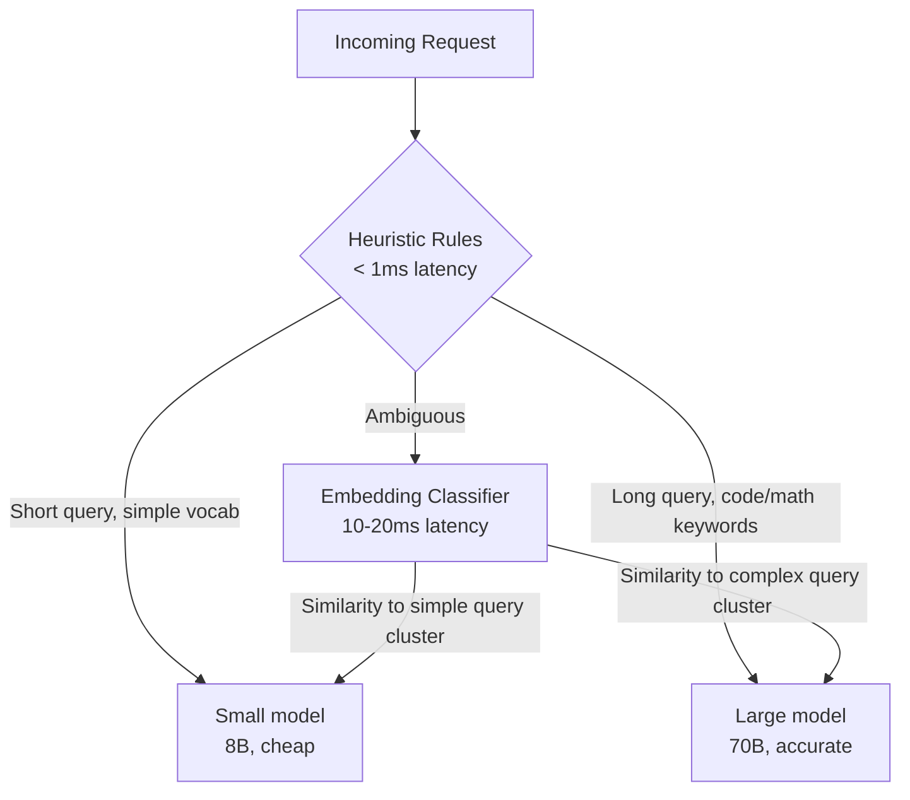
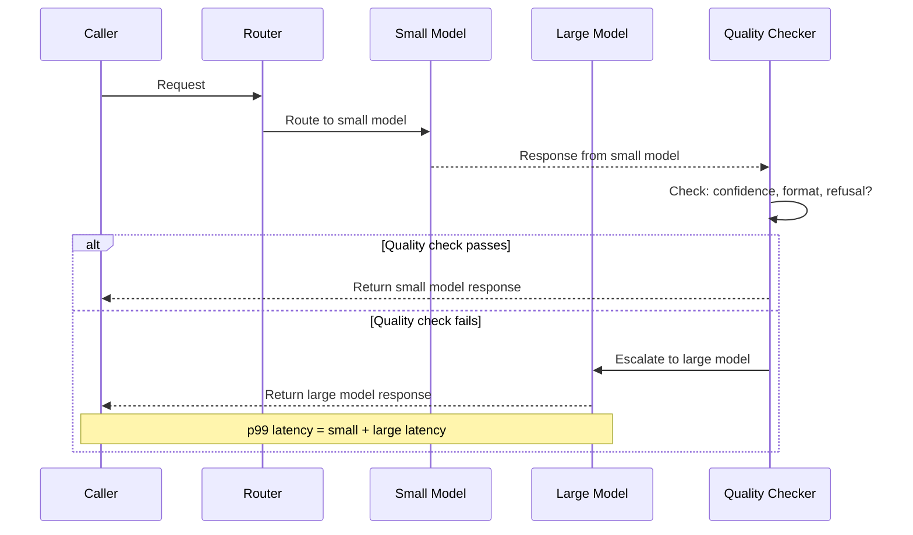
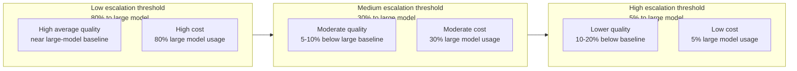
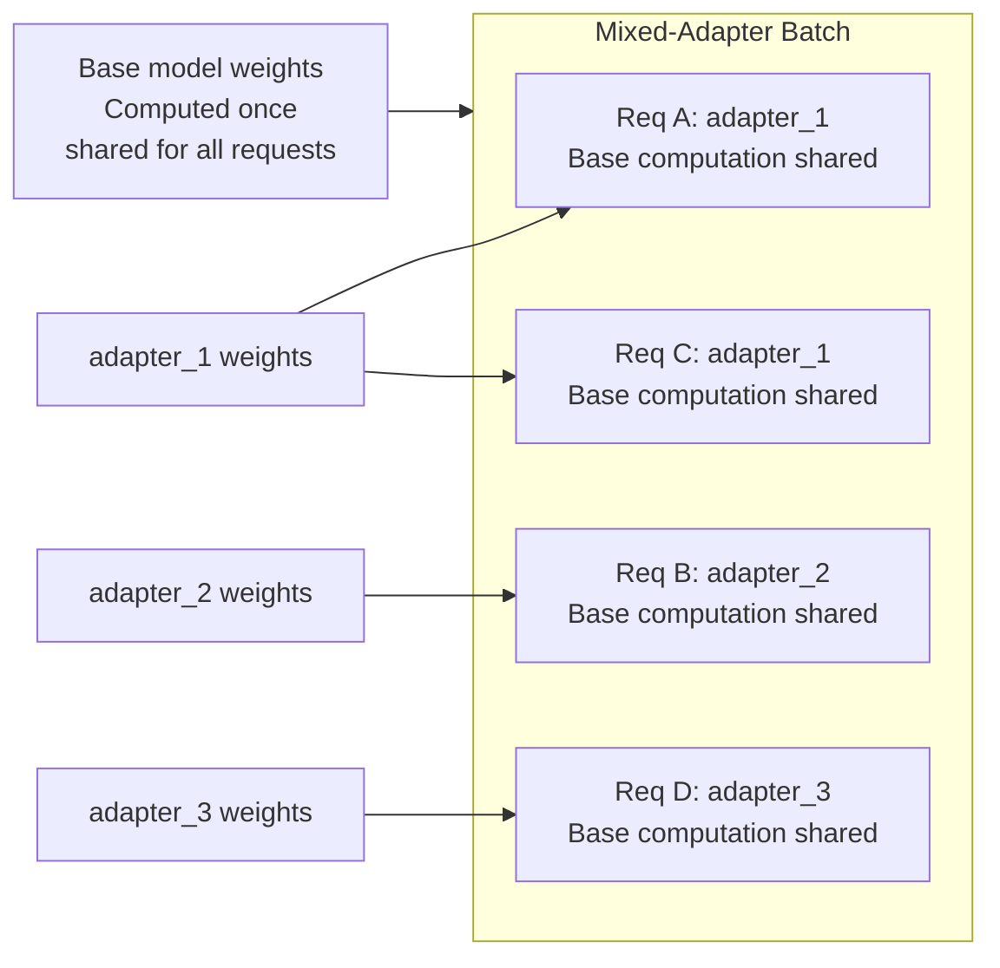
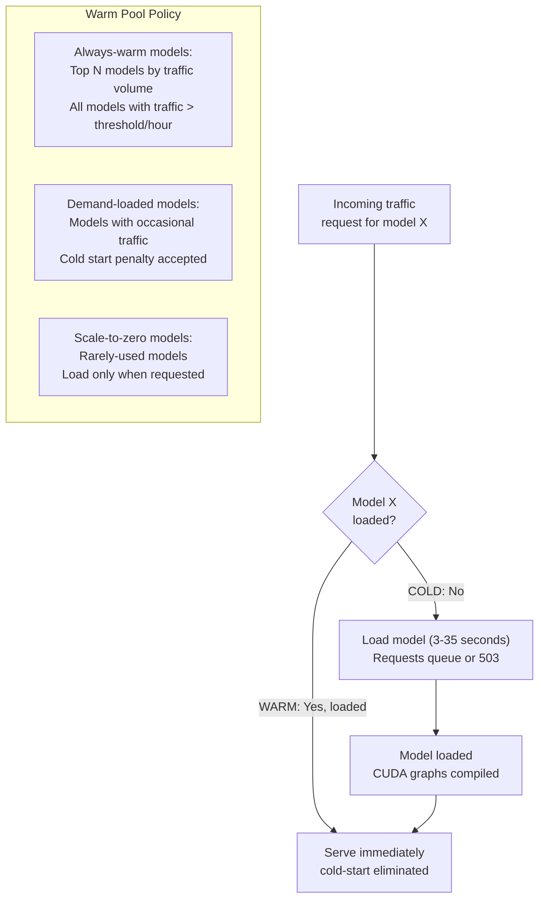
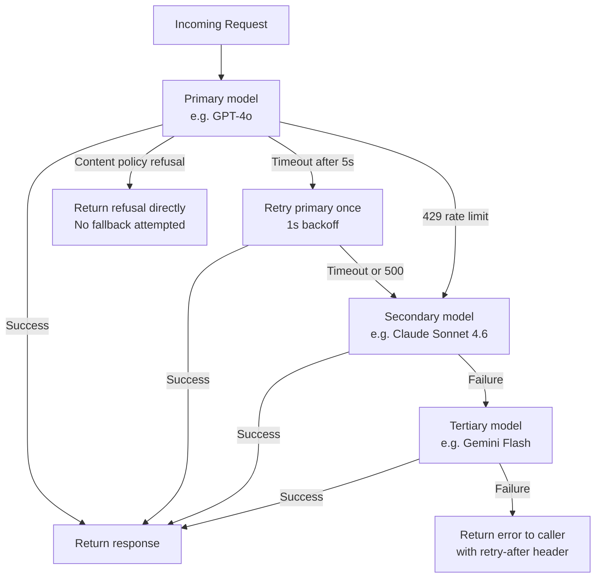
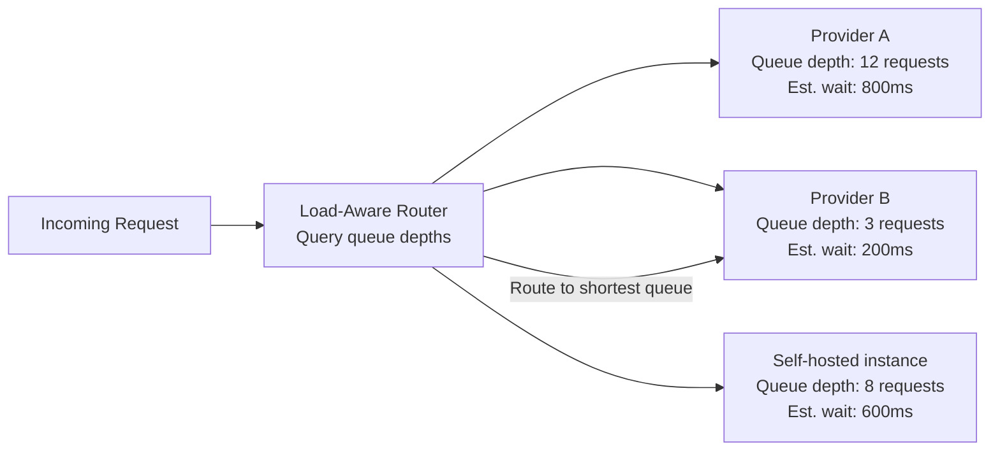
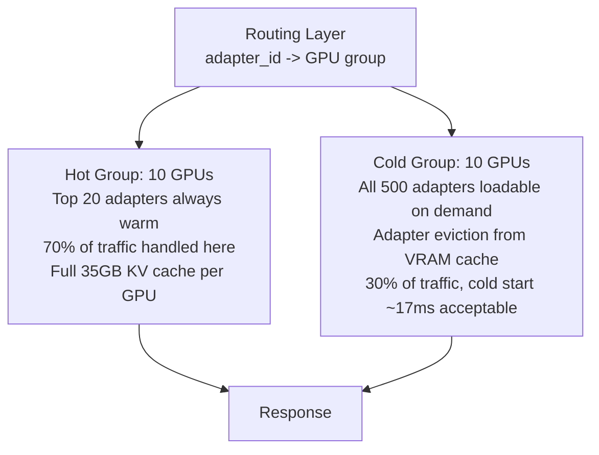

# Multi-Model Serving & Routing

## Overview

Production AI platforms almost never use a single model for all traffic. They serve multiple model sizes for cost tiering, multiple fine-tuned variants for different customers or use cases, multiple provider models for fallback, and different modality models for text, vision, and audio. The routing layer that sits above individual model instances — deciding which model handles which request, managing fine-tuned adapter variants, handling model loading latency, and failing over gracefully — is the infrastructure that makes a multi-model platform operationally tractable.

This chapter covers the four central problems in multi-model serving: routing requests by query complexity for cost efficiency, serving many fine-tuned variants efficiently via multi-LoRA, managing model cold-start and warm pool economics, and building fallback chains that fail over gracefully without confusing users.

See also: [Model Serving Architecture](01-model-serving-architecture.md), [Batching & Continuous Batching](02-batching-and-continuous-batching.md), [The Inference Stack](../14-ai-infrastructure/02-the-inference-stack.md).

---

## Why Multi-Model Serving

The forcing function is cost. A frontier 70B model costs ~$1–5 per million output tokens. A capable 8B model costs ~$0.10–0.30 per million output tokens — 10–20x cheaper. If 60% of requests are simple enough that an 8B model produces acceptable quality, routing those requests to the 8B model cuts the serving cost for that traffic by 10–20x. For a product generating 10 billion tokens per month, that's the difference between a $5M monthly GPU bill and a $500K bill.

The challenge is that routing decisions must be made on the critical path — adding even 50ms of routing latency is unacceptable for interactive applications. The routing logic must be cheap (faster than the inference it's routing) and accurate (routing hard requests to the cheap model wastes more money in user dissatisfaction than the routing saves in compute).

---

## Tiered Routing by Query Complexity

The most impactful single optimization in production serving is routing easy queries to small/cheap models and hard queries to large/expensive models.

### Routing Classifier Options

The classifier must be faster and cheaper than the inference cost savings it enables. Four approaches, roughly in order of complexity and accuracy:



**Heuristic rules**: Input length, presence of reasoning markers ("analyze", "compare", "explain step by step"), presence of code or mathematical notation, explicit complexity signals from the caller. Zero inference latency. Accuracy: moderate. Best for: initial deployment before you have enough traffic to train a classifier.

**Embedding-based classifier**: Embed the query using a small embedding model (~100ms on CPU, ~10ms on GPU) and classify by nearest-neighbor to labeled query clusters (simple vs. complex) or a trained logistic regression on the embedding. Adds 10–20ms. Accuracy: high for clear-cut cases. Best for: production systems with enough labeled data to train the embedding classifier.

**Fine-tuned small LLM classifier**: A 1B or 3B model fine-tuned specifically to classify query complexity. Most accurate, but adds one full inference call (50–150ms). Only makes sense if the target model is much more expensive than the classifier cost, and the classifier is accurate enough to avoid expensive misroutes.

**User-declared complexity tier**: Let the caller specify the quality tier explicitly in the API request. Simple: no classification latency, perfectly accurate. Best for: B2B APIs where callers know their use case.

### Cascade Routing

Cascade routing tries the small model first, then escalates to the large model if the small model's response fails a quality check:



### The Tail-Latency Problem in Cascades

Cascade routing has a critical failure mode: **tail-latency amplification**. For any request that escalates, the caller waits for both the small model's latency AND the large model's latency. The p99 latency for escalated requests is additive.

If small model p99 = 800ms and large model p99 = 3,000ms, then for escalated requests: p99 = 3,800ms — worse than just using the large model directly (3,000ms p99). Cascade routing only makes sense when the escalation rate is low (< 20%) and the escalation-path latency is acceptable for the application.

### Cost/Quality Operating Point



The optimal threshold depends on the product's quality requirements and cost budget. An A/B test measuring user satisfaction (not just accuracy benchmarks) at different routing thresholds is the correct way to find the operating point.

---

## Multi-LoRA Serving: One Base, Many Adapters

LoRA (Low-Rank Adaptation) adds small trainable matrices — rank 4–64 — to a subset of the base model's weight matrices. The base model weights are frozen and shared; adapters are swapped per request. This architecture enables serving hundreds of fine-tuned variants from a single base model deployment.

### The Core Architecture

```mermaid
flowchart TB
    BASEGPU["Base Model in GPU VRAM\n35 GB for 70B INT4\nShared across all adapter variants"]
    ADAPTER_CACHE["Adapter Cache in VRAM\nTop 20-50 adapters by traffic\n~50 MB per rank-16 adapter"]
    ADAPTER_STORE["Adapter Weight Store\nNVMe or object storage\nAll adapters, cold"]
    REQ["Request with adapter_id=customer_123"] --> ROUTE["Adapter Router\nLook up adapter_id"]
    ROUTE --> CHECK{"Adapter in\nVRAM cache?"}
    CHECK -->|"Cache HIT"| APPLY["Apply adapter to\nbase model forward pass"]
    CHECK -->|"Cache MISS"| LOAD["Load from store\nto VRAM cache\n~17ms at 3 GB/s for 50MB"]
    LOAD --> EVICT["Evict LRU adapter\nif cache is full"]
    EVICT --> APPLY
    APPLY --> OUT["Generate tokens\nwith adapter applied"]
    BASEGPU --> APPLY
    ADAPTER_CACHE --> APPLY
    ADAPTER_STORE --> LOAD
```



### Adapter Size and Cache Economics

A LoRA adapter adds two small matrices per targeted weight matrix: A (input_dim × rank) and B (rank × output_dim). For a rank-16 adapter targeting Q, K, V, and output projections across all 80 layers of a 70B model:

- Each adapter: 80 layers × 4 matrices × (4096 × 16 + 16 × 4096) × 2 bytes ≈ **50 MB**
- VRAM available for adapter cache after base model: 45 GB
- Adapters fitting in cache: 45 GB ÷ 50 MB = **~900 adapters simultaneously**

In practice, the adapter cache is shared with the KV cache pool. A reasonable split: reserve 40 GB for KV cache, 5 GB for adapter cache (100 adapters).

### Batching Across Different Adapters

The challenge: requests for different adapters cannot be trivially batched together because each request needs different LoRA weights applied. Two strategies:

**Adapter-aware batching**: Group requests by adapter ID before batching. A request waits briefly for other requests with the same adapter to accumulate before being dispatched together. This maximizes batch efficiency per adapter but increases per-request latency.

**Mixed-adapter batching**: vLLM's multi-LoRA support enables some degree of mixed-adapter batching by maintaining separate LoRA weight tensors for each active adapter and applying the correct adapter per request during the forward pass. The base model computation is shared; adapter weight applications are applied separately per request after each shared base computation.



### S-LoRA: High-Adapter-Count Serving

S-LoRA (Sheng et al., 2023) is the serving system designed specifically for deployments with hundreds to thousands of adapters. The key insight: not all adapters need to be in GPU VRAM simultaneously. Store all adapters in CPU memory; page them into GPU VRAM only for the adapters needed by the current batch.

S-LoRA's contributions:
1. **Unified paged memory**: KV cache and adapter weights share the same paged memory pool — the memory manager can dynamically trade off between KV cache capacity and adapter cache capacity based on current workload
2. **Batched LoRA inference**: custom CUDA kernels for computing LoRA adaptations for heterogeneous (multi-adapter) batches efficiently
3. **Scalability**: demonstrated serving 1,000+ adapters simultaneously, which is impractical with naive adapter caching

S-LoRA matters for enterprise multi-tenant deployments where each customer has their own fine-tuned adapter and the total adapter count is in the hundreds or thousands. For simpler cases (< 50 adapters with moderate traffic), vLLM's built-in multi-LoRA support is sufficient.

---

## Cold-Start and Model Loading Latency

A model must be loaded into GPU VRAM before it can serve requests. Loading latency is the latency "tax" on the first request after a model has been cold. At large model scales, this tax is measured in seconds to minutes.

### Loading Time Arithmetic

```
Loading time ≈ model_size_bytes / storage_to_GPU_bandwidth
```

| Model | Size | PCIe 4.0 to GPU (~10 GB/s) | NVLink CPU→GPU (~50 GB/s) | GPU-to-GPU NVLink (~600 GB/s) |
|---|---|---|---|---|
| 7B INT4 | 3.5 GB | 0.35s | 0.07s | 0.006s |
| 70B INT4 | 35 GB | 3.5s | 0.7s | 0.06s |
| 70B BF16 | 140 GB | 14s | 2.8s | 0.23s |
| 405B INT4 | 200 GB | 20s | 4s | 0.33s |

NFS-mounted model weight storage (common in Kubernetes clusters) adds additional latency: at 1 GB/s NFS throughput, a 35 GB INT4 model takes ~35 seconds to load. This is why "store model weights on fast local NVMe, not network storage" is a production best practice, not just an optimization.

### CUDA Warmup Overhead

After loading weights, additional CUDA warmup is required before the model can serve its first request at full speed:
- **CUDA kernel compilation**: JIT-compiled kernels for the specific batch sizes and sequence lengths run on the first few requests
- **CUDA graph capture**: vLLM pre-compiles static CUDA graphs for common batch sizes (1, 2, 4, 8, 16, ...) to reduce per-step kernel launch overhead. Capture adds 10–30 seconds per model after loading.

The total cold-start latency for a production deployment is: load time + CUDA graph capture time. For a 70B INT4 model: 3.5s load + 20s CUDA graph = 23.5 seconds before the first request is served at full speed.

### Warm Pool Management

The standard solution is **always-warm replicas**: keep at least one instance of each frequently-used model loaded and serving at all times, even at zero traffic. The carrying cost is idle GPU memory; the benefit is eliminating cold-start latency for the first request of any traffic burst.



### The Traffic Threshold for Warm Pools

A model is worth keeping warm if the cost of the warm pool (idle GPU × $/hour) is less than the cost of cold starts (requests × cold start TTFT degradation × user value of that latency).

For interactive user-facing traffic: idle GPU cost at $2.50/hour for one H100; if the model serves 10 requests/hour, each cold start degrades TTFT by 20 seconds. At even $1/request-minute of user time cost, keeping the model warm is justified at 10 req/hour. For batch workloads where latency doesn't matter: cold start is acceptable indefinitely.

### Multi-GPU Model Placement

Large models that require tensor parallelism must be placed together. A 70B BF16 model needs 2× H100 for tensor parallel, which must be co-located on the same node (NVLink required for efficient tensor parallel communication). A 405B BF16 model needs 8× H100.

The scheduler must track which GPU nodes have which models loaded and route requests accordingly. Requests for a 405B model must be routed to the specific 8-GPU node hosting it, not to any arbitrary GPU in the fleet.

---

## Fallback Routing on Provider/Model Failure

A request routed to a primary model that fails (API timeout, provider outage, rate limit hit, content policy refusal) must be routed to a fallback. Building this correctly is harder than it sounds.

### Failure Type Taxonomy

Different failures require different responses:

| Failure type | Response | Reason |
|---|---|---|
| Network timeout | Retry once on same provider, then fallback | Transient network issue likely |
| HTTP 429 rate limit | Exponential backoff, or fallback without retry | Don't burn fallback quota on a recoverable limit |
| HTTP 500/503 server error | Retry once, then fallback | Transient server issue |
| Content policy refusal | Return refusal directly — do NOT fallback | The content policy is intentional; a secondary model may also refuse |
| Context length exceeded | Return error directly — do NOT fallback | The secondary model has the same or similar context limit |
| Response quality too low | Escalate to larger model (cascade routing) | This is the cascade case, not a failure fallback |

### The Fallback Chain



### Timeout Thresholds for Fallback Triggering

Setting timeout thresholds too short causes false-positive fallbacks on valid-but-slow requests. Setting them too long forces users to wait unnecessarily.

**Correct approach**: set timeouts at the p99 latency of the primary model under normal (non-degraded) operating conditions, differentiated by request type:

| Request type | Primary model p99 | Fallback trigger threshold |
|---|---|---|
| Short chat (< 200 output tokens) | 3s | 5s |
| Document analysis (< 2K output tokens) | 12s | 15s |
| Long-form generation (< 8K output tokens) | 45s | 60s |
| Streaming requests | Per-token timeout: 2s between tokens | Alert if any inter-token gap exceeds threshold |

### Behavioral Consistency Across Fallback Models

GPT-4o and Claude Sonnet produce meaningfully different outputs for the same prompt: different response styles, different default formatting, different hedging language. When a user receives a fallback-model response, they may notice the change — especially on multi-turn conversations where the style shifts mid-conversation.

Mitigations:
- **Prompt engineering for normalization**: Add explicit output format instructions to the system prompt that both models respect (response length, tone, markdown usage)
- **Post-processing**: Normalize formatting (convert model-specific formatting conventions to a canonical format) before returning to caller
- **Monitoring**: Track fallback rate by model pair. A sustained fallback rate > 5% indicates the primary provider has a degradation that needs human attention and escalation — not just automatic failover

---

## Cost-Aware and Load-Aware Routing

Routing decisions can incorporate real-time signals beyond query complexity.

### Load-Aware Routing

Route to the model instance or provider with the shortest current queue depth:



For self-hosted serving, vLLM's built-in load balancer routes requests to the replica with the most available KV cache budget — the lowest-queue-depth proxy that accounts for the memory constraint, not just request count.

### Cost-Budget Enforcement

For products with a daily or monthly token budget (common in enterprise deployments where the AI serving is a cost center):

```
when daily_tokens_used > 80% of daily_budget:
    route all traffic to cheapest model tier
    
when daily_tokens_used > 95% of daily_budget:
    shed lowest-priority traffic
    return 429 to batch/async traffic
    maintain only interactive-tier service
```

This requires the router to track token consumption in real time (via a Redis counter or equivalent), which is a write on the hot path. Design: increment counter asynchronously (fire-and-forget) after each response, with a small async batch write, rather than synchronously per request.

---

## Interview Questions

### Beginner

**Q: What is tiered routing and why does it reduce serving cost?**

Tiered routing classifies incoming requests by complexity and routes simple requests to a small, cheap model and complex requests to a large, expensive model. A frontier 70B model may cost $3 per million output tokens; an 8B model costs $0.15. If 60% of requests are simple enough for the 8B model, the effective per-token cost for the routed system is: 0.6 × $0.15 + 0.4 × $3 = $1.29/million — a 57% cost reduction with no change in quality for the complex requests. The routing classifier must cost less than the inference savings it generates, which is why it uses cheap classifiers (heuristics, embedding models) rather than the large model itself.

**Q: What is multi-LoRA serving and what problem does it solve?**

Multi-LoRA serving hosts a single base model in GPU VRAM and serves many fine-tuned LoRA adapter variants from the same GPU by loading adapter weights (50–200 MB per adapter) on demand alongside the base model. Without multi-LoRA, serving 100 fine-tuned variants requires 100 GPU deployments — one per variant — each holding a full copy of the base model. With multi-LoRA, one GPU holds the base model once and loads adapters as requests arrive. For enterprise deployments with many per-customer fine-tuned models, this is the difference between 100 GPUs and 1 GPU for the same traffic volume.

---

### Intermediate

**Q: Describe the failure modes of cascade routing and when it should not be used.**

Cascade routing adds two failure modes:

First, **tail-latency amplification**: escalated requests pay the latency of both the small model (which tried and failed) and the large model. If p99 for the small model is 1s and for the large model is 4s, escalated-request p99 is 5s — worse than always using the large model.

Second, **quality cliff on escalation threshold miscalibration**: if the quality checker's threshold is too permissive, many low-quality small-model responses pass without escalation, degrading average output quality below what the small model alone would produce with direct routing. If too strict, escalation rate rises, eliminating cost savings.

Cascade routing should not be used when: (a) the application's latency SLO doesn't accommodate the additive latency; (b) the escalation rate is expected to be high (>30%); or (c) behavioral consistency between the small and large model outputs is important (escalated responses will have different style/length than non-escalated ones).

**Q: Walk through the memory management for a multi-LoRA deployment with 200 adapters, 10 GB of VRAM available for adapters after the base model.**

200 adapters × 50 MB per adapter = 10 GB total adapter storage — exactly matching the available VRAM. But keeping all 200 adapters loaded simultaneously means zero KV cache budget for any requests. In practice:

Split the available 10 GB between adapter cache and KV cache. If the traffic distribution follows a power law (top 10 adapters handle 80% of requests), keep those 10 adapters hot in VRAM (500 MB) and allocate the remaining 9.5 GB to KV cache. Cold-miss adapters (the remaining 190) are loaded from NVMe on demand (~17ms per 50 MB adapter load). The LRU adapter cache evicts the least-recently-used adapter when the cache is full and a new cold adapter is needed.

Monitor the cache miss rate. If miss rate is high and consistently hitting the same adapters, increase the adapter cache budget at the expense of KV cache budget (accepting lower concurrency but better adapter hit rate).

---

### Senior

**Q: Design a fallback routing system for a production AI API that serves traffic from three providers: GPT-4o (primary), Claude Sonnet (secondary), and an in-house 70B model (tertiary). Include failure detection, fallback triggers, and behavioral consistency.**

**Failure detection**: maintain a sliding window of the last 100 requests per provider. If error rate > 5% or median latency > 2x p90 baseline, mark provider as degraded and route new requests to secondary. This is evaluated per request type (short/long) because latency baselines differ.

**Fallback triggers by failure type**:
- Timeout (> 5s for short, > 15s for long): retry primary once, then fall to secondary
- HTTP 429: immediate fallback to secondary, backoff for primary recovery
- HTTP 500/503: retry once, then secondary
- Content policy: return refusal, no fallback
- Content length exceeded: return error, no fallback

**Behavioral consistency**: apply a formatting normalization layer before returning any response:
- Strip provider-specific formatting artifacts (GPT-4o tends to add bold headers; Claude tends to use bullet points differently)
- Normalize response length to be within ±20% of expected length for the request type
- On multi-turn conversations, log when a turn came from a different provider than the previous turn — alert if this happens for the same session, since style shifts mid-conversation are user-visible

**Monitoring**: track fallback rate per provider pair (primary→secondary, secondary→tertiary) with 1-minute resolution. Alert when primary→secondary rate exceeds 5% for 3 consecutive minutes — this indicates a provider-side degradation. Automatically open a PagerDuty alert and send notification to the primary provider's support channel.

**Q: A system routes 70% of traffic to a small model and 30% to a large model. After 3 months, the product team reports quality has degraded despite no model changes. Diagnose.**

The routing classifier is a classifier trained on historical data. Three likely failure modes after 3 months:

First, **distribution shift in query complexity**: user query patterns have evolved (new features launched, different user demographics, seasonal shifts). Queries that would have been classified as "simple" 3 months ago are now more complex. The classifier's training data no longer reflects current traffic. Fix: retrain the classifier on recent labeled traffic.

Second, **routing threshold drift**: someone tuned the routing threshold to route more traffic to the small model (likely for cost reasons). More complex queries are now hitting the small model than were hitting it when the quality bar was established. Fix: track the distribution of query features (length, vocabulary complexity, topic) going to each model tier and alert on distribution shift.

Third, **small model quality drift from upstream updates**: if the small model is an API (not self-hosted), the provider may have silently updated it in a way that changed its behavior on your query distribution. Fix: implement a continuous evaluation pipeline that runs a held-out test set through the small model weekly and monitors quality metrics — not just perplexity, but task-specific accuracy on representative queries.

---

### Staff

**Q: Design the model placement and routing architecture for an enterprise AI platform serving 500 customers, each with a LoRA-fine-tuned adapter, from a fleet of 20× H100 GPUs. Traffic: 2,000 requests/minute total, power-law adapter distribution (top 20 adapters handle 70% of requests).**

**Hardware allocation**:
- Base model: Llama 3 70B INT4 (35 GB). Load on every GPU for maximum concurrency. Each H100 has 45 GB remaining.
- Adapter cache: reserve 10 GB per GPU for hot adapters. At 50 MB per adapter, each GPU holds 200 adapters hot.
- KV cache: 35 GB per GPU for serving. At 491 MB per 4K-sequence, each GPU handles ~70 concurrent sequences.

**Placement strategy**:



**Routing logic**:
- Extract adapter_id from request
- If adapter_id in top-20 hot list: route to hot group, round-robin by KV cache availability
- Else: route to cold group, route to the specific GPU that already has this adapter loaded (cache-aware routing), or the GPU with the most free VRAM if no GPU has it hot

**Scaling**:
- Hot group handles 70% of traffic × 2,000 RPM = 1,400 RPM across 10 GPUs = 140 RPM/GPU. At ~5 tokens/s decode rate for 200-token avg response, each GPU handles ~25 concurrent streams — well within the 70-sequence KV budget.
- Add GPUs to the hot group when p99 TTFT exceeds 1s; add to the cold group when cold-miss rate exceeds 10%.

---

## Google-Level Follow-Ups

**"You built a routing classifier that's 90% accurate. What's the actual business impact of the 10% misclassification rate, and how do you evaluate it?"**
Tests: ability to reason about the asymmetric cost of routing errors.

The 10% misclassification rate breaks down into two types: (a) routing complex queries to the small model (false negatives) — quality degradation visible to users, potential user churn, hard to catch without quality monitoring; (b) routing simple queries to the large model (false positives) — unnecessary cost, but no quality harm. The business impact of these two errors is asymmetric: false negatives cost revenue (user churn, refund requests), false positives cost money (extra GPU time). Evaluate by measuring user-facing quality metrics (engagement rate, explicit feedback, task completion rate) on the falsely-negatively-classified queries specifically, not just overall accuracy. A 90% accurate classifier with all 10% errors in the false-positive direction is essentially costless; the same classifier with all errors in the false-negative direction may be net-negative for the business even though it saves 80% of compute on the correct classifications.

**"What happens to multi-LoRA serving efficiency as the number of concurrent users increases? Is there a concurrency point where multi-LoRA becomes less efficient than single-adapter serving?"**
Tests: understanding of the adapter diversity vs. batching efficiency tradeoff.

As concurrent users increase, the key metric is the effective batch size per adapter. With 100 concurrent users across 100 different adapters, the effective batch size per adapter is 1 — each adapter is serving exactly one request simultaneously, providing no batching benefit. The base model computation is shared across all 100, which is efficient, but the LoRA adapter application is per-request and can't be batched. With 100 concurrent users across 5 adapters, average batch size per adapter is 20 — much more efficient. The efficiency of multi-LoRA serving degrades as adapter diversity increases relative to total concurrency. The break-even point varies by implementation but roughly: if the average concurrent requests per adapter drops below 4–8, single-adapter serving on dedicated per-adapter replicas may be more throughput-efficient (because it allows larger effective batches), even though it uses more total GPUs.

**"Your primary provider just announced they're deprecating their API in 90 days. Walk me through the migration strategy including traffic impact."**
Tests: operational maturity and multi-provider architecture thinking.

Phase 1 (Days 1–14): Enable the secondary provider at low traffic fraction (1%) as a canary. Run the same requests through both providers and compare output quality using LLM-as-judge. Identify prompt compatibility issues (provider-specific formatting instructions, function calling syntax differences, context window size differences). Fix prompt-level incompatibilities.

Phase 2 (Days 15–60): Gradually increase secondary provider traffic: 1% → 5% → 20% → 50%, monitoring quality metrics at each step. Track behavioral consistency — response length distribution, refusal rates, formatting compliance — not just model quality benchmarks. Update fallback thresholds and timeout values based on the secondary provider's observed latency profile.

Phase 3 (Days 61–90): Move secondary to primary, primary to tertiary (while the deprecated API still works as a fallback). Begin onboarding a new secondary. By day 90, the deprecated API is unused and can be cleanly cut.

Throughout: maintain a test suite of 500 golden-set requests with expected responses, run daily, alert on quality regressions at each traffic fraction increase.

---

## Common Mistakes

1. **Building a routing classifier that uses the large model itself to classify query complexity.** This defeats the purpose entirely — you spend one full large-model inference call to decide whether to use the large model. The classifier must be strictly cheaper than the inference it routes.

2. **Setting a single timeout threshold across all request types.** Short interactive requests timeout in 3s; long document tasks legitimately take 30s. A single 30s timeout delays fallback for interactive requests; a single 3s timeout causes constant false-positive fallbacks for document tasks. Differentiate thresholds by request type.

3. **Routing content policy refusals to a secondary model.** Content policy refusals are intentional — the request violates policy, and a secondary model will likely also refuse. Routing to a fallback wastes one additional inference call, adds latency, and risks finding a secondary model with a less strict policy and returning an inappropriate response. Return refusals directly.

4. **Ignoring the adapter cache hit rate in multi-LoRA deployments.** A cold adapter miss adds ~17ms of loading latency plus potential LRU eviction delay. If the workload has many adapters with low per-adapter traffic, the effective cold miss rate is high and the latency impact is significant. Monitor this metric explicitly.

5. **Treating model warm pools as a set-and-forget configuration.** Traffic patterns change with product launches, feature flags, and time-of-day. A model that's always warm may be worth keeping warm on weekday business hours but wasteful on weekend nights. Dynamic warm pool management based on traffic patterns saves significant GPU cost.

6. **Assuming the routing threshold remains valid after the small model or large model is updated.** The quality gap between the two models changes when either is updated. The classifier's threshold was calibrated against the old quality gap. After any model update, re-validate the routing threshold against current model quality on your production task distribution.

---

## Key Takeaways

- **Tiered routing by query complexity is the highest-leverage cost optimization** in production serving — routing 60% of queries to a 10–20x cheaper model reduces overall serving cost by 50–70% with no quality loss on the non-escalated traffic.
- **Multi-LoRA serving enables hundreds of fine-tuned variants from a single base model deployment** — the architecture that makes per-customer fine-tuning economically viable for enterprise AI platforms.
- **Cold-start latency (seconds to minutes for large models) makes serving-fleet autoscaling fundamentally slower** than stateless web service autoscaling — pre-warm model pools ahead of anticipated traffic, not reactively after queuing begins.
- **Fallback routing requires type-aware failure handling** — content policy refusals must not be fallback-routed; timeouts must use different thresholds per request type; rate limits must not exhaust the secondary provider's quota.
- **The routing classifier must be strictly cheaper than the inference it routes** — embedding classifiers (~10ms) and heuristics (< 1ms) are the right tools; asking the large model to classify itself is not.
- **S-LoRA enables thousands of adapters** by treating adapter weights and KV cache pages as a unified paged memory pool — the right architecture when adapter count exceeds what fits in VRAM simultaneously.

---

*Part of [Model Serving](index.md) · [Model Serving Architecture](01-model-serving-architecture.md) · [KV Cache Management](03-kv-cache-management.md) · [Quantization & Compression](04-quantization-and-compression.md) · [The Inference Stack](../14-ai-infrastructure/02-the-inference-stack.md)*
