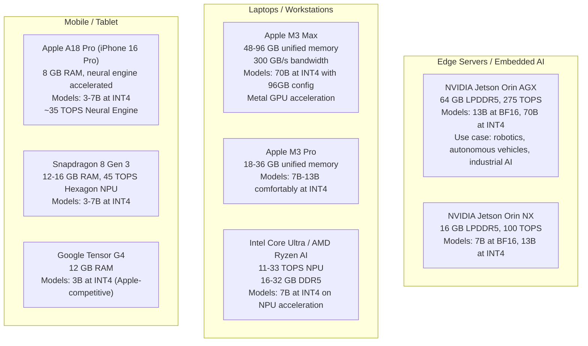
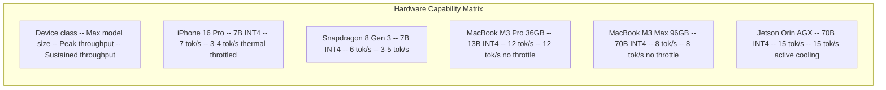
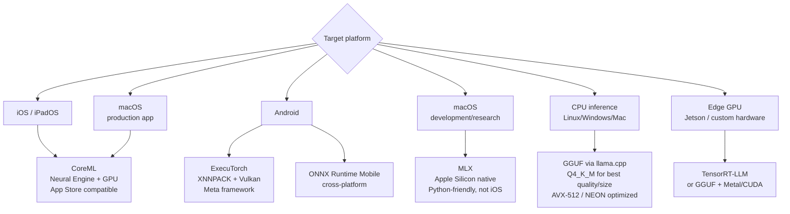
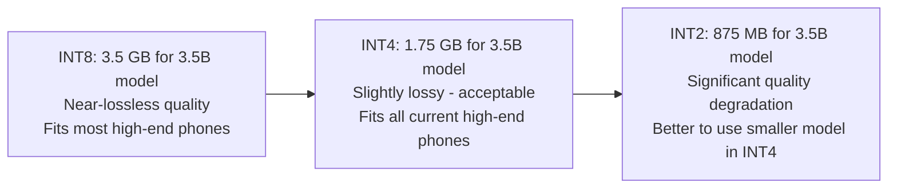
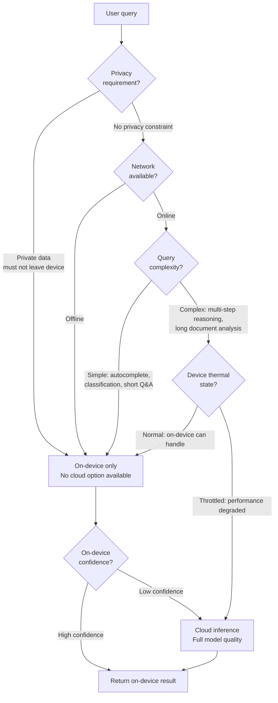
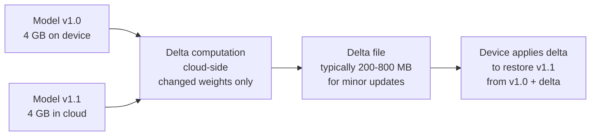

# On-Device and Edge Inference

## Overview

Cloud inference is the default for good reasons: abundant compute, no deployment constraints, easy updates. But a growing class of applications cannot use cloud inference — or perform significantly better without it. This chapter is about that class: applications where privacy requires the data never leave the device, where latency requires tokens in under 100ms (faster than any cloud round-trip), where the application must work offline, or where regulation mandates local data processing.

The engineering challenges for edge inference are distinct from cloud serving. There is no HBM, no NVLink, no 3 TB/s memory bandwidth. A phone has 8 GB of unified memory shared with the OS and every other app. A Mac has 96 GB of unified memory at 300 GB/s — impressive, but qualitatively different from a datacenter GPU. The serving stack is also different: GGUF files via llama.cpp instead of vLLM, CoreML models instead of TensorRT-LLM, ExecuTorch pipelines instead of Triton.

This chapter covers: when edge inference is actually necessary (the four genuine forcing functions), the hardware landscape across device classes, the model format conversion pipeline, quantization for memory-constrained devices, hybrid edge-cloud routing, and the operational problem of distributing model weight updates to millions of devices.

See also: [Model Serving Architecture](01-model-serving-architecture.md), [Quantization & Compression](04-quantization-and-compression.md), [Multi-Model Serving & Routing](05-multi-model-serving-and-routing.md).

---

## When Edge Inference Is the Right Architecture

Edge inference is not always better than cloud inference. It is harder to deploy, harder to update, quality-limited by hardware constraints, and operationally more complex. It is the right choice when one or more of these four genuine forcing functions applies — not because "on-device is cool" or "it avoids API costs."

### Forcing Function 1: Privacy by Architecture

Medical records, private financial data, personal communications, legal documents — data that must not leave the device due to regulation (HIPAA, GDPR, financial data residency laws) or user trust requirements.

The privacy guarantee must be **architectural**, not just policy. "We promise not to log your queries" is a policy guarantee — it can be violated by a software bug, a data breach, or a policy change. "The inference runs entirely on your device and the data is never serialized to a network buffer" is an architectural guarantee.

What architectural privacy means in implementation:
- The inference stack has no network callbacks during inference
- Query context is never written to persistent storage in a form that could be transmitted
- The model weights themselves can be on-device (avoiding any server-side routing of the query)
- TLS/transport security is irrelevant because data never transits a network

Applications where this is a genuine requirement: medical records assistants, personal finance analyzers, private diary/journaling assistants, enterprise document analysis on classified data.

### Forcing Function 2: Sub-100ms Hard Latency

The cloud round-trip alone — device to CDN edge to inference cluster and back — is 20–100ms depending on geography, and that's before inference computation. A well-optimized cloud inference system adds another 100–2,000ms of inference latency. Total TTFT from user action to first token: 150ms–2,100ms.

On-device inference can produce the first token in 20–80ms on modern hardware. Applications where this matters:

| Application | Why latency is a hard requirement |
|---|---|
| Keyboard autocomplete | User is typing at > 200ms/keystroke — suggestions must appear before the next keystroke |
| Voice assistant barge-in detection | Latency > 150ms means the user's speech interrupts before the system recognizes the intent |
| AR/VR overlay generation | Frame rate requirements (90fps = 11ms/frame) make cloud inference impossible for per-frame AI |
| Real-time code suggestions | Developer tools require < 50ms to feel instantaneous vs. distracting |

### Forcing Function 3: Offline Operation

No network connection: airplanes, rural areas, manufacturing floors, ships, underground facilities. Or unreliable network: intermittent mobile connectivity, high-packet-loss environments.

The application must function without any cloud dependency. This is the simplest forcing function to reason about — either the network is reliably available for the use case or it isn't. Note that "mostly available" is not the same as "reliably available" for applications where unavailability is unacceptable.

### Forcing Function 4: Regulatory Data Sovereignty

GDPR's data residency provisions, HIPAA's covered entity requirements, country-specific data localization laws (China, Russia, India, EU) may require that data be processed within a specific geographic jurisdiction. If the user is in a jurisdiction where sending their data to a US-based cloud inference cluster is prohibited, on-device inference (or local edge server inference) is the compliance path.

This is distinct from privacy-by-architecture: it's not necessarily about preventing the data from being seen, it's about where it is processed. A properly configured edge server in the same jurisdiction as the user may also satisfy this requirement.

---

## The Hardware Landscape

The hardware available on different device classes determines which models are deployable and at what quality level.

### Device Class Comparison



### The Unified Memory Advantage on Apple Silicon

Apple Silicon's unified memory architecture (UMA) is the key hardware advantage for on-device inference on Mac. The CPU, GPU, and Neural Engine all share the same physical memory pool with the same bandwidth. A 96GB M3 Max has:
- 300 GB/s memory bandwidth
- All 96 GB accessible to the GPU (unlike discrete GPUs where VRAM is separate from system RAM)
- 14-core Neural Engine at ~38 TOPS

Decode throughput for a 70B INT4 model on M3 Max:
```
35 GB model / 300 GB/s bandwidth = ~117ms per decode step
```

That's roughly 8 tokens/second — viable for many use cases, though significantly slower than an H100's ~95 tokens/second at the same batch size 1.

### Mobile Hardware Constraints

The fundamental constraint on phones: battery life and thermal limits mean sustained AI workloads must throttle. An iPhone 16 Pro can sustain 3–7 tokens/second on a 3B INT4 model for short bursts, but thermal throttling kicks in for sustained generation (> 30 seconds), reducing throughput by 30–50%. This is why mobile on-device AI is best suited for short-context, short-output tasks (autocomplete, classification, intent detection) rather than long-form generation.



---

## Model Formats for Edge Deployment

The conversion pipeline from a Hugging Face model to a deployable on-device artifact is non-trivial and format-specific. The right format depends on the target platform and use case.

### Format Selection Guide



### GGUF + llama.cpp: CPU-First Format

GGUF is a self-contained binary format: quantized weights, tokenizer vocabulary, model metadata, and inference configuration all in one file. llama.cpp implements the inference engine with optimized kernels for:
- CPU: AVX-512 (Intel/AMD), NEON (ARM)
- GPU offload: Metal (Apple), CUDA, OpenCL

The naming convention and typical sizes for Llama 3 8B:

| Format | Size | Tokens/sec (M3 Pro CPU) | Quality vs FP16 |
|---|---|---|---|
| Q4_K_M | 4.7 GB | 22 tok/s | Excellent, best default |
| Q5_K_M | 5.7 GB | 18 tok/s | Near-lossless |
| Q6_K | 6.1 GB | 16 tok/s | Essentially lossless |
| Q8_0 | 8.5 GB | 13 tok/s | Lossless |
| Q2_K | 2.8 GB | 35 tok/s | Noticeable degradation |

For production on-device use, Q4_K_M is the standard choice: best throughput/quality tradeoff. Q5_K_M when the device has sufficient RAM and quality is paramount. Q2_K only for extremely constrained devices where size is the primary constraint and quality degradation is acceptable.

### CoreML: The iOS/macOS Production Format

CoreML is Apple's on-device ML framework. Models converted to CoreML format execute on the Neural Engine (ANE), GPU, or CPU, with automatic hardware selection based on operator support and current device state.

**Conversion pipeline**:
```
PyTorch model → ONNX → CoreML (via coremltools)
OR
PyTorch model → CoreML directly (newer coremltools versions support this)
```

**Neural Engine constraints**: The ANE is power-efficient (critical for battery life) but has limited operator support. Operations not supported by the ANE fall back to CPU, potentially creating performance cliffs for models using unusual operations. When deploying to iOS:
1. Convert to CoreML
2. Profile which layers run on ANE vs CPU using Xcode Instruments
3. Identify and resolve bottleneck layers that fall back to CPU

**Why CoreML is preferred over llama.cpp for production iOS apps**:
- App Store review policy: App Store guidelines restrict apps that include large, bundled executable code that could bypass review — custom inference kernels may face scrutiny; CoreML models use Apple-approved execution
- Battery efficiency: ANE execution is 5–10x more power-efficient than CPU execution for supported operations
- Privacy API access: CoreML integrates with iOS privacy controls; the system can inform users that ML is running on-device

### ExecuTorch: PyTorch on Mobile

ExecuTorch (Meta, 2023) is a framework for exporting and deploying PyTorch models to mobile and edge devices. It is the most PyTorch-native path to mobile deployment, requiring minimal model architecture changes.

**Export pipeline**:
```
PyTorch model → torch.export() → ExecuTorch compiler → .pte bundle
```

Backends:
- **XNNPACK**: Optimized CPU kernels for ARM and x86. The default Android backend.
- **Vulkan**: Android GPU acceleration via Vulkan compute shaders
- **Core ML**: iOS ANE acceleration (ExecuTorch can delegate to CoreML for iOS)
- **QNN**: Qualcomm Neural Network SDK for Hexagon NPU

ExecuTorch is the natural choice for teams already working in PyTorch who need iOS and Android deployment without learning a new framework. CoreML remains the better choice for iOS-first deployments that need maximum ANE utilization.

### MLX: Apple Silicon Research and Development

MLX (Apple, 2023) is a Python framework designed for Apple Silicon (Mac only). It uses unified memory natively, provides NumPy-compatible APIs, and achieves excellent throughput on M-series chips.

MLX is **not** suitable for iOS production deployment — it targets Python runtime and Mac hardware specifically. It is excellent for:
- Rapid prototyping on Mac before converting to CoreML
- Research and development workflows on Apple Silicon
- Mac desktop applications that can bundle Python runtime

---

## Quantization for Edge: The Memory Floor

On mobile devices, INT4 is not optional — it is the practical minimum for running 3B+ parameter models in the memory budget available.

### The Mobile Memory Budget

An iPhone 16 Pro has 8 GB RAM total. The OS, apps, and other system processes consume 2–3 GB at idle. Available for AI inference: **~4–5 GB**. At INT4, a 3B model = 1.7 GB, a 7B model = 4 GB — both fit. At INT8, a 3B model = 3 GB fits; a 7B model = 7 GB does not.

### INT4 as the Practical Floor

Going below INT4 (INT3, INT2) causes significant quality degradation that makes most real use cases impractical. The perplexity increase from INT4 to INT2 is often comparable to reducing model size by 3–4x. For a 7B model, INT2 performance is approximately equivalent to a 2B model in BF16 — you might as well use a smaller model.



### Group Quantization for Edge

Per-tensor quantization (one scale factor for the entire weight matrix) is too coarse for INT4 — the quality loss is significant. Group quantization (one scale factor per group of 32, 64, or 128 weights) provides significantly better quality at a small overhead cost.

For Q4_K_M in GGUF: weights are quantized in groups of 256, with per-group scale factors. The scale factors themselves are quantized (K-quants), adding ~0.1 bits overhead but recovering significant quality vs. naive per-tensor INT4.

### Mixed-Precision for Edge

The standard edge quantization practice: keep embedding and output projection layers at higher precision, quantize middle transformer layers aggressively.

| Layer | Precision | Reason |
|---|---|---|
| Embedding lookup | Q8 or FP16 | Input token representations critical to output quality |
| First 2 transformer layers | Q6 or Q8 | Early layers set representations for all downstream computation |
| Middle transformer layers | Q4 or Q4_K_M | Most numerous, most memory; good quality/size tradeoff |
| Last 2 transformer layers | Q6 or Q8 | Final representation before output |
| Output projection (lm_head) | Q8 or FP16 | Vocabulary distribution directly affects output token quality |

This is exactly what GGUF's K-quants format implements automatically when using Q4_K_M or Q5_K_M: it applies the higher precision to the layers that benefit most while aggressively compressing the rest.

### On-Device Quantization vs. Pre-Quantized Models

**Pre-quantized**: distribute models already quantized (e.g., Q4_K_M GGUF files). Fastest to first inference; quantization is done once in the cloud. Size is fixed and known.

**On-device quantization on first launch**: distribute FP16 models, quantize on first launch on the user's device. The device quantizes using its own compute, which takes 1–10 minutes on first launch. Advantage: can calibrate on user data for better personalization of scale factors; can target the specific hardware capabilities of the user's device. Disadvantage: user waits on first launch; quantization quality is constrained by what's feasible on mobile compute.

For most production apps: pre-quantized models are the right choice. On-device quantization is worth exploring for highly personalized applications where user-data calibration provides measurable quality improvement.

---

## Hybrid Edge-Cloud Routing

Most edge deployments are not purely on-device. They are hybrid: the device handles what it can; the cloud handles what requires more capability. The routing decision — what goes on-device vs. cloud — must be made locally on the device.

### The Routing Decision



### The On-Device Routing Classifier

The routing decision is made by a small, fast classifier running entirely on-device:

**Input features**:
- Query length (token count)
- Presence of reasoning indicators ("analyze", "compare", "calculate")
- Topic category (code → route to cloud; simple factoid → on-device)
- Privacy flags (user-tagged or app-tagged sensitive data)
- Device state: battery level, thermal state, network quality
- Current on-device model load (is the inference engine idle or busy with another request)

**Classifier requirements**: must run in < 5ms, consume < 10 MB RAM. Options: a logistic regression on embeddings from a tiny embedding model (20M parameters), or purely heuristic rules encoded as decision trees.

### Seamless UX Under Hybrid Routing

The user should not perceive the routing decision as a quality discontinuity. Design principles:

**Consistent format regardless of which model answered**: if the on-device model tends to answer in bullet points and the cloud model in paragraphs, the UX is jarring on the transition. Post-process both outputs to match a canonical format.

**Latency transparency**: cloud responses may take 1–3s vs. on-device responses at 200ms. One option: show the on-device response immediately, then silently replace it with the cloud response if and when it arrives and is substantially better. The user sees a fast result, then a better result replaces it — generally better UX than a 3-second blank screen followed by a cloud response.

**Privacy boundary enforcement**: when the routing layer decides to send a query to the cloud, the app must enforce privacy constraints. Local-only data tagging marks certain query types as on-device-only, and the routing layer cannot override this regardless of complexity signals.

---

## Model Update Distribution at Scale

Pushing new model weights to millions of devices is a bandwidth and operational problem that most teams underestimate.

### The Scale Problem

| Model | Size | Devices | Total transfer | CDN cost at $0.01/GB |
|---|---|---|---|---|
| 3B INT4 | 1.7 GB | 10M | 17 PB | $170M |
| 7B INT4 | 4 GB | 10M | 40 PB | $400M |
| 7B INT4 | 4 GB | 100M | 400 PB | $4B |

These numbers make clear why naive full-model updates are impractical at consumer scale. Every model update strategy for mass-market devices must reduce the per-device transfer size.

### Delta Updates

Instead of pushing the full model on each update, push only the changed weights since the last version — a binary diff.



Delta size depends on how much the model changed: a fine-tune or instruction tuning update typically changes 10–30% of weights, producing a delta of 400 MB – 1.2 GB for a 4 GB INT4 model. A full retraining from a new architecture requires a full push.

Requirements for delta updates: deterministic weight ordering across versions (the same weight must be at the same byte offset in both versions), a binary diff algorithm appropriate for floating-point data (standard text diffs are ineffective; float-specific delta compression using XOR and entropy coding achieves better compression ratios), and version management infrastructure to track which version each device has.

### Staged Rollout and Device-Side A/B Testing

Never push a model update to all devices simultaneously. The staged rollout protocol:

1. **1% canary** (days 1–3): push to 1% of devices. Collect quality signals.
2. **5% expansion** (days 4–7): if canary metrics are healthy, expand.
3. **20% expansion** (days 8–14): monitor more broadly across device diversity.
4. **50% → 100%** (days 15–21): full rollout if all tiers healthy.

Quality signals measurable on-device without sending query content to a server:
- Response length distribution (too short may indicate truncation bugs)
- On-device quality classifier score (a tiny model that scores response quality)
- User interaction signals: did the user copy, share, or interact with the response? Did they immediately try again (suggesting the response was bad)?
- Crash rate and out-of-memory rate (a quantization bug that causes occasional NaN outputs may manifest as crashes)

Rollback triggers: any quality metric dropping by > 5% relative to the pre-update baseline, or crash rate increase > 0.1%.

### Background Download Mechanics

Model weight downloads must not degrade the user's real-time app experience:

**iOS constraints**:
- `Background URL Session`: can download up to ~1 GB overnight while charging on WiFi
- For larger models, use `BackgroundDownloadTask` with resumable download support
- iOS may delete unfinished background downloads if storage is critically low — the app must handle graceful restart from the last byte offset

**Android constraints**:
- `WorkManager` with `NetworkType.UNMETERED` and `RequiresCharging(true)` constraints
- Resumable downloads: `Range` header on HTTP requests to resume from byte offset after interruption
- Storage policy: check available storage before download; request sufficient headroom

**User communication**: large model downloads (1–4 GB) should be communicated to users. Surprise download charges from a model update on a mobile data connection cause support escalations and poor reviews. Always enforce WiFi-only download by default, with explicit user consent for mobile data download.

---

## Interview Questions

### Beginner

**Q: Name the four genuine forcing functions for on-device inference. When is "it avoids API costs" not a valid reason?**

The four genuine forcing functions: (1) privacy-by-architecture — data that must not leave the device due to regulation or user trust, where an architectural guarantee (data never transmitted) is required; (2) sub-100ms hard latency — applications like keyboard autocomplete or real-time AR where cloud round-trip time alone exceeds the latency budget; (3) offline operation — the network is genuinely unavailable for the use case; (4) regulatory data sovereignty — laws requiring data to be processed in a specific jurisdiction.

"Avoids API costs" is not a valid forcing function because on-device inference has its own costs: engineering time to implement the deployment pipeline, ongoing model maintenance and update infrastructure, quality constraints from smaller models, user device storage/battery usage, and longer development cycles. These costs typically exceed API cost savings unless the application is serving billions of queries or has extreme cost sensitivity.

**Q: What is the practical model size floor for on-device deployment, and why?**

INT4 is the practical lower bound on quantization for acceptable quality. Below INT4 (INT3, INT2), quality degradation is so severe that for most applications, a smaller model at INT4 produces better results. The hardware constraint: a high-end phone has 8 GB RAM with 4–5 GB available for inference. At INT4, a 3B model = 1.7 GB (fits comfortably) and a 7B model = 4 GB (fits on high-end phones). The practical model size range for phones is 1B–7B parameters at INT4. For Mac with 96 GB unified memory, 70B INT4 is feasible.

---

### Intermediate

**Q: Explain the Apple CoreML conversion pipeline and why the Neural Engine fallback to CPU is a performance problem.**

The pipeline: PyTorch model → ONNX export → coremltools conversion → .mlpackage bundle. The bundle contains the model graph in CoreML's MIL (Model Intermediate Language) format, which the CoreML runtime compiles to hardware-specific kernels at first run.

The ANE executes operations at 5–10x the energy efficiency of the CPU for supported operations. However, the ANE supports only a subset of PyTorch operations. Operations not supported (custom attention variants, certain activations, unusual normalization schemes) fall back to CPU execution. In a transformer model, a single layer using an unsupported operation in its attention mechanism can force all attention computations to CPU, eliminating the ANE advantage for the entire layer.

The problem compounds because the CPU fallback takes place within the CoreML framework's compute graph — the developer cannot easily see which layers are on ANE vs. CPU without profiling. The correct workflow: convert to CoreML, profile in Xcode Instruments to identify CPU fallbacks, then either simplify the model architecture (replace unsupported ops with supported equivalents) or accept the CPU fallback cost.

**Q: A mobile app needs to serve a 7B model on an iPhone 16 Pro (8 GB RAM). What's your deployment plan and what tradeoffs do you accept?**

iPhone 16 Pro has 8 GB RAM; with OS overhead, ~5 GB available for inference. A 7B INT4 model = 4 GB. This leaves 1 GB for the KV cache, activations, and framework overhead — tight but feasible for short-context queries.

Deployment plan:
1. Format: CoreML for ANE acceleration (not llama.cpp for App Store compliance)
2. Quantization: INT4 with mixed precision (embedding and output layers at INT8)
3. Context limit: cap maximum context at 512–1024 tokens to bound KV cache memory
4. Thermal management: implement adaptive throttling — monitor device thermal state and reduce batch size or context limit when temperature exceeds threshold
5. Streaming: stream tokens as generated rather than waiting for full completion — UX benefit and allows partial results before thermal throttle kicks in

Tradeoffs accepted: (a) context length is limited vs. cloud; (b) sustained generation will thermal throttle after ~30 seconds — the app is suited for short-form responses, not long-form generation; (c) CoreML conversion may reduce quality slightly vs. FP16 due to quantization and graph simplification required for ANE compatibility.

---

### Senior

**Q: Design the hybrid routing system for a notes/journaling app. The app has both on-device and cloud inference capabilities. Users write personal journal entries and ask the AI to analyze them, suggest related memories, or generate reflections.**

This is a privacy-first application with mixed query types. The routing architecture must be strongly biased toward on-device and must enforce hard privacy boundaries for personal content.

**Privacy classification**:
```
Journal entry content = always on-device (personal, sensitive)
Generic questions about journaling methodology = cloud acceptable
Explicit user request to use cloud AI = cloud with clear consent UI
```

**On-device model**: 3B INT4 via CoreML on iPhone. Handles: sentiment analysis, keyword extraction, related memory retrieval (embedding similarity), reflection suggestion generation.

**Cloud model**: Used only for explicit user-requested "deep analysis" (explain patterns in my writing over 6 months) with an explicit opt-in consent flow before any data is transmitted. Journal content is never in plaintext on the network — it is either fully on-device or goes through an end-to-end encrypted channel to a trusted cloud (not a shared multi-tenant inference API).

**Routing classifier**: rule-based, not ML-based (ML classifier could subtly misclassify):
- Any query that includes quoted journal text → on-device always
- Query type detection: "analyze my journal for X pattern" → cloud with consent dialog; "suggest a reflection for today" → on-device
- Emergency override: user can enable "cloud mode" globally with a clear "your journal content may be processed by cloud AI" persistent indicator

**Quality degradation handling**: the 3B on-device model may produce lower-quality analysis than a cloud 70B model. The right UX: show on-device results instantly (< 200ms), add a "Refine with cloud AI" button that users can explicitly choose. No automatic cloud escalation for private content.

**Q: Walk through the delta update architecture for a mobile AI app with 50M users. The model is updated monthly. Delta size is 600 MB. What's the distribution strategy?**

Total monthly transfer: 50M devices × 600 MB = 30 PB. At $0.01/GB CDN cost: $300K/month. Manageable, but only if the transfer is completed gradually.

**Distribution architecture**:

1. **Staged rollout over 14 days**: 1% (day 1) → 5% (day 3) → 20% (day 7) → 50% (day 10) → 100% (day 14). CDN load is spread over 14 days, peak bandwidth is ~4 PB/day instead of 30 PB in one shot.

2. **Background download with WiFi-only enforcement**: iOS `BackgroundURLSessionConfiguration` with `isDiscretionary = true` (iOS chooses when to run — typically overnight when charging on WiFi). This naturally distributes downloads across time.

3. **Resumable downloads**: all delta files served via HTTP Range requests. If a 600 MB download is interrupted at 400 MB, it resumes from byte 400M, not byte 0.

4. **CDN strategy**: use a CDN with edge nodes in each major geography. Users pull from their nearest edge, reducing origin load. Cache the delta file at each edge for the rollout duration.

5. **Quality gates before expansion**: at each rollout tier, evaluate quality signals from that cohort for 48 hours before expanding. If on-device quality classifier scores drop by > 3%, halt rollout, investigate, and roll back the 600 MB delta by re-pushing the previous version (which is already on devices as the base for the delta — reverting requires pushing a revert delta or the full previous model).

6. **Storage management**: alert users with < 2 GB free storage before initiating download. Do not download if free storage < 1.5x the delta size. Communicate storage requirement in app settings.

---

### Staff

**Q: You're architecting an on-device AI system for a healthcare application. The model needs to interpret lab results and suggest follow-up questions for patients to ask their doctors. How do you design the system given HIPAA requirements, the need for medical accuracy, and deployment to 5M patient devices?**

This sits at the intersection of the four forcing functions: privacy-by-architecture (HIPAA BAA requirements), sub-100ms for in-app interactions, offline operation (patients in hospitals may have unreliable connectivity), and data sovereignty considerations.

**Architecture decision**: fully on-device for all lab result interpretation. No cloud transmission of patient lab data. The model must fit on a patient's phone.

**Model selection**: 7B INT4 (4 GB) for high-end phones; 3B INT4 (1.7 GB) for older devices. Medical accuracy requirement means we cannot go below 3B — below this, the model's factual recall for medical terminology and reference ranges is unreliable. A/B test both model sizes on a held-out medical reasoning benchmark (MedQA) before deployment.

**Quality safeguard**: the model should never suggest diagnoses, only suggest questions for patients to ask their doctors. This constraint is enforced at the model output layer via:
1. System prompt engineering: "You are a patient advocate. Suggest only clarifying questions, never diagnoses."
2. Output classifier: a tiny on-device classifier that scores the model's output for diagnostic content. If the classifier detects a diagnostic claim, the response is replaced with a generic "Ask your doctor about this result" message.

**HIPAA compliance**:
- Lab data stored on-device in iOS Keychain or Android Keystore (encrypted at rest)
- Model inference runs entirely in process — no IPC that could expose data
- No analytics or crash reporting that could include lab data
- On-device usage logs that are not transmitted — aggregate counts only

**Deployment**:
- Pre-quantized Q4_K_M models, converted to CoreML (iOS) and ExecuTorch with XNNPACK (Android)
- Both platforms: background download WiFi-only, resumable
- Staged rollout: 0.1% → 1% → 5% → 20% → 100% over 30 days (longer than consumer app rollout due to medical safety stakes)
- Monthly model updates to incorporate new lab reference range guidelines and FDA-approved medications; delta updates where possible
- Medical board review and internal clinical validation required before any model update enters the rollout pipeline

---

## Google-Level Follow-Ups

**"Why can't you just run the same serving engine (vLLM) on an edge device?"**
Tests: understanding of what's different about edge hardware beyond just "less compute."

vLLM requires: CUDA-capable GPU hardware (not present on iOS/Android), Linux OS (iOS/Android use different kernels), Python runtime (not available in App Store-distributed iOS apps), VRAM HBM (mobile devices use unified LPDDR5), and continuous network connectivity for health checks. Edge hardware lacks all of these. The serving stack must be reimplemented using platform-native frameworks (CoreML, ExecuTorch, GGUF/llama.cpp) that can run without a CUDA kernel, inside a mobile process sandbox, against unified memory architectures, and without network connectivity. The algorithmic choices are the same (continuous batching, KV cache management) but the implementation layer is entirely different.

**"On a mobile device with 8 GB unified memory, what does the memory timeline look like during a 1,000-token inference request?"**
Tests: deep understanding of memory dynamics on memory-constrained devices.

Memory timeline: at request start, ~3 GB is occupied by OS and app framework. The 7B INT4 model (4 GB) is loaded — now 7 GB used. KV cache for a 1,000-token input context at Llama 3.2 7B: 28 layers × 8 KV heads × 128 head_dim × 1,000 tokens × 2 × 2 bytes ≈ 115 MB — loaded into the remaining ~0.8 GB of headroom. During prefill: activation memory peaks at hidden_dim × seq_len × batch × dtype_bytes = 4096 × 1,000 × 1 × 2 bytes = 8 MB per layer, overlapping and reused (not all simultaneously resident). After prefill: KV cache grows by 115 KB per output token. At 500 output tokens: 115 MB + 57 MB = 172 MB total KV cache. Total peak: ~7.2 GB — leaving 0.8 GB headroom. If any other app requests memory during this inference, iOS will send the AI app a memory pressure warning; the app must either abort the generation or begin compressing/evicting the KV cache, which affects output quality.

**"How would you distribute a 70B INT4 model to 10 million Mac users? Walk through the engineering."**
Tests: practical infrastructure for large-scale edge distribution.

70B INT4 = 35 GB × 10M devices = 350 PB total transfer. At $0.01/GB: $3.5B per update — clearly impractical for frequent updates. Engineering constraints force: (1) infrequent full model updates (major releases only, 2–4x/year); (2) delta updates for all minor updates — a monthly fine-tune update might change 15% of weights → 5 GB delta; 5 GB × 10M = 50 PB/month → $500M/month still prohibitive; (3) architectural change required: PEFT-style updates (push only small adapter weights, not full model) — a 100 MB LoRA update × 10M devices = 1 PB → $10M/month, more feasible; (4) for the initial 35 GB download: use peer-to-peer distribution (BitTorrent-style, where early downloaders share with peers), caching at ISP level via CDN partnerships, and staged rollout at 1M/day over 10 days to flatten bandwidth peaks. The practical conclusion: for consumer-scale edge AI, architectural choices (smaller base model + large adapter, or modular model design) are forced by distribution economics, not just hardware constraints.

---

## Common Mistakes

1. **Using cloud inference "with privacy settings" to satisfy HIPAA or GDPR data residency.** Policy-level privacy guarantees (logs disabled, data deleted after N days) do not satisfy architectural privacy requirements. Data that transits a network is transmitted — the legal and trust exposure exists regardless of the provider's retention policy.

2. **Testing on-device inference quality only in development (full battery, cool device).** Production on-device inference happens on phones that are 60% charged, warm from other apps, and throttled. Thermal throttling on iPhone can reduce throughput by 50%+ after 30 seconds of sustained generation. Test under realistic conditions before setting quality and latency expectations.

3. **Distributing full model weights on every update.** At consumer scale, a 4 GB full model update to 10M devices is a $40M CDN bill. Delta updates, adapter-only updates, or architectural choices (smaller base model, larger adapter) are not optional at scale.

4. **Assuming CoreML will automatically use the Neural Engine for all operations.** Many standard PyTorch operations fall back to CPU in CoreML. Profile with Xcode Instruments before declaring "the model runs on the Neural Engine." A model with 20% of operations on CPU can be 5x slower and 3x more power-hungry than a fully ANE-executing model.

5. **Routing private queries to the cloud when the on-device model gives low confidence.** The routing layer must enforce hard privacy constraints regardless of confidence signals. Low confidence on private data should result in a transparent "I'm not confident about this — please verify" response, not automatic escalation to a cloud model that receives private data without user consent.

6. **Ignoring thermal management in mobile inference.** Mobile SoCs are thermally constrained, not just compute-constrained. A sustained 2-minute inference task will throttle on virtually all phones. Design applications for short inference bursts with thermal recovery time, not sustained long-form generation — or explicitly inform users that long tasks may run slowly due to thermal limits.

---

## Key Takeaways

- **Four genuine forcing functions drive on-device inference**: privacy-by-architecture, sub-100ms hard latency, offline operation, and regulatory data sovereignty — not cost savings, which require careful analysis to justify.
- **Apple Silicon's unified memory is the enabling hardware** for serious on-device AI on Mac: 96 GB available to the GPU at 300 GB/s, enabling 70B INT4 models that are impossible on comparable GPU VRAM budgets.
- **INT4 is the practical quantization floor** for mobile deployment — below this, quality degrades faster than the memory savings are worth; a smaller model at INT4 almost always outperforms a larger model at INT2.
- **CoreML for iOS, ExecuTorch for Android** are the production deployment paths; MLX is for Mac development; GGUF/llama.cpp is for CPU-first cross-platform inference.
- **Delta updates are not optional at consumer scale**: a 4 GB full model update to 10 million devices costs $40M in CDN bandwidth; delta updates (typically 200–800 MB for minor updates) reduce this to $2–8M.
- **Hybrid routing must enforce hard privacy boundaries**: low-confidence on-device responses must not automatically escalate to cloud for privacy-sensitive queries — user consent and explicit opt-in are required for any cloud transmission of private data.

---

*Part of [Model Serving](index.md) · [Model Serving Architecture](01-model-serving-architecture.md) · [Quantization & Compression](04-quantization-and-compression.md) · [Multi-Model Serving & Routing](05-multi-model-serving-and-routing.md)*
