# GPU Fundamentals for AI Systems

## Overview

Every GPU serving decision — which accelerator to buy, whether to quantize, how large a batch to run, whether to shard a model — is downstream of two physical constraints that live on every GPU: how fast the chip can compute, and how fast it can move data. Get these two numbers wrong and you buy compute you can never use, or budget for a bandwidth ceiling that the actual workload never approaches. Understanding which constraint binds, and why, is the foundational hardware literacy for the rest of this section.

This chapter builds the mental models a systems engineer needs without requiring a background in chip architecture or CUDA programming. The goal is precision: after this chapter, you should be able to read an H100 spec sheet, derive the theoretical decode throughput ceiling for any model in under a minute, and explain why upgrading from an A100 to an H100 improves decode throughput by 68% while upgrading from an H100 to an H200 improves it by 43% — and why both of those figures come entirely from bandwidth, not from Tensor Core count.

## The Two Resources: Compute and Memory Bandwidth

Every GPU has exactly two independently limited resources.

**Compute** is measured in TFLOP/s — teraFLOPs per second, meaning trillions of floating-point multiply-add operations per second. The H100 SXM reaches 989 TFLOP/s at BF16 Tensor Core precision. This is an enormous number, and nearly all of it comes from Tensor Cores, not from the conventional CUDA cores most people visualize when they hear "GPU compute."

**Memory bandwidth** is measured in TB/s — the rate at which data can be read from or written to the GPU's high-bandwidth memory (HBM) into the compute cores. The H100 SXM has 3.35 TB/s of HBM bandwidth. A compute operation can only proceed as fast as data can be fed to the cores that execute it.

These two resources are independently limited. The chip can saturate one without saturating the other. Which one saturates first depends entirely on the operation being run, characterized by a single quantity:

$$\text{Arithmetic Intensity} = \frac{\text{FLOPs executed}}{\text{Bytes read from HBM}}$$

An operation with high arithmetic intensity (many FLOPs per byte read) hits the compute ceiling first — it is **compute-bound**. An operation with low arithmetic intensity (few FLOPs per byte read) hits the bandwidth ceiling first — it is **memory-bandwidth-bound**. LLM decode and LLM prefill fall into opposite categories, which is why they require fundamentally different optimization approaches.

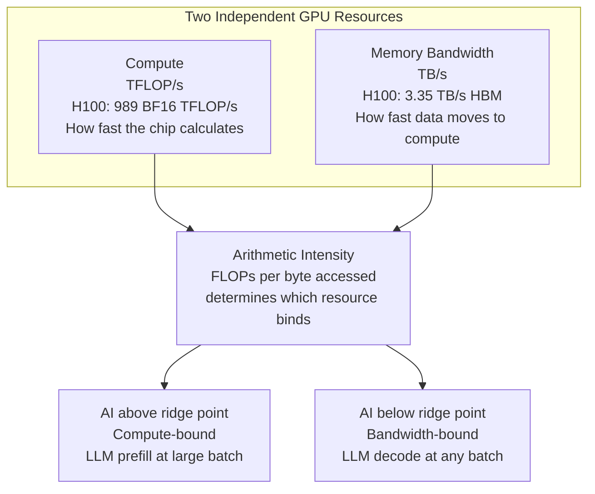

## The Roofline Model

The roofline model is the analytical framework that converts a workload's arithmetic intensity into a performance prediction — and specifically, tells you which resource is the bottleneck and by how much.

For the H100 SXM, the two ceilings are:
- **Compute ceiling**: 989 TFLOP/s (BF16 Tensor Core)
- **Bandwidth ceiling**: 3.35 TB/s = 3,350 GB/s

The **ridge point** is the arithmetic intensity at which both ceilings are simultaneously reached:

$$\text{Ridge Point} = \frac{989 \text{ TFLOP/s}}{3.35 \text{ TB/s}} \approx \textbf{295 FLOPs per byte}$$

Any workload with arithmetic intensity above 295 FLOPs/byte is compute-bound — the compute cores are fully saturated, and adding more memory bandwidth would not help. Any workload below 295 FLOPs/byte is bandwidth-bound — the memory bus is fully saturated, and adding more Tensor Cores would not help.

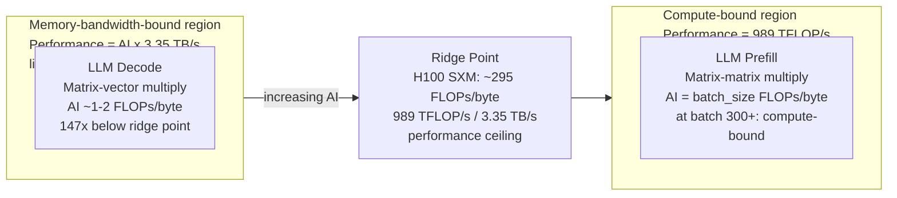

### Why LLM Decode Is Strongly Bandwidth-Bound

During autoregressive decode, the GPU generates one token at a time. The core computation is a **matrix-vector multiply**: the weight matrix for each layer [d_out × d_in] is multiplied by the current hidden state vector [d_in]. For a representative layer in Llama 3 70B (d_model = 8,192):

- **FLOPs**: 2 × d_out × d_in ≈ 2 × 8,192 × 8,192 ≈ 134M FLOPs
- **Bytes read**: d_out × d_in × 2 bytes (BF16) ≈ 134M × 2 = 268 MB
- **Arithmetic intensity**: 134M FLOPs ÷ 268 MB = **~0.5–2 FLOPs/byte**

This is roughly 150× below the H100 ridge point of 295 FLOPs/byte. The H100's 989 TFLOP/s of Tensor Core compute is almost entirely idle during decode — the bandwidth bus is the bottleneck, not the compute.

The practical consequence: if you upgraded an H100's Tensor Cores to 10× their current speed while keeping HBM bandwidth constant, decode throughput would be unchanged. The compute cores would still be waiting for data.

### Why LLM Prefill Is Compute-Bound at Large Batch Sizes

During prefill, all input tokens are processed in parallel. The core computation is a **matrix-matrix multiply**: the weight matrix [d_out × d_in] is multiplied by the token activation matrix [d_in × B], where B is the number of tokens in the batch.

- **FLOPs**: 2 × d_out × d_in × B
- **Bytes read**: d_out × d_in × 2 bytes (the weight matrix — same size regardless of B)
- **Arithmetic intensity**: (2 × d_out × d_in × B) / (d_out × d_in × 2 bytes) = **B FLOPs/byte**

At B = 300 tokens, AI = 300 FLOPs/byte — just above the H100 ridge point of 295. Prefill with large sequences or large batches is compute-bound: Tensor Core throughput is the binding resource, and adding more HBM bandwidth would not help.

This asymmetry explains why prefill and decode are optimized differently. Prefill optimization is about Tensor Core utilization (kernel fusion, operator fusion, attention kernel efficiency). Decode optimization is about memory bandwidth efficiency — quantizing weights to shrink model size, batching more requests to amortize the fixed weight-read cost, and selecting GPUs with higher HBM bandwidth.

## HBM: The Memory Technology That Makes GPU Serving Possible

Standard server DRAM uses a narrow memory bus — a DDR5 DIMM uses a 64-bit data bus, yielding ~50–70 GB/s per channel. The H100's 3.35 TB/s would require roughly 50–65 such DRAM channels, which is physically impossible to mount on a GPU package.

HBM (High Bandwidth Memory) solves this with two engineering innovations:

**Stacked die architecture**: HBM stacks multiple DRAM dies vertically and connects them with through-silicon vias (TSVs) — microscale copper pillars that pass through each die. A single HBM3 stack contains up to 16 DRAM dies. This dramatically increases capacity and bandwidth within a small physical footprint, and places the memory die physically close to the GPU die on the same package substrate, minimizing signal travel time and energy per bit.

**Wide memory bus**: HBM uses a 1,024-bit bus per stack (HBM3), compared to 64 bits for a standard DDR5 DIMM. The H100 has six HBM3 stacks: 6 × 1,024 bits = 6,144-bit total memory bus. This wide bus is where the bandwidth comes from.

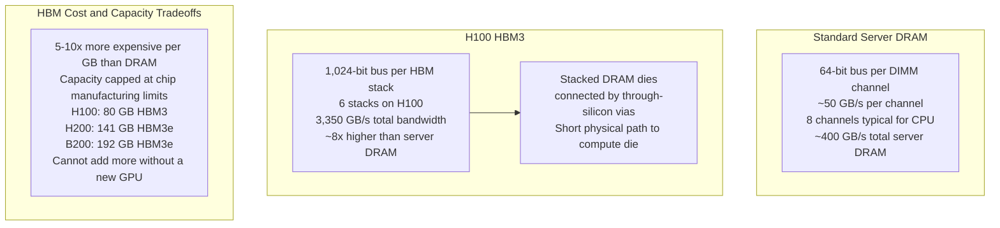

**The capacity constraint is hard**: HBM is expensive, thermally limited, and physically large relative to GPU package area. The H100 has 80 GB; the H200 increases this to 141 GB through higher-density HBM3e; the B200 reaches 192 GB. These limits are not configuration choices — they are the physical limits of the package at current manufacturing scales. You cannot add more VRAM to a GPU by swapping a module.

The capacity-bandwidth product of HBM defines two serving limits simultaneously: how large a model you can host on a GPU (capacity), and how fast you can generate tokens during decode (bandwidth). Both constraints bind independently and must both be checked before committing to a GPU choice.

## GPU Generation Comparison: The Reference Table

Every production AI infrastructure decision comes back to a small set of GPU generations. These numbers should be known without looking them up.

| GPU | VRAM | HBM BW | BF16 TFLOP/s | FP8 TFLOP/s | TDP | NVLink BW/GPU | Primary Use Case |
|---|---|---|---|---|---|---|---|
| A100 80GB SXM | 80 GB HBM2e | 2.0 TB/s | 312 | — | 400 W | 600 GB/s | Cost-effective BF16 serving; existing deployments |
| H100 80GB SXM | 80 GB HBM3 | 3.35 TB/s | 989 | 1,979 | 700 W | 900 GB/s | Production standard for interactive serving |
| H200 141GB SXM | 141 GB HBM3e | 4.8 TB/s | 989 | 1,979 | 700 W | 900 GB/s | Long-context serving; extended KV cache budget |
| B200 192GB SXM | 192 GB HBM3e | 8.0 TB/s | 2,250 | 4,500 | 1,000 W | 1,800 GB/s | Frontier training; highest-throughput serving |
| A10G 24GB | 24 GB GDDR6 | 600 GB/s | 31.2 | — | 150 W | — | Cost-sensitive inference; 7B–13B models |
| L40S 48GB | 48 GB GDDR6 | 864 GB/s | 362 | 733 | 350 W | — | Quantized 70B; single-GPU or pipeline-parallel |

**When to choose each:**

- **A100 80GB**: Still cost-effective where existing deployment sunk costs justify it. Suitable for large-batch BF16 workloads where the H100's extra bandwidth isn't needed and the 3× higher per-GPU cloud cost isn't justified. Not the right choice for new fleet builds — the H100 has better economics at most operating points.

- **H100 80GB**: The production standard for interactive LLM serving. 3× the BF16 Tensor Core compute and 68% more HBM bandwidth versus A100. The FP8 Tensor Cores at 1,979 TFLOP/s — exactly 2× BF16 — are the major serving advantage: FP8 serving doubles decode throughput over BF16 by halving model size on the same bandwidth. The default choice for any new production fleet.

- **H200 141GB**: Same compute die as H100 (same Tensor Cores, same TFLOP/s), but 76% more VRAM and 43% more bandwidth. The primary advantage is context length: 141 GB enables long-context serving without tensor-parallel sharding that would otherwise be required at 80 GB. Choose H200 when serving 32K+ token contexts or when KV cache budget — not compute — is the binding constraint.

- **B200 192GB**: 8.0 TB/s HBM bandwidth is a 2.4× improvement over H100. Decode throughput scales proportionally: a 70B model generates ~57 tokens/sec at batch 1 versus H100's ~24. The 1,000W TDP requires liquid cooling — air-cooled deployments at full density are not feasible. Appropriate for the highest-throughput serving needs or frontier model training.

- **A10G 24GB**: GDDR6 rather than HBM — lower bandwidth and capacity, but dramatically lower cost and power. 24 GB limits to 7B–13B unquantized models or 30B–70B with aggressive quantization. No NVLink means tensor parallelism is inefficient at 4+ GPUs. The right choice for high-volume, cost-sensitive inference of smaller models where per-unit economics dominate.

- **L40S 48GB**: 48 GB GDDR6 fits a 70B INT4 model (35 GB) with meaningful KV cache headroom. 864 GB/s bandwidth is sufficient for single-GPU decode at moderate batch sizes. No NVLink restricts to single-GPU or pipeline-parallel. The cost-optimized option for organizations that need 70B serving without NVSwitch node infrastructure.

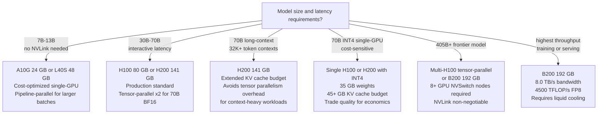

## Tensor Cores: What They Actually Do

A standard CUDA core executes one floating-point multiply-add per clock cycle. At 1.5 GHz, that is 1.5 billion FLOPs per second per core. An H100 has thousands of CUDA cores — but this is not where the headline TFLOP/s numbers come from.

**Tensor Cores** execute an entire matrix multiply-accumulate in a single clock cycle. A third-generation H100 Tensor Core computes a 16×16 matrix multiply-accumulate in one cycle: 16 × 16 × 2 = 512 multiply-add operations per cycle, compared to 1 for a CUDA core — a 512× throughput difference for matrix operations. At 1.5 GHz, a single Tensor Core delivers ~768 GFLOP/s. An H100 has 528 Tensor Core units. The advertised 989 TFLOP/s BF16 figure comes almost entirely from this array.

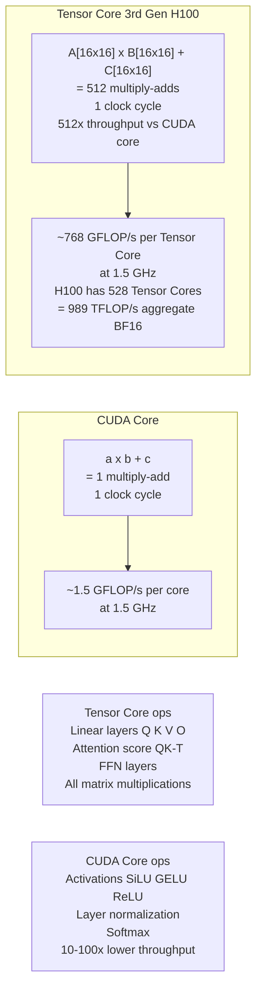

**Operations that use Tensor Cores**: Every operation that reduces to a matrix multiplication.
- Attention linear projections: Q, K, V, output projections — all matrix multiplies
- Attention scores: Q × K^T — matrix multiply
- FFN layers: both up and down projections — matrix multiplies
- Embedding lookups: not a matrix multiply; no Tensor Core benefit

**Operations that run on CUDA cores** at 10–100× lower throughput than the Tensor Core headline:
- Activation functions: SiLU, GELU, ReLU — elementwise, one CUDA core per operation
- Layer normalization: requires sequential reduction operations
- Softmax: requires sequential max and sum along the sequence dimension

The practical implication: transformer models achieve high hardware utilization specifically because the forward pass is 90%+ matrix multiplications. A model that introduced heavy non-matrix operations (dynamic control flow per token, complex post-processing) would see the effective TFLOP/s utilization drop proportionally.

**FP8 Tensor Cores on H100/H200/B200**: The H100 introduced native FP8 (8-bit floating-point) Tensor Cores at 1,979 TFLOP/s — exactly 2× the BF16 figure. The mechanism is straightforward: halving the bits per operand doubles the number of operands that fit in the Tensor Core's input registers per cycle, doubling throughput. For decode — which is bandwidth-bound — the FP8 benefit is even simpler: a 70B FP8 model occupies 70 GB versus 140 GB for BF16, and 3.35 TB/s ÷ 70 GB = 48 tokens/sec versus 24 tokens/sec — a 2× decode throughput improvement from precision reduction alone.

## The GPU Memory Hierarchy

Data moves from persistent storage to the Tensor Cores through a hierarchy of progressively faster, smaller, and more expensive memory. Understanding which stage is the bottleneck is what the roofline model's bandwidth axis measures.

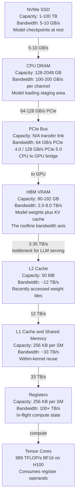

**The HBM-to-L2 step is the measured bottleneck**. L2-to-L1 (12 TB/s) and L1-to-registers (33 TB/s) are 3–10× faster than HBM bandwidth. The matrix tiles that Tensor Cores consume fit largely in L2/L1 cache during a compute-bound operation, so L2 and L1 are rarely the bottleneck in transformer inference. The bottleneck is always HBM-to-L2, which is exactly the bandwidth term in the roofline model.

**What lives where during inference:**
- **NVMe**: Model checkpoints. Not in the critical path during serving — only accessed at startup or model swap.
- **CPU DRAM**: Operating system, serving framework, CPU-side KV cache for offloading. Not in the per-token critical path.
- **HBM (VRAM)**: Model weights (resident throughout serving), KV cache (written and read every decode step), and activations (transient, small). This is the hot storage that determines serving performance.
- **L2/L1**: Frequently reused weight tiles within a kernel execution. Automatically managed by the GPU — no explicit programmer control.
- **Registers**: Active computation state. Automatically managed.

**The PCIe bottleneck matters at startup**: The H100's 3.35 TB/s HBM bandwidth is ~26× faster than PCIe 5.0's 128 GB/s. Once a model is loaded into HBM, PCIe is not in the per-token critical path. But during model loading or hot-swapping, PCIe becomes the bottleneck: loading a 140 GB BF16 70B model from CPU DRAM to GPU HBM takes 140 GB ÷ 64 GB/s (PCIe 4.0) ≈ 2.2 seconds. This is why fast model swap in multi-model serving systems is a real engineering concern, not a trivial detail.

## Reading a GPU Spec Sheet for Serving Decisions

Vendor spec sheets present dozens of numbers. Only five matter for LLM serving.

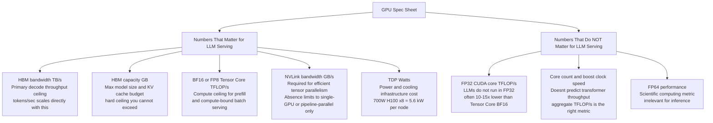

**HBM bandwidth (TB/s)**: The primary constraint for decode throughput. Every decode step reads the full model weight matrix; bandwidth determines how many tokens per second you can generate per GPU. At batch 1, tokens/sec ≈ bandwidth / model_size. More bandwidth → proportionally more tokens per second.

**HBM capacity (GB)**: The primary constraint for (1) maximum model size and (2) maximum KV cache budget (concurrent sequences × context length). Both constraints are hard — you cannot exceed physical VRAM. See [KV Cache Management](../15-model-serving/03-kv-cache-management.md) for the exact arithmetic.

**Tensor Core TFLOP/s at BF16 or FP8**: The compute ceiling. Relevant for prefill throughput and large batch sizes where decode becomes partially compute-bound. Always use the Tensor Core BF16 or FP8 number — not the FP32 CUDA core number, which is what many spec sheets print large.

**NVLink bandwidth per GPU**: Determines whether tensor parallelism within a node scales efficiently. An H100 SXM's 900 GB/s NVLink bandwidth (NVLink 4.0) makes all-reduce operations between 8 GPUs in a DGX node fast enough for tensor-parallel inference. An H100 PCIe's 128 GB/s PCIe bandwidth is 7× slower — tensor parallelism across 4+ PCIe-only GPUs sees the all-reduce communication dominate decode latency.

**TDP (watts)**: Determines power provisioning and cooling requirements. An 8× H100 SXM server has a TDP of roughly 6.4 kW (700W × 8 GPUs + ~800W for other components). Standard data center racks are provisioned for 10–20 kW — a full rack of H100 SXM nodes needs high-density power and typically liquid cooling for the higher-density configurations.

## The Decode Throughput Formula

The single most useful back-of-envelope calculation in LLM serving:

$$\text{Tokens/sec per GPU} \approx \frac{\text{HBM bandwidth (bytes/sec)}}{\text{Model size (bytes)}}$$

**Why this formula works**: During autoregressive decode at batch size 1, generating each token requires a forward pass through the model. Each layer involves a matrix-vector multiply, which reads the full weight matrix from HBM. The total bytes read per token equals the full model size (every weight is accessed once per forward pass). Tokens per second is therefore bounded by how many times per second you can read the model from HBM.

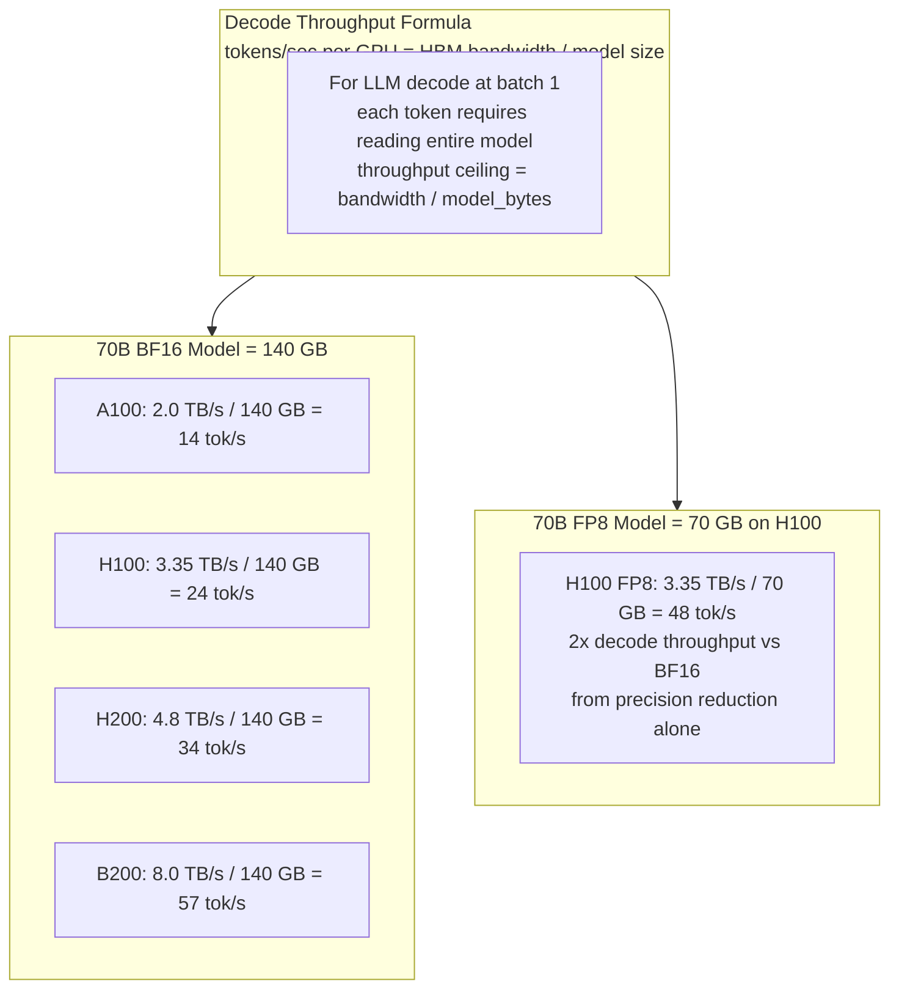

Real systems achieve 60–80% of the theoretical ceiling. The gap comes from:
- Attention computation overhead: reading the KV cache from HBM (not captured in the simple model_size formula), plus softmax over the sequence
- Non-Tensor-Core operations (layer norm, activations, residuals) that run at much lower throughput
- CUDA kernel launch overhead and memory synchronization between Streaming Multiprocessors
- Memory access patterns that aren't perfectly sequential streams

**How batch size improves throughput**: At batch size B, the matrix operations become matrix-matrix multiplies: the weight matrix [d_out × d_in] is multiplied by a batch of activations [d_in × B]. The FLOPs scale with B, but the bytes read from HBM per batch step are the same (the weight matrix doesn't change). Arithmetic intensity increases linearly with B, and throughput scales nearly linearly until the compute ceiling is approached.

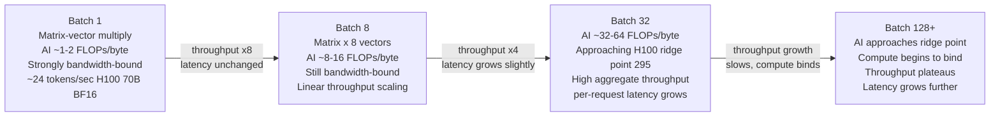

**The VRAM budget split**: The decode throughput formula explains why the model-weight-to-KV-cache ratio in VRAM is the central resource tension in serving. The model weights determine the bandwidth demand per token; the remaining VRAM after weights determines how many concurrent sequences you can serve before running out of KV cache.

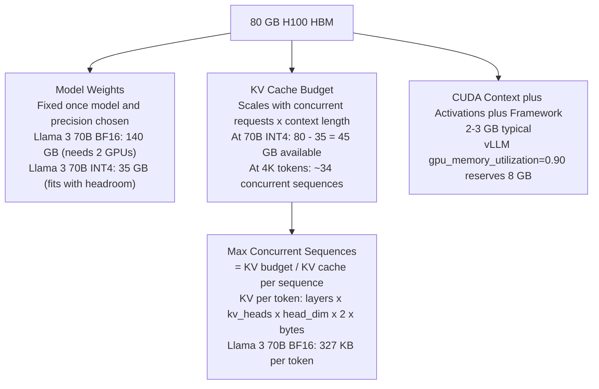

For the full KV cache sizing arithmetic and how this interacts with serving concurrency, see [KV Cache Management](../15-model-serving/03-kv-cache-management.md).

## Power, Cooling, and Data Center Constraints

GPU serving decisions are infrastructure decisions. The power and cooling requirements of a GPU fleet are first-class constraints on deployment feasibility, particularly at high GPU density.

**TDP and actual power draw**: A GPU's TDP (thermal design power) is the maximum power the cooling system must dissipate. During LLM serving, actual GPU power draw is 60–80% of TDP because the workload is memory-bandwidth-bound, not compute-bound: the Tensor Cores are underutilized, and idle compute cores consume less power than active ones. An H100 at TDP = 700W typically draws 430–560W during continuous decode. This matters for power infrastructure sizing — sizing for full TDP on every GPU wastes significant cooling headroom.

**Cooling requirements by generation**: Air-cooled racks typically provision 10–20 kW per rack. An 8× H100 SXM server has a total node TDP of approximately 6.4 kW. Air cooling is feasible for H100 deployments at typical densities (2–3 nodes per rack). The B200 at 1,000W per GPU — 8,000W per 8-GPU node — essentially requires liquid cooling for any production density; running B200 nodes in standard air-cooled racks at full load will exceed thermal limits.

**Rack density arithmetic**:

| Configuration | Per-Node TDP | Air-cooled rack capacity | Liquid-cooled rack capacity |
|---|---|---|---|
| 8× H100 SXM | ~6.4 kW | 2–3 nodes | 4–6 nodes |
| 8× H200 SXM | ~6.4 kW | 2–3 nodes | 4–6 nodes |
| 8× B200 SXM | ~8.8 kW | Not feasible at full load | 4–5 nodes |
| 8× A10G | ~1.6 kW | 8–10 nodes | — |

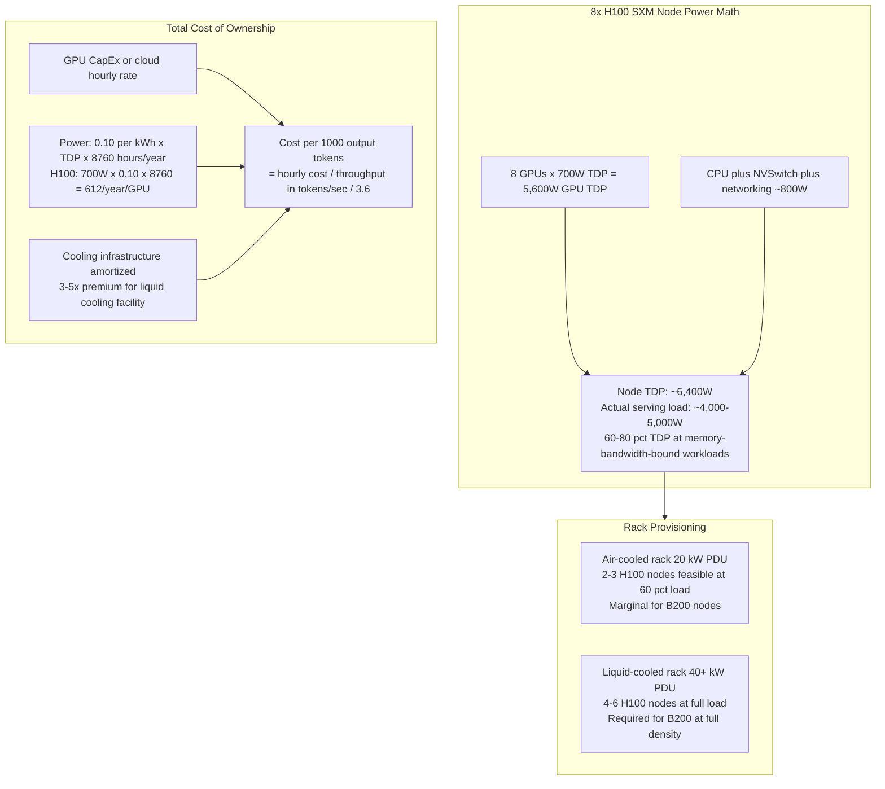

**Cost per token as the synthesis metric**: The right question for GPU selection is not "which GPU is fastest" but "which GPU delivers the lowest cost per 1,000 output tokens at the target latency SLO." An A10G at 150W and $0.75/hr can outperform an H100 at 700W and $3/hr on cost-per-token for a 7B model that generates tokens far faster than any latency SLO requires, simply because the H100's throughput advantage isn't usable at that model size. The sizing methodology from [GPU Sizing & Capacity Planning](02-gpu-sizing-and-capacity-planning.md) applies the arithmetic.

---

## Interview Questions

### Beginner

**Q: What is the difference between compute (TFLOP/s) and memory bandwidth (TB/s) on a GPU? Why can't you just focus on one?**

Compute is the rate at which the GPU executes floating-point operations — for an H100 SXM, 989 trillion BF16 multiply-adds per second. Memory bandwidth is the rate at which data can be read from the GPU's HBM into the compute cores — 3.35 TB/s for the H100. These are two independently limited resources: a GPU can saturate its compute without saturating its bandwidth (high arithmetic intensity, many FLOPs per byte — compute-bound), or saturate its bandwidth without saturating its compute (low arithmetic intensity, few FLOPs per byte — bandwidth-bound). LLM decode has arithmetic intensity of ~1–2 FLOPs/byte, far below the H100 ridge point of ~295 FLOPs/byte. Adding more Tensor Cores to an H100 would not make decode faster — the bandwidth is the bottleneck. LLM prefill with a large batch has arithmetic intensity proportional to batch size — at 300+ tokens, it's compute-bound, and adding more bandwidth would not help. These are different problems requiring different hardware choices.

**Q: A 70B parameter model at BF16 requires how much VRAM, and what is the first GPU that can serve it on a single chip without quantization?**

A 70B parameter model at BF16 (2 bytes per parameter) occupies 70 × 10⁹ × 2 = 140 GB of VRAM. No current single GPU holds 140 GB: the H100 has 80 GB, the H200 has 141 GB. The H200 at 141 GB is technically the first single GPU that fits the model weights — but with only 1 GB left after weights, KV cache capacity for concurrent serving is near zero. In practice, a 70B BF16 model is served across 2× H100s (tensor-parallel), or on a single GPU using INT4 quantization (35 GB, leaving 45 GB for KV cache).

### Intermediate

**Q: Explain why LLM decode is memory-bandwidth-bound and LLM prefill is compute-bound at large batch sizes. Use the arithmetic intensity concept.**

Arithmetic intensity is FLOPs executed per byte of HBM data accessed. During decode at batch size 1, the core operation is matrix-vector multiply: for a weight matrix [d_out × d_in], FLOPs = 2 × d_out × d_in; bytes read = d_out × d_in × 2 (BF16); arithmetic intensity = 1 FLOPs/byte. The H100 ridge point is ~295 FLOPs/byte. Decode is ~300× below it — bandwidth-bound by a large margin.

During prefill at batch size B, the core operation is matrix-matrix multiply: FLOPs = 2 × d_out × d_in × B; bytes = d_out × d_in × 2 bytes (same weight matrix, regardless of B); arithmetic intensity = B FLOPs/byte. At B = 300 tokens, AI = 300 FLOPs/byte, just above the ridge point — compute-bound. The weight matrix is read once and used B times, which is why large prefill batches efficiently utilize the Tensor Cores.

**Q: An H200 has the same TFLOP/s as an H100 but 76% more VRAM and 43% more bandwidth. For which workloads does H200 outperform H100, and for which are they equivalent?**

H200 wins on: (1) Decode throughput — the bandwidth advantage translates directly to 43% more tokens/sec for any bandwidth-bound decode workload, regardless of model size. (2) Long-context serving — 141 GB enables more concurrent long-context sequences without tensor-parallel sharding that H100 at 80 GB would require. (3) KV cache-constrained workloads — any scenario where the 80 GB H100 KV cache budget was the binding constraint benefits from H200's larger budget. H200 equals H100 on: (1) Compute-bound prefill — same Tensor Core array, same TFLOP/s. (2) Small models (7B, 13B) — these are often compute-limited at moderate batch sizes, not bandwidth-limited, so more bandwidth isn't useful. (3) Any workload where the model fits easily on H100 and the bottleneck is not bandwidth.

### Senior

**Q: Using the decode throughput formula, calculate theoretical tokens/sec for an H100 serving Llama 3 70B at BF16 and at FP8. Then explain the business case for FP8 serving.**

BF16: 3,350 GB/s ÷ 140 GB = **~24 tokens/sec** theoretical ceiling at batch 1. FP8: 70B FP8 model = 70 GB (0.5 bytes × 70B parameters). Bandwidth stays 3,350 GB/s, model size halves. 3,350 GB/s ÷ 70 GB = **~48 tokens/sec** theoretical ceiling — 2× improvement.

Real systems achieve 60–80% of ceiling: BF16 → 14–19 tokens/sec; FP8 → 29–38 tokens/sec. The business case: at 100 token/sec sustained serving demand on H100, BF16 requires 100 ÷ 17 ≈ 6 GPUs; FP8 requires 100 ÷ 34 ≈ 3 GPUs. Halving the GPU count halves the infrastructure cost for the same throughput. The quality tradeoff (FP8 vs BF16) is minimal for most production use cases — typically < 0.5% perplexity increase — and must be validated task-specifically before deployment, not assumed neutral.

**Q: Design the GPU fleet for a 405B model at BF16: minimum GPU count, memory partition, and why NVLink is non-negotiable.**

Weight memory: 405B × 2 bytes = 810 GB. Minimum H100 count for weights alone: ⌈810/80⌉ = 11 GPUs. Tensor parallelism works in powers of 2, so 16 H100s (16 × 80 = 1,280 GB). Weight footprint per GPU: 810 GB ÷ 16 = 50.6 GB. Remaining KV cache per GPU: 80 − 50.6 = 29.4 GB. At 327 KB/token for a 70B-equivalent model (405B has different architecture; use this as an order-of-magnitude), 29.4 GB supports roughly 89 concurrent 1K-token sequences per GPU group.

NVLink necessity: tensor parallelism requires an all-reduce at every attention layer and every FFN layer — for 405B, that's roughly 128 layers × 2 all-reduces per layer = 256 all-reduces per forward pass. Each all-reduce transfers 2 × batch_size × d_model × dtype_bytes across 16 GPUs. With NVLink 4.0 at 900 GB/s, the all-reduce latency per step is roughly 2 × d_model × 2 bytes × 16 GPUs ÷ 900 GB/s × 16 links ≈ microseconds per step. With PCIe 5.0 at 128 GB/s total per GPU, the same all-reduce takes 7× longer — at 256 all-reduces per forward pass, the communication overhead exceeds the compute time, and the GPU spends more time waiting for communication than computing. Interactive inference becomes infeasible.

### Staff

**Q: A product requires 2,000 tokens/sec of sustained decode throughput for Llama 3 70B at BF16, P95 TTFT under 600ms. Design the GPU fleet. Include the memory budget, NVLink requirement, and the argument for or against quantization.**

**Throughput sizing**: H100 + 70B BF16, theoretical 24 tokens/sec per GPU at batch 1. At continuous batching with batch 16–32, achievable throughput per GPU group is ~150–200 tokens/sec (batching amortizes bandwidth across multiple requests). Raw GPU group count: 2,000 ÷ 175 ≈ 12 groups. Each group is 2× H100s (70B BF16 needs 2× 80 GB = 160 GB, tight). Fleet: 24 H100 GPUs minimum for throughput.

**Memory check**: Each group has 160 GB total. Weights: 140 GB. KV cache: 20 GB. At 4K tokens, 20 GB ÷ (4,096 × 327 KB) ≈ 15 concurrent sequences per group. At 175 tokens/sec per group and 300 output tokens per request, average time in system ≈ 1.7 seconds. Concurrency needed: 2,000 ÷ 300 × 1.7 ≈ 11 concurrent sequences per group. 15 available vs 11 needed — barely sufficient. For any variance in context length, this will evict. Increase to 3 GPUs per group (3 × 80 = 240 GB, 100 GB KV cache, 76 concurrent sequences per group) for a safe operating margin.

**Quantization argument**: INT4 reduces weights to 35 GB per group-GPU, freeing 45 GB for KV cache — 34 concurrent 4K-token sequences per 1-GPU group vs 15 on a 2-GPU BF16 group. This enables single-GPU serving, eliminating the tensor-parallel all-reduce latency overhead. But: INT4 quality loss must be validated for the specific use case. For customer-facing production serving where quality is critical, BF16 or FP8 (not INT4) is the right tradeoff. FP8 is the pragmatic choice: 70 GB weights, 10 GB KV on one H100, 48 tokens/sec decode ceiling, and quality regression typically under 0.5% — a clear win over BF16 here.

---

## Google-Level Follow-Ups

**"An H200 has the same 989 TFLOP/s compute as an H100 but costs 40% more. A customer's usage is 70% prefill, 30% decode. Is the H200 worth it?"**
Tests whether the candidate correctly identifies that the answer is determined by which resource is the bottleneck for the specific workload mix. At 70% prefill, the fleet is largely compute-bound during prefill — H200 and H100 have identical compute performance, so the H200's bandwidth and memory advantages aren't in the critical path for 70% of work. The H200 primarily benefits decode-heavy workloads. The decision comes down to: does the 30% decode portion and any KV cache size advantages justify a 40% cost premium? If average context lengths are long (H200's 141 GB KV budget matters) or if the product is heading toward longer contexts (H200 extends the runway before needing to shard), the premium can be justified. If the workload will remain primarily short-context prefill-heavy, the H100 has better cost-per-token.

**"The decode throughput formula says tokens/sec ≈ bandwidth / model_size. Real systems hit only 60–80% of this ceiling. Where does the other 20–40% go — name specific sources and quantify each where possible."**
Tests precise operational understanding beyond the simplified formula. Sources: (1) KV cache reads — every decode step also reads the KV cache for all prior tokens; at 4K context with 327 KB/token for 70B, that's 327 KB × 4,000 = 1.3 GB per request per step, adding ~10–20% to per-step memory read time. (2) Non-Tensor-Core operations — layer norm, softmax, and activations run on CUDA cores at 10–100× lower throughput; they add ~5–10% of total step time. (3) Kernel launch and synchronization overhead — each SM synchronizes at layer boundaries; for 80 layers this is ~80 sync points per token, adding microseconds per token. (4) Memory access pattern inefficiency — weight matrices aren't always read as perfectly contiguous streams; cache line misses add ~5% overhead. Total measured efficiency range: 60–80% of theoretical, consistent with these sources.

**"A customer says their H100 is showing 900 GB/s of HBM bandwidth utilization (measured by nvidia-smi) but only 30% GPU utilization. Is this consistent? What does it mean for their serving setup?"**
Tests whether the candidate understands that bandwidth and compute utilization are independent metrics and that this combination points to a specific state. Yes, this is perfectly consistent: it describes a memory-bandwidth-bound workload at moderate batch size. 900 GB/s is ~27% of H100's 3,350 GB/s peak bandwidth — so actual bandwidth is not even saturated, and compute is even less so. "30% GPU utilization" likely measures SM active percentage, which is low because each SM spends most of its time waiting for HBM data, not executing. This means the system is serving a small batch (likely batch 1–4), generating tokens at below-ceiling rate because bandwidth is not fully saturated. The recommendation: increase batch size via continuous batching to amortize the bandwidth cost across more requests. At batch 32, both bandwidth utilization and SM utilization would rise proportionally, and tokens/sec would increase nearly linearly — more throughput with the same hardware at the same TTFT or slightly higher.

**"Explain why FP8 helps decode throughput but has a different effect on prefill throughput, and why these effects are different in magnitude."**
Tests roofline model application to precision changes. For decode: decode is bandwidth-bound. FP8 halves model size (70B → 70 GB vs 140 GB BF16). Bandwidth is constant (3,350 GB/s). Tokens/sec = 3,350 / 70 = 48 vs 3,350 / 140 = 24. FP8 doubles decode throughput — a 2× effect, entirely from the bandwidth constraint. For prefill: prefill is compute-bound at large batch sizes. FP8 Tensor Cores deliver 1,979 TFLOP/s vs 989 TFLOP/s for BF16. The compute ceiling doubles — so FP8 also doubles prefill throughput at large batches. However, at moderate prefill batch sizes (batch 8–16, AI < 295 FLOPs/byte), prefill is still bandwidth-bound, and FP8 helps through the model size reduction, not the compute ceiling. The effects are the same in magnitude (2×) but for different reasons: decode benefits from reduced model size (bandwidth term), prefill benefits from higher Tensor Core throughput (compute ceiling). Both effects are real and both are captured at the same time by moving to FP8.

---

## Common Mistakes

1. **Using FP32 TFLOP/s as the GPU compute number for LLM sizing**. Vendors prominently list FP32 CUDA core performance because it is a universal, defensible figure. The H100's FP32 CUDA core performance is ~67 TFLOP/s — 15× less than the 989 TFLOP/s BF16 Tensor Core number. LLMs run in BF16 or FP8 using Tensor Cores in production. The FP32 number is irrelevant for transformer inference, but it is often the number printed largest on marketing materials.

2. **Assuming more compute (TFLOP/s) means more tokens per second for decode**. Decode is memory-bandwidth-bound. A hypothetical GPU with 10× the Tensor Core compute of an H100 but identical HBM bandwidth would generate tokens at the same rate as the H100 for 70B decode. Decode throughput is a function of bandwidth and model size, not TFLOP/s. This mistake leads to over-weighting compute in GPU selection for primarily decode-heavy workloads.

3. **Treating model weights as the only VRAM budget line item**. Model weights are the largest static VRAM consumer, but the KV cache is the dynamic consumer that scales with batch size and context length. A 70B INT4 model (35 GB) fits "easily" on a single H100 — until the KV cache at target concurrency and context length consumes the remaining 45 GB. Always plan both budget items together: weights + KV cache + framework overhead, not weights alone.

4. **Ignoring NVLink when comparing H100 SXM vs H100 PCIe**. The H100 SXM and H100 PCIe have identical HBM bandwidth, capacity, and TFLOP/s numbers. The difference is NVLink: SXM has 900 GB/s NVLink for inter-GPU communication; PCIe has 128 GB/s via PCIe 5.0. For single-GPU serving of models that fit, they are equivalent. For tensor-parallel serving of 70B+ models requiring 2+ GPUs, the PCIe variant's 7× lower inter-GPU bandwidth makes the all-reduce overhead per layer prohibitive at any meaningful batch size.

5. **Applying the decode throughput formula to prefill throughput**. Tokens/sec ≈ bandwidth / model_size is the decode formula. Prefill processes all tokens in parallel and is compute-bound at large sequence lengths. Prefill throughput scales with TFLOP/s and batch size, not bandwidth. A 70B model prefilling a 4,096-token prompt takes the same GPU time as prefilling 4,096 short prompts of 1 token each (the compute per token is the same) — neither scales with bandwidth the way decode does.

6. **Sizing cooling and power infrastructure for full TDP on every GPU**. LLM serving draws 60–80% of TDP, not 100%, because the workload is bandwidth-bound and the Tensor Cores are partially idle. Sizing rack PDU capacity for 100% TDP is conservative and safe, but sizing cooling headroom for 100% TDP peak across every GPU simultaneously is often unnecessary — real thermal load tracks actual power draw, not TDP. However, for worst-case robustness (burst compute, large prefill), designing cooling for 80–90% of TDP is a reasonable production target.

---

## Key Takeaways

- **Every GPU serving decision is downstream of two resources: compute (TFLOP/s) and memory bandwidth (TB/s)**. Which one binds depends on the workload's arithmetic intensity — FLOPs per byte read from HBM.
- **LLM decode is strongly memory-bandwidth-bound** at ~1–2 FLOPs/byte, far below the H100 ridge point of ~295 FLOPs/byte. Decode throughput scales directly with HBM bandwidth. Adding more Tensor Cores without increasing bandwidth does not improve decode speed.
- **LLM prefill is compute-bound at large batch sizes** — arithmetic intensity scales with batch size B; above B ≈ 300 for H100, Tensor Cores are the bottleneck. Prefill throughput scales with TFLOP/s, not bandwidth.
- **The decode throughput formula** — tokens/sec ≈ HBM bandwidth / model size — is the most important back-of-envelope calculation in LLM serving. For H100 + 70B BF16: 3,350 GB/s ÷ 140 GB = 24 tokens/sec theoretical ceiling at batch 1. Real systems achieve 60–80% of this figure.
- **Tensor Cores are responsible for nearly all advertised TFLOP/s**. BF16 or FP8 Tensor Core TFLOP/s is the right figure for inference planning — not FP32 CUDA core performance, which is 10–15× lower and irrelevant for transformer workloads.
- **HBM capacity and bandwidth are both hard limits** that cannot be scaled independently. The H200's 141 GB vs H100's 80 GB is the differentiator for long-context serving; the B200's 8.0 TB/s vs H100's 3.35 TB/s is the differentiator for decode throughput. Both must be checked: a model can fit in memory and still be bandwidth-limited, or have sufficient bandwidth and be capacity-limited by KV cache.
- **NVLink (900 GB/s on H100 SXM) enables efficient tensor parallelism within a node**. Absent NVLink (A10G, L40S, H100 PCIe), tensor-parallel inference across 4+ GPUs sees communication overhead dominate decode latency. Models requiring multi-GPU serving must be deployed on NVLink-equipped hardware.
- **Power and cooling are first-class infrastructure constraints**: an 8× H100 SXM node draws ~5.6 kW GPU TDP — standard data center racks handle 2–3 such nodes with standard PDUs, and B200 nodes require liquid cooling at full density.

---

*Part of [GPU Systems](index.md) · [GPU Sizing & Capacity Planning](02-gpu-sizing-and-capacity-planning.md) · [The Inference Stack](../14-ai-infrastructure/02-the-inference-stack.md) · [KV Cache Management](../15-model-serving/03-kv-cache-management.md) · [Quantization & Compression](../15-model-serving/04-quantization-and-compression.md) · [Multi-GPU Topologies & Interconnects](03-multi-gpu-topologies-and-interconnects.md)*
