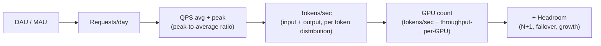
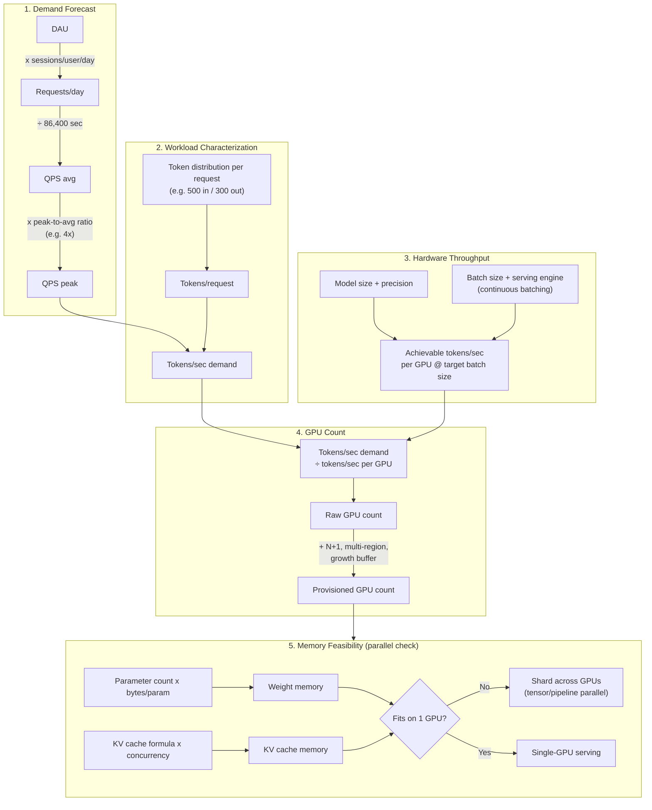
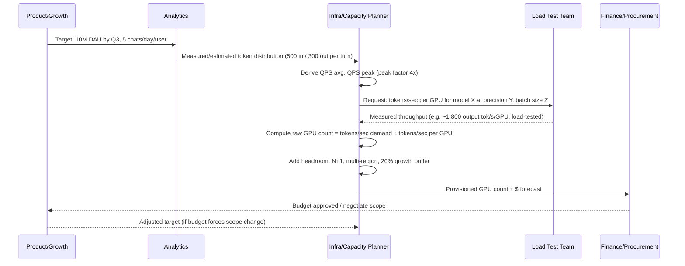
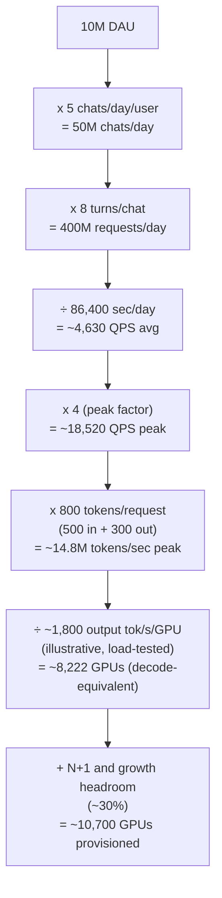
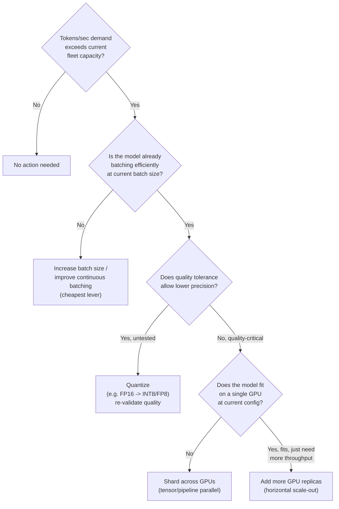

# GPU Sizing & Capacity Planning

## Overview

GPU sizing is the process of converting a target traffic profile — daily active users, requests per second, a latency SLO — into a concrete number of accelerators and a serving configuration that can hit that target without falling over at peak. It is arithmetic, not guesswork: every number in the chain (QPS, tokens/sec, tokens/sec-per-GPU) is estimable from first principles or load-test data, and the GPU count falls straight out of dividing one by the other. Get the chain wrong and you either overspend by millions of dollars a year or get paged at 2 a.m. when traffic exceeds capacity nobody sized for. This chapter is the self-hosted-specific deep dive into the general chain introduced in [Capacity Planning Primer](../01-fundamentals/04-capacity-planning-primer.md); read that first if the DAU-to-tokens/sec conversion is new to you.

## Definition

GPU sizing and capacity planning is the discipline of estimating the number, type, and configuration of accelerators required to serve a model at a target throughput and latency, by chaining together demand forecasting (DAU/MAU to requests/day to QPS), workload characterization (requests to tokens, given an assumed input/output token distribution), and hardware throughput estimation (tokens/sec achievable per GPU at a given model size, precision, and batch size), then adding headroom for peak traffic, failover, and growth.

## Problem Statement

Without a disciplined sizing method, GPU capacity decisions default to one of two failure modes, both expensive:

- **Under-provisioning** — capacity is sized to average traffic, so the system saturates the moment traffic exceeds average (which it does, by definition, roughly half the time, and far more during launches, viral moments, or regional peak hours). The result is queued requests, blown latency SLOs, and a fire drill that ends in emergency over-provisioning at on-demand prices — the most expensive way to buy compute.
- **Over-provisioning** — capacity is sized "to be safe" with no model behind the number, so the fleet sits at 20-30% utilization most of the day. GPUs are the largest line item in an AI product's infrastructure budget; a doubled fleet is millions of dollars a year for a mid-size product and tens of millions for a large one.

Both failure modes share a root cause: nobody wrote down the assumptions (traffic shape, token distribution, throughput per GPU) as explicit, falsifiable numbers. This chapter is the worked-math reference the rest of these notes leans on — every later case study (ChatGPT-scale, Perplexity-scale, Cursor-scale) reuses this conversion chain rather than re-deriving it.

## Why This Architecture Exists

Traditional web capacity planning has a decades-old playbook: profile requests/sec, know your per-request CPU/memory cost, multiply, add headroom, done. Two things break that playbook for LLM serving.

First, **the unit of work is not the request, it's the token** — a single request's token cost is itself a random variable (an 8-token "thanks!" and an 8,000-token code-review response are both "one request"). Sizing on requests/sec alone hides a 100x swing in compute demand between two systems with identical QPS.

Second, **throughput per accelerator is not a fixed hardware constant** — it depends on model size, numeric precision, batch size, and serving-engine efficiency (continuous batching, KV cache management), all *configuration* choices, not physics. The same GPU running the same model can differ by 5-10x in sustained tokens/sec depending on whether the serving stack batches well.

The industry's answer was to insert an explicit **tokens/sec** unit between "business metric" and "hardware count" — QPS converts to tokens/sec via an assumed token distribution, and tokens/sec converts to GPU count via an assumed, ideally load-test-validated, per-GPU throughput figure. Skipping that intermediate step is the single most common reason sizing estimates are wrong by an order of magnitude.

## Core Concepts

- **DAU / MAU** — daily/monthly active users; the top of the demand funnel, sourced from product analytics, not infrastructure.
- **Requests/day** — DAU × average sessions or messages per user per day. The first multiplication in the chain.
- **QPS (average)** — requests/day ÷ seconds/day (86,400), assuming uniform-ish distribution across the day (rarely true, which is exactly why peak QPS matters separately).
- **Peak-to-average ratio (peak factor)** — how much higher traffic is at the busiest moment than the daily average; consumer chat traffic commonly runs **3-5x** average at peak (evening hours, regional overlap, viral spikes), while internal enterprise tools often see milder ratios (1.5-2.5x) because usage clusters in business hours but across more time zones.
- **Input/output token distribution** — the assumed number of input (prompt) tokens and output (generated) tokens per request; this is workload-specific and must be measured, not assumed once and reused forever.
- **Tokens/sec (system-wide)** — the real unit of compute demand: (input + output tokens per request) × QPS, with input and output sometimes tracked separately because prefill and decode have different cost profiles (see [Transformer Internals for Systems Engineers](../02-llm-architecture/01-transformer-internals-for-systems-engineers.md)).
- **Achievable throughput per GPU** — sustained output tokens/sec a given model, at a given precision and batch size, can serve on one accelerator under continuous batching. This number must come from a load test or a vendor/community benchmark for your exact model+hardware+engine combination — every figure used illustratively in this chapter is order-of-magnitude, not a guarantee.
- **Headroom** — capacity provisioned above the bare peak estimate, to absorb forecast error, failover, and redundancy (N+1).
- **Memory-bound sizing** — a separate axis from throughput sizing: does the model (plus KV cache at target concurrency and context length) physically fit in the memory of the GPU(s) you're planning to use, independent of whether you have "enough" compute.

## The GPU Sizing Pipeline

The sizing pipeline is a strict pipeline of unit conversions: business metric in, accelerator count out. Each arrow is one multiplication or division, and each box's output is the next box's input.

The detailed view exposes the assumption that feeds each conversion step — this is the version you actually defend in a capacity review, because every arrow has a named, falsifiable input next to it.

## Components

| Component | Responsibility | Does NOT own |
|---|---|---|
| Demand forecast (product/data science) | DAU/MAU, sessions per user, growth trajectory | Token-level workload shape |
| Workload characterization (infra + product analytics) | Input/output token distribution per request type, measured from logs or estimated pre-launch | Hardware throughput numbers |
| Load testing / benchmarking | Measured tokens/sec per GPU for the actual model + precision + batch size + serving engine in use | Demand forecasting |
| Capacity model (spreadsheet or service) | Chains the above into a GPU count, exposes every assumption as an editable input | Procurement, actual GPU allocation |
| Headroom policy | N+1, multi-region redundancy, growth buffer percentage | Day-to-day autoscaling (that's a runtime concern, not a planning one) |
| Memory sizing check | Whether model + KV cache fits per-GPU or requires sharding | Throughput sizing (a model can fit in memory and still need more GPUs for throughput, or vice versa) |
| Autoscaling / fleet management | Translating the planned baseline into live instance counts, reacting to real-time signal | The original capacity estimate (autoscaling reacts within the provisioned ceiling; it doesn't replace planning for that ceiling) |

## A Sizing Session End to End

Sizing isn't a "request," but it has the same kind of lifecycle as any cross-functional planning process — a sequence of handoffs with a defined output at each step. Modeling it as a sequence diagram makes the actual cadence (who produces what, who consumes it) explicit, the same way a request sequence diagram does for a runtime system.

Each hop has a concrete artifact, the same way a runtime request has a latency budget per hop: the analytics handoff produces a measured number (not a guess), the load-test handoff produces a measured number (not a spec-sheet number), and the finance handoff is where the GPU count becomes a dollar figure someone has to approve.

## Worked Example and Sizing Patterns

The worked example below is the canonical pattern: walk the conversion chain top to bottom, multiplying or dividing at each step, never skipping the tokens/sec intermediate unit.

Three recurring patterns, in increasing order of sophistication, show up in production capacity planning:

1. **Static peak sizing** — compute peak QPS once, size for it with a fixed headroom percentage, re-run the estimate quarterly. Simple, defensible, and the right starting point for any team without mature traffic telemetry.
2. **Tiered sizing by request class** — separate the estimate by workload shape (short chat turns vs. long-document summarization vs. agentic tool-calling sessions), since a single blended "average tokens/request" number hides huge variance between request types and silently under-sizes the heaviest tier. See the agentic worked example below.
3. **Continuous re-forecasting with load-test recalibration** — re-measure achievable tokens/sec per GPU every time the model, serving engine, or precision changes, and feed updated peak QPS from real traffic (not the original launch forecast) back into the model on a rolling basis. This is the pattern mature, high-scale serving teams converge on, because both sides of the conversion chain (demand and per-GPU throughput) drift continuously.

## Reasoning Workload Sizing

Standard GPU sizing assumes a token-per-request distribution measured from production traffic. **Extended reasoning models invalidate that assumption**: a single request can generate 32K thinking tokens before producing a 200-word final answer, consuming as much KV cache as 100 standard requests combined.

**Where the sizing chain breaks:**

The GPU count formula `tokens/sec ÷ tokens/sec-per-GPU` is still correct, but two inputs change significantly:

- **Tokens/sec is dominated by the reasoning path.** If 20% of requests route to a reasoning model generating 10,000 tokens average vs 800 for standard, those requests contribute 12× more token-seconds than their QPS fraction implies. A 20% reasoning-path routing fraction can account for over 60% of total GPU demand.
- **KV cache memory becomes the binding constraint before compute does.** A 32K thinking-token generation requires 32,000 KV cache entries per layer. At ~327 KB per token for a typical 70B-class model under FP16, that is roughly 10 GB of KV cache for one reasoning request. A GPU with 80 GB HBM can serve at most 4–6 such requests concurrently before KV cache is exhausted — regardless of remaining FLOP capacity. The standard memory feasibility check must be rerun separately for the reasoning workload, not blended with the standard workload numbers.

**Practical sizing adjustments for reasoning workloads:**

- **Separate GPU pools for reasoning and standard workloads.** Co-locating them causes reasoning requests' KV cache footprints to starve standard requests' slots, degrading latency for the high-volume path to accommodate the low-volume one.
- **Run the memory feasibility check first, before the GPU count formula.** The formula may output 20 GPUs for a reasoning workload; the KV cache memory check at p99 thinking-token count may force tensor parallelism across all 20 rather than the 4-way sharding comfortable for standard serving.
- **Budget-capping thinking tokens reduces tail variance.** Setting `max_thinking_tokens = 8192` makes p99 KV cache requirements calculable. Uncapped thinking creates unbounded tail events that can OOM a GPU mid-batch, evicting all in-flight requests from that slot.
- **Thinking tokens shift the bottleneck from compute to memory bandwidth.** A reasoning model generating 20K thinking tokens spends most of its time in memory-bandwidth-bound decode (reading a growing KV cache), even though each individual decode step is short. Size the same way as very long-context standard inference: KV cache capacity first, compute utilisation second.

## Tradeoffs

Once the GPU count comes out of the conversion chain, the next decision is *how* to close a capacity gap — and "buy more GPUs" is usually the most expensive of four real options.

| Advantages | Disadvantages |
|---|---|
| Explicit math makes the estimate falsifiable and revisable | Every input (peak factor, token distribution, per-GPU throughput) is itself an estimate — garbage in, garbage out |
| Separates "more compute" decisions into batching/quantization/sharding/scale-out, in cost order | Real traffic is bursty and heavy-tailed in ways a single peak factor compresses away |
| Forces a written, defensible headroom policy instead of an ad hoc "add some buffer" | Sizing models go stale fast as model, precision, and engine all change independently |
| Same method scales from a 10-GPU pilot to a 10,000-GPU fleet | Memory-fit and throughput-fit are separate checks; a model can pass one and fail the other |

## Scalability

- **The conversion chain's accuracy degrades at both ends of scale.** Under ~100 QPS, one large customer or a bot spike can dominate the "average," making peak-factor assumptions unreliable; at tens of thousands of QPS, small per-GPU throughput errors compound into thousand-GPU, multi-million-dollar swings — large fleets re-run load tests far more often than small ones for exactly this reason.
- **Throughput-per-GPU does not scale linearly with batch size forever.** Continuous batching improves aggregate throughput sharply up to a point (a single decode step batches many requests' single-token forward passes together — see [Batching & Continuous Batching](../15-model-serving/02-batching-and-continuous-batching.md)), but once the GPU is fully compute-saturated, larger batches raise per-request latency without raising aggregate throughput — the curve flattens.
- **KV cache memory is usually the concurrency ceiling, not raw compute.** A GPU with spare FLOPs can still run out of memory for KV cache on more concurrent sequences — see [KV Cache Management](../15-model-serving/03-kv-cache-management.md) for the paging/eviction mechanics that extend effective concurrency per GPU.
- **Multi-region adds its own peak-factor multiplier.** A globally distributed product sees a rolling peak that follows time zones, not one peak; sizing every region for "global peak" wastes capacity everywhere else, so large fleets size per-region with cross-region failover layered on top (see [Multi-GPU Topologies & Interconnects](../16-gpu-systems/03-multi-gpu-topologies-and-interconnects.md)).
- **Sharding changes the unit economics of "per-GPU throughput."** Once a model is sharded across N GPUs, that figure must be the sharded group's aggregate throughput divided by N — inter-shard communication overhead means it's typically lower than unsharded per-GPU throughput, a cost the model must capture explicitly.

## Reliability

| Failure | Cause | Degradation strategy |
|---|---|---|
| Capacity exhausted at real peak | Peak factor underestimated (e.g., assumed 3x, actual launch-day spike was 8x) | Admission control / queuing with a visible "high demand" state instead of silently degrading or crashing; pre-negotiated burst capacity with cloud providers |
| Regional outage | A single region holds the only replicas serving that region's traffic | N+1 within region plus cross-region failover capacity, sized into the headroom budget, not assumed "free" |
| Model/engine upgrade regresses per-GPU throughput | New model version or serving engine has different batching efficiency than the load-tested baseline | Re-run load tests before rollout, gate rollout on a measured tokens/sec-per-GPU regression check, not just a quality eval |
| Slow capacity creep (death by a thousand cuts) | Average request token count silently drifts upward (longer conversations, bigger system prompts) with no re-forecast | Track p50/p95 tokens/request on a rolling basis as a first-class metric, not just QPS |
| Cascading overload during partial fleet loss | Remaining GPUs absorb failed-over traffic with no reserved headroom, tip into overload themselves | Size N+1 (or N+k for larger fleets) explicitly so losing one zone/pool doesn't push survivors past their own safe utilization |

A useful SLO framing: track **GPU-fleet utilization at sustained peak** as a first-class metric (target it in a healthy band, commonly 60-80% — high enough to avoid waste, low enough to absorb forecast error) separately from **per-request latency SLOs**, since a fleet can be "not yet overloaded" by a latency metric while already dangerously close to its throughput ceiling.

## Security

Capacity planning has a narrower, but real, security surface:

- **Denial-of-wallet via under-provisioned headroom.** A fleet sized exactly to a peak-factor estimate with no margin can be degraded for legitimate users by sustained above-forecast load — an attacker or just an unexpectedly popular feature — without breaching any access control; this is a capacity-planning failure that surfaces as an availability incident. Per-tenant rate limits and quotas, sized against the capacity model rather than set arbitrarily, are the mitigating control.
- **Capacity forecasts as sensitive internal data.** A detailed GPU-count-by-region-by-quarter forecast reveals real user growth, cost structure, and infrastructure scale — treat it with the access discipline of a financial forecast, not routine engineering documentation.
- **Long-context and agentic requests as resource-exhaustion vectors.** Context length and tool-calling depth both multiply effective token volume per request (see the agentic worked example below); with no per-request token ceiling, a small number of pathological requests can consume a disproportionate share of provisioned capacity — see [Transformer Internals](../02-llm-architecture/01-transformer-internals-for-systems-engineers.md#security) on context length as a denial-of-wallet vector.

## Cost Optimization

- **Batch size tuning is the cheapest lever, and the most underused.** Moving from a poorly tuned to a well-tuned continuous batching configuration can change achievable tokens/sec per GPU by 3-5x with zero hardware change — always the first lever to pull before adding GPUs.
- **Quantization trades a (re-validated) quality delta for a large throughput or memory win.** Moving weights from FP16 (2 bytes/parameter) to INT8 (1 byte/parameter) roughly halves weight memory and commonly improves throughput on hardware with efficient low-precision kernels — see [Quantization & Compression](../15-model-serving/04-quantization-and-compression.md) — but it must be re-validated against an eval set, not assumed quality-neutral.
- **Reserved/committed capacity vs. on-demand.** Once a model produces a defensible *baseline* count (the sustained floor, not the peak), committing that baseline at reserved pricing (commonly 30-60%+ cheaper than on-demand for multi-year terms) while covering the peak-minus-baseline delta with on-demand or spot capacity is the standard cost-efficient split.
- **Right-size GPU class to the model**, not the largest available accelerator by default — the sizing question is tokens/sec-per-dollar for your specific model and batch size, not spec-sheet FLOPs.
- **Multi-model / multi-tenant GPU sharing** for workloads that don't need a dedicated fleet — see [Multi-Model Serving & Routing](../15-model-serving/05-multi-model-serving-and-routing.md) — converts capacity fragmented across many low-traffic models into shared, better-utilized capacity.

Illustrative cost shape: at the worked example's ~10,700 provisioned GPUs and an illustrative all-in cost of roughly $2-4/GPU-hour for a high-memory data-center accelerator (cloud pricing varies considerably by provider and commitment term — order-of-magnitude only), the fleet's run-rate is on the order of **$190M-$375M/year** before any reserved-pricing discount — precisely the kind of number that makes a 20-30% sizing error a budget-line event, not a rounding error.

## Monitoring

- **Realized tokens/sec per GPU, in production**, tracked continuously and compared against the load-tested assumption that fed the sizing model — the single most important drift signal, since this number silently changes with every model, engine, or traffic-mix change.
- **GPU fleet utilization (compute and memory, separately)** at p50 and at sustained peak — distinguishes "need more GPUs" from "need better batching/KV management."
- **p50/p95/p99 tokens per request**, tracked by request class if more than one exists — catches workload drift (longer conversations, more tool-calling) before it becomes an unexplained capacity shortfall.
- **Peak-to-average ratio, measured from real traffic**, recomputed periodically and compared against the planning assumption — a product's actual peak factor often shifts as its user base internationalizes or its usage pattern matures.
- **Admission-control rejection rate / queue depth** — the leading indicator that real demand has exceeded provisioned capacity, ideally caught here before it becomes a latency-SLO breach.
- **Cost per 1,000 tokens served**, tracked over time — the single metric that ties the sizing model directly to the finance conversation.

## Production Best Practices

- **Always load-test the actual model + precision + batch size + serving engine combination** before finalizing a per-GPU throughput assumption — spec-sheet or third-party benchmark numbers are a starting estimate, never the number a capacity commitment is based on.
- **Size for peak, not average**, and write the peak-to-average ratio down as an explicit, named assumption, not an implicit "and then we added some buffer" step nobody can audit later.
- **Separate the memory-fit check from the throughput-sizing check** — a model can fit in memory and still need more GPUs for throughput, or fit comfortably in compute headroom yet need sharding purely because KV cache doesn't fit; treating these as one question hides which constraint actually binds.
- **Re-forecast on a cadence, not just at launch** — both sides of the chain (real traffic and achievable per-GPU throughput) drift continuously; a launch-frozen model is measurably wrong within a quarter for any growing product.
- **Tier the workload instead of using one blended average** the moment more than one meaningfully different request shape exists (short chat vs. long document vs. agentic) — a single blended figure under-sizes for the heaviest tier every time.
- **Treat N+1 and multi-region headroom as a named line item**, not an afterthought percentage (e.g., "N+1 per region, plus 15% cross-region failover reserve"), so it survives a budget review without being silently cut.

## Real World Examples

The figures below are offered as illustrative, order-of-magnitude reasoning about the *kind* of conversation that happens when sizing infrastructure at this scale — not as confirmed internal numbers from any company.

- **ChatGPT-scale sizing.** OpenAI has publicly stated hundreds of millions of weekly active users for ChatGPT, and has publicly discussed a multi-year infrastructure partnership with Microsoft Azure (and subsequently other partners) to provision compute at that scale. A hypothetical capacity conversation here walks exactly this chapter's chain: weekly actives translate to daily actives, several interactions per active day, a peak factor reflecting daytime/evening concentration across many time zones, and a token distribution mixing short conversational turns with much longer code- and document-heavy sessions — at that volume, the resulting fleet size is a board-level capital allocation question, not a single team's procurement request.
- **Claude-scale sizing.** Anthropic has publicly discussed serving Claude through its own API, Amazon Bedrock, and Google Cloud Vertex AI, and has disclosed large-scale compute commitments with AWS and Google Cloud, including custom-silicon (e.g., Trainium) usage. A hypothetical sizing conversation here adds a dimension the simple chat example doesn't capture: a meaningfully higher share of agentic and tool-calling traffic (coding agents, long-running tasks), which — as the worked example below shows — multiplies effective tokens per user-visible "request" well past a chat-only distribution, making the workload-tiering practice in Design Patterns load-bearing rather than optional polish.
- **Perplexity-scale sizing.** Perplexity has publicly described its product as retrieval-augmented by design — every answer triggers live web retrieval before generation (see [RAG Architecture](../06-rag/01-rag-architecture.md)). A hypothetical capacity conversation here sizes two coupled systems, not one: the retrieval fan-out (its own QPS and latency budget) and the generation fan-out (sized by this chapter's chain) — and a single query can carry a much larger effective input-token count than the user's literal text, since retrieved passages are injected into context before generation, pushing the input-tokens-per-request assumption far higher than a simple chat product's.

## Interview Questions

### Beginner

**Q: What is GPU sizing, in one sentence, and why can't you just guess a number?**
GPU sizing is converting a traffic target into an accelerator count via an explicit chain of unit conversions (DAU to requests to QPS to tokens/sec to GPU count), rather than guessing, because the relationship between "users" and "GPUs needed" depends on several independent, measurable variables (session frequency, token length, achievable per-GPU throughput) that genuinely vary by an order of magnitude between products — a guess that ignores them is as likely to be 10x wrong as it is to be roughly right.

**Q: What's the difference between average QPS and peak QPS, and why do you size for peak?**
Average QPS is total daily requests divided by seconds in a day; peak QPS is the highest sustained rate during the busiest period (commonly 3-5x average for consumer chat traffic). You size for peak because a system that can only handle average load is, by definition, overloaded for a large fraction of every single day — average is a planning input, not a capacity target.

### Intermediate

**Q: Walk through converting "QPS" into "tokens/sec."**
Multiply peak QPS by the assumed (ideally measured) tokens per request — input tokens plus output tokens. For example, at 1,000 QPS peak with a workload averaging 500 input and 300 output tokens per request, that's 1,000 × 800 = 800,000 tokens/sec of aggregate demand. This intermediate unit matters because two products with identical QPS can have wildly different tokens/sec demand if their per-request token counts differ — QPS alone hides that difference.

**Q: A model technically fits in a single GPU's memory at rest, but the team still needs to shard it across multiple GPUs in production. Why might that happen?**
Because "fits in memory" usually only accounts for model weights, not KV cache at target concurrency and context length. KV cache memory scales with `2 × num_layers × num_KV_heads × head_dim × bytes_per_value × context_length × concurrent_sequences` (see [Transformer Internals for Systems Engineers](../02-llm-architecture/01-transformer-internals-for-systems-engineers.md) and [KV Cache Management](../15-model-serving/03-kv-cache-management.md)); at meaningful concurrency and long context, this can exceed the GPU's remaining memory even when weights alone fit comfortably, forcing sharding for memory headroom rather than for raw compute throughput.

### Senior

**Q: Work through a full sizing example: 10M DAU, 5 chats/day average, 8 turns/chat, 500 input + 300 output tokens per turn, peak factor of 4x, and an illustrative ~1,800 output tokens/sec achievable per GPU at your target batch size. How many GPUs do you provision, before headroom?**
Step by step:

1. Requests/day = 10,000,000 DAU × 5 chats/day × 8 turns/chat = **400,000,000 requests/day**.
2. QPS avg = 400,000,000 ÷ 86,400 sec/day ≈ **4,630 QPS avg**.
3. QPS peak = 4,630 × 4 (peak factor) ≈ **18,520 QPS peak**.
4. Tokens/sec demand = 18,520 QPS × (500 + 300) tokens/request = 18,520 × 800 ≈ **14,816,000 tokens/sec**.
5. Raw GPU count = 14,816,000 ÷ 1,800 tokens/sec per GPU ≈ **8,231 GPUs**.

That is the raw, no-headroom number. Add N+1 and a growth buffer (commonly 20-35% combined, depending on redundancy policy) and the provisioned fleet lands around **10,000-11,000 GPUs** — which is the number that goes to finance, not the raw 8,231.

**Q: Your sizing model assumed a 4x peak factor and an even token distribution across the day. Three months post-launch, you discover the real peak factor is 7x and concentrated in a 2-hour evening window across two major time zones. What's the operational and cost impact, and what do you change?**
The operational impact: capacity sized for 4x peak is undersized by nearly 2x during the real peak window, meaning the system is queuing or breaching latency SLOs every single day during that 2-hour window even though it looks healthy the rest of the day on an average-utilization dashboard — exactly the trap of monitoring average utilization instead of peak-window utilization. The fix has two parts: first, re-run the sizing chain with the measured 7x peak factor (in the worked example above, that alone would raise peak QPS from ~18,520 to ~32,410, raising raw GPU count proportionally to roughly 18,000); second, since the peak is concentrated and time-zone-driven rather than uniform, evaluate whether a follow-the-peak strategy — shifting capacity between regional pools as the 2-hour window moves across time zones, rather than provisioning every region for its own independent 7x peak — reduces total fleet size versus a flat per-region peak allocation. This is the multi-region headroom consideration flagged in Scalability above, now showing up as a real cost decision.

### Staff

**Q: Design the sizing model for an agentic coding assistant where a single user-visible "request" can trigger 5-15 tool calls (file reads, test runs, web searches), each round-trip re-sending growing conversation history back through the model. How does this change the conversion chain versus the simple chat example?**
The chat example treats "tokens per request" as a fixed, small number (500 in + 300 out). Agentic workloads break that assumption in two compounding ways: (1) **fan-out** — one user-visible request becomes 5-15 separate model calls, each consuming its own input/output tokens, so "requests" and "model calls" are no longer the same unit, and sizing must use model-calls/sec, not user-requests/sec, as the unit that maps to tokens/sec; (2) **growing context** — each subsequent tool-calling round typically re-sends the accumulated conversation and tool-output history, so input token count grows turn-over-turn within a single user request rather than staying flat, meaning the *average* input-token figure must be computed across the whole multi-turn tool-calling session, not assumed equal to a single chat turn's prompt.

A concrete worked comparison: assume a coding-agent request averages 10 tool-calling rounds, with input tokens growing roughly linearly from 800 tokens (round 1) to 6,000 tokens (round 10) as history accumulates, and each round generating 200 output tokens. Total tokens for that one user-visible request ≈ sum of inputs across 10 rounds (arithmetic series average ≈ (800+6,000)/2 × 10 ≈ 34,000 input tokens) + (200 × 10 = 2,000 output tokens) ≈ **36,000 tokens for one user request** — roughly **45x** the 800-token simple-chat-turn assumption. If even 10% of a 10M-DAU product's traffic is agentic at this shape and the rest is simple chat, the blended tokens/request figure used in the sizing chain must be a weighted average across tiers (per the workload-tiering practice in Design Patterns), or the model will silently under-provision for exactly the heaviest, most resource-intensive class of traffic — the failure mode where a single blended average hides the tail that actually breaks capacity.

The architectural consequence: agentic and simple-chat traffic should usually be sized, and often served, as separate tiers with separate GPU pools or separate batch-size/latency configurations, because their token-volume-per-user-interaction differs by more than an order of magnitude, and co-mingling them in one blended sizing estimate (or one shared serving pool tuned for one workload's profile) reliably under-serves whichever tier is the minority.

## Google-Level Follow-Ups

- "Your sizing model says you need 8,000 GPUs. Procurement can get you 5,000 by launch day. What do you do?" — probes whether the candidate decomposes the gap (which traffic tiers get full capacity vs. degraded service, whether quantization or batching tuning closes part of it without more hardware) instead of treating it as a binary "ship degraded vs. delay" call; a strong answer treats it as a tradeoff negotiation with numbers attached to each option.
- "How would your sizing model need to change if the product shipped a 10x longer context window tomorrow?" — probes whether the candidate separates the throughput impact (longer prompts cost more prefill compute) from the memory impact (KV cache grows linearly with context length, often the binding constraint first), recognizing this is a different question from "more users" even though both end in "need more GPUs."
- "Justify a GPU budget request to a non-technical finance stakeholder who thinks you're overspending. What number do you lead with?" — probes for cost-per-1,000-tokens-served or cost-per-active-user framed against a prior baseline, not a raw GPU count or FLOPs figure, and whether headroom can be explained as risk mitigation in business terms.
- "Two teams size the same workload and get GPU counts that differ by 3x. How do you reconcile them?" — probes systematic debugging: compare every input in the chain (peak factor, token distribution, per-GPU throughput, headroom policy) one at a time, since a 3x gap is almost always one or two specific assumption mismatches, not a different method.

## Common Mistakes

- **Sizing on QPS alone, skipping the tokens/sec intermediate step** — hides enormous variance in compute demand between requests of different token lengths; two products at identical QPS can have a 10x+ real demand difference.
- **Using a spec-sheet or third-party benchmark throughput number instead of load-testing the actual model + precision + batch size + serving engine** — achievable throughput is configuration-dependent, and the gap from a generic benchmark to your real setup is routinely 2-5x.
- **Sizing for average QPS instead of peak QPS** — guarantees under-capacity for a meaningful fraction of every day, since average is mathematically exceeded roughly half the time by definition.
- **Treating model-weight memory as the whole memory budget**, forgetting KV cache at target concurrency and context length — a model that "fits" by weight size alone can still OOM under realistic concurrent long-context load.
- **Using one blended average token-per-request figure across fundamentally different workload types** (chat vs. long-document vs. agentic) — under-sizes for whichever tier has the heaviest real volume, exactly the failure mode the agentic worked example walks through.
- **Freezing the sizing model at launch and never re-forecasting** — real traffic shape and achievable per-GPU throughput both drift continuously; a launch-day estimate is reliably stale within a quarter for any growing product.
- **Treating headroom as an unstated, informal buffer** instead of a named, auditable policy — informal buffers get silently cut under budget pressure because nobody can point to what they were protecting against.

## Key Takeaways

- GPU sizing is a strict unit-conversion chain — DAU to requests/day to QPS (avg and peak) to tokens/sec to GPU count — and every arrow in that chain is a named, falsifiable assumption, not a vibe.
- Tokens/sec, not QPS or DAU, is the real unit of compute demand; skipping that intermediate conversion is the most common reason sizing estimates are wrong by an order of magnitude.
- Size for peak, not average — consumer chat traffic commonly runs 3-5x average at peak, and a system sized to average is under capacity for a large fraction of every day by construction.
- Memory-fit (weights plus KV cache at target concurrency and context length) is a separate check from throughput-fit; a model can pass one and fail the other, and conflating them hides which constraint actually binds.
- Agentic and multi-step workloads multiply effective tokens-per-user-request well past a simple chat assumption (the worked example above showed roughly 45x), and must be sized as their own tier rather than blended into a single average.
- Headroom (N+1, multi-region failover, growth buffer) belongs in the model as an explicit, named policy, not an informal "add some buffer" afterthought that disappears under budget pressure.
- Always load-test the actual model, precision, batch size, and serving engine before finalizing a per-GPU throughput assumption — every figure in this chapter is illustrative and order-of-magnitude; your production number must come from measurement.
- This chapter's method is the one every later capacity-planning section in these notes (ChatGPT-scale, Perplexity-scale, Cursor-scale case studies) reuses — the chain doesn't change; only the inputs (DAU, token distribution, workload tiering) do.
