# Multi-GPU Topologies & Interconnects

## Overview

A single H100 has 80 GB of VRAM. A 70B BF16 model needs 140 GB — it doesn't fit. The obvious solution is to split the model across multiple GPUs. But split models require constant communication between GPUs: every forward pass requires sending intermediate activations (tensor parallelism) or pipeline stage outputs (pipeline parallelism) between GPUs. The speed of this communication — the interconnect — determines whether multi-GPU scaling is efficient or wasteful.

This chapter is about that interconnect: what connects GPUs within a node (NVLink, NVSwitch), what connects nodes together (InfiniBand, Ethernet), how clusters are topologically organized (fat-tree, rail-optimized), and how the choice of parallelism strategy must be matched to the interconnect topology to avoid communication becoming the bottleneck. An engineer who understands interconnects can explain why a 16-GPU cluster with poor interconnects is slower than an 8-GPU cluster with good ones — and back that claim up with bandwidth numbers.

## Why Interconnects Matter

Consider a 70B model split across two H100s with tensor parallelism. Every attention layer requires an all-reduce operation: each GPU computes a partial result, and both GPUs must sum their partial results to produce the correct output before proceeding to the next layer. For a 70B model with 80 layers, that is 80 all-reduces per forward pass — one per layer per token generated.

At batch size 1, generating one token takes approximately 4 ms on a single H100 with a 70B BF16 model (3,350 GB/s ÷ 140 GB = 24 tokens/sec ≈ 41 ms per token — revised: the 24 tok/s figure gives ~42ms per step). Each all-reduce transfers 2 × hidden_dim × batch × dtype_bytes between the two GPUs. For hidden_dim = 8,192 and batch = 1: 2 × 8,192 × 1 × 2 bytes = 32 KB per all-reduce. At 900 GB/s NVLink bandwidth: 32 KB ÷ 900 GB/s = ~35 ns per all-reduce. Across 80 layers: 80 × 35 ns ≈ 2.8 µs — negligible relative to the compute time.

At PCIe 5.0 with 128 GB/s: 32 KB ÷ 128 GB/s = ~250 ns per all-reduce. Across 80 layers: 80 × 250 ns = 20 µs. Still small, but at larger batch sizes where activation tensors are larger: 2 × 8,192 × 32 batch × 2 bytes = 1 MB per all-reduce. At NVLink: ~1 µs. At PCIe: ~8 µs. Across 80 layers at batch 32: NVLink adds 0.08 ms, PCIe adds 0.64 ms per forward pass. Over thousands of tokens, this compounds into the primary latency bottleneck — and for larger models or larger batches, the gap widens further.

The interconnect is not a secondary concern. At production scale, with large models or large batches, the interconnect determines whether multi-GPU scaling is efficient or whether GPUs spend 30–40% of their time waiting for communication rather than computing.

## Intra-Node Interconnect: NVLink and NVSwitch

**NVLink** is NVIDIA's proprietary high-speed GPU-to-GPU interconnect, implemented as physical connector points on the GPU package that allow direct, high-bandwidth connections between GPUs without going through the CPU or PCIe bus.

NVLink bandwidth has scaled significantly across generations:

| Generation | GPU | NVLink BW per GPU | NVLink Links |
|---|---|---|---|
| NVLink 3.0 | A100 SXM | 600 GB/s total | 12 links × 50 GB/s each |
| NVLink 4.0 | H100/H200 SXM | 900 GB/s total | 18 links × 50 GB/s each |
| NVLink 5.0 | B200 SXM | 1,800 GB/s total | 18 links × 100 GB/s each |

For comparison: PCIe 5.0 x16 delivers 128 GB/s bidirectional total per GPU — NVLink 4.0 is 7× faster. The gap at NVLink 5.0 is 14×.

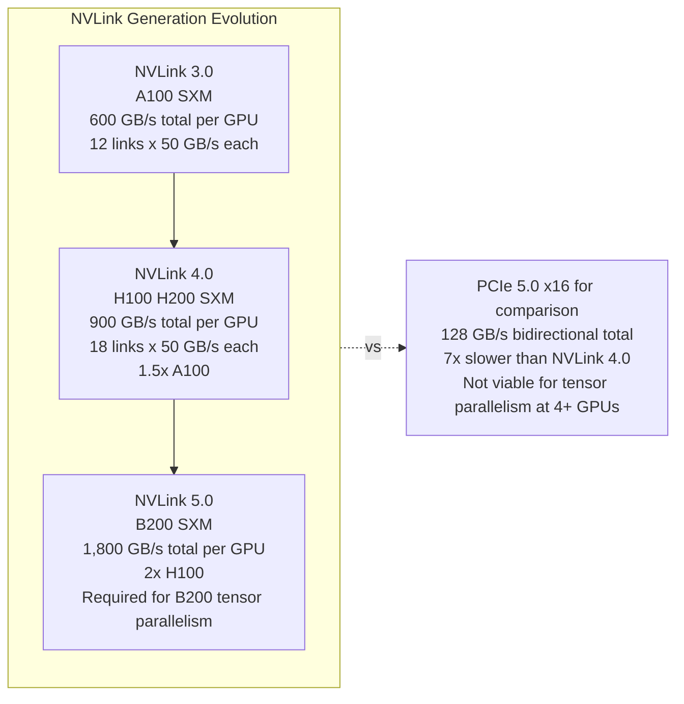

**NVSwitch** solves a topology problem that NVLink alone cannot. Without NVSwitch, NVLink connections form a sparse graph: each GPU has a limited number of physical NVLink ports, and those ports connect directly to specific other GPUs. An A100 has 12 NVLink ports — in an 8-GPU server, these form a partial mesh, not a full all-to-all graph. GPU 0 may connect directly to GPU 1, 2, 3, 4 but not to GPU 5, 6, 7. Traffic between GPU 0 and GPU 6 must be relayed through an intermediate GPU.

NVSwitch is a dedicated switching chip that implements a full crossbar switch: every GPU can simultaneously communicate with every other GPU at full NVLink bandwidth, without contention. A DGX H100 node contains 8 GPUs and 4 NVSwitch chips, wired so that any GPU can reach any other GPU at 900 GB/s simultaneously. This is the all-to-all fabric that makes tensor parallelism across all 8 GPUs in a node efficient.

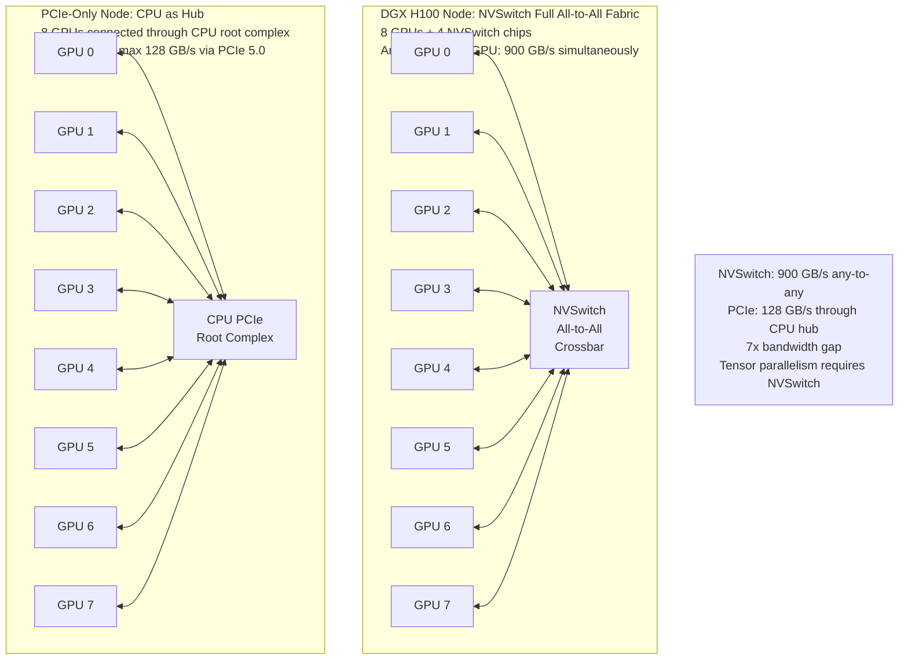

NVSwitch also enables **NVSwitch-accelerated all-reduce**: rather than executing all-reduce as a 2N-step ring algorithm (the standard ring-allreduce requires 2N−1 steps for N GPUs), NVSwitch's all-to-all crossbar allows all-reduce in 2 steps: each GPU sends its partial result to all others simultaneously (1 step), then receives all partial results and computes the sum (1 step). This is the mechanism behind NCCL's intra-node all-reduce performance on DGX/HGX systems.

## PCIe-Only Nodes: When NVLink Isn't Present

Not all GPU servers include NVLink. Consumer-grade GPU configurations and many cost-optimized cloud instances (A10G, L40S, H100 PCIe variants) connect GPUs via PCIe only, routing GPU-to-GPU traffic through the CPU's PCIe root complex.

**PCIe 5.0 x16 delivers 128 GB/s bidirectional** per GPU — sufficient for GPU-to-CPU transfers (model loading, host-side KV cache offloading) and for point-to-point data transfers where the bandwidth demand is modest. It is not sufficient for all-reduce operations that tensor parallelism requires at every layer.

**What PCIe-only is acceptable for**:
- **Single-GPU serving**: No inter-GPU communication at inference time.
- **Pipeline parallelism with 2 GPUs**: Adjacent pipeline stages communicate activation tensors once per layer, not all-reduce across all GPUs. At 128 GB/s, transferring a stage's activation (e.g., 8,192 × 32 batch × 2 bytes = 512 KB) takes ~4 µs — acceptable for most latency budgets.
- **Data parallelism for training with infrequent gradient sync**: Each GPU holds its own model copy; gradient all-reduce happens once per training step (not per layer), and the all-reduce communication can be overlapped with the next batch's backward pass.

**What PCIe-only cannot efficiently support**:
- **Tensor parallelism across 4+ GPUs**: All-reduce at every layer, with increasing tensor sizes as batch grows. At batch 32, the per-step communication in PCIe bandwidth is 5–7× higher than NVLink latency, making inter-GPU communication the dominant latency source.
- **All-reduce for large model gradient sync in training**: Moving model-sized gradients through PCIe for every training step — even once per step — takes significantly longer than through NVLink.

## Inter-Node Interconnect: InfiniBand and RoCEv2

Once a model or training workload spans multiple nodes, the network connecting those nodes becomes the inter-GPU communication fabric. Two technologies dominate production AI clusters.

### InfiniBand

InfiniBand is the standard for high-performance computing and AI cluster networking, developed specifically for low-latency, high-bandwidth inter-node communication.

| Generation | Bandwidth per port | One-way latency |
|---|---|---|
| HDR InfiniBand | 200 Gb/s (25 GB/s) | 1–2 µs |
| NDR InfiniBand | 400 Gb/s (50 GB/s) | 1–2 µs |
| XDR InfiniBand | 800 Gb/s (100 GB/s) | 1–2 µs |

**RDMA (Remote Direct Memory Access)**: InfiniBand natively supports RDMA — one node can read or write another node's GPU memory (via NVLink-to-InfiniBand bridging on H100/H200 systems) without CPU involvement on either end. The GPU's data moves directly from HBM on the source node to HBM on the destination node through the InfiniBand fabric, bypassing the CPU entirely. This dramatically reduces latency and CPU overhead for collective operations.

NDR InfiniBand (400 Gb/s, 50 GB/s per port) is the current standard for large AI clusters. A dual-port NDR HCA on an H100 node provides 2 × 50 = 100 GB/s of inter-node bandwidth per node — still 9× lower than the node's internal NVLink bandwidth (900 GB/s), but sufficient for data-parallel and pipeline-parallel workloads.

### RoCEv2: RDMA Over Converged Ethernet

RoCEv2 implements RDMA semantics over standard 400GbE or 800GbE Ethernet links. The motivation is infrastructure cost: Ethernet switches cost significantly less per port than InfiniBand switches, and Ethernet expertise is more widely available in data center operations teams.

**The catch**: RoCEv2 requires a lossless Ethernet fabric. Standard Ethernet drops packets under congestion — which standard TCP/IP handles gracefully through retransmission, but which destroys RDMA performance because RDMA operations must be atomic. To prevent packet loss, RoCEv2 deployments require either Priority Flow Control (PFC) or DCQCN (Data Center Quantized Congestion Notification) — hardware-level congestion signaling mechanisms built into the switches.

Operating a lossless fabric at scale is operationally demanding. A misconfigured switch or an unexpected traffic burst that disables PFC degrades RoCEv2 performance catastrophically and silently. Large, sophisticated data center operators (hyperscalers with dedicated networking teams) can operate RoCEv2 at scale effectively; organizations without deep Ethernet fabric expertise typically find InfiniBand more operationally reliable for production AI workloads.

**When to choose RoCEv2 vs InfiniBand**:
- RoCEv2: cost-optimized clusters doing data-parallel training (all-reduce once per step, not per layer), organizations already running large-scale 400GbE or 800GbE fabric infrastructure.
- InfiniBand: tensor-parallel inference (all-reduce at every layer — latency matters), pipeline-parallel clusters where activation transfer latency affects TTFT, any cluster where operational simplicity of the network fabric is a priority.

### The Intra-to-Inter Node Bandwidth Gap

The fundamental constraint on multi-node scaling is the bandwidth asymmetry between intra-node and inter-node communication:

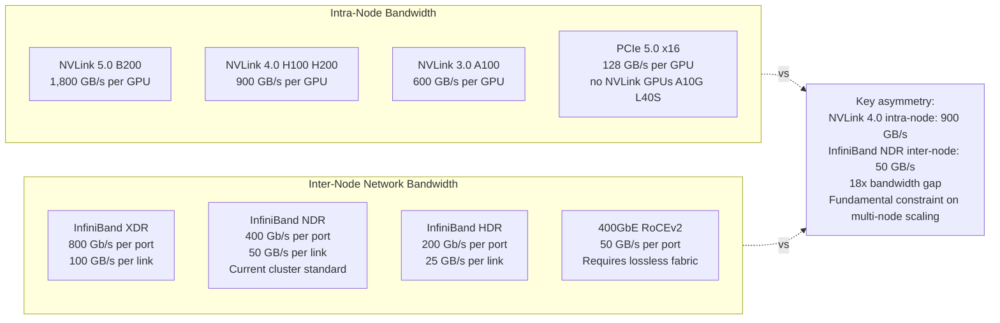

An H100 has 900 GB/s NVLink bandwidth intra-node versus 50 GB/s inter-node via a single NDR port — an 18× gap. This asymmetry is the fundamental reason that tensor parallelism must be confined within a single NVSwitch node: crossing the inter-node boundary with tensor-parallel all-reduce would pay the 18× bandwidth penalty on every layer of every forward pass.

## Cluster Topology: How Switches Connect Nodes

At cluster scale, the physical topology of switches and cables — not just the bandwidth of individual links — determines the effective bandwidth any two nodes can achieve.

### Fat-Tree Topology

The fat-tree is the standard topology for InfiniBand-based AI clusters. In a two-level fat-tree:
- **Edge switches** connect GPU nodes to the network
- **Spine switches** connect edge switches to each other

A fully populated two-level fat-tree provides **full bisection bandwidth**: any node can communicate with any other node at its full downlink speed simultaneously. This means a ring-allreduce between 8 nodes that are spread across different edge switches performs at the same speed as if they were all connected to the same switch.

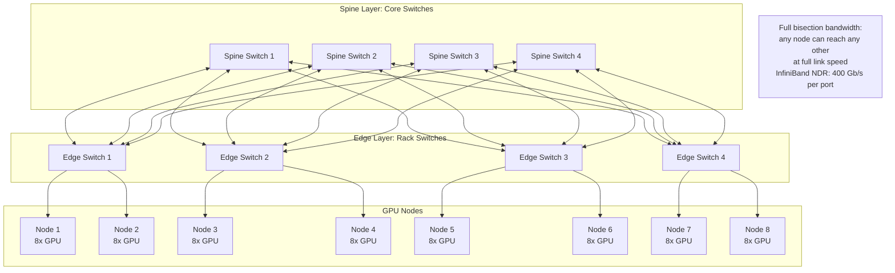

At large cluster scales (thousands of nodes), a three-level fat-tree adds an additional layer of spine switches. The cost of full bisection bandwidth at 1,000+ GPUs is substantial: a 1,000-GPU NDR InfiniBand cluster requires hundreds of 64-port NDR switches plus the cabling infrastructure.

### Rail-Optimized Topology

Rail optimization is a common modification to fat-tree clusters that reduces all-reduce latency for data-parallel workloads. In a rail-optimized topology, GPUs at the same rank (GPU 0, GPU 1, etc.) across different nodes are connected to the same network switch — the same "rail."

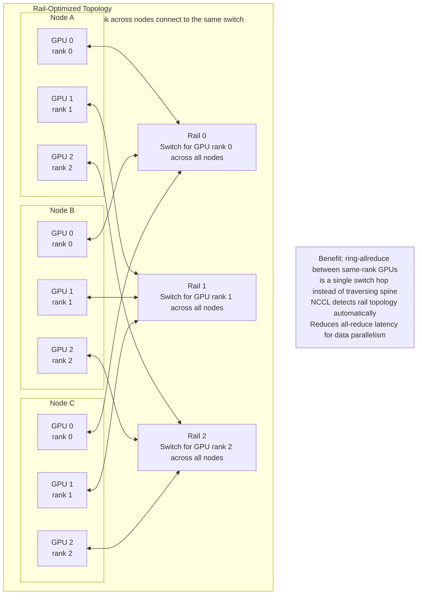

In ring-allreduce for data parallelism, GPU rank 0 on each node communicates with GPU rank 0 on adjacent nodes. With rail optimization, this communication is a single switch hop rather than traversing edge-to-spine-to-edge. NCCL detects rail-optimized topology at initialization and automatically constructs the ring to route intra-rail communication before inter-rail communication.

### Oversubscription

Real-world clusters frequently have **oversubscription**: the total downlink bandwidth from an edge switch to its connected nodes is greater than the uplink bandwidth from the edge switch to the spine layer. A 2:1 oversubscription ratio means the edge switch can provide half the aggregate downlink bandwidth through its uplinks simultaneously — any traffic that crosses the edge-to-spine boundary is constrained by the uplink.

| Oversubscription | Effect on inter-node collectives | Cost vs full bisection |
|---|---|---|
| 1:1 (full bisection) | No bandwidth penalty across any node pair | Highest cost — most switches and cables |
| 2:1 | Up to 2× slower for traffic crossing edge switches | ~50% cost reduction |
| 4:1 | Up to 4× slower — significant for pipeline-parallel activations | ~75% cost reduction |

For data-parallel training with gradient all-reduce, modest oversubscription (2:1) is often acceptable because the all-reduce overlaps with the next mini-batch's forward pass — communication latency is hidden. For tensor-parallel inference, where all-reduce per layer is on the critical path for TTFT, 2:1 or higher oversubscription within the inter-node fabric can meaningfully increase latency.

## Collective Communication Operations

Multi-GPU serving and training use a set of standard communication patterns — "collective operations" — to exchange data between GPUs. Each collective has different communication volume, latency characteristics, and topology sensitivity.

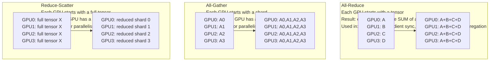

**All-reduce** is the most communication-intensive operation. Every GPU starts with a local tensor; after all-reduce, every GPU has the elementwise sum of all GPUs' tensors. Used for:
- Gradient synchronization in data-parallel training (once per backward pass)
- Aggregating partial attention and FFN outputs in tensor parallelism (once per layer per forward pass)

**All-gather** collects shards: each GPU contributes a portion of a tensor, and every GPU ends up with the complete concatenated tensor. Used in tensor parallelism to gather weight shards from all GPUs before a column-parallel matrix multiply.

**Reduce-scatter** distributes the work: each GPU starts with a full tensor and ends with one reduced shard. The complement of all-gather. Together, all-gather + local compute + reduce-scatter is the standard tensor-parallel computation pattern: gather inputs, compute locally, scatter outputs. This decomposition is also the foundation of ZeRO optimizer states sharding in distributed training.

**Point-to-point (send/receive)**: Direct, asynchronous data transfer from one specific GPU to one other specific GPU. Used in pipeline parallelism to pass layer outputs (activations) from one pipeline stage to the next. Unlike all-reduce, point-to-point only involves two GPUs — it is the lowest-overhead collective, and it scales to inter-node communication via InfiniBand without the all-to-all bandwidth requirement of all-reduce.

### Ring-Allreduce: The Bandwidth-Optimal Algorithm

Ring-allreduce is the standard algorithm for all-reduce on point-to-point topologies. The insight: instead of one GPU aggregating all tensors (which bottlenecks on that GPU's bandwidth), the aggregation is spread across all GPUs in a ring.

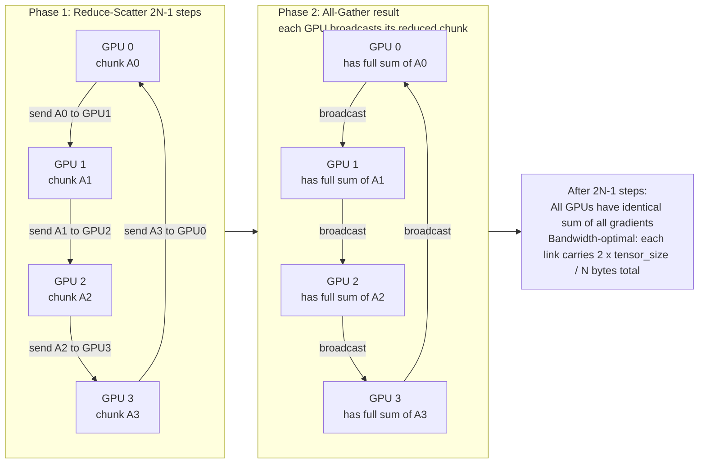

Ring-allreduce is bandwidth-optimal for point-to-point topologies: the total data transferred per link is 2 × tensor_size / N (constant regardless of N), meaning adding more GPUs to the ring doesn't increase per-link bandwidth requirements. However, it has O(N) latency — each step takes one link latency, and the algorithm requires 2N−1 steps. For large N or high-latency links (inter-node InfiniBand), the latency term dominates for small tensors, making tree-based allreduce (lower latency, lower bandwidth efficiency) preferable for small messages.

NVSwitch-equipped nodes can execute all-reduce in 2 steps using the full crossbar, bypassing the ring algorithm entirely and achieving significantly lower latency for intra-node operations.

## NCCL: The Topology-Aware Communication Library

NCCL (NVIDIA Collective Communications Library) is the runtime that implements all collective operations for NVIDIA GPUs. Every major GPU training and inference framework — PyTorch, JAX, vLLM, Megatron-LM — calls NCCL for inter-GPU communication.

NCCL's key property is **topology-aware algorithm selection**: at initialization, NCCL probes the interconnect topology and selects the optimal algorithm for each collective operation on that specific hardware.

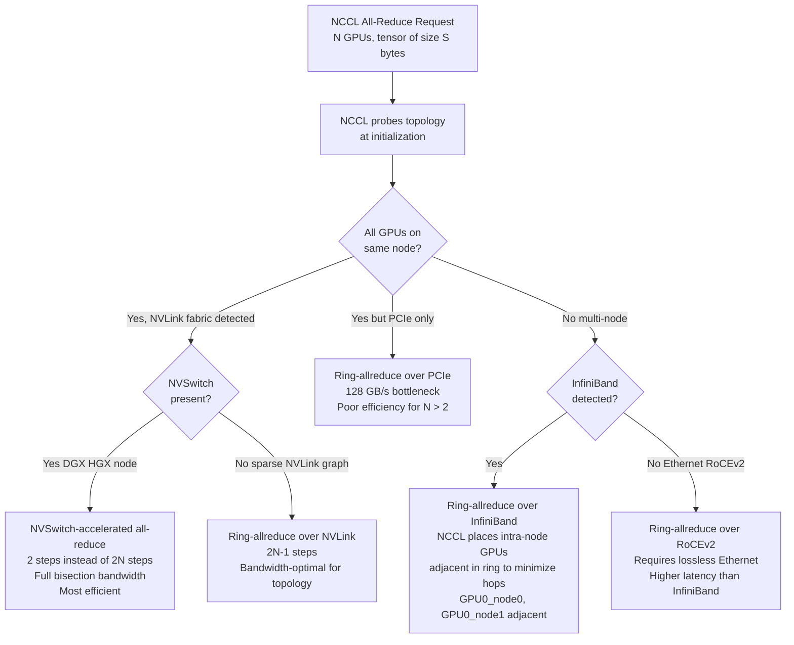

NCCL's topology-aware ring construction is particularly important for multi-node all-reduce: NCCL arranges the ring so that GPUs within the same node are adjacent in the ring, minimizing inter-node hops. GPU 0 on node A is adjacent in the ring to GPU 0 on node B — both on Rail 0, one switch hop. This means each inter-node transfer in the ring requires only one network hop, rather than routing through multiple switches.

NCCL also implements algorithm switching based on message size: for small tensors (under ~1 MB), tree-based allreduce has lower latency than ring-allreduce (fewer steps, though lower bandwidth efficiency). For large tensors, ring-allreduce maximizes bandwidth utilization. NCCL switches between algorithms automatically based on a configurable message size threshold.

## Topology-Aware Parallelism Placement

The right parallelism strategy depends on the interconnect topology. Different parallelism strategies have fundamentally different communication patterns, and matching strategy to topology is the key to multi-GPU efficiency.

### Tensor Parallelism (TP)

Tensor parallelism splits individual weight matrices across multiple GPUs. The output of each GPU is a partial result; an all-reduce across all TP-parallel GPUs is required to compute the final correct output before proceeding to the next layer.

- **Communication frequency**: All-reduce at every attention layer and every FFN layer — multiple times per token generated. For an 80-layer model, 160+ all-reduces per forward pass.
- **Communication volume per all-reduce**: 2 × hidden_dim × batch_size × dtype_bytes. At hidden_dim = 8,192, batch = 32, BF16: 2 × 8,192 × 32 × 2 bytes = 1 MB per all-reduce.
- **Latency sensitivity**: High. All-reduce is on the critical path for every token — it is not overlappable with compute.
- **Required interconnect**: NVLink (900 GB/s). At PCIe (128 GB/s), 160 all-reduces of 1 MB each = 160 × 1 MB ÷ 128 GB/s ≈ 1.25 ms of pure communication per forward pass, on top of the compute time — enough to roughly double decode latency at batch 32.

**Rule**: Always run tensor parallelism within a single NVSwitch node. Never run TP across nodes with InfiniBand as the only interconnect — the 18× bandwidth gap makes per-layer all-reduce prohibitively expensive.

### Pipeline Parallelism (PP)

Pipeline parallelism assigns consecutive model layers to different GPUs. The output of each stage (layer activations) is sent to the next stage as a point-to-point transfer.

- **Communication frequency**: Once per pipeline stage boundary per forward pass — far less frequent than TP.
- **Communication volume per transfer**: hidden_dim × sequence_length × batch_size × dtype_bytes. At hidden_dim = 8,192, seq = 1,024, batch = 8, BF16: 8,192 × 1,024 × 8 × 2 bytes = 128 MB. This is large.
- **Latency sensitivity**: Moderate. Pipeline bubbles (idle pipeline stages waiting for data) inflate end-to-end latency — reduced by microbatching (breaking a batch into microbatches that flow through the pipeline in sequence).
- **Required interconnect**: InfiniBand or PCIe sufficient for modest pipeline depths (2–4 stages), assuming microbatch latency can absorb transfer time.

**Rule**: Pipeline parallelism can span nodes via InfiniBand. The large transfer size (100+ MB) benefits from high-bandwidth InfiniBand, but the low frequency (once per stage boundary, not per layer) makes it feasible even at 50 GB/s NDR speeds.

### Data Parallelism (DP)

Data parallelism runs a complete model replica on each GPU (or group of GPUs). After each training step, gradients are all-reduced across all DP replicas.

- **Communication frequency**: Once per training step — not per layer.
- **Communication volume**: Gradient size = model parameter size. For a 70B BF16 model: 140 GB. In practice, gradient all-reduce uses ring-allreduce, so total bytes per link = 2 × 140 GB / N (divided across N GPUs in the ring).
- **Latency sensitivity**: Low. Gradient all-reduce can be overlapped with the next batch's backward pass — communication is entirely off the critical path.
- **Required interconnect**: Modest. InfiniBand NDR at 50 GB/s is sufficient for gradient all-reduce overlapped with compute.

**Rule**: Data parallelism is the most communication-efficient strategy and the preferred approach for multi-node scaling when the model fits on a single node. Scale DP across as many nodes as the cluster allows without hitting communication-wall.

### 3D Parallelism: TP + PP + DP

The largest models (GPT-3 405B, Llama 3 405B, frontier-scale systems) require all three parallelism dimensions simultaneously.

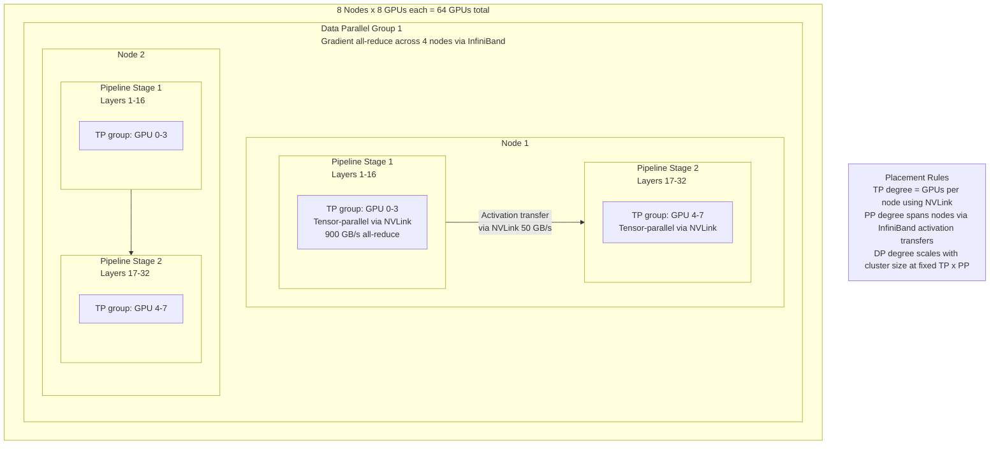

**The placement rule for 3D parallelism**:
1. **TP degree ≤ number of GPUs per node** — constrained by the NVLink all-to-all fabric within the node. In a DGX H100 with 8 GPUs, TP degree can be 1, 2, 4, or 8.
2. **PP degree spans nodes** — pipeline stage boundaries use InfiniBand for activation transfer between nodes.
3. **DP degree** = total GPU count ÷ (TP degree × PP degree). DP is the outer dimension that scales with cluster size.

For a 405B model on 64 GPUs (8 nodes × 8 GPUs): TP=8 (within each node), PP=4 (4 pipeline stages across nodes), DP=2 (2 copies of the full TP×PP group).

### Parallelism Placement Decision Tree

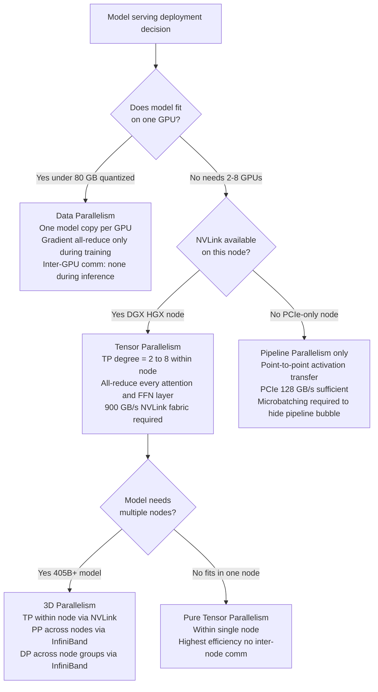

## Network as the Bottleneck at Cluster Scale

Beyond a certain cluster size, adding more GPUs stops improving throughput because communication time grows faster than compute time. This is Amdahl's law applied to distributed GPU systems: the communication fraction is the serial portion that limits parallel speedup.

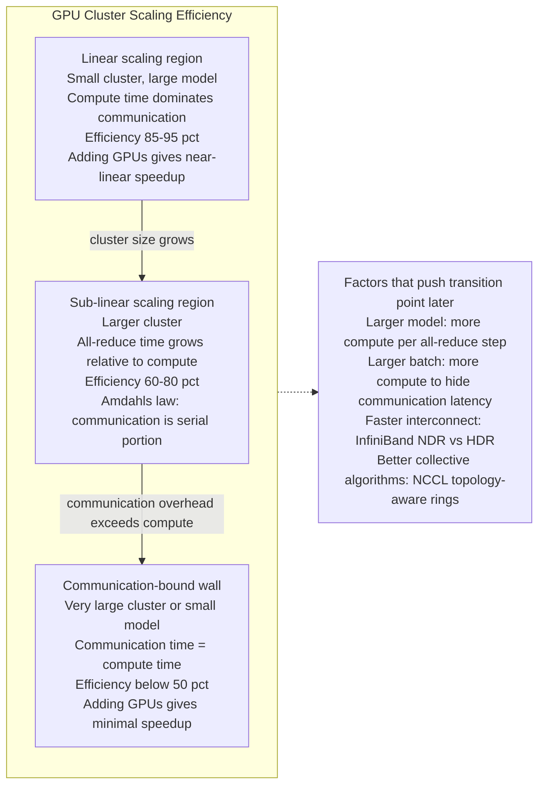

**The computation-to-communication ratio** determines where on this curve a given deployment sits. Larger models have more FLOPs per all-reduce step — a 405B model has roughly 6× more FLOPs per forward pass per token than a 70B model, but the same gradient size. Larger batches give more compute to overlap with communication. Better interconnects (NDR vs HDR) shift the communication time without changing the compute time, moving the efficiency curve to the right.

For cluster deployments:
- **Data parallelism**: All-reduce happens once per training step. With a 70B model and 8-GPU DP group, gradient all-reduce transfers 140 GB across 8 GPUs via ring-allreduce = 2 × 140 GB / 8 ≈ 35 GB per link. At 50 GB/s NDR: ~700ms. But a forward+backward pass for a training step at batch 512 takes several seconds — the communication overlaps and is largely hidden.
- **Pipeline parallelism**: Activation transfer at each pipeline boundary. At batch 8, 128 MB per boundary. At 50 GB/s: ~2.5ms. A pipeline stage's compute time for that batch must exceed 2.5ms to keep the pipeline full — at large batch sizes, this is satisfied; at small batch sizes (latency-optimized inference), pipeline bubbles dominate.
- **Tensor parallelism inter-node** (what you should never do): 80 all-reduces per forward pass at 1 MB each = 80 MB total. At 50 GB/s: 1.6ms per forward pass of pure communication, added directly to token generation latency. At 24 tokens/sec, each token should take ~42ms — 1.6ms of communication is 3.8% overhead, acceptable but growing. At H100 decode speeds with FP8, this fraction grows further. Any TP across InfiniBand links should be treated as an engineering last resort, not a standard configuration.

## Cost Implications of Topology Choices

Topology choices translate directly into infrastructure cost, and the cost premium of NVLink-equipped nodes is the largest single variable in GPU fleet economics.

**NVLink-equipped vs PCIe-only node cost**:
- An HGX H100 8-GPU node with NVSwitch (DGX H100) costs approximately $250,000–$300,000 for bare hardware
- An equivalent PCIe-based 8× H100 server costs approximately $150,000–$180,000
- The NVSwitch premium is approximately 60–80% — driven by the 4 NVSwitch chips, the specialized SXM5 module form factor, and the high-bandwidth NVLink cabling

**When the NVLink premium pays off**:
- Tensor-parallel inference of 70B+ models: requires NVLink for all-reduce at every layer. No viable alternative.
- Training frontier models where TP is required for memory budget: same argument.

**When PCIe-only is adequate and saves significant cost**:
- Single-GPU serving of quantized 7B–70B models: no inter-GPU communication at inference time; A10G or L40S clusters are 4–5× cheaper per GPU and deliver the same throughput per dollar for these workloads.
- Data-parallel training of smaller models: each GPU has its own model copy; gradient all-reduce once per step via PCIe can be overlapped with the next iteration's compute.

**InfiniBand vs Ethernet switch cost at cluster scale**:
- NDR InfiniBand 64-port switches: approximately $30,000–$50,000 per switch
- 400GbE switches with equivalent port count: approximately $10,000–$20,000 per switch
- InfiniBand is 2–3× more expensive per port
- For a 1,000-GPU cluster, the switch fabric can represent $5M–$15M in capital — the choice between InfiniBand and RoCEv2 Ethernet is a multi-million dollar infrastructure decision, not a configuration detail

**The cost synthesis**: For any deployment where models exceed single-GPU capacity or where training is at scale, the topology choices — NVLink or PCIe, InfiniBand or Ethernet, fat-tree or rail-optimized — collectively represent 30–50% of total infrastructure cost. Getting these choices right (matching topology to workload) is equivalent in impact to choosing between GPU generations.

---

## Interview Questions

### Beginner

**Q: Why can't you just connect more GPUs via PCIe when a model is too large for one GPU?**

PCIe 5.0 x16 delivers 128 GB/s bidirectional bandwidth between a GPU and the CPU root complex. GPU-to-GPU data transfer goes through the CPU: GPU A → PCIe → CPU → PCIe → GPU B, with the CPU PCIe controller as the shared bottleneck. Tensor parallelism requires all-reduce at every attention and FFN layer — for an 80-layer model, 160+ all-reduces per forward pass. At 128 GB/s PCIe and 1 MB per all-reduce, 160 all-reduces take ~1.25 ms per forward pass just in communication — adding substantially to decode latency. NVLink bypasses the CPU entirely with direct GPU-to-GPU connections at 900 GB/s — 7× the bandwidth. For tensor-parallel inference, the communication cost at PCIe bandwidth dominates the compute cost at any realistic batch size, making latency unacceptable.

**Q: What is the difference between NVLink and NVSwitch, and why does NVSwitch matter for a DGX node?**

NVLink is the high-speed interconnect technology — the physical connection standard that allows GPUs to communicate directly at 900 GB/s per GPU on H100. Without NVSwitch, NVLink connections form a sparse graph: each GPU's NVLink ports connect to specific other GPUs, and not every GPU is directly connected to every other. GPU 0 might be directly linked to GPUs 1, 2, 3, 4 but not 5, 6, 7 — traffic from GPU 0 to GPU 7 must relay through an intermediate GPU, adding latency and halving effective bandwidth. NVSwitch is a dedicated switching chip that implements a full all-to-all crossbar: every GPU can communicate with every other GPU simultaneously at full NVLink bandwidth, with no relay required. A DGX H100 has 4 NVSwitch chips connecting 8 GPUs into a full mesh — any GPU to any GPU, 900 GB/s, simultaneously. This is what enables efficient 8-way tensor parallelism within a single node.

### Intermediate

**Q: Walk through why tensor parallelism must run within a node using NVLink, but pipeline parallelism can span nodes via InfiniBand.**

Tensor parallelism requires an all-reduce at every layer — for a 70B model with 80 layers, that's 160 all-reduces per forward pass. Each all-reduce must complete before the next layer can begin, so it is on the critical path for every token. At H100 decode speed (24 tokens/sec theoretical), each token takes ~42 ms. The all-reduce communication cannot exceed a few microseconds to remain a small fraction of that. With NVLink at 900 GB/s, a 1 MB all-reduce takes ~1 µs. With InfiniBand NDR at 50 GB/s, the same all-reduce takes ~20 µs. Across 160 all-reduces per token: NVLink adds 0.16 ms (negligible); InfiniBand adds 3.2 ms — 7.6% of total decode latency, growing to prohibitive overhead at larger hidden dimensions or batch sizes.

Pipeline parallelism sends activation tensors from one pipeline stage to the next — once per stage boundary, not 160 times per token. At 128 MB per activation transfer and 50 GB/s InfiniBand, the transfer takes ~2.5 ms. A pipeline stage's compute time for a microbatch must exceed this to keep the pipeline efficient. At batch 8 and typical compute density, this is satisfied. The infrequent, large transfers of pipeline parallelism are well-matched to InfiniBand bandwidth; the frequent, latency-critical all-reduces of tensor parallelism are not.

**Q: What is ring-allreduce, why is it bandwidth-optimal, and when is it not the best algorithm?**

Ring-allreduce arranges N GPUs in a logical ring and executes all-reduce in 2N−1 steps. In the first N−1 steps (reduce-scatter), each GPU sends a chunk of its tensor to the next GPU and receives a chunk from the previous GPU, accumulating partial sums. In the final N steps (all-gather), each GPU broadcasts its fully reduced chunk to all others. The key property: at any step, each GPU sends and receives exactly tensor_size / N bytes. Total data per link = 2 × tensor_size / N — independent of N. Adding more GPUs to the ring doesn't increase per-link bandwidth demands, making ring-allreduce bandwidth-optimal for point-to-point topologies.

It is not the best algorithm in two cases: (1) **Small tensors** (under ~1 MB): ring-allreduce has O(N) latency — 2N−1 steps, each one full round-trip latency. For a 512-byte gradient shard on a 1 µs InfiniBand link with N=64 GPUs, the latency overhead is 127 µs regardless of bandwidth — a tree-based allreduce reaches the result in O(log N) = 6 steps, 6 µs. (2) **NVSwitch nodes**: the all-to-all crossbar executes all-reduce in 2 steps — not 2N−1 — by simultaneously broadcasting to all GPUs in a single step. NVSwitch-accelerated all-reduce is both lower-latency and higher-bandwidth than ring-allreduce for intra-node operations.

### Senior

**Q: Design the interconnect topology for a 256-GPU cluster that will run both data-parallel training of 7B models and tensor-parallel serving of 70B models. Justify every choice.**

256 GPUs = 32 nodes × 8 GPUs each.

**Intra-node**: DGX H100 or HGX H100 configuration — 8 GPUs per node with 4 NVSwitch chips, full all-to-all NVLink fabric at 900 GB/s. Non-negotiable for 70B tensor-parallel serving at 8-way TP. The 60–80% node cost premium is justified: without NVSwitch, tensor-parallel inference is not viable.

**Inter-node fabric**: NDR InfiniBand at 400 Gb/s (50 GB/s per port), dual-port HCA per node (100 GB/s total inter-node bandwidth per node). Fat-tree topology with full bisection bandwidth for the training workload, where any-to-any all-reduce between arbitrary node pairs is needed. Rail-optimized if the cluster will be used primarily for data-parallel training with fixed GPU rank assignments across nodes — NCCL will exploit rail topology automatically.

**Oversubscription**: 1:1 (full bisection) for a 256-GPU research/production cluster where training efficiency matters. For a pure inference cluster (70B serving), 2:1 oversubscription is acceptable because inter-node communication is only pipeline-parallel activation transfer — the tensor parallelism stays within NVSwitch nodes.

**Cost breakdown**: 32 DGX H100 nodes at $270K each = $8.6M. NDR InfiniBand fabric (48-port switches, two-level fat-tree for 32 nodes): roughly 8 edge switches + 4 spine switches = 12 switches at $40K each = $480K plus cabling. Total interconnect premium (NVSwitch + InfiniBand) ≈ $2M beyond equivalent PCIe+Ethernet configuration — justified by the 70B serving requirement.

**Q: A team is building a 1,000-GPU cluster for frontier model training. They're considering InfiniBand NDR vs 400GbE RoCEv2. What are the three most important questions to answer before making the choice?**

(1) **Who will operate the network fabric?** RoCEv2 requires lossless Ethernet with PFC or DCQCN — operationally demanding. A misconfigured switch or unexpected traffic pattern that breaks PFC correctness degrades RDMA performance and creates a silent failure mode that is extremely difficult to diagnose under load. Does the team have networking engineers who have operated RoCEv2 at scale? Without that expertise, InfiniBand is simpler to operate correctly.

(2) **What fraction of workloads involve tensor-parallel operations that cross nodes?** For pure data-parallel training, all-reduce once per step, overlapped with compute — RoCEv2 at 50 GB/s is entirely sufficient and saves ~$5–8M in switch costs at 1,000-GPU scale. For tensor-parallel inference across nodes (strongly discouraged, but occasionally necessary for 405B+ models), InfiniBand's lower latency and operational reliability for all-reduce operations on the critical path is the stronger argument.

(3) **What does the existing data center network infrastructure support?** If the facility already runs a large-scale 400GbE spine-leaf fabric with PFC support (common in hyperscale environments), extending it for AI with RoCEv2 leverages existing infrastructure, expertise, and spare capacity. If the facility has no RDMA-capable Ethernet infrastructure, the incremental cost of deploying InfiniBand from scratch is similar to deploying RoCEv2 from scratch — and InfiniBand's operational characteristics for AI workloads are more predictable.

### Staff

**Q: Design the parallelism configuration for training a 1T-parameter model on 1,024 H100 GPUs with 8 GPUs per NVSwitch node. Explain the communication volume at each dimension and why this specific configuration minimizes the communication-to-compute ratio.**

1,024 GPUs = 128 nodes × 8 GPUs per node.

A 1T-parameter BF16 model occupies 2 TB. Each H100 has 80 GB. Minimum GPU count for memory: ⌈2,000 GB / 80 GB⌉ = 25 GPUs. With 3D parallelism, we need to fit the model and maintain efficiency.

**Configuration**: TP=8, PP=8, DP=16.
- TP=8: Full 8-GPU NVSwitch tensor parallelism within each node. Model shards = 2 TB / 8 = 250 GB per shard (still doesn't fit on 80 GB — needs to be distributed differently). Actual: TP=8 means each GPU holds 1/8 of each layer's weight matrix. For a 1T model: 2,000 GB / 8 = 250 GB per TP rank — still too large. Need higher TP. Recalculate: with TP=8 and PP=8, each GPU holds 2,000 GB / (8 × 8) = 31.25 GB of model weights. Fits on 80 GB with KV cache headroom.
- PP=8: 8 pipeline stages, each spanning 2 nodes (16 GPUs across TP+PP per stage). Pipeline stage sends activations across InfiniBand: hidden_dim × seq_len × microbatch × dtype. For hidden_dim=12,288 and seq=2,048, microbatch=4, BF16: 12,288 × 2,048 × 4 × 2 = 192 MB per stage transfer. At 100 GB/s dual-port NDR: 1.9ms per stage transfer.
- DP=16: 16 copies of the full TP×PP model group. Gradient all-reduce across 16 DP replicas once per step: 2,000 GB / 16 ≈ 125 GB per link in ring-allreduce. At 100 GB/s: 1.25 seconds — overlapped entirely with the next iteration's forward pass.

Communication analysis: TP all-reduce at every layer (intra-node NVLink, negligible). PP activation transfer at each of 8 stage boundaries (192 MB × 8 = 1.5 GB per microbatch, 1.9ms × 8 = 15ms per microbatch via InfiniBand). DP gradient all-reduce (~1.25s, fully overlapped). The TP×PP group compute time for one microbatch must exceed 15ms to hide PP transfer latency — at batch 4 with 1T model FLOPs per forward pass, this is satisfied.

This configuration minimizes the communication-to-compute ratio by maximizing TP (fastest interconnect, highest bandwidth) and limiting PP to 8 stages (8 transfer events, each 1.9ms), while using DP for horizontal scaling where communication is fully overlappable.

---

## Google-Level Follow-Ups

**"Your 8-GPU NVSwitch node runs tensor parallelism at TP=8. The forward pass takes 80ms per token at batch 1. If you double TP to 16 by adding a second node connected via InfiniBand, what happens to latency and why?"**
Tests whether the candidate correctly identifies the topology mismatch and its consequences. Doubling TP from 8 to 16 adds 8 GPUs on a second node connected via InfiniBand NDR at 50 GB/s. For each TP all-reduce: hidden_dim = 8,192, batch 1, BF16: 2 × 8,192 × 1 × 2 bytes = 32 KB. Eight intra-node GPUs complete this via NVSwitch in ~35 ns. The 16-GPU all-reduce must cross the inter-node InfiniBand link: latency = 32 KB / 50 GB/s = ~640 ns for the transfer, plus ~1–2 µs InfiniBand base latency = ~2 µs per all-reduce. With 160 all-reduces per forward pass: 160 × 2 µs = 320 µs = 0.32 ms additional latency per token. At 80ms per token, that's a 0.4% overhead — acceptable. But at larger batch sizes (batch 32): 2 × 8,192 × 32 × 2 = 1 MB per all-reduce, 160 × 1MB / 50 GB/s = 3.2 ms total — a 4% overhead that grows. At batch 128 it becomes prohibitive. The answer: TP=16 across InfiniBand is borderline viable at batch 1, becomes increasingly costly as batch size grows, and should be used only when the model physically cannot fit on a single 8-GPU node even with quantization.

**"A cluster shows 80% GPU compute utilization but only 40% actual model throughput versus the expected linear scaling. Where do you look first, and what data would you collect?"**
Tests distributed systems debugging methodology. 80% GPU compute utilization tells you the GPUs are busy — but busy doing what? The gap suggests either (1) the GPUs are computing but some work is wasted (microbatch pipeline bubbles — GPUs run forward passes but stall waiting for the next microbatch to arrive from the previous pipeline stage), (2) GPUs are spending time in collective communication operations that appear as "compute" in profiling (NCCL all-reduces show up as GPU activity, not idle time), or (3) the load balancer is producing uneven pipeline stage workloads — some stages process fewer tokens and stall on others. Data to collect: NCCL communication timeline (nvidia-smi nvlink shows inter-GPU bandwidth utilization — compare to theoretical peak), pipeline bubble fraction (measured as the fraction of microbatches where a GPU is waiting for an upstream stage), and per-stage compute time distribution (even with equal layer counts, some layers take more time than others due to attention vs FFN workloads). The most common cause at 40% throughput efficiency with 80% GPU utilization is pipeline bubble overhead from insufficient microbatch depth — the fix is increasing the number of microbatches per step to keep the pipeline full.

**"Two engineers argue about whether to run TP=2 or TP=4 for a 70B model on an 8-GPU NVSwitch H100 node. They have the same latency target. What analysis settles the argument?"**
Tests whether the candidate understands that TP degree is a throughput-latency tradeoff, not just a memory tradeoff. TP=2: model weight per GPU = 140 GB / 2 = 70 GB — just fits on H100. Each GPU has 10 GB for KV cache (~7 concurrent 4K-token sequences). All-reduce communication per layer: 2 all-reduces, each 2 × 8,192 × batch × 2 bytes. TP=4: model weight per GPU = 35 GB. Each GPU has 45 GB for KV cache (~34 concurrent 4K-token sequences). All-reduce volume: 4 all-reduces per layer, each half the size. With NVSwitch, the all-reduce latency is ~35 ns regardless of how many GPUs — so TP=4 adds negligible communication latency while quadrupling KV cache capacity. The argument is settled by the KV cache budget and throughput, not latency: TP=4 enables 4× more concurrent sequences with the same memory footprint per token, at minimal communication overhead. Unless the team has confirmed that single-GPU memory isn't the bottleneck (they're running batch 1 with very short contexts where TP=2's 7-sequence capacity is sufficient), TP=4 delivers better sustained throughput per GPU at the same latency SLO.

**"Explain the networking requirement for ZeRO-3 optimizer states sharding and compare it to the all-reduce pattern in tensor parallelism."**
Tests deep understanding of how different parallelism techniques differ in communication topology requirements. ZeRO-3 (Zero Redundancy Optimizer, Stage 3) shards model parameters, gradients, and optimizer states across all data-parallel ranks. During the forward pass, each parameter must be gathered from all ranks before use (all-gather), then discarded after the layer completes. During the backward pass, gradients are reduce-scattered across ranks. This creates a communication pattern that resembles tensor parallelism in frequency — all-gather before every layer, reduce-scatter after every layer — but occurs in the data-parallel dimension rather than the tensor-parallel dimension. The critical difference: ZeRO-3 communication is in the DP dimension, which typically spans nodes (connected via InfiniBand), while TP communication is within the node (connected via NVLink). This means ZeRO-3 is operationally viable for training large models on PCIe-only nodes (infrequent parameter gathers via InfiniBand, overlapped with compute) but becomes network-bound at large scales — the all-gather before every layer at inter-node InfiniBand speeds creates similar latency problems to tensor parallelism across nodes. Large-scale training typically uses TP within nodes (NVLink) with ZeRO-1 or ZeRO-2 (which only shard optimizer states and gradients, not parameters — avoiding the per-layer all-gather).

---

## Common Mistakes

1. **Using tensor parallelism across InfiniBand links without recognizing the latency cost**. Inter-node TP has 18× higher communication latency than intra-node TP via NVLink. At 80 all-reduces per forward pass, this adds milliseconds to every token's generation time — viable only when a model cannot fit within a single 8-GPU NVSwitch node even with quantization.

2. **Assuming PCIe GPU nodes can run tensor parallelism efficiently at TP > 2**. The A10G, L40S, and H100 PCIe variants have no NVLink. All inter-GPU communication goes through the CPU PCIe root complex at 128 GB/s. For TP=4, three PCIe traversals per all-reduce at 128 GB/s versus one NVLink hop at 900 GB/s — a 7× latency penalty per all-reduce that compounds across every layer of every forward pass.

3. **Treating NVLink bandwidth and InfiniBand bandwidth as comparable for all-reduce planning**. NVLink 4.0 at 900 GB/s intra-node versus NDR InfiniBand at 50 GB/s inter-node is an 18× gap. A ring-allreduce that takes 1 µs intra-node takes 18 µs inter-node for the same tensor — a difference that is negligible for gradient all-reduce once per training step but prohibitive for tensor-parallel all-reduce at every layer.

4. **Overlooking pipeline bubble overhead when designing pipeline-parallel inference**. Pipeline parallelism requires microbatching: each stage processes one microbatch at a time, and when it finishes, it waits for the next microbatch to arrive from the upstream stage. During this wait, the GPU is idle — the "pipeline bubble." At low concurrency (serving few requests), the bubble fraction can be 30–50% of GPU time. Minimize bubble overhead by keeping pipeline depth shallow (2–4 stages, not 16) and ensuring continuous batching fills the pipeline consistently.

5. **Not planning for fat-tree switch costs when estimating cluster infrastructure cost**. The GPU hardware is the largest cost line, but at 256+ GPU scale, InfiniBand switch infrastructure (edge + spine switches + cabling) represents 5–15% of total cluster cost. At 1,000+ GPUs with full bisection bandwidth NDR InfiniBand, switch costs can reach $5–10M — comparable to dozens of GPU nodes. Omitting this from cluster cost estimates produces budgets that fail during procurement.

6. **Deploying RoCEv2 without validating lossless fabric configuration under load**. RoCEv2 performance requires PFC or DCQCN to prevent packet drops that destroy RDMA efficiency. A fabric that passes unit tests under light load can fail catastrophically under AI training's bursty all-reduce traffic patterns — PFC can trigger head-of-line blocking, causing cascading congestion that reduces effective bandwidth to near zero. Always load-test RoCEv2 infrastructure with realistic collective communication workloads (NCCL tests) at full scale before committing to production training runs.

---

## Key Takeaways

- **NVLink (900 GB/s on H100) enables efficient tensor parallelism within a node; InfiniBand NDR (50 GB/s per port) enables data-parallel and pipeline-parallel scaling across nodes.** The 18× bandwidth gap between these two tiers is the fundamental architectural constraint on multi-GPU scaling.
- **NVSwitch converts sparse NVLink connections into a full all-to-all crossbar**: every GPU can communicate with every other GPU simultaneously at full bandwidth. Without NVSwitch, tensor parallelism beyond 2–4 GPUs is limited by relay hops. NVSwitch is what makes 8-way TP within a DGX node efficient.
- **Tensor parallelism must run within a single NVSwitch node** — all-reduce per layer is on the decode critical path, and InfiniBand latency for this operation is prohibitive. Pipeline parallelism can span nodes because activation transfer is infrequent and large (high bandwidth utilization, latency tolerant). Data parallelism is inter-node by design and is the most communication-efficient strategy.
- **Ring-allreduce is bandwidth-optimal** — total data per link = 2 × tensor_size / N, independent of N. For small tensors or high-latency links, tree-based allreduce has lower latency at the cost of lower bandwidth utilization. NCCL selects between these automatically based on tensor size and topology.
- **3D parallelism (TP + PP + DP) is required for frontier models**: TP degree ≤ GPUs per NVSwitch node (using NVLink); PP degree spans nodes (using InfiniBand); DP degree scales with cluster size at fixed TP × PP product.
- **Fat-tree topology with full bisection bandwidth** is the standard for InfiniBand AI clusters — any node can communicate with any other node at full link speed. Rail-optimized topologies reduce all-reduce latency for data-parallel workloads by placing same-rank GPUs on the same switch plane; NCCL exploits rail topology automatically.
- **NVSwitch nodes cost 60–80% more than PCIe-only nodes**, but are required for tensor-parallel inference of 70B+ models. PCIe-only nodes (A10G, L40S) are cost-optimal for single-GPU or pipeline-parallel serving of smaller models. Match the hardware to the parallelism strategy, not the other way around.
- **Network infrastructure represents 5–15% of cluster cost at 256+ GPU scale** — InfiniBand NDR switch fabric for a 1,000-GPU cluster can reach $5–10M, comparable to dozens of GPU nodes, and must be included in cluster cost estimates and ROI analysis.

---

*Part of [GPU Systems](index.md) · [GPU Fundamentals for AI Systems](01-gpu-fundamentals-for-ai-systems.md) · [GPU Sizing & Capacity Planning](02-gpu-sizing-and-capacity-planning.md) · [The Inference Stack](../14-ai-infrastructure/02-the-inference-stack.md) · [Batching & Continuous Batching](../15-model-serving/02-batching-and-continuous-batching.md) · [Distributed Inference](../17-distributed-inference/index.md) · [Capacity Planning Primer](../01-fundamentals/04-capacity-planning-primer.md)*
