# Tensor & Pipeline Parallelism

## Overview

Model parallelism is not a performance optimization for large models — it is a physical requirement. A Llama 3 70B model in BF16 occupies 140 GB of memory. A single H100 SXM5 has 80 GB of HBM3. The model does not fit. You cannot serve it, fine-tune it, or even load it on a single GPU. Before you think about batching strategies, KV cache optimizations, or quantization schemes, you must solve the basic problem of getting the model's parameters into GPU memory. That is what tensor parallelism and pipeline parallelism do.

This chapter covers the two primary model parallelism strategies at full mechanical depth — how weight matrices are sharded, what communication happens at each step, what it costs in bandwidth and latency, and how to choose between them for a given model size, GPU count, and interconnect topology. It then covers how all three parallelism strategies (adding data parallelism) compose into the 3D parallelism that runs the largest clusters in production.

See also: [Multi-GPU Topologies & Interconnects](../16-gpu-systems/03-multi-gpu-topologies-and-interconnects.md) for the NVLink and InfiniBand bandwidth numbers this chapter depends on, and [GPU Sizing & Capacity Planning](../16-gpu-systems/02-gpu-sizing-and-capacity-planning.md) for the GPU count arithmetic that sets the minimum parallelism degree.

---

## Why Model Parallelism Is Necessary

The minimum number of GPUs required to serve a model is not determined by throughput or latency — it is determined by memory. Until the model's weights fit in GPU memory, no other optimization applies.

```
GPU count (minimum) = ⌈model_size_bytes / GPU_VRAM_bytes⌉
```

Working through the arithmetic for current models:

| Model | Precision | Size | H100 (80 GB) | H200 (141 GB) | B200 (192 GB) |
|---|---|---|---|---|---|
| Llama 3 8B | BF16 | 16 GB | 1 GPU | 1 GPU | 1 GPU |
| Llama 3 8B | INT4 | 4 GB | 1 GPU | 1 GPU | 1 GPU |
| Llama 3 70B | BF16 | 140 GB | 2 GPUs | 1 GPU* | 1 GPU* |
| Llama 3 70B | INT4 | 35 GB | 1 GPU | 1 GPU | 1 GPU |
| Llama 3 405B | BF16 | 810 GB | 11 GPUs | 6 GPUs | 5 GPUs |
| Llama 3 405B | INT4 | 202 GB | 3 GPUs | 2 GPUs | 2 GPUs |

*Weights just fit but leave no room for KV cache — unusable in practice without quantization.

The H200's 141 GB is barely larger than the 70B BF16 model's 140 GB. With zero memory remaining for KV cache, activations, and CUDA overhead, you cannot serve a single request. In practice, you need at least 2× H200s at BF16 to leave room for KV cache.

The 405B BF16 model at 810 GB requires at minimum 11× H100s — and that is weight memory only. A 4096-token batch generates approximately 500 GB of KV cache on top. Sizing for just weights is the floor, not the ceiling.

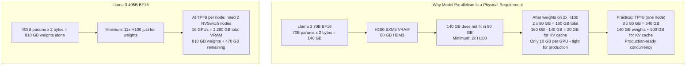

---

## Tensor Parallelism: Intra-Layer Sharding

Tensor parallelism (TP) splits individual weight matrices across multiple GPUs. Each GPU holds a fraction of each layer's weights and computes a partial result. The results are aggregated via collective communication operations. The key property: the communication happens within a layer, not between layers.

### Column-Parallel Linear

A linear layer computes `Y = X × W` where `X` is the input (batch × seq × hidden_dim) and `W` is the weight matrix (hidden_dim × output_dim). In column-parallel TP with degree N, the weight matrix is split column-wise:

- GPU 0 holds `W[:, 0 : output_dim/N]`
- GPU 1 holds `W[:, output_dim/N : 2*output_dim/N]`
- GPU i holds `W[:, i*output_dim/N : (i+1)*output_dim/N]`

Each GPU receives the same full input `X` (this requires an all-gather or broadcast at the layer's input) and computes its partial output `Y_i = X × W_i`. The outputs are then column-partitioned: GPU i holds output columns `[i*output_dim/N : (i+1)*output_dim/N]`. No aggregation is needed after a column-parallel layer — each GPU's output is already a valid partial result that feeds the next row-parallel layer.

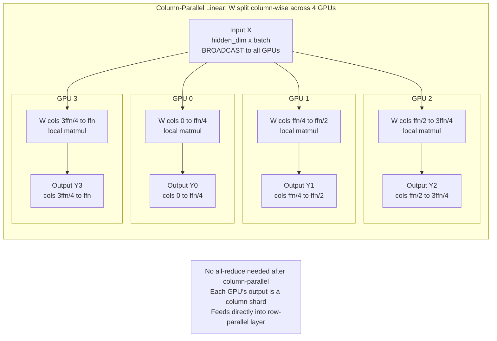

### Row-Parallel Linear

A row-parallel linear layer splits the weight matrix row-wise:

- GPU i holds `W[i*hidden_dim/N : (i+1)*hidden_dim/N, :]`
- GPU i's input is the corresponding column shard of the activation (output of the previous column-parallel layer)
- Each GPU computes a partial dot product: `Y_partial_i = X_i × W_i`
- The full output Y = sum(Y_partial_i) — this requires an **all-reduce** across all N TP GPUs

The all-reduce aggregates the partial dot products into the correct full output tensor. This is the communication event that must be hidden inside the compute time.

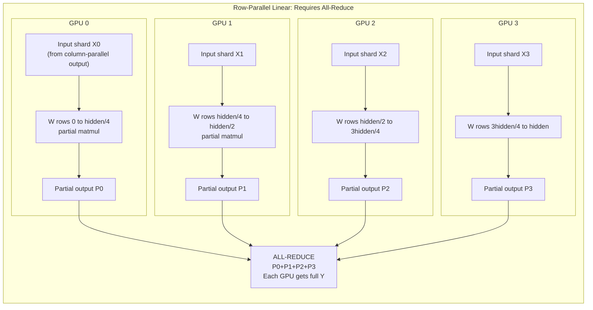

### Attention Head Parallelism

For the attention mechanism, TP splits attention heads across GPUs. With `num_heads` total heads and TP degree N, GPU i processes heads `[i * num_heads/N : (i+1) * num_heads/N]`. Each GPU computes its assigned heads' Q, K, V projections and the full attention computation for those heads, then an all-reduce combines the results.

For **GQA (Grouped Query Attention)** models like Llama 3 70B — which use 64 query heads but only 8 KV heads — the TP split must respect the GQA grouping. Each TP rank must receive the KV heads corresponding to its query heads. At TP=8 with 8 KV heads, each GPU gets exactly 1 KV head. At TP=4 with 8 KV heads, each GPU gets 2 KV heads. At TP=16 with 8 KV heads, there are not enough KV heads to split equally — TP degree cannot exceed `num_kv_heads`. This is a hard architectural limit on the maximum TP degree for GQA models.

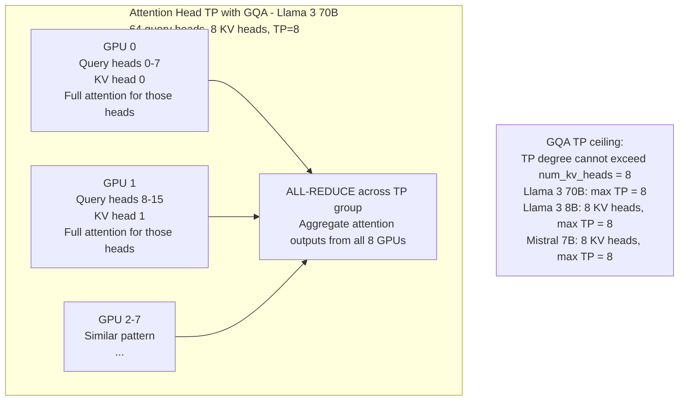

### The Megatron-LM Communication Pattern

The Megatron-LM paper (Shoeybi et al., 2019) established the standard TP pattern for transformer layers. Each transformer layer consists of two sub-layer pairs — the attention sub-layer and the FFN sub-layer. In the Megatron-LM pattern:

- **Attention block**: Column-parallel QKV projection (broadcast input) → attention computation (no comm) → row-parallel output projection → **all-reduce** (one communication event)
- **FFN block**: Column-parallel first linear → activation function (no comm) → row-parallel second linear → **all-reduce** (one communication event)

This gives exactly **4 all-reduces per transformer layer** (2 per attention block + 2 per FFN block, combined into 1 each by fusing the column-parallel all-gather and row-parallel all-reduce into single operations).

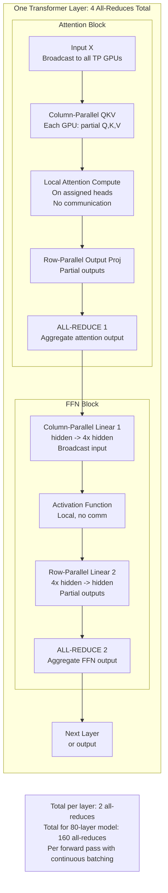

### Communication Volume: The NVLink Imperative

The communication volume per all-reduce determines whether tensor parallelism is viable at a given interconnect bandwidth. The formula:

```
volume_per_allreduce = 2 × batch_size × sequence_length × hidden_dim × dtype_bytes
```

The factor of 2 accounts for the all-reduce pattern: ring-allreduce sends `2 × tensor_size / N` bytes per link, but from the per-layer latency perspective, the relevant quantity is the full tensor size that must be communicated.

For a concrete production example (TP=8 on H100s, serving Llama 3 70B, batch=32, seq=512, BF16):

```
volume = 2 × 32 × 512 × 8192 × 2 bytes = 537 MB per all-reduce
```

| Interconnect | Effective BW | Time per all-reduce | × 4 per layer × 80 layers |
|---|---|---|---|
| NVLink 4.0 with NVSwitch | ~450 GB/s | ~1.2 ms | **384 ms** |
| InfiniBand NDR (inter-node) | ~50 GB/s | ~10.7 ms | **~3,430 ms** |
| PCIe 5.0 (no NVLink) | ~100 GB/s effective | ~5.4 ms | **~1,728 ms** |

The difference between NVLink and PCIe is not a latency penalty — it is the difference between a working system and a system where communication overhead exceeds compute time by a factor of 4. Without NVLink, tensor parallelism across 4+ GPUs becomes the primary bottleneck.

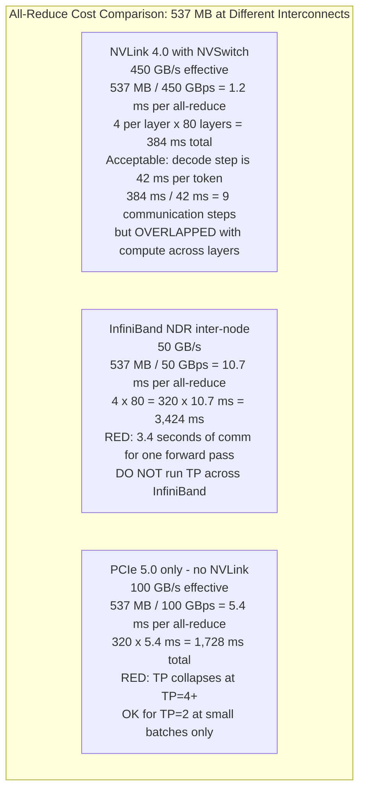

**The TP ceiling rule:** Run tensor parallelism only within a single NVSwitch-connected node. For H100/H200 DGX nodes, that means TP ≤ 8. For PCIe-only nodes (H100 PCIe, A10G, L40S), TP ≤ 2 is the practical limit, and even that should be verified by load testing. For TP=16 across two NVSwitch nodes, the inter-node InfiniBand is the all-reduce path — the numbers above show why this fails.

### TP Alignment Requirements

Not all TP degrees work for all model architectures. The tensor dimensions being split must be exactly divisible by the TP degree.

| Dimension | Requirement | Failure mode |
|---|---|---|
| `num_attention_heads` | Must be divisible by TP degree | Non-divisible heads cannot be split evenly |
| `num_kv_heads` (GQA) | TP degree ≤ num_kv_heads | Can't split fewer heads than TP GPUs |
| FFN intermediate dim | Must be divisible by TP degree | Non-divisible FFN hidden size requires padding |

For Llama 3 70B: `num_heads = 64`, `num_kv_heads = 8`, `ffn_intermediate = 28,672`. Valid TP degrees: 1, 2, 4, 8 (all divide 64 and 8, and 28,672 is divisible by 1, 2, 4, 8). TP=16 is invalid: 8 KV heads / 16 GPUs < 1.

For Mistral 7B: `num_heads = 32`, `num_kv_heads = 8`. Valid TP degrees: 1, 2, 4, 8. TP=16: invalid.

---

## Pipeline Parallelism: Inter-Layer Sharding

Pipeline parallelism (PP) assigns consecutive transformer layers to different GPUs. GPU 0 runs layers 1 through L/PP, GPU 1 runs layers L/PP+1 through 2L/PP, and so on. Activations flow from stage to stage via point-to-point transfers. The key property: the communication happens between layers, not within layers — which means it crosses node boundaries at a fraction of the frequency that tensor-parallel all-reduces do.

### The Pipeline Bubble Problem

In a naive single-microbatch pipeline, only one GPU is active at any given moment. While GPU 0 processes a batch and hands off activations to GPU 1, GPUs 2 and 3 wait. While GPU 3 processes and hands back (for backprop in training, or for the next request's first stage in inference), GPU 0 sits idle. The **pipeline bubble** is this idle time.

For PP=4 stages with a single microbatch:
- GPU 0 runs at steps: 1, 5, 9, 13... (every 4th step)
- GPUs 1, 2, 3 run at offset steps
- **Bubble fraction = (PP - 1) / PP = 3/4 = 75%** — three-quarters of each GPU's time is idle

```mermaid
flowchart LR
    subgraph BubbleVis["Pipeline Execution: PP=4 Stages, M=4 Microbatches\nTime flows left to right"]
        subgraph Row0["Stage 0"]
            S0T1["M1"]
            S0T2["M2"]
            S0T3["M3"]
            S0T4["M4"]
            S0B1["IDLE"]
            S0B2["IDLE"]
            S0B3["IDLE"]
            S0T1 --> S0T2 --> S0T3 --> S0T4 --> S0B1 --> S0B2 --> S0B3
        end
        subgraph Row1["Stage 1"]
            S1B1["IDLE"]
            S1T1["M1"]
            S1T2["M2"]
            S1T3["M3"]
            S1T4["M4"]
            S1B2["IDLE"]
            S1B3["IDLE"]
            S1B1 --> S1T1 --> S1T2 --> S1T3 --> S1T4 --> S1B2 --> S1B3
        end
        subgraph Row2["Stage 2"]
            S2B1["IDLE"]
            S2B2["IDLE"]
            S2T1["M1"]
            S2T2["M2"]
            S2T3["M3"]
            S2T4["M4"]
            S2B3["IDLE"]
            S2B1 --> S2B2 --> S2T1 --> S2T2 --> S2T3 --> S2T4 --> S2B3
        end
        subgraph Row3["Stage 3"]
            S3B1["IDLE"]
            S3B2["IDLE"]
            S3B3["IDLE"]
            S3T1["M1"]
            S3T2["M2"]
            S3T3["M3"]
            S3T4["M4"]
            S3B1 --> S3B2 --> S3B3 --> S3T1 --> S3T2 --> S3T3 --> S3T4
        end
    end
    BSTAT["With M=4 microbatches PP=4:\nBubble fraction ~ 3/7 = 43 pct\nWith M=8: ~3/11 = 27 pct\nWith M=32: ~3/35 = 9 pct\nBubble shrinks as M grows"]
```

### Microbatching: Filling the Pipeline

The solution is to split the input batch into M micro-batches and feed them through the pipeline in rapid succession. While GPU 3 is processing micro-batch 1, GPU 2 processes micro-batch 2, GPU 1 processes micro-batch 3, and GPU 0 processes micro-batch 4 — all simultaneously. As M grows, the pipeline fills and the bubble fraction shrinks.

**Bubble fraction formula:**
```
bubble_fraction = (PP - 1) / (PP - 1 + M)
```

| PP | M=1 | M=4 | M=8 | M=32 |
|---|---|---|---|---|
| 2 | 50% | 20% | 11% | 3% |
| 4 | 75% | 43% | 27% | 9% |
| 8 | 87.5% | 64% | 47% | 19% |
| 16 | 93.8% | 79% | 65% | 32% |

The implication: pipeline parallelism at high PP degree requires many micro-batches to be efficient. A PP=8 deployment needs M ≥ 32 micro-batches to hold bubble fraction below 20%. This is well-suited for throughput-oriented batch serving but problematic for low-latency interactive serving where small M values are forced by the latency budget.

### 1F1B Scheduling for Training

The **one-forward-one-backward (1F1B)** schedule is the standard pipeline schedule for training. Instead of completing all forward passes before any backward pass, 1F1B alternates forward and backward passes within the pipeline. The key benefit: memory usage is bounded by PP stages × 1 microbatch worth of activations, rather than growing with M.

For **inference-only** pipelines (no backward pass):
- No 1F1B required — the schedule is purely forward
- Each micro-batch flows from stage 0 to stage PP−1 in sequence
- The serving engine (e.g., vLLM with continuous batching) keeps the pipeline full by continuously feeding new decode steps
- With continuous batching, each decode step is effectively a micro-batch — the pipeline is filled naturally by the stream of requests in the batch

### Interleaved Pipeline Scheduling

Interleaved scheduling assigns each GPU multiple non-consecutive chunks of layers rather than one contiguous block. For PP=4 with interleaving factor V=2:

- GPU 0 holds layers 1–L/8 and layers 4L/8+1–5L/8
- GPU 1 holds layers L/8+1–2L/8 and layers 5L/8+1–6L/8
- GPU 2 holds layers 2L/8+1–3L/8 and layers 6L/8+1–7L/8
- GPU 3 holds layers 3L/8+1–4L/8 and layers 7L/8+1–L

This requires 2× more communication events (activations must cross the inter-GPU boundary twice per virtual pipeline stage) but reduces the bubble fraction by factor V: `bubble_fraction = (PP - 1) / (V × (PP - 1) + M)`. Interleaved scheduling is worth the added complexity when PP degree is high (≥ 4) and M cannot be made large enough to absorb the bubble via microbatching alone.

### Communication Cost of Pipeline Parallelism

Pipeline parallelism uses point-to-point send/receive rather than all-reduce. The communication volume per stage boundary per micro-batch:

```
volume_per_transfer = batch_size × sequence_length × hidden_dim × dtype_bytes
```

Using the same example (batch=32, seq=512, hidden=8192, BF16):

```
volume = 32 × 512 × 8192 × 2 bytes = 268 MB per boundary transfer
```

| Interconnect | Effective BW | Time per transfer | 3-boundary pipeline |
|---|---|---|---|
| NVLink (intra-node) | 900 GB/s | 0.3 ms | ~0.9 ms |
| InfiniBand NDR | 50 GB/s | **5.4 ms** | **~16 ms** |
| PCIe 5.0 | 128 GB/s | 2.1 ms | ~6.3 ms |

Compare to tensor parallelism: TP over NVLink adds 384 ms of all-reduce for the same forward pass, while PP over InfiniBand adds only 16 ms. This is why **PP scales across nodes while TP does not**:

- TP: one all-reduce per layer per forward pass → communication is on the critical path at every layer
- PP: one point-to-point transfer per stage boundary per forward pass → communication happens once per stage, not once per layer

At InfiniBand NDR (50 GB/s), the 268 MB transfer takes 5.4 ms. For a pipeline stage compute time significantly exceeding 5.4 ms (which it does at batch sizes ≥ 8 for 70B+ models), this transfer is overlapped with the previous stage's compute. The pipeline is efficient even across nodes.

### PP Degree and Latency Trade-off

Increasing PP degree reduces per-GPU memory requirement but increases latency:

- Each pipeline stage boundary adds one activation transfer (5.4ms at InfiniBand NDR for the example above)
- The pipeline bubble fraction grows with PP (for fixed M)
- For latency-sensitive serving, target PP=1 (no pipeline) or PP=2
- For throughput-oriented batch serving with large M, PP=4 to PP=8 is practical

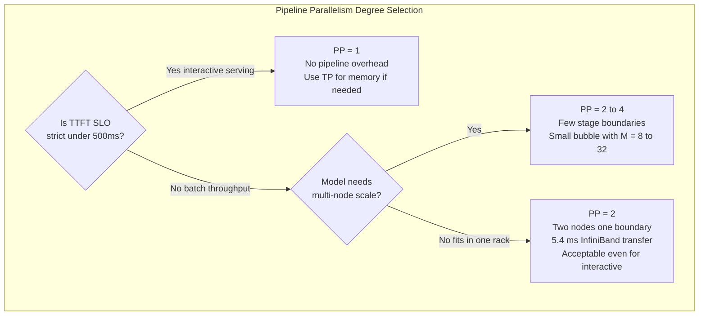

---

## Data Parallelism for Inference

Data parallelism (DP) for inference is simple: run N independent copies of the full model, each serving different requests. No model-level communication happens during the forward pass. After each training step (for training-time DP), gradients are all-reduced across replicas — but for inference-only deployment, there is no inter-replica communication whatsoever.

DP is the correct scaling strategy when:
- The model fits on one GPU (or one TP group)
- The goal is to scale total request throughput, not reduce per-request latency
- N × VRAM is available

The cost is N × model memory. A fleet of 8 H100s running a 7B INT4 model (4 GB) could use DP=8 with 8 independent model copies, each serving up to 18 concurrent 4K-token sequences in its remaining VRAM. Total fleet throughput: 8× the per-GPU throughput. Zero communication overhead. For models that fit on a single GPU, DP is the most efficient way to scale.

---

## Expert Parallelism for Mixture-of-Experts Models

Mixture-of-Experts (MoE) models (Mixtral 8×7B, DeepSeek-V3, Llama 4 Scout) replace dense FFN layers with multiple "expert" FFN layers. A learned router selects 2–4 experts per token. Expert parallelism (EP) places different experts on different GPUs.

The communication pattern for EP is **all-to-all**, not all-reduce:

1. Router assigns each token to specific expert GPUs
2. **All-to-all (forward)**: Each GPU sends its assigned tokens to the GPU holding the selected expert
3. Expert computation runs locally on each GPU
4. **All-to-all (backward)**: Processed tokens are returned to the originating GPUs

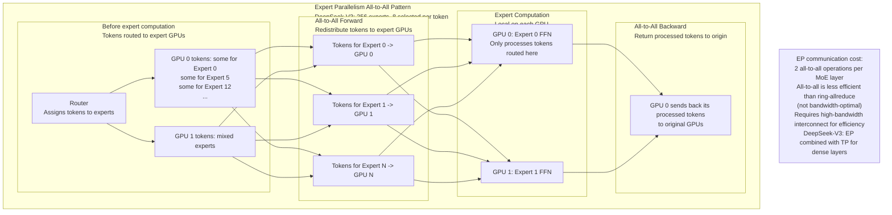

EP requires high-bandwidth interconnects because all-to-all traffic is less structured than ring-allreduce — each GPU sends to a different subset of GPUs depending on token routing, creating irregular traffic patterns. InfiniBand with fat-tree topology handles this better than rail-optimized topologies designed for ring-allreduce.

For large MoE models in production: EP is combined with TP (for dense attention layers) and PP (for multi-node scale), creating a 4D parallelism configuration. DeepSeek's production clusters use EP=64 or higher combined with TP=8.

---

## 3D Parallelism: Combining TP, PP, and DP

The largest clusters combine all three parallelism strategies simultaneously. The decomposition is:

```
total_GPUs = TP × PP × DP
```

**The placement hierarchy:**
- **TP within node**: All TP ranks must be on the same NVSwitch-connected node (to use NVLink for all-reduce). TP degree ≤ GPUs per node (≤ 8 for DGX H100).
- **PP across nodes in a rack**: Pipeline stage boundaries use InfiniBand for activation transfer. Prefer nodes in the same rack (same ToR switch) for lowest inter-node latency.
- **DP across racks**: Each DP replica is an independent TP×PP group. DP synchronization (gradient all-reduce during training) crosses rack boundaries — acceptable because DP communication is infrequent.

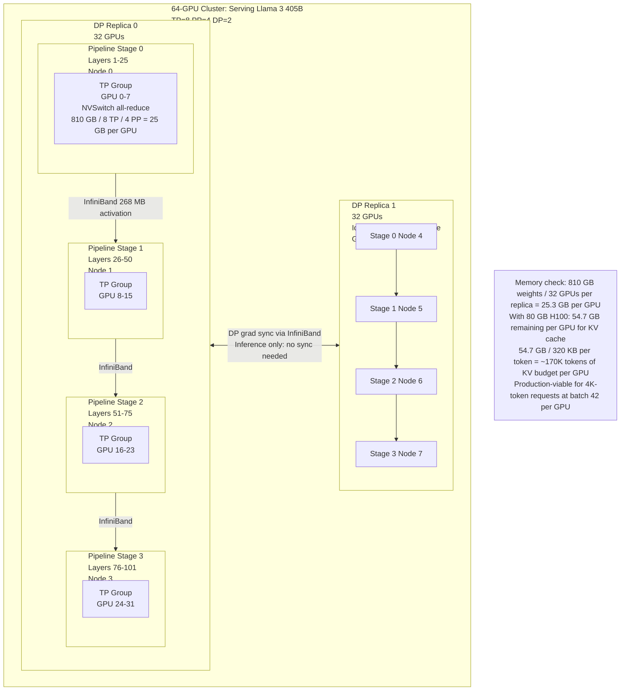

### Deriving the Optimal 3D Parallelism Configuration

**Step 1: Determine minimum TP degree.**

Start with the constraint that each GPU's weight memory must fit within GPU VRAM:

```
memory_per_gpu = model_size / (TP × PP)
memory_per_gpu ≤ GPU_VRAM - KV_cache_budget
```

For Llama 3 405B BF16 on H100 (80 GB), targeting 20 GB for KV cache:
```
810 GB / (TP × PP) ≤ 60 GB
TP × PP ≥ 14
```

With TP=8 (one node): PP ≥ 2. Use PP=2 for minimum pipeline overhead, or PP=4 for more GPUs.

**Step 2: Set PP degree for cluster scale.**

Cluster size = TP × PP × DP. With TP=8 and 64 GPUs: PP × DP = 8. Use PP=4, DP=2 for two replica redundancy. Or PP=2, DP=4 for more throughput.

**Step 3: DP absorbs remaining scale.**

```
DP = total_GPUs / (TP × PP)
```

For 64 GPUs, TP=8, PP=4: DP = 64/32 = 2.

### Representative 3D Parallelism Configurations

| Model | GPU count | TP | PP | DP | Notes |
|---|---|---|---|---|---|
| Llama 3 8B INT4 | 8× H100 | 1 | 1 | 8 | Fits easily; maximize throughput via DP |
| Llama 3 70B BF16 | 8× H100 | 8 | 1 | 1 | One TP group fills node; add more nodes for DP |
| Llama 3 70B BF16 | 16× H100 | 8 | 1 | 2 | Two DP replicas for 2× throughput |
| Llama 3 70B INT4 | 16× H100 | 4 | 1 | 4 | Fits at TP=4; 4 DP replicas |
| Llama 3 405B BF16 | 64× H100 | 8 | 4 | 2 | 25 GB/GPU; 2 replicas for redundancy |
| Llama 3 405B INT4 | 16× H100 | 8 | 2 | 1 | ~12.6 GB/GPU after quantization; TP=8 within node |

---

## Choosing a Parallelism Strategy

The decision tree for parallelism configuration starts with the memory constraint (which sets the minimum TP×PP product) and then optimizes for the latency vs. throughput target.

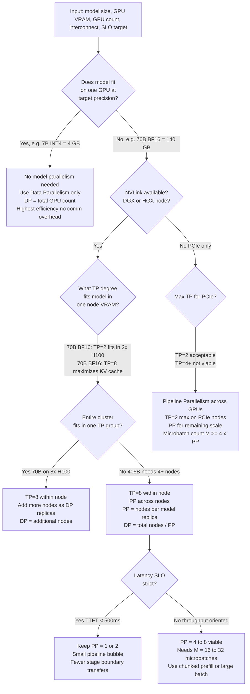

### Worked Examples

**8B model on 8× H100:**
- 8B INT4: 4 GB weights → TP=1 (fits on one GPU with 76 GB for KV)
- Configuration: DP=8, each GPU serves its own requests independently
- KV cache per GPU: 76 GB / (131 KB/token) ≈ 580K tokens of concurrent capacity

**70B model on 8× H100:**
- 70B BF16: 140 GB → must distribute across GPUs
- TP=2: 70 GB/GPU, 10 GB for KV (tight)
- TP=8: 17.5 GB/GPU, 62.5 GB for KV — **preferred** for KV cache headroom
- Configuration: TP=8 (one node), DP=1; add more nodes as DP=N replicas

**70B model on 16× H100 (2 nodes):**
- TP=8 (within each node), PP=1 (no pipeline), DP=2 (two independent replicas)
- 2× throughput compared to 8-GPU configuration; TTFT unaffected

**405B model on 64× H100 (8 nodes):**
- 405B BF16: 810 GB; TP=8 per node → 810 GB / 8 / 8 = 12.7 GB/GPU — fits with 67 GB for KV
- PP=4 (four nodes per replica), DP=2 (two replicas)
- 8× 8-GPU nodes × TP=8 × PP=4 × DP=2 = 64 GPUs ✓

---

## Interview Questions

### Beginner

**Q: What is tensor parallelism in one sentence, and when is it required?**

Tensor parallelism splits individual weight matrices across multiple GPUs so that each GPU holds and computes only a fraction of each layer, requiring all-reduce communication to aggregate results at each layer boundary — and it is required whenever a model's weight memory exceeds a single GPU's VRAM (e.g., a 70B BF16 model's 140 GB exceeds an H100's 80 GB).

**Q: What is the pipeline bubble and why does it hurt efficiency?**

The pipeline bubble is the idle time that occurs when a pipeline stage finishes processing one micro-batch and must wait for the next micro-batch to arrive from the upstream stage. For PP=4 with a single micro-batch, three of the four pipeline stages are idle at any given moment — 75% of GPU cycles are wasted. Microbatching reduces the bubble by feeding multiple micro-batches through in rapid succession, but the bubble never disappears entirely.

### Intermediate

**Q: Why must tensor parallelism run within a single NVSwitch-connected node, while pipeline parallelism can span nodes?**

TP requires an all-reduce at every attention layer and every FFN layer — for an 80-layer model, 160 all-reduces per forward pass. Each all-reduce is on the critical path for token generation: the next layer cannot start until the previous all-reduce completes. At InfiniBand NDR bandwidth (50 GB/s), a 537 MB all-reduce takes 10.7 ms. Across 160 all-reduces: 10.7 ms × 160 = 1,712 ms of pure communication per forward pass — longer than the total decode time. With NVLink (450 GB/s effective), the same all-reduce takes 1.2 ms, and 160 × 1.2 ms = 192 ms spread across the full forward pass with compute overlap.

PP sends one point-to-point activation transfer per stage boundary, not one all-reduce per layer. For the same example: one 268 MB transfer per stage boundary takes 5.4 ms at InfiniBand NDR. A 4-stage pipeline has 3 boundaries: 3 × 5.4 ms = 16.2 ms total for the full forward pass. The compute time for each pipeline stage at batch=32 vastly exceeds 5.4 ms, so the transfer is largely overlapped. PP crosses nodes; TP cannot.

**Q: What happens when a model's num_kv_heads is smaller than the desired TP degree?**

At TP=16 with num_kv_heads=8, there are not enough KV heads to distribute one per TP rank. GQA requires that each TP rank receive a contiguous group of KV heads. With 8 KV heads and TP=16, you would need to assign 0.5 KV heads per rank — fractional, impossible. The solution is: cap TP degree at num_kv_heads (TP ≤ 8 for Llama 3 70B), or replicate KV heads across TP ranks (some frameworks do this). Replication wastes memory and adds transfer cost. Capping TP at num_kv_heads is the clean solution.

### Senior

**Q: Work through the full 3D parallelism configuration for a 405B model on a 128-GPU cluster of H100s, 8 GPUs per NVSwitch node. Justify each dimension.**

128 GPUs = 16 nodes × 8 GPUs per node.

**TP=8** (one full NVSwitch node): All-reduce at every layer via NVLink at 900 GB/s. Non-negotiable for efficiency — TP across InfiniBand is too slow. Each GPU holds 810 GB / 8 = 101.25 GB / PP stages in its TP rank.

**PP=4** (four nodes per model replica): 4 pipeline stages, each stage on one node. Memory per GPU: 810 GB / (8 × 4) = 25.3 GB for weights + activations. On 80 GB H100: 54.7 GB remaining for KV cache. Activation transfer between stages: one 268 MB InfiniBand transfer per stage boundary. 3 boundaries × 5.4 ms = 16.2 ms per forward pass for pipeline communication — acceptable.

**DP=4** (four model replicas): 16 nodes / (PP=4 nodes per replica) = 4 replicas. Total throughput: 4× the single-replica serving throughput. For training, gradient all-reduce crosses DP ranks via InfiniBand — once per training step, overlapped with the next iteration.

Verification: TP × PP × DP = 8 × 4 × 4 = 128 GPUs. ✓

**Q: A team has a 70B BF16 model on 8× H100 with TP=8. They want to reduce TTFT by 30%. Adding GPUs is not possible. What are their options within the parallelism framework?**

Within the parallelism framework, options:

1. **Reduce TP degree with quantization**: Switch to INT8 (70 GB), run TP=4 or TP=2. Fewer TP GPUs means fewer all-reduce communication events and less memory bandwidth contention for KV cache. The per-step communication volume is halved at TP=4 vs TP=8, but so is the KV cache capacity per GPU — a tradeoff. TTFT reduction comes from fewer communication events per forward pass.

2. **Speculative decoding**: Use a smaller draft model (e.g., 8B) on separate GPUs to generate k candidate tokens per main model step. For code completion tasks with acceptance rate ~80%, the main model forward passes reduce from N to N/4, directly cutting TTFT by ~3×. (Chapter 03 covers this in full.)

3. **Chunked prefill tuning**: If TTFT is dominated by prefill time, reducing the chunk size distributes prefill computation across more decode steps, reducing the per-step prefill burden and enabling faster first-token emission. This trades slightly higher TTFT for better TPOT for other requests.

### Staff

**Q: Design the parallelism configuration for a MoE model with 256 experts (8 active per token, 70B total parameters) on a 256-GPU H100 cluster. How do you handle the all-to-all communication for expert routing, and how does the expert parallelism degree interact with tensor and pipeline parallelism?**

256 GPUs = 32 nodes × 8 GPUs.

**Dense layers** (embedding, attention): TP=8 within node. Standard NVLink all-reduce.

**Expert layers**: EP=32 (32 expert GPUs, each holding ~8 experts out of 256). With 256 total experts and 32 EP GPUs: 8 experts per GPU. For an 8-expert-per-token MoE, each token activates experts potentially on different GPUs.

All-to-all cost: For a batch of B tokens, each GPU sends B/32 × (8 expert assignments) tokens to other GPUs and receives the same in return. At batch=256 tokens, each GPU sends ~64 tokens' worth of activations. Each token's activation is hidden_dim × dtype_bytes = 8192 × 2 = 16 KB. 64 tokens × 16 KB = 1 MB per all-to-all step. Two all-to-all operations (one before expert, one after): 2 × 1 MB = 2 MB. At InfiniBand NDR 50 GB/s: 2 MB / 50 GB/s ≈ 0.04 ms per MoE layer.

**PP=4** (4 pipeline stages, one per 8 nodes): Each stage handles ~25 transformer layers. Expert computation within each node is local; the all-to-all crosses the EP dimension using InfiniBand.

**DP=2**: Two full TP×PP×EP replicas for 2× throughput.

Verification: TP=8 × EP=32 × PP=4 / some overlap... this configuration gets complex. In practice, EP and PP share the node dimension. A cleaner layout: Each 8-node "super-rack" holds one PP stage. Within the super-rack, 8 nodes × 8 GPUs = 64 GPUs serve as EP=64, with TP=1 (or TP=8 within each PP stage for dense layers). DeepSeek's production clusters use a similar approach: EP high, TP within the expert dimension.

---

## Google-Level Follow-Ups

**"You've set TP=8 on a DGX H100 node for a 70B model. What happens to effective throughput if you move to a 2×H200 (141GB each) server with only PCIe interconnect?"**

Tests: whether the candidate understands that interconnect type — not VRAM size — determines TP viability.

With 2× H200 at PCIe only: TP=2 is the only viable configuration (PCIe at 128 GB/s effective for all-reduce). The 70B BF16 model at TP=2: 70 GB/GPU, with 71 GB for KV cache per GPU. All-reduce volume at batch=32, seq=512: 2 × 32 × 512 × 8192 × 2 bytes = 537 MB. At TP=2, ring-allreduce sends 537 MB / 2 = 268 MB per link. At 128 GB/s PCIe: 268 MB / 128 GB/s = 2.1 ms per all-reduce. Across 4 all-reduces per layer × 80 layers: 4 × 80 × 2.1 = 672 ms of communication per forward pass.

For reference, the 70B model decode time at batch=32 is approximately: 70 GB × 2 bytes / 3.35 TB/s × some batch efficiency factor... actually the H200 has 4.8 TB/s HBM bandwidth, so decode time ≈ 140 GB / 4800 GB/s ≈ 29ms per token. The 672 ms communication overhead is 23× larger than the compute time. TP=2 at PCIe on a 70B model is unusable.

The correct answer: Use the 2× H200 as DP=2 with INT4 quantization (35 GB/GPU weights), TP=1 on each H200 independently, 2× throughput with zero inter-GPU communication. The larger VRAM of H200 enables this even without NVLink.

**"If you double the batch size in a TP=8 configuration, what happens to the all-reduce communication time and the communication-to-compute ratio?"**

Tests: whether the candidate can distinguish the scaling behavior of communication vs. compute.

All-reduce volume scales linearly with batch size: at batch=64, the all-reduce is 2 × 64 × 512 × 8192 × 2 = 1.07 GB. At NVLink (450 GB/s): 1.07 GB / 450 GB/s = 2.4 ms per all-reduce vs. 1.2 ms at batch=32. The all-reduce doubles.

Compute also scales with batch size, but differently. Decode is memory-bandwidth-bound at small batches: doubling batch size barely changes the time per decode step (the weights are read once regardless of batch size, until batch size is large enough to saturate compute). So at small batches (batch ≤ 32 for 70B), doubling batch size doubles throughput without proportionally increasing per-step latency, but the all-reduce overhead doubles. The communication-to-compute ratio stays roughly constant at small batch sizes because both scale similarly.

At large batch sizes (batch ≥ 128), decode becomes compute-bound. Compute scales superlinearly (more FLOPs per step as the matrix multiplications get larger), while all-reduce scales linearly. The communication-to-compute ratio decreases at large batches — tensor parallelism becomes more efficient at high batch sizes relative to low batch sizes.

**"Three teams each propose a different PP degree for a 405B BF16 model on 64 GPUs: PP=2, PP=4, PP=8. All use TP=8. What does each choice buy and cost?"**

Tests: ability to enumerate tradeoffs with numbers.

PP=2: TP×PP = 16 GPUs per replica, DP=4. Memory per GPU: 810/16 = 50.6 GB + KV overhead — tight but workable. One stage boundary, 1 × 5.4 ms InfiniBand transfer per forward pass. Very low bubble fraction at M=8: (2-1)/(2-1+8) = 11%. Four model replicas → 4× throughput baseline. **Buy:** High throughput via DP, minimal pipeline overhead. **Cost:** 50.6 GB for weights on 80 GB GPU leaves only 29 GB for KV cache — at 327 KB/token this is ~90K concurrent tokens per GPU, tight for production.

PP=4: TP×PP = 32 GPUs per replica, DP=2. Memory per GPU: 810/32 = 25.3 GB — very comfortable, 54.7 GB for KV. Three stage boundaries, 3 × 5.4 ms = 16.2 ms pipeline transfer overhead. Bubble at M=8: 3/11 = 27%. **Buy:** Generous KV cache budget, good balance. **Cost:** Higher bubble fraction and more stage-boundary latency vs. PP=2. The 16.2 ms pipeline communication is fine for batch serving (stage compute >> transfer time).

PP=8: TP×PP = 64 GPUs per model replica, DP=1. Memory per GPU: 810/64 = 12.7 GB — luxurious, 67 GB for KV. Seven stage boundaries, 7 × 5.4 ms = 37.8 ms pipeline overhead. Bubble at M=8: 7/15 = 47% — nearly half the time is idle. Needs M=32 to bring bubble to 18%. **Buy:** Massive KV cache per GPU, single model serves all requests. **Cost:** No DP redundancy (single point of failure for the whole cluster), severe bubble at low M, 37.8 ms pipeline communication overhead.

**Recommendation:** PP=4, DP=2 is the balanced choice for production. PP=2 is better for high-throughput systems where memory pressure at PP=2 is manageable. PP=8 is only justified when you need absolute maximum KV cache per GPU and can fill the pipeline with M≥32 micro-batches.

---

## Common Mistakes

1. **Running tensor parallelism across InfiniBand.** At InfiniBand NDR (50 GB/s), a 537 MB all-reduce takes 10.7 ms. For 80 layers and 4 all-reduces per layer: 3.4 seconds of communication per forward pass. This is not a performance degradation — it makes the system nonfunctional. TP must run within a single NVSwitch node.

2. **Forgetting KV cache in the per-GPU memory budget.** A 70B BF16 model at TP=2 places 70 GB of weights on each H100, leaving 10 GB for KV cache. At 327 KB/token for Llama 3 70B, that is only 30K tokens of concurrent KV budget per GPU — approximately 7 concurrent 4K-token sequences. This is not a production configuration; TP=8 with 17.5 GB weights and 62.5 GB for KV cache is.

3. **Choosing PP degree without accounting for bubble fraction.** PP=8 with M=4 micro-batches has a 7/(7+4) = 63.6% bubble fraction — more than half the GPU time is idle. Always pair a high PP degree with enough micro-batches to justify it (M ≥ 4 × PP as a rough rule of thumb).

4. **Treating data parallelism as irrelevant to inference.** DP is the most communication-efficient serving strategy. For any model that fits on a single GPU or TP group, DP scales throughput with zero inference-time communication overhead. Teams that over-shard with TP when DP would suffice pay unnecessary communication costs.

5. **Ignoring TP alignment requirements for GQA models.** Setting TP=16 for a model with 8 KV heads creates an impossible split. The serving framework will either error or silently fall back to a lower TP degree. Always verify that `num_kv_heads % TP_degree == 0` before deploying.

6. **Conflating pipeline parallelism with tensor parallelism in communication cost estimates.** PP's communication cost is one point-to-point transfer per stage boundary (~5.4 ms at InfiniBand NDR for the 268 MB example). TP's communication cost is 160 all-reduces per forward pass (~1.2 ms each via NVLink for the 537 MB example). They have entirely different communication patterns, frequencies, and interconnect requirements. Mixing these up in capacity planning produces nonsensical estimates.

---

## Key Takeaways

- **Model parallelism is a memory requirement, not an optimization.** A 70B BF16 model physically does not fit in a single 80 GB GPU. Parallelism is the only path to serving it.
- **Tensor parallelism requires NVLink (900 GB/s).** All-reduce at every layer on InfiniBand (50 GB/s) produces 3+ seconds of communication overhead per forward pass. TP runs within a node; it does not cross node boundaries.
- **Pipeline parallelism scales across nodes because it communicates once per stage boundary, not once per layer.** At InfiniBand NDR, a 4-stage pipeline's 3 activation transfers add 16 ms total per forward pass — acceptable even for interactive serving.
- **The pipeline bubble fraction** = (PP-1) / (PP-1+M). High PP degrees require many micro-batches to be efficient. PP=4 with M=8 gives 27% bubble; PP=4 with M=32 gives 9%.
- **3D parallelism decomposition**: TP within NVSwitch node (NVLink), PP across nodes in a rack (InfiniBand), DP across racks (InfiniBand, but infrequent). Optimal: minimize TP to what's needed for weight memory, set PP for cluster scale, maximize DP for throughput.
- **GQA models cap TP degree at num_kv_heads.** Llama 3 70B with 8 KV heads: TP ≤ 8. TP=16 is invalid — insufficient KV heads to split.
- **Data parallelism has zero inference-time communication overhead** and is the first scaling strategy to reach for when the model fits in a single TP group. Don't use TP where DP suffices.
- **Expert parallelism for MoE uses all-to-all** communication — two all-to-all operations per MoE layer, less bandwidth-efficient than ring-allreduce, requiring high-bandwidth interconnects and typically combined with TP for dense attention layers.

---

*Part of [Distributed Inference](index.md) · [Disaggregated Prefill/Decode](02-disaggregated-prefill-decode.md) · [Speculative Decoding at Scale](03-speculative-decoding-at-scale.md) · [Multi-GPU Topologies & Interconnects](../16-gpu-systems/03-multi-gpu-topologies-and-interconnects.md) · [GPU Sizing & Capacity Planning](../16-gpu-systems/02-gpu-sizing-and-capacity-planning.md) · [Batching & Continuous Batching](../15-model-serving/02-batching-and-continuous-batching.md)*