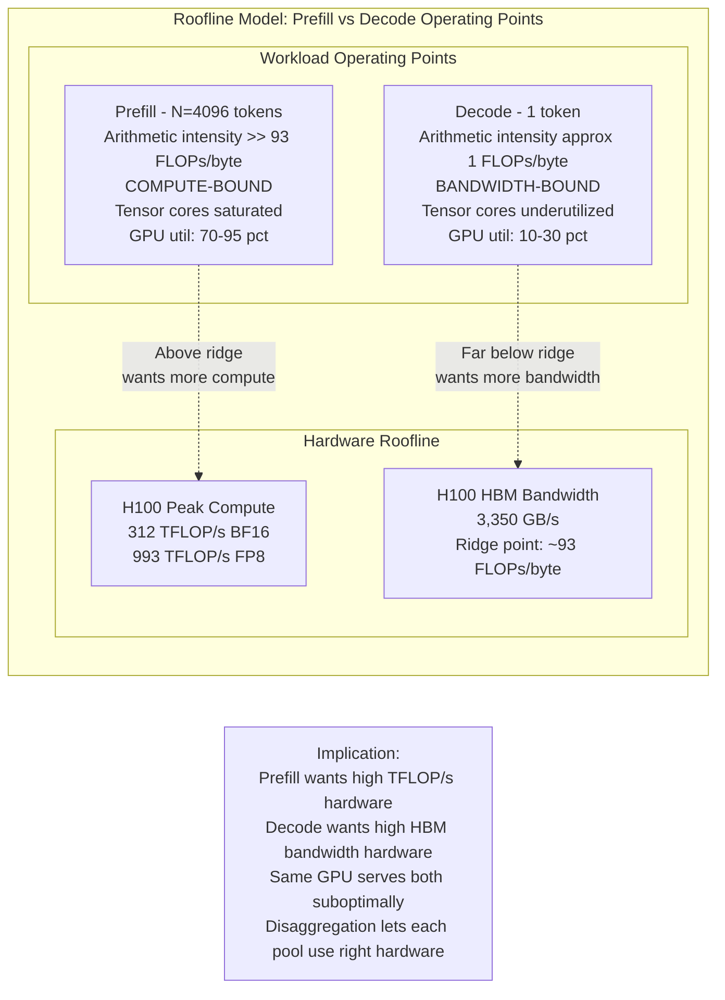
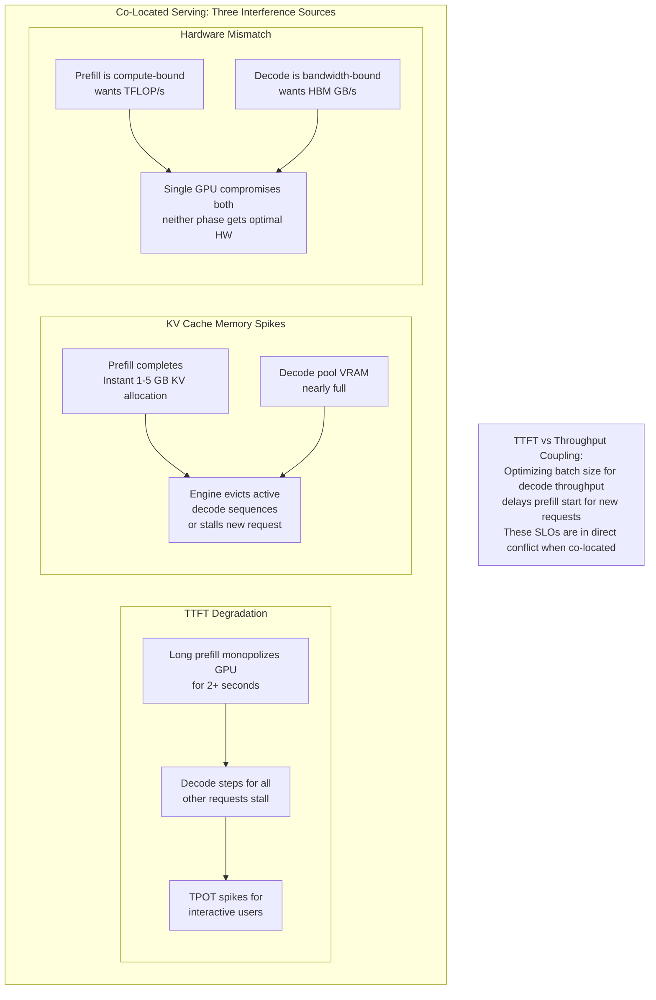
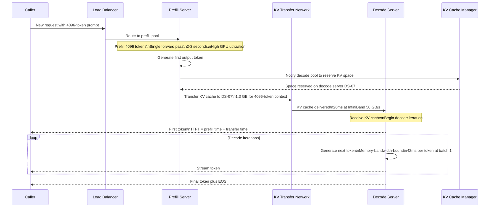
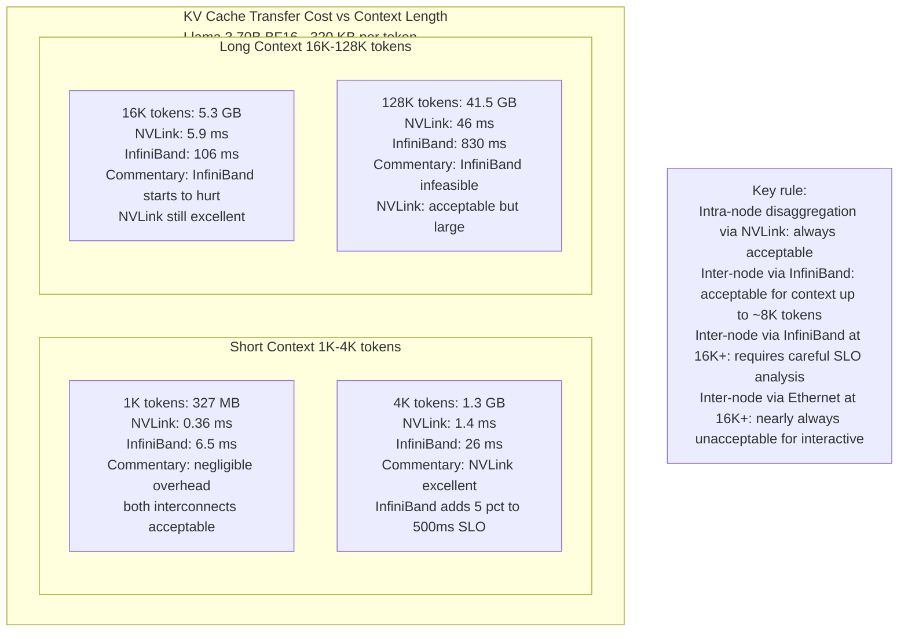
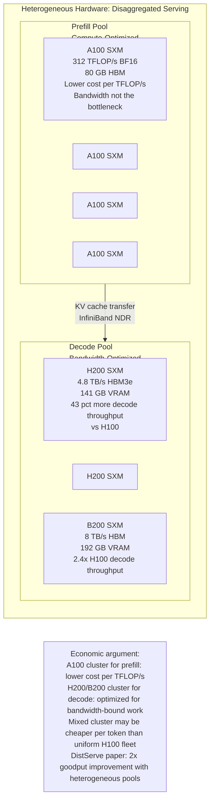
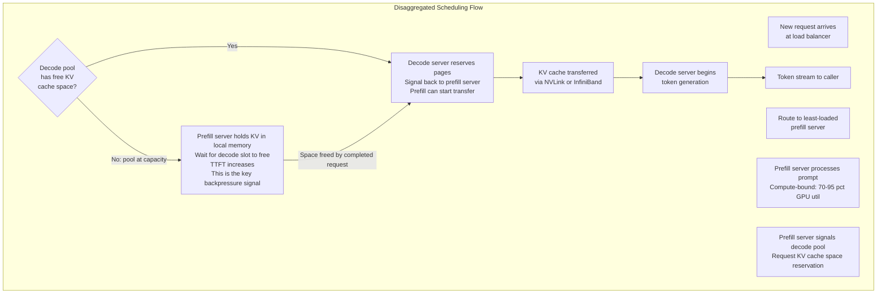
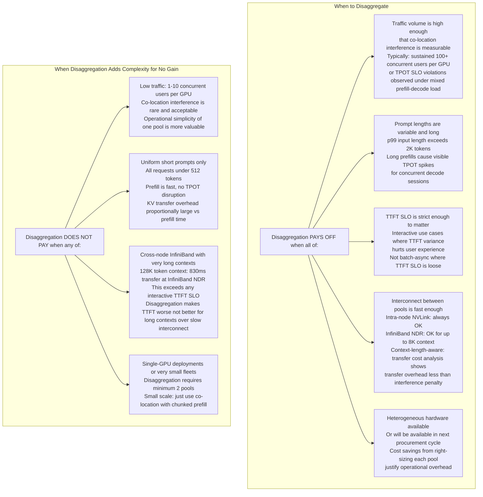

# Disaggregated Prefill/Decode

## Overview

Every LLM inference request passes through two phases with opposite hardware profiles. Prefill processes the entire input prompt in a single compute-saturating forward pass. Decode generates one output token per forward pass in a memory-bandwidth-bound chain. These two phases want different hardware, compete for the same GPU resources when co-located, and create predictable interference patterns that degrade both TTFT and throughput at scale.

Disaggregated serving is the architectural pattern that resolves this: separate the cluster into a prefill pool and a decode pool, each sized and optimized for its workload. The cost is a KV cache transfer between pools. Whether that cost is acceptable depends on context length, interconnect bandwidth, and traffic volume — and the analysis of that cost is the technical core of this chapter.

See also: [Batching & Continuous Batching](../15-model-serving/02-batching-and-continuous-batching.md) for the co-location interference problem in the context of scheduler design, [KV Cache Management](../15-model-serving/03-kv-cache-management.md) for the KV cache arithmetic that governs transfer cost, and [The Inference Stack](../14-ai-infrastructure/02-the-inference-stack.md) for where disaggregated serving sits in the four-layer stack.

---

## The Two Phases and Their Opposite Hardware Profiles

Before anything else, understand why prefill and decode are not just "two parts of the same operation" — they are two entirely different compute workloads that happen to run on the same hardware because most systems co-locate them.

### Prefill: Compute-Bound

Prefill processes all N input prompt tokens simultaneously in a single forward pass. For an N-token prompt:
- The Q, K, V matrices are computed for all N tokens in parallel
- Attention is computed between all token pairs (scaled dot-product, O(N²) memory but one large GEMM)
- The FFN runs on all N tokens at once

The result is a large **matrix-matrix multiplication**: the input `[N × hidden_dim]` multiplied by the weight matrix `[hidden_dim × 4×hidden_dim]` (for the FFN). Both dimensions are large. This operation has high arithmetic intensity (FLOPs per byte of memory read), placing it **above the roofline ridge point** — it is compute-bound, not bandwidth-bound.

**Hardware profile for prefill:**
- High TFLOP/s (tensor cores)
- Arithmetic intensity >> ridge point (e.g., 312 TFLOP/s on H100 / 3.35 TB/s = 93 FLOPs/byte ridge; prefill at N=4096 tokens easily exceeds this)
- GPU utilization: 70–95% of theoretical compute
- HBM bandwidth utilization: moderate (data is reused across the large GEMM)

For a 4096-token prompt on a single H100, prefill time for Llama 3 70B BF16:
```
FLOPs ≈ 2 × N × model_params = 2 × 4096 × 70×10⁹ ≈ 574 TFLOPs
H100 peak: 312 TFLOP/s (BF16 with sparsity), practical ~200 TFLOP/s
Time ≈ 574 TFLOPs / 200 TFLOP/s ≈ 2.87 seconds
```

### Decode: Memory-Bandwidth-Bound

Decode generates one token per forward pass. At each step:
- The new token's Q is computed: `[1 × hidden_dim]` vector
- Attention is computed between this one Q vector and all N cached K vectors: `[1 × N]` dot product
- The FFN runs on a single token: `[1 × hidden_dim]` × `[hidden_dim × 4×hidden_dim]`

The critical operation is `[1 × hidden_dim]` × `[hidden_dim × 4×hidden_dim]` — a **matrix-vector multiplication**. The weight matrix is read from HBM to serve one token. The arithmetic intensity is 1 FLOP per byte of weight data read (approximately), placing it **far below the roofline ridge point** — it is memory-bandwidth-bound.

**Hardware profile for decode:**
- High HBM bandwidth (GB/s)
- Large HBM capacity (for weights + KV cache)
- GPU tensor core utilization: 10–30% (underutilized because the bottleneck is data movement)
- Decode throughput per GPU ceiling: approximately `HBM_bandwidth / model_size_bytes`

For Llama 3 70B BF16 on H100 at batch size 1:
```
Decode throughput ceiling = 3,350 GB/s / 140 GB ≈ 24 tokens/sec
Each token ≈ 42 ms
```



---

## Why Co-Location Causes Interference

When prefill and decode run on the same GPU in the same batch, they create three forms of interference.

### 1. Head-of-Line Blocking from Long Prefills

A 4096-token prefill on H100 takes ~2.9 seconds. Any decode requests in the same batch wait for this prefill to complete before their next decode step runs. If 20 interactive users are in mid-conversation, they all wait ~2.9 seconds for their next token — a visible TPOT spike — while one long-context request is prefilling.

Even with chunked prefill (see [Batching & Continuous Batching](../15-model-serving/02-batching-and-continuous-batching.md)), chunked prefill is a mitigation, not a solution: it reduces the per-chunk stall from 2.9s to ~300ms (at 512-token chunks), but the competition for GPU resources remains.

### 2. KV Cache Memory Pressure Spikes

A 4096-token prefill generates the full KV cache for those tokens in one step. For Llama 3 70B BF16, that is:
```
KV cache = 80 layers × 2 × 8 KV heads × 128 head_dim × 4096 tokens × 2 bytes
         = 327,680 bytes/token × 4096 tokens ≈ 1.3 GB
```

This 1.3 GB allocation happens instantaneously at the end of the prefill step. If the decode pool's KV cache is nearly full, the serving engine must:
- Pre-evict existing decode sequences to make room (adding latency to those requests)
- Or stall the new request until space is available (adding to TTFT)

Long prompts (16K–128K tokens) create proportionally larger spikes: a 16K-token prompt generates ~5.3 GB of KV cache in one step.

### 3. Suboptimal GPU Utilization Across Both Phases

A GPU optimized for decode (high HBM bandwidth, large HBM capacity — e.g., H200 with 4.8 TB/s) is under-utilized during prefill because prefill is compute-bound, not bandwidth-bound. The H200's bandwidth advantage over H100 (4.8 vs 3.35 TB/s) provides ~43% more decode throughput, but for prefill, what matters is TFLOP/s — where H200 and H100 are similar.

Conversely, a compute-dense GPU optimized for prefill (A100 with 312 TFLOP/s BF16 but only 2 TB/s HBM) is wasteful for decode: its high compute is underutilized and its lower bandwidth becomes the bottleneck.

Co-location forces a compromise GPU choice that is suboptimal for both workloads.



---

## Disaggregated Serving Architecture

Disaggregation separates the cluster into two pools:
- **Prefill pool**: Receives new requests, processes prompts, generates KV cache
- **Decode pool**: Receives KV cache from prefill servers, generates all output tokens



The sequence reveals the core cost: **TTFT now includes the KV transfer latency**. TTFT = prefill_time + transfer_time. For a 4096-token prompt at InfiniBand NDR: 2.9s prefill + 0.026s transfer = ~2.93s TTFT. The transfer adds 0.9% overhead for this context length. For a 16K-token context, the transfer cost grows proportionally.

---

## The KV Cache Transfer: Central Cost Analysis

The KV cache transfer from prefill server to decode server is the single most important cost to analyze in disaggregated serving. Everything else — hardware selection, scheduling policy, fault tolerance — follows from whether this transfer is acceptable.

### KV Cache Size Formula

```
KV_bytes = num_layers × 2 × num_kv_heads × head_dim × sequence_length × dtype_bytes
```

For Llama 3 70B BF16:
```
KV_bytes = 80 × 2 × 8 × 128 × seq_len × 2 bytes
         = 327,680 bytes/token × seq_len
         ≈ 320 KB per token
```

| Context length | KV cache size | NVLink 900 GB/s | InfiniBand NDR 50 GB/s | 400GbE 40 GB/s |
|---|---|---|---|---|
| 1,024 tokens | 327 MB | 0.36 ms | 6.5 ms | 8.2 ms |
| 4,096 tokens | 1.3 GB | 1.4 ms | 26 ms | 33 ms |
| 16,384 tokens | 5.3 GB | 5.9 ms | **106 ms** | **132 ms** |
| 32,768 tokens | 10.6 GB | 11.8 ms | **212 ms** | **265 ms** |
| 128,000 tokens | 41.5 GB | 46 ms | **830 ms** | **1,037 ms** |

The transfer costs are not hypothetical. A 16K-token context at InfiniBand NDR adds 106 ms to TTFT. For an interactive product with a 500 ms TTFT SLO, this is 21% of the budget consumed by a network transfer — before accounting for prefill time. At 128K context, the InfiniBand transfer alone is 830 ms, exceeding any interactive TTFT SLO.



### Interconnect Selection for Disaggregation

The choice of interconnect between prefill and decode servers determines what context lengths are viable:

**NVLink (intra-node disaggregation):** Place prefill and decode tasks on different GPUs within the same NVSwitch-connected DGX node. Transfer via NVLink at 900 GB/s. At this bandwidth, even 128K-token contexts add only 46 ms — acceptable for most applications. The constraint: prefill and decode share the node's HBM, GPU count, and cooling infrastructure. Not independently scalable.

**InfiniBand NDR (inter-node, same rack):** Most production disaggregation deployments target InfiniBand for independent scalability. NDR (400 Gb/s, ~50 GB/s effective) is the current standard. Viable for context lengths up to approximately 8K tokens without significant TTFT impact. For 16K+ contexts, the transfer cost must be weighed against the interference savings from disaggregation.

**400GbE RoCEv2 (inter-node, Ethernet):** 40 GB/s effective throughput after protocol overhead. 20% slower than InfiniBand NDR for the same context. Useful when InfiniBand infrastructure is not available, but requires careful context length budgeting.

**The sweet spot:** Intra-rack disaggregation with NDR InfiniBand, at context lengths ≤ 8K tokens, where transfer overhead is under 50 ms and disaggregation's interference-elimination benefits dominate. Scale prefill pool and decode pool independently based on measured traffic.

---

## Hardware Heterogeneity: The Real Payoff

The economic argument for disaggregation is hardware cost optimization. When prefill and decode run separately, each pool can use the GPU most cost-effective for its workload.

### Prefill Pool: Compute-Optimized

Prefill is compute-bound. The metric that matters is TFLOP/s per dollar, not HBM bandwidth per dollar.

- **A100 SXM (312 TFLOP/s BF16, 80 GB HBM):** Excellent for prefill. The A100's lower HBM bandwidth (2 TB/s vs H100's 3.35 TB/s) is irrelevant for prefill's compute-bound operation. A100s can be significantly cheaper than H100s in secondary markets.
- **H100 SXM (312 TFLOP/s BF16, 80 GB HBM):** Same peak compute as A100 for dense matrix operations; FP8 tensor cores (989 TFLOP/s) enable faster prefill with FP8 precision.
- **TPUv5 / Trainium:** Google and AWS deploy custom silicon optimized for matrix multiplications — prefill is exactly this workload.

### Decode Pool: Bandwidth-Optimized

Decode is memory-bandwidth-bound. The metric that matters is HBM bandwidth per dollar.

- **H200 SXM (4.8 TB/s HBM3e, 141 GB):** 43% more bandwidth than H100, enabling 43% more decode throughput per GPU. The 141 GB VRAM also holds more KV cache, directly translating to more concurrent sequences.
- **B200 SXM (8 TB/s NVLink 5.0, 192 GB):** Nearly 2.4× H100's bandwidth. At 192 GB VRAM, a single B200 can serve hundreds of concurrent 4K-token sequences. Ideal for a decode pool.
- **H100 SXM (3.35 TB/s, 80 GB):** Solid baseline. The 80 GB VRAM limits KV cache budget.



### The Cost Per Token Argument

A uniform H100 fleet uses expensive compute for decode (memory-bound — HBM bandwidth is the bottleneck, not tensor cores) and uses relatively lower bandwidth for prefill (compute-bound — tensor cores are the bottleneck, not HBM). Both phases get suboptimal hardware.

A heterogeneous disaggregated fleet matches hardware to workload:
- Prefill pool: A100s or H100 PCIe variants (lower cost per TFLOP/s, higher TFLOP/s per dollar than H200)
- Decode pool: H200s or B200s (higher HBM bandwidth per dollar for bandwidth-bound decode)

DistServe (Zhong et al., 2024) demonstrated a 2× goodput improvement on real workloads by disaggregating with heterogeneous hardware, compared to a co-located uniform fleet.

---

## Scheduling and Load Balancing

Disaggregation introduces a new scheduling complexity: a request cannot start decoding until the prefill is complete AND the KV cache is transferred AND the decode server has reserved space. This three-phase coordination creates new failure modes and scheduling decisions.

### Prefill-Decode Capacity Ratio

The ratio of prefill capacity to decode capacity must match the traffic's input/output token ratio:

```
required_prefill_throughput = avg_input_tokens × QPS
required_decode_throughput  = avg_output_tokens × QPS

ratio = required_prefill_throughput / required_decode_throughput
      = avg_input_tokens / avg_output_tokens
```

**Example: Code generation system**
- Average input: 1,000 tokens (code context + instruction)
- Average output: 100 tokens (generated code snippet)
- Ratio: 10× more prefill work than decode work
- Configuration: 10 prefill servers per 1 decode server

**Example: Long-form document generation**
- Average input: 200 tokens (brief description)
- Average output: 2,000 tokens (generated document)
- Ratio: 1 prefill to 10 decode
- Configuration: 1 prefill server per 10 decode servers

Measuring this ratio from production logs is essential before sizing the pools. A mismatch means one pool becomes the bottleneck while the other idles.



### KV Cache Migration and Reservation

The critical scheduling challenge: the decode server must have available KV cache pages before the prefill server begins the transfer. If the decode pool is under memory pressure, the prefill server generates the KV cache but cannot transfer it — the KV cache sits in the prefill server's VRAM, occupying space that could be used for the next prefill request.

**Reservation-based scheduling:** The decode server reserves KV cache pages (based on the request's input length and a predicted output length) *before* the prefill starts. If no space is available, the request waits in queue. This prevents the expensive "KV cache generated but cannot be transferred" state.

**Output length prediction:** To reserve the right amount of KV cache space, the scheduler needs to predict output length. For structured outputs (JSON with known schema, code with fixed signature), the output length is predictable. For open-ended chat, an output length distribution from historical data is used. Over-reservation wastes space; under-reservation causes mid-generation eviction.

### Fault Isolation in Disaggregated Serving

Disaggregation changes the failure boundaries:

- **Prefill server failure**: The KV cache for completed requests has already been transferred to decode servers. In-flight prefill requests are lost (must be retried), but existing decode sessions are unaffected. Recovery is limited to re-prefilling failed requests.

- **Decode server failure**: All in-flight decode sessions on that server lose their KV cache and must restart from the beginning (re-prefill + decode from scratch). This is more severe than a prefill server failure.

- **Transfer failure**: The KV cache transfer fails after prefill completes. The prefill work is wasted; the request must be retried. Retry means re-prefilling (expensive for long contexts).

Asymmetric failure impact: protect decode servers more aggressively (replication, health checks) than prefill servers, since a decode server failure has broader impact on in-flight user sessions.

---

## Research and Production Implementations

### Splitwise (Patel et al., 2023)

The paper that systematically analyzed disaggregated prefill-decode. Key findings:
- Co-located serving with mixed prefill-decode batches causes 12× higher TTFT variance compared to disaggregated serving at equivalent throughput
- Disaggregated serving provides 1.4× higher throughput at the same TTFT SLO
- The KV cache transfer overhead is tractable for context lengths up to 32K tokens on InfiniBand

### DistServe (Zhong et al., 2024)

Extended Splitwise with heterogeneous hardware pools:
- Prefill pool: A100 (high TFLOP/s per dollar)
- Decode pool: A100/H100 (higher HBM bandwidth options)
- Demonstrated 2× goodput improvement vs. co-located serving on real workloads (ShareGPT traffic mix)
- Key insight: hardware heterogeneity across pools is what makes disaggregation economically compelling, not just operational separation

### Mooncake (Qin et al., 2024)

Kimi (Moonshot AI)'s production disaggregated serving system for very long contexts (up to 1M tokens):
- KV cache stored in a distributed KV cache store (multiple servers) rather than transferred in bulk
- SSD-backed tiered KV cache: hot pages in GPU memory, warm in CPU DRAM, cold on NVMe
- For 1M-token contexts, monolithic transfer is infeasible; paged transfer and prefetching are used
- Demonstrates disaggregation at the extreme end of context length where the KV cache is itself a distributed data structure

### vLLM Disaggregated Serving Mode (v0.6+)

Production-ready implementation available in vLLM with:
- Configurable prefill and decode server roles
- KV cache transfer via RDMA (InfiniBand/RoCEv2) using nixl transfer engine
- Prefix caching aware: shared KV cache pages are not re-transferred if already present on the decode server
- Load balancing via a disaggregated serving scheduler that tracks pool capacity

---

## When Disaggregation Pays Off vs. When It Doesn't

Disaggregation adds operational complexity: two server pools, KV transfer infrastructure, coordination protocols, and asymmetric failure modes. This complexity is only worth it in specific conditions.



### The Quantitative Decision Framework

Before disaggregating, measure these three quantities in production:

**1. TPOT spike frequency:** What fraction of decode steps are delayed by more than 2× the median step time? If this fraction exceeds 5%, a long prefill is likely causing it.

**2. KV transfer overhead vs interference savings:**
```
interference_cost = avg_prefill_duration × prefill_rate × decode_requests_in_batch
transfer_cost = KV_cache_size / interconnect_bandwidth

Disaggregate if: interference_cost > transfer_cost + operational_overhead
```

**3. Prefill-decode ratio from traffic:** Measure `avg_input_tokens / avg_output_tokens` from actual production logs, not synthetic workloads. This determines the pool sizing ratio.

**Rule of thumb for when to disaggregate:**
- High traffic systems (≥ 1,000 concurrent users) with variable prompt lengths: almost always worth it
- Medium traffic systems (100–1,000 concurrent users) with p99 input ≥ 4K tokens and strict TTFT SLOs: evaluate using the formula above
- Low traffic systems (< 100 concurrent users) or uniform short prompts: use chunked prefill instead

---

## Interview Questions

### Beginner

**Q: What is disaggregated prefill-decode, in one sentence?**

Disaggregated prefill-decode is a serving architecture where the prompt processing phase (prefill) and the token generation phase (decode) run on separate GPU pools, each optimized for its distinct compute profile, with the KV cache transferred between pools after prefill completes.

**Q: Why do prefill and decode have different hardware requirements?**

Prefill processes all input tokens in parallel, creating large matrix-matrix multiplications that saturate GPU tensor cores — it is compute-bound, sitting above the roofline ridge point and benefiting from high TFLOP/s. Decode generates one token per step, performing matrix-vector multiplications where the GPU reads the entire model weight set from HBM for each single token — it is memory-bandwidth-bound, sitting far below the ridge point and benefiting from high HBM bandwidth. The same GPU optimized for one workload is suboptimal for the other.

### Intermediate

**Q: Walk through the KV cache transfer arithmetic for a 16K-token context at InfiniBand NDR. Is 106 ms acceptable?**

KV cache per token for Llama 3 70B BF16: 80 layers × 2 × 8 KV heads × 128 head_dim × 2 bytes = 327,680 bytes ≈ 320 KB/token. At 16,384 tokens: 320 KB × 16,384 = 5,242,880 KB ≈ 5.0 GB. At InfiniBand NDR effective throughput of 50 GB/s: 5.0 GB / 50 GB/s = 100 ms (approximately 106 ms including protocol overhead).

Whether 106 ms is acceptable depends on the TTFT SLO. For a system with TTFT SLO of 500 ms: 106 ms is 21% of the budget, not counting the prefill time itself (~8 seconds for 16K tokens). The total TTFT would be 8s + 106ms = ~8.1s — well beyond any interactive SLO. For batch-async workloads with no TTFT SLO, it is irrelevant. The short answer: 106 ms is unacceptable for interactive serving at 16K context over InfiniBand. The solutions are: (a) use intra-node NVLink disaggregation where the same transfer takes ~6 ms; (b) use longer-context models that generate shorter KV caches per token (MLA architectures); (c) don't disaggregate for long contexts — keep co-location with chunked prefill.

**Q: What is the prefill-decode capacity ratio and how do you calculate it for a given workload?**

The prefill-decode ratio is `avg_input_tokens / avg_output_tokens` — the ratio of compute work each phase must handle per request. If your traffic has an average 1,000-token prompt and 100-token output: ratio = 10. For every 10 units of prefill capacity, you need 1 unit of decode capacity. In practice: measure from production logs the p50, p90, p99 of both input and output token counts, compute the ratio for the p50 workload, and size pools accordingly. Then add headroom for the tail. If your p99 input is 10× p50 input, your peak prefill demand is 10× higher than average — you either provision for the tail or implement request queuing on the prefill side.

### Senior

**Q: Design the KV cache transfer protocol for disaggregated serving under InfiniBand NDR. What happens on transfer failure?**

The transfer uses RDMA (via NCCL or nixl) to move KV cache pages directly from the prefill server's GPU memory to the decode server's GPU memory — bypassing both CPUs. The sequence:

1. Prefill server completes the forward pass, generates KV cache in GPU memory
2. Decode server has already reserved pages (reservation-based scheduling)
3. Prefill server sends an RDMA write to the decode server's reserved pages
4. Transfer proceeds at InfiniBand NDR bandwidth (~50 GB/s)
5. Completion signal sent to decode server scheduler

On transfer failure (link error, network congestion causing RDMA timeout):
- The decode server's reserved pages are released back to the free pool
- The request is marked as failed and placed back in the prefill queue for retry
- The prefill server's KV cache for this request is freed from local VRAM
- The request re-enters the prefill queue and is re-processed from scratch

The retry cost is the full prefill time (expensive for long contexts). This motivates storing the KV cache in a separate KV cache store (Mooncake's approach) with durability, so that a transfer failure doesn't require re-prefilling — just re-initiating the transfer from the durable cache.

**Q: A system has a prefill pool of 16 A100s and a decode pool of 32 H200s. Traffic arrives at 100 requests/second with average 800-token prompts and 200-token outputs. After three months, average prompt length grows to 2,000 tokens while output length stays 200 tokens. What changes, and what do you do?**

Traffic shift: avg prompt grew from 800 to 2,000 tokens — 2.5× increase. Prefill work per request increased 2.5×: the prefill pool now does 2.5× more work per request. At 100 RPS, the prefill pool at 16 A100s was handling: 100 RPS × 800 tokens × prefill cost. Now at 2,000 tokens: the same 16 A100s must process 2.5× the total token load. If the original utilization was ~70%, it's now 175% — overloaded. The decode pool's ratio also changes: prefill work is 10× output work (2,000/200), but the decode pool was sized for 800/200 = 4× ratio. The prefill pool is now the bottleneck.

Interventions: (1) Add prefill capacity — purchase or move 24 GPUs from decode to prefill (or add 24 new GPUs if budget allows). New ratio: 40 prefill GPUs × A100_throughput / (32 H200 GPUs × H200_throughput). (2) Enable prefix caching on the prefill servers — if the growth in prompt length is due to longer system prompts or shared document contexts, prefix caching eliminates the repeated prefill work for the shared prefix, recovering a fraction of the capacity. (3) Rate-limit long-prompt requests at the gateway to protect TTFT SLOs for short-prompt requests while the capacity expansion is underway.

### Staff

**Q: Design the complete disaggregated serving architecture for a production RAG system with: 500 QPS, p50 context length 8K tokens (retrieved documents), p99 context length 64K tokens, TTFT SLO of 800 ms. Model: Llama 3 70B BF16. Available hardware: 64× H100 SXM5, 32× H200 SXM5. InfiniBand NDR interconnect.**

First, compute KV transfer costs at the SLO-relevant context lengths:
- 8K tokens: 320 KB/token × 8192 = 2.6 GB → 2.6 GB / 50 GB/s = 52 ms transfer
- 64K tokens: 320 KB × 65536 = 20.9 GB → 20.9 GB / 50 GB/s = 418 ms transfer

The 64K p99 context has a 418 ms InfiniBand transfer time alone — exceeding the 800 ms TTFT SLO when combined with prefill time (~32 seconds for 64K tokens). InfiniBand disaggregation is infeasible for 64K context interactive serving.

**Architecture decision:** Two-tier system.

Tier 1 — Standard path (p50, up to 16K context): Disaggregated serving with H100 prefill pool and H200 decode pool.
- Prefill pool: 32× H100 SXM5 (high TFLOP/s)
- Decode pool: 32× H200 SXM5 (4.8 TB/s bandwidth, 141 GB VRAM for KV cache)
- KV transfer at 8K context: 52 ms (6.5% of 800 ms SLO — acceptable)

Tier 2 — Long-context path (p99, 16K–64K context): Co-located serving with chunked prefill on remaining H200s.
- Co-located pool: 32× H200 SXM5 (high VRAM for long KV cache)
- KV transfer infeasible at 64K over InfiniBand; chunked prefill mitigates TPOT impact
- TTFT SLO for 64K: relaxed to 30 seconds (batch-async SLO, not interactive)

Prefill-decode ratio for tier 1: 8K tokens / (avg output 200 tokens) = 40:1. Prefill capacity must be 40× decode capacity in terms of token-throughput. At 500 QPS with 80% on standard path: 400 RPS × 8K tokens = 3.2M tokens/sec of prefill demand. H100 prefill throughput for 70B BF16: approximately 2,000 tokens/sec per GPU. 32 H100s: 64,000 tokens/sec prefill. Need 3.2M / 64K = 50 GPUs of prefill capacity — more than available. Solution: use FP8 precision on H100s to get 2× prefill throughput (~4,000 tokens/sec/GPU), and implement queueing at the prefill gateway.

---

## Google-Level Follow-Ups

**"You said disaggregation improves TTFT predictability. Quantify this. What does 'predictability' mean and what's the mechanism?"**

Tests: whether the candidate can decompose a qualitative claim into a measurable quantity.

TTFT variance is what disaggregation improves. In co-located serving, TTFT for a new request depends on whether a long-prefill request happens to be running when the new request arrives. If a 4096-token prefill is in progress, a new request waits ~2.9 seconds before its prefill starts — its TTFT is increased by 2.9 seconds. If no long prefill is running, its TTFT is just its own prefill time. The p99 TTFT is therefore the sum of (own prefill time + the worst-case concurrent prefill time), while the median is just the own prefill time. The TTFT distribution is heavy-tailed and depends on traffic patterns.

In disaggregated serving, the decode server's TTFT = prefill time (on prefill server) + KV transfer time. Both components are deterministic for a given context length. There is no "waiting for another request's prefill to complete" interference on the decode server — the decode server only runs memory-bandwidth-bound steps, which are smooth and predictable. The TTFT distribution is narrower, with p99/p50 TTFT ratio close to 1.0 rather than 5–10× as in co-located serving.

**"DistServe claims 2× goodput improvement. Under what conditions does this hold, and when would you expect smaller or larger gains?"**

Tests: whether the candidate understands the conditions under which the paper's results generalize.

DistServe's 2× result comes from two compounding effects: (1) removing interference between prefill and decode (which wastes GPU cycles through TPOT spikes and KV cache pressure); (2) using heterogeneous hardware to match workload to hardware profile. The gain is larger when:
- Traffic has a bimodal distribution of prompt lengths (some very long, some short) — interference is worst in this case
- The prefill/decode ratio is high (many more input than output tokens) — more prefill work competing with decode
- Hardware pools use genuinely different GPU classes (A100 vs H200), amplifying the per-pool efficiency improvement
- KV transfer overhead is small relative to the interference savings (short-to-medium context lengths at InfiniBand)

The gain is smaller when:
- Prompt lengths are uniform (no interference spikes from outliers)
- Context lengths are very long and KV transfer dominates (the transfer cost approaches or exceeds the interference cost)
- Hardware is uniform across pools (no per-pool hardware optimization possible)

**"Mooncake uses a distributed KV cache store. When does a distributed KV store make disaggregation better, and when does it make things worse?"**

Tests: understanding of when the distributed KV store adds complexity without benefit.

A distributed KV store (KV pages stored independently of the prefill and decode servers, accessible by both) is beneficial when:
- Context lengths exceed single-GPU VRAM capacity: a 1M-token context's KV cache (320 GB for Llama 3 70B) cannot live on any single GPU. The distributed store shards it across multiple memory tiers.
- KV cache reuse across requests: if multiple users query the same document, the KV cache for that document can be stored once and served to all queriers from the cache. Without a distributed store, each prefill server would independently compute and locally cache the KV.
- Fault tolerance for long-running sessions: a durable KV store enables decode servers to resume after failure without re-prefilling.

The distributed KV store makes things worse when:
- Context lengths are short (under 8K tokens): the overhead of distributed cache lookup, coordination protocol, and network indirection adds more latency than a direct point-to-point KV transfer.
- KV cache is request-unique: no sharing is possible, so the distributed cache provides fault tolerance at the cost of network indirection with no reuse benefit.
- The KV store becomes a bottleneck: at very high QPS, the KV cache store itself must scale; a centralized store becomes a hot-spot, and a sharded distributed store adds consistency management complexity.

---

## Common Mistakes

1. **Using the wrong interconnect bandwidth figure for KV transfer latency.** The theoretical InfiniBand NDR bandwidth is 400 Gb/s = 50 GB/s. The effective throughput after protocol overhead and software stack latency is 40–50 GB/s for large transfers, but can be 20–30 GB/s for small transfers (< 1 MB) due to RDMA setup overhead. Always use measured effective bandwidth for the actual transfer size, not theoretical peak.

2. **Sizing pools based on average token counts, not the p90/p99.** If p50 prompt length is 500 tokens and p99 is 8,000 tokens, sizing the prefill pool for p50 results in the prefill pool being 16× underprovisioned at p99. The prefill pool must handle the tail of the input length distribution.

3. **Forgetting that KV transfer adds to TTFT, not TPOT.** The transfer happens once (between prefill and the first decode step), so it directly increases TTFT. TPOT is unaffected by the transfer — it is determined by the decode server's memory bandwidth. Engineers who optimize TPOT but ignore the transfer cost end up with good TPOT but poor TTFT.

4. **Deploying disaggregation without measuring co-location interference first.** The decision to disaggregate should be driven by measured TPOT spikes from prefill interference, not architectural preference. In many systems, chunked prefill eliminates 90% of the interference at much lower operational cost.

5. **Setting the prefill-decode capacity ratio based on the product's feature spec, not traffic measurement.** A document summarization feature might be expected to use 10K-token prompts, but actual users send 2K-token prompts on average. The ratio must come from measured logs, not assumptions.

6. **Neglecting the asymmetric failure impact of decode server failures.** A failed decode server loses all in-flight KV caches for active sessions. Unlike a prefill server failure (which only loses requests that were in the middle of prefilling), a decode server failure requires every in-flight session to re-prefill from scratch. Decode servers should have higher redundancy and faster failure detection than prefill servers.

---

## Key Takeaways

- **Prefill is compute-bound; decode is memory-bandwidth-bound.** They fall on opposite sides of the GPU roofline ridge point, want different hardware, and interfere when co-located.
- **Co-location interference has three components:** TPOT spikes from long-prefill head-of-line blocking, KV cache memory pressure spikes from instantaneous large allocations, and suboptimal hardware utilization across both phases.
- **The KV cache transfer is the central cost.** For Llama 3 70B BF16: 320 KB per token. At 4K context: 1.3 GB; at 16K context: 5.3 GB. Over InfiniBand NDR (50 GB/s): 26 ms and 106 ms respectively. The transfer is acceptable for short-to-medium contexts; it becomes the bottleneck at long contexts over slow interconnects.
- **Intra-node disaggregation via NVLink (900 GB/s) eliminates the transfer problem** for all practical context lengths. Cross-node disaggregation via InfiniBand is viable for contexts up to ~8K tokens.
- **Heterogeneous hardware is the economic argument**: A100s for compute-bound prefill, H200/B200s for bandwidth-bound decode. Disaggregation is what makes hardware heterogeneity exploitable.
- **The prefill-decode capacity ratio** = avg_input_tokens / avg_output_tokens. Measure from production logs, not feature specs. Code generation (1000 in / 100 out = 10:1 prefill-heavy); chat (200 in / 200 out = 1:1 balanced).
- **Disaggregation pays off for:** high-traffic systems, variable long prompts, strict TTFT SLOs, available InfiniBand interconnect, heterogeneous hardware. It does not pay off for low-traffic systems, uniform short prompts, or very long contexts over InfiniBand where transfer overhead exceeds interference savings.

---

*Part of [Distributed Inference](index.md) · [Tensor & Pipeline Parallelism](01-tensor-and-pipeline-parallelism.md) · [Speculative Decoding at Scale](03-speculative-decoding-at-scale.md) · [Batching & Continuous Batching](../15-model-serving/02-batching-and-continuous-batching.md) · [KV Cache Management](../15-model-serving/03-kv-cache-management.md) · [GPU Fundamentals for AI Systems](../16-gpu-systems/01-gpu-fundamentals-for-ai-systems.md)*
