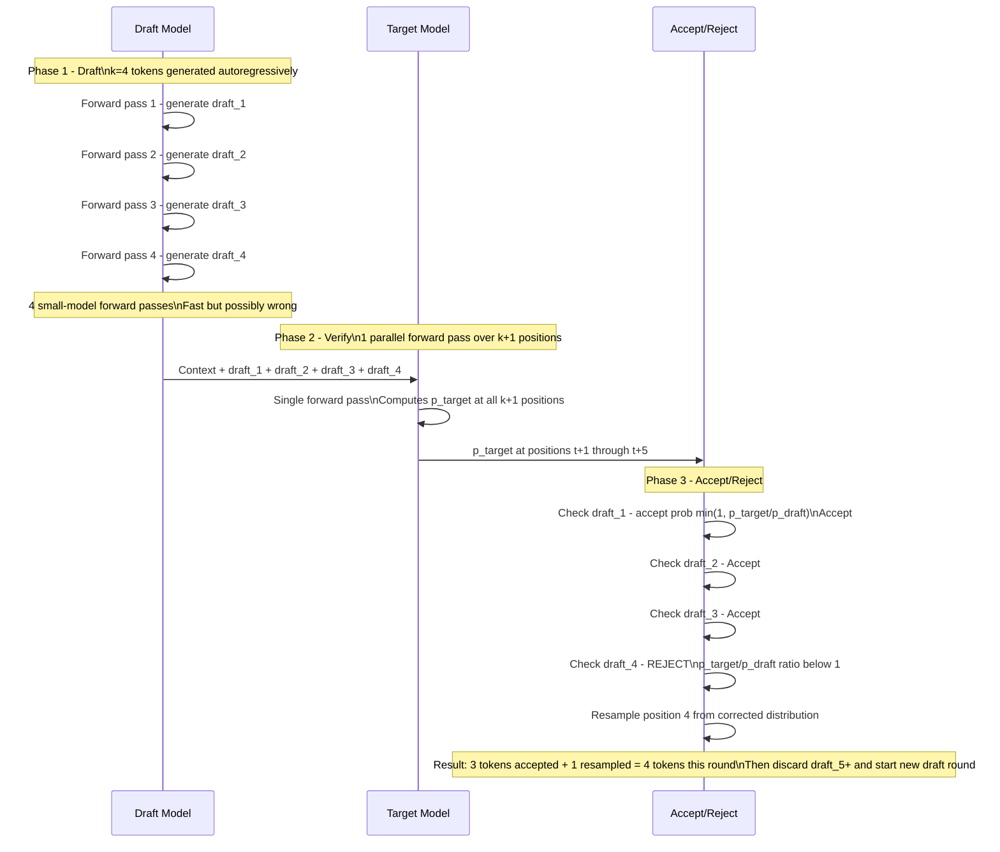
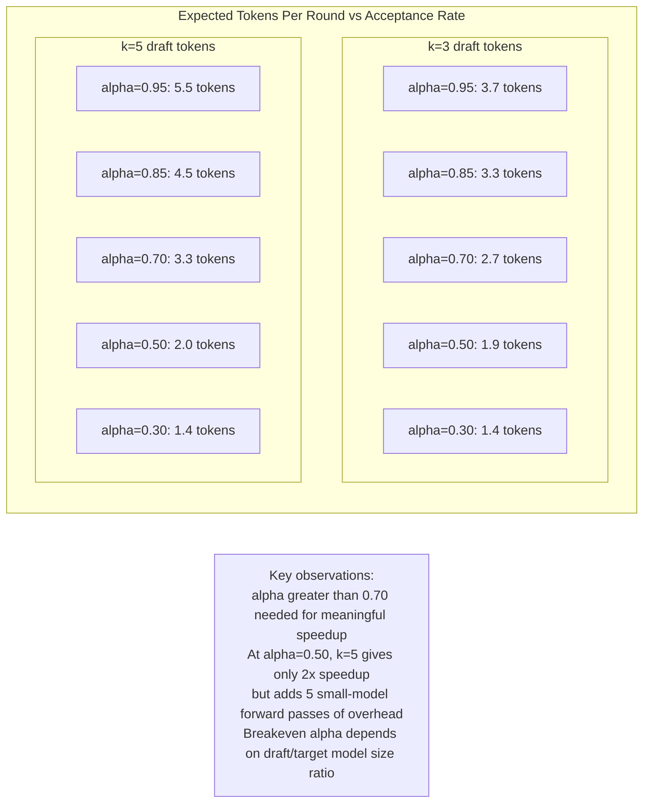
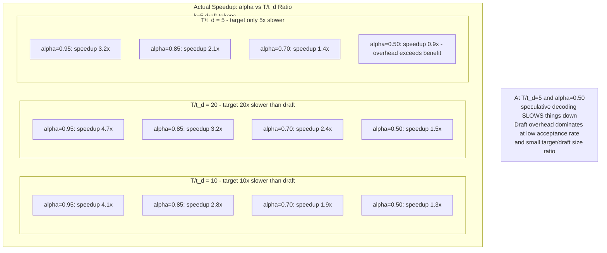
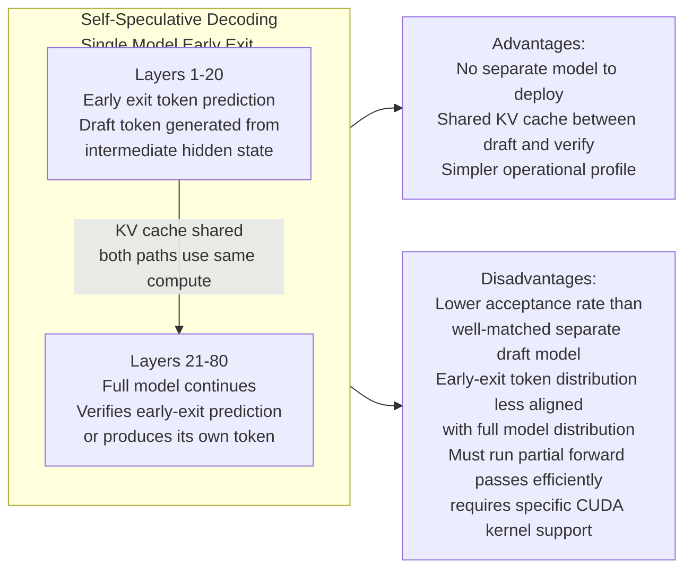
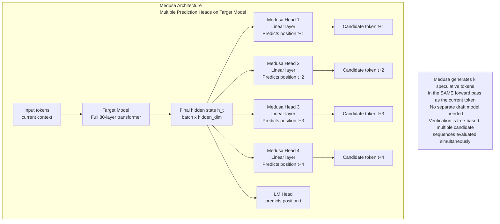
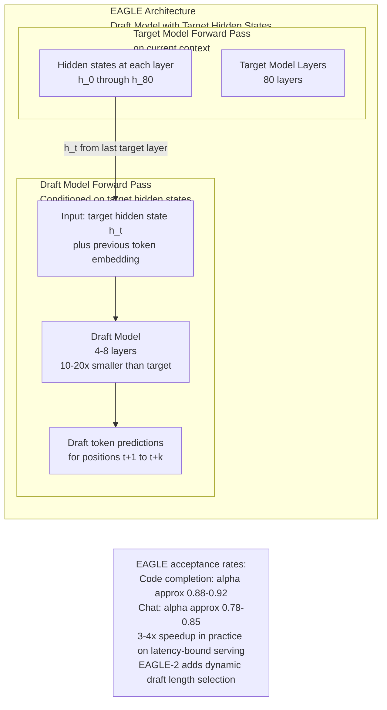
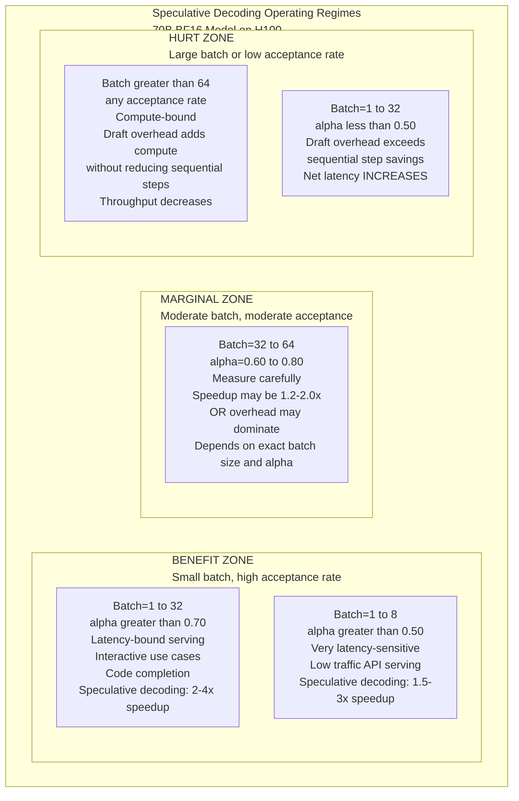

# Speculative Decoding at Scale

## Overview

Autoregressive generation is fundamentally sequential. Token N cannot be generated until token N-1 exists. Every output token requires a full forward pass through the model. For a 70B BF16 model on H100, that means reading 140 GB of weights per decode step, yielding a hard throughput ceiling of approximately 24 tokens/second at batch size 1 — directly derived from HBM bandwidth (3.35 TB/s ÷ 140 GB = 24 tokens/sec). This ceiling is not a software limitation; it is imposed by physics.

Speculative decoding breaks this ceiling by generating multiple tokens per main model forward pass — trading additional compute for fewer sequential steps. It does not change what the model computes; it changes how many times the model must run to produce N output tokens. At high acceptance rates, this yields 2–4× latency reduction without altering the model's output distribution.

This chapter covers the draft-and-verify mechanism in full mechanical detail, the acceptance rate metric that determines all speedup, the spectrum of draft model variants, and the system-level conditions where speculative decoding helps vs. where it actively hurts.

See also: [Batching & Continuous Batching](../15-model-serving/02-batching-and-continuous-batching.md) for how speculative decoding interacts with continuous batching, [Multi-Model Serving & Routing](../15-model-serving/05-multi-model-serving-and-routing.md) for draft model deployment as a multi-model serving problem, and [Tensor & Pipeline Parallelism](01-tensor-and-pipeline-parallelism.md) for how parallelism affects the main model's per-step cost.

---

## The Serialization Problem Speculative Decoding Solves

At batch size 1, each decode step costs approximately:

```
step_time = model_size_bytes / HBM_bandwidth
           = 140 GB / 3,350 GB/s (H100 HBM3)
           = 42 ms per token
```

To generate 200 output tokens: 200 × 42 ms = 8.4 seconds. These 200 steps are sequential — step 201 cannot start until step 200 completes. Even adding more GPUs via tensor parallelism speeds up each step (by dividing the memory bandwidth across more GPUs) but does not reduce the number of steps. The sequential dependency is the fundamental bottleneck.

At larger batch sizes, the step time improves because the weight read cost is amortized over more requests. At batch=32, each step takes approximately 42 ms but produces 32 tokens simultaneously — throughput scales; per-request latency from sequential dependency remains.

Speculative decoding attacks the **number of steps**, not the per-step cost. Instead of running N sequential main model steps to produce N tokens, it targets running N/k main model steps, where k is the average number of tokens generated per main model forward pass.

---

## The Draft-and-Verify Mechanism

### Full Mechanical Detail

Speculative decoding operates in rounds. Each round consists of three phases: drafting, verification, and acceptance/rejection.

**Phase 1 — Draft (k steps):**
A small draft model generates k candidate tokens autoregressively. The draft model is much smaller than the main (target) model — typically 8–20× fewer parameters. The draft tokens are speculative: they are the draft model's best guess at what the target model would have generated, but they may not match.

For k=4 draft tokens with current context `[token_0, ..., token_t]`:
- Draft generates: `[draft_1, draft_2, draft_3, draft_4]`
- Draft runs 4 sequential forward passes (small model, fast)
- Total draft cost: 4 × t_draft (where t_draft << t_target)

**Phase 2 — Verify (1 target model forward pass):**
The main (target) model processes the full context plus all k draft tokens in a single parallel forward pass. Because all k+1 positions are known (the k draft tokens plus the current token), this is a parallel evaluation — the same as a prefill pass over the k+1 tokens. The target model outputs probability distributions at each of the k+1 positions:
- `p_target(position t+1)` — distribution over vocabulary at the first draft position
- `p_target(position t+2)` — distribution at the second draft position
- ...
- `p_target(position t+k+1)` — distribution at position after all k draft tokens

**Phase 3 — Accept/Reject:**
For each position i from 1 to k, compare the target model's probability for the draft's token against the draft model's probability:

```
Accept draft_i with probability: min(1, p_target(draft_i) / p_draft(draft_i))
```

Reject at the first rejection, resample at the rejection position from a **corrected distribution**:
```
p_corrected(x) = normalize(max(0, p_target(x) - p_draft(x)))
```

After rejection, all subsequent draft tokens are discarded. If all k tokens are accepted, one additional token is sampled from `p_target(position t+k+1)` for free — giving k+1 tokens per round.



### Losslessness: The Mathematical Guarantee

The output distribution of speculative decoding is provably identical to the target model generating tokens one at a time. This is the property that makes it deployable without quality degradation.

**Proof sketch:** At each position i, a token x is accepted with probability `min(1, p_target(x) / p_draft(x))` when the draft model proposes it. The marginal probability that token x is accepted at position i is:

```
P(x accepted) = p_draft(x) × min(1, p_target(x) / p_draft(x))
              = min(p_draft(x), p_target(x))
```

When no acceptance occurs (rejection), the token is sampled from the corrected distribution:
```
P(x from correction) = max(0, p_target(x) - p_draft(x)) / Z
```
where Z is the normalization constant = `sum_x max(0, p_target(x) - p_draft(x))`.

The combined marginal probability that token x is output at position i (either accepted or drawn from correction) can be shown to equal `p_target(x)`. The output is therefore a sample from the target model's distribution at every position, regardless of what the draft model proposed. Speculative decoding is lossless by construction.

---

## Acceptance Rate: The Metric That Determines Everything

The **acceptance rate** α is the fraction of draft tokens accepted by the target model, averaged across a token stream and a sequence position:

```
α = E[number of accepted draft tokens / k]
```

Acceptance rate drives every other metric — speedup, compute overhead, and whether speculative decoding is beneficial at all.

### Expected Tokens Per Round

For k draft tokens with uniform acceptance rate α, the expected number of accepted tokens per round (including the bonus token when all k are accepted):

```
E[tokens per round] = sum_{i=0}^{k-1} α^i × (i+1) × (1-α) + α^k × (k+1)
                    = (1 - α^(k+1)) / (1 - α)    [geometric series simplification]
```

At α=1 (perfect draft): E = k+1 tokens per round (maximum speedup = k+1)
At α=0 (useless draft): E = 1 token per round (no speedup — just extra overhead)

| α | k=3 | k=5 | k=7 |
|---|---|---|---|
| 0.95 | 3.7 tokens/round | 5.5 tokens/round | 7.4 tokens/round |
| 0.85 | 3.3 tokens/round | 4.5 tokens/round | 5.7 tokens/round |
| 0.70 | 2.7 tokens/round | 3.3 tokens/round | 3.9 tokens/round |
| 0.50 | 1.9 tokens/round | 2.0 tokens/round | 2.1 tokens/round |
| 0.30 | 1.4 tokens/round | 1.4 tokens/round | 1.4 tokens/round |



### Speedup Formula Including Draft Overhead

The actual speedup accounts for the time spent running the draft model. If the target model takes time T per step and the draft model takes time t_d per step:

```
actual_speedup = E[tokens per round] / (k × t_d / T + 1)
               = [(1 - α^(k+1)) / (1 - α)] / [(k × t_d / T) + 1]
```

The denominator's `k × t_d / T` is the draft overhead expressed as a fraction of one target model step. When `t_d / T = 0.1` (draft model is 10× faster than target), this overhead is `k × 0.1`.

Example: α=0.85, k=5, T/t_d=10 (target is 10× slower):
```
Numerator: (1 - 0.85^6) / (1 - 0.85) = (1 - 0.377) / 0.15 = 4.15
Denominator: (5 × 0.1) + 1 = 1.5
Speedup: 4.15 / 1.5 = 2.77×
```

Example: α=0.70, k=5, T/t_d=20 (target is 20× slower):
```
Numerator: (1 - 0.70^6) / (1 - 0.70) = (1 - 0.118) / 0.30 = 2.94
Denominator: (5 × 0.05) + 1 = 1.25
Speedup: 2.94 / 1.25 = 2.35×
```



### What Drives Acceptance Rate

**Distribution alignment:** The draft model must predict tokens with a probability distribution similar to the target model's. Models trained on the same data with the same tokenizer, where the draft is a smaller version of the target, tend to have high alignment. Models from different families (e.g., using a Mistral draft for a Llama target) have lower alignment because their internal representations diverge despite similar surface-level outputs.

**Task predictability:** Tasks with narrow output distributions — where the "correct" next token is nearly forced — yield high acceptance rates. Examples:
- **Code completion**: The next token in `for i in range(` is almost certainly `n` or a specific variable — the draft model easily predicts it.
- **JSON schema completion**: Given `{"name": "`, the next token must be a string character — highly predictable.
- **Repeated templates**: Fill-in-the-blank with a known template — near-deterministic.
- **Creative writing**: The next word in a poem or story has many plausible options — draft accuracy is low.
- **Mathematical reasoning**: Each reasoning step is logically constrained but verbose — moderate acceptance rate.

**Temperature:** At temperature=0 (greedy decoding), both the draft and target model produce peaked distributions concentrated on the single most likely token. Even a draft model with imperfect alignment will often agree with the target on the top token. At temperature=1.0, both models sample more broadly, increasing the probability of disagreement. High temperature → lower acceptance rate.

### Measuring Acceptance Rate in Production

Acceptance rate must be measured on actual production traffic, not synthetic benchmarks. The same system might achieve α=0.85 for code completion users and α=0.45 for creative writing users.

Logging requirement: for every draft token position, log the outcome (accepted/rejected) and the position index (position 1, 2, 3, 4, 5 within the draft). This allows computing:
- **Per-position acceptance rate:** α at position i (typically decreasing — draft tokens later in the sequence are harder to predict correctly)
- **Per-task acceptance rate:** α segmented by task type (code vs. chat vs. structured output)
- **Per-temperature acceptance rate:** α at different sampling temperatures
- **Draft efficiency metric:** actual speedup vs. theoretical maximum (E[tokens/round] / k)

---

## Draft Model Selection

### The Size Tradeoff

The draft model must be small enough to run fast (low draft overhead: small `t_d / T` ratio) but large enough to have high acceptance rate.

**Representative model pairs with measured acceptance rates:**

| Draft model | Target model | Size ratio | Task | Acceptance rate |
|---|---|---|---|---|
| Llama 3.2 1B | Llama 3.1 8B | 8× | Code completion | ~0.75 |
| Llama 3.2 3B | Llama 3.1 8B | 2.7× | Chat | ~0.65 |
| Llama 3.2 3B | Llama 3.1 70B | 23× | Code completion | ~0.80 |
| Llama 3.2 3B | Llama 3.1 70B | 23× | Chat | ~0.65 |
| Llama 3.2 1B | Llama 3.1 70B | 70× | Code completion | ~0.70 |
| Claude Haiku | Claude Sonnet | 5–8× | Mixed | ~0.75 (Anthropic production) |

**The same tokenizer requirement:** Draft and target models must use identical tokenizers. Token IDs must correspond to the same bytes — if token ID 8421 means `" the"` in the draft model but `" The"` in the target, the accept/reject comparison at that position is comparing apples to oranges. This rules out using models from different families as draft/target pairs: a Gemma draft for a Llama target cannot work because their tokenizers differ.

**The tokenizer check:** Before deploying a draft-target pair, verify: `draft_tokenizer.vocab == target_tokenizer.vocab` and `draft_tokenizer.encode(test_string) == target_tokenizer.encode(test_string)` for a battery of test strings. This check should be part of the deployment CI.

---

## Speculative Decoding Variants

### Standard Speculative Decoding

The baseline approach described above (Leviathan et al., 2023; Chen et al., 2023): separate draft model, k sequential drafts, one parallel target verification. Requires deploying and maintaining a separate draft model alongside the target.

### Self-Speculative / Early-Exit Decoding

Use the target model itself as the draft by running only a prefix of its layers. For a 80-layer model, the draft runs layers 1–20 and produces a token prediction from an intermediate hidden state, then the full model verifies by running all 80 layers.



Self-speculative decoding is valuable when model serving infrastructure does not support multi-model deployment, or when VRAM constraints prevent loading a separate draft model.

### Medusa

**Medusa (Cai et al., 2024)** adds multiple additional prediction heads to the target model's final hidden state. Head 1 predicts position t+1 (the next token), head 2 predicts t+2, head 3 predicts t+3, etc. A single target model forward pass produces the current token plus k speculative future token predictions from the heads.



**Tree-based verification:** Unlike standard speculative decoding where the draft is a single linear sequence, Medusa generates multiple candidate tokens at each future position (from the head's top-K predictions). This creates a token tree — each path through the tree is one candidate sequence. The target model verifies all tree paths simultaneously, using a tree attention mask. More paths → higher probability of finding a fully accepted sequence → higher effective acceptance rate.

**Training cost:** Medusa heads require fine-tuning. The base model's weights are frozen; only the Medusa heads (lightweight linear layers) are trained on a dataset, learning to predict future tokens from the current hidden state. Fine-tuning takes hours to days depending on dataset size.

**Acceptance rate comparison:** Medusa heads trained on the same data distribution as the target model typically achieve α ≈ 0.65–0.80 on in-distribution tasks — lower than a well-matched separate draft model of appropriate size (which can achieve α ≈ 0.80–0.90 on the same tasks) but higher than early-exit approaches. The gap exists because the Medusa head predicts from the current hidden state without seeing the future token's context; a separate draft model can condition on previous draft tokens.

### EAGLE / EAGLE-2

**EAGLE (Li et al., 2024)** and **EAGLE-2** are the highest-quality draft model approaches currently in production. The core innovation: the draft model receives the target model's hidden states as input, not just the token sequence. This gives the draft model a much richer representation of what the target model is "thinking" — enabling draft predictions that are closely aligned with the target model's next-token distribution.



**Why EAGLE works so well:** The draft model has access to the target model's internal representation at position t, which encodes the semantic context much more richly than the output token sequence. The draft model effectively continues the target model's internal computation at lower cost, rather than starting fresh from just the token sequence.

**EAGLE-2 improvements:** Adds a context-aware acceptance rate predictor — rather than always generating k draft tokens, EAGLE-2 estimates the expected acceptance rate for the current context and adaptively sets k. For high-acceptance contexts (code), k is set high (k=8). For low-acceptance contexts (creative writing), k is set low (k=2) to avoid wasted draft computation.

### Lookahead Decoding

**Lookahead decoding (Fu et al., 2023)** uses a Jacobi iteration approach to generate multiple candidate token sequences simultaneously, without a separate model. The insight: if we guess N tokens ahead, we can verify all N simultaneously in one target model forward pass with a special attention mask.

Lookahead decoding achieves lower acceptance rates than draft model approaches (because it uses structured guesses, not a learned model) but has zero additional model deployment cost. It is useful when draft model deployment is not feasible and self-speculative decoding is not available.

---

## When Speculative Decoding Helps vs. When It Doesn't

This is the most important practical question, and the answer depends on two independent variables: batch size and acceptance rate.

### The Batch Size Threshold

At small batch sizes (batch=1 to ~16), each decode step is memory-bandwidth-bound:
- The GPU spends most of the step reading model weights and KV cache from HBM
- Compute units are underutilized
- Reducing the number of steps directly reduces end-to-end latency

Speculative decoding helps here: fewer sequential steps = lower latency, even if total compute increases.

At large batch sizes (batch ≥ 32–64 for 70B models), each decode step becomes compute-bound:
- The GPU tensor cores are saturated processing many requests in parallel
- The weight read cost is amortized across many requests
- Each target model step already produces many tokens (one per request in the batch)
- **Adding speculative decoding adds draft model compute overhead** to an already compute-saturated GPU

At compute-saturated large batches, speculative decoding increases total compute per token without reducing the number of target model steps proportionally. Throughput (tokens/second summed across all requests) can actually decrease.

**The batch size transition point** (where speculative decoding stops helping):
```
compute-bound transition ≈ HBM_bandwidth / (FLOP_per_step_per_token × tokens_per_step)
```
For H100 serving 70B BF16 at batch=32: the step time is approximately `max(compute_bound, memory_bound)`. Compute cost per step per token: ~2 × model_params FLOPs. Memory bandwidth cost: ~140 GB per step regardless of batch size. The transition point is roughly where compute time ≥ memory-bandwidth time.

For 70B BF16 on H100:
- Memory bound: 140 GB / 3.35 TB/s = 42 ms
- Compute bound at batch B: ~2 × 70×10⁹ × B FLOPs / 312 TFLOP/s = 0.45 ms × B
- Transition: 42 ms = 0.45 ms × B → B ≈ 93

At batch size ≥ 93, the step is compute-bound and speculative decoding begins to hurt throughput.



### Workloads Where Speculative Decoding Clearly Helps

| Workload | Why it helps | Typical speedup |
|---|---|---|
| Code completion (greedy or low temperature) | Narrow token distribution, high draft accuracy | 2.5–4× |
| JSON/structured output generation | Schema constrains vocabulary severely | 3–5× |
| RAG answer generation with fixed template | Retrieved context predicts completion | 2–3× |
| Document summarization (extractive style) | Source document predicts output words | 2–3× |
| SQL generation | Fixed grammar, high predictability | 3–4× |

### Workloads Where Speculative Decoding Doesn't Help

| Workload | Why it doesn't help | Effect |
|---|---|---|
| High-temperature creative writing | Broad token distribution, low draft accuracy | Overhead exceeds savings; latency increases |
| Mathematical reasoning chains | Each step is logical but verbose; draft accuracy ~50% | Marginal benefit, not worth operational complexity |
| Large-batch throughput serving | Compute-saturated; adding draft compute decreases throughput | Throughput reduction |
| Multi-turn chat at high concurrency | Large batch of concurrent conversations; compute-bound | No benefit or negative |
| Sampling at temperature ≥ 1.0 on open-ended tasks | Draft accuracy falls below breakeven acceptance rate | Net slowdown |

---

## System-Level Production Concerns

### Batching with Variable Speculation

In a continuous batch where 32 requests are being decoded simultaneously, some requests may accept 4 draft tokens in a given round while others accept only 1. After each verification round, requests have advanced by different numbers of tokens. This breaks the uniform step structure of standard continuous batching.

**How vLLM handles this:** Each request in the batch tracks its own draft state independently. The verify step runs for all requests simultaneously (one batched target model forward pass over all k+1 positions for all requests). Accepted tokens are appended per-request. For the next decode step, the batch may have requests at different sequence positions. vLLM handles this via the PagedAttention mechanism — each request's KV cache pages advance independently.

The practical effect: batch-level speculative decoding is less efficient than single-request speculation because the batch's longest accepted sequence determines when the next round starts (or each request proceeds at its own rate with more complex scheduling). vLLM's production speculative decoding uses a fixed draft length k per round, with per-request accept/reject tracked independently.

### KV Cache Management with Speculative Tokens

Draft tokens generate speculative KV cache entries: the KV cache for positions t+1 through t+k must be computed during the draft phase (to enable the draft model to continue conditioning on previous draft tokens) and must be verified or freed based on the accept/reject outcome.

**Speculative allocation:** Before the draft phase, the KV cache manager allocates k pages speculatively — pages that will either be confirmed (if tokens are accepted) or freed (if tokens are rejected).

**Partial free:** After rejection at position i, the KV pages for positions i through k are returned to the free pool. Pages for positions 1 through i-1 are confirmed and retained.

This speculative page lifecycle adds a new allocation pattern: pages are reserved before it is known if they will be used. In high-utilization systems where the KV cache pool is near-full, speculative page allocation can trigger unnecessary evictions. The solution is to account for speculative pages in the admission control budget: when estimating available KV space for a new request, subtract both confirmed and in-use speculative pages.

### VRAM Budget for Draft Model

Speculative decoding requires VRAM for the draft model alongside the target model:

| Model pair | Draft VRAM | Target VRAM | Total | Notes |
|---|---|---|---|---|
| Llama 3.2 1B + Llama 3.1 8B | 1 GB (INT4) | 4 GB (INT4) | 5 GB | Fits easily on any GPU |
| Llama 3.2 3B + Llama 3.1 70B | 1.5 GB (INT4) | 35 GB (INT4) | 36.5 GB | 43.5 GB remaining for KV on H100 |
| Llama 3.2 3B + Llama 3.1 70B BF16 | 1.5 GB (INT4) | 140 GB (BF16) | 141.5 GB | Requires TP=2 minimum, KV cache tight |

For TP configurations, the draft model typically runs on one GPU (or TP=1) independently, while the target model runs with full TP. The draft model must be accessible to all TP ranks for the verification pass — this requires either replicating the small draft model on each TP GPU, or having one designated GPU run the draft.

### Cost Model: When Is Speculative Decoding Worth Deploying?

The net cost per request changes with speculative decoding:

```
cost_per_token_normal = (T_target) × GPU_hourly_cost / tokens_per_step
cost_per_token_spec   = (k × T_draft + T_target) × GPU_hourly_cost / E[tokens_per_round]
```

If `E[tokens_per_round] > (1 + k × T_draft/T_target)`, speculative decoding reduces cost per token. This condition is equivalent to:

```
(1 - α^(k+1)) / (1 - α) > 1 + k × T_draft/T_target
```

**Breakeven acceptance rate** (where cost is equal) for k=5, T_draft/T_target=0.1:

```
(1 - α^6) / (1 - α) = 1 + 0.5 = 1.5
Solving numerically: α ≈ 0.42
```

For acceptance rates above 0.42 with these parameters, speculative decoding reduces cost per token and reduces latency. Below 0.42, it increases cost per token and may increase latency.

---

## Interview Questions

### Beginner

**Q: What problem does speculative decoding solve, in one sentence?**

Speculative decoding reduces the number of sequential target model forward passes needed to generate N output tokens by using a small draft model to propose k tokens at once, then verifying all k in a single target model forward pass — reducing latency proportionally to the acceptance rate without changing the output distribution.

**Q: What is the acceptance rate and why is it the central metric?**

The acceptance rate α is the fraction of draft tokens the target model agrees with, averaged across a token stream. It determines everything: at α=0.9 with k=5 drafts, the expected tokens per round is 4.9 (nearly 5× speedup); at α=0.3, it's only 1.4 (marginal benefit). The acceptance rate is determined by how well the draft model predicts the target model's output distribution for the specific task and temperature — it must be measured on actual production traffic.

### Intermediate

**Q: Walk through the accept/reject algorithm and prove it doesn't change the output distribution.**

For draft token `x_i` at position i: accept with probability `min(1, p_target(x_i) / p_draft(x_i))`. The draft model proposes `x_i` with probability `p_draft(x_i)`. The probability that token x is output at position i is:

```
P(output x) = p_draft(x) × min(1, p_target(x)/p_draft(x)) + P(rejection before position i) × p_corrected(x)
```

At the first rejection position, p_corrected(x) = max(0, p_target(x) - p_draft(x)) / Z where Z normalizes. One can show that this combined distribution equals p_target(x) at every position: the algorithm is an exact sample from the target model's distribution, regardless of draft quality. Good draft quality means higher acceptance rates (fewer rejections, faster throughput) but never changes correctness.

**Q: Explain why speculative decoding hurts at large batch sizes.**

At large batch sizes (say, batch=128 for a 70B model on H100), the decode step is compute-bound: the GPU tensor cores process 128 tokens simultaneously, keeping compute units busy. Each target model step already produces 128 tokens — one per request. Adding speculative decoding means: (1) run the draft model k times per round (extra compute); (2) run the target model once to verify k+1 positions per request (slightly more compute than the baseline 1 position per request, because verification is over k+1 tokens). The verification pass's compute cost scales with k — at large batch × k, this becomes a second full compute-intensive step, effectively doubling or more the compute per round. But the round only produces at most k+1 tokens per request. At high acceptance rate α=0.85 with k=5, a round produces ~4.5 tokens per request — but at ~2× the compute of a non-speculative step. Net throughput: ~4.5 / 2 = 2.25× the per-step output, compared to ~1× per step in the baseline. This sounds like a win, but the per-request latency for each token in the batch is now `1/2.25 ≈ 0.44×` the single-step time — an improvement. At very large batches where compute is already fully saturated and adding the draft model verification adds a meaningfully larger matrix multiply, the denominator grows faster than the numerator, and throughput actually falls.

### Senior

**Q: Design a speculative decoding deployment for a production coding assistant serving 500 RPS at p50 batch size=8, p99 batch size=64. Model: Llama 3.1 70B INT4 on 8× H100 with TP=8. What draft model do you choose and why?**

At p50 batch=8: memory-bandwidth-bound → speculative decoding will help significantly. At p99 batch=64: approaching the compute-bound transition for 70B INT4 on TP=8 (weights are 35 GB, across 8 GPUs: 4.4 GB per GPU, decode step ≈ 35 GB / 3.35 TB/s ≈ 10 ms; at batch=64, compute per step ≈ 2 × 35×10⁹ × 64 / (8 × 312 TFLOP/s) ≈ 1.8 ms — still memory-bound → speculative decoding still helps at p99).

**Draft model selection:**

Option 1: Llama 3.2 3B INT4 (1.5 GB). Runs on a single H100 alongside the target model's TP group. Size ratio: 70/3 = 23×. Expected acceptance rate for code completion: ~0.80. At T_draft/T_target ≈ 1/23 ≈ 0.043, k=5:

```
Speedup = [(1 - 0.80^6) / 0.20] / [5 × 0.043 + 1] = [3.64] / [1.215] = 3.0×
```

Option 2: EAGLE with Llama 3.2 3B as the EAGLE draft (conditioned on target hidden states). Expected acceptance rate: ~0.88. Same overhead ratio. Speedup: `[(1 - 0.88^6) / 0.12] / [1.215] = [4.82] / [1.215] = 3.97×`. Better by 32%.

**Recommendation:** EAGLE with 3B draft model. The hidden state conditioning gives significantly higher acceptance rate for code tasks. VRAM: 35 GB target weights + 1.5 GB EAGLE draft + KV cache on the 8 H100s. Deploy the draft model on one H100 within the TP group (or replicate across all 8 for the hidden state transfer). EAGLE hidden state transfer is one 8192-dimensional vector per token per layer — negligible bandwidth.

**Q: A team measured speculative decoding's acceptance rate at 0.85 in development, but it drops to 0.55 in production after 3 months. Diagnose what changed and what to do.**

Dropping acceptance rate means the draft model's predictions are less aligned with the target model's outputs. Three most common causes:

1. **Model update without draft update:** The target model was fine-tuned or updated (new RLHF batch, safety fine-tune, domain adaptation) while the draft model was not updated. The target model's distribution shifted; the draft model's predictions no longer match. Fix: retrain or fine-tune the draft model against the new target model's token distributions (distillation on a representative dataset from current traffic).

2. **Traffic distribution shift:** The product evolved and users now submit different types of requests. If code completion (α=0.85) was 80% of traffic and chat (α=0.55) grew to 50% of traffic, the blended α dropped. Fix: measure per-task acceptance rate separately; consider deploying different draft models or k values per task type.

3. **Temperature change:** The product changed its sampling temperature (e.g., from 0.2 to 0.8 for more creative outputs). Higher temperature → lower acceptance rate. Fix: reduce k at high temperature (lower effective k reduces overhead when α is low); or accept the lower acceptance rate if the temperature change was intentional.

Diagnostic steps: compare acceptance rate per task type before and after the drop to identify which segments changed. Diff the target model version against what was running when α=0.85. Audit temperature settings in the serving configuration.

### Staff

**Q: Design the speculative decoding system for a multi-tenant API platform serving 10 different model families (Llama, Mistral, Phi, Gemma) with 50 different fine-tuned variants. How do you handle draft model management at this scale?**

At 50 variants across 10 families, naive approaches (one draft model per variant) would require 50 additional draft models — each occupying VRAM and operational overhead. This doesn't scale.

**Approach 1 — Family-level draft models:** Deploy one draft model per model family (10 draft models instead of 50). Within a family, fine-tuned variants share the base model's output distribution for most tokens; the acceptance rate penalty from using a base draft model for a fine-tuned target is typically small (5–15% acceptance rate reduction). For variants where fine-tuning significantly shifted the distribution (domain-specific fine-tunes), allow opting out of speculative decoding.

**Approach 2 — Draft model as a shared service:** Run draft models as a separate microservice pool, separate from the target model serving fleet. The draft service exposes an API: given a sequence of k steps, return k token predictions and their probabilities. Target model servers call the draft service, then run verification locally. This allows the draft service to be a smaller pool (draft models are smaller), to be independently scaled, and to serve multiple target model variants simultaneously.

**Approach 3 — EAGLE with shared backbone:** If all variants in a family share the same base architecture, a single EAGLE draft model trained against the base model serves all variants with only modest acceptance rate reduction. The EAGLE draft's hidden state input comes from the specific variant (ensuring the draft gets the relevant context), and the draft model's output is compared against the specific variant for accept/reject.

**Draft model lifecycle management:**
- Track acceptance rate per model variant per draft model per task type
- Automatically disable speculative decoding (fall back to standard decoding) when acceptance rate falls below the breakeven threshold (e.g., α < 0.45 for k=5 with 10× size ratio)
- Re-enable speculative decoding after draft model updates via a canary deployment that measures acceptance rate on 1% of traffic before full rollout
- Alert when any model variant's acceptance rate drops by more than 10 percentage points — likely indicating a model update without corresponding draft update

---

## Google-Level Follow-Ups

**"Speculative decoding claims to be lossless — the output distribution is unchanged. But you're running two models. What could go wrong in practice that would make the distribution not exactly match the theoretical guarantee?"**

Tests: understanding of where the theory-to-practice gap lies.

The theoretical guarantee assumes exact computation of p_target and p_draft. In practice:

1. **Numerical precision:** p_target and p_draft are computed in BF16 or FP8. Rounding errors in the probability ratio `p_target(x) / p_draft(x)` can cause tokens to be rejected slightly more or less often than theory predicts. The distribution of accepted tokens is approximately correct, not exactly correct.

2. **Sampling implementation:** The accept/reject comparison `U < p_target(x) / p_draft(x)` where U is a uniform random variable requires consistent random number generation. If the random seed is shared differently between speculative and non-speculative paths, the resulting token streams have the same marginal distribution but differ in sample-to-sample output — a debugging issue, not a quality issue.

3. **Mixed precision draft and target:** If the target model runs in BF16 and the draft model runs in INT4, their logit distributions differ slightly beyond just the model quality gap — the draft's quantization errors introduce distribution shift that the accept/reject correction partially compensates for but cannot fully correct.

4. **Long-context KV cache approximations:** With very long contexts (128K+ tokens), some serving systems approximate the KV cache computation (e.g., sliding window attention, local attention). If the draft model uses full attention and the target model uses windowed attention (or vice versa), the draft is effectively a different model than what the theory assumes — the losslessness guarantee breaks.

**"What is the fundamental tradeoff between EAGLE's high acceptance rate and its added system complexity, and when would you use Medusa instead?"**

Tests: ability to compare variants at a system engineering level, not just algorithm level.

EAGLE achieves higher acceptance rates (~0.88 vs ~0.75 for Medusa on similar tasks) because it conditions the draft on the target model's hidden states — a richer input than Medusa's prediction heads operating on the same hidden state. The system costs of EAGLE:

- **Hidden state transfer:** After each target model forward pass, the hidden state must be sent to the draft model. For a single-GPU setup, this is a local copy (~8192 × batch × 2 bytes = manageable). For a TP=8 setup, the hidden state is distributed across 8 GPUs and must be gathered before being sent to the draft model — adding an all-gather operation per round.

- **Separate model deployment:** EAGLE requires a separate trained draft model with hidden state conditioning — not available off-the-shelf, requires fine-tuning the draft head.

- **Tight coupling:** The EAGLE draft model is specific to one target model version. When the target model is updated, the EAGLE draft must be retrained.

Use Medusa instead when:
- The target model is updated frequently (Medusa heads are fine-tuned, not full model training)
- Single-model deployment simplicity is valued over maximum acceptance rate
- The TP=8 all-gather overhead for EAGLE's hidden state transfer is measured to be significant
- The acceptance rate difference between Medusa and EAGLE on the specific task is small (e.g., both ~0.75 for chat tasks — not worth EAGLE's complexity)

Use EAGLE when: the acceptance rate gap is large (code completion: 0.88 vs 0.75 = 17% speedup difference), the target model is stable between fine-tuning cycles, and the system can afford the hidden state transfer overhead.

**"A customer asks for speculative decoding on their custom fine-tuned model, but the acceptance rate drops from 0.85 on the base model to 0.45 on their fine-tune. They want to fix this without retraining the draft model. What options do you give them?"**

Tests: practical problem-solving in production constraints.

The fine-tune shifted the model's output distribution — the draft model is now predicting tokens from the base model's distribution, not the fine-tuned model's distribution. Without retraining the draft:

1. **Reduce k:** With α=0.45 and k=5, expected tokens per round = (1-0.45^6)/(1-0.45) = 1.78/0.55 = 3.24 — but the draft overhead is k=5 small-model forward passes. Reduce to k=2: (1-0.45^3)/0.55 = (1-0.091)/0.55 = 1.65 tokens/round with only 2 draft passes. Calculate the speedup for each k and pick the k that maximizes net throughput for their specific acceptance rate. At α=0.45, k=1 or k=2 typically gives better net performance than k=5.

2. **Apply to high-acceptance subsets only:** If certain request types still achieve α=0.75+ (e.g., the fine-tune didn't affect code completion behavior), enable speculative decoding only on those request types and disable for others.

3. **Adjust the corrected distribution:** The standard acceptance rule is optimal for producing p_target samples. If the customer's fine-tune emphasizes certain output styles and they accept a slight output quality change, a looser accept threshold (accept with probability `min(1, (p_target(x) / p_draft(x))^γ)` for γ < 1) accepts more tokens, increasing throughput at the cost of a slightly shifted output distribution. This is no longer lossless — inform the customer explicitly.

4. **Retrain Medusa heads:** If full draft model retraining is infeasible, Medusa head fine-tuning is much cheaper — a few hours on a representative dataset of the fine-tuned model's outputs. Propose this as the medium-cost option that restores α to ~0.75.

---

## Common Mistakes

1. **Deploying speculative decoding without measuring acceptance rate on production traffic.** Development benchmarks on curated datasets consistently over-estimate acceptance rate. The production workload may have different temperature settings, different task types, or different user prompt styles that reduce α by 20–30 percentage points. Always A/B test on real traffic before committing to the deployment.

2. **Using a draft model from a different model family.** The same-tokenizer requirement is hard. A Mistral draft for a Llama target: the tokenizers differ. Token ID 8421 is a different byte sequence in each tokenizer. The accept/reject comparison compares incompatible probability distributions. The output is not lossless; it may not even be sensible. Always verify tokenizer identity before pairing draft and target.

3. **Enabling speculative decoding at high batch sizes.** For 70B models on H100, the memory-to-compute transition happens around batch=90. At batch=128 with speculative decoding enabled, the draft model's verification pass adds compute to an already compute-saturated GPU, reducing throughput. Monitor GPU compute utilization and KV cache utilization separately; if compute utilization is high while enabling speculative decoding further increases it, disable it.

4. **Ignoring the KV cache page management for rejected draft tokens.** Draft tokens allocate KV cache pages speculatively. At high rejection rates, these pages are allocated and freed on every round — adding memory allocation overhead. Under-counting speculative KV pages in the admission control budget causes unexpected OOM errors when the draft occupies pages that weren't accounted for.

5. **Setting k too high for the actual acceptance rate.** At α=0.50, k=7 gives expected 2.0 tokens/round — the same as k=3 (expected 1.88 tokens/round). But k=7 runs 7 draft model forward passes vs. 3 for k=3. The higher draft overhead with no meaningful acceptance rate benefit makes k=7 worse than k=3 at α=0.50. The optimal k for a given α can be derived analytically from the speedup formula; always tune k based on measured α.

6. **Assuming speculative decoding and continuous batching are orthogonal.** They interact significantly: speculative decoding with variable acceptance rates across requests in a batch creates non-uniform token positions per request. The serving engine must handle requests at different positions simultaneously. Not all serving frameworks support this interaction cleanly — verify that your serving stack's speculative decoding implementation handles continuous batching correctly before production deployment.

---

## Key Takeaways

- **Speculative decoding attacks sequential steps, not per-step cost.** It reduces the number of target model forward passes from N to approximately N/ᾱk, where ᾱ is the acceptance rate and k is the draft length.
- **Losslessness is a mathematical guarantee:** the accept/reject algorithm samples exactly from p_target, regardless of draft quality. Higher acceptance rate means faster throughput, not different outputs.
- **Acceptance rate α determines everything.** At α ≥ 0.70, speculative decoding provides meaningful speedup. Below α=0.45, it typically adds overhead without benefit. α must be measured on production traffic, not benchmarks.
- **The same tokenizer is a hard requirement.** Draft and target must use identical tokenizers. Different model families cannot be paired.
- **Speculative decoding helps at small batch sizes (memory-bandwidth-bound regime) and hurts at large batch sizes (compute-bound regime).** The transition batch size for 70B BF16 on H100 is approximately 90. Monitor compute utilization to determine which regime you're in.
- **EAGLE achieves the highest acceptance rates** (~0.88 on code) by conditioning the draft on the target model's hidden states. Medusa is simpler to deploy (no separate model, just fine-tuned heads). Standard speculative decoding is the baseline that works without model modifications.
- **Production deployment requires:** per-task acceptance rate monitoring, k tuned to measured α, KV cache page management for speculative tokens, and continuous A/B testing when the target model is updated.
- **Speculative decoding is a latency tool, not a throughput tool** for most deployments. At high batch sizes and throughput-oriented serving, the economics favor larger batch sizes over speculative decoding.

---

*Part of [Distributed Inference](index.md) · [Tensor & Pipeline Parallelism](01-tensor-and-pipeline-parallelism.md) · [Disaggregated Prefill/Decode](02-disaggregated-prefill-decode.md) · [Batching & Continuous Batching](../15-model-serving/02-batching-and-continuous-batching.md) · [Multi-Model Serving & Routing](../15-model-serving/05-multi-model-serving-and-routing.md)*
