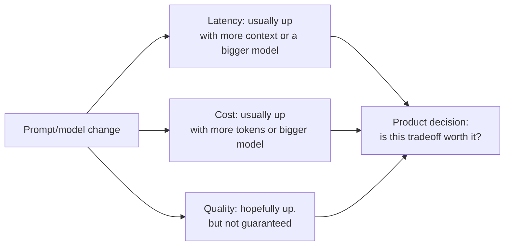
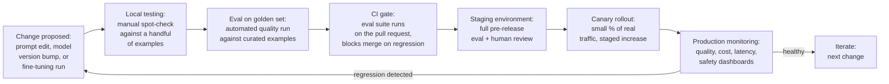

# LLMOps Overview

## Overview

LLMOps is what MLOps becomes once the artifact you deploy most often is not a trained model but a piece of natural-language text, and once "correctness" stops being a binary you can assert in a unit test. Every practice in this section — versioning, canary rollout, CI gating, fine-tuning, incident response, freshness — is a response to those two facts. This chapter is the map: what carries over from MLOps unchanged, what is genuinely new, and how the pieces fit into one lifecycle that every change to a production AI system flows through.

## What MLOps Got Right

Teams arriving at LLMOps from an MLOps background are not starting from zero. The foundational disciplines transfer directly, because they were never really about models — they were about managing change safely in a system whose behavior can't be fully verified by reading the diff.

- **Version control for every artifact.** Code, training data, model weights — all versioned, all attributable to a commit and an author. This need doesn't go away with LLMs; it grows, because the artifact list grows (prompts, eval sets, fine-tuning datasets, retrieval corpora all join the list — see [Prompt & Model Versioning](02-prompt-and-model-versioning.md)).
- **CI pipelines that block on failure.** The instinct that a pull request shouldn't merge if it breaks something is exactly right. What changes is what "breaks" means — see below.
- **Staging before production.** A change proves itself somewhere that isn't the production traffic path before it ever touches it.
- **Monitoring dashboards.** Some system has to be watching the thing in production, continuously, so a regression is caught by a dashboard and not by a customer.
- **Rollback capability.** Every deploy has to have a fast, tested way to become un-deployed.

None of this is optional in LLMOps. It's the floor. What's added on top is the part that doesn't have a precedent in either traditional software engineering or classical MLOps.

## What Is Genuinely New

Six properties of LLM-based systems have no clean analogue in prior practice, and each one forces a design decision that shows up repeatedly in the rest of this section.

### 1. The Prompt Is a First-Class Deployable Artifact

A prompt is not code — it has no compiler, no type checker, no unit test that can assert it's correct. A prompt is not a model — it has no weights, no training run, no loss curve. It is a third thing: a piece of natural-language configuration that materially determines system behavior, changes independently of both the codebase and the model, and needs its own versioning, review, testing, and deployment workflow. Neither a software CI/CD pipeline nor a traditional MLOps model registry was built with this artifact in mind — that gap is the entire subject of [Prompt & Model Versioning](02-prompt-and-model-versioning.md).

### 2. Behavior Changes Without Code Changes

A model provider silently updates the model sitting behind a stable API version string. Yesterday's prompt, run against today's model, produces different outputs — not because anyone deployed anything, but because the thing on the other end of the API call changed. There is no software analogue: a function you call at a stable version number does not spontaneously start returning different results. This is why LLM systems need **behavioral monitoring** — a system of fixed prompts with expected structural output run on a schedule, purely to catch drift that no deployment log will ever show (see [Continual Learning and Model Freshness](07-continual-learning-and-model-freshness.md)).

### 3. Quality Is Graded, Not Binary

A response isn't "correct" or "incorrect" the way `assert result == expected` is correct or incorrect. It's more or less helpful, more or less accurate, more or less in the right tone, more or less well-formatted. There's no unit test for "did this response feel right." The CI gate has to become a statistical comparison of quality distributions between two versions, not a pass/fail assertion — a fundamentally different kind of gate, covered in [CI/CD for AI Systems](04-ci-cd-for-ai-systems.md).

### 4. Eval Is Expensive and Probabilistic

Running the eval suite means running LLM inference on hundreds or thousands of examples — slow, metered, and non-deterministic. A 0.5% drop in average quality score might be a real regression, or it might be noise from run-to-run variance. You cannot treat an eval score the way you'd treat a test suite's pass count; you need confidence intervals, not point estimates, before you decide anything shipped a regression.

### 5. Three-Way Tradeoffs With No Single Optimum

Every change to an AI system moves latency, cost, and quality simultaneously, and rarely in the same direction. Lengthening a prompt by 10% might buy 3% more quality at the price of 10% more cost and 8% more latency. There is no objectively correct answer here — it's a product decision, made deliberately, not a bug to be "fixed."

### 6. External Dependencies on Provider APIs

Rate limits, pricing changes, deprecation schedules, silent model updates, and outright provider outages are all outside the team's control, on a timeline the team doesn't set. Software systems calling internal or well-versioned third-party APIs rarely face deprecation on a 6–12 month forced clock or a model update that changes semantics without a version bump. LLMOps requires operational contingencies — pinned model versions, deprecation tracking, fallback providers — that most software deployments never need to think about.

## The LLMOps Lifecycle

A prompt engineering tweak, a model version upgrade, and a fine-tuning run are three very different kinds of work, but they all flow through the same lifecycle before they're allowed to touch production traffic. That shared lifecycle — not any one artifact type — is the actual unit of operational maturity in LLMOps.

The single most important operational metric in a mature LLMOps practice is the **cycle time of this loop** — how long it takes from "we identified a quality problem" to "the fix is live in production." A team with excellent tooling can close that loop in hours; a team relying on manual prompt edits pasted into a config file and deployed by hand can take weeks, and every day in between is a day the regression keeps happening in front of real users. Every chapter in this section is, in one way or another, about shortening that loop without cutting the corners that make it safe to shorten.

## Ownership: Who Reviews a Prompt Change?

In software, code review has a well-understood shape: another engineer reads the diff, checks it does what it claims, and approves or requests changes. Prompt review needs a different, broader set of skills, and teams that don't decide this explicitly tend to discover the gap the hard way.

A prompt change touches three separate judgment calls, and rarely does one person have all three:

- **Domain expertise** — does this prompt actually reflect what the task requires? A support-bot prompt change reviewed only by an engineer with no domain context can pass code review cleanly and still be wrong about the policy it's describing.
- **Eval interpretation** — is the quality metric movement meaningful, or noise? Reading an eval report correctly requires understanding what the golden set does and doesn't cover, and what the judge model's scores do and don't capture.
- **Product judgment** — is the cost/latency/quality tradeoff this change makes the right one for the product? That's not an engineering call in isolation; it's a product call informed by engineering data.

**The dual-approval pattern** that resolves this in practice: engineering reviews the deployment mechanics (is the version schema right, is the eval CI wired up, is the rollback path tested), while a domain expert or product owner reviews the intent and the quality tradeoff (does this prompt say the right thing, is this regression/gain worth it). Neither approval substitutes for the other.

**The failure mode to name explicitly**: prompt changes that ship with no review at all, because "it's just text" — someone edits a string, the app still compiles, nothing in CI objects, and it goes to production. This is precisely backwards: prompts carry more behavioral risk per character changed than most code changes do, because there's no type system catching an error and the "bug" is a subjective quality regression that might not surface for days. If ownership of prompt changes isn't an explicit team decision from day one, it defaults to "whoever touched it last," which is not an ownership model — it's an absence of one.

## The Tooling Landscape

The tools below don't replace the practices in this section — they make the practices tractable at scale. Buying (or standing up) the wrong one for your team's stage is a common early mistake; the "when to choose" column matters more than the feature list.

### Prompt Management and Versioning

| Tool | What it's good at | Choose when |
|---|---|---|
| **LangSmith** | Prompt hub with version tracking, tight integration with LangChain-based apps | Already in the LangChain ecosystem; want prompt history and eval in one product |
| **Langfuse** | Open-source, self-hostable, full prompt + trace + eval stack | Data residency or self-hosting matters; want to avoid vendor lock-in |
| **PromptLayer** | Lightweight, API-first prompt registry | Want the smallest possible integration footprint, minimal opinionation |

### Experiment Tracking and Eval

| Tool | What it's good at | Choose when |
|---|---|---|
| **Weights & Biases** | ML-native experiment tracking, tight integration with fine-tuning runs | Already fine-tuning models and want eval and training metrics in one place |
| **MLflow** | Open-source, flexible, framework-agnostic | Want to avoid vendor dependency; team already runs MLflow for classical ML |
| **Humanloop** | Eval-first, opinionated prompt-and-eval workflow | Want a structured, guided workflow rather than assembling one from primitives |

### LLM Observability and Tracing

| Tool | What it's good at | Choose when |
|---|---|---|
| **LangSmith / Langfuse** | Full trace of prompt → model call → output, linked to eval | Already using either for prompt management — traces come for free |
| **Helicone** | Lightweight proxy-based logging, cost tracking | Want observability with near-zero code change (drop-in proxy) |
| **Arize Phoenix** | Open-source, strong on embedding/drift visualization | Need deep drift analysis on embeddings and input distributions |
| **Datadog LLM Observability** | Unified with existing infra monitoring | Already standardized on Datadog for infra/APM and want one pane of glass |

### Fine-Tuning Infrastructure

| Tool | What it's good at | Choose when |
|---|---|---|
| **together.ai** | Managed fine-tuning, no infra to run | Want to fine-tune without owning GPU infrastructure |
| **Fireworks AI** | Managed fine-tuning + fast serving of the result | Want fine-tuning and serving from the same vendor |
| **Modal** | Serverless GPU, full control over the training script | Want managed infra but full custom training code |
| **Replicate** | Simple API-first fine-tuning and serving for common model families | Want the lowest-friction path for a standard model + LoRA workflow |
| **Self-hosted (vLLM + FSDP/DeepSpeed)** | Full control, no per-token vendor cost at scale | Have GPU capacity and ML infra expertise, and volume to justify it |

### Deployment and Serving

Serving infrastructure — batching, KV cache management, routing across model versions — is covered in [Model Serving Architecture](../15-model-serving/01-model-serving-architecture.md) through [Section 17 — Distributed Inference](../17-distributed-inference/01-tensor-and-pipeline-parallelism.md). This section is concerned with the *lifecycle* around deployment — how a change gets validated and rolled out — not the serving engine itself.

## Interview Questions

### Beginner

**Q: What carries over from MLOps to LLMOps unchanged?**
Version control for every artifact, CI pipelines that block merges on failure, a staging environment before production traffic, monitoring dashboards, and a tested rollback path. These aren't LLM-specific practices — they're general safe-deployment practices that LLM systems still need, just applied to a wider set of artifact types (prompts, eval sets, retrieval corpora, in addition to code and model weights).

**Q: Why can't a prompt change be tested the same way a code change is?**
A prompt has no compiler or type checker to catch a broken change, and there's no `assert response == expected` because LLM output quality is graded, not binary — a response is more or less good, not right or wrong. Testing a prompt change means running it against a golden set and comparing quality score distributions statistically, not asserting an equality.

### Intermediate

**Q: A model provider announces no changes, but your product's quality metrics drift over two weeks with zero code deploys. What's going on and how would you have caught it earlier?**
The most likely cause is the model behind a stable API version was silently updated by the provider — this has no analogue in software, where calling a fixed API version doesn't change behavior. You'd catch it earlier with a behavioral fingerprint test: a small fixed set of prompts with known expected structural outputs, run on a schedule (daily), so a provider-side change shows up as a metric shift on a system nothing internal touched, rather than being discovered from user complaints days or weeks later.

**Q: Why is "the eval score dropped 0.5%" not automatically a regression?**
Eval scores from LLM-as-judge runs carry inherent variance — non-determinism in generation and in the judge's own scoring means the same prompt version run twice can produce different scores. A 0.5% movement could be real or could be noise. You need the eval to report a confidence interval (from multiple runs, or from the judge's own scoring variance), and gate on whether the interval clears a meaningful threshold — not on a bare point-estimate comparison.

### Senior

**Q: Design the ownership model for who can approve a prompt change going to production. What goes wrong if you skip this decision?**
Split review into two lanes that compose, not one blanket "engineering approves" step: engineering reviews the deployment mechanics — is this wired to the correct version schema, is CI eval passing, is there a tested rollback path — and a domain expert or product owner reviews the intent and the quality/cost/latency tradeoff — does this prompt correctly reflect the task, and is the tradeoff the eval shows actually worth it for the product. Skipping this and letting "it's just text" changes ship without review is the single most common way teams end up with an unreviewed regression in production, because nothing in a standard code-review process is equipped to judge whether a prompt is behaviorally right.

**Q: Your team's cycle time from "quality regression identified" to "fix live in production" is currently two weeks. What's the highest-leverage thing to fix first?**
Find where the loop actually stalls before assuming it's the training or fine-tuning step — for most teams it's earlier: golden set eval that requires manual triggering, a staging environment that isn't automatically populated, or a canary rollout with no automated rollback trigger, all of which turn a five-minute fix into a week of manual coordination. Instrument the lifecycle stages themselves (time in each stage: local test, CI gate, staging, canary) before optimizing any one of them — the highest-leverage fix is almost always removing a manual handoff, not making eval or training faster.

### Staff

**Q: A new VP wants to know why the AI team's release cadence is slower than the rest of engineering's. How do you explain the difference without it sounding like an excuse?**
Frame it around the two genuinely new constraints, not around "AI is hard": every release has to clear a statistical quality gate that takes real inference time and money to compute (unlike a deterministic test suite that runs in seconds), and every release risks a three-way tradeoff between latency, cost, and quality that has no single correct answer and sometimes needs a product decision, not just an engineering sign-off. The fix isn't accepting a slower cadence forever — it's investing in exactly the things that shrink the lifecycle loop (fast PR-gate golden sets, automated canary rollback triggers, pre-approved tradeoff thresholds) so the statistical rigor stays but the manual coordination that's actually causing the slowness goes away.

## Google-Level Follow-Ups

**"You said quality is graded, not binary. Does that mean you can never have a hard gate — everything's a judgment call?"**
Probes whether the candidate conflates "graded" with "unmeasurable." A strong answer explains you can still have a hard, automated gate — it's just a statistical threshold (e.g., `new_score < baseline - threshold` with a confidence interval) rather than an equality assertion, and that threshold calibration itself is an engineering discipline, not a surrender to subjectivity.

**"If a model provider can silently change behavior behind a stable API version, why would any team choose to run on a floating alias instead of a pinned version?"**
Probes whether the candidate understands the real tradeoff: floating aliases get security/quality improvements automatically with zero effort, at the cost of losing control over when behavior changes; pinned versions trade that convenience for predictability and force a deliberate upgrade workflow. A good answer says most production teams should pin, and explains why (see [Prompt & Model Versioning](02-prompt-and-model-versioning.md)) rather than treating one as universally correct.

**"Walk me through the lifecycle diagram, but for a fine-tuning run instead of a prompt edit — where does it differ, and where is it identical?"**
Probes whether the candidate sees the lifecycle as a genuine invariant across artifact types, not a diagram specific to prompts. The honest answer: identical from "eval on golden set" onward; the difference is entirely upstream, in what "local testing" and "the change" mean (a training job and checkpoint selection, versus editing text) — see [The Fine-Tuning Engineering Pipeline](05-the-fine-tuning-pipeline.md).

**"Your team has excellent CI gating on prompts but no behavioral monitoring in production. What specific class of incident are you still exposed to?"**
Probes whether the candidate connects the "behavioral changes without code changes" property directly to a monitoring gap — a silent provider-side model update, which by definition triggers no CI run (nothing in your repo changed) and would only be caught by production behavioral fingerprinting, not by pre-deploy testing.

## Common Mistakes

- **Treating prompt changes as too trivial to review.** "It's just text" is exactly the reasoning that lets an unreviewed regression reach production — prompts carry real behavioral risk with none of a type system's safety net.
- **Running on floating model aliases in production.** `claude-latest`-style aliases mean your system's behavior can change with zero warning and zero deploy — see [Prompt & Model Versioning](02-prompt-and-model-versioning.md) for the pinning discipline.
- **Gating quality on a bare point estimate.** A single eval run's score is noisy; gating on it without a confidence interval produces both false-positive blocks and false-negative merges.
- **Copying a software CI/CD pipeline wholesale and assuming it covers AI quality.** Unit and integration tests catch code bugs; they say nothing about whether a prompt change made responses worse — that requires a dedicated eval layer (see [CI/CD for AI Systems](04-ci-cd-for-ai-systems.md)).
- **No behavioral monitoring for provider-side model drift.** Without a scheduled fingerprint test, a silent model update is invisible until users notice and complain.
- **Optimizing one leg of the latency/cost/quality triangle without tracking the other two.** A quality-motivated change that quietly doubles cost per request is a product decision made by accident, not on purpose.

## Key Takeaways

- MLOps fundamentals — versioning, CI gating, staging, monitoring, rollback — all transfer to LLMOps directly; they're the floor, not the whole practice.
- Six properties are genuinely new: the prompt as a deployable artifact, provider-side behavioral drift with no code change, graded (not binary) quality, expensive and probabilistic eval, three-way latency/cost/quality tradeoffs, and external dependency on provider release cycles.
- Every change — prompt edit, model version bump, fine-tuning run — flows through the same lifecycle: local test → golden-set eval → CI gate → staging → canary → production monitoring → iterate.
- The cycle time of that lifecycle loop, from identifying a regression to shipping the fix, is the single most important operational metric for a mature LLMOps practice.
- Prompt change ownership must be an explicit team decision — the dual-approval pattern (engineering on mechanics, domain expert on intent/quality) is the practical resolution; "it's just text, no review needed" is the default failure mode when it isn't decided.
- The tooling landscape maps cleanly onto four categories — prompt management, experiment/eval tracking, observability, fine-tuning infrastructure — and the right choice in each depends on team stage and existing stack, not on picking the "best" tool in isolation.

---

*Part of [LLMOps](index.md) in the [AI System Design Notes](../index.md). Next: [Prompt & Model Versioning](02-prompt-and-model-versioning.md).*
