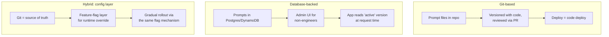
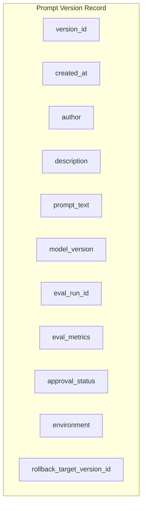
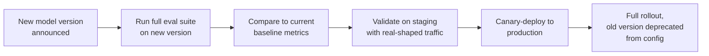
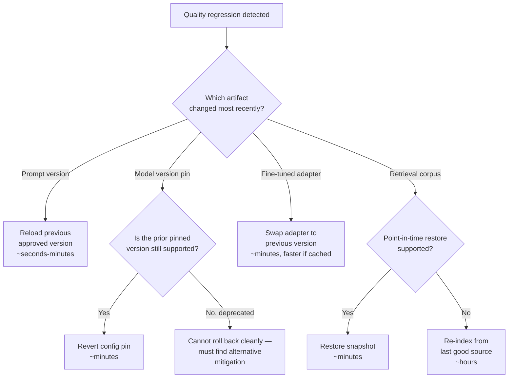
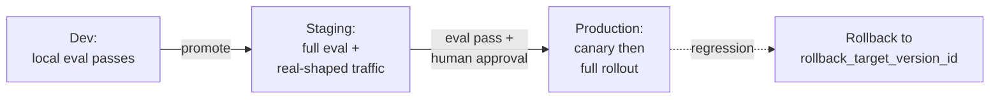

# Prompt & Model Versioning

## Overview

A prompt that isn't versioned isn't really deployed — it's just floating. This chapter is about treating prompts and model versions with the same rigor a software release gets: a unique identifier, a history of who changed what and why, a link to the evidence that justified promoting it, and a tested path back to the previous version when it doesn't work out. None of this is exotic engineering — it's the same discipline `git` and a release process already give you for code, applied to an artifact that most teams still manage informally.

## Why Naive Prompt Management Fails at Production Scale

Prompts stored as inline strings, environment variables, or hardcoded literals in application code work fine for a demo and quietly become a production liability as soon as more than one person touches them and more than one version has ever shipped.

- **No history of what changed and why.** A prompt sitting in a source file has a git blame, at best — a diff with no structured field for "why did we make this change," which means six months later nobody can reconstruct the reasoning behind the current wording.
- **No link between the production prompt and the eval that justified it.** Without an explicit pointer from "this is the prompt in prod" to "this is the eval run that proved it was good enough," you cannot answer "what quality score did we accept when we shipped this?" — a question that comes up in nearly every quality incident post-mortem.
- **No rollback path when a change regresses.** If the previous version was overwritten rather than versioned, "roll back" means manually reconstructing the old wording from memory or git history under incident pressure — the worst possible time to be doing archaeology.
- **No way to safely deploy to a subset of users.** A prompt baked into application code ships to 100% of traffic the moment the code deploys. There's no way to canary it, because there's no runtime concept of "which prompt version is this request using" — the deploy and the prompt change are the same atomic event.

Each of these is a concrete production scenario, not a hypothetical: a support-bot prompt is edited directly in a Python string, ships with the next code release to all users, and two days later someone notices response quality dropped — but nobody can say what the previous wording was, whether it was ever eval'd, or how to get back to it without redeploying an old code commit that also reverts unrelated changes.

## Prompt Versioning Strategies

There are three broad approaches in production use, and the right one depends on team maturity and how often prompts actually change relative to code.

### Git-Based

Prompts live as text files in the repository, versioned alongside code. Simple, and it leverages tooling you already have — code review, PR history, CI. The deployment of a new prompt version is tied to a code deployment.

**Limitation**: prompts and code change on different cadences. A prompt tweak to fix a quality issue discovered this afternoon shouldn't have to wait for the next full code release cycle, and bundling an unrelated prompt fix into a code deploy means the two changes can't be rolled back independently.

**Best for**: early-stage teams, prompts that change rarely, teams where the people writing prompts are also the engineers deploying code.

### Database-Backed With a Management UI

Prompts live in a database (PostgreSQL, DynamoDB) with version numbers, and a lightweight admin UI lets non-engineers edit and promote prompts without touching code. The application loads the "active" version for a given environment at runtime.

**Limitation**: requires building or buying the management UI, and adds a database read to every request path (mitigated with caching, but it's a new dependency in the hot path that a git-based approach never has).

**Best for**: mature teams where product managers or domain experts own prompt content directly, and systems where prompt iteration speed genuinely matters more than deployment simplicity.

### Hybrid: Config Layer With Runtime Overrides

Prompts live in git as the source of truth — full history, code review, auditability — but a config/feature-flag layer (LaunchDarkly, an internal flag system) allows a runtime override without a code deploy. A new prompt version is tested first via a flag override in staging, then gradually rolled out through the same flag mechanism.

**Best for**: most production teams. This combines git's auditability with the deployment flexibility of runtime config, and it's the pattern that makes canary rollout of a prompt change (see [Deployment Strategies: Canary & Shadow](03-deployment-strategies-canary-shadow.md)) possible without decoupling the prompt entirely from version control.

| Strategy | Auditability | Deploy speed | Non-engineer editable | Operational overhead |
|---|---|---|---|---|
| Git-based | High (native) | Tied to code deploy cadence | No | Low |
| Database-backed | Medium (needs its own audit log) | Fast, independent of code | Yes | Medium — own the UI + DB read path |
| Hybrid | High (git) + fast override | Fast, independent of code | Partial (via flag values) | Medium — own the flag integration |

## The Prompt Version Schema

Whatever storage mechanism you choose, every prompt version needs to carry the same metadata, because each field answers a question you will be asked during an incident.

| Field | Why it exists |
|---|---|
| `version_id` | Unique identifier — the handle every other system (config, logs, eval) points at |
| `created_at` | Timestamp — needed to correlate a metric shift with a version change |
| `author` | Who changed it — the first person to ask when investigating a regression |
| `description` | The "commit message" for the prompt — what changed and why, in plain language |
| `prompt_text` | The actual template with variable placeholders — the artifact itself |
| `model_version` | Which model version this was designed for — a prompt tuned against one model's quirks may not transfer to a future model unchanged |
| `eval_run_id` | Pointer to the eval run that validated this version — the evidence trail |
| `eval_metrics` | The actual scores from that run — average quality, distribution, regression rate by category, latency, cost |
| `approval_status` | draft / approved / deprecated — where this version is in its lifecycle |
| `environment` | dev / staging / production — which environment this version is currently active in |
| `rollback_target_version_id` | Which version to revert to if this one regresses — decided *before* it's needed, not during an incident |

The `eval_run_id` and `eval_metrics` fields are what separate a versioning system from a mere file history — they're what let you answer, six months from now, "what was the eval score when this was promoted to production?" without needing to have kept that context in anyone's memory.

## Model Version Pinning

Calling a floating alias like `claude-latest` means your application's behavior changes every time the provider updates the model behind that alias, without your team ever running a deploy or reviewing a diff. This is precisely the "behavioral changes without code changes" property from [LLMOps Overview](01-llmops-overview.md), and pinning is the direct mitigation.

**The version lifecycle**: every model version has an announced deprecation date, typically 6–12 months after release. A pinned version doesn't pin forever — it pins *deliberately*, with a known clock running.

**The upgrade workflow**, before moving off a pinned version:

**The failure mode to name explicitly**: a team running on floating aliases discovers a model update caused a quality regression only weeks after it happened, because nothing in their system distinguishes "we changed something" from "the provider changed something." Pinning converts an invisible, undated change into a visible, dated, reviewable upgrade decision.

## Linking Versions to Eval Results

Every version promoted to production — prompt or model — must carry an eval run that justified the promotion. This is a **promotion gate**, not a suggestion: the CI system should mechanically block promotion of a version that has no passing, linked eval run, the same way a software CI system blocks a merge with a failing test.

What travels with the version isn't a bare pass/fail — it's the full result set: average quality score, the score *distribution* (not just the mean — two versions with the same average can have very different tail behavior), regression rate broken down by golden-set category, latency p50/p99, and cost per request. A pass/fail alone can't answer "did this regress specifically on the multi-turn conversation category" — the full metrics can.

The auditability requirement this produces: **six months from now, when investigating a quality regression, you must be able to answer "what was the eval score when this prompt version was promoted?"** without relying on anyone's memory. If that question can't be answered from the version record alone, the versioning system isn't doing its job yet.

## Rollback Strategy Per Artifact Type

Different artifact types roll back at different speeds and through different mechanisms — knowing which one you're rolling back, and how long it will actually take, matters during an incident when every minute counts.

| Artifact | Rollback mechanism | Typical latency |
|---|---|---|
| Prompt version | Reload the previous approved version from the version store | Seconds to minutes, depending on caching — no model changes required |
| Model version pin | Update the pin in config/code from the new version to the prior one | Minutes — config update + deploy or runtime reload |
| Fine-tuned adapter | Swap the LoRA adapter loaded in serving back to the previous version | Minutes — adapter file swap; near-instant if the serving system caches it |
| Retrieval corpus snapshot | Roll back to the last known-good snapshot | Minutes if the vector DB supports point-in-time restore; hours if full re-indexing is required |

**Model version rollback risk**: the version you're rolling back *to* must still be within its provider support window. If the prior pinned version has already passed its deprecation date and been removed by the provider, "roll back to the old model" isn't actually available — a reason to track deprecation dates for every pinned version you might ever need to fall back to, not just the one currently live.

## Environment Promotion and Config Management

Prompts and model versions must flow through dev → staging → production the same way code does, with the same principle: each environment can be running a different active version, and promotion between them is gated, not automatic.

- **Environment-specific active versions**: staging may be running a prompt version that's still under evaluation while production runs the last approved one. This is the entire point of having separate environments — it lets a change prove itself somewhere that isn't customer-facing.
- **Promotion gates at each boundary**: pass local eval to promote dev → staging; pass staging eval *and* human approval to promote staging → production. Skipping the human approval step for production promotion is how "it's just text" changes end up live without review (see [LLMOps Overview](01-llmops-overview.md)).
- **Configuration management and the classic failure mode**: a staging prompt version accidentally deployed to production, usually because the environment tag on a config record was wrong or a deploy script pointed at the wrong config store. Guard against this with environment-scoped config namespaces that make cross-environment deployment structurally awkward — not just a naming convention that a copy-paste error can silently violate.

## Interview Questions

### Beginner

**Q: Why isn't storing a prompt as a hardcoded string in application code good enough?**
It ties every prompt change to a full code deployment, gives you no structured history of why the prompt changed (just a code diff), no link to whatever eval justified the change, and no way to roll back a bad prompt independently of the surrounding code. It also means you can't safely test the change on a subset of traffic — a code deploy ships to everyone at once.

**Q: What's the difference between a prompt version's `eval_run_id` and its `eval_metrics` field?**
`eval_run_id` is a pointer to the eval run — an identifier you can use to go look up the full run details later. `eval_metrics` is a snapshot of the actual scores from that run stored directly on the version record — average quality, distribution, per-category regression rate, latency, cost — so you don't have to go re-fetch the eval run just to answer "was this version good enough to ship" months later, even if the original eval system's data has since been archived or deleted.

### Intermediate

**Q: Compare git-based and database-backed prompt versioning. When would you pick each?**
Git-based versioning reuses existing code review and CI tooling and gives strong auditability for free, but it ties every prompt change to a full code deployment cycle — a mismatch when prompts need to change faster than code does. Database-backed versioning with an admin UI decouples prompt iteration from code deploys and lets non-engineers (domain experts, PMs) edit prompts directly, at the cost of building or buying that UI and adding a database read to the request path. Pick git-based for early-stage teams or prompts that change rarely; pick database-backed once prompt iteration speed and non-engineer ownership genuinely matter more than deployment simplicity.

**Q: Why is pinning a model version to an exact string instead of an alias considered a versioning practice, not just an API detail?**
Because it converts an otherwise invisible change — the provider silently updating the model behind a floating alias — into a deliberate, dated, reviewable event. Without pinning, "behavior changed" and "we changed something" become indistinguishable, which breaks the entire premise of versioning: that you can attribute a behavior change to a specific, identified, evaluated version.

### Senior

**Q: Design the rollback path for a fine-tuned adapter that just regressed quality in production, including the failure mode where the previous adapter version is no longer readily available.**
The primary path is a fast adapter swap: the serving layer keeps recent adapter versions warm or at least on fast storage, so reverting is a load/swap operation measured in minutes, near-instant if the previous version is still in the serving cache. The failure mode to design against explicitly is treating "keep the last adapter around" as automatic — adapter artifacts get garbage-collected or overwritten if there's no retention policy tying adapter version history to the same rollback discipline prompts get. The fix is the same principle as model version pinning: every deployed adapter version has a `rollback_target_version_id`, and the artifact store has an explicit retention policy that guarantees the rollback target is actually still there when you need it, not just assumed to be.

**Q: A staging prompt version somehow ends up active in production. Walk through how your config management should have prevented this, and how you'd detect it fast if it happens anyway.**
Prevention: environment should be a structural property of how a version is addressed — a production service reading its active prompt version should be physically incapable of reading from a staging-scoped config path, not just relying on a `environment: production` field that a deploy script could set incorrectly. Detection: a lightweight reconciliation check that compares the `environment` field on the currently-active version record against the environment the serving fleet believes it's running in, alerting on any mismatch — plus behavioral monitoring (from [LLMOps Overview](01-llmops-overview.md)) that would catch the resulting quality shift even if the config mismatch itself went unnoticed.

### Staff

**Q: You're designing the versioning system for a company with 40 prompts across 12 product surfaces, each with different release cadences and different owners. What single design decision matters most?**
The hybrid pattern — git as source of truth, runtime config layer for rollout — matters most here specifically because of the cadence mismatch across 12 surfaces: some prompts need weekly PM-driven iteration, others change once a quarter and are engineer-owned, and forcing all 40 through one storage strategy under-serves at least half of them. The design decision that actually matters is making the *promotion gate* — eval pass plus the right approver for that surface — a property of the pipeline, not of the storage mechanism, so ownership and cadence can vary per prompt without needing 12 different versioning systems.

## Google-Level Follow-Ups

**"If eval_metrics are stored directly on the prompt version record, what happens when your eval methodology itself changes six months later — are old scores still comparable to new ones?"**
Probes whether the candidate recognizes that eval_metrics need to be tagged with the eval methodology/golden-set version that produced them, not treated as an absolute, comparable-forever number — the auditability requirement is "what did we believe at the time," not "how would this score under today's eval."

**"Your hybrid versioning approach uses a feature flag to override the git-sourced prompt at runtime. What happens if someone edits the flag value directly without going through the git-based review process?"**
Probes whether the candidate has thought through the actual attack surface of the hybrid pattern — the flag layer is a bypass of the auditability git gives you unless the flag system itself enforces that only reviewed, versioned prompt content can be pushed into it, not arbitrary text.

**"Why does the rollback_target_version_id need to be decided in advance rather than computed at rollback time?"**
Probes whether the candidate sees that "just roll back to whatever was there before" is ambiguous and slow to determine under incident pressure — if three versions shipped in the last day, "before" is not well-defined without an explicit target recorded per promotion, and computing it live during an incident costs time you don't have.

## Common Mistakes

- **Storing prompts as hardcoded strings or environment variables with no version history.** This is the exact failure mode this chapter exists to prevent — no auditability, no rollback, no eval linkage.
- **Running production traffic on a floating model alias instead of a pinned version.** Invisible provider-side behavior changes become indistinguishable from your own bugs.
- **Promoting a version to production with no linked eval run.** "It looked fine when I tried it" is not an audit trail six months later.
- **Treating eval_metrics as a pass/fail flag instead of storing the full distribution and per-category breakdown.** A single averaged number hides exactly the regressions — on a specific category or in the tail — that matter most.
- **Assuming the rollback target is always "whatever was live before" without recording it explicitly.** Under incident pressure, reconstructing "before" from logs costs minutes you don't have.
- **No environment-scoped structural separation between staging and production config.** A naming convention alone doesn't stop a copy-paste or deploy-script error from pushing a staging prompt into production.

## Key Takeaways

- Prompts are a distinct artifact type from code and from trained models, and need their own versioning discipline — a version schema with `version_id`, `author`, `description`, `eval_run_id`, `eval_metrics`, `approval_status`, `environment`, and `rollback_target_version_id` is the minimum viable record.
- Three versioning strategies — git-based, database-backed, and hybrid — trade off auditability, deploy speed, and non-engineer editability differently; most mature production teams land on the hybrid pattern.
- Model version pinning converts an invisible provider-side behavior change into a deliberate, dated, reviewable upgrade event — running on floating aliases is the single most common way teams get blindsided by drift.
- Every version promoted to production must be gated on a linked eval run with full metrics, not a bare pass/fail — this is what makes "what did we know when we shipped this" answerable months later.
- Each artifact type — prompt, model pin, fine-tuned adapter, retrieval corpus — has its own rollback mechanism and latency, and the model-pin rollback path has a unique risk: the target version might already be past its provider deprecation date.
- Environment promotion needs structural gates (eval pass + human approval at the staging→production boundary), not just a naming convention — a config record with the wrong environment tag is an easy, costly mistake to make without one.

---

*Part of [LLMOps](index.md) in the [AI System Design Notes](../index.md). Previous: [LLMOps Overview](01-llmops-overview.md). Next: [Deployment Strategies: Canary & Shadow](03-deployment-strategies-canary-shadow.md).*
