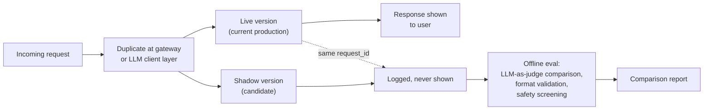
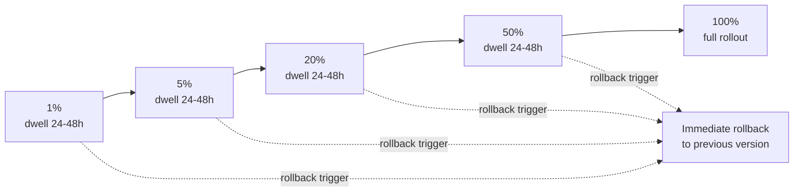
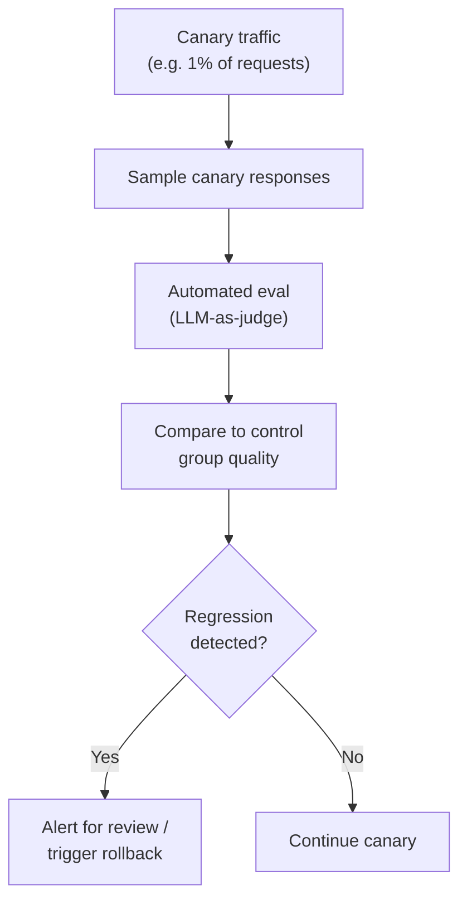
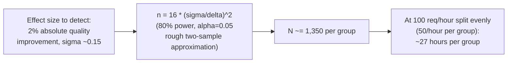
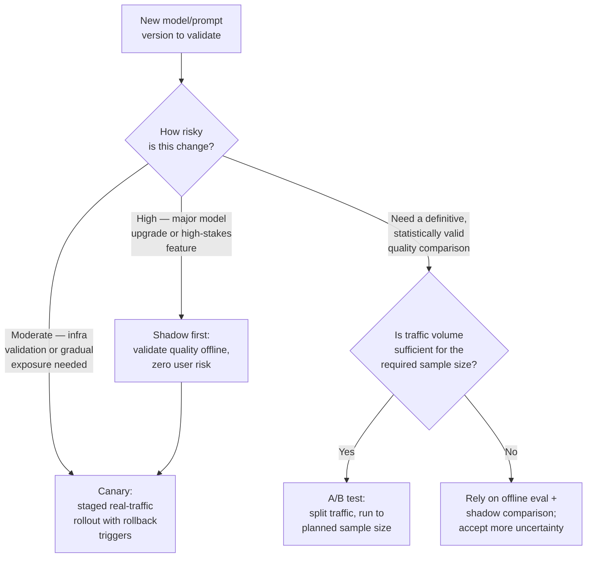

# Deployment Strategies: Canary & Shadow

## Overview

Shadow deployment, canary rollout, and A/B testing answer three different questions, and a common mistake is picking one and expecting it to answer all three. Shadow answers "does the new version behave acceptably, with zero user risk?" Canary answers "does the new version survive contact with real infrastructure and real users, at increasing scale, with a fast way out if it doesn't?" A/B answers "is the new version *statistically* better, definitively, for the purpose of making a permanent decision?" This chapter covers the mechanics of each, and — because AI quality is graded rather than binary — the added statistical machinery each one needs that a software-only deployment never did.

## Shadow Deployment (Traffic Mirroring)

The new version receives a copy of real production traffic; its responses are logged and evaluated offline but never shown to a user. Zero user-facing risk, because nothing the shadow version produces reaches anyone.

**Implementation**: duplicate incoming requests at the API gateway or the LLM client layer. Send to both the current (live) version and the shadow version simultaneously, tagging both responses with the same request ID so they can be joined for comparison later. Run automated eval on the shadow responses — LLM-as-judge comparison against the live response, output format validation, and safety screening — entirely offline, on its own schedule.

**Use cases**: validating a new model version — especially a major upgrade where behavioral changes are expected and you want to see the shape of the difference before committing; evaluating a prompt change on a high-stakes product feature where even a small percentage of bad live responses is unacceptable; testing a new retrieval corpus before cutting production over to it.

**Cost**: shadow deployment exactly doubles inference cost on shadowed traffic, plus the eval cost on top of that. This is why teams typically shadow 5–10% of traffic, not 100% — full-traffic shadowing costs as much as running two full production fleets while one of them serves nobody.

**The comparison report** is the actual output of a shadow run:

| Metric | What it tells you |
|---|---|
| Quality score distribution (live vs. shadow) | Whether the candidate is meaningfully better, worse, or indistinguishable |
| Disagreement rate | How often the two versions give meaningfully different answers — a high rate on an otherwise-similar quality score means the two are diverging in *kind*, not just in average quality |
| Format compliance rate | Whether the candidate breaks any downstream parsing expectations |
| Safety flag rate | Whether the candidate trips the safety classifier more or less often |
| Cost differential | Per-request cost delta |
| TTFT differential | Latency delta — relevant even though shadow responses are never shown, because it forecasts what canary/production TTFT will look like |

**Limitations — what shadow can and cannot validate**: shadow results reflect the *current* input distribution faithfully, but they can't expose issues that only emerge under specific interaction patterns the shadowed single-turn mirroring doesn't reproduce — multi-turn conversation state, or a tool-call sequence where the shadow version's first response would have changed what the user says next. A shadow run tells you the candidate is safe on today's inputs in isolation; it doesn't tell you what happens once real users start reacting to the candidate's own outputs, which only canary or A/B can show.

## Canary Rollout

Canary routes a small percentage of *real* traffic to the new version — unlike shadow, users in the canary group see actual responses from the candidate, and canary is how you find out whether the candidate survives contact with production at all, gradually, with a defined way to stop.

**Traffic routing implementation**: percentage-based routing at the gateway or LLM client layer, with two properties that matter specifically for AI systems:

- **User-sticky routing** — a given user stays on the same version for the duration of the canary period. Without this, a user in a multi-turn conversation could get routed to version A on turn one and version B on turn three, producing an inconsistent, confusing experience that has nothing to do with either version's actual quality.
- **Feature-flag-based routing** — using an existing flag system to control the canary percentage per segment, so canary exposure can be scoped (e.g., internal users first, then a specific geography) rather than uniformly random from turn one.

**Canary stages**, with dwell time at each:

The dwell time — typically 24–48 hours per stage — exists to accumulate enough signal *at that traffic percentage* to be statistically confident before moving on; skipping it means moving to the next stage on vibes rather than evidence.

**Rollback triggers**, defined before the canary starts, not improvised during it:

- **Hard triggers** — automatic, immediate rollback with no human in the loop: error rate more than 2× baseline, latency p99 outside SLA, safety flag rate above threshold.
- **Soft triggers** — alert for human review before any rollback action: quality score below `baseline − threshold`, cost above `budget + N%`.
- **The failure mode to name explicitly**: a canary deployed with no pre-defined rollback triggers runs indefinitely while a regression slowly accumulates, because nobody decided in advance what "bad enough to stop" means, and by the time someone notices informally, the canary may already be at 50% or 100% of traffic.

## AI-Specific Monitoring During Canary

A software canary watches error rates and latency. An AI canary has to watch those *plus* quality, and quality is the harder signal to get right at low canary percentages.

**The statistical challenge**: at 1% canary on a system doing 1,000 requests/hour, that's 10 canary requests per hour — nowhere near enough to distinguish a real quality regression from ordinary score variance. Infrastructure metrics (error rate, latency) don't have this problem because they're low-variance and high-volume by nature; a graded quality score, sampled at 1% of a modest-traffic system, is not.

**How to handle it in practice**: run shadow mode first, at a much higher effective sample size, to validate quality *offline* before the canary ever starts — then use the canary primarily to catch infrastructure and real-user-interaction issues shadow can't see (see shadow's limitations above), not as the first place you're discovering whether quality regressed at all. By the time a change reaches canary, its quality profile should already be understood from shadow; canary is confirmation under real load, not first-line quality discovery.

## A/B Testing for AI Quality

A/B testing deliberately splits traffic between two versions for long enough to draw a statistically valid conclusion about which is better — as opposed to canary's goal of gradually and safely increasing exposure.

**Experiment design**:

- **Random user assignment** — hash the user ID to a stable bucket for the duration of the experiment, so the same user always lands in the same arm.
- **Minimum experiment duration** — determined by expected effect size and traffic volume (see the sample-size math below), not a fixed calendar convention like "run it for a week."
- **Holdout group** — a slice of users in neither arm, used less often for single-experiment quality comparisons and more to measure the aggregate effect of *all* experiments running simultaneously, since running many concurrent A/B tests can accumulate hidden interaction effects that no single experiment's analysis would catch.

**Quality metrics as the outcome variable**: the primary outcome is a quality score — an LLM-as-judge score, a task success rate, a user satisfaction rating. This is harder than a typical product A/B test metric like conversion rate, because quality scores are continuous with real variance rather than a binary conversion event, which directly affects the sample size needed (below). Secondary metrics worth tracking alongside quality: cost per request, TTFT, error rate, and user engagement signals — a "quality win" that quietly triples cost per request is a different decision than a clean quality win at equal cost.

### Statistical Power and Sample Size

For an LLM-as-judge quality score with a typical standard deviation σ ≈ 0.15, detecting a 2% absolute quality improvement (effect size d ≈ 0.13) at 80% power and α = 0.05 requires roughly **N ≈ 1,350 samples per group**.

At 100 requests/hour split evenly between the two arms (50/hour per group), reaching 1,350 samples per group takes roughly 27 hours. For a low-traffic product, that arithmetic gets much worse fast — a product doing 10 requests/hour split evenly needs over a week per group just to detect a 2% shift, and detecting a smaller effect (1% instead of 2%) roughly quadruples the required sample size, since required N scales with `(σ/δ)²`.

**What this means in practice for low-traffic products**: rely primarily on offline eval (which isn't traffic-constrained the same way) rather than trying to force a production A/B test to statistical significance; accept higher uncertainty in production comparisons and lean on qualitative signals and shadow-mode comparisons instead; or use stratified sampling to prioritize the traffic segments that matter most, concentrating limited sample size where it's most valuable rather than splitting it uniformly across a broad, low-signal population.

### Interaction Effects and Segmentation

A prompt change may help power users and hurt new users, or help one language and do nothing for another. Segment-level analysis surfaces this — but testing many segments inflates the false-positive rate (the **multiple comparisons problem**): if you slice the same experiment 20 different ways, roughly one of those slices will look statistically significant by chance alone at α = 0.05, even if nothing real is happening in any of them.

**How to handle it**: apply a correction (Bonferroni, or a less conservative alternative like Benjamini-Hochberg) when testing multiple segments, or — the more robust approach — pre-specify which segments you actually care about *before* running the experiment, rather than mining the results afterward for whichever slice happened to look good. Segment-level analysis is meaningful when the segment was hypothesized in advance for a real product reason (power users, a specific language, a specific use case); it's overfitting to noise when it's discovered by scanning dozens of post-hoc slices looking for one that crossed a significance threshold.

## Choosing Between Shadow, Canary, and A/B

In practice these compose, not compete: shadow first for anything high-risk to validate quality with zero exposure, canary next to validate infrastructure behavior and gradually increase real exposure with an automatic way out, and A/B reserved for the specific case where you need a definitive, statistically defensible answer to "which version is actually better" — typically for a decision significant enough to justify the traffic and time cost of running it properly.

## Interview Questions

### Beginner

**Q: What's the fundamental difference between shadow deployment and canary rollout?**
In shadow deployment, the new version's responses are computed on real traffic but never shown to users — they're logged and evaluated offline, so there's zero user-facing risk. In canary rollout, a percentage of real users actually see the new version's live responses, so it carries real (but small and controlled) user risk in exchange for validating how the system behaves under real production conditions, including real user reactions.

**Q: Why does shadow deployment cost roughly double the normal inference cost for shadowed traffic?**
Because every shadowed request is run through both the live version and the shadow version — you're paying for two full inference calls per request instead of one, plus the additional cost of running offline eval on the shadow responses. This is why teams shadow a fraction of traffic (5–10%), not all of it.

### Intermediate

**Q: Why is a hard latency-based rollback trigger not sufficient on its own for an AI canary?**
Because AI quality can regress with infrastructure metrics looking completely healthy — error rate, latency, and throughput can all be fine while the model is simply producing worse answers. A hard trigger on latency/error rate catches infra problems but says nothing about quality, which needs its own monitoring pipeline (sampling canary responses, running automated eval, comparing to the control group) and its own trigger.

**Q: A team runs a canary at 1% traffic on a system doing 500 requests/hour and concludes after 2 hours that quality is unchanged. What's wrong with that conclusion?**
At 1% of 500 requests/hour, that's about 5 canary requests per hour, or roughly 10 samples after 2 hours — nowhere near enough to detect anything but a very large quality shift, given the typical variance of an LLM-as-judge score. A "no regression detected" conclusion from that sample size is much more likely to reflect insufficient statistical power than genuine quality parity; the team should have validated quality via shadow mode (at a much larger effective sample) before treating the canary's quality signal as meaningful, and used the canary primarily to check infrastructure behavior instead.

### Senior

**Q: Design the rollback trigger policy for a canary rolling out a new model version, distinguishing hard and soft triggers.**
Hard triggers should be automatic and immediate, requiring no human judgment call under time pressure: error rate exceeding 2× the pre-canary baseline, p99 latency breaching the existing SLA, or safety flag rate crossing an absolute threshold — these are conditions where waiting for a human to review costs real harm and the correct action is unambiguous. Soft triggers should alert a human for review rather than auto-rollback: quality score dropping below `baseline - threshold` or cost exceeding `budget + N%`, because both require judgment — a quality dip might be real or might be sampling noise at low canary percentages, and a cost increase might be an acceptable tradeoff for a quality gain the team already decided was worth it. The design principle: automate the triggers where the correct response is unambiguous and speed matters most; route to a human where the response requires weighing a tradeoff.

**Q: Your company wants to run five prompt A/B tests simultaneously on the same product surface. What statistical risk does this introduce, and how do you mitigate it?**
Running many concurrent experiments on overlapping traffic creates two risks: the standard multiple-comparisons problem within each experiment's own segment analysis, and a subtler interaction-effect risk across experiments — user experience in experiment A might be shifted by which arm of experiment B the same user happens to be in, muddying both results. Mitigate with a holdout group that sees none of the concurrent experiments (to measure the aggregate effect of everything running at once), pre-registering which segments each experiment will analyze rather than scanning post-hoc, and applying a multiple-comparisons correction to segment-level significance claims within any single experiment.

### Staff

**Q: A staff engineer proposes skipping shadow mode entirely and going straight to a 1% canary for every prompt change, arguing it's simpler to maintain one pipeline. What's the case against this, and when would you actually agree with it?**
The case against: for anything high-risk (a major model version upgrade, a change to a high-stakes feature), skipping shadow means the first time you learn about a quality regression is when real users are already affected, and at 1% canary the quality signal is too statistically weak to catch it quickly — you'd be relying on the hard infra triggers alone, which don't detect quality regressions at all. The case where you'd agree: for a low-risk, small, well-understood prompt tweak on a low-stakes feature where the golden-set eval and CI gate (see [CI/CD for AI Systems](04-ci-cd-for-ai-systems.md)) already gave strong offline evidence the change is safe — adding a full shadow stage on top of an already-passing CI eval gate is redundant process for marginal risk reduction, and going straight to a small, short-dwell canary is a reasonable simplification specifically in that case, not as a universal policy.

## Google-Level Follow-Ups

**"Your shadow comparison shows the candidate model is statistically better on every metric you track. Convince me that's still not sufficient to skip canary and go straight to 100% rollout."**
Probes whether the candidate remembers shadow's explicit limitation: it validates against the *current* input distribution in isolation and can't expose issues that only emerge from real multi-turn interaction or from users reacting to the candidate's own prior outputs — canary is what actually tests behavior under real, evolving user interaction, not just averaged response quality.

**"You have a hard latency rollback trigger and a soft quality rollback trigger. Someone asks why they're not both hard, since faster is always safer. What's your answer?"**
Probes whether the candidate understands the tradeoff being made deliberately: hard triggers automate away situations with low ambiguity and high cost of delay (an error-rate spike is unambiguously bad), while quality signals at low canary volume carry real uncertainty — auto-rolling-back on every soft-trigger noise blip would make canaries flaky and untrustworthy, so the soft trigger intentionally routes to a human who can weigh whether the dip is real.

**"If N ≈ 1,350 samples per group is required to detect a 2% quality shift, what happens to that number if you instead want to detect a 1% shift, and what does that imply for low-traffic products chasing small, incremental quality gains through A/B testing?"**
Probes whether the candidate can reason about the `(σ/δ)²` scaling — halving the effect size to detect roughly quadruples the required sample size — and draws the practical conclusion that small, incremental prompt improvements are often not economically tractable to validate via production A/B testing on a low-traffic product, which is exactly why offline eval and shadow comparison carry more of the weight in that regime.

## Common Mistakes

- **Running shadow mode at 100% of traffic "to be thorough."** This doubles inference cost across all traffic for a validation step that gets nearly all its value from a 5–10% sample.
- **Deploying a canary with no pre-defined rollback triggers.** The canary runs indefinitely while a regression slowly accumulates, because nobody decided in advance what "bad enough to stop" actually means.
- **Trusting a canary's quality signal at very low traffic percentages.** 10 samples an hour cannot distinguish a real regression from ordinary score variance — validate quality via shadow mode first, at a much larger effective sample size.
- **Skipping user-sticky routing in a canary for a multi-turn product.** Users bounce between versions mid-conversation, producing an inconsistent experience that has nothing to do with either version's actual quality.
- **Slicing A/B results into many post-hoc segments and reporting whichever one looks significant.** This is the multiple comparisons problem — pre-specify the segments that matter before running the experiment.
- **Treating canary, shadow, and A/B as competing choices instead of a composable sequence.** Shadow validates quality offline, canary validates infrastructure and real-user behavior with a fast rollback, A/B produces a definitive comparison when the decision and the traffic justify it — most real rollouts need more than one of these, not exactly one.

## Key Takeaways

- Shadow deployment validates a candidate's quality offline against real traffic with zero user risk, at roughly double inference cost on the shadowed slice — it's the right first step for high-risk changes, but it can't expose issues that only emerge from real multi-turn user interaction.
- Canary rollout gradually exposes real users to a candidate with staged traffic percentages and dwell times, gated by pre-defined hard (automatic) and soft (human-reviewed) rollback triggers decided before the canary starts, not improvised during it.
- AI canaries need quality monitoring in addition to the standard infra metrics — but quality signal at low canary percentages is often statistically too weak to be trustworthy on its own, which is why shadow mode should validate quality first and canary should focus on catching what shadow can't.
- A/B testing gives a statistically valid, definitive comparison, but graded quality metrics have real variance — detecting a small effect size (2% quality improvement) can require well over a thousand samples per group, which is a serious constraint for low-traffic products.
- Segment-level A/B analysis is valuable when segments are pre-specified for a real product reason, and is overfitting to noise when segments are mined post-hoc from many slices — the multiple comparisons problem inflates false positives fast.
- Shadow, canary, and A/B are complementary tools answering different questions — "is it safe," "does it survive real traffic with a fast way out," and "is it definitively better" — not three interchangeable options where you pick just one.

---

*Part of [LLMOps](index.md) in the [AI System Design Notes](../index.md). Previous: [Prompt & Model Versioning](02-prompt-and-model-versioning.md). Next: [CI/CD for AI Systems](04-ci-cd-for-ai-systems.md).*
