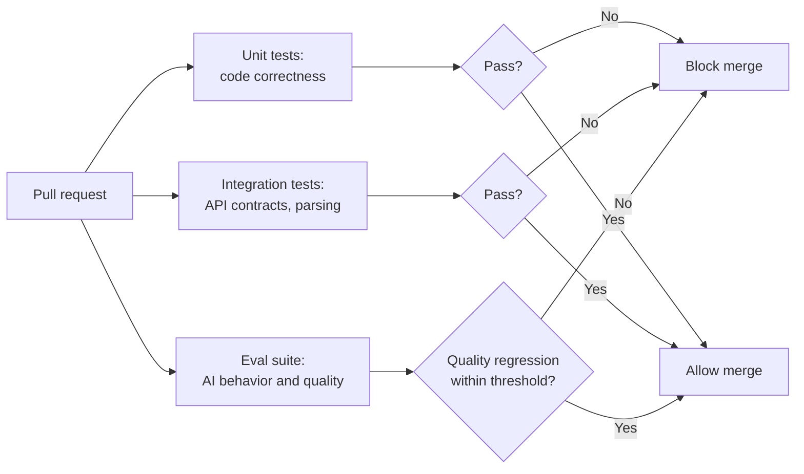
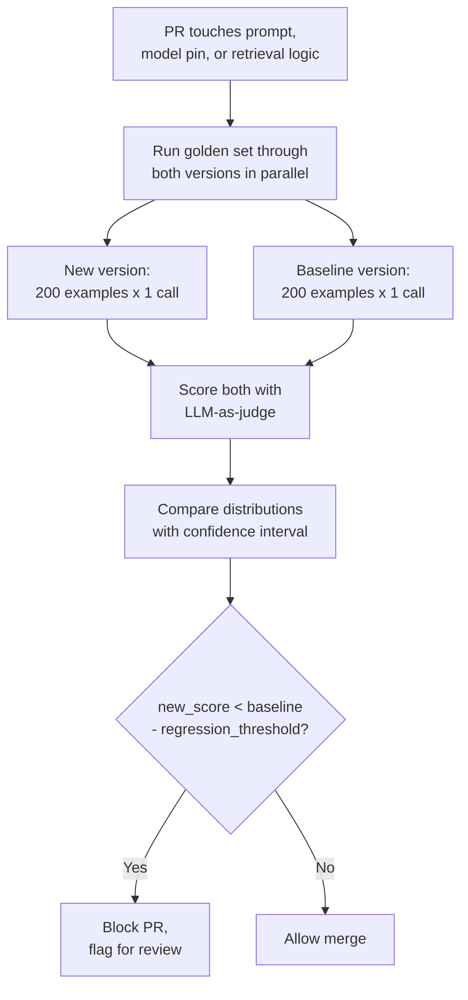
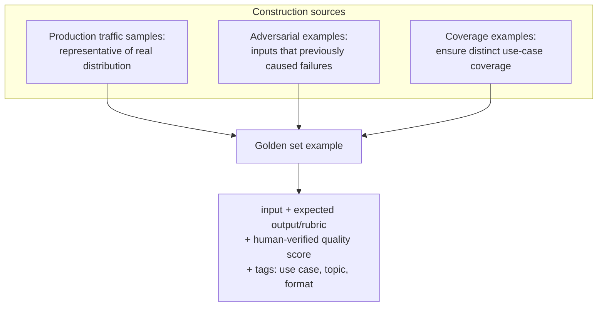
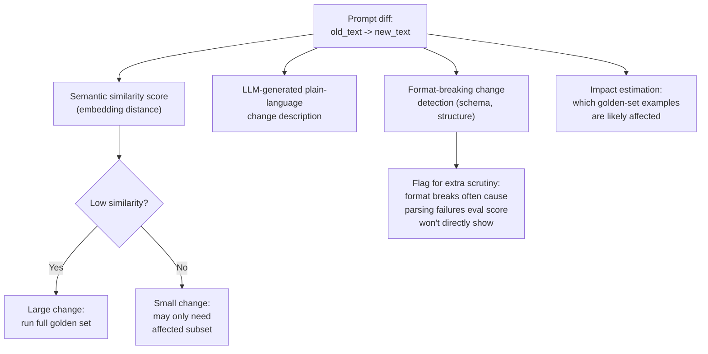
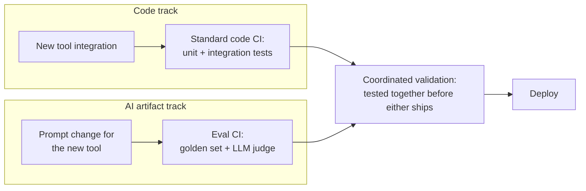

# CI/CD for AI Systems

## Overview

A pull request that changes a prompt can pass every unit test, every integration test, and every type check in a repository, and still ship a response quality regression to production — because none of those tests were ever built to measure whether an LLM's output got worse. This chapter is about the layer that has to sit on top of standard CI/CD for any system whose behavior depends on prompts, model versions, or retrieval logic: the eval suite as a merge gate, golden sets as its foundation, LLM-as-judge as its scoring mechanism, and a release gating checklist that decides what's allowed to reach production.

## What Traditional CI/CD Handles and What It Misses

Standard CI/CD pipelines run unit tests (deterministic, fast, cheap) and integration tests (deterministic given stable dependencies, moderately fast). Both catch code bugs — a null pointer, a broken API contract, a regression in business logic. Neither says anything about AI quality.

A prompt change that makes responses 10% worse passes every unit test in the repository, because no unit test asserts anything about response quality — there's no `assert quality_score > 0.85` in a typical test suite, and even if there were, running it would require exactly the expensive, probabilistic LLM inference that unit tests are designed to avoid. A model upgrade that changes output format breaks integration tests that parse the output — but that's a downstream symptom, not the actual regression; the real problem (the model changed its behavior) needs its own detection layer, not just a parser exception.

AI CI/CD must add this third lane — the eval layer — that tests AI *behavior*, not just code behavior, and gates merges on a statistical quality comparison rather than a pass/fail assertion.

## The Eval CI Pipeline

**Trigger conditions** — not every change should trigger an eval run, because eval is slow and expensive. It should trigger on:

- Any change to a prompt file (direct)
- Any change to model version pins
- Any change to RAG retrieval logic or chunking strategy
- Any change to context assembly code

It should *not* trigger on changes to logging, monitoring, or pure infrastructure — these don't affect AI behavior, and running a full eval suite on every infrastructure PR burns budget for zero signal.

**The eval run**: the golden set is run through both the new version and the current production version, simultaneously, and quality metrics are compared. A regression beyond threshold flags the PR.

**Runtime budget**: a PR-gate eval run should finish in under 10 minutes. With a 200-example golden set and 2 LLM calls per example (current version + new version), at roughly 1 second per call, that's 400 calls — about 7 minutes if run serially, and much less if parallelized. Keeping this under budget requires three things working together:

- A smaller **PR-gate golden set** (100–200 examples) for fast, cheap, every-PR signal, with a larger **pre-release golden set** (1,000–5,000 examples) reserved for an overnight run before a bigger release, catching subtler regressions the small set would miss.
- **Parallelizing eval calls** — send all 400 calls concurrently and wait for the full batch, rather than looping through examples sequentially.
- An explicit **eval cost budget**: 200 eval calls per PR × 50 PRs/day = 10,000 inference calls/day. This should be a line item someone owns, not a surprise on the LLM API bill at the end of the month.

**The comparison and threshold calibration**: the PR is blocked if `new_score < baseline_score - regression_threshold`. An absolute threshold (`new_score < 0.85`) is brittle, because it doesn't account for where the baseline actually sits — a relative threshold (`new_score < baseline_score * 0.97`) is more robust because it scales with the baseline instead of assuming a fixed target quality level.

The **variance problem** is what makes threshold calibration genuinely hard: if running the same prompt version twice produces scores that differ by ±2% purely from generation and judge non-determinism, a threshold tighter than that variance produces false-positive blocks constantly. The fix is running eval multiple times per version and comparing **confidence intervals**, not point estimates — block only when the intervals don't overlap by a meaningful margin, not whenever one run's number happens to be slightly lower than another's.

## Golden Set Design and Maintenance

The golden set is the foundation everything above rests on — an eval pipeline with a bad golden set produces a pipeline that reliably measures the wrong thing.

**Construction** draws from three sources, each covering a gap the others don't: production traffic samples keep the set representative of what real users actually ask; adversarial examples — inputs that previously caused a failure — ensure a fixed failure never silently regresses back in; coverage examples deliberately fill in use cases that exist in the product but might be underrepresented in raw production sampling. Each example needs the input, an expected output or quality rubric, a human-verified quality score, and tags for use case/topic/format so failures can be sliced meaningfully later.

**Size calibration**:

| Set | Size | Purpose |
|---|---|---|
| PR-gate | 100–200 examples | Fast, cheap, catches major regressions on every PR |
| Pre-release | 1,000–5,000 examples | Slower, more expensive, run overnight, catches subtler regressions |
| Post-incident | Grows continuously | Every real production failure becomes a permanent example |

**Maintenance as a continuous practice**: a golden set rots if left alone. Inputs that were genuinely hard at launch become trivially easy as the underlying model improves, quietly inflating scores without any real quality gain. New product use cases get added to the product without a corresponding addition to the golden set, leaving a blind spot in exactly the newest, least-battle-tested part of the system. The discipline that prevents this: a quarterly review of example quality and coverage, a hard rule that **every AI incident produces new golden set examples** (see [AI Incident Response](06-ai-incident-response.md)) so the same failure mode can never pass CI twice, and an explicit deprecation process for examples that have become uninformative.

## LLM-as-Judge in the Eval Pipeline

The CI eval typically uses an LLM — often a stronger model than the one under test — to score each example against a rubric.

**Judge prompt design**: a structured rubric ("does the response address X, is the tone Y, is the format Z, score each 1–5") produces far more consistent, comparable scores than a free-form "rate this response's quality" prompt, which invites the judge to weigh different dimensions differently from one run to the next.

**Inter-judge consistency**: run the judge multiple times on the same example and check the variance is low. A judge that gives wildly different scores to the identical input on different runs is not a stable enough measurement instrument to gate merges on, no matter how good its rubric looks on paper.

**Judge model pinning**: the judge model version must be pinned, exactly like the model under test (see [Prompt & Model Versioning](02-prompt-and-model-versioning.md)) — a floating judge model means an eval score shift might be caused by the judge silently changing its own grading behavior, not by anything in the system actually changing. This is a second, easy-to-miss surface for the "behavioral changes without code changes" property from [LLMOps Overview](01-llmops-overview.md).

**Cost**: judge inference is additional cost stacked on top of system-under-test inference — for every example, you're paying for the response generation *and* the judge's evaluation of it, which roughly doubles (or more, for multi-turn rubrics) the per-example eval cost beyond the naive "one call per example" estimate.

## Automated Prompt-Diff Review

Before a human reviews a prompt change, automation can pre-digest the diff into something faster to reason about.

- **Semantic similarity scoring**: embed the old and new prompt and compute distance. Low similarity signals a large change that should get the full eval treatment; high similarity signals a small change that may only need a partial eval — this informs eval *scope*, it should never be used to skip eval entirely.
- **Change description generation**: an LLM reads the diff and produces a plain-language summary ("the new prompt adds an instruction to respond in bullet points and removes the instruction to use formal language"), so a human reviewer can quickly understand intent without reading the full prompt text line by line.
- **Format-breaking change detection**: parse both prompts for output format specifications (a JSON schema, a numbered-list instruction) and flag if the specification changed. This matters specifically because format-breaking changes often cause downstream parsing failures that a quality-focused eval score won't directly surface — the response can be "good" by the judge's rubric and still break every client that expects the old structure.
- **Impact estimation**: use embedding similarity between the changed instructions and each golden-set example's input to estimate which examples are likely affected. High estimated impact triggers the full golden set; low estimated impact runs only the affected subset — a scope decision, again, not a skip-eval decision.

## Release Gating Criteria

The set of conditions a version must satisfy before promotion from staging to production:

| Gate | Condition |
|---|---|
| Quality | eval score ≥ baseline − regression_threshold |
| Latency | p50/p99 TTFT within SLA |
| Cost | cost per request ≤ budget + N% |
| Safety | safety flag rate ≤ threshold |
| Format compliance | output matches schema in ≥ N% of examples |

**The approval workflow**: define, in advance, who can override a failed gate, under what conditions, and with what documentation requirement. An override should never be a silent bypass — it should require a named approver and a written justification that becomes part of the version's audit trail (see the `eval_metrics` and `approval_status` fields in [Prompt & Model Versioning](02-prompt-and-model-versioning.md)), precisely so a later incident investigation can find out that a gate was overridden and why.

## The Dual-Track Pipeline

AI systems change along two tracks that move at different speeds and need different ownership: a **code track** (tool integrations, orchestration logic, application code) and an **AI artifact track** (prompts, model versions, retrieval configuration).

**Coordination between the two tracks** matters because they're frequently coupled: a new tool integration and the prompt change that teaches the model to use it need to be validated *together*, not as two independent PRs that each pass their own pipeline in isolation — a prompt eval'd against the old tool set says nothing about whether the model actually uses the new tool correctly.

**The ownership boundary**: engineering owns the code CI; the ML/product team owns the eval CI. Neither should have to become an expert in the other's pipeline, but the coordination point — deciding when a code change and an AI artifact change must ship together — needs an explicit owner, or it becomes nobody's job.

**The danger to avoid explicitly**: deploying a code change and its logically-coupled prompt change separately, on different timelines, because they moved through different pipelines at different speeds. A tool integration that ships before its prompt update is live can silently degrade the product for the gap between the two deploys — and because neither pipeline is watching the other, nothing flags that gap as a problem.

## Interview Questions

### Beginner

**Q: Why does a prompt change that passes all unit tests still need a separate eval step before merging?**
Unit tests assert deterministic, code-level correctness — they have no way to express "is this response a good answer," because that's a graded, subjective quality judgment, not a pass/fail assertion. A prompt change can be syntactically and structurally fine (compiles, doesn't crash, passes every existing test) while still making the model's actual responses meaningfully worse — only a dedicated eval run against a golden set, scored by an LLM judge, can catch that.

**Q: What's the difference between a PR-gate golden set and a pre-release golden set?**
The PR-gate set is small (100–200 examples) so it can run fast and cheap on every single pull request, catching major regressions quickly. The pre-release set is much larger (1,000–5,000 examples), runs less frequently (typically overnight before a bigger release), and catches subtler regressions the smaller, faster set doesn't have the statistical power or coverage to detect.

### Intermediate

**Q: Why is a relative regression threshold (`new_score < baseline * 0.97`) usually preferred over an absolute one (`new_score < 0.85`)?**
An absolute threshold assumes there's one universally correct quality bar, regardless of where the current baseline actually sits — it can pass a real regression from a high baseline, or block a perfectly fine change against a naturally lower-scoring category. A relative threshold scales with the baseline's own current level, so the gate is actually asking "did this get worse relative to where it was," which is the question that matters for merge decisions.

**Q: Why does the judge model need to be pinned just like the model under test?**
Because a floating judge model can silently change its own grading behavior over time — exactly the same "behavioral changes without code changes" risk that applies to the system under test. If both the judge and the system could each independently drift, an eval score change becomes ambiguous: did the system get worse, or did the judge just start grading more harshly? Pinning the judge removes that ambiguity, isolating quality shifts to changes in the system under test.

### Senior

**Q: Design the trigger logic for what should and shouldn't run the full eval suite on a pull request, and justify the boundary.**
Trigger the eval suite on anything that can change model *behavior*: prompt file edits, model version pin changes, RAG retrieval/chunking logic changes, and context assembly code changes — all of these can shift response quality even without an obvious "prompt changed" signal. Don't trigger it on logging, monitoring, or pure infrastructure changes, since these have no path to affecting model output and running a full, expensive eval suite against them burns the daily eval budget for zero signal. The boundary is drawn at "can this plausibly change what the model sees or produces," not at "does this touch files near the AI code" — a monitoring dashboard change living in the same directory as a prompt file shouldn't trigger eval just by proximity.

**Q: A team's eval CI has a fixed regression threshold that's been in place for a year. Lately it's producing frequent false-positive blocks on PRs that manual review says are fine. What's the likely cause and fix?**
The likely cause is that the threshold was calibrated without accounting for run-to-run variance, and something has since increased that variance — a more variable judge model, a golden set that's grown more diverse (and thus more variable in per-run average), or simply that the original threshold was set tighter than the eval's actual noise floor from the start. The fix is to measure the eval's own variance directly: run the same version multiple times, compute the score distribution, and set the regression threshold relative to that measured variance (using confidence intervals, not point estimates) rather than a threshold chosen without ever measuring what "normal" run-to-run noise looks like.

### Staff

**Q: You own the platform-level eval CI system used by 15 product teams, each shipping prompt changes at different rates. Some teams complain the shared PR-gate golden set doesn't reflect their product's use cases. How do you resolve this without losing the benefits of a shared pipeline?**
Separate the *mechanism* (parallelized eval execution, judge infrastructure, confidence-interval gating logic, CI integration) from the *content* (which golden set examples apply to which product surface) — the shared pipeline should accept a per-team golden set slice while still running through the same infrastructure, scoring rubric conventions, and gating logic. This preserves the platform benefits (consistent tooling, judge model pinning, cost tracking) while letting each team own the examples that actually reflect their product, and it avoids the two bad extremes: forcing every team onto one universal golden set that fits nobody well, or letting every team build a fully bespoke eval pipeline with no shared discipline or cost visibility.

## Google-Level Follow-Ups

**"Your eval CI blocks a PR because the new prompt version's score is below the relative threshold. The engineer says the drop is 'within noise.' How do you settle this without arguing?"**
Probes whether the candidate reaches for confidence intervals over point estimates as the actual resolution mechanism — run the eval multiple times on both versions, compute intervals, and check whether they meaningfully overlap; if they do, the engineer is right and the threshold or variance assumption needs recalibrating, not the PR.

**"Format-breaking change detection flags a prompt diff, but the LLM-as-judge quality score for that same diff shows no regression. Which signal do you trust, and why might both be right simultaneously?"**
Probes whether the candidate understands these measure different things: the judge scores whether responses are *good*; format detection flags whether responses are *structured the way downstream parsers expect*. A response can be qualitatively excellent and still break a JSON parser expecting a specific schema — both signals can be correct at once, which is exactly why format compliance is tracked as its own release gate, not folded into the quality score.

**"Why can't 'impact estimation via embedding similarity between changed instructions and golden-set inputs' ever be used to justify skipping eval entirely, only to justify running a subset?"**
Probes whether the candidate sees the failure mode: embedding similarity estimates topical relevance, not actual behavioral impact — a low-similarity-seeming instruction change (e.g., a subtle tone shift) can still meaningfully change quality on examples that don't look "topically related" to the changed text at all. Impact estimation narrows scope for efficiency; it is not a substitute for running some eval on every gated change.

## Common Mistakes

- **Assuming passing unit and integration tests means an AI system change is safe.** Neither is built to detect a quality regression; only a dedicated eval layer can.
- **Gating merges on an eval score point estimate instead of a confidence interval.** Run-to-run variance from generation and judge non-determinism will produce both false-positive blocks and false-negative merges without one.
- **Using an absolute quality threshold instead of one relative to the current baseline.** It silently passes real regressions from a high baseline and blocks fine changes against a naturally lower-scoring category.
- **Letting the golden set rot — no quarterly review, no incident-driven additions.** Examples that were hard at launch become trivially easy over time, quietly inflating scores with no real quality signal behind the improvement.
- **Running the judge model on a floating version instead of pinning it.** A judge that silently changes its own grading behavior makes it impossible to tell whether an eval score shift came from the system under test or from the judge itself.
- **Deploying a code change and its logically-coupled prompt change on separate timelines because they pass through separate pipelines.** The gap between the two deploys can silently degrade the product with nothing in either pipeline watching for it.

## Key Takeaways

- Traditional CI/CD (unit and integration tests) catches code bugs, not AI quality regressions — a dedicated eval layer that runs the golden set through the new and baseline versions and compares quality distributions is a required third lane, not an optional add-on.
- A two-tier golden set — a small, fast PR-gate set for every merge and a large, slow pre-release set for bigger release decisions — balances catching major regressions cheaply against catching subtler ones thoroughly.
- Eval score comparisons need confidence intervals, not point estimates, because run-to-run variance in generation and in the LLM judge means a naive threshold produces both false-positive blocks and missed real regressions.
- The golden set needs continuous maintenance — quarterly coverage review and mandatory additions from every production incident — or it silently stops measuring what it was built to measure.
- LLM-as-judge scoring needs a structured rubric, verified low inter-run variance, and a pinned judge model version, because an unpinned judge introduces exactly the same "behavior changed with no code change" risk that applies to the system under test.
- Release gating should check quality, latency, cost, safety, and format compliance as five distinct gates, with an explicit, documented override workflow — never a silent bypass — and code changes and AI artifact changes that are logically coupled must be validated and deployed together, not on separate, uncoordinated timelines.

---

*Part of [LLMOps](index.md) in the [AI System Design Notes](../index.md). Previous: [Deployment Strategies: Canary & Shadow](03-deployment-strategies-canary-shadow.md). Next: [The Fine-Tuning Engineering Pipeline](05-the-fine-tuning-pipeline.md).*
