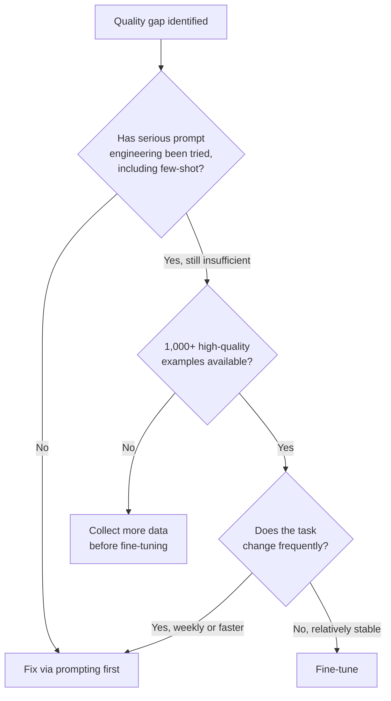
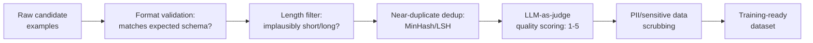
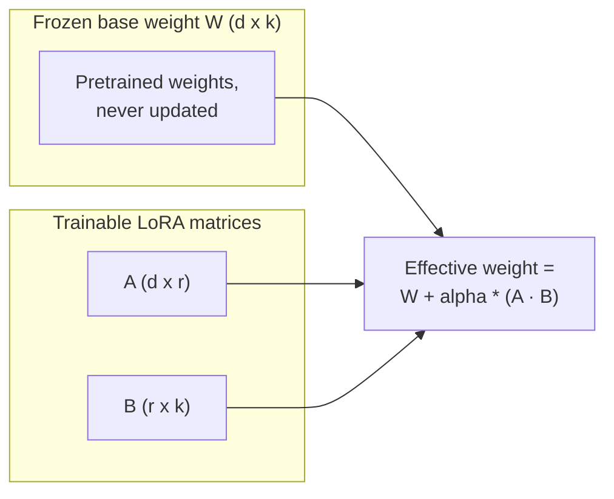
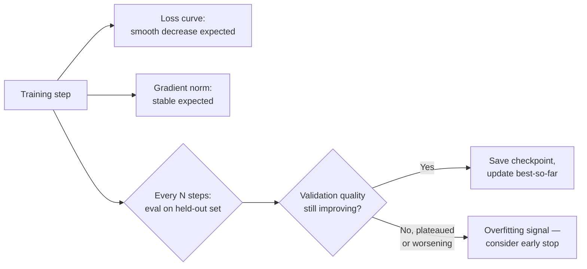
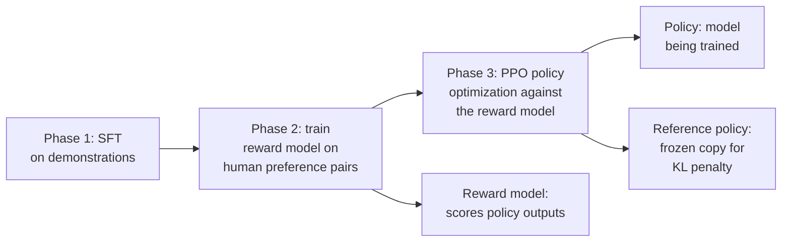
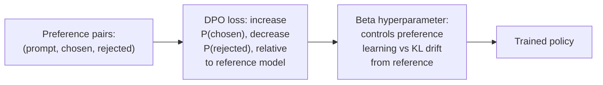
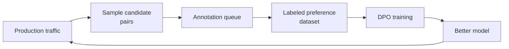
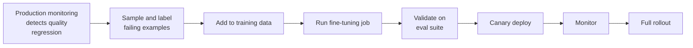

# The Fine-Tuning Engineering Pipeline

## When to Fine-Tune vs. Prompt

Fine-tuning is an investment with real engineering cost — data curation, training infrastructure, an eval loop, a deployment path for adapters — and it should be a deliberate decision made after prompting has genuinely been exhausted, not a default reach.

**Fine-tune when**:

- The desired behavior is hard to elicit with prompting alone, even after pushing few-shot examples as far as they go.
- Output format must be rigidly consistent across thousands of examples — enforcing format through prompting alone is brittle at scale, where a small percentage of malformed outputs compounds into a real operational problem.
- Latency or cost savings justify the investment — a fine-tuned 7B model can match a prompted 70B model's quality on a narrow task at a fraction of the serving cost (see [Multi-LoRA Serving](../15-model-serving/01-model-serving-architecture.md#multi-lora-serving-one-base-many-adapters)).
- The task requires learned domain knowledge that can't be reliably injected via context at inference time.

**Do not fine-tune when**:

- You have fewer than roughly 1,000 high-quality examples — a fine-tuning run on too little data usually memorizes rather than generalizes, and the eval will not be able to tell the difference reliably.
- Prompt engineering hasn't actually been seriously attempted — most quality problems that look like "the model can't do this" are "the prompt didn't ask for it clearly enough, with enough examples."
- The use case changes frequently — a fine-tuned adapter lags behind a prompt's ability to update same-day, and a task that shifts weekly will spend more time being retrained than being useful.

## Data Collection and Curation Pipeline

Fine-tuning quality is bounded by data quality, full stop — a run on mediocre data produces a mediocre model regardless of how well-tuned the training run itself is, while a well-curated dataset can let a small model beat a much larger prompted one on the specific task it was trained for.

### Data Sources

- **Production logs**: input/output pairs where the output was rated highly, by human reviewers or by automated quality metrics — the most representative source of real task distribution, since it's literally what the model will see in production.
- **Human demonstrations**: domain experts write ideal outputs for a curated set of inputs — the highest-quality source per example, at the highest cost per example.
- **AI-generated, human-filtered**: a strong model generates candidate outputs, humans select the best ones, and active learning prioritizes examples the model is most uncertain about — a way to scale human review effort toward the examples where it matters most rather than spreading it thin uniformly.
- **Synthetic data generation**: a strong model generates varied inputs for the target use case, paired with strong-model outputs that are then verified by humans — useful for filling coverage gaps that real production traffic hasn't produced yet.

### Quality Filtering Cascade

Apply filters in order of computational cost, cheapest first, so expensive filters only ever run on data that's already survived the cheap ones.

1. **Format validation** — does the output match the expected schema? Cheapest check, catches structurally broken examples immediately.
2. **Length filter** — discard examples where the output is implausibly short or long relative to the task, a cheap heuristic that catches obvious garbage before spending anything on deeper analysis.
3. **Near-duplicate deduplication** — MinHash/LSH across inputs to remove near-duplicates that would otherwise inflate training signal for one narrow slice of the input distribution at the expense of everything else.
4. **LLM-as-judge quality scoring** — score each surviving example on a 1–5 rubric, discard below threshold. This is the most expensive filter, which is exactly why it runs last, only on data that's already passed the cheaper checks.
5. **PII/sensitive data scrubbing** — scan for credit card numbers, SSNs, emails, API keys before any production data is used for training, regardless of what stage of the cascade it's at; this is a compliance requirement, not a quality one, and it should run as a hard gate rather than a scored filter.

### Dataset Versioning

Treat the training dataset as a versioned artifact with the same discipline as a prompt version (see [Prompt & Model Versioning](02-prompt-and-model-versioning.md)):

- **Dataset cards**: source composition, filtering criteria applied at each stage, example counts before and after each filter, and the resulting quality score distribution.
- **Linking dataset versions to model versions and eval results** — the same version-to-eval linkage discipline from Chapter 02, applied to training data instead of prompts.
- **Lineage requirement**: a deployed model must trace back to the exact dataset version it was trained on, both for debugging a regression (was it the prompt, the model, or the training data that changed?) and for compliance in regulated domains.

### Format Normalization

Training data must match the base model's expected chat template exactly — ChatML, Llama, and Mistral formats all differ in role names, special tokens, and structure. Common format errors: wrong role names, missing special tokens, unescaped characters that silently corrupt the training signal. Validation tooling: run every example through the tokenizer's `apply_chat_template` function before training starts, and fail loudly on any example that doesn't round-trip cleanly — catching this before a multi-hour training run is vastly cheaper than discovering it from a garbled model afterward.

## PEFT Techniques — LoRA, QLoRA, DoRA

### LoRA (Low-Rank Adaptation)

The standard parameter-efficient fine-tuning approach. For each target weight matrix `W` (d×k), add trainable matrices `A` (d×r) and `B` (r×k). During training, the effective update is `W + α × A·B`, where `α` is a scaling factor and `r` is the rank (typically 8–64). Only `A` and `B` are trained; `W` stays frozen.

**Adapter size**: `2 × r × d × sizeof(dtype)` per targeted layer. A rank-16 LoRA for Llama 3 70B (hidden_dim = 8192, 80 layers, targeting Q+V attention matrices) works out to roughly `2 × 16 × 8192 × 80 × 2 × 2 bytes ≈ 840 MB` — small enough to swap per request at serving time (see [Multi-LoRA Serving](../15-model-serving/01-model-serving-architecture.md#multi-lora-serving-one-base-many-adapters)).

- **Rank selection**: `r=8` for style/format adaptation, `r=32–64` for task-specific behavioral adaptation, `r=128+` for knowledge injection — higher rank buys more capacity to adapt at the cost of a larger adapter and more overfitting risk on small datasets.
- **Which weight matrices to target**: attention Q, K, V, O and FFN gate/up/down — targeting more matrices increases adaptation coverage at the cost of a larger adapter; a common starting point targets Q and V only, expanding to more matrices if quality plateaus.
- **The alpha hyperparameter**: `α = 2 × rank` is a common starting point; a larger alpha means stronger adaptation but higher risk of catastrophic forgetting of the base model's general capability.

### QLoRA

LoRA with the base model loaded in 4-bit NF4 quantization. This is what makes fine-tuning a 70B model tractable on 2×80GB GPUs instead of 8. Base model weights stay frozen in INT4; LoRA adapters train in BF16, with gradients computed by dequantizing from INT4 at each step.

**VRAM math**: a 70B model at NF4 needs roughly 35 GB for weights, plus ~6 GB for LoRA adapters, plus ~5 GB for optimizer states — about 46 GB total, split across 2 GPUs with FSDP.

**Quality tradeoff**: QLoRA typically achieves 95–98% of full-precision LoRA quality on most tasks — a small, usually acceptable cost for a large reduction in required GPU memory.

**Setup**: `bitsandbytes` for NF4 quantization, combined with the `peft` library for the LoRA layers themselves.

### DoRA (Weight-Decomposition Low-Rank Adaptation)

Decomposes the weight update into **magnitude** (a scalar per output dimension) and **direction** (handled by a low-rank matrix, as in standard LoRA), allowing separate control over how much a weight changes versus which direction it changes in. This typically achieves better quality than LoRA at the same rank.

**When it's worth the added complexity**: primarily for difficult domain-adaptation tasks where LoRA at reasonable ranks plateaus below the quality bar — not for straightforward format or style fine-tuning, where plain LoRA is simpler to reason about and already sufficient.

## Training Orchestration

### FSDP (Fully Sharded Data Parallelism)

PyTorch-native distributed training that shards model parameters, gradients, and optimizer states across GPUs. During forward/backward passes, parameters are all-gathered just-in-time for computation, then re-sharded immediately after.

**Sharding strategies**:

| Strategy | What's sharded | Tradeoff |
|---|---|---|
| `FULL_SHARD` | Parameters, gradients, optimizer states | Maximum memory efficiency, most communication overhead |
| `SHARD_GRAD_OP` | Gradients and optimizer states only | Faster, uses more memory than FULL_SHARD |
| `NO_SHARD` | Nothing (equivalent to DDP) | Fastest, requires the model to fit on one GPU already |

**When to use FSDP**: when the model plus optimizer states don't fit on a single GPU even with gradient checkpointing enabled. **Integration with LoRA**: LoRA adapters are small enough that FSDP is typically unnecessary for the adapter parameters themselves — FSDP is there to shard the large *frozen* base model weights, not the small trainable adapter.

### DeepSpeed ZeRO

Microsoft's alternative to FSDP, offering the same category of memory efficiency through progressive sharding stages: **Stage 1** shards optimizer states, **Stage 2** adds gradient sharding, **Stage 3** adds parameter sharding — roughly matching FSDP's `FULL_SHARD` at Stage 3.

**When DeepSpeed vs. FSDP**: DeepSpeed has more mature pipeline-parallelism integration and a larger community track record for training very large models from scratch; FSDP is PyTorch-native and integrates more naturally into a standard PyTorch training loop. For fine-tuning with LoRA specifically, either works well — the practical answer is to prefer whichever your team already knows, since the difference at LoRA fine-tuning scale is smaller than at pretraining scale.

### Gradient Checkpointing

Recomputes activations during the backward pass instead of storing them from the forward pass, reducing activation memory by roughly `√(number of layers)` at the cost of about 30% more compute. Always enable it for models larger than 7B being fine-tuned — it's compatible with FSDP with no special configuration required, and the compute overhead should be budgeted explicitly into training time estimates rather than discovered as a surprise slowdown.

### Training Monitoring

- **Loss curve** — should decrease smoothly; a spike signals a learning rate issue or a bad data batch.
- **Gradient norm** — should stay stable; a consistently large gradient norm signals training instability.
- **Eval metrics on a held-out validation set**, checked every N steps — watch specifically for train loss continuing to decrease while validation quality plateaus or worsens, the signature of overfitting.
- **Checkpoint frequency** — save every N steps, and always retain the best checkpoint *by validation quality*, not just the most recent one, since the most recent checkpoint is frequently not the best one once overfitting sets in.

## Preference Optimization: DPO, RLHF, and ORPO as Engineering Systems

### RLHF (Reinforcement Learning from Human Feedback)

The original approach, used for InstructGPT and early Claude models. Three phases: (1) SFT on demonstration data, (2) reward model training on human preference pairs (annotators compare two responses and pick the better one), (3) PPO policy optimization against the trained reward model.

**The engineering complexity**: three models resident in memory simultaneously — policy, reference policy, and reward model. PPO is notoriously unstable with LLMs, requiring careful hyperparameter tuning and reward clipping to avoid the policy collapsing or diverging. The preference-annotation pipeline itself requires specialized tooling to collect comparisons at scale. This is why most teams building on top of an existing base model avoid vanilla RLHF and reach for a simpler alternative.

### DPO (Direct Preference Optimization)

Reformulates the RLHF objective as a supervised learning problem. Given a preference triplet `(x, y_w, y_l)` — prompt, preferred response, dispreferred response — DPO directly computes a loss that increases the probability of `y_w` and decreases the probability of `y_l` relative to a reference model, with no reward model and no RL required.

**Training pipeline**: collect preference pairs → format as `(prompt, chosen, rejected)` triplets → train with the DPO loss for 1–3 epochs → eval on a held-out preference set.

**Why simpler than RLHF**: one model being trained, a standard supervised training loop, no RL instability to fight.

**Limitations**: requires high-quality preference pairs — noisy preferences train the model to learn the noise, not a real signal; can overfit to the preference dataset and lose general capability, mitigated with the β hyperparameter, which controls the tradeoff between how strongly the model learns the preference signal versus how far it's allowed to drift (via KL divergence) from the reference model.

### ORPO (Odds Ratio Preference Optimization)

Eliminates the reference model entirely by folding a penalty for dispreferred responses directly into the SFT loss. Simpler than DPO — no reference model needed — at the cost of somewhat lower quality on tasks where the reference model's baseline behavior actually matters for the comparison. Use ORPO when compute is constrained and you want lightweight preference alignment layered directly on top of an SFT model, without the extra memory and complexity of running a reference model alongside training.

### The Preference Data Pipeline

Preference pairs are expensive to collect, and the pipeline that produces them is its own piece of engineering:

- **Annotation tooling** — an A/B comparison UI showing two model responses side by side, with structured annotation categories (more helpful, more accurate, better formatted, safer) rather than a single undifferentiated "which is better" click.
- **Annotator calibration** — measure inter-annotator agreement; disagreements are either genuinely ambiguous examples (a real signal about the task, worth flagging) or an annotator calibration issue (a training/guidance problem) — these need different responses, not the same fix.
- **Synthetic preference data** — use a strong model to generate preference pairs, either via Constitutional-AI-style critique-and-revision or by having the model rank its own candidate outputs. Validate against human labels regularly, since synthetic preferences inherit whatever biases the generating model has.
- **The data flywheel**: production traffic → sample pairs → annotation queue → labeled dataset → DPO training → better model → better production traffic, feeding the next round.

## The Full Improvement Loop: Production Failure to Deployed Fix

| Stage | Typical latency |
|---|---|
| Failure detection | Hours to days, depending on monitoring maturity |
| Data collection and labeling | Days |
| Fine-tuning run | Hours to days, depending on compute |
| Eval | Hours |
| Deployment (canary → full) | Hours to days |

**Compressing the loop**: pre-built data pipelines that ingest labeled examples within hours of collection rather than requiring manual ETL each time; pre-configured fine-tuning jobs that launch with a single command against a known-good training config rather than being re-derived per run; automated eval that runs without human intervention as a gate on the fine-tuning job's own output, not a separate manual step someone has to remember to trigger. Every stage in this table is a place where a team with mature tooling closes the loop in days and a team without it takes weeks — and per [LLMOps Overview](01-llmops-overview.md), that cycle time is the metric that matters most.

## Interview Questions

### Beginner

**Q: When should a team fine-tune instead of just improving the prompt?**
When prompting has genuinely been tried and exhausted — including few-shot examples — and the desired behavior still isn't reliably achievable, or when rigid output-format consistency is needed at a scale where prompting alone is too brittle, or when the latency/cost savings of a smaller fine-tuned model justify the engineering investment. Fine-tuning shouldn't be a default first move; it's what you reach for after prompting has hit a real ceiling.

**Q: What's the practical benefit of LoRA over full fine-tuning?**
LoRA freezes the base model's weights and trains only small added matrices (A and B) instead of updating every parameter, which drastically reduces the memory and compute needed to fine-tune, and produces a small adapter file (tens to hundreds of MB) instead of a full copy of the model. This also enables serving many fine-tuned variants efficiently off one base model, since only the small adapters differ between them.

### Intermediate

**Q: Why does QLoRA let you fine-tune a 70B model on far less GPU memory than standard LoRA, and what's the cost?**
QLoRA loads the frozen base model in 4-bit NF4 quantization instead of full or half precision, which roughly quarters the memory needed just to hold the base weights — the LoRA adapters themselves still train in BF16 on top of that. The cost is a small quality tradeoff, typically 95–98% of full-precision LoRA quality on most tasks, which is usually an acceptable trade for making a fine-tuning run possible on 2 GPUs instead of 8.

**Q: Explain why DPO is simpler to operate than RLHF, and what DPO gives up in exchange.**
DPO reformulates preference learning as a single supervised training loop — no separate reward model, no PPO, no RL instability to manage, and only one model needs to be trained. RLHF requires three models in memory at once (policy, reference, reward model) and PPO's well-documented instability with LLMs. What DPO gives up is the RL setup's theoretical flexibility to optimize against a reward signal that isn't purely pairwise-preference-shaped — in practice, DPO's simplicity has made it the default choice for most teams doing preference tuning on top of an existing base model.

### Senior

**Q: A fine-tuning run shows a smoothly decreasing training loss, but production quality after deployment is worse than before. Where do you look first?**
First check whether validation quality (not training loss) plateaued or worsened partway through training while train loss kept improving — the classic overfitting signature — and whether the deployed checkpoint was actually the best-by-validation-quality checkpoint rather than just the final one, since it's a common mistake to always ship the last checkpoint saved. If validation metrics looked fine throughout, check whether the training data distribution actually matches production traffic — a dataset curated from an earlier production sample or from synthetic generation can drift from what real users are currently asking, producing a model that's genuinely better on its own eval set and worse on the traffic that matters.

**Q: Design the data curation pipeline for fine-tuning a customer-support model from production logs, addressing the risk of training on your own past mistakes.**
Filter production logs specifically on outputs that were rated highly — by human QA review or a reliable automated quality signal — not on raw logs indiscriminately, since unfiltered production data includes exactly the failures you don't want the model to learn to reproduce. Run the full quality cascade (format validation, length filter, dedup, LLM-as-judge scoring, PII scrubbing) before anything reaches the training set, and deliberately include adversarial examples pulled from documented past incidents so the model is trained away from known failure modes rather than merely not being trained toward them. Version the resulting dataset with a full card (source composition, filter counts at each stage, quality distribution) so a later regression can be traced back to exactly what the model was trained on.

### Staff

**Q: Your company wants to move from full RLHF to DPO to cut training infrastructure cost, but a senior researcher argues RLHF's reward model gives finer-grained control that DPO's binary preference format loses. How do you evaluate this tradeoff for a real production decision?**
The core technical claim is right — a reward model can express calibrated, continuous quality signal across many outputs, while DPO's pairwise `(chosen, rejected)` format only encodes relative ordering within a pair — but the practical question is whether that finer-grained signal is actually being captured well by your current RLHF pipeline (reward models trained on relatively few preference pairs are often noisier than the theoretical framing implies) or whether it's a capability you're not fully exploiting anyway. The right resolution is empirical, not theoretical: run both on the same preference dataset and the same eval suite, and compare quality, not architecture purity — if DPO gets within a small, acceptable margin of RLHF's quality at a fraction of the operational and infrastructure complexity (no reward model, no PPO instability, one model instead of three), the cost savings usually win, unless the eval shows a real, specific gap that matters for the product.

## Google-Level Follow-Ups

**"Your LoRA adapter for a 70B model is targeting only Q and V attention matrices at rank 16, and quality has plateaued below the target bar. What are the two independent levers you'd try next, and how do you decide which one first?"**
Probes whether the candidate distinguishes rank (more capacity at the same matrices) from coverage (targeting more weight matrices, like K, O, and FFN layers) as genuinely separate levers, and reasons about trying the cheaper one first — usually rank increase, since it doesn't grow the adapter's targeted-matrix footprint — before reaching for broader coverage, which increases both adapter size and overfitting risk.

**"You've moved to DPO and preference data quality looks solid by inter-annotator agreement, but the fine-tuned model's outputs feel noticeably 'preachy' compared to the base model. What's the likely mechanism, and how does the beta hyperparameter relate to it?"**
Probes whether the candidate connects an over-strong preference signal (a beta that permits too much drift from the reference model) to overfitting toward whatever surface pattern happened to correlate with "preferred" in the annotation data — a strong answer proposes increasing beta to constrain KL drift from the reference model, and checking whether the preference data itself over-represents a particular stylistic marker that annotators liked for reasons unrelated to the actual task quality.

**"Dataset versioning links a model version to the exact training data it was built from. Six months later, that data included production logs from users who've since exercised a data-deletion request. What does your lineage system need to support that a simple immutable dataset snapshot doesn't?"**
Probes whether the candidate recognizes that full immutability (the naive interpretation of "versioned dataset") conflicts with real deletion/compliance requirements, and proposes a design that supports selective removal and re-derivation (a mutable underlying store with a versioned manifest of which records were used, rather than a literal frozen file) so a deletion request doesn't require quietly deciding whether prior model versions are now non-compliant with no ability to know or fix it.

## Common Mistakes

- **Fine-tuning before seriously exhausting prompt engineering, including few-shot.** Most quality gaps that look like "the model can't do this" are really "the prompt didn't specify it clearly enough."
- **Training on fewer than roughly 1,000 examples and expecting generalization.** Small datasets are memorized, not learned from, and the eval often can't distinguish the two without a genuinely separate held-out set.
- **Shipping the last training checkpoint instead of the best-by-validation-quality checkpoint.** Train loss can keep improving well past the point where validation quality has already plateaued or started to regress.
- **Skipping the quality filtering cascade and training directly on raw production logs.** Unfiltered logs include your own past failures, and a model trained on them learns to reproduce those failures, not avoid them.
- **Running FSDP or DeepSpeed sharding on the LoRA adapter parameters when only the frozen base model needed it.** Adapters are small enough that sharding them adds coordination overhead for no real memory benefit.
- **Treating a fine-tuned adapter as a "set it and forget it" artifact with no versioning or rollback plan.** Adapters need the same version-to-eval linkage and tested rollback path as prompts and model pins (see [Prompt & Model Versioning](02-prompt-and-model-versioning.md)).

## Key Takeaways

- Fine-tune only after prompting has been genuinely exhausted, with at least roughly 1,000 high-quality examples and a task stable enough that a trained adapter won't immediately lag behind changing requirements.
- Data quality bounds model quality — the filtering cascade (format, length, dedup, LLM-judge scoring, PII scrubbing) and dataset versioning with full lineage to eval results are not optional overhead, they're what makes a fine-tuning run debuggable later.
- LoRA, QLoRA, and DoRA trade off adapter size, training memory, and quality along a spectrum — QLoRA's 4-bit base model quantization is what makes large-model fine-tuning tractable on modest hardware, at a small (95–98%) quality cost versus full-precision LoRA.
- FSDP and DeepSpeed both solve the same sharding problem for the frozen base model; LoRA adapters themselves are usually too small to need sharding at all.
- DPO has become the default preference-optimization approach for most teams because it collapses RLHF's three-model, RL-unstable pipeline into a single supervised training loop, at the cost of needing high-quality preference pairs and careful beta tuning to avoid overfitting to the preference data.
- The full improvement loop — production failure detected, data collected and labeled, fine-tuning run, eval, canary, full rollout — is exactly the same lifecycle from [LLMOps Overview](01-llmops-overview.md) applied to fine-tuning specifically, and the cycle time of that loop is what separates a team that can react to a quality problem in days from one that takes weeks.

---

*Part of [LLMOps](index.md) in the [AI System Design Notes](../index.md). Previous: [CI/CD for AI Systems](04-ci-cd-for-ai-systems.md). Next: [AI Incident Response](06-ai-incident-response.md).*
