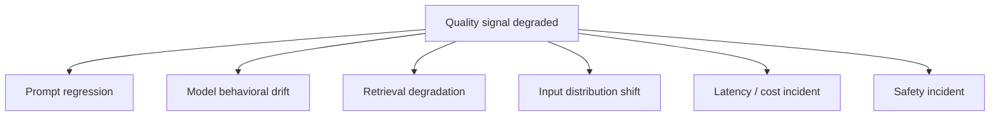
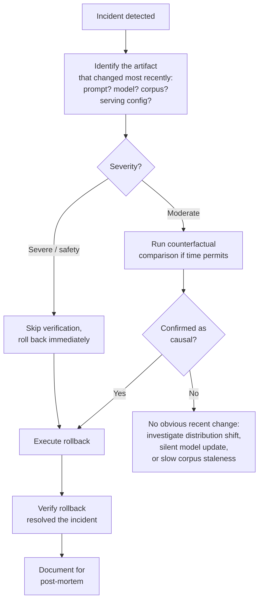
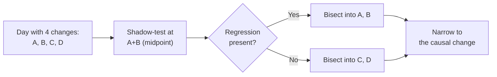
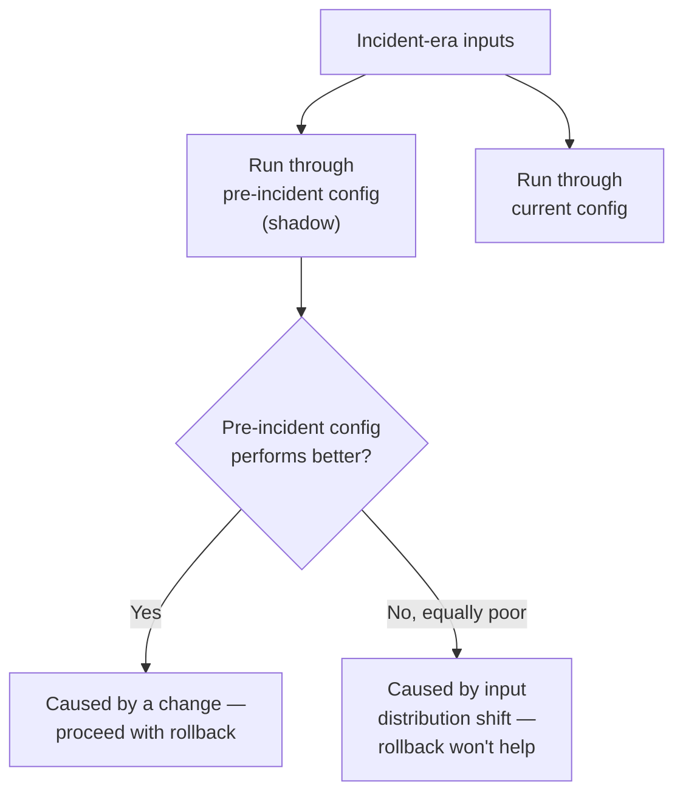
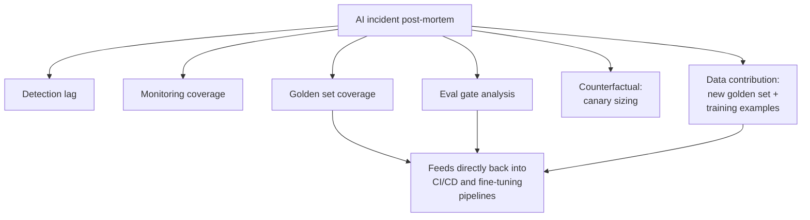

# AI Incident Response

## Why AI Incidents Are Different From Software Incidents

A software outage announces itself: 5xx error rate spikes, request volume drops to zero, latency blows past SLA. The signal is binary and loud, and the on-call playbook — check the dashboards, find the spike, correlate with the last deploy — works because the failure is discrete and infrastructure-visible.

An AI quality regression does none of this. No single request "fails" in a way any dashboard flags — thousands of requests are each answered a little worse, and every infrastructure metric (error rate, latency, uptime) can look completely healthy the entire time. Users may complain without being able to say why, in words the on-call engineer can't directly map to a system component. And the root cause is frequently not "what just changed" — it can be a change from days or weeks ago whose effect only became visible once traffic patterns shifted, or a provider-side model update nobody on the team triggered at all.

| Property | Software incident | AI quality incident |
|---|---|---|
| Detection signal | Binary, loud (5xx spike, latency SLA breach) | Subtle, statistical (score distribution shift) |
| Infra metrics during incident | Visibly abnormal | Often completely normal |
| User reports | Specific ("page won't load") | Vague ("this feels worse") |
| Root cause timing | Usually the most recent deploy | Can be days/weeks old, or no deploy at all |
| Reproducibility | Usually deterministic | Non-deterministic — can't replay to the exact same output |

Each row is an operational implication: you need statistical detection instead of threshold alarms, you need behavioral monitoring in addition to infra monitoring, you need an attribution process that looks back further than "the last commit," and you need root-cause techniques built for a system that won't give you the same answer twice on the same input.

## AI Incident Taxonomy

Organizing incidents by type matters because each type has a different detection signal, a different investigation path, and a different fix — treating all of them as "quality dropped, go find out why" wastes the time it takes to even ask the right first question.

### Prompt Regression

A prompt change made responses worse for a subset of inputs the golden set didn't cover.

- **Detection**: elevated user complaints; a drop in quality score on sampled production-traffic eval; specific input patterns failing consistently.
- **Root cause**: the prompt change wasn't tested against the affected input slice — usually because the golden set's coverage had a gap.
- **Remediation**: roll back the prompt version within minutes (see [Prompt & Model Versioning](02-prompt-and-model-versioning.md)); add the failing examples to the golden set immediately, before anything else, so this exact gap can't reopen.

### Model Behavioral Drift

The upstream provider updated the model behind a stable API version.

- **Detection**: a drop on the behavioral fingerprint test (a fixed set of prompts with expected structural outputs, run daily); a shift in output format distribution with no corresponding internal change.
- **Root cause**: provider-side model update, entirely outside your team's control or knowledge until the fingerprint test (or users) surface it.
- **Remediation**: pin to a specific model version if not already pinned; evaluate whether the new behavior is actually acceptable (sometimes a provider update is a net improvement) or requires a prompt update to compensate.

### Retrieval Degradation

The RAG corpus went stale, a corpus update introduced low-quality documents, or the embedding model changed.

- **Detection**: a drop in retrieval metrics (recall@k, hit rate on known-answer queries); a quality score drop concentrated specifically on retrieval-heavy queries.
- **Root cause**: corpus update, embedding model change, or index corruption — see [RAG Failure Modes](../06-rag/03-rag-failure-modes.md) for the full failure catalog underneath this category.
- **Remediation**: roll back the corpus to the last known-good snapshot; reindex with corrected data.

### Input Distribution Shift

New user behaviors, a viral event, or a product change brought inputs the model wasn't optimized for.

- **Detection**: input embedding distribution divergence from baseline (cluster analysis of recent inputs vs. a rolling baseline); quality drop concentrated specifically on the new input patterns, not spread evenly across traffic.
- **Root cause**: external (a new user segment, a seasonal event, something viral) or internal (a new product feature, a marketing campaign that changed who's asking what).
- **Remediation**: no rollback helps here, because nothing was rolled forward — the system needs to be updated to handle the new pattern. Short-term: a prompt update that adds explicit handling for the new pattern. Long-term: fine-tune on labeled examples of it (see [The Fine-Tuning Engineering Pipeline](05-the-fine-tuning-pipeline.md)).

### Latency / Cost Incident

TTFT spikes, TBT degrades, or cost-per-request increases sharply.

- **Detection**: standard infra metrics — p99 TTFT, tokens-per-request distribution, cost-per-request over time.
- **Root cause**: context length increase from a prompt change, a model tier change (small model swapped for a large one), retrieval returning longer chunks than before, or an increase in tool-call count per request.
- **Remediation**: identify the specific change that caused the increase, and either roll it back or optimize it directly (see [Model Serving Architecture](../15-model-serving/01-model-serving-architecture.md) for the underlying serving-layer levers).

### Safety Incident

Harmful, biased, or policy-violating outputs at elevated rates.

- **Detection**: elevated safety classifier flag rate; direct user reports.
- **Special response protocol**: faster escalation than a standard quality regression — immediate rollback without waiting for statistical confirmation, and direct, immediate communication to safety/legal/PR teams before any external communication goes out. Safety incidents are the one category where "wait for enough signal to be sure" is the wrong instinct; the cost of a false-positive rollback is far lower than the cost of a confirmed safety failure left running.

## Rollback Decision Framework

The path: identify the artifact that changed most recently → verify it's actually the causal change, if time permits (skip this step entirely for severe or safety incidents — roll back first, verify later) → execute the rollback → verify the rollback actually resolved the incident, not just coincided with a return to normal → document for the post-mortem.

**The "no obvious recent change" case** deserves its own branch, because the investigation is genuinely different: when quality degraded with no explicit internal change, the candidates are input distribution shift, a silent provider-side model update, or slow corpus staleness accumulating past a threshold — none of which have a rollback target, because nothing was rolled forward. This is where the root-cause techniques below matter most.

## Root Cause Analysis for Non-Deterministic Systems

This is the hardest part of AI incident response, precisely because you can't replay a request and expect the same output twice.

### Replay With Anchoring

Replay a sample of incident-era requests through both the pre-incident and current configurations simultaneously. You can't reproduce exact responses, but you *can* compare the distribution of responses across a large enough sample — a statistically significant quality difference between the two configurations, run on the same inputs, is real evidence of causation even without exact reproducibility.

### Version Bisection

If the regression started on a day with multiple changes, systematically test each intermediate state by deploying a shadow copy at each version combination and binary-searching for the one that introduced the regression — the same principle as `git bisect`, applied to a stack of prompt/model/config versions instead of commits.

### Attribution Matrix

Build a table of every change in the past two weeks — prompt versions, model version, corpus updates, code deploys, serving config changes — with timestamps, and overlay it against the quality metric timeseries. Look for a change event that lines up with a metric inflection point. This is a correlation tool, not proof, but it narrows the search space fast, especially when the regression started well before anyone noticed it.

### Failure Sample Analysis

Pull the 50 worst-performing requests from the incident period and look for what they have in common — input length, topic, format, user segment, language. If they cluster on a specific attribute, the root cause is very likely specific to that slice, which points directly at one of the taxonomy categories above rather than a system-wide problem.

### Counterfactual Testing

Run incident-era inputs through the pre-incident configuration in a shadow setup. If the pre-incident config produces *better* outputs on the same inputs, the incident was caused by a change. If the pre-incident config produces *equally poor* outputs on the new inputs, the incident was caused by input distribution shift instead — this single test is often the fastest way to distinguish "we broke something" from "the world changed and we didn't."

## Incident Communication

AI quality incidents need a different communication cadence and vocabulary than infrastructure outages.

**Internal cadence** (adapt based on severity): initial assessment within 30 minutes, a preliminary root-cause hypothesis within 2 hours, resolution or a clear timeline within 4 hours.

**External communication thresholds**: a minor quality regression affecting under 5% of users typically needs no external communication at all; a significant regression, or anything in the safety category, needs a status page update and direct email.

**Language matters specifically here** — avoid "the AI is broken" framing, which is both imprecise and needlessly alarming. Prefer language like "we identified a quality regression affecting X% of queries in Y scenario, and we are investigating / have resolved it," which is accurate, scoped, and doesn't overstate or understate what actually happened.

## AI-Specific Post-Mortem

A standard software post-mortem format misses fields that matter specifically for AI incidents. Add these:

1. **Detection lag** — how long between the regression actually starting and the incident being declared? What monitoring signal, if it had existed, would have shortened this?
2. **Monitoring coverage** — were there signals that *could* have caught this earlier, and weren't being watched?
3. **Golden set coverage** — did the CI eval suite's golden set cover the affected input pattern? If not, what examples need to be added right now, not eventually (see [CI/CD for AI Systems](04-ci-cd-for-ai-systems.md))?
4. **Eval gate analysis** — would a better-designed eval gate (a lower threshold, a broader golden set, a longer pre-release eval) have blocked the change that caused this?
5. **Counterfactual** — if the canary had been smaller, or run longer at each stage, would the regression have been caught before full rollout (see [Deployment Strategies: Canary & Shadow](03-deployment-strategies-canary-shadow.md))?
6. **Data contribution** — what examples from this incident get added to the golden set and/or the fine-tuning training data, so this exact failure mode is represented going forward?

Fields 3, 4, and 6 exist specifically to close the loop back into the pipelines from earlier chapters — a post-mortem that doesn't produce new golden set examples and doesn't ask whether the eval gate should have caught this is a post-mortem that guarantees the same incident can happen again.

## Interview Questions

### Beginner

**Q: Why can an AI quality incident be happening while every infrastructure dashboard looks completely healthy?**
Because a quality regression doesn't produce a discrete failure any infra metric is built to catch — error rate, latency, and uptime can all be normal while thousands of requests are individually answered a bit worse. Infra metrics measure whether the system is running; they say nothing about whether its outputs are good, which needs a separate quality-monitoring signal entirely.

**Q: What's the difference between a prompt regression and model behavioral drift as incident categories?**
A prompt regression is caused by a change your team made — a prompt edit that wasn't tested against some input slice — and it's fixed by rolling back that prompt version. Model behavioral drift is caused by the provider silently updating the model behind a stable API version, with no change on your team's side at all — the fix isn't a rollback of something you did, it's pinning the model version (if not already pinned) and deciding whether the new behavior needs a prompt update to compensate.

### Intermediate

**Q: A user reports "the bot feels worse" but you see no error rate change and no recent deploy. What's your first move?**
Check for the two causes that don't require a deploy on your side: run the behavioral fingerprint test to see if the model itself has silently changed behind a stable API version, and check the input distribution (embedding clustering on recent traffic vs. a rolling baseline) for a shift that might mean users are simply asking different things than the system was tuned for. Both of these can produce a real, felt quality drop with zero entries in your own deploy log.

**Q: Why is counterfactual testing — replaying incident-era inputs through the pre-incident config — often the fastest way to distinguish "we broke it" from "the world changed"?**
Because it directly isolates the variable: if the exact same inputs perform better on the old configuration, the incident is caused by something that changed on your side, and a rollback will fix it. If the old configuration performs just as poorly on those same inputs, nothing you rolled forward is the problem — the inputs themselves are outside what either configuration was built to handle, which points at input distribution shift instead, where a rollback would do nothing.

### Senior

**Q: Design the incident response protocol differences between a standard quality regression and a safety incident.**
A standard quality regression follows the full rollback decision framework — identify the likely artifact, verify causally if time allows, then roll back — because the cost of a wrong or premature rollback (reverting a change that wasn't actually the cause) is real but modest. A safety incident should skip the verification step entirely and roll back immediately on suspicion alone, because the cost of a confirmed safety failure continuing to run for even a short additional window vastly outweighs the cost of an unnecessary rollback, and it should trigger direct, immediate escalation to legal/safety/PR before any external communication — a materially faster and more conservative protocol than a quality regression gets.

**Q: You're brought in to review an incident where a prompt regression escaped canary and reached 100% of production traffic. The post-mortem says "the canary looked fine." What should the post-mortem actually be asking?**
It should be asking whether the canary's quality signal was ever statistically meaningful at the traffic percentage and dwell time actually used — a canary at 1% on modest traffic volume, per the sample-size math in [Deployment Strategies: Canary & Shadow](03-deployment-strategies-canary-shadow.md), often can't detect a real quality regression at all, so "the canary looked fine" may just mean "the canary had no statistical power to see this," not that the change was actually safe. The post-mortem's counterfactual field should explicitly ask whether a longer dwell time or a shadow-mode pre-check (rather than relying on canary as the first quality signal) would have caught it — and the fix, if so, is a canary/shadow process change, not just "look more carefully next time."

### Staff

**Q: Your company has had three quality incidents in six months, each traced to a different root cause category (prompt regression, retrieval degradation, input shift), and leadership wants "one fix" that prevents all future AI incidents. How do you respond?**
There isn't one fix, because the taxonomy itself proves the categories have genuinely different detection signals, causes, and remediations — a golden-set eval gate helps with prompt regressions but does nothing for input distribution shift, and a corpus freshness SLO helps with retrieval degradation but does nothing for a silent provider-side model update. The honest answer to leadership is a portfolio of investments mapped directly to the taxonomy: behavioral fingerprint tests for model drift, freshness SLOs and reconciliation jobs for retrieval, golden-set expansion and canary dwell-time discipline for prompt regressions, and input-distribution monitoring for shift — each is cheap in isolation and none of them substitutes for the others, which is the actual argument for investing in all of them rather than searching for a single silver-bullet fix.

## Google-Level Follow-Ups

**"Version bisection assumes you can shadow-test each intermediate combination of changes. What happens when two of the changes are not independently deployable — say, a prompt change and a fine-tuned adapter that were trained together?"**
Probes whether the candidate recognizes that bisection requires each candidate state to actually be constructible and runnable — when changes are logically coupled (see the dual-track pipeline in [CI/CD for AI Systems](04-ci-cd-for-ai-systems.md)), you can't cleanly test "prompt change alone" if it was never validated or meant to run without its paired adapter, and the bisection has to treat that pair as one atomic unit rather than splitting it.

**"Your rollback decision framework skips verification for severe incidents and rolls back immediately. What's the risk of that shortcut, and how would you know afterward whether you rolled back the wrong thing?"**
Probes whether the candidate sees that skipping verification trades a slower, safer investigation for speed, and accepts the risk that the rollback might not actually address the root cause (e.g., an input distribution shift, where rolling back changes nothing) — the mitigation is the post-incident step "verify the rollback resolved the incident" in the decision framework, which catches this after the fact if the immediate rollback didn't actually help.

**"The post-mortem field 'golden set coverage' asks whether the eval suite covered the affected pattern. Suppose it did, and the eval still passed. What does that imply about the eval methodology itself, not just the golden set's content?"**
Probes whether the candidate can distinguish a coverage gap from a sensitivity gap — if the right examples were present and the eval still passed, the problem isn't what's in the golden set, it's the judge's rubric, the regression threshold, or the eval's statistical power (see [CI/CD for AI Systems](04-ci-cd-for-ai-systems.md)) failing to detect a real difference that was right there in the data the whole time.

## Common Mistakes

- **Waiting for infrastructure dashboards to show a problem before investigating a suspected quality regression.** Infra metrics can stay green throughout an AI quality incident — quality needs its own monitoring signal.
- **Treating every incident as a rollback problem.** Input distribution shift and slow corpus staleness have no rollback target; forcing a rollback investigation onto them wastes the most valuable early hours of the incident.
- **Waiting for full statistical confirmation before rolling back a suspected safety incident.** The cost asymmetry favors immediate rollback on suspicion for this category specifically, unlike standard quality regressions.
- **Skipping the "verify the rollback actually resolved the incident" step.** A rollback that coincides with recovery isn't proof it caused the recovery — especially in a system where variance alone can produce a metric bounce.
- **Writing a post-mortem with no new golden-set examples or eval-gate analysis.** A post-mortem that doesn't feed back into CI/CD and fine-tuning pipelines all but guarantees the same failure mode recurs.
- **Assuming "no recent deploy" means "no root cause to find."** Silent provider-side model updates and gradual corpus staleness produce real incidents with nothing in your own deploy log to point at.

## Key Takeaways

- AI incidents are structurally different from software incidents — no discrete failure signal, healthy-looking infra metrics throughout, vague user reports, and a root cause that can predate the incident by days or weeks with no code deploy involved at all.
- The incident taxonomy (prompt regression, model drift, retrieval degradation, input shift, latency/cost, safety) matters because each category has its own detection signal and remediation — there is no single "quality dropped, investigate" playbook that fits all of them equally.
- The rollback decision framework branches on severity (skip verification for severe/safety incidents, verify first when time allows) and explicitly handles the "no obvious recent change" case differently, since input shift and silent drift have no rollback target at all.
- Non-deterministic systems need their own RCA toolkit — replay with anchoring, version bisection, attribution matrices, failure sample clustering, and counterfactual testing — because you cannot reproduce an exact output twice the way you can replay a deterministic software bug.
- Safety incidents get a faster, more conservative protocol than standard quality regressions: immediate rollback on suspicion, immediate escalation to legal/safety/PR, before external communication.
- An AI post-mortem needs fields a standard one misses — detection lag, monitoring coverage, golden-set coverage, eval gate analysis, canary-sizing counterfactual, and data contribution — because these are what actually close the loop back into the CI/CD and fine-tuning pipelines that should prevent recurrence.

---

*Part of [LLMOps](index.md) in the [AI System Design Notes](../index.md). Previous: [The Fine-Tuning Engineering Pipeline](05-the-fine-tuning-pipeline.md). Next: [Continual Learning and Model Freshness](07-continual-learning-and-model-freshness.md).*
