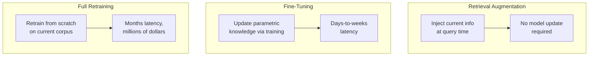
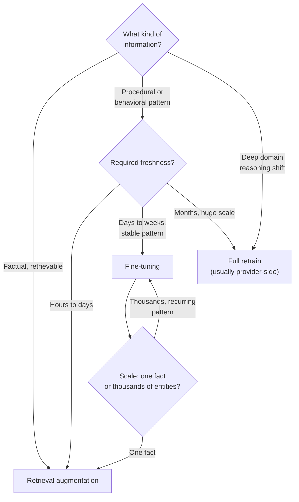
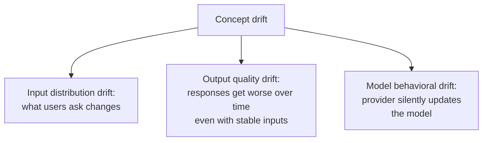
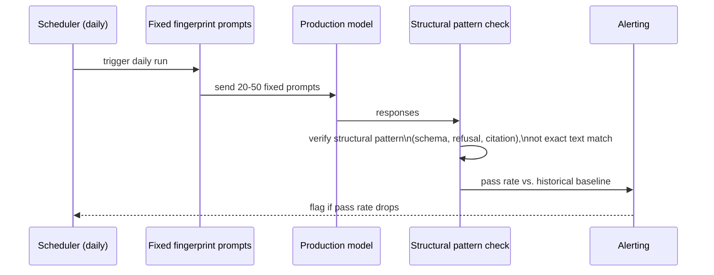
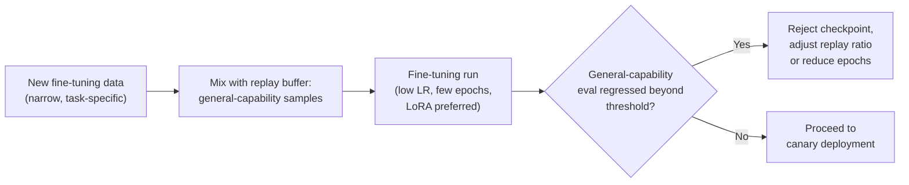
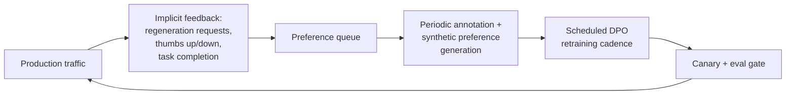

# Continual Learning and Model Freshness

## The Knowledge Cutoff Problem and Three Update Strategies

Every LLM is trained on data up to a cutoff date and does not automatically know anything that happened after it. A model trained through December 2025 has no idea what happened in March 2026 unless something in the system tells it. The real product question is never "how do we fix the knowledge cutoff" — it's "for this specific type of new information, which update strategy is the most cost-effective way to keep the system current?" There are exactly three levers, and they sit at very different points on the cost/speed/depth spectrum.

**Retrieval augmentation (RAG)**: inject current information at query time from an up-to-date corpus, with no model update at all. Works well for any factual information that can be retrieved and fits in the context window. Doesn't work for deeply internalized knowledge — new reasoning patterns, new domain expertise the model needs to apply fluently without being handed the fact explicitly — or for information the model needs to "just know" without a retrieval step in the loop. Freshness: can be updated continuously, limited only by ingestion latency. Cost: corpus maintenance plus retrieval cost per query. See [RAG Architecture](../06-rag/01-rag-architecture.md) for the full retrieval stack this depends on.

**Fine-tuning**: update the model's parametric knowledge by training on new data. Works well for new entities and terminology the model must recognize and use fluently, new domain-specific patterns, and behavioral changes prompting can't reliably enforce. Freshness: days to weeks of latency from data collection to deployment. Cost: training compute plus the full eval and deployment cycle from [The Fine-Tuning Engineering Pipeline](05-the-fine-tuning-pipeline.md). Risk: catastrophic forgetting of prior capabilities, covered below.

**Full retraining**: retrain the model from scratch on a corpus that includes current data. Works for major knowledge-cutoff advances, architectural changes, and large-scale behavioral alignment shifts. Freshness: months of latency. Cost: frontier-scale training runs cost millions of dollars. Practical for model providers running scheduled model releases — not a lever most product teams ever pull themselves.

**The decision framework**:

The framework reduces to three questions, in order: **what kind of information** is it (factual and retrievable vs. a behavioral or reasoning pattern), **how fresh** does it need to be (hours vs. weeks vs. months), and **at what scale** (a single fact doesn't justify a fine-tuning run; thousands of recurring entities might). Budget is the tiebreaker when two strategies both technically work — RAG is almost always cheaper per unit of freshness than fine-tuning, which is why teams should default to RAG and only reach for fine-tuning when RAG's actual limitation (it can't make the model reason differently, only hand it more facts) is the real blocker.

## Concept Drift Detection

Concept drift is the model's outputs silently diverging from expectations over time, without necessarily any explicit change on your side. There are three distinct types, and — as with the incident taxonomy in [AI Incident Response](06-ai-incident-response.md) — each needs its own detection signal.

### Input Distribution Drift

User inputs change over time — a new user segment, a new product feature, a seasonal event, a viral topic nobody planned for. Detected by monitoring embedding-distribution statistics on incoming queries (mean embedding, covariance, KL divergence from a rolling baseline), input length distribution, and vocabulary shift — new terms appearing at unusual frequency that the system may not have been tuned to handle. **Alert threshold**: KL divergence of the daily embedding distribution from a 30-day rolling baseline exceeding a set threshold. **Response**: rebalance the golden set to include examples of the new input pattern, and assess whether the fix is a prompt update (fast) or a fine-tuning pass (if the pattern is large and recurring enough to justify it).

### Output Quality Drift

Response quality trends downward even when inputs look stable. Detected by running the golden set eval on a daily or weekly schedule and tracking the score trend, not just a single snapshot. **Alert threshold**: a 7-day rolling average quality score dropping below a set floor. **Root causes** worth checking in order: retrieval corpus staleness (the corpus hasn't kept pace with the world, even though nothing about the pipeline itself changed — see [RAG Failure Modes](../06-rag/03-rag-failure-modes.md#staleness-index-lag-vs-source-of-truth)); prompt-model misalignment (a silent provider-side model improvement changed behavior in ways the existing prompt no longer accounts for); or natural, gradual drift in the input distribution too slow for the input-drift detector's day-over-day comparison to catch, but visible in a longer rolling quality trend.

### Model Behavioral Drift

A provider silently updates the model behind a stable API version — the same category covered as an incident type in [AI Incident Response](06-ai-incident-response.md), but here treated as a continuous freshness-monitoring concern rather than a one-off event.

**Detection**: a behavioral fingerprint test — a fixed set of 20–50 prompts with expected *structural* output patterns, not exact text matches (for example: "should return valid JSON matching this schema," "should decline this specific request category," "should cite a source for this factual claim"), run on a fixed schedule (daily is typical). Because the test prompts and their expected structural patterns never change, any shift in the pass rate is attributable to the model itself changing, not to anything on your side.

**Response**: if the fingerprint test flags a drop, first confirm the model version pin hasn't silently changed (see [Prompt & Model Versioning](02-prompt-and-model-versioning.md)) — a provider can update what a pinned version string actually serves in rare cases, though this is far less common than drift on a floating alias. If the pin is confirmed unchanged and behavior still shifted, that's strong evidence of a genuine underlying model update, and the response is the same upgrade-workflow discipline used for any deliberate model version change: full eval suite, staged rollout, and a decision on whether the new behavior needs a compensating prompt update.

## Catastrophic Forgetting Mitigation

Fine-tuning on new data risks degrading the model's prior general capability — the classic catastrophic forgetting problem, and it's a direct risk any time freshness is pursued via fine-tuning rather than retrieval.

**Why it happens**: gradient updates that improve performance on the new data can move weights away from configurations that supported unrelated prior capabilities, especially when the new fine-tuning data is narrow and repetitive relative to the model's original training distribution.

**Mitigation techniques**:

- **Replay buffers** — mix a sample of the model's original broad-capability training-style data (or a representative eval set covering general capabilities) into the fine-tuning batch alongside the new data, so the training signal doesn't come exclusively from the narrow new distribution.
- **Low learning rates and fewer epochs** — the same lever discussed in [The Fine-Tuning Engineering Pipeline](05-the-fine-tuning-pipeline.md): smaller, more conservative updates change less of the model's behavior outside the targeted task.
- **LoRA/PEFT instead of full fine-tuning** — because the base weights stay frozen, general capability encoded in those weights is structurally protected; only the small adapter can drift, and it can be removed entirely (see the rollback path in [Prompt & Model Versioning](02-prompt-and-model-versioning.md)) if forgetting turns out to be a problem.
- **Held-out general-capability eval as a training gate** — run a broad-capability eval set (not just the task-specific golden set) after every fine-tuning run, and gate deployment on that eval not regressing beyond a set threshold, exactly the same eval-gate discipline from [CI/CD for AI Systems](04-ci-cd-for-ai-systems.md) applied to a different kind of regression.

## Online Learning for Personalization

A distinct freshness problem from "the world changed" is "this specific user's preferences and context have accumulated, and the system should reflect that without retraining the whole model." Two patterns handle this at the per-user level rather than the global-model level.

**Per-user adapters**: a small, cheap adapter (a lightweight LoRA, or even simpler, a per-user embedding bias) trained or updated incrementally on a single user's interaction history, layered on top of the shared base model at serving time — the same multi-LoRA serving pattern from [Model Serving Architecture](../15-model-serving/01-model-serving-architecture.md#multi-lora-serving-one-base-many-adapters), but scoped to individual users rather than tenants. This works when the personalization signal is dense enough per user to justify a dedicated adapter (a power user with a long interaction history) and becomes impractical at the scale of millions of light-touch users, where the per-user data is too sparse to train anything meaningful.

**Preference vectors**: a lighter-weight alternative — instead of training per-user model weights, maintain a per-user vector (learned from interaction history, feedback signals, or explicit preference settings) that's injected into the prompt or used to bias retrieval and ranking at inference time. This avoids any per-user training step entirely, updates instantly as new signal arrives, and scales to arbitrarily many users at near-zero marginal cost per user — the tradeoff is that it can only shift behavior within what the base model and prompt can already express, not teach genuinely new capability the way a per-user adapter could.

The practical default: most products should reach for preference vectors first — they're cheap, instant to update, and scale trivially — and reserve per-user adapters for a small segment of users where the personalization value is high enough (and the interaction history dense enough) to justify the added serving and training complexity.

## RLHF as a Continuous Production Feedback Loop

Preference optimization (covered as a training technique in [The Fine-Tuning Engineering Pipeline](05-the-fine-tuning-pipeline.md)) has a second role here: as an always-running freshness mechanism, not a one-off training event. The loop looks the same as the data flywheel from Chapter 05, but the operational framing shifts — it's not "we're doing a DPO run," it's "the model is continuously kept current with what real users actually prefer."

The engineering difference from a one-time preference-tuning project is the **cadence**: the loop runs on a schedule (weekly or monthly, depending on traffic volume and how fast the product's use cases evolve), not as a single milestone project. This means the preference data pipeline, the DPO training job, and the eval gate all need to be pre-built, repeatable infrastructure — exactly the "pre-configured fine-tuning jobs that launch with one command" discipline from Chapter 05 — because a freshness mechanism that requires manual re-engineering every cycle isn't actually keeping the model current, it's producing occasional one-off improvements on an unpredictable schedule.

## Interview Questions

### Beginner

**Q: Why can't retrieval augmentation solve every knowledge-freshness problem?**
RAG can inject current facts into the context window at query time, but it can't change how the model reasons, what patterns it recognizes fluently, or what it "just knows" without being explicitly handed the fact. A behavioral shift or a new reasoning pattern the model needs to apply broadly is not something you can hand it as a retrieved document — that requires fine-tuning (or, at the extreme, full retraining), not retrieval.

**Q: What is a behavioral fingerprint test and what specifically does it detect?**
A fixed set of 20–50 prompts with expected structural output patterns (like "returns valid JSON matching a schema" or "declines this category of request"), run on a schedule. Because the test itself never changes, any drop in its pass rate is attributable to the model behind a stable API version silently changing — it's the primary way to detect model behavioral drift, which by definition produces no internal deploy log entry to alert on otherwise.

### Intermediate

**Q: A product's daily quality score has been trending down slowly over three weeks, but no single day shows an alarming drop. What detection approach actually catches this, and why wouldn't a day-over-day threshold?**
A 7-day rolling average tracked over time catches this; a day-over-day threshold check doesn't, because each individual day's drop is too small to cross an alert threshold on its own — it's the cumulative trend that's the real signal. This is output quality drift specifically, and once detected, the root cause investigation should check retrieval corpus staleness, prompt-model misalignment from an unannounced provider update, and slow input distribution drift, in that order, since each has a different fix.

**Q: Why is LoRA/PEFT fine-tuning considered a mitigation for catastrophic forgetting, not just a training-efficiency trick?**
Because the base model's weights stay completely frozen — whatever general capability is encoded in them is structurally protected from the fine-tuning update, which only ever touches the small adapter matrices. This means any forgetting that does occur is confined to (and reversible by removing) the adapter, rather than being baked irreversibly into the full set of model weights the way full fine-tuning would.

### Senior

**Q: Design the decision process for choosing between per-user adapters and preference vectors for a personalization feature, given a user base ranging from casual users to power users with years of history.**
Default to preference vectors for the broad user base — they update instantly with no training step, scale to arbitrarily many users at near-zero marginal cost, and are sufficient for shifting behavior within what the base model can already express (tone, format, topic emphasis). Reserve per-user adapters for a small, identified segment of power users whose interaction history is dense enough to justify training something dedicated, and where the personalization need genuinely requires new capability the base model plus a preference vector can't express — the segmentation decision should be driven by interaction density and value, not applied uniformly, because most users' data is too sparse to make a per-user adapter meaningfully better than a preference vector, at real added serving complexity.

**Q: Your team runs a continuous DPO retraining loop on a monthly cadence to keep the model current with user preferences. Six months in, someone reports the model's answers have become subtly more repetitive and generic. What do you check first?**
Check for a low-diversity feedback loop: if the preference data collection process systematically over-samples one kind of interaction (e.g., only from users who leave explicit feedback, who may skew toward a particular style preference) or if synthetic preference generation is being used without regular validation against human labels, the model can be continuously reinforced toward whatever narrow pattern the sampled preferences represent rather than genuine broad preference. The direct check is comparing the current model's outputs against a general-capability eval set alongside the preference-tuned metric — if general-capability eval is flat or declining while the preference metric looks fine, the cadence has been optimizing for a narrower signal than intended, and the fix is diversifying the preference sampling or annotator base, not the training procedure itself.

### Staff

**Q: A VP asks whether the company should invest in full model retraining to "fix" the knowledge cutoff problem once and for all. How do you frame the response?**
Reframe the question: full retraining is rarely the right lever for a product team, because it costs millions of dollars and takes months, and almost every practical freshness need is actually better solved by RAG (for retrievable facts, continuously, cheaply) or fine-tuning (for recurring behavioral/domain patterns, in days to weeks) — full retraining is the right lever only for a foundation-model provider doing a scheduled model release, not for a product team trying to keep one deployed system current. The actionable response is walking through the three-question decision framework (information type, required freshness, scale) against the VP's actual concern, which almost always resolves to "we need better retrieval freshness SLOs or a fine-tuning cadence," not "we need to retrain a foundation model."

## Google-Level Follow-Ups

**"Your input distribution drift detector fires on a KL-divergence threshold. A viral marketing campaign the product team launched deliberately shifts the input distribution for two weeks, then it reverts. Should the detector treat this as an incident?"**
Probes whether the candidate understands drift detection needs context, not just a statistical trigger — a known, deliberate, and temporary shift (from a marketing campaign) is different from an unexplained, persistent one, and a mature system should let the drift signal inform the golden set and monitoring (rebalance to cover the campaign's traffic pattern while it's live) without necessarily treating every detected shift as a rollback-triggering incident.

**"You've committed to per-user adapters for your top 1% of users by engagement. Six months later, a user in that cohort churns and returns a year later. What does your adapter lifecycle policy need to account for that a stateless preference vector wouldn't have to?"**
Probes whether the candidate thinks through adapter staleness and retention — a returning user's stored adapter may reflect preferences and context a year out of date, unlike a preference vector which is derived fresh from recent signal each time; a good answer proposes either an adapter staleness check that triggers a preference-vector fallback until enough fresh interaction accumulates, or an explicit adapter expiration policy.

**"Your behavioral fingerprint test checks structural patterns, not exact text, specifically so it tolerates normal model variability. What's the risk of making the structural check too loose, and how would you know if it had become too loose to be useful?"**
Probes whether the candidate sees the tradeoff: a structural check that's too loose (e.g., "returns non-empty text") will fail to flag a real behavioral drift that changes something meaningful within that loose envelope, producing false confidence. The way to know: periodically validate the fingerprint test against a known historical drift event (or an intentionally injected one in a test environment) and confirm it actually would have fired — a fingerprint test that's never been proven to catch a real drift event is an unverified detector.

## Common Mistakes

- **Reaching for fine-tuning or full retraining to solve a problem retrieval could handle more cheaply.** RAG is almost always the lower-cost, faster-to-update lever for factual freshness; fine-tuning should be reserved for genuinely behavioral or reasoning-pattern gaps.
- **Detecting output quality drift only with a day-over-day threshold, missing slow multi-week trends.** A rolling average over a longer window is needed to catch gradual drift that no single day's number crosses an alert on.
- **Fine-tuning on narrow new data with no replay buffer or general-capability eval gate.** This is exactly how catastrophic forgetting silently ships — a model that's better at the new task and quietly worse at everything else, with nothing catching the regression before deployment.
- **Building per-user adapters for the entire user base instead of reserving them for a dense-history segment.** Most users' interaction history is too sparse to make a dedicated adapter meaningfully better than a much cheaper preference vector.
- **Running a continuous preference-tuning loop with no diversity check on the feedback source.** A loop that only samples feedback from users who leave explicit signal can reinforce a narrow preference pattern rather than genuine broad quality improvement.
- **Never validating a behavioral fingerprint test against a real or injected drift event.** A structural check that's never been proven to actually fire on real drift is a false sense of monitoring coverage, not real coverage.

## Key Takeaways

- The knowledge cutoff problem resolves to a three-way decision — retrieval, fine-tuning, or full retraining — driven by information type, required freshness, and scale, with RAG as the default cheapest lever and full retraining almost never the right one for a product team.
- Concept drift has three distinct types — input distribution drift, output quality drift, and model behavioral drift — each with its own detection signal (embedding KL divergence, rolling golden-set score, behavioral fingerprint test) and its own remediation path.
- A behavioral fingerprint test using fixed prompts and structural (not exact-text) expected patterns is the primary tool for detecting a silent provider-side model update, which by construction leaves no internal deploy log to alert on otherwise.
- Catastrophic forgetting is a direct risk of using fine-tuning for freshness, mitigated by replay buffers, conservative learning rates, preferring LoRA/PEFT over full fine-tuning, and gating every fine-tuning run on a general-capability eval, not just the task-specific one.
- Per-user adapters and preference vectors solve personalization freshness at different points on a cost/capability tradeoff — preference vectors should be the default, with adapters reserved for a small, high-value, dense-history user segment.
- Running preference optimization as a continuous production loop (rather than a one-time project) requires the same pre-built, repeatable infrastructure discipline as any other fast-cycle-time LLMOps practice — and needs an explicit diversity check on its feedback source, or it risks reinforcing a narrow pattern rather than genuine broad quality.

---

*Part of [LLMOps](index.md) in the [AI System Design Notes](../index.md). Previous: [AI Incident Response](06-ai-incident-response.md).*
