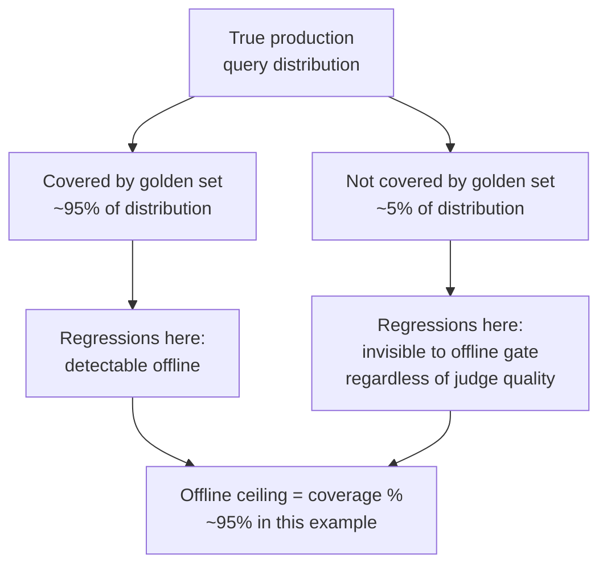
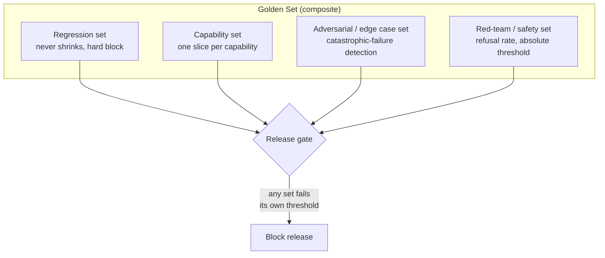
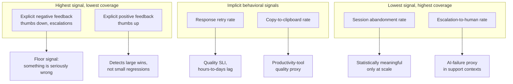
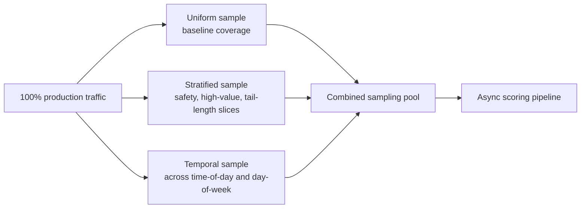
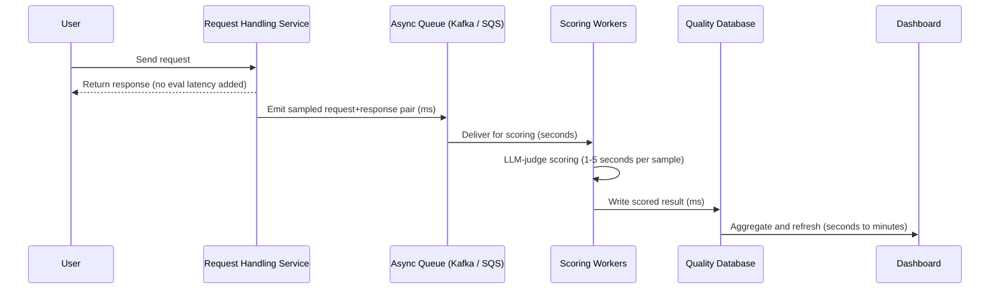
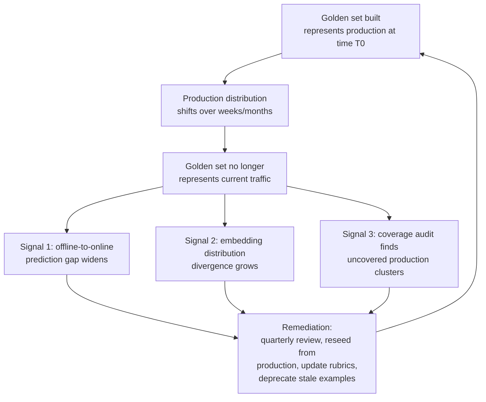
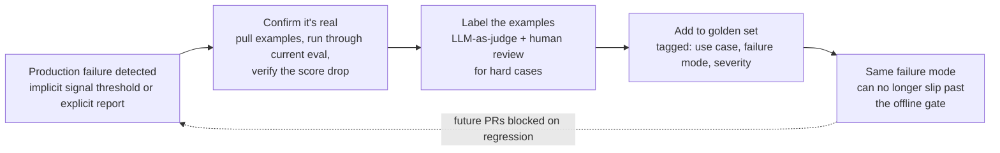
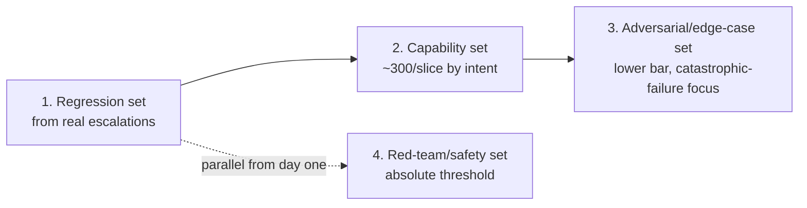

# Offline vs Online Evaluation

## Overview

[LLM Evaluation Architecture](01-llm-evaluation-architecture.md) named offline and online evaluation as two of the four layers in the eval system and sketched how they connect. This chapter is the operational depth on those two modes specifically: what each one can and cannot detect, the hard numbers behind why offline eval is cheap enough to run on every pull request and online eval is not, the taxonomy of golden set types that make offline eval worth trusting, the hierarchy of production signals that make online eval worth trusting, and — the part teams get wrong most often — how the two drift apart from each other silently, and the feedback loop that has to exist to keep them connected.

The central fact that shapes everything in this chapter: **offline eval only ever tests what someone thought to put in the golden set, and online eval only ever tells you about damage after it has already reached users.** Neither failure mode is fixable by trying harder within one mode. It is fixable only by running both, continuously reconciling them, and treating the gap between them as a first-class metric.

## Definition

**Offline evaluation** is scoring a candidate model or prompt against a fixed, version-controlled golden set before the change reaches any real user — a pre-deploy gate that runs in a CI-like environment, on a known input distribution, with a known expected quality bar.

**Online evaluation** is scoring or sampling real, live production traffic after a change has shipped — a post-deploy monitor that runs on the true, current, unbounded input distribution, but only observes quality after users have already been exposed to it.

They are not two implementations of the same thing. They answer different questions: offline asks "does this change regress on the failure modes we already know about," online asks "is this change actually good for the traffic we're really getting." A system that only does one of these has a blind spot the size of the other.

## Offline Evaluation: Mechanics and Ceiling

### What Offline Evaluation Can and Cannot Do

| Offline eval CAN | Offline eval CANNOT |
|---|---|
| Detect regressions on known failure modes already captured in the golden set | Test unknown failure modes that were never added to the set |
| Enforce per-dimension quality floors before any user is exposed | Reflect the current live query distribution if the set was built months ago |
| Provide a repeatable CI gate that never exposes users to untested changes | Detect regressions specific to long-tail inputs that aren't represented in the set |
| Run in minutes with parallelized LLM-judge calls, cheaply, on every PR | Capture failure modes introduced by input distribution shift (new use cases, new user segments, seasonal query patterns) |

The asymmetry is structural, not a matter of better engineering: a golden set is, by construction, a snapshot. It encodes everything the team knew to test for at the time it was assembled. It cannot encode what the team didn't know to test for, and it cannot update itself when the world changes underneath it. This is exactly why offline eval is necessary but not sufficient — see [Online Evaluation](#online-evaluation-mechanics-and-signal-hierarchy) below for the complementary layer that catches what offline structurally cannot.

### The Offline Ceiling

The **offline ceiling** is the maximum regression-detection rate any offline eval system can achieve, and it is bounded by how well the golden set covers the real production query distribution — not by how good the judge model is, how well-written the rubric is, or how many examples the set contains in absolute terms.

A golden set with 95% distribution coverage has, at best, a 95% regression-detection ceiling: any regression whose failure signature lives entirely in the uncovered 5% of the distribution is invisible to the offline gate no matter how well everything else in the pipeline is built. This is a hard mathematical property of coverage, not a tuning problem — you cannot judge-prompt your way past it, and you cannot threshold your way past it.



**Measuring the gap** is the only way to know your actual ceiling, since coverage itself isn't directly observable: compare offline golden-set scores against online sampled scores for the same time window. If offline scores stay flat release after release while online sampled scores trend down, that persistent gap is direct empirical evidence that the ceiling has been reached, or that eval drift (below) has silently lowered it further. A team that never compares the two has no way to know whether their offline gate is catching 95% of regressions or 60% — the gate looks equally green either way.

### Cost Model

A full golden-set run costs three inference calls per example: the candidate model's response, the baseline model's response for comparison, and one judge call to score the pair.

```
N examples x 2 inference calls (candidate + baseline) x 1 judge call = 3N total inference calls
```

At **N = 500** examples, serialized at roughly 1 second per call: 1,500 calls x 1 second = 25 minutes. With **50 concurrent calls**, the same run finishes in roughly 1,500 / 50 = 30 seconds. This is why parallelization budget is not an optimization nice-to-have for offline eval — it is the difference between a gate that runs on every PR and a gate too slow to run more than once a day.

**Dollar cost**, at a mid-tier judge model priced around $2 per million input tokens and roughly 1,500 tokens per call (transcript + rubric + instructions):

```
500 examples x 3 calls x 1,500 tokens x $0.000002/token = $4.50 per full golden-set run
```

At **50 PRs per day**, running the full golden set on every PR costs 50 x $4.50 = **$225/day** for CI eval alone — a real, plannable line item, not an afterthought buried in an API bill. Teams that don't budget this explicitly tend to discover it retroactively, at which point the instinct is often to cut corners on the golden set rather than to plan for the cost — see [Cost Optimization](../19-evaluation/01-llm-evaluation-architecture.md#cost-optimization) in Ch01 for the standard levers (tiered PR-gate vs. pre-release sets, cheap-judge triage, caching unchanged pairs) that keep this number from growing unbounded as the golden set grows.

## Golden Set Types

Ch01 introduced the golden set as a single concept. In practice, a mature offline eval system maintains four structurally distinct golden set types, each with its own growth pattern, threshold philosophy, and failure mode when neglected.



### Regression Set

The regression set holds previously-fixed failure modes that must never regress again. **This set only grows.** Every production failure that was confirmed and fixed earns a permanent entry. There is no deprecation path for a regression-set example short of the underlying capability being removed from the product entirely.

The governing invariant: **if this set fails, it's a hard block, not a soft threshold.** A regression-set failure means a bug that was already found, fixed, and paid for once is about to ship again — there is no quality tradeoff that justifies letting it through.

The most common failure mode building this set: teams start it from hand-crafted examples an engineer imagines rather than from confirmed real production failures. Hand-crafted examples test what the team already believes is a risk; confirmed production failures test what has actually gone wrong. A regression set built primarily from imagination looks reassuring and catches almost nothing a real regression would trigger.

### Capability Set

One slice per distinct product capability the system provides — question answering, summarization, code generation, whatever the product's discrete use cases actually are. Each slice carries its own quality threshold, so an aggregate pass cannot hide a capability-specific regression the way a single blended score would.

**Slicing by use case type, not by input format.** "Short queries" and "long queries" is a format split, not a capability split, and it doesn't map to anything a product owner can reason about. "Order-status lookup" and "return-policy explanation" are capability slices — each has its own expected behavior, its own failure modes, and its own stakeholders who care if it regresses.

**Minimum slice size**: roughly 300 examples per slice to detect a 5-percentage-point regression with reasonable statistical confidence. Below that, a slice's score moves around from run-to-run noise more than from real quality change, and the per-slice threshold becomes unreliable — worse than no threshold, because it produces false confidence in both directions.

### Adversarial / Edge Case Set

Long-context inputs, ambiguous queries, unusual formatting, multilingual inputs, and inputs at the boundary of what the system is designed to handle. Quality thresholds here are deliberately **lower** than the main capability set — the goal is not polished output on hard inputs, it's catching catastrophic failure (crashes, empty responses, completely incoherent output, safety violations) on inputs the system was never optimized for.

Conflating this set's threshold with the capability set's threshold is a common design mistake: it either makes the capability set unrealistically lenient (to accommodate edge cases it wasn't meant to cover) or makes the edge-case set unrealistically strict (blocking releases over acceptable-but-imperfect handling of genuinely hard inputs).

### Red-Team / Safety Set

Known harmful, adversarial, or policy-violating prompt patterns. The metric here is **refusal rate**, not a quality score — with a threshold commonly set at **98%+ refusal** for weapons- or CSAM-class prompts.

The threshold is **absolute, not relative to a baseline.** A 3% drop in safety refusal rate is never acceptable regardless of what else improved in the same release — there is no quality-tradeoff logic that applies to safety the way it applies to tone or verbosity. This is the one golden set type where "regression relative to last week" is the wrong framing entirely; the bar is fixed, and every release either clears it or doesn't.

Maintenance is different from the other three sets as well: the threat landscape evolves continuously, so this set needs new entries the moment new jailbreak techniques are discovered in the wild — not on a quarterly review cadence like the others. See [Safety and Red-Team Evaluation](01-llm-evaluation-architecture.md#safety-and-red-team-evaluation) in Ch01 for the broader red-team methodology this set feeds.

| Golden set type | Growth pattern | Threshold type | Primary risk if neglected |
|---|---|---|---|
| Regression | Only grows, never shrinks | Hard block on any failure | Known bugs silently ship again |
| Capability | Grows with new product capabilities | Per-slice, relative to baseline | Aggregate score hides a capability-specific regression |
| Adversarial / edge case | Grows as new edge cases surface | Lower bar, catastrophic-failure focused | Graceful-degradation failures on hard inputs go undetected |
| Red-team / safety | Grows continuously with threat landscape | Absolute floor (for example 98%+ refusal), never relative | A small, "acceptable-looking" safety regression ships |

## Online Evaluation: Mechanics and Signal Hierarchy

Online evaluation scores or samples real production traffic after deployment. Its signals differ enormously in signal-to-noise ratio and in coverage, and conflating them — treating a low-coverage, high-signal metric the same as a high-coverage, low-signal one — is the most common mistake in building an online eval dashboard.



1. **Explicit negative feedback** (thumbs down, "this is wrong" responses, support escalations) — the highest signal, lowest-coverage class. Users flag only a small fraction of bad responses, and they're far more likely to flag a bad experience than to affirm a good one, so this signal is systematically sparse. Treat it as a **floor signal**: a rising explicit negative rate means something is seriously wrong and demands immediate attention, but a flat or low explicit negative rate is not evidence of high quality — it's evidence that most users don't bother flagging anything, good or bad.

2. **Explicit positive feedback** (thumbs up, positive rating) — high signal when given, but coverage is even lower than negative feedback, since users rarely thumb-up a correct response with the same reflex they'd thumb-down a bad one. Useful for detecting when a change is dramatically better (a step-change in positive rate is a real signal), but has essentially no statistical power for detecting a small regression.

3. **Response retry rate** — a user rephrasing and immediately re-asking the same question is a strong implicit signal that the first response was insufficient. Detecting "same question" requires an embedding-similarity threshold to distinguish a retry from a genuinely new query in the same session. Expected baseline retry rate is typically **5-15%** depending on task type; monitor deviation from that baseline as a quality SLI, not the raw number in isolation.

4. **Copy-to-clipboard rate** — a strong implicit positive signal for productivity tools specifically: the user copied the response content, which indicates they judged it actionable enough to use elsewhere. Instrument at the UI layer (a copy event tied to a response ID) and track it as a quality proxy where the product's core value is producing content the user takes and uses — code, drafts, summaries.

5. **Session abandonment rate** — the user asks a question and immediately leaves. Confounded by external factors entirely outside the model's control (the user got a phone call, closed the tab by accident), so it is noisy at the individual-session level but statistically meaningful in aggregate at scale.

6. **Escalation-to-human rate** — in support applications specifically, an escalation to a human agent typically means the AI failed to resolve the user's need. Instrument this at the point of handoff and threshold it directly; a rising escalation rate is one of the more directly interpretable implicit signals available, precisely because "the AI didn't need to hand this off" is close to what quality means in that product context.

**Lag is the property that ties all of this together.** Implicit signals move only after real usage accumulates — typically **hours to days** after a quality degradation actually starts, because it takes volume for a shift in retry rate or abandonment rate to separate from background noise. Implicit signals are **lagging indicators**, not leading ones. A dashboard that treats a same-hour flat retry rate as "no regression yet" is often just observing that the lag hasn't elapsed, not that the change is safe. Weight faster-moving, higher-coverage signals (retry rate) more heavily for early warning, and slower, sparser signals (explicit feedback trends) for confirmation over a longer window.

## Online Sampling Architecture

### Sampling Strategy

- **Uniform random sampling** is the baseline: every request has an equal chance of being scored. Simple, unbiased, but under-weights rare-but-critical slices proportionally to their traffic share.
- **Stratified sampling** deliberately oversamples high-stakes or historically fragile slices — safety-adjacent queries, queries from high-value or enterprise users, queries in the tail of the length distribution — so a slice that's 1% of traffic but disproportionately important isn't scored at 1% of the sampling budget.
- **Temporal sampling** ensures coverage across time-of-day and day-of-week patterns, since product quality genuinely varies by when users are active (different use-case mix at 3am than at 3pm, weekday vs. weekend traffic composition).



### Sampling Rate Calibration

At **1% sampling** and **100,000 requests/hour**, the pipeline produces **1,000 scored samples/hour**. Whether that's enough depends on what kind of signal you're trying to detect:

- **Binary signal** (pass/fail, refusal/no-refusal): yes — a binomial test at p < 0.01 detects a 5% absolute change with high confidence at n = 1,000.
- **Continuous quality score** with standard deviation σ = 0.15: needs roughly **1,350 samples** per comparison period, from the standard sample-size formula for a t-test at 80% power and α = 0.05 detecting an effect size d = 0.13.

In practice this means: for detecting coarse, binary-ish regressions (a spike in unsafe outputs, a spike in format failures), 1% sampling on meaningful traffic volume is comfortably sufficient. For detecting a small, continuous quality drift (a 0.1-point drop in a 1-5 rubric score), the sampling rate or the comparison window needs to be large enough to clear that ~1,350-sample bar — either raise the sampling percentage, or accept that small continuous drifts are detected over a longer window than large binary ones.

### Async Scoring Pipeline

Online scoring must never sit in the critical path of serving a request — adding judge-model latency to live response time would defeat the entire purpose of the product.



Total lag from request to a scored point on the dashboard is typically **tens of seconds to a few minutes** — dominated by queue delivery and judge inference time, not by the database or dashboard refresh. That lag is separate from, and much shorter than, the hours-to-days lag before implicit behavioral signals (retry rate, abandonment) accumulate enough volume to be statistically meaningful — the async-scored judge signal is faster but requires the sample to actually be selected and scored, while implicit signals are slower but come from every request without any judge cost.

## Eval Drift: Detection and Remediation

**Eval drift** is the growing divergence between the golden set's input distribution and the live production query distribution. It renders offline scores increasingly uncorrelated with online quality — and it does so invisibly, until a regression ships that the offline gate should have caught but structurally couldn't, because the golden set no longer represents what production actually looks like.



**Detection signal 1 — offline-to-online prediction gap.** Compute the correlation between offline golden-set scores and online sampled scores over a rolling window. If offline scores are stable release after release while online scores are trending down, eval drift is the likely explanation: the golden set is telling you nothing has changed, while real traffic is telling you something has.

**Detection signal 2 — embedding distribution divergence.** Compute the mean embedding of recent production queries and the mean embedding of the golden set, and track the cosine distance between them on a weekly cadence. A growing distance is a direct, quantitative signal that the golden set is drifting away from what production actually looks like — independent of any quality score at all.

**Detection signal 3 — coverage audit.** Cluster recent production queries and check what fraction of clusters are covered by at least N golden-set examples. Clusters with zero or very few golden-set examples are coverage gaps — new use cases, new phrasing patterns, or shifted user intent that the golden set has never been tested against.

**Remediation** is a standing operational practice, not a one-time fix: regular golden-set reviews (quarterly minimum), seeding new golden-set examples primarily from recent production traffic (both confirmed failures and sampled successes, so the set doesn't skew entirely toward failure cases), updating rubric dimensions when the competitive quality bar shifts, and deprecating golden-set examples that represent obsolete use cases the product no longer serves.

## The Offline-to-Online Feedback Loop

This is the mechanism that makes the eval system compound in value over time rather than staying frozen at whatever it covered on day one.



The process, concretely: a production failure is detected (by an implicit-signal threshold crossing or an explicit user report) → the team confirms it's real by pulling the actual examples, running them through the current eval, and verifying the score genuinely dropped, not just noise → the examples are labeled, typically with LLM-as-judge scoring plus human review for hard or ambiguous cases (see [LLM-as-Judge](03-llm-as-judge.md) and [Human Evaluation and Annotation](04-human-evaluation-and-annotation.md)) → the labeled examples are added to the golden set with tags for use case, failure mode type, and severity → that exact failure mode can never slip past the offline gate again, closing the loop that [Regression Testing for LLMs](05-regression-testing-for-llms.md) enforces on every subsequent change.

**Automation** is where the most mature eval systems take this further: a confirmed online failure above a confidence threshold is automatically staged for golden-set inclusion, with a required human acceptance step before it becomes a hard gate. The human step is not optional scaffolding — automated addition without review can introduce noisy or mislabeled examples that then block unrelated, perfectly fine future changes, which erodes trust in the gate exactly the way an over-strict threshold does (see [Regression Testing for LLMs](05-regression-testing-for-llms.md) on gate health).

**Rate of golden-set growth as a health metric.** A golden set gaining N new entries per week from confirmed production failures is a system that is actually learning from reality. A golden set that hasn't grown in three months has either achieved near-perfect coverage — statistically unlikely for any product still under active development — or, far more often, the feedback loop has quietly stopped running. Growth rate belongs on the same dashboard as quality scores, not buried in a changelog nobody reads.

## Tradeoffs

| Dimension | Offline evaluation | Online evaluation |
|---|---|---|
| Speed | Minutes, runs on every PR | Hours to days for implicit signal to accumulate |
| Cost | Cheap, bounded by golden set size (~$4.50 per full run at N=500) | Bounded by sampling rate x judge cost, ongoing |
| Coverage | Only what's in the golden set | The true, current production distribution |
| Risk exposure | Zero — no real user sees an untested change | Real users are exposed before quality is confirmed |
| Detects | Known failure modes, previously-fixed regressions | Unknown failure modes, distribution shift, real usage patterns |
| Blind spot | Anything outside golden set coverage (the offline ceiling) | Anything before enough volume accumulates to separate signal from noise |
| Maintenance burden | Golden set curation, quarterly drift review | Sampling infrastructure, signal weighting, dashboard/alert tuning |

## Scalability

- **Offline run cost at N=500**: ~$4.50 per full golden-set run; at 50 PRs/day, ~$225/day if every PR runs the full set — the standard mitigation is a smaller PR-gate set (100-200 examples) with the full set reserved for pre-release runs, as covered in [CI/CD for AI Systems](../18-llmops/04-ci-cd-for-ai-systems.md).
- **Golden set slice sizing**: ~300 examples per capability slice to detect a 5-percentage-point regression with reasonable confidence; below that, per-slice thresholds are noise-dominated.
- **Online sampling throughput**: 1% sampling on 100K requests/hour yields 1,000 scored samples/hour — sufficient for binary-signal regression detection (binomial test, p < 0.01), but continuous quality-score drift detection needs closer to 1,350 samples per comparison window at σ = 0.15, α = 0.05, 80% power.
- **Async pipeline lag**: tens of seconds to a few minutes from request to a scored dashboard point for judge-scored samples; hours to days before implicit behavioral signals (retry, abandonment) reach statistical significance.

## Reliability

| Failure | Degradation strategy |
|---|---|
| Golden set has drifted from production distribution (eval drift) | Track offline-to-online score correlation and embedding distribution divergence weekly; alert when the gap widens beyond a set threshold |
| Sampling rate too low to detect a real regression | Recompute required sample size against current traffic volume and the target effect size; raise sampling rate for slices where detection power is marginal |
| Async scoring queue backs up under traffic spikes | Shed load by dropping to a lower sampling rate temporarily rather than blocking request serving; alert on queue depth, not just on missing dashboard data |
| Implicit signal noisy at low traffic volume | Aggregate over a longer window before alerting; don't threshold on single-hour implicit signal movement for low-volume slices |
| Stratified sampling misses a slice nobody thought to stratify on | Periodically re-derive stratification dimensions from actual production clustering, not just the dimensions defined at launch |
| Feedback loop stalls (golden set stops growing) | Track golden-set growth rate as a monitored SLI; alert if no new confirmed-failure entries land within a defined window |

## Cost Optimization

- **Tier the golden set by run frequency**: a small PR-gate set (100-200 examples) for every commit, a larger pre-release set (1,000+) for release-gate runs — see [CI/CD for AI Systems](../18-llmops/04-ci-cd-for-ai-systems.md) for the two-tier pattern in full.
- **Sample production traffic, never score all of it**: 1-5% stratified sampling captures regression signal at a fraction of full-traffic judge cost; the sampling-rate math above shows exactly how far a modest percentage goes.
- **Weight cheap implicit signals over expensive judge scoring for continuous monitoring**: retry rate and abandonment rate cost nothing beyond instrumentation and catch large regressions fast; reserve judge-scored samples for the slices where implicit signals alone aren't diagnostic enough.
- **Batch offline runs at async/batch API pricing** where available — golden-set runs aren't latency-sensitive, so there's no reason to pay synchronous-endpoint pricing for them.

## Monitoring

- **Offline golden-set scores per dimension, per version** — the leading pre-deploy indicator.
- **Online sampled quality score, segmented by slice** — the post-deploy confirmation signal, and the one that catches what offline structurally cannot.
- **Offline-to-online correlation, tracked weekly** — the single most direct eval-drift early warning.
- **Golden-set growth rate** — new entries per week from confirmed production failures; flat for months is a stalled feedback loop, not a solved problem.
- **Implicit signal trend, per signal type** — thumbs-down rate, retry rate, abandonment rate, escalation rate, each with its own baseline and lag characteristics.
- **Sampling pipeline health** — queue depth, scoring latency, and the actual realized sampling rate versus the configured target (a queue silently dropping samples under load looks identical to "no regression" on a dashboard until someone checks the realized rate).

## Production Best Practices

- Treat the offline ceiling as a real, measurable number, not an assumption — compare offline and online scores on a rolling basis and use the gap to size how much you can trust the offline gate alone.
- Keep the regression, capability, adversarial, and red-team golden sets structurally separate, each with its own threshold philosophy — a single blended golden set collapses exactly the distinctions that make per-set thresholds meaningful.
- Weight implicit online signals by their lag characteristics, not just their coverage — a fast-moving, high-coverage signal like retry rate is better for early warning than a slow, sparse signal like explicit thumbs-down, even though the thumbs-down signal is individually higher-confidence.
- Run eval drift detection as a scheduled job, not a manual quarterly ritual someone remembers to do — embedding-distance and coverage-audit checks are cheap to automate and expensive to skip.
- Automate the offline-to-online feedback loop as far as staging new golden-set candidates, but keep a mandatory human acceptance step before any auto-staged example becomes a hard gate.
- Budget offline eval cost explicitly per PR and per release cycle — the $4.50-per-run, $225-per-day figures above are exactly the kind of number that should be a planned line item, not a surprise.

## Interview Questions

### Beginner

**Q: Why can offline evaluation never catch every regression, no matter how well it's built?**
Offline evaluation only tests what's in the golden set. If the golden set has 95% coverage of the real production distribution, the best possible detection rate is 95% — any regression whose failure signature lives entirely in the uncovered 5% is structurally invisible to the offline gate, regardless of how good the judge model or rubric is. This ceiling is a property of coverage, not of eval sophistication.

**Q: Give an example of an implicit online signal and explain why it's useful even though no user explicitly rated anything.**
Response retry rate — a user rephrasing and immediately re-asking the same question is a strong signal the first response didn't satisfy them, even though they never clicked a thumbs-down button. It's useful because coverage is much higher than explicit feedback (most users don't bother explicitly rating responses, but retry behavior happens naturally whenever the first answer fails), even though it requires more inference (an embedding-similarity check to confirm it's really the same question) to detect reliably.

### Intermediate

**Q: Your offline golden-set scores have been flat for three months while your online sampled quality score has been slowly declining. What's your first hypothesis and how do you confirm it?**
Eval drift — the golden set's input distribution no longer represents current production traffic, so it's measuring against an increasingly outdated slice of reality. Confirm it with two checks: compute the embedding distance between the golden set and recent production queries (a growing distance over recent weeks is direct evidence), and run a coverage audit — cluster recent production queries and check what fraction of clusters have few or no golden-set examples. If both point the same direction, the fix is to reseed the golden set from recent production traffic, not to distrust the online signal.

**Q: At 1% sampling on 100,000 requests/hour, is your online eval pipeline capable of detecting a 5% quality regression?**
Depends on what kind of signal you're measuring. For a binary signal (pass/fail, refusal rate), yes — a binomial test at p < 0.01 has strong power to detect a 5% absolute change at 1,000 samples/hour. For a continuous quality score with meaningful variance (say σ = 0.15), you need roughly 1,350 samples per comparison period to hit 80% power at α = 0.05 for an effect size that small — so at 1,000 samples/hour you'd need to aggregate over more than an hour, or raise the sampling rate, to reliably catch it.

### Senior

**Q: Design the golden set strategy for a support-chatbot product from scratch — what types do you build, in what order, and why?**
Start with the regression set, seeded from real confirmed support escalations rather than hand-written examples — this is highest leverage because it directly prevents known failures from shipping twice, and it only grows from here. Next, build the capability set, one slice per distinct support intent (order status, returns, billing disputes), sized at roughly 300 examples per slice so per-slice thresholds carry real statistical weight, not noise. Add the adversarial/edge-case set once the core capability slices are stable, covering multi-turn confusion, ambiguous intent, and unusually long conversation histories, with a deliberately lower bar focused on catching catastrophic failure rather than polish. Build the red-team/safety set in parallel from day one if the product touches any sensitive categories (account access, payment info) — its absolute threshold (for example 98%+ refusal on manipulation attempts) should never be gated behind "we'll get to it later." The order matters because the regression and capability sets deliver the most day-to-day release-gating value fastest, while safety needs to be present from the start regardless of how mature the rest of the pipeline is.



**Q: A stakeholder asks why online eval can't just replace offline eval entirely, given that online eval sees the real distribution and offline eval structurally cannot. What's the answer?**
Online eval only observes quality after users have already been exposed to it — it's a post-deploy monitor, not a pre-deploy gate. Removing offline eval means every change, including catastrophic ones, ships straight to real users first and gets caught (if it's caught at all) only after enough volume accumulates for implicit signals to separate from noise — hours to days of exposure at minimum, and for safety-critical regressions that delay is unacceptable regardless of eventual detection. Offline eval's job isn't to be comprehensive, it's to be a fast, cheap, zero-user-risk filter for everything already known to matter; online eval's job is to catch what offline structurally can't know to test for. They're not substitutes — removing either one reintroduces exactly the failure mode the other exists to prevent.

### Staff

**Q: You inherit an eval system where offline and online scores have quietly diverged over the past year, and nobody noticed until a major regression shipped. Walk through how you'd rebuild trust in the system, in order.**
First, make the gap itself visible and monitored — compute the offline-to-online correlation retroactively over the past year to understand when and how fast the divergence happened, and put it on a dashboard as a first-class tracked metric going forward, not a one-time forensic exercise. Second, run all three eval-drift detection signals (correlation gap, embedding distance, coverage audit) to diagnose exactly which parts of the golden set have gone stale, rather than rebuilding the whole set from scratch, which throws away everything that's still valid. Third, reseed the stale portions from recent production traffic — confirmed failures first, since they have the highest signal-to-effort ratio, then sampled successes to keep the set balanced. Fourth, put the offline-to-online feedback loop on a scheduled, partially automated cadence (auto-staging candidate examples with mandatory human acceptance) so the same silent divergence can't recur over another year before anyone notices. Finally, set golden-set growth rate and offline-online correlation as monitored SLIs with alerting thresholds, so "nobody noticed for a year" becomes structurally impossible rather than relying on someone remembering to check.

## Google-Level Follow-Ups

- "Your golden set has 2,000 examples and hasn't grown in four months. Is that necessarily a problem?" — probes whether the candidate distinguishes "stopped growing because coverage is genuinely excellent" from "stopped growing because the feedback loop died," and names the concrete checks (offline-online correlation, coverage audit) that tell them apart rather than assuming either explanation.
- "You have budget to either double your online sampling rate or double your golden set size. Which do you pick, and what would change your answer?" — probes for a coverage-vs-cost tradeoff argument tied to where the actual gap is: if offline-online correlation is already tight, more online sampling has diminishing returns; if the gap is wide, it's a golden-set coverage problem that more sampling alone won't fix.
- "A single high-value enterprise customer represents 0.5% of traffic but drives significant revenue. How does your stratified sampling strategy account for them, and what breaks if it doesn't?" — probes for concrete stratification design (oversampling by customer tier, not just query characteristics) and awareness that uniform sampling structurally under-serves exactly the traffic slices where a quality regression has the highest business cost.
- "Explain why response retry rate has both a detection-speed advantage and a detection-power disadvantage compared to explicit thumbs-down feedback." — probes for the coverage/lag tradeoff: retry rate has far higher coverage (happens naturally, no user action required) so it accumulates statistical power faster, but it's a noisier, indirect proxy (a retry could mean many things) compared to an explicit, unambiguous negative signal that's rarer but cleaner when it does occur.

## Common Mistakes

- **Treating a flat offline score as proof nothing has changed** — without tracking offline-to-online correlation, a flat offline score is equally consistent with "nothing changed" and "the golden set has drifted and stopped measuring anything real."
- **Building the regression set from hand-crafted examples instead of confirmed production failures** — hand-crafted examples test what the team already assumes is risky; they miss the failure modes users actually hit.
- **Using a single blended golden set instead of separating regression, capability, adversarial, and safety sets** — this collapses exactly the per-set threshold logic (absolute for safety, relative for capability, lenient for edge cases) that makes each set meaningful on its own terms.
- **Sampling production traffic uniformly with no stratification** — under-weights rare-but-critical slices (safety-adjacent queries, high-value customers) in direct proportion to how rare they are, which is exactly backwards from where sampling budget should go.
- **Reacting to implicit signal movement within the same hour as if it were confirmed** — implicit signals like retry and abandonment rate need hours to days to separate real movement from noise; treating same-hour flatness as "no regression" mistakes lag for safety.
- **Letting the offline-to-online feedback loop run manually and irregularly** — a feedback loop that depends on someone remembering to triage production failures and add them to the golden set will, in practice, stop running the moment the team gets busy, and nobody will notice until the next incident repeats a known failure mode.

## Key Takeaways

- Offline and online evaluation answer different questions — "does this regress on what we already know" versus "is this actually good for real traffic" — and neither can substitute for the other.
- The offline ceiling is a hard, measurable property of golden-set coverage, not a tunable parameter; measure the offline-to-online score gap directly to know your real ceiling rather than assuming it.
- A full golden-set run has a concrete, budgetable cost (roughly $4.50 at N=500, ~$225/day at 50 PRs/day) and a concrete parallelization requirement (30 seconds at 50 concurrent calls versus 25 minutes serialized) — plan both explicitly.
- Golden sets are not one thing: regression, capability, adversarial/edge-case, and red-team/safety sets each need their own growth pattern and threshold philosophy, especially the absolute (never relative) threshold for safety.
- Online signals form a hierarchy from high-signal/low-coverage (explicit feedback) to low-signal/high-coverage (abandonment, escalation), each with different lag characteristics — weight them accordingly rather than treating all movement as equally meaningful.
- Eval drift is silent by default; it needs three concrete detection signals (offline-online correlation, embedding distribution divergence, coverage audit) running on a schedule, not a periodic manual review someone might forget.
- The offline-to-online feedback loop — confirmed production failure becomes a permanent golden-set entry — is what makes the eval system compound in value over time; golden-set growth rate is itself a health metric worth monitoring, not just a byproduct.

---

*Part of [Evaluation](index.md) in the [AI System Design Notes](../index.md). Previous: [LLM Evaluation Architecture](01-llm-evaluation-architecture.md). Next: [LLM-as-Judge](03-llm-as-judge.md).*
