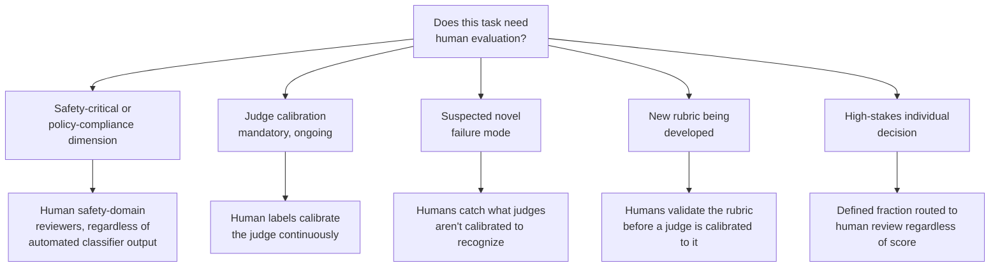
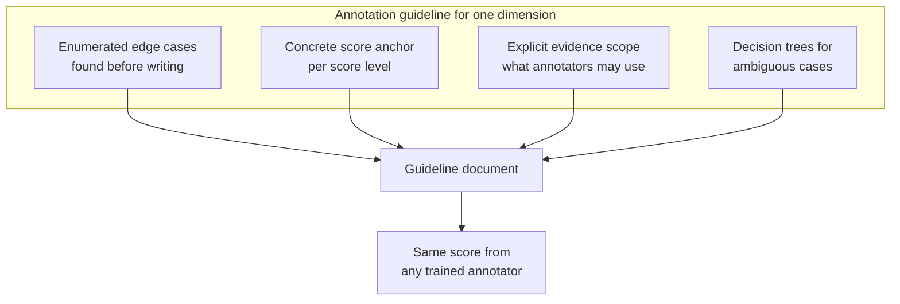
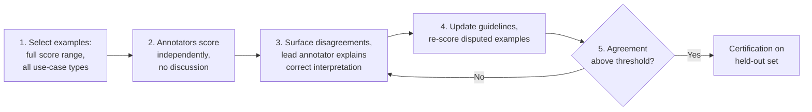
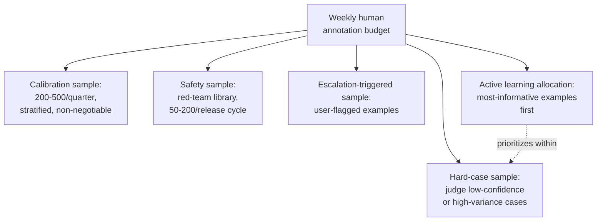
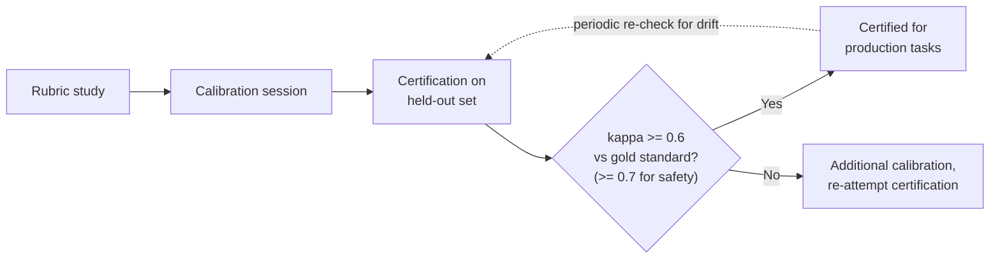
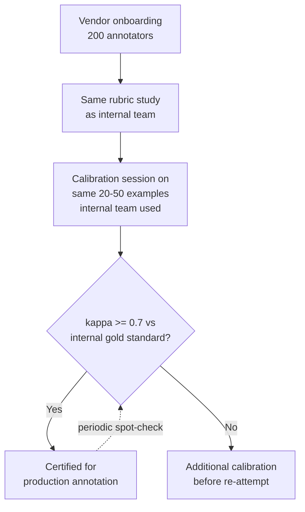

# Human Evaluation & Annotation

## Overview

[LLM-as-Judge](03-llm-as-judge.md) exists to score at a volume no human team could sustain — but it is calibrated against, bootstrapped by, and ultimately accountable to human judgment. This chapter is about the piece that doesn't scale away: where human evaluation remains structurally necessary, how to design annotation guidelines that produce the same score from any two trained annotators looking at the same example, and how to measure — precisely, not impressionistically — whether that consistency is actually being achieved.

The unifying idea across this chapter is that **human judgment is only as valuable as its consistency.** An expert annotator whose scores can't be reproduced by a second expert annotator on the same example isn't producing ground truth, they're producing an opinion with a timestamp. Everything here — guideline design, calibration sessions, agreement metrics, sampling strategy — exists to convert individual human judgment into something reliable enough to calibrate an automated system against.

## Definition

**Human evaluation and annotation** is the practice of using trained human reviewers — domain experts or structured-rubric-trained generalists — to produce quality labels for AI system outputs, serving three distinct purposes: establishing ground truth to calibrate automated judges, reviewing cases automated systems are known to be unreliable on, and developing and validating the rubrics that automated evaluation depends on in the first place. It is not a volume-scoring mechanism — see [LLM-as-Judge](03-llm-as-judge.md) for why — it is the trust anchor the rest of the eval system is built on.

## When Human Eval Is Still Required Despite LLM-as-Judge



**Safety-critical and policy-compliance dimensions.** Judge models have their own blind spots in exactly the areas where correct judgment matters most — a judge may not recognize a subtle jailbreak, may incorrectly refuse a legitimate medical information request, or may miss a culturally offensive response pattern it was never trained to recognize. Final-pass safety evaluation before a major release should include human reviewers with safety domain expertise, regardless of what the automated safety classifier reports — the classifier's output is an input to the decision, not the decision itself.

**Judge calibration — mandatory, ongoing.** Human labels are the ground truth that makes LLM-as-judge trustworthy in the first place. Remove human calibration and the feedback loop that catches judge drift disappears with it. This is a structural requirement of running a judge at all, not an optional quality improvement layered on top.

**Novel failure modes.** An LLM judge can only reliably score quality failures it's calibrated to recognize. A genuinely novel failure mode — a new jailbreak technique, an unexpectedly harmful use case that emerged as the product grew, a cultural nuance specific to a newly entered market — won't be in the calibration set and won't be scored correctly by the judge. Human reviewers catch these precisely because they aren't bounded by a fixed training distribution the way a judge is.

**Rubric development.** When building a new eval rubric, human annotators must develop and validate it before an LLM-as-judge can be meaningfully calibrated to it. A rubric that trained human annotators cannot apply consistently is a rubric that shouldn't be deployed to a judge at all — the inconsistency will show up as low inter-annotator agreement, which is detectable and fixable at the rubric design stage, rather than discovered later as unexplained judge unreliability.

**High-stakes individual decisions.** For products where a single response has serious real-world consequences — medical information, legal guidance, financial advice — some fraction of responses warrant human review regardless of automated scores. That fraction and its routing criteria should be defined explicitly: not "all medical responses," but "responses that trigger a specific classifier indicating potential clinical significance," so the routing is a deliberate, auditable decision rather than an ad hoc judgment call.

## Annotation Guideline Design

Annotation guidelines are the single highest-leverage point in human eval quality — better guidelines improve every downstream number (agreement rate, calibration quality, certification pass rate) more than any other lever available.

**The design goal**: guidelines that produce the same score from any trained annotator on the same example. This is achievable, but only if the guidelines eliminate ambiguity at the *decision* level, not just at the *conceptual* level — a guideline that explains the concept of "helpfulness" in the abstract does nothing for the annotator staring at a specific ambiguous case and needing to pick a number.



**Decompose before you write.** For each rubric dimension, enumerate the edge cases and ambiguities *before* writing the guideline text. Every genuinely ambiguous case left unresolved in the written guidelines will manifest as inter-annotator disagreement at scale — the guideline-writing process is where that ambiguity is cheap to catch; production annotation is where it's expensive to discover.

**Concrete score anchors.** For every score level on every dimension, provide a concrete example that would actually receive that score: "4/5 on accuracy: the response correctly answers the main question but contains one secondary factual error that doesn't invalidate the main answer. Example: [an actual example from the task domain]." Generic descriptors like "somewhat correct" produce no measurable improvement in inter-annotator agreement over having no anchor at all — the anchor has to be concrete enough that two different annotators would recognize the same example as matching it.

**Evidence scope definition.** Tell annotators exactly what evidence they're allowed to use. For faithfulness scoring specifically: "score based only on whether the response accurately reflects the provided context — do not use your own external knowledge to judge whether the response is factually correct." Annotators who bring in outside knowledge for a faithfulness dimension produce scores that are simply not comparable to annotators who stuck to the defined scope, even if both are individually "reasonable."

**Explicit decision trees for edge cases.** Edge cases are exactly where inter-annotator agreement collapses without explicit guidance. Write the decision tree out: "If the response correctly answers the stated question but is irrelevant to the user's apparent intent (deduced from context), score helpfulness as [X] because [Y]." If a decision tree can't be written for a given edge case, that's a signal the rubric dimension itself may need to be decomposed further, not that the edge case should be left to annotator judgment.

**What not to do:**

- Don't score multiple dimensions simultaneously on a single screen — the cognitive load of juggling several rubrics at once measurably reduces inter-annotator agreement compared to one dimension per screen.
- Don't ask for holistic quality ratings without decomposed dimensions first — this reproduces exactly the inconsistency problem covered in [Rubric Design for Consistent Grading](03-llm-as-judge.md#rubric-design-for-consistent-grading) in Ch03, on the human side this time.
- Don't deploy guidelines to production before running a calibration session to validate them.

## Calibration Sessions

Calibration sessions are the highest-leverage quality investment in the entire human eval pipeline — more valuable per hour spent than writing more guideline text in isolation, because they surface exactly the ambiguities guideline-writing alone misses.

**What they are**: before deploying a new annotation rubric to production, all annotators score the same 20-50 examples together, and disagreements are reviewed live.

**The goal is not agreement on every example** — some examples are genuinely hard, and forcing artificial consensus on those corrupts the process. The goal is resolving ambiguities in the *guidelines* before they scale. Every disagreement surfaced in a calibration session is a guideline ambiguity that, left unresolved, would have shown up across thousands of production annotations instead of twenty.



**The calibration session process**: (1) select examples that cover the full score range and all important use-case types, not just easy or typical cases; (2) annotators score independently, with no discussion, to get an honest read on natural disagreement before anchoring on each other's opinions; (3) disagreements are surfaced and discussed — the lead annotator explains the correct interpretation and updates the guidelines on the spot to prevent the same disagreement from recurring; (4) annotators re-score the disputed examples under the updated guidelines; (5) if agreement is still below threshold, repeat the cycle rather than declaring the guidelines finished prematurely.

**Certification before production**: after the calibration session, annotators score a *held-out* set — not the calibration set itself, to avoid measuring memorized answers instead of real understanding — independently. Annotators who score above an agreement threshold (Cohen's kappa ≥ 0.6 versus the gold standard) are certified for production tasks. Annotators below threshold get additional calibration before being allowed on production work.

## Inter-Annotator Agreement Metrics

Agreement metrics turn "do our annotators agree" from an impression into a number that can be tracked, thresholded, and alerted on.

**Percent agreement (P_o)**: the fraction of examples where all annotators gave the same score. Easy to understand, but inflated by chance agreement on common scores — if 90% of examples genuinely deserve the same score, two annotators randomly guessing would still show high percent agreement. Use it as a supplement to, never a replacement for, kappa.

**Cohen's kappa (κ)**:

```
κ = (P_o - P_e) / (1 - P_e)
```

where P_o is observed agreement and P_e is the probability of agreement expected by chance. Kappa corrects for exactly the inflation percent agreement is vulnerable to.

| κ range | Interpretation |
|---|---|
| < 0.2 | Poor |
| 0.2 - 0.4 | Fair |
| 0.4 - 0.6 | Moderate |
| 0.6 - 0.8 | Substantial |
| > 0.8 | Near-perfect |

For a production annotation rubric, target **κ ≥ 0.6**. For safety evaluation rubrics specifically, target **κ ≥ 0.7** — the higher bar reflects that a safety dimension being ambiguous between annotators is a more expensive kind of ambiguity than a tone dimension being ambiguous. Kappa's core limitation: it assumes exactly two annotators. For more than two, use **Fleiss's kappa**, the multi-annotator generalization.

**Weighted kappa**: for ordinal scales (1-5, 1-10) where a disagreement of ±1 should be penalized less than a disagreement of ±3. Standard Cohen's kappa treats all disagreements as equally bad, which misrepresents ordinal quality scores where "4 vs 5" is a much smaller disagreement than "1 vs 5."

**Krippendorff's alpha**: the most general agreement metric available — it handles multiple annotators, ordinal scales, missing data, and continuous ratings in one unified framework, and is more appropriate than kappa for complex annotation setups with varying annotator panels across examples (which is common in practice, since not every annotator scores every example). Interpretation: **α > 0.8** for high-stakes annotation, **α > 0.67** acceptable for exploratory work.

**Intraclass correlation coefficient (ICC)**: for continuous rating scales, ICC measures what fraction of total score variance reflects real quality differences between examples (signal) versus differences between annotators (noise). **ICC(2,1)**, from a two-way random-effects model, is the standard choice for measuring absolute agreement between two annotators rather than mere rank correlation.

| Metric | Best for | Handles multiple annotators | Handles ordinal penalty |
|---|---|---|---|
| Percent agreement | Quick sanity check, never standalone | No (pairwise or naive extension) | No |
| Cohen's kappa | Two-annotator categorical agreement | No (use Fleiss's kappa) | No |
| Weighted kappa | Two-annotator ordinal scales | No | Yes |
| Krippendorff's alpha | Complex, varying-panel setups | Yes | Yes |
| ICC(2,1) | Continuous rating scales | Extends to multiple raters | N/A (continuous) |

**What low agreement tells you, and how to respond**: low kappa usually means one of two things. Either **rubric ambiguity** — fix the guidelines and run another calibration session — or **domain mismatch** — the annotators don't have sufficient domain expertise for the task, which means upgrading annotator qualifications rather than tweaking the rubric further. Genuinely hard examples, where even expert humans disagree, should be marked as ambiguous — useful for calibration research, but excluded from hard-gate ground-truth labels, exactly as covered in [LLM-as-Judge](03-llm-as-judge.md#calibration-against-human-labels) for the "both sometimes right" case.

## Sampling Strategy: Allocating the Human Annotation Budget

**What fraction of traffic needs human eyes?** Not most of it. Human annotation serves calibration, hard-case review, safety audit, and rubric development — it does not scale to full-traffic scoring, and trying to make it do so is exactly the mistake LLM-as-judge exists to prevent. The real question is: given N human annotations per week, how should they be allocated?



- **Calibration sample**: 200-500 examples per quarter, stratified to cover all rubric dimensions and use-case types. Used to compute the judge/human agreement rate from [LLM-as-Judge](03-llm-as-judge.md#calibration-against-human-labels). Non-negotiable — this is the allocation that keeps the entire automated eval system trustworthy.
- **Hard-case sample**: examples where the LLM-as-judge expressed low confidence (if the judge outputs one) or where judge scores have historically shown high variance. Route these to human review proportional to their historical disagreement rate, not uniformly.
- **Safety sample**: a stratified sample from the red-team prompt library, always human-reviewed regardless of what the automated safety classifier reports. Typically 50-200 examples per release cycle, scaled to how high-stakes the product is.
- **Escalation-triggered sample**: any example a user explicitly flagged (thumbs-down, support escalation, explicit feedback form) should be human-reviewed to validate the user's concern and, once confirmed, feed into the golden set via the [offline-to-online feedback loop](02-offline-vs-online-evaluation.md#the-offline-to-online-feedback-loop).
- **Active learning allocation**: rather than uniform random sampling for calibration, prioritize the most informative examples — those where the judge is uncertain, where the example falls in an input cluster with a historically high judge/human disagreement rate, or where the example resembles a known failure mode. Active learning allocation produces measurably more improvement per annotation dollar than uniform random sampling, because it concentrates scarce human attention exactly where it changes the calibration outcome the most.

## Annotator Types and Management

**Domain experts vs. trained general annotators.** Domain expertise is required when judging factual accuracy in a specialized domain — medical, legal, financial, security — where an error is subtle enough that only someone with the relevant background reliably catches it. Trained general annotators with structured, well-anchored rubrics are sufficient for tone, fluency, format compliance, and rough helpfulness — dimensions where the judgment doesn't depend on specialized background knowledge, only on consistent rubric application.



**Annotator onboarding**: rubric study → calibration session → certification on a held-out set → production tasks. The certification threshold should be revisited if average annotator performance drifts over time — **annotator drift**, where individual annotators gradually shift their interpretation of a rubric over a long engagement, is a real, observed phenomenon, not a hypothetical risk, and periodic re-certification catches it before it silently degrades label quality.

**Disagreement adjudication**: when annotators disagree on a live example, the options are majority vote (requires ≥3 annotators per example), escalation to a senior annotator or domain expert, or marking the example as ambiguous. Majority vote is appropriate for moderate-certainty dimensions where a clean 2-1 split is a reasonable resolution mechanism. Escalation is required for safety-critical dimensions, or for examples where a majority vote is split 2:1 but the stakes are high enough that a bare majority isn't a confident enough basis for a final label. Ambiguous labeling has real value — these examples are useful for calibration research — but should never be used as ground truth in the regression gate, since a label the humans themselves couldn't agree on isn't a reliable target to gate releases against.

**Third-party annotation vendors**:

| Vendor | Profile |
|---|---|
| Scale AI | Fastest turnaround, enterprise SLA, most expensive, specialized safety evaluation teams available |
| Labelbox | Annotation tooling plus managed workforce |
| Argilla / Label Studio | Self-hosted, free, requires your own annotator workforce |

Sending production transcripts to a third-party vendor has real data-handling implications: **PII scrubbing is mandatory**, data handling agreements are required, and sensitivity tiers should route only non-sensitive data to external vendors — the same access-control and audit discipline that applies to any system touching production data, covered in [LLM Evaluation Architecture](01-llm-evaluation-architecture.md#security). External annotator teams also need the **same calibration sessions and certification process** as internal annotators — a vendor relationship doesn't substitute for validating that the vendor's annotators actually apply your rubric consistently; skipping that step because "they're professionals" is a common and costly assumption.

## Tradeoffs

| Advantages | Disadvantages |
|---|---|
| The only source of true ground truth for calibrating automated judges | Cannot scale to full production volume ($0.30-$1.25/judgment makes full-traffic scoring infeasible) |
| Catches novel failure modes outside any judge's calibration | Slow relative to LLM-judge throughput — 40-80/hour versus 100-1,000/minute |
| Required for developing and validating new rubrics before judge calibration | Annotator drift and inter-annotator disagreement require ongoing management, not a one-time setup |
| Domain experts catch subtle errors a judge structurally cannot | Domain-expert annotators are expensive and often capacity-constrained |
| Provides the auditable trail needed for high-stakes individual review | Third-party vendor use introduces data-handling and calibration overhead |

## Scalability

- **Human throughput**: 40-80 judgments/hour per annotator at $20-50/hour fully-loaded cost, translating to $0.30-$1.25 per judgment — sized for calibration and hard-case review, not bulk production scoring (see [LLM-as-Judge](03-llm-as-judge.md#why-llm-as-judge-replaced-human-eval-for-scale) for the full cost comparison).
- **Calibration sample sizing**: 200-500 stratified examples per quarter is sufficient to compute a statistically meaningful judge/human agreement rate without re-annotating the full golden set.
- **Certification threshold**: Cohen's kappa ≥ 0.6 against a gold standard for general production annotation, ≥ 0.7 for safety-critical rubrics — annotators below threshold require additional calibration before production work.
- **Calibration session size**: 20-50 examples is enough to surface the guideline ambiguities that would otherwise scale into thousands of inconsistent production labels.

## Reliability

| Failure | Degradation strategy |
|---|---|
| Annotator drift over a long engagement | Periodic re-certification against the gold-standard held-out set, not just at initial onboarding |
| Low inter-annotator agreement discovered mid-production | Pause production annotation on the affected dimension, run a new calibration session, update guidelines, re-certify before resuming |
| Guideline ambiguity surfaces only after production annotation has begun at scale | Treat any recurring disagreement pattern as a guideline gap; update guidelines and back-annotate affected examples rather than letting the ambiguity persist |
| Third-party vendor annotators produce inconsistent labels versus internal team | Apply the same calibration session and certification process to vendor annotators as internal ones; don't assume vendor professionalism substitutes for rubric-specific calibration |
| Safety-critical dimension has insufficient annotator coverage | Maintain a minimum bench of certified safety-domain reviewers, sized against a defined release-cycle review volume, not ad hoc availability |
| Majority-vote adjudication produces a low-confidence label on a high-stakes example | Escalate 2:1 splits on high-stakes examples to a senior annotator or domain expert rather than accepting the bare majority |

## Cost Optimization

- **Reserve human annotation for what only humans do well** — calibration, disagreement adjudication, safety-critical edge cases, rubric development — not bulk scoring, where annotation cost explodes fastest relative to value.
- **Use active learning allocation instead of uniform random sampling** for calibration and hard-case review — it produces more improvement per annotation dollar by concentrating human attention on the most informative examples.
- **Route hard-case and escalation-triggered samples proportionally to their historical disagreement or failure rate**, not by flat quota, so annotation budget follows where the signal actually is.
- **Use general annotators wherever domain expertise isn't strictly required** — tone, fluency, and format-compliance dimensions don't need the premium cost of domain-expert annotators.
- **Batch calibration sessions on a quarterly cadence rather than ad hoc** — this amortizes the fixed cost of assembling annotators and reviewing disagreements live, versus running smaller, less efficient sessions more frequently.

## Monitoring

- **Judge/human agreement rate**, computed from the calibration sample — the primary SLI human annotation exists to produce, feeding directly into [LLM-as-Judge](03-llm-as-judge.md#calibration-against-human-labels).
- **Inter-annotator agreement (kappa, weighted kappa, or Krippendorff's alpha depending on setup)**, tracked per rubric dimension, not just in aggregate — a dimension-specific dip is exactly what an aggregate number hides.
- **Annotator certification status and re-certification cadence** — a roster where certifications are stale is a roster whose current label quality is unverified.
- **Annotation budget allocation across calibration, hard-case, safety, and escalation samples** — tracked against the target allocation to catch budget silently drifting toward whichever category is loudest that week.
- **Disagreement and adjudication rate** — a rising rate on a specific dimension is an early guideline-ambiguity signal, worth catching before it shows up as a kappa drop in the next scheduled calibration check.
- **Vendor annotator agreement rate**, tracked separately from internal annotators, to catch a vendor relationship degrading in quality before it silently pollutes the golden set.

## Production Best Practices

- Write annotation guidelines with concrete, domain-specific score anchors for every level of every dimension — abstract descriptors produce no measurable gain in consistency.
- Run a calibration session before deploying any new rubric to production, and treat unresolved disagreement in that session as a guideline defect to fix, not a data point to tolerate.
- Certify annotators against a held-out set, separate from the calibration set, and re-certify periodically to catch annotator drift before it degrades label quality silently.
- Track inter-annotator agreement per dimension, using the metric suited to the scale type (Cohen's or Fleiss's kappa for categorical, weighted kappa or Krippendorff's alpha for ordinal, ICC for continuous) — never rely on percent agreement alone.
- Allocate the human annotation budget deliberately across calibration, hard-case, safety, and escalation samples, using active learning to prioritize within each category rather than uniform random sampling.
- Apply the same calibration and certification bar to third-party vendor annotators as to internal ones, and route only non-sensitive data externally, with PII scrubbing enforced before any transcript leaves internal systems.
- Mark genuinely ambiguous examples — where even calibrated experts disagree — as ambiguous rather than forcing a confident label; use them for research, exclude them from the hard regression gate.

## Interview Questions

### Beginner

**Q: Why can't human evaluation simply replace LLM-as-judge for production-scale scoring?**
Cost and throughput. A trained annotator completes roughly 40-80 judgments/hour at $20-50/hour, working out to $0.30-$1.25 per judgment — at 100,000 samples/day that's $30,000-$125,000/day, which isn't sustainable as a standing cost. Human evaluation is reserved for calibration, hard-case review, rubric development, and safety-critical spot checks — the roles only humans can fill — not bulk production scoring.

**Q: What's the difference between percent agreement and Cohen's kappa, and why does it matter which one you report?**
Percent agreement is simply the fraction of examples where annotators gave the same score, but it's inflated by chance agreement — if most examples naturally deserve the same score, even random guessing produces high percent agreement. Cohen's kappa corrects for that by subtracting out the agreement expected by chance, so it more accurately reflects real annotator consistency. Reporting percent agreement alone can make a genuinely unreliable rubric look fine.

### Intermediate

**Q: You're designing a new rubric dimension and the guideline says "somewhat helpful" for a 3/5 score. Why is this a problem, and how do you fix it?**
"Somewhat helpful" is an abstract descriptor, not a concrete anchor — it gives two different annotators no shared reference point for what actually qualifies. It should be replaced with a concrete example from the task domain that would receive a 3/5, along with the specific reasoning for why. Abstract descriptors measurably fail to improve inter-annotator agreement over having no anchor at all, while concrete anchors do.

**Q: Two annotators disagree on a safety-critical example, splitting 2:1 with a third annotator. How do you adjudicate, and why not just take the majority?**
Escalate to a senior annotator or domain expert rather than accepting the bare majority. For safety-critical dimensions specifically, a 2:1 split isn't confident enough to trust as a final ground-truth label — the cost of a wrong safety label is high enough that the extra adjudication step is worth it, whereas for a moderate-certainty dimension like tone, majority vote alone would be an acceptable resolution.

### Senior

**Q: Your team's rubric shows a Cohen's kappa of 0.35 on the accuracy dimension. Walk through your diagnosis and fix.**
A kappa of 0.35 falls in the "fair" range — well below the 0.6 production target — so I'd first check whether this is a rubric ambiguity or a domain-mismatch problem. I'd review disagreement examples for a pattern: if annotators are inconsistently applying the same rubric text to similar cases, that's a guideline gap, fixed by decomposing the ambiguous edge cases into explicit decision trees and running a new calibration session. If instead the disagreements cluster around examples requiring specialized domain knowledge the current annotators don't have, that's a qualification mismatch, fixed by involving domain experts rather than further rubric editing. I would not treat 0.35 as acceptable "genuine difficulty" without first ruling out both of these more common and more fixable causes.

**Q: When would you choose Krippendorff's alpha over Cohen's kappa for measuring agreement?**
Cohen's kappa assumes exactly two annotators scoring every example. In practice, many annotation setups have a varying panel — not every annotator scores every example, panel composition changes over time, and the scale might mix ordinal and continuous elements. Krippendorff's alpha handles all of that in one unified framework — multiple annotators, missing data, ordinal or continuous scales — making it the more appropriate choice for a mature, complex annotation pipeline, while Cohen's kappa remains a reasonable, simpler choice for a clean two-annotator, categorical setup.

### Staff

**Q: You're scaling from 5 internal annotators to a 200-person third-party vendor team for a safety-critical rubric. What's your rollout plan, and what could go silently wrong if you skip steps?**
I'd run the exact same pipeline the internal team went through: rubric study, a calibration session with a representative subset of the vendor team scoring the same 20-50 examples the internal team calibrated on, and certification against the internal gold-standard held-out set before any vendor annotator touches production work. I'd also set a higher bar given the safety-critical nature — kappa ≥ 0.7 against the gold standard, not the general 0.6 threshold — and require ongoing spot-check re-certification, since a 200-person team will have more turnover and more opportunity for drift than a 5-person internal team. What goes silently wrong if this is skipped: vendor teams are professionals, but "professional" doesn't mean "calibrated to this specific rubric" — without the calibration and certification step, you could onboard 200 annotators producing labels that look production-ready by volume but are quietly inconsistent with the ground truth your judge is calibrated against, and you likely wouldn't discover it until a safety regression the vendor's labels should have caught actually ships.



## Google-Level Follow-Ups

- "Your calibration sample shows 84% judge/human agreement in aggregate. What's the next question you ask before declaring the judge trustworthy?" — probes whether the candidate breaks the aggregate down by rubric dimension and use-case slice rather than accepting one number; an aggregate can mask a specific dimension sitting well below threshold.
- "An annotator has been certified for eight months with no re-certification. What's the risk, and how would you detect it without re-running a full calibration session?" — probes for awareness of annotator drift as a real phenomenon and for a lightweight detection mechanism (periodic spot-check against a small held-out gold set) rather than requiring a full session every time.
- "You have a fixed weekly human annotation budget. A product manager wants more calibration samples; a safety lead wants more red-team review. How do you decide?" — probes for a principled allocation framework (calibration is non-negotiable because it underwrites every judge-derived number system-wide; safety sampling has an absolute floor tied to release-cycle risk) rather than an arbitrary split, and for recognizing these aren't purely competing — under-investing in calibration degrades the trustworthiness of every other automated signal, including the ones the safety lead relies on.
- "Why might forcing 100% inter-annotator agreement on a calibration set actually indicate a problem with the calibration set itself, not annotator skill?" — probes for the insight that some examples are genuinely ambiguous even to well-calibrated experts; a calibration set engineered to produce perfect agreement may have selected only easy, non-representative examples, which defeats the purpose of calibration in the first place.

## Common Mistakes

- **Writing abstract rubric descriptors ("somewhat correct") instead of concrete score anchors** — this produces no measurable improvement in inter-annotator agreement over having no anchor at all.
- **Reporting percent agreement without kappa** — percent agreement is inflated by chance agreement on common scores and can make an unreliable rubric look consistent.
- **Skipping calibration sessions to save time before deploying a new rubric** — every disagreement a calibration session would have caught in twenty examples instead surfaces across thousands of production annotations.
- **Treating third-party vendor annotators as pre-calibrated because they're professionals** — vendor teams need the same calibration session and certification process as internal annotators; skipping it risks quietly inconsistent labels at scale.
- **Never re-certifying annotators after initial onboarding** — annotator drift is a real, observed phenomenon over long engagements, and a stale certification doesn't verify current label quality.
- **Forcing a confident majority-vote label on genuinely ambiguous examples instead of marking them ambiguous** — this corrupts the regression gate with ground-truth labels the humans themselves couldn't agree on.

## Key Takeaways

- Human evaluation is not a volume-scoring mechanism — it exists for judge calibration, novel failure mode detection, rubric development, and safety-critical or high-stakes review, roles an LLM judge structurally cannot fill on its own.
- Annotation guideline quality — decomposed dimensions, concrete score anchors, explicit evidence scope, decision trees for edge cases — is the highest-leverage lever on annotation consistency, more than annotator skill alone.
- Calibration sessions surface guideline ambiguity cheaply, on 20-50 examples, before it scales into inconsistency across thousands of production annotations.
- Cohen's kappa (two annotators, categorical), Fleiss's kappa (multiple annotators), weighted kappa (ordinal), Krippendorff's alpha (complex/varying panels), and ICC (continuous scales) each fit a different agreement-measurement scenario — using the wrong one, or relying on raw percent agreement, produces a misleading consistency number.
- The human annotation budget should be deliberately allocated across calibration (non-negotiable), hard-case review, safety sampling, and escalation-triggered review, with active learning prioritizing the most informative examples within each category.
- Annotator management is ongoing, not one-time — onboarding through calibration and certification, with periodic re-certification to catch annotator drift, and the same rigor applied to third-party vendor annotators as to internal ones.
- Genuinely ambiguous examples, where calibrated experts disagree, have real research value but should never be used as ground truth in a hard regression gate.

---

*Part of [Evaluation](index.md) in the [AI System Design Notes](../index.md). Previous: [LLM-as-Judge](03-llm-as-judge.md). Next: [Regression Testing for LLMs](05-regression-testing-for-llms.md).*
