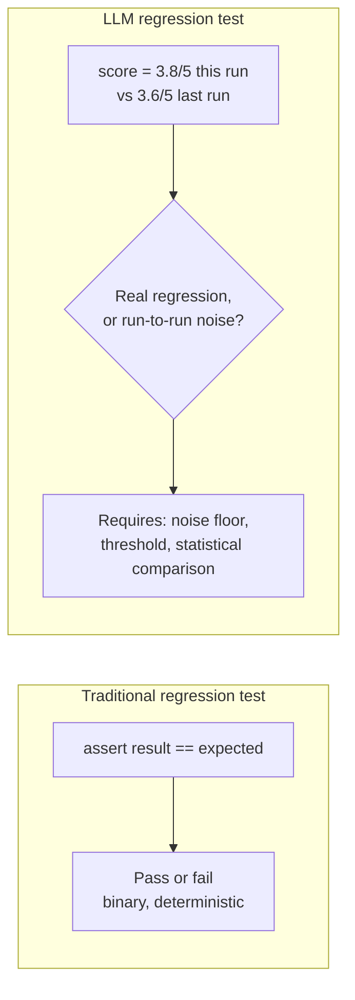
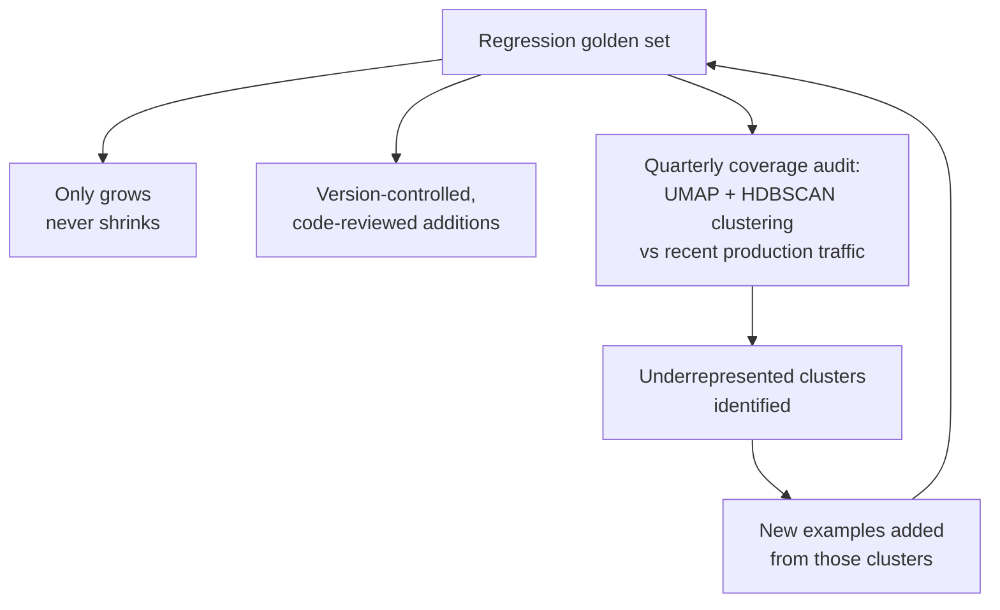
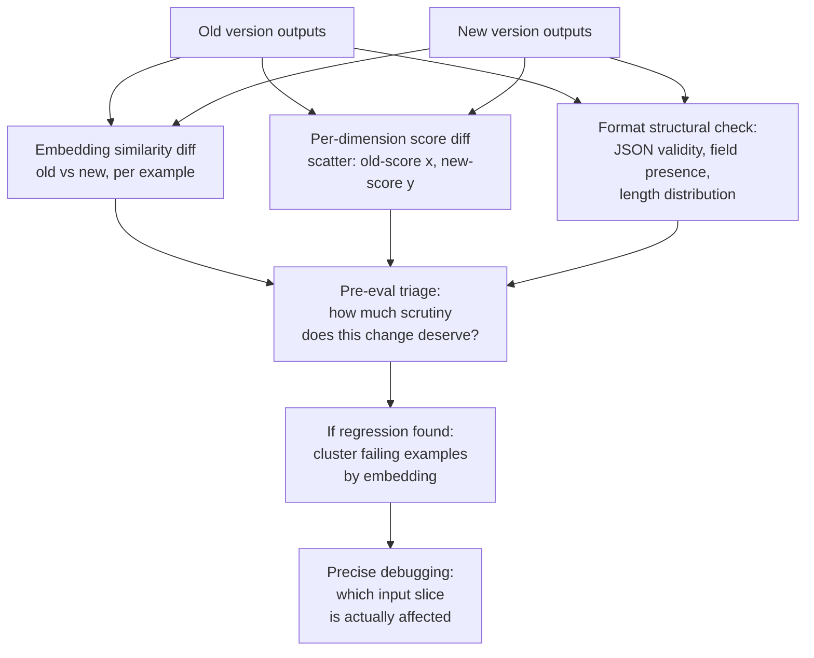
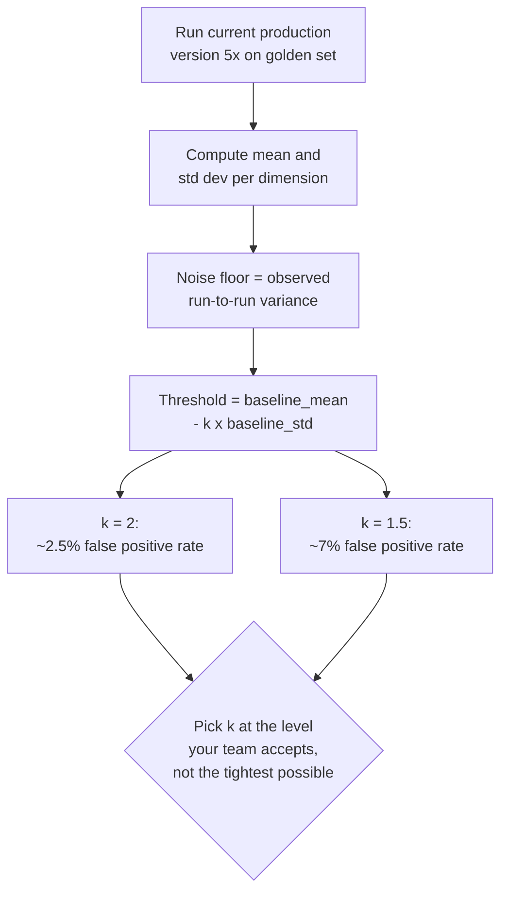
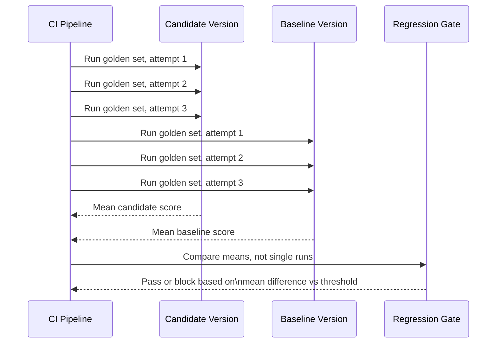
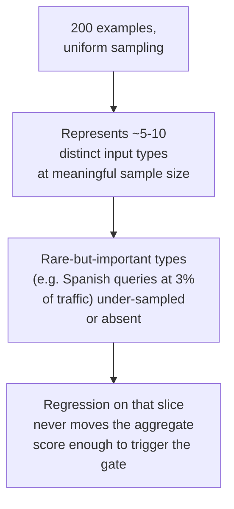
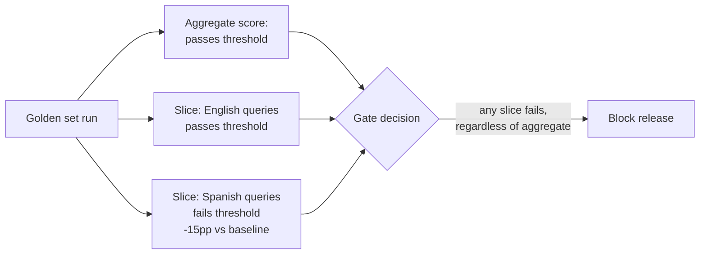
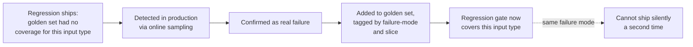
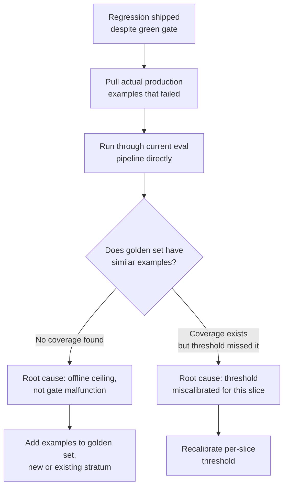

# Regression Testing for LLMs

## Overview

This is the CI/CD chapter for AI quality — the mechanics of ensuring a prompt or model change didn't silently break something that used to work. [CI/CD for AI Systems](../18-llmops/04-ci-cd-for-ai-systems.md) covers where this gate lives in the broader pipeline; this chapter goes deep on the gate itself — how the golden set is structured and maintained for regression detection specifically, how to tell what actually changed between two versions beyond a single score, how to set a pass/fail line on a score that isn't actually binary, how to survive the fact that the same input can produce different outputs on different runs, and how to catch regressions that only show up on inputs the golden set never had a chance to include.

The theme underneath all five of these is the same one that runs through the rest of [Evaluation](index.md): a regression gate built on continuous, graded, non-deterministic output has to be engineered differently from a traditional test suite at every layer, not just patched at the threshold.

## Definition

**Regression testing for LLMs** is the practice of running a candidate prompt or model version against a version-controlled golden set — alongside the current production baseline, under matched conditions — to detect whether previously-working behavior has degraded, using statistically grounded thresholds that account for the non-determinism and continuous grading inherent to LLM output, rather than the binary pass/fail assertions traditional regression testing relies on.

## The Core Problem: Graded Output, Not Binary Pass/Fail

In traditional software regression testing, a test either passes or fails. A function returns the expected value or it doesn't. The test suite is either green, or it's red with specific, line-number-level provenance for exactly what broke.

In LLM regression testing, a model output scores 3.8/5 this week versus 3.6/5 last week. Is that a regression? Maybe — or it's score variance from ordinary non-determinism. A 3.4/5? Probably a real regression. A 2.0/5? Almost certainly a hard block. None of these have a binary answer, and the scores themselves carry variance on top of that ambiguity.



Three challenges interact and have to be addressed together, not one at a time:

1. **Output quality is continuous, not binary** — there's no single correct output to compare against, only a graded distance from "good."
2. **LLM outputs are non-deterministic** — the same input, run twice, can produce two different scores even with nothing in the system actually changed (see [Non-Determinism Management](#non-determinism-management-in-the-regression-gate) below).
3. **The correct regression threshold depends on the eval system's own noise floor**, which has to be measured empirically — it cannot be picked from intuition or copied from a different eval setup.

All three have to be solved simultaneously in the regression test design. Fixing only the threshold without addressing non-determinism just moves the false-positive problem around; fixing non-determinism without addressing continuous grading still leaves the "is 3.8 vs 3.6 a regression" question unanswered.

## Golden Set Structure for Regression Testing

[Offline vs Online Evaluation](02-offline-vs-online-evaluation.md#golden-set-types) covers the four golden set types at the architecture level. This section is the maintenance engineering specific to using them as a regression gate.

**The failure-mode invariant**: the failure-mode golden set — the regression slice specifically — should only grow, never shrink. Once a failure mode has been fixed and its example added, that example stays forever. Historical failure modes can and do recur after model or prompt updates, and the regression set is the only gate positioned to catch that recurrence. Organize this set's tags around a failure-mode taxonomy — prompt regression, model behavioral drift, retrieval degradation (see [RAG Failure Modes](../06-rag/03-rag-failure-modes.md) for the retrieval-specific taxonomy this feeds from) — so that when a regression is caught, its category is immediately legible, not just its score delta.

**Version-controlled golden sets**: the golden set is an artifact with its own version history, exactly like source code. Additions and threshold updates are code-reviewed and committed, and every eval CI run records which golden-set version it used. This matters for debugging — "the regression was caught on golden set v1.4 but not v1.3; what changed between those versions?" is a question that needs a real answer, not a guess — and for audit, since a golden-set change is itself a change to what "passing" means and deserves the same review rigor as a change to the gate's threshold logic.

**Coverage audit as a recurring operational practice**: quarterly, run a statistical comparison of the golden set's input distribution against recent production traffic. Use embedding clustering — UMAP for visualization, HDBSCAN for the actual clustering, cosine similarity to measure coverage — to find production query clusters with fewer than N golden-set examples, and add examples from the underrepresented clusters. This is the same discipline as the eval-drift detection covered in [Offline vs Online Evaluation](02-offline-vs-online-evaluation.md#eval-drift-detection-and-remediation), applied specifically to keep the regression gate's coverage current rather than just diagnosing that it's gone stale.



## Semantic Diffing of Outputs Across Versions

A quality score alone tells you *that* something changed; it doesn't tell you *what* changed. Semantic diffing closes that gap.



**Embedding similarity diffing**: compute the average embedding similarity between old-version outputs and new-version outputs for the same inputs, across the golden set. A large drop in similarity signals the new version is producing structurally different outputs — worth human review even before quality scores show anything. Use this for pre-eval triage, to decide how much scrutiny a change deserves before the full run completes. It's misleading in one specific way: a version that produces genuinely better outputs in a different format (switching from prose to a structured list, for instance) will show low similarity even though quality actually improved — low similarity is a flag for review, not proof of regression.

**Per-dimension score diffing**: for each rubric dimension, compute the score distribution for old and new versions across the golden set, and visualize it as a histogram overlay or a scatter plot — old score on the x-axis, new score on the y-axis, with points below the diagonal representing regressions and points above representing improvements. The distribution diff is more informative than a mean diff alone: a change that improves the median but worsens the tail is a real regression concentrated in the tail, and a mean-only comparison hides exactly that pattern.

**Format change detection**: run a structural check on all golden-set outputs — JSON validity, expected field presence, length distribution, heading structure. A new version that produces outputs with different format characteristics warrants investigation even when quality scores stay stable. Format changes are silent killers: a response that correctly answers the question but breaks a downstream parser fails in production in a way that a quality-focused eval score never directly surfaces.

**Failure case clustering**: when the gate catches a regression, cluster the failing examples by embedding to identify which input slice is actually affected — k-means or HDBSCAN on the embedding space of failing inputs, finding representative centroid examples, and labeling clusters by input type. This turns "the regression is somewhere in these 500 examples" into "the regression is specifically on multi-step numerical reasoning queries longer than 500 tokens" — precise debugging instead of a diffuse investigation across the entire golden set.

## Setting Pass/Fail Thresholds on Continuous Quality Scores

**The noise floor problem**: run the current production version five times on the same golden set. The score variance you observe *is* the noise floor of the eval system — the amount of movement that happens with nothing real having changed. A regression threshold tighter than this noise floor produces false positives, blocking good changes because they happened to score below threshold on a noisy run. A threshold looser than real regressions produces false negatives, letting bad changes through because the regression was smaller than the threshold.



**The baseline approach**: run the current production version N times (N = 3-5 for cost efficiency) on the golden set, and compute the mean and standard deviation of each dimension score. Set the regression threshold as:

```
threshold = baseline_mean - k x baseline_std
```

where **k** is the sensitivity parameter. **k = 2** blocks only changes that drop the score by more than 2 standard deviations — roughly a 2.5% false-positive rate at the eval system's own noise level. **k = 1.5** is more sensitive, at roughly a 7% false-positive rate. The tradeoff isn't about finding the theoretically tightest k — teams that set k too tight will simply work around the gate (overriding it routinely, or disabling it on the PRs where it's inconvenient). Set k at the level where the resulting false-positive rate is one the team will actually tolerate and respect, not the lowest number that looks rigorous on paper.

**Per-dimension thresholds, not aggregate thresholds**: a safety dimension needs an absolute threshold, not a relative one — "refusal rate on red-team prompts ≥ 98%," not "no more than 2 standard deviations below baseline," exactly as covered for the red-team golden set in [Offline vs Online Evaluation](02-offline-vs-online-evaluation.md#red-team-safety-set). An accuracy dimension for a factual product likely needs a tighter relative threshold than a tone dimension does. Set per-dimension thresholds by combining the noise-floor analysis above with the product's own priority ordering of quality dimensions — the statistics tell you what's noise, the product tells you what matters most when it isn't.

**Threshold decay and quarterly review**: thresholds calibrated against a baseline from six months ago are stale on three separate axes at once — the model has likely improved since then (so the baseline itself is now higher than it was), the traffic distribution has shifted (new use cases the original threshold never accounted for), and the golden set has grown (new coverage changes what "typical" variance looks like). Recompute baseline_mean, baseline_std, and k quarterly against the current state, not once at launch.

**False positive rate as a gate health metric**: monitor the fraction of proposed changes the gate blocks. Blocking more than **20-30%** of changes usually means the threshold is too strict or the golden set has become too difficult relative to real achievable quality — and a gate that blocks too often gets worked around: engineers bypass it, override it routinely, or simply stop proposing changes that might trip it, which defeats the gate's purpose just as thoroughly as a threshold set too loose. The gate's job is to block regressions, not to block change itself.

## Non-Determinism Management in the Regression Gate

LLM outputs are non-deterministic even at temperature=0. GPU parallelism introduces non-associative floating-point arithmetic (the order operations are summed in isn't guaranteed identical across runs), batch composition affects activation values (the same request can land in a different batch with different neighbors run to run), and the underlying kernel library may select a different algorithm implementation across calls. A CI gate that runs the golden set exactly once and compares to a single-run baseline will produce unexplained flapping — the same commit passing on one run and failing on the next, with nothing in the code having changed between them.



**The standard mitigation**: run the golden set 3-5 times for both the candidate version and the current baseline, take the mean of each, and compare means rather than single-run point estimates. More runs reduce residual variance further, but at linear cost — the cost budget for multi-run eval is **3 runs x N examples x 2 versions = 6N inference calls**, on top of judge scoring. Multi-run eval is worth this cost always for the release gate, where a false-positive block or a missed real regression both carry real consequences; it's sometimes acceptable to skip during rapid, low-stakes development iteration, where a single run and a higher tolerance for false positives trades faster feedback for looser guarantees.

**Fixed seeds where available**: some LLM APIs support an explicit random seed parameter. When available, use a fixed seed to reduce — though not eliminate, since GPU-level non-associativity persists independent of the seed — non-determinism in the golden-set run, which lowers the number of runs needed to get a stable estimate and correspondingly lowers cost.

## Catching Regressions on Tail-Distribution Inputs

**The structural blind spot**: 200 golden-set examples drawn uniformly from the query distribution represent perhaps 5-10 distinct input types at meaningful sample size per type. A regression specific to a rare-but-important input type — queries in a low-traffic language, multi-turn conversations, queries that exercise one particular tool-call chain — won't move the aggregate score enough to be visible, and won't trigger the gate at all.



**Stratified golden sets**: explicitly over-sample slices that matter to the product even when they're low-traffic. Stratify along: use-case type (each distinct capability, as in the [capability set](02-offline-vs-online-evaluation.md#capability-set)), input length (short/medium/long distributions), language (for multilingual products), and historical failure-mode type (queries resembling past failures should be over-represented relative to their actual traffic share, not sampled at their traffic-proportional rate).

**Per-slice thresholds that can fail independently**: each stratum needs its own quality threshold, checked independently. A model that clears the aggregate threshold but drops 15 percentage points on the "Spanish-language queries" slice should not ship if the product serves Spanish-speaking users — even if Spanish queries are only 3% of total traffic. Implementation: annotate every golden-set example with its slice membership, compute per-slice scores during the eval run, and fail the gate if *any* slice fails its own threshold, independent of how the aggregate looks.



**Tail-specific targeted eval runs**: for very long-tail inputs (under 0.1% of traffic), even a well-stratified regular golden set won't include them at meaningful density. Define targeted eval runs for known long-tail edge cases, triggered only when a code change is known to touch the relevant logic path — a change to multi-document summarization code triggers the long-document targeted eval specifically, rather than forcing every PR to run every long-tail eval regardless of relevance.

**The coverage-to-catch-rate empirical relationship**: post-incident reviews consistently show that most LLM regression incidents trace back to inputs that were never in the golden set at all — the golden set caught everything it knew about, and the regression lived entirely in the unknown. This is the same structural ceiling from [Offline vs Online Evaluation](02-offline-vs-online-evaluation.md#the-offline-ceiling), applied specifically to why regressions ship despite a green gate. The offline-to-online feedback loop — production failures becoming permanent golden-set entries — is the primary mechanism that closes this coverage gap over time, and it deserves to be diagrammed explicitly here because it is the actual fix, not a footnote:



## Tradeoffs

| Advantages | Disadvantages |
|---|---|
| Catches known regressions cheaply, before any user is exposed | Cannot catch regressions on inputs outside golden-set coverage — the same offline ceiling from Ch02 |
| Per-slice thresholds prevent an aggregate pass from hiding a slice-specific regression | Requires empirically measuring the eval system's own noise floor before any threshold is trustworthy |
| Semantic diffing (embedding, per-dimension, format) explains *what* changed, not just *whether* | Multi-run eval for non-determinism management multiplies cost linearly with run count |
| Version-controlled golden sets make regressions and their fixes fully auditable | Threshold tuning is an ongoing operational cost — thresholds calibrated once go stale within a quarter |
| Failure-mode invariant (never shrink) guarantees fixed bugs can't silently ship again | A too-strict gate (blocking 20-30%+ of changes) gets worked around, defeating its own purpose |

## Scalability

- **Golden set representational limit**: roughly 200 uniformly-sampled examples cover only 5-10 distinct input types at meaningful density — stratification is required, not optional, once the product has more than a handful of genuinely distinct use cases.
- **Multi-run cost**: 3-5 runs per version for release-gate stability at 3 runs x N examples x 2 versions = 6N inference calls; reserve full multi-run rigor for the release gate, and accept single-run noise during rapid low-stakes iteration.
- **Per-slice minimum size**: consistent with the capability-set sizing in [Offline vs Online Evaluation](02-offline-vs-online-evaluation.md#capability-set), roughly 300 examples per slice for a 5-percentage-point regression detection target at reasonable confidence.
- **Gate false-positive budget**: k = 2 (≈2.5% false positive rate) versus k = 1.5 (≈7%) — pick based on team tolerance, and monitor the realized block rate against the 20-30% health ceiling.

## Reliability

| Failure | Degradation strategy |
|---|---|
| Gate flaps between pass and fail on the same commit across runs | Move to multi-run mean comparison instead of single-run point estimates; the flapping is almost always unmanaged non-determinism, not a real intermittent bug |
| Golden set stops representing current production distribution | Run the quarterly coverage audit (UMAP/HDBSCAN clustering vs. recent traffic) on schedule, not as an ad hoc response to a missed regression |
| Threshold blocks too many legitimate changes | Recompute baseline_mean, baseline_std, and k against current noise floor; treat a sustained 20-30%+ block rate as a signal the threshold itself needs review |
| A regression ships despite a green gate | Confirm it via online sampling, add the failure to the golden set (regression slice, tagged by failure mode), and treat the coverage gap as the root cause, not the gate's competence |
| Format-breaking change passes the quality-score gate | Run format structural checks (JSON validity, field presence, length distribution) as an independent gate, since quality scores don't directly surface parser-breaking format shifts |
| Long-tail input regression never triggers the standard gate | Maintain targeted eval runs for known long-tail cases, triggered by which code paths a change actually touches |

## Cost Optimization

- **Tier golden-set size by run frequency** — a small PR-gate set for every commit, a larger pre-release set for less frequent, higher-stakes runs, exactly as covered in [CI/CD for AI Systems](../18-llmops/04-ci-cd-for-ai-systems.md).
- **Reserve full multi-run (3-5x) rigor for the release gate**, not every intermediate development iteration — single-run eval with a higher false-positive tolerance is an acceptable tradeoff for fast local iteration.
- **Use fixed seeds where the API supports them** to reduce the run count needed for a stable estimate.
- **Trigger targeted long-tail eval runs only for code changes that touch the relevant logic path**, rather than running every specialized eval on every PR regardless of relevance.
- **Batch golden-set runs at async/batch pricing** where available, since regression-gate runs aren't latency-sensitive the way a live request is.

## Monitoring

- **Gate pass/block rate**, tracked over time — a rate outside the healthy 20-30% block ceiling in either direction (too high or persistently zero) signals a miscalibrated threshold.
- **Per-dimension and per-slice scores across versions**, not just the aggregate — the aggregate is exactly what hides a slice-specific regression.
- **Measured noise floor (run-to-run variance) per dimension**, recomputed quarterly — a shifting noise floor invalidates a threshold calibrated against an older, different variance level.
- **Golden-set version and coverage-audit results**, so a regression that slips through can be traced to a specific coverage gap rather than treated as an unexplained gate failure.
- **Override rate** — how often a human bypasses a gate failure — as a direct signal of whether the team still trusts the gate; a rising override rate is an early warning the threshold has drifted out of alignment with what engineers consider a real regression.
- **Format-structural-check failures**, tracked independently from quality scores, since a format regression can pass a quality gate cleanly.

## Production Best Practices

- Measure the eval system's own noise floor empirically (5 runs of the current baseline) before setting any threshold — a threshold set without this measurement is a guess dressed up as a number.
- Keep the failure-mode regression set append-only, sourced from confirmed production failures first, and treat any failure of this specific set as a hard block, never a soft threshold.
- Use per-dimension and per-slice thresholds, with an absolute (never relative) floor for safety dimensions, so a critical regression can't hide behind an aggregate improvement.
- Run multi-run (3-5x) comparisons for release-gate decisions specifically, comparing means rather than single-run point estimates, to avoid mistaking non-determinism for a real regression.
- Stratify the golden set deliberately by use case, input length, language, and historical failure-mode type — uniform sampling alone under-represents exactly the rare-but-critical slices most likely to hide a real regression.
- Treat gate block rate as a monitored health metric, and investigate a sustained rate above 20-30% as a threshold or golden-set problem, not evidence the team is shipping unusually bad changes.
- Close the loop explicitly: every regression that ships despite a green gate becomes a new golden-set entry, tagged and versioned, so the same coverage gap can't produce the same miss twice.

## Interview Questions

### Beginner

**Q: Why can't you just use `assert output == expected` for an LLM regression test the way you would for a normal function?**
An LLM can produce many different, equally correct phrasings of the same answer, so an exact-match assertion has a near-100% false-failure rate on outputs that are actually fine. LLM regression testing has to compare graded, continuous quality scores against a statistically grounded threshold instead of checking for byte-identical output.

**Q: What does it mean for the regression golden set to be "append-only"?**
Once a production failure has been confirmed and fixed, its example is added to the regression set permanently and never removed. This guarantees that a bug already found and fixed once can't silently ship again — the set exists specifically to prevent regression of previously-fixed failure modes, so shrinking it would reopen exactly the risk it was built to close.

### Intermediate

**Q: Your regression gate blocked a PR because the candidate scored 3.6 versus a baseline of 3.75. Is this a real regression?**
It depends entirely on the eval system's noise floor, which has to be measured, not assumed. Run the current baseline version 3-5 times on the golden set and compute the standard deviation of the score — if 0.15 is within one or two standard deviations of normal run-to-run variance, this is very likely noise, not a real regression, and the threshold (or the decision to trust a single-run comparison) needs to account for that variance rather than treating any drop as meaningful.

**Q: Why is comparing mean scores across multiple runs preferred over comparing single-run point estimates in a regression gate?**
LLM outputs are non-deterministic even at temperature 0, due to GPU-level floating-point non-associativity and batch-dependent kernel behavior — a single run's score is one noisy sample, not a stable estimate. Running the golden set 3-5 times for both candidate and baseline and comparing means reduces that noise enough that a genuine score difference can be distinguished from ordinary run-to-run variance, at the cost of roughly triple the inference calls.

### Senior

**Q: Design the threshold-setting process for a new regression gate from scratch, including how you'd pick k.**
First, run the current production baseline 3-5 times on the golden set and compute the mean and standard deviation per dimension — this is the noise floor, and no threshold should be set before this exists. Set the threshold as baseline_mean minus k times baseline_std, and choose k based on the false-positive rate the team will actually tolerate: k=2 for roughly a 2.5% false-positive rate, or k=1.5 for a more sensitive ~7% rate if the team wants to catch smaller regressions and is willing to accept more manual review of borderline blocks. Apply this per-dimension, not as one aggregate threshold, with an absolute (not std-dev-relative) floor for safety-critical dimensions specifically. Finally, put a quarterly recompute of baseline_mean, baseline_std, and k on the calendar from day one, since a threshold calibrated once will silently go stale as the model improves and the golden set grows.

**Q: A regression shipped that the gate should have caught, but every score on the golden set looked fine. How do you investigate, and what's the likely root cause?**
The most likely root cause, statistically, is that the golden set had no coverage for the input type the regression actually affected — this is the offline ceiling in action, not a gate malfunction. I'd confirm by pulling the actual production examples that triggered the regression, running them through the current eval pipeline to verify they'd have failed if they'd been in the golden set, and checking whether anything resembling that input type exists in the golden set at all. If coverage is confirmed absent, the fix is adding these examples to the golden set (likely to a new or under-represented stratum) rather than distrusting the gate's mechanics — the gate did exactly what it was built to do; it just was never given the coverage to catch this specific failure mode.



### Staff

**Q: You own the regression gate for a platform used by 15 teams. Teams are complaining the gate is too slow and too often blocks changes that turn out to be fine on manual review. How do you fix this without weakening the gate's real purpose?**
First, I'd separate two possible causes that get conflated: the gate is genuinely too strict (threshold set tighter than the measured noise floor, producing real false positives), or the gate is doing its job correctly but its findings aren't being communicated well enough for teams to trust a block without escalating to manual review every time. I'd check the actual noise floor per team's golden set and confirm thresholds were set with k chosen deliberately, not copied from another team's calibration — a shared platform mechanism should still allow per-team threshold tuning against each team's own measured variance. For speed, I'd introduce the two-tier pattern from [CI/CD for AI Systems](../18-llmops/04-ci-cd-for-ai-systems.md) — a smaller, faster PR-gate golden set for every commit and a larger pre-release set run less frequently — combined with semantic diffing to give engineers a fast, legible explanation of *what* changed rather than just a blocked status, so a manual review, when it does happen, takes minutes instead of requiring a deep investigation. The one thing I would not do is loosen thresholds platform-wide to reduce complaints — that fixes the symptom (blocked PRs) while reintroducing the actual risk (missed regressions) the gate exists to prevent.

## Google-Level Follow-Ups

- "Your gate has a 3% false-positive rate at k=2, and someone proposes tightening to k=1 to catch more regressions. What's the tradeoff, and would you approve it?" — probes whether the candidate connects a lower k directly to a rising false-positive rate and the resulting risk of gate override culture, rather than treating "catches more regressions" as an unambiguous win.
- "You have a golden set with perfect coverage on every input type you can think of, and the gate still misses a regression. What's left?" — probes for the insight that "every input type you can think of" is exactly the blind spot — the offline ceiling applies to imagined coverage just as much as measured coverage, and the only real fix is the production feedback loop, not more upfront imagination.
- "Two different teams calibrate their regression gates with k=2 but get very different false-positive rates in practice. Why might that be, given the formula is identical?" — probes for the understanding that k is applied to *that team's own measured noise floor*, which differs by golden-set size, task variance, and judge model — the formula being identical doesn't mean the inputs to it (baseline_mean, baseline_std) are comparable across teams.
- "Why does per-dimension score diffing catch a class of regression that a single aggregate score diff misses, even at the same total sample size?" — probes for the tail-hiding-behind-the-mean argument: a change that improves the median but worsens the tail on one specific dimension is invisible in an aggregate mean-of-means but directly visible in a per-dimension scatter plot, because the aggregate mixes dimensions that may be moving in opposite directions.

## Common Mistakes

- **Comparing single-run scores instead of multi-run means** — this treats ordinary non-determinism as if every score difference were meaningful, producing gate flapping on commits where nothing real changed.
- **Setting a threshold without first measuring the eval system's noise floor** — a threshold picked from intuition rather than from 3-5 baseline runs is equally likely to be too tight (blocking fine changes) or too loose (missing real regressions).
- **Using one aggregate threshold instead of per-dimension, per-slice thresholds** — this reliably hides a safety or capability regression on one slice behind an unrelated improvement elsewhere in the aggregate.
- **Letting the regression golden set shrink or get "cleaned up"** — removing an example from the append-only regression set reopens exactly the risk the set exists to close: a previously-fixed bug shipping silently again.
- **Ignoring format-structural regressions because the quality score looks fine** — a response can be qualitatively excellent by rubric and still break a downstream parser expecting a specific schema; quality scores don't directly surface this.
- **Treating a persistently high gate block rate (20-30%+) as evidence the team is shipping bad changes**, instead of investigating it as a likely threshold or golden-set calibration problem — a gate that blocks too often gets worked around, which defeats it just as thoroughly as a threshold set too loose.

## Key Takeaways

- LLM regression testing has to solve three problems at once — continuous grading, non-determinism, and an empirically-measured noise floor — because fixing any one in isolation leaves the others to produce false positives or false negatives.
- The regression golden set is append-only by design: every confirmed, fixed production failure becomes a permanent entry, and failing this specific set is a hard block, never a soft threshold.
- Semantic diffing — embedding similarity, per-dimension score scatter, format structural checks, and failure clustering — answers *what* changed, which a single score delta cannot, and turns a diffuse investigation into a precise one.
- Thresholds should be set as baseline_mean minus k times baseline_std, with k chosen against the false-positive rate the team will actually tolerate (k=2 ≈ 2.5%, k=1.5 ≈ 7%), recomputed quarterly rather than fixed at launch.
- Non-determinism persists even at temperature 0; multi-run mean comparison (3-5 runs per version) is the standard mitigation, at a real, budgetable cost of roughly 6N inference calls for a release-gate run.
- Uniform golden-set sampling structurally misses rare-but-critical input types; stratification by use case, length, language, and failure-mode history, with independently-failing per-slice thresholds, is what catches a regression concentrated in a low-traffic but high-stakes slice.
- Most real regression incidents trace back to golden-set coverage gaps, not gate malfunction — the offline-to-online feedback loop, turning confirmed production failures into new golden-set entries, is the actual long-term fix, not a one-time calibration exercise.

---

*Part of [Evaluation](index.md) in the [AI System Design Notes](../index.md). Previous: [Human Evaluation and Annotation](04-human-evaluation-and-annotation.md).*
