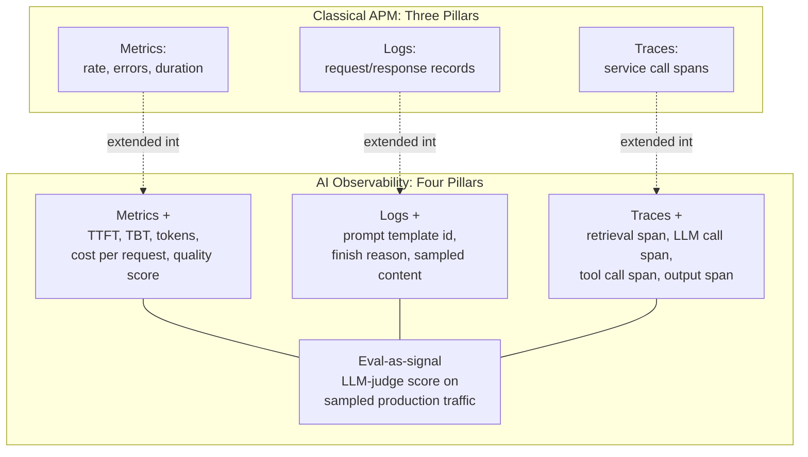
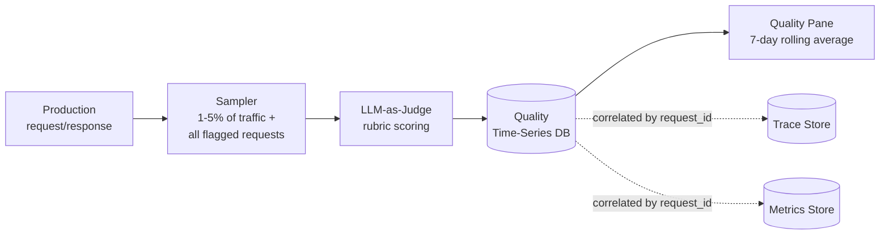
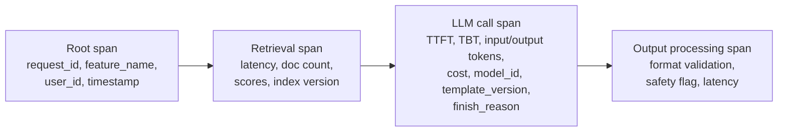
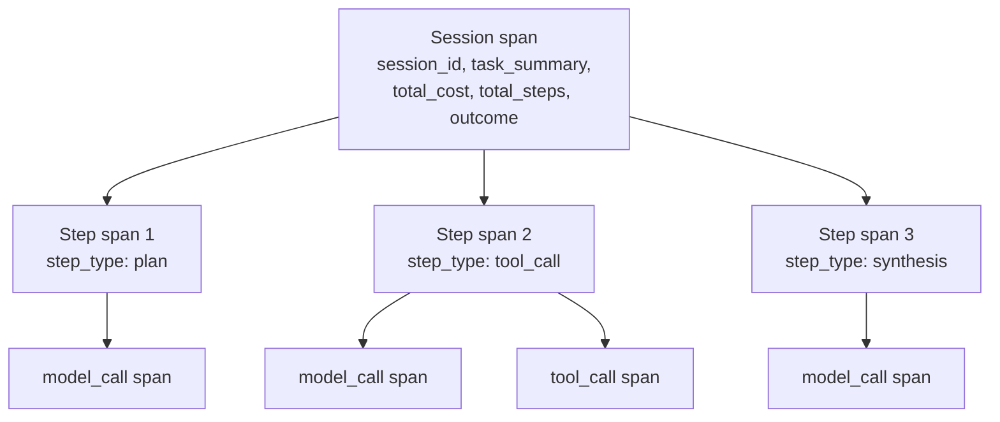
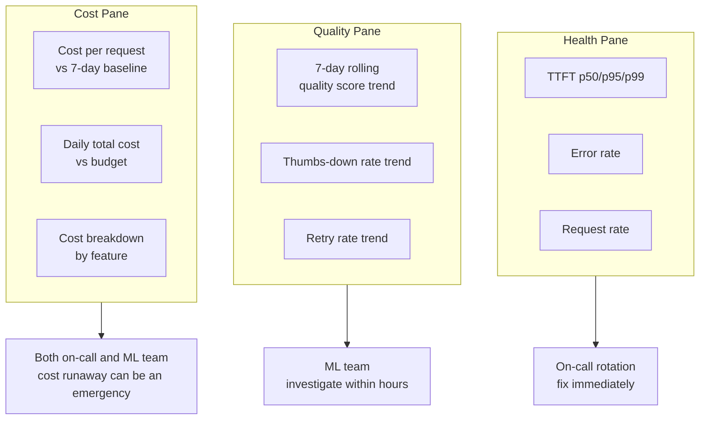

# AI Observability Architecture

## Overview

Observability answers "what is my system actually doing right now, and is that okay?" For twenty years, the answer to that question in production software was fully covered by three pillars — metrics, logs, and traces — plus a shared assumption underneath all three: if the service responds quickly, returns a success status, and doesn't throw, the request succeeded. That assumption is the thing that breaks for AI systems. A request can return in 400ms with a 200 status code, pass every schema check, and contain a fully hallucinated answer, a tone that violates brand guidelines, or an instruction the user explicitly gave that the model quietly ignored. Every classical observability signal reports this request as a success. AI observability architecture is the set of additions — not replacements — to classical observability that make quality a first-class, monitored property instead of an invisible one.

## Definition

AI observability architecture is the combination of classical infrastructure monitoring (request rate, error rate, latency — the RED metrics) with AI-specific instrumentation (token-level cost tracking, generation-specific latency metrics, structured multi-step traces) and a fourth pillar with no classical equivalent — continuous, sampled quality scoring of production traffic (eval-as-signal) — wired into dashboards and alert routing that let an on-call engineer answer three questions fast: is the system working, has quality changed, and is cost within budget.

## Problem Statement

Classical Application Performance Monitoring (APM) was built to answer "is the service healthy," and it answers that question well. TTFT (time to first token) and end-to-end latency percentiles, error rate, request volume, and quota utilization remain necessary for AI systems for exactly the same reasons they were necessary before: you still need to know when the LLM provider is rate-limiting you, when the serving layer starts returning 502s, when p99 latency creeps past SLA. None of that goes away. The problem is that it stops being sufficient the moment the core component of the system is a model whose output quality is not a deterministic function of "did it respond."

Consider the failure mode directly: a prompt template regression ships that causes the model to ignore half the retrieved context on a specific class of question. Requests still complete in normal time. The API still returns 200. No exception is thrown, no retry is triggered, no error is logged. The on-call engineer glancing at the latency dashboard during the incident sees a perfectly healthy system — green across every panel — while a meaningful fraction of users are receiving materially worse answers. The quality failure is invisible to every signal classical APM was designed to surface, because none of those signals were ever measuring answer quality; they were measuring service health, and service health didn't change.

| APM still matters for | AI-specific failures APM cannot see |
|---|---|
| TTFT p50 / p99 (streaming latency perceived by the user) | Hallucination — a fluent, confident, factually wrong answer |
| TBT (time between tokens — generation throughput) | Tone regression — correct content, wrong voice |
| Error rate, 4xx/5xx from the serving layer or provider | Factual incorrectness that passes schema and safety checks |
| Request volume, concurrency, queue depth | Subtle instruction non-compliance (ignored a constraint in the prompt) |
| Token quota / rate-limit utilization | Safety policy violations at an elevated but not catastrophic rate |
| Provider API availability | Retrieval that silently returned the wrong documents |

The two columns aren't in tension — a production AI system needs both, running continuously, side by side. Teams that only build the left column ship an observability stack that will confidently report "all green" during a live quality incident.

## Core Concepts

- **RED metrics** — Rate, Errors, Duration: the classical three signals APM was built around, still necessary but not sufficient for AI systems.
- **TTFT (time to first token)** — the latency the user actually perceives for a streaming response; the AI-specific replacement for "response time" as the primary UX latency metric.
- **TBT (time between tokens)** — the generation throughput signal; a TBT regression means slower streaming with no change in TTFT, a distinct failure mode from a slow first token.
- **Eval-as-signal** — continuous LLM-as-judge scoring of sampled production traffic, the fourth observability pillar with no classical equivalent. See [LLM Evaluation Architecture](../19-evaluation/01-llm-evaluation-architecture.md).
- **Span** — a single traced unit of work (a retrieval call, an LLM call, a tool call) with a start time, end time, and structured attributes; the building block of an AI trace.
- **Trace** — the full tree of spans for one request, from input assembly through output processing, correlated by a shared trace or session identifier.
- **Implicit quality proxy** — a behavioral signal (thumbs-down rate, retry rate, escalation-to-human rate) that corroborates a quality change without requiring an explicit judge score.

## The Four Pillars

Classical observability rests on three pillars: metrics, logs, and traces. AI observability keeps all three — extended with AI-specific dimensions — and adds a fourth that doesn't exist in classical systems at all.

### Traces

A web request trace spans database reads, cache hits, and service hops. An AI request trace spans a different anatomy entirely: **input assembly** (context window construction, a retrieval call, chat history injection), **the LLM call itself** (with token counts, model version, prompt template version, finish reason), any **tool calls** for an agentic system, and **output processing** (format validation, safety screening). A multi-step agent trace is a chained sequence of these sub-traces, linked by a shared `session_id`, one per agent step. The full anatomy — span fields, storage tiering, and sampling strategy — is the subject of [Tracing LLM Calls](02-tracing-llm-calls.md); this chapter covers only the shape.

### Metrics

Every metric below exists because it answers a question RED metrics can't:

| Metric | What it measures | Why it exists |
|---|---|---|
| TTFT p50 / p99 | Time from request received to first token returned | The user's perceived latency for a streaming response — not the same as total request duration |
| TBT | Average time between subsequent tokens | Generation throughput; a TBT regression is slower streaming with unchanged TTFT — a distinct failure signature |
| Input / output tokens per request | Token counts, tracked separately | The primary driver of cost; input and output are priced differently and regress independently |
| Cost per request | Token counts × price per token, computed at call time | Makes cost a real-time metric instead of a line discovered on the monthly invoice — see [Cost & Token Monitoring](03-cost-and-token-monitoring.md) |
| Quality score | Sampled LLM-as-judge score on production traffic | The metric that detects quality regression before users complain at scale — see [LLM-as-Judge](../19-evaluation/03-llm-as-judge.md) |
| Implicit quality proxies | Thumbs-down rate, retry rate, escalation-to-human rate | Behavioral confirmation that a quality change is actually user-visible, independent of the judge |

### Logs

Structured logs for each LLM call need to capture enough to reconstruct the context of any failure — but the naive approach of logging full prompt and response text for every request runs into a real cost wall. At 100,000 requests/day, an average of 5,000 tokens per request, and roughly $0.10 per million tokens of storage cost, logging everything is on the order of $50/day just for text storage, before indexing and retention multipliers. That number looks small in isolation and stops looking small once retention, replication, and search indexing are added on top — which is why the design decision is what to log unconditionally versus what to sample:

- **Unconditional, every request**: low-cardinality metadata — `model_id`, `prompt_template_id`, token counts, cost, latency, `finish_reason`, error status. Cheap, and sufficient to detect that something is wrong.
- **Sampled**: full prompt text (expanded, with injected context), full response text, retrieved document content. Expensive per record, so only captured for a fraction of traffic — and always for flagged/failed requests regardless of sampling rate.

The log system must be searchable by `request_id` so that any trace can be joined back to its logs during an investigation. The full unconditional/sampled/flagged design — with concrete storage math — is covered in [Tracing LLM Calls](02-tracing-llm-calls.md).

### The Fourth Pillar: Eval-as-Signal

Eval-as-signal has no equivalent in classical observability. It is a quality score — usually from an LLM-as-judge, sometimes supplemented by human review — computed asynchronously on a sample of production traffic, and it is the primary mechanism for detecting a quality regression that produces no error, no latency change, and no cost change at all.

The pipeline runs independently of the request path — it never adds latency to a user-facing call — and writes its output into a quality time-series database keyed by `request_id`, `feature_name`, and timestamp. Because every quality score carries the same `request_id` as its originating trace and metric emission, an engineer investigating a quality dip can pivot directly from "quality score dropped for feature X at time T" to the exact traces and token/cost metrics for the requests that produced that dip — the fourth pillar is a peer of the other three, not a separate system bolted on the side. What it enables that traces, metrics, and logs cannot: detecting a prompt regression that has zero effect on latency, error rate, or cost, and would otherwise ship invisibly. See [Offline vs Online Evaluation](../19-evaluation/02-offline-vs-online-evaluation.md) for how this online sampling pipeline relates to the offline gate that runs before deploy.

## Trace Anatomy for a Multi-Step AI Request

A single LLM call trace has four stages:

An agent trace nests this same shape once per step, under a session-level root:

The distinction matters operationally: a single-call trace answers "why was this one response wrong," while an agent trace answers "at which step did this task go wrong" — step-level attribution is what makes a 15-step agent trajectory debuggable instead of an opaque cost and latency blob. The full span field list and storage/sampling design for both shapes is covered in [Tracing LLM Calls](02-tracing-llm-calls.md).

## Dashboard Design for On-Call Engineers

The most common failure in AI observability rollouts isn't missing instrumentation — it's building a 30-chart dashboard that only the ML researcher who built the model can interpret, and that the on-call engineer paged at 3am has no idea how to act on. The dashboard exists to answer exactly three questions, fast:

1. Is the system working?
2. Has quality changed?
3. Is cost within budget?

**The health pane** is standard APM: TTFT p50/p95/p99, error rate, request rate. It goes green or red, and it's the first thing the on-call engineer checks — nothing here requires ML expertise to interpret.

**The quality pane** shows a 7-day rolling average of the quality score, thumbs-down rate, and retry rate. Rolling averages are used instead of raw daily scores deliberately: daily quality scores have natural variance driven by input distribution patterns (weekday traffic differs from weekend traffic, evening queries differ from morning ones), and a raw daily plot is dominated by that noise. A rolling average absorbs the noise while still revealing a real trend. The signature pattern of an AI quality regression is a downward trend in this pane with **no corresponding movement in the health pane at all** — that combination is the tell that something changed in output quality, not service health.

**The cost pane** tracks cost per request against a 7-day baseline reference line, daily total cost against budget, and a cost breakdown by feature. A cost-per-request spike that isn't explained by a shift in traffic composition (e.g., a higher mix of a naturally expensive feature) is a strong signal of a prompt regression or an unannounced model change — see [Cost & Token Monitoring](03-cost-and-token-monitoring.md) for the anomaly detection math behind this pane.

**Alert routing by pane** is the design choice that keeps this useful under real on-call load. Health alerts (infrastructure emergency) go to the on-call rotation for immediate action. Quality alerts go to the ML team for investigation within hours — not a page, because a quality regression rarely needs a human awake at 3am to stop the bleeding the way a 5xx spike does. Cost alerts go to both, because a cost runaway can become an emergency at scale within hours. Routing by signal type — rather than dumping every alert into one channel — is what prevents alert fatigue: an on-call engineer who receives quality regression alerts mixed in with 5xx alerts learns, correctly, to triage them as the same category, and starts ignoring the ones that were never actually a page-now problem. Separating the channels is what keeps the quality alerts credible.

## The Tooling Landscape

| Category | Tools | When to choose |
|---|---|---|
| **LLM observability / tracing** | Langfuse, LangSmith, Helicone, Arize Phoenix, Datadog LLM Observability | Langfuse: open-source, self-hostable, LLM-as-judge integrated, framework-agnostic. LangSmith: LangChain-native, tight eval integration, hosted. Helicone: lightweight proxy-based, minimal instrumentation overhead, cost tracking built in. Arize Phoenix: open-source, combines ML monitoring with LLM tracing. Datadog LLM Observability: enterprise, integrates into existing Datadog infra — best when the team is already on Datadog. |
| **Drift detection** | Arize Phoenix, WhyLabs, Evidently AI | Evidently AI: open-source, PSI and distribution drift built in — see [Drift & Quality Monitoring](04-drift-and-quality-monitoring.md). |
| **Classic APM (serving layer)** | Datadog, Grafana + Prometheus, Honeycomb, New Relic | These monitor the serving infrastructure around the LLM calls — not the LLM outputs themselves. Both layers are needed; neither substitutes for the other. |

**OpenTelemetry** is the instrumentation standard that makes AI traces portable across whichever of these backends a team chooses. It provides an SDK for span creation and propagation, OTLP as the export protocol, and a collector for routing spans to one or more backends. It matters specifically for AI systems because multi-service AI systems — an orchestrator, a retrieval service, an LLM gateway, each potentially a separate deployable — need trace context to propagate across all of them for a single request to appear as one coherent trace. The W3C Trace Context standard (the `traceparent` header) is the mechanism OpenTelemetry uses to carry that context across service boundaries; see [Tracing LLM Calls](02-tracing-llm-calls.md) for the propagation mechanics in a RAG pipeline specifically.

## Tradeoffs

| Advantages | Disadvantages |
|---|---|
| Quality regressions become visible before users complain at scale, not after | Eval-as-signal adds real infrastructure — a sampler, judge pipeline, and time-series store with no classical-APM equivalent to reuse |
| Per-pillar dashboards keep the on-call engineer answering the right question fast | Building all four pillars well is a genuine multi-quarter investment, not a weekend integration |
| Alert routing by signal type reduces fatigue and keeps quality alerts credible | Under-scoping the quality pane (routing quality alerts to on-call) recreates the exact fatigue problem this design exists to avoid |
| OpenTelemetry keeps the trace backend swappable as the team's needs evolve | Multi-service trace propagation requires disciplined instrumentation at every service boundary — one uninstrumented hop breaks the trace |

## Scalability

- **Trace volume**: at 100,000 requests/day with a 4-span average trace (input assembly, retrieval, LLM call, output processing), that's roughly 400,000 spans/day — well within what a self-hosted Langfuse/Phoenix instance or a managed APM backend handles without special tuning.
- **Eval-as-signal cost**: scoring a 1-5% sample with an LLM-judge at 100,000 requests/day lands in the same $300-500/day range as the offline eval pipeline's online sampling cost — see [LLM Evaluation Architecture](../19-evaluation/01-llm-evaluation-architecture.md#scalability) for the underlying judge-cost math; this is the same sampler, reused.
- **Dashboard query load**: a 7-day rolling average over per-minute metric buckets is a cheap aggregation for any time-series backend (Prometheus, Grafana Tempo-backed stores); the design decision that keeps it cheap is pre-aggregating at write time rather than recomputing rolling windows from raw spans on every dashboard load.
- **Metric cardinality**: tagging every metric with `feature_name`, `model_id`, and `customer_id` multiplies cardinality quickly — at more than a few hundred features × models × customers, high-cardinality dimensions belong in the trace/log layer (queryable, not necessarily pre-aggregated), not as labels on a Prometheus-style metric, to avoid cardinality explosion in the metrics backend.

## Reliability

| Failure | Degradation strategy |
|---|---|
| Judge pipeline (eval-as-signal) goes down | Metrics and traces continue independently — quality signal has a gap, but health and cost panes stay live; alert on judge-pipeline staleness itself |
| Trace store ingestion backlog | Buffer spans locally at the instrumentation layer and drop low-priority (tier-3 sampled) spans first, never dropping error/flagged spans — see the tail-based sampling tiers in [Tracing LLM Calls](02-tracing-llm-calls.md) |
| Dashboard mixes quality and health alerts into one channel | Reroute by pane immediately — this is the single highest-leverage fix for alert fatigue described above |
| A single 30-panel dashboard replaces the three-pane design | Collapse back to health/quality/cost as the primary view; keep the detailed panels one click deeper for the ML team, not on the on-call landing page |
| Cost pane shows a spike with no drill-down path | Cost breakdown by feature must be a standing panel, not an ad hoc query built during the incident — see [Cost & Token Monitoring](03-cost-and-token-monitoring.md) |

## Production Best Practices

1. Instrument all four pillars from day one of production launch, not just metrics and logs — retrofitting eval-as-signal after a quality incident means the incident that motivated it left no trace to investigate.
2. Keep the on-call dashboard to three panes (health, quality, cost) as the primary landing view — put deeper diagnostic panels one click away, not on the same screen.
3. Route alerts by signal type to the team that can actually act on them — infra to on-call, quality to ML, cost to both — and treat mis-routed alerts as a bug in the alerting system, not a training problem for the on-call engineer.
4. Pin `model_id` to an exact version string everywhere it's logged — an alias like "latest" makes it impossible to distinguish a provider-side model change from a prompt change later.
5. Correlate all four pillars by a shared `request_id` (and `session_id` for agents) from the start — a trace that can't be joined to its quality score is half as useful as one that can.
6. Treat rolling-average windows and alert thresholds as reviewed, living configuration — a threshold tuned for today's traffic volume and sampling rate goes stale as both change.

## Interview Questions

### Beginner

**Q: Why is classical APM (latency, error rate, uptime) not enough to monitor an AI system?**
Because those signals measure whether the service is running, not whether its output is good. An LLM call can return a 200 status code in normal latency and still contain a hallucinated, off-tone, or subtly non-compliant answer — none of which shows up as an error, a slowdown, or a dropped request. AI systems need a dedicated quality signal on top of the classical ones, not instead of them.

**Q: What's the difference between TTFT and TBT, and why do you need both?**
TTFT (time to first token) is the latency the user perceives before a streaming response starts appearing — it's driven by queueing, context processing, and prompt length. TBT (time between tokens) is the generation throughput once streaming has started — it's driven by model size and serving capacity. A system can have healthy TTFT with degraded TBT (starts fast, then streams slowly) or the reverse, and each points to a different root cause, so they're tracked as separate metrics rather than folded into one latency number.

### Intermediate

**Q: What is "eval-as-signal" and why doesn't it have a classical-APM equivalent?**
Eval-as-signal is continuous LLM-as-judge scoring of a sample of production traffic, producing a quality time series alongside the classical metrics/logs/traces. It has no classical equivalent because classical APM was never built to judge whether an output was *correct* — only whether the service that produced it behaved correctly. There's no analogous concept in, say, a payments API, because a payments API's correctness is checkable deterministically; an LLM's output correctness is not, so it needs its own scoring pipeline.

**Q: Design the trace anatomy for a single RAG-backed LLM call.**
Root span carries request-level identity (request_id, feature_name, user_id, timestamp). A retrieval span under it captures retrieval latency, document count, similarity scores, and the index version queried. An LLM call span captures TTFT, TBT, input/output token counts, cost, the pinned model_id, prompt_template_version, and finish_reason. An output processing span captures format validation results, safety flag status, and its own latency. All four spans share the same trace_id so they can be viewed and debugged as one unit.

### Senior

**Q: An on-call engineer says "the dashboard was all green" during a confirmed quality incident. What does that tell you about the dashboard, not the incident?**
It tells you the dashboard was built as a single-pillar (metrics/health-only) view, or that the quality pane exists but isn't part of the on-call's checked surface. "All green" on health metrics is expected and unremarkable during a pure quality regression — TTFT, error rate, and request volume are not supposed to move. The fix isn't training the engineer to "look harder"; it's making sure the quality pane is part of the standard on-call view and that a quality-specific alert would have fired independently of the health metrics.

**Q: Why route cost alerts to both on-call and the ML team, when quality alerts only go to ML?**
Because cost has two distinct failure modes with different urgency: a genuine infrastructure-level runaway (a retry storm, a provider pricing change, a bug causing duplicate calls) needs an immediate on-call response the same way a 5xx spike would, while a slower drift (a prompt change that gradually increased average context length) is closer in urgency to a quality regression — worth ML investigation within hours, not a page. Routing to both, with severity-tiered thresholds distinguishing "urgent spike" from "trending drift," covers both failure modes without forcing every cost alert into the highest-urgency channel by default.

### Staff

**Q: You're asked to stand up AI observability for a new production LLM feature from scratch. What do you build first, and in what order?**
Start with the classical three pillars extended with AI-specific fields — TTFT/TBT metrics, structured logs with model_id and finish_reason, and basic request-level tracing — because the feature needs baseline health monitoring before anything else, and this reuses infrastructure the team likely already has. Next, build cost-per-request as a first-class metric immediately, because cost-quality coupling means every subsequent quality decision is implicitly a cost decision, and teams that skip this step find out about cost problems from an invoice. Only after health and cost are live, stand up eval-as-signal — a sampler, a judge pipeline, and a quality time series — because it's the most operationally novel piece and the one most likely to be under-scoped if rushed. Finally, build the three-pane dashboard and alert routing on top of all of it, and route by signal type from day one rather than retrofitting routing after an alert-fatigue incident. The order matters because each layer is genuinely a prerequisite for making the next one actionable — a quality alert with no cost or health context to correlate against is much harder to triage.

## Google-Level Follow-Ups

- "Your quality pane and cost pane both show a metric moving at the same time. How do you determine causation instead of assuming correlation?" — probes whether the candidate reaches for the shared `request_id`/`session_id` correlation across the four pillars (e.g., checking whether the specific traces underlying the cost spike are the same traces scoring lower on quality, versus an unrelated coincidence) rather than eyeballing two charts moving together.
- "Your eval-as-signal judge pipeline itself goes down for six hours during business hours. What's the actual operational risk, and how would you detect the outage itself?" — probes whether the candidate recognizes eval-as-signal as infrastructure that needs its own health monitoring (a "quality pipeline staleness" alert), not just a data source assumed to always be flowing, and that the real risk is a genuine regression going undetected during the gap, not the outage itself.
- "You have unlimited budget. Would you score 100% of production traffic with the judge instead of sampling?" — probes whether the candidate understands that judge-as-signal is a statistical detection tool, not an audit log — scoring 100% doesn't materially improve detection power once the sample is already statistically sufficient, and the marginal spend is better allocated to stratified sampling of rare/high-stakes slices than to raw volume.
- "Two independent teams each build their own AI observability stack against the same underlying model. What goes wrong?" — probes for awareness of fragmentation costs: incomparable quality scores across teams (different judge prompts, different rubrics), duplicated judge-API spend, and no shared incident picture — the fix is a shared observability platform with team-specific dashboards layered on top, the same organizational pattern as fragmented eval pipelines.

## Common Mistakes

- **Treating classical APM as sufficient** because "the dashboard is green" — it was never measuring the thing that actually broke.
- **Building a single sprawling dashboard** with 30+ panels that only the ML team that built the model can interpret, instead of a three-pane health/quality/cost view for on-call.
- **Routing quality alerts into the same channel as infrastructure alerts** — this reliably trains on-call engineers to deprioritize both.
- **Logging a model alias instead of a pinned version string** — this makes it impossible later to distinguish a provider-side model update from a prompt or config change.
- **Standing up traces and logs but skipping eval-as-signal** — this leaves the single most common AI failure mode (silent quality regression) with no detection mechanism at all.
- **Using raw daily quality scores instead of rolling averages on the dashboard** — natural day-to-day variance drowns out any real trend and trains viewers to ignore the pane.

## Key Takeaways

- Classical APM (RED metrics — rate, errors, duration) remains necessary for AI systems but is not sufficient, because a request can be fast, error-free, and low quality all at once.
- AI observability keeps the three classical pillars — traces, metrics, logs — extended with AI-specific fields, and adds a fourth pillar with no classical equivalent: eval-as-signal, continuous quality scoring of sampled production traffic.
- The AI trace anatomy (input assembly, LLM call, tool calls, output processing) is structurally different from a web request trace, and multi-step agent traces chain this shape once per step under a session-level root.
- A useful on-call dashboard has exactly three panes — health, quality, cost — because the on-call engineer needs to answer three questions fast, not interpret thirty charts.
- Alert routing by signal type (health to on-call, quality to ML, cost to both) is what keeps alerts credible; mixing categories reliably produces alert fatigue.
- OpenTelemetry is the instrumentation standard that keeps AI traces portable across backends and enables trace context propagation across multi-service AI systems (orchestrator, retrieval, LLM gateway).
- This chapter is the map; [Tracing LLM Calls](02-tracing-llm-calls.md), [Cost & Token Monitoring](03-cost-and-token-monitoring.md), and [Drift & Quality Monitoring](04-drift-and-quality-monitoring.md) each go deep on one pillar of it.

---

*Part of [Observability](index.md) in the [AI System Design Notes](../index.md). Next: [Tracing LLM Calls](02-tracing-llm-calls.md).*
