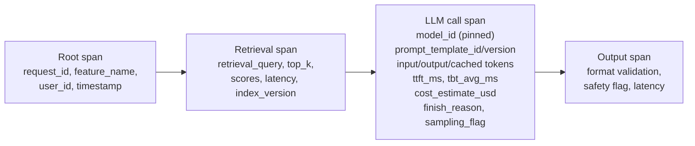
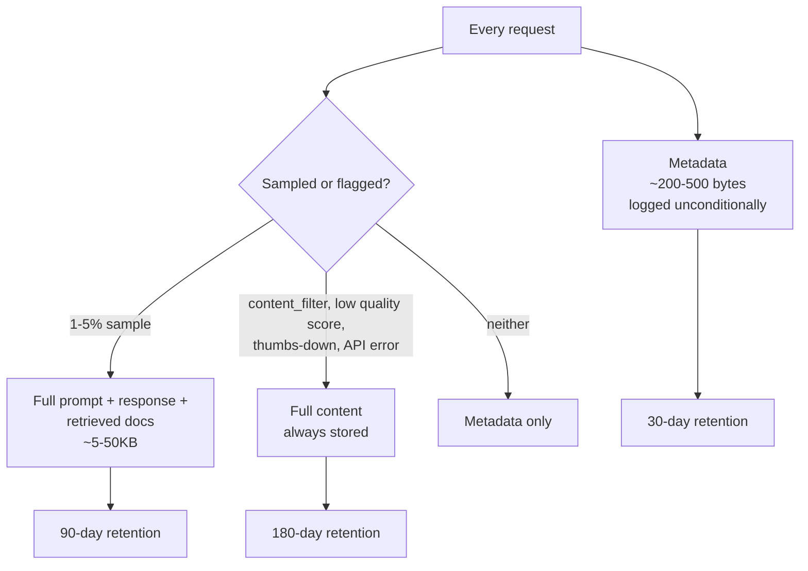
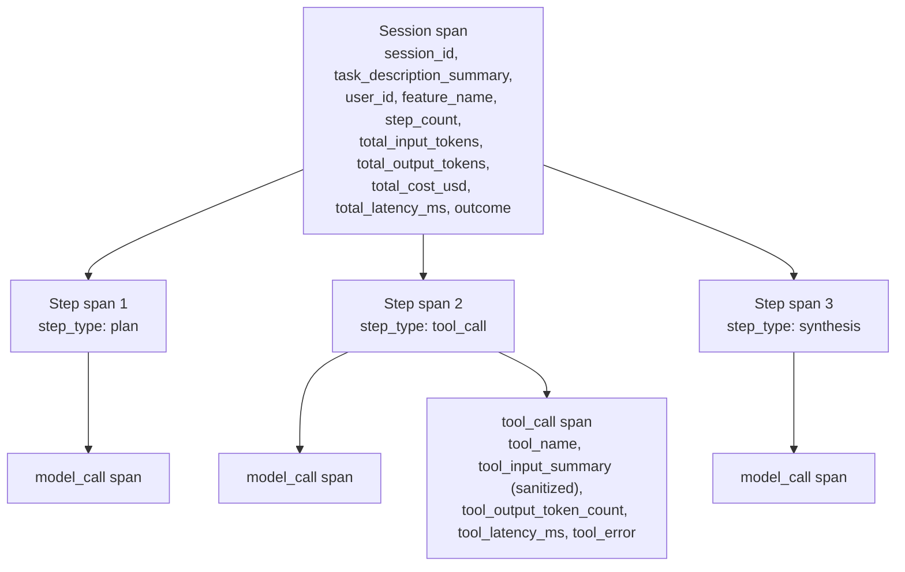
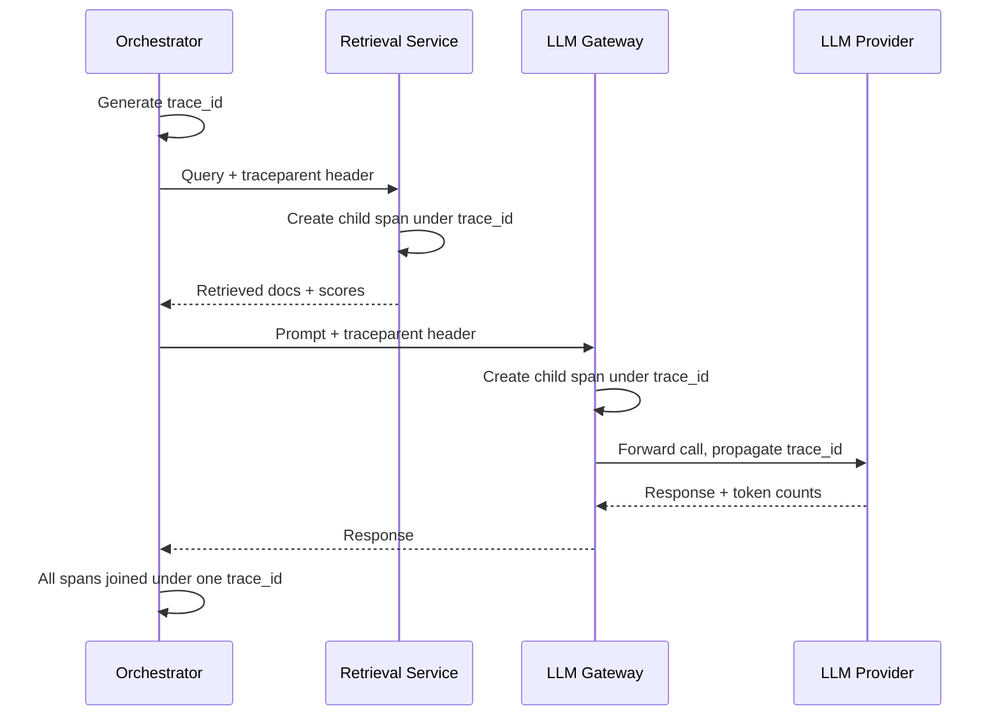
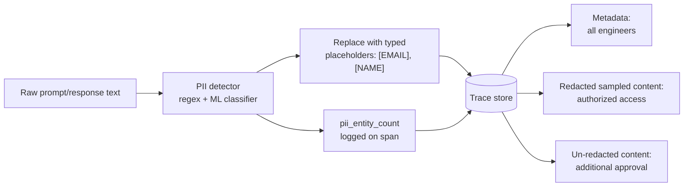
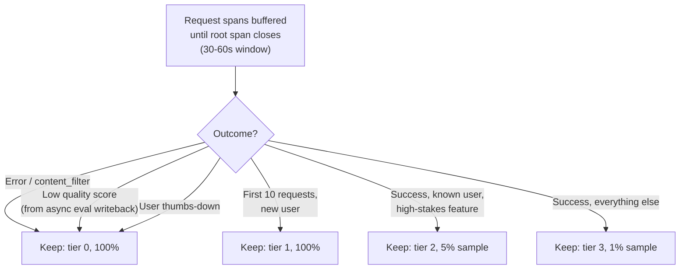

# Tracing LLM Calls

## Overview

A trace is only as useful as the fields captured in it. Get the span schema wrong and you'll have thousands of records that show a request happened without showing enough to explain why it went wrong — no model version, no prompt version, no way to tell whether a truncated response was silent or intentional. This chapter is the implementation guide: what fields belong on a span, how to structure spans for both a single LLM call and a multi-step agent, how to keep storage cost bounded at scale, how to correlate a trace across services in a RAG or agentic pipeline, and how to handle the fact that production traces are full of PII by construction.

## Definition

Tracing LLM calls is the practice of capturing, for every request through an AI system, a structured hierarchy of spans — one per meaningful sub-operation (retrieval, model call, tool call, output processing) — with enough attributes on each span to reconstruct exactly what happened, at a storage and sampling cost that scales with request volume rather than growing unbounded.

## Problem Statement

The naive approach — log the full prompt and response for every request, forever — fails in two ways simultaneously. First, it's a cost problem: at even moderate volume, storing every full prompt and response is real, ongoing spend, not a rounding error (worked out below). Second, and less obviously, it's a *debugging* problem: a trace with an incomplete field set is often worse than useless during an incident, because it looks complete enough to trust. A trace missing `prompt_template_version` doesn't fail loudly — it just silently prevents you from ever answering "which prompt was live three days ago when this regression started," at the exact moment that question matters most. Getting the span schema right up front avoids discovering the gap mid-incident.

## Core Concepts

- **Span** — one recorded unit of work with a start time, end time, and attributes; the atomic unit of a trace.
- **Trace ID** — the identifier shared by every span belonging to one logical request, enabling cross-span and cross-service correlation.
- **Session ID** — the identifier shared by every span belonging to one multi-step agent task, spanning multiple LLM calls and tool calls.
- **Head-based sampling** — a keep/discard decision made at request start, before the outcome is known.
- **Tail-based sampling** — a keep/discard decision made after the request completes, based on its outcome (error, low quality score, user feedback).
- **Prompt compression** — storing a template identifier plus variable substitutions instead of the fully expanded prompt text, reconstructable at query time.
- **PII scrubbing** — detecting and redacting personally identifiable information from logged content before it's persisted, typically via regex plus an ML classifier.

## Span Anatomy for a Single LLM Call

Every LLM call span needs a minimum field set sufficient to debug any production failure without needing to reproduce it:

| Field | Purpose |
|---|---|
| `span_id`, `trace_id`, `parent_span_id` | Identity and hierarchy — `trace_id` is shared across every span in one request for cross-service correlation; `parent_span_id` links a span to its parent in a multi-step flow |
| `timestamp_start`, `timestamp_end`, `duration_ms` | When the call happened and how long it took |
| `model_id` | The **pinned** model version string — e.g. `claude-sonnet-4-6`, never an alias like `claude-latest` |
| `prompt_template_id`, `prompt_template_version` | Which prompt was active for this call |
| `input_token_count`, `output_token_count`, `cached_input_token_count` | Token counts, split by type, including cache-read tokens where the provider supports prompt caching |
| `cost_estimate_usd` | Computed at call time from token counts × the price table current at call time |
| `ttft_ms` | Time from request sent to first token received |
| `tbt_avg_ms` | Average time between tokens — the generation throughput proxy |
| `finish_reason` | `stop`, `max_tokens`, `content_filter`, `tool_call`, `error` |
| `sampling_flag` | Whether this request was selected for full content logging |
| `feature_name`, `user_id`, `session_id` | The three attribution dimensions for per-feature cost, per-user debugging, and session trajectory reconstruction |

Two fields deserve a specific note on *why*, because skipping them is the most common instrumentation gap:

**`model_id` must be the pinned version, never an alias.** Without it, a quality change that happened because the provider silently updated the model behind a stable API alias is indistinguishable, in the trace, from a quality change caused by your own prompt edit — both look identical from the trace's point of view if all you stored was `"claude-latest"`. Pinning the version is the only way to later separate "we changed something" from "the provider changed something."

**`prompt_template_id` + `prompt_template_version` must be captured on every call.** When a quality regression from three days ago is under investigation, the first question is "which prompt was serving traffic at that timestamp." Without this field on the span, the trace is structurally incomplete for root-cause analysis — no amount of log-diving elsewhere recovers information that was never captured at call time.

**`finish_reason` changes what a "successful" response actually means.** `max_tokens` means the response was truncated silently — the user received an incomplete answer with no error ever surfaced to them or to any dashboard watching error rate. `content_filter` means the safety system triggered; a rising `content_filter` rate at the aggregate level is itself a quality incident, distinct from and often more urgent than any specific error rate.

## What to Log Unconditionally vs. What to Sample

This is the storage cost design decision, and it has three tiers rather than two:

**Unconditional, every request** — all span metadata fields listed above. At roughly 200-500 bytes per request, 100,000 requests/day costs about 50MB/day of metadata storage: negligible.

**Sampled content, 1-5% of requests** — full prompt text (expanded, including injected context), full response text, retrieved document content for RAG. At roughly 5-50KB per sampled request, 100,000 requests/day at a 3% sampling rate and 20KB average lands around 60MB/day: manageable, and small enough that raising the sampling rate to 5% or 10% for a specific investigation is a cheap, temporary knob rather than a re-architecture.

**Flagged content, always stored regardless of sampling rate** — requests where `finish_reason = content_filter`, requests where the async eval pipeline scored quality below threshold, requests with explicit user thumbs-down, requests with API errors. These are the debugging corpus, by definition the requests most likely to need investigation later, so sampling them out would be actively counterproductive.

**Storage tiering is a cost decision**, made explicit: metadata-only traces retained 30 days, full-content sampled traces retained 90 days, flagged traces retained 180 days (they're rare and disproportionately valuable for later pattern analysis). At the volumes above — 50MB/day metadata, 60MB/day sampled content, and flagged content typically under 1% of volume at another few MB/day — even at $0.02-0.05/GB-month for typical object storage, the fully tiered system runs to single-digit dollars per month in raw storage, with the real cost living in indexing and query infrastructure rather than raw bytes. The tiering exists so that indexing cost (which does scale with retention × volume) is bounded deliberately rather than by accident.

**Prompt compression** is the lever that reduces sampled-content cost further for structured prompts: instead of storing the fully expanded prompt text, store `template_id` + `template_version` + the variable substitutions that were slotted in, and reconstruct the full prompt at query time by replaying the template. This works cleanly when prompts are built from explicit variable slots (a system prompt template with `{user_query}`, `{retrieved_context}`, `{chat_history}` placeholders) — the reconstruction is deterministic and the storage savings are real, since only the variable payload needs to be stored rather than the full template text repeated on every request. It breaks down for free-form chat history that can't be decomposed into a template plus variables — a long, organically-grown multi-turn conversation has no clean template to compress against, and forcing one produces a lossy, unreliable reconstruction. Use compression where prompts are templated; store full text where they aren't.

## Span Structure for Multi-Step Agent Traces

An agent task is not one LLM call — it's a session containing multiple steps, each of which may itself contain a model call, a tool call, or both. The trace hierarchy needs a level that a single-call trace doesn't: the session.

**Session-level root span** fields: `session_id`, `task_description_summary` (short — the full text lives in sampled content, not here), `user_id`, `feature_name`, `step_count`, `total_input_tokens`, `total_output_tokens`, `total_cost_usd`, `total_latency_ms`, and `outcome` (`success` / `partial_success` / `failure` / `timeout` / `human_escalation`). The `outcome` field is what makes per-session success rate trackable as an aggregate metric — without it, "how often does this agent actually finish the task" isn't answerable from the trace store at all.

**Step-level spans**, one per agent step: `step_number`, `step_type` (`plan` / `tool_call` / `synthesis` / `reflection` / `human_handoff`), a link to the child `model_call_span_id` and `tool_call_span_id`, `step_latency_ms`, `step_cost_usd`.

**Tool call spans**: `tool_name`, `tool_input_summary`, `tool_output_token_count` (or byte count for non-text outputs), `tool_latency_ms`, `tool_error`. The `tool_input_summary` field must be **sanitized before logging** — tool calls routinely pass user data, including PII, to external APIs (a calendar tool receiving an email address, a CRM lookup tool receiving a customer name), and that input appears verbatim in the span unless it's scrubbed. If the trace store has looser access control than the production database the data originally came from, storing raw tool inputs is a straightforward data exposure risk — the trace store becomes a second, less-guarded copy of sensitive production data.

Reconstructing the full agent trajectory is a join: fetch every span sharing a `session_id`, order by `step_number`, and walk the resulting sequence of step → model_call/tool_call pairs — this is the query pattern that turns "the agent produced a wrong final answer" into "the agent's step 4 tool call returned a value it then misinterpreted at step 6."

## Correlating Traces Across Retrieval, Model, and Tool Calls

In a RAG system, when the final answer is wrong, there are exactly two candidate explanations: retrieval returned the wrong documents, or the model ignored the right ones. Answering which one happened requires a trace that spans both the retrieval service and the model call with correlated identifiers — if they're logged as two disconnected systems, the investigation has to manually stitch timestamps together, which doesn't scale past the first incident.

**OpenTelemetry trace context propagation** is the standard mechanism: the orchestrating service establishes a `trace_id` and propagates it to every downstream service via the W3C Trace Context `traceparent` HTTP header. Each downstream service — retrieval, the LLM gateway, any tool backend — creates child spans under that same `trace_id`, and every span from every service for one logical request ends up queryable together.

**Retrieval span fields**: `retrieval_query` (the text actually sent to the vector index — often different from the raw user query after query rewriting), `top_k_retrieved`, `retrieval_scores` (similarity score per returned document — a low top score is a direct signal that retrieval found nothing good, independent of what the model did with it afterward), `retrieval_latency_ms`, `index_version` (which corpus/index version was queried — crucial for correlating a retrieval quality drop with a specific corpus update).

**LLM gateway correlation**: if LLM calls route through a gateway (for rate limiting, cost tracking, or model routing), the gateway must propagate the incoming `trace_id` to the outgoing provider call rather than minting a new one — otherwise provider-side latency and the provider's own request ID become invisible inside the trace, and a slow provider call looks indistinguishable from a slow gateway.

**Querying multi-service traces**: the standard investigation query is "show me all spans from `session_id` X, across all services, ordered by `start_time`." This requires a trace store built for multi-service aggregation — Jaeger, Grafana Tempo, or a hosted APM backend with equivalent capability — rather than per-service logs that have to be manually correlated by timestamp.

## Sensitive Content Handling

Production LLM traces contain PII by construction: user names, email addresses, medical history, financial details — whatever the user typed, plus whatever retrieval or tool calls pulled in on their behalf. Handling this correctly requires three things, not one:

**Instrumentation-level scrubbing**: before logging any content field, run it through a PII detector (regex for structured patterns like emails and phone numbers, plus an ML classifier for names, addresses, and less-structured entities) and replace detected entities with typed placeholders — `[EMAIL]`, `[NAME]`, `[PHONE]` — rather than logging raw text and hoping to redact it later. Redaction after the fact is strictly worse: the raw content already exists somewhere by the time a later redaction pass runs.

**Entity count logging**: log `pii_entity_count` (and ideally a breakdown by type) on the span even after redaction, so debugging still works without the raw content — "this request had 3 PII entities redacted, 2 of type NAME and 1 of type EMAIL" is enough context to understand what kind of request this was, without needing the unredacted text at all for most investigations.

**Tiered access control on the trace store**: span metadata (model_id, tokens, cost, latency) is readable by any engineer. Sampled full content — even redacted — requires explicit data access authorization, because redaction is not perfect and residual PII risk remains. Un-redacted content (the flagged tier, or a specific investigation that needs ground truth) requires an additional, logged approval step. Treating the trace store as uniformly accessible because "it's just observability data" is the mistake — it's a second copy of production data, and needs the access discipline that implies.

## Sampling Strategy for Trace Storage at Scale

**Head-based sampling** makes the keep/discard decision at request start, before the outcome is known — all or nothing, and simple to implement. Its limitation is exactly what it sounds like: a boring successful request and a critical failure have equal probability of landing in the sample, so a genuine failure is only inspectable if it happens to fall inside the sampled fraction — at a 3% sample rate, 97% of failures are simply never captured in full detail.

**Tail-based sampling** makes the decision after the request completes, based on its actual outcome. Always store: errors, content filter triggers, a low quality score from the async eval pipeline (which requires a feedback write-back from the eval service into the trace store, since the quality score often isn't known until after the trace would otherwise have been discarded), user thumbs-down, and the first N requests from a new user. Sample the rest at 1-5%. This is strictly more useful for debugging, at the cost of real implementation complexity: it requires a span buffer that holds a request's spans in memory (or a short-lived store) until the root span closes — typically 30-60 seconds for a multi-step agent task — before the keep/discard decision can be made.

**Stratified tail-based sampling** is the production-grade version, with four tiers:

| Tier | Criteria | Sampling rate | Storage cost profile |
|---|---|---|---|
| Tier 0 | Errors, content filter triggers, quality-flagged, user-flagged | 100% | Small volume, disproportionately high investigative value |
| Tier 1 | First 10 requests per new user, manually-flagged debugging sessions | 100% | Small, bounded volume, tied to onboarding cohort size |
| Tier 2 | Successful requests from known users in high-stakes features | 5% | Moderate — scales with high-stakes feature traffic |
| Tier 3 | All other successful requests | 1% | Largest raw volume, smallest per-request value, kept low deliberately |

The buffering requirement is the real engineering cost of tail-based sampling relative to head-based: it needs a stateful component in the ingestion path, and that component needs its own reliability story — see [Reliability](#reliability) below for what happens when it falls behind.

## Tradeoffs

| Advantages | Disadvantages |
|---|---|
| Tail-based sampling guarantees every failure is inspectable, not just a lucky fraction of them | Requires a span buffer holding data until the root span closes — added latency-adjacent complexity in the ingestion path |
| Prompt compression cuts storage cost substantially for templated prompts | Doesn't work for free-form chat history — forcing it produces unreliable reconstructions |
| Tiered storage retention bounds cost predictably as volume grows | Under-provisioning the flagged tier's retention window loses exactly the data most needed for a slow-building investigation |
| PII scrubbing at the instrumentation layer keeps the trace store safe to broadly access | Scrubbing is never perfect; tiered access control is still required as a second layer of defense |

## Scalability

- **Metadata volume**: 100,000 requests/day × ~300 bytes average metadata span = ~30MB/day, negligible even at multi-year retention.
- **Sampled content volume**: 100,000 requests/day × 3% sampling × ~20KB average = ~60MB/day; raising the sampling rate temporarily to 10% during an active investigation is a cheap, reversible knob rather than a capacity risk.
- **Tail-based sampling buffer**: buffering 30-60 seconds of in-flight spans at 100,000 requests/day (roughly 1-2 requests/second sustained, higher at peak) is a modest in-memory or short-TTL store requirement — the design risk is peak traffic bursts overflowing the buffer window, not steady-state volume.
- **Agent session traces**: a 15-step agent session produces roughly 30-45 spans (step + model_call + tool_call per step); at meaningful agent traffic volume this multiplies span count well past single-call traces, making step-level sampling tiers (rather than a flat rate applied to sessions) the practical way to keep storage bounded.

## Reliability

| Failure | Degradation strategy |
|---|---|
| Span buffer for tail-based sampling overflows during a traffic spike | Fall back to head-based sampling temporarily rather than dropping the buffer contents silently; alert on buffer overflow as its own signal |
| PII detector fails to redact an entity type it wasn't trained on | Periodic audit sampling of "sanitized" content against a human reviewer; treat detector recall as a monitored metric, not a one-time validation |
| Trace store ingestion falls behind during a load spike | Drop tier-3 (1% sample) spans first, then tier-2, before ever dropping tier-0/tier-1 flagged or new-user spans |
| `prompt_template_id` missing on a span (instrumentation gap) | Alert on span schema completeness itself as a monitored metric — a rising rate of incomplete spans is a silent instrumentation regression |
| Eval pipeline's quality-score writeback to the trace store lags | Tail-based tier-0 promotion for "low quality score" is delayed, not lost — buffer retention window must exceed the eval pipeline's typical latency, or add a secondary async promotion path |

## Production Best Practices

1. Never log a model alias — pin `model_id` to the exact version string on every span, without exception.
2. Capture `prompt_template_id` and `prompt_template_version` on every LLM call span, not just sampled ones — this is metadata, not content, and costs nothing to log unconditionally.
3. Sanitize tool inputs before they reach a span — treat any external-API-bound payload as containing PII until proven otherwise.
4. Use tail-based, stratified sampling rather than flat head-based sampling once volume justifies the added buffering complexity — a flat 3% sample guarantees most failures are never captured.
5. Compress templated prompts to `template_id` + variables; store free-form chat history in full rather than forcing an unreliable template fit.
6. Propagate `trace_id` via W3C Trace Context across every service boundary in a multi-service AI pipeline — one uninstrumented hop breaks cross-service correlation for every request that passes through it.
7. Treat the trace store's access control as tiered, not uniform — metadata open to all engineers, sampled content gated, un-redacted content additionally approved.

## Interview Questions

### Beginner

**Q: What information does a single LLM call span need, at minimum, to be useful during an incident?**
At minimum: a pinned `model_id`, `prompt_template_id` and version, input/output token counts, `cost_estimate_usd`, `ttft_ms`, `finish_reason`, and the `trace_id`/`parent_span_id` linking it into the full request trace. Without the pinned model version and prompt version specifically, a later investigation can't distinguish a provider-side model change from a prompt change — the two most common causes of an unexplained quality shift.

**Q: Why can't you just log the full prompt and response for every request?**
Cost, primarily: at even moderate volume (100,000 requests/day, a few thousand tokens each), storing full text for every request adds up to real, ongoing spend rather than a rounding error, and most of it is never looked at. The standard pattern is to log lightweight metadata unconditionally and only store full content for a small sample plus anything flagged as an error, low-quality, or user-reported problem.

### Intermediate

**Q: Why does `finish_reason = max_tokens` deserve specific monitoring attention, separate from the general error rate?**
Because it's a silent failure — the API call itself succeeds, no error is thrown, and the response looks complete to any system only checking for exceptions or non-200 status codes. The user received a truncated answer with nothing surfacing that fact anywhere except this specific field. A rising `max_tokens` rate is a real quality problem invisible to error-rate monitoring.

**Q: Explain the difference between head-based and tail-based sampling, and when you'd choose each.**
Head-based sampling decides whether to fully capture a request before its outcome is known — simple, but a failure only gets captured if it happens to land in the sampled fraction. Tail-based sampling waits until the request completes and decides based on outcome — errors, low quality scores, and user complaints are always kept in full, while routine successes are sampled lightly. Head-based is the right starting point for a simple system; tail-based is worth the added buffering complexity once trace volume is high enough that missing most failures in a flat sample becomes a real operational cost.

### Senior

**Q: A RAG system produced a hallucinated answer. How does trace correlation help you determine whether retrieval or the model is at fault?**
Pull the full trace for that `request_id` and look at the retrieval span and the LLM call span together. If `retrieval_scores` on the returned documents are low, or `top_k_retrieved` clearly doesn't contain the answer, retrieval is the likely cause — check `index_version` against recent corpus updates. If the retrieved documents (visible in sampled or flagged content) clearly contain the correct answer, but the response doesn't reflect it, the fault is in the model's use of context, which points toward a prompt or context-assembly investigation instead. The correlation is only possible because both spans share the same `trace_id` and were captured with enough attributes to make each hypothesis checkable directly, rather than inferred from timestamps.

**Q: Design the span hierarchy for a 15-step autonomous agent task and explain how you'd debug a wrong final answer.**
A session-level root span carries `session_id`, a short `task_description_summary`, aggregate cost/token/latency totals, and an `outcome` field. Each of the 15 steps gets its own step span with `step_number` and `step_type`, linking to a `model_call_span_id` and/or `tool_call_span_id` as applicable. To debug a wrong final answer, fetch every span sharing the `session_id`, order by `step_number`, and walk the trajectory forward — this typically surfaces the exact step where a tool call returned an unexpected value, or a model call's reasoning diverged from the correct path, rather than only being able to inspect the final message.

### Staff

**Q: You're designing the trace and sampling architecture for a new multi-service RAG platform expected to reach 5M requests/day. Walk through the key design decisions and why.**
Start with the span schema: every LLM call span needs the pinned-model, prompt-version, token, cost, and finish_reason fields as unconditional metadata — that's cheap even at 5M/day and non-negotiable for debuggability. For content, move to tail-based stratified sampling from the start rather than head-based, because at this volume a flat sample would miss the overwhelming majority of failures, and the buffering cost (30-60 second span retention before the keep/discard decision) is worth paying once volume is this high. Propagate `trace_id` via OpenTelemetry's W3C Trace Context across the orchestrator, retrieval service, and LLM gateway from day one — retrofitting cross-service correlation after each service has already built its own logging in isolation is a much larger effort than building it in from the start. Build PII scrubbing into the instrumentation layer, not as a downstream batch job, since redaction-after-the-fact means the raw content already existed unprotected somewhere. Finally, tier storage retention (30/90/180 days for metadata/sampled/flagged) as an explicit, reviewed cost decision, not an afterthought discovered when a storage bill arrives. The order matters because schema and propagation decisions are expensive to retrofit across already-integrated services, while sampling rates and retention windows are comparatively cheap to tune later.

## Google-Level Follow-Ups

- "Your tail-based sampler buffers spans for 60 seconds before deciding to keep or discard. What happens to that decision for an agent session that legitimately runs for 10 minutes?" — probes whether the candidate recognizes that a fixed buffer window sized for single-call latency breaks for long-running agent sessions, and that the buffer window (or the granularity of the keep/discard decision — per-step vs. per-session) needs to account for the actual distribution of request durations, not just the common case.
- "You scrub PII before logging, and your `pii_entity_count` field shows a sudden drop to near-zero across all traffic. What are the competing explanations, and how do you distinguish them?" — probes whether the candidate considers both "genuinely fewer PII-bearing requests" (a real input shift) and "the PII detector broke and is silently failing open" (an instrumentation regression) as live hypotheses, and proposes a way to tell them apart, such as periodic audit sampling against a human reviewer that's independent of the detector's own reported count.
- "Prompt compression works for templated prompts. A team argues they can retrofit templates onto their existing free-form chat logs to get the storage savings anyway. What goes wrong?" — probes whether the candidate sees that forcing a template onto genuinely free-form, organically-varying content produces a lossy reconstruction that will silently diverge from what was actually sent, defeating the entire purpose of the trace (accurately reconstructing what happened) in exchange for storage savings that aren't worth that tradeoff.
- "Two services in your pipeline — the orchestrator and the LLM gateway — were built by different teams, and the gateway doesn't propagate the incoming `trace_id`, minting its own instead. What's the operational cost of this, concretely?" — probes for a specific, not vague, answer: every trace stops at the gateway boundary, provider-side latency and errors become invisible from the orchestrator's view, and any investigation spanning both services requires manual timestamp correlation instead of a single trace query — the fix is enforcing W3C Trace Context propagation as a contract between services, not a best-effort convention.

## Common Mistakes

- **Logging a model alias instead of a pinned version** — this makes a provider-side silent model update indistinguishable from a prompt change in every later investigation.
- **Skipping `prompt_template_id`/`version` because it "seems obvious at the time"** — it stops being obvious the moment you need to check what was live three days ago.
- **Logging full, unredacted tool inputs** — tool calls routinely carry PII to external APIs, and an unsanitized span is a straightforward data exposure risk if the trace store's access control is looser than production's.
- **Flat head-based sampling at meaningful production volume** — this guarantees the overwhelming majority of real failures are never captured in full detail.
- **Forcing prompt compression onto free-form chat history** — produces a reconstruction that silently diverges from what was actually sent.
- **Treating the trace store as uniformly accessible "just observability data"** — it's a second copy of production data containing PII, and needs tiered access control accordingly.

## Key Takeaways

- A useful LLM call span needs pinned `model_id`, prompt template identity, token counts, cost, TTFT/TBT, and `finish_reason` as unconditional metadata — skipping any of these leaves the trace structurally incomplete for later root-cause work.
- The unconditional-metadata / sampled-content / flagged-content tiering is the core storage cost design decision, with explicit, differentiated retention windows (30/90/180 days) rather than one blanket policy.
- Prompt compression (template ID + variables instead of expanded text) works for structured prompts and fails for free-form chat history — know which one you're instrumenting before choosing it.
- Agent traces need a session-level root span with an `outcome` field on top of per-step spans, because per-session success rate isn't answerable from step-level data alone.
- Cross-service correlation in RAG and multi-service AI pipelines depends on OpenTelemetry's W3C Trace Context propagation — one uninstrumented service boundary breaks the trace for every request through it.
- Tail-based, stratified sampling guarantees every failure, safety trigger, and flagged case is inspectable, at the cost of a span-buffering component that head-based sampling doesn't need.
- PII scrubbing belongs at the instrumentation layer, with entity counts logged even after redaction, and trace store access should be tiered — not uniform — because a trace store is a second copy of sensitive production data.

---

*Part of [Observability](index.md) in the [AI System Design Notes](../index.md). Previous: [AI Observability Architecture](01-ai-observability-architecture.md). Next: [Cost & Token Monitoring](03-cost-and-token-monitoring.md).*
