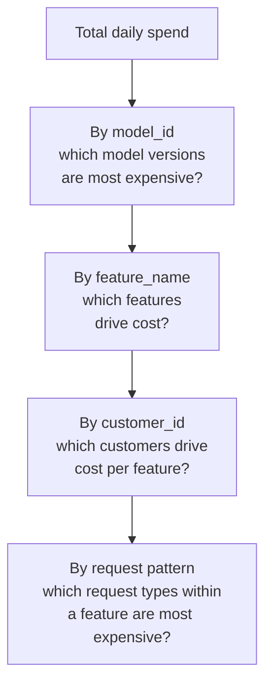
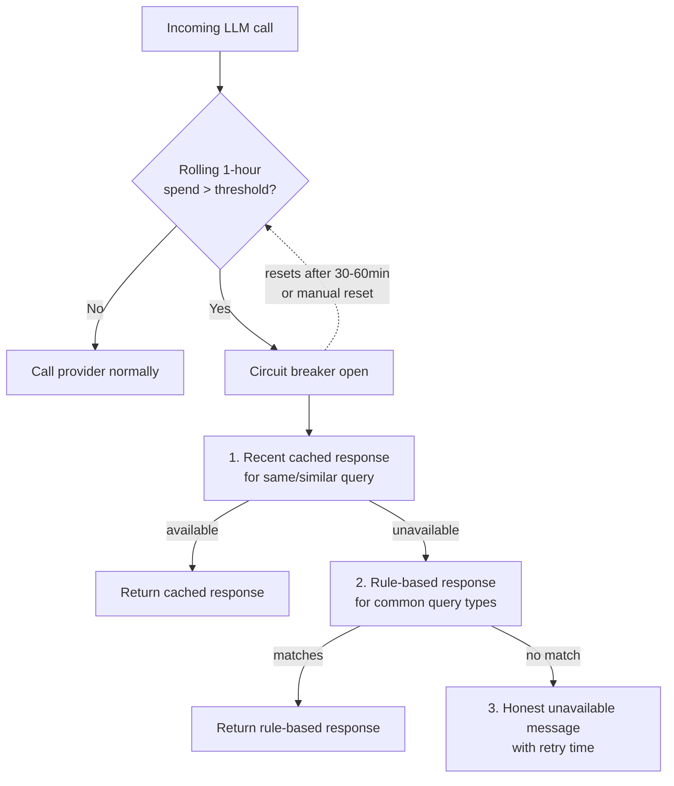
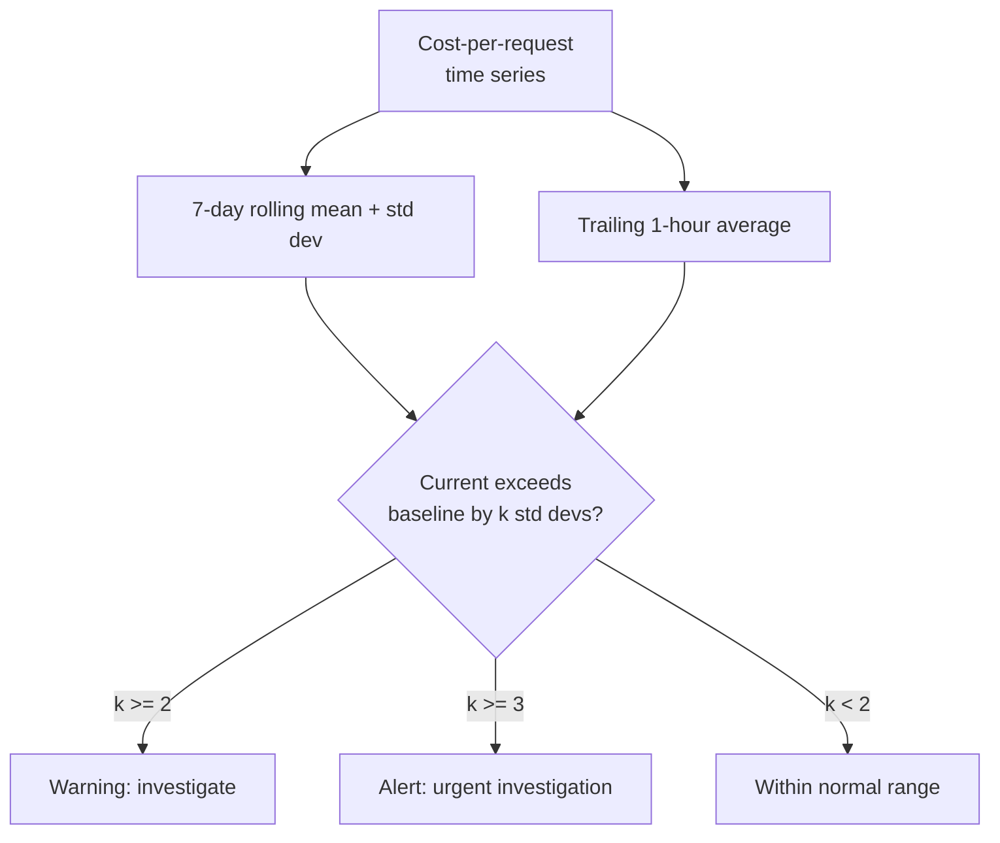
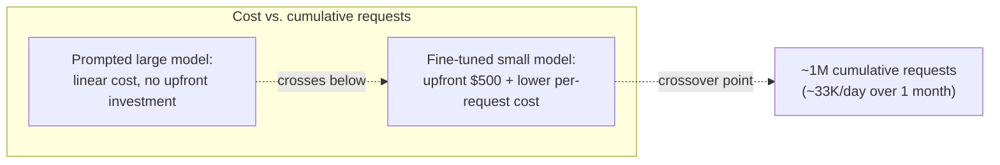

# Cost & Token Monitoring

## Overview

LLM cost is not a fixed infrastructure line item the way a database or a cache is — it scales directly with usage, directly with prompt design, and directly with quality decisions. A context window increase, a bigger model, a prompt change that injects three more retrieved documents: every one of these is simultaneously a quality decision and a cost decision, and a team that only tracks cost by reading the monthly invoice is making quality decisions with a hidden constraint they cannot see until it's already 30 days too late to have mattered. This chapter treats token-level cost as a first-class, real-time engineering metric — tracked per request, attributed per feature and per customer, with alerts and circuit breakers that catch runaway spend in hours instead of on next month's bill.

## Definition

Cost and token monitoring is the practice of computing, storing, and attributing an LLM cost estimate at the time of every call — from authoritative token counts and the price table active at call time — then aggregating that data per feature, per customer, and per model to make cost a queryable, alertable, real-time metric rather than a retrospective invoice line.

## Problem Statement

Two failure modes motivate treating cost as first-class instrumentation rather than an afterthought.

**Cost-quality coupling.** LLM cost and quality are directly linked, not independent: a longer context window improves quality and costs more; a larger model improves quality and costs more; injecting more retrieved documents into a RAG prompt improves quality and costs more. A team with no visibility into cost per request cannot make an informed tradeoff between these — they are optimizing quality against a budget constraint they cannot see, which is functionally the same as optimizing with no budget constraint at all until the bill arrives.

**The invoice surprise.** Many early-stage teams track LLM spend by reading the monthly provider invoice. By the time that invoice arrives, any cost regression that started on day one of the billing period has been running, unnoticed, for up to 30 days. A prompt change that doubled average context length doubles the bill — and first-class, per-request cost monitoring catches that within hours of deployment, not a month later when the finance team asks why the bill jumped.

**The scale math**, worked through explicitly: at 1M requests/day, averaging 2,000 input tokens and 500 output tokens per request, at Claude Sonnet 4.6 pricing of $3/million input tokens and $15/million output tokens:

```
daily_cost = 1,000,000 × (2,000 × $0.000003 + 500 × $0.000015)
           = 1,000,000 × ($0.006 + $0.0075)
           = 1,000,000 × $0.0135
           = $13,500/day
           = ~$405,000/month
```

Now take a prompt change that increases average input tokens by 10% — 200 extra tokens of injected context per request, which sounds trivial in a code review:

```
extra_daily_cost = 1,000,000 × 200 × $0.000003 = $600/day = ~$18,000/month
```

"Only 200 extra tokens" is a materially sized budget line item at this scale — an $18,000/month increase that, in most organizations, would require explicit budget approval if proposed directly, but sails through unreviewed as a casual prompt tweak precisely because nothing surfaced its cost impact at review time. This is the entire argument for treating cost impact estimation as a required step before shipping a prompt change, covered later in this chapter.

## Core Concepts

- **Token count** — the authoritative unit LLM providers bill on; input and output tokens are priced differently and must be tracked separately.
- **Cost per request** — `(input_tokens × input_price) + (output_tokens × output_price) + (cache_read_tokens × cache_price)`, computed at call time using the price table active at that time.
- **Feature attribution** — tagging every call with a `feature_name` so cost can be broken down by product feature.
- **Tenant attribution** — tagging every call with a `customer_id` for per-customer billing, cost concentration analysis, and usage-based pricing.
- **Circuit breaker** — a middleware pattern that autonomously intercepts LLM calls and returns a degraded response once a spend threshold is crossed, without waiting for a human to act on an alert.
- **Cost anomaly** — a statistically significant deviation of cost-per-request from its rolling baseline, the signal used to detect a prompt regression before it reaches the invoice.

## Token Counting and Cost Attribution Per Request

**Counting sources.** The LLM API response carries the authoritative token counts: `input_tokens` and `output_tokens` (plus `cache_read_input_tokens` for Anthropic's prompt caching), or the OpenAI-compatible equivalents `prompt_tokens` and `completion_tokens`. Client-side tokenizer estimates — run locally before the call, against the same tokenizer the provider uses — are useful for pre-call cost projection (deciding whether a request is likely to blow a budget before sending it), but they will differ from the API's authoritative count. The common sources of that difference are system-prompt special tokens the client-side tokenizer doesn't model, chat-template formatting overhead (role markers, turn delimiters), and rounding at message boundaries. Always compute the metric that drives alerting and billing from the API's returned counts, never the client-side estimate.

**Cost computation at call time**:

```
cost_usd = (input_tokens × input_price_per_token)
         + (output_tokens × output_price_per_token)
         + (cache_read_tokens × cache_price_per_token)
```

The prices used must be **stored in the span itself**, not referenced from a live price table. Provider prices change over time; if historical cost is recomputed later from whatever the current price table says, historical cost data silently becomes wrong every time a price changes — a cost trend that should show a flat baseline followed by a step change will instead show every historical data point moving together, destroying the ability to see when a real cost change actually happened.

**Multi-model cost attribution for agents.** An agent task typically makes multiple LLM calls, sometimes to different model tiers — a cheaper model for orchestration/routing steps, a stronger model for the step that actually needs it. Session-level cost is the sum of every call's cost within the session. Attribution to a feature happens by tagging every individual call with `feature_name` and aggregating at the session level, not by trying to attribute a fraction of a shared session to multiple features. The complication is shared infrastructure calls: if a safety classifier runs on every response regardless of which feature triggered it, its cost belongs to the platform layer, not to individual features — mixing it into per-feature cost attribution makes every feature look more expensive than its own decisions actually caused, and obscures the platform-layer cost as a separate, manageable line item.

**Prompt caching's cost impact.** Anthropic's prompt caching (and equivalent mechanisms from other providers) charges a lower rate for cache-hit input tokens — around $0.30/million versus $3/million for standard input tokens on Anthropic's pricing, roughly a 10× reduction. This requires tracking `cache_read_token_count` separately in the span (already part of the span schema in [Tracing LLM Calls](02-tracing-llm-calls.md)) and computing `cache_hit_rate = cache_read_tokens / total_input_tokens` as a daily metric. Cache hit rate is a cost signal worth its own monitoring: a drop from 60% to 20% after a prompt change means the change broke the stable prefix that was being cached — often because a variable value (a timestamp, a session-specific value) got moved earlier in the prompt than the cache boundary — and the resulting cost increase can be as large as a 10× jump on the affected token volume.

## Per-Feature and Per-Tenant Cost Breakdown

**Feature tagging.** Every LLM call must carry a `feature_name` (or `feature_id`) identifying which product feature triggered it, ideally with a tag hierarchy — product → feature → sub-feature — so drill-down queries like "what was the daily cost of `code_review` versus `documentation_generation` last week" are answerable directly. This enables cost-justified feature prioritization: a feature with a poor cost-per-quality-unit ratio is a candidate for optimization or deprioritization ahead of a feature with a good ratio, a comparison that's impossible to make at all without per-feature attribution.

**Customer/tenant tagging.** For B2B products, tagging every call with `customer_id` enables three distinct use cases: **per-customer billing** (usage-based pricing requires per-customer cost data as ground truth, not an estimate); **cost concentration analysis** (discovering that one customer drives 40% of total spend is simultaneously a business risk — over-reliance on one account — and an opportunity, a natural trigger for a cost-optimization or pricing conversation with that account); and **per-customer quality analysis** (is one customer's specific query pattern — longer documents, more complex questions — causing disproportionate cost relative to their contract tier?).

**The cost attribution hierarchy** — each level of drill-down answers a different question, and the hierarchy is what makes going from "total spend is up" to "here's the specific cause" tractable rather than a manual investigation from scratch each time:



**Multi-step agent cost attribution.** A session's total cost is the sum of every call within it, and that full session cost should be attributed to the feature that launched the session — not distributed across, or judged from, any single call in isolation. Per-call attribution is actively misleading for agents: a 15-call agent session costs roughly 15× more than any single call within it suggests, and a dashboard that surfaces average cost-per-LLM-call for an agentic feature will systematically understate what that feature actually costs per completed task. The metric that matters for agent features is cost-per-session (or cost-per-completed-task), not cost-per-call.

## Budget Alerts and Automatic Circuit Breakers

**Three alert levels**, each with a different urgency and audience:

| Alert | Trigger | Recipient | Urgency |
|---|---|---|---|
| Daily burn rate | `projected_daily_cost = current_cost × 86,400 / elapsed_seconds` exceeds `daily_budget × 1.2` | ML/product team | Investigate and adjust before end of day, not a 3am page |
| Hourly spike | Trailing 1-hour cost rate exceeds the 7-day average hourly rate × 2.0 | ML/product team, more urgently | Investigate promptly — a 2× spike is a traffic surge or a prompt regression, both need attention |
| Per-customer budget | A single customer's trailing 24-hour spend exceeds their tier's cost cap | Account team | Prevents one customer's usage from consuming budget allocated across the customer base |

**Automatic circuit breakers** exist for the case where an alert doesn't get acted on quickly enough — a genuine runaway needs a mechanism that doesn't depend on a human being awake and available. The implementation pattern is rate-tracking middleware maintaining a rolling 1-hour spend counter; when the counter crosses the circuit breaker threshold, the *next* LLM call is intercepted before it's sent to the provider and a degraded response is returned instead — a cached response, a simpler rule-based response, or an honest "temporarily unavailable" message — without incurring the API cost of the call that would have been made. The breaker resets after a configurable window (30-60 minutes is typical) or on manual reset by an engineer who has confirmed the underlying cause is understood.



**Graceful degradation under the breaker** matters as much as the breaker itself: a product that returns a hard error the moment the breaker trips looks broken, while a product that degrades through a clear hierarchy stays usable. The hierarchy: (1) return the most recent cached response for the same or a sufficiently similar query, if one exists; (2) fall back to a rule-based response for common, well-understood query types that don't strictly need the LLM; (3) as a last resort, return an honest "temporarily unavailable, retry in N minutes" message. Users hitting the degraded path should understand the situation from the message itself, not infer that the product is broken.

**Per-customer circuit breakers** enforce fair use in B2B products without penalizing every other customer for one account's spike. The standard implementation is a token bucket per customer: a counter that refills at the customer's contracted rate and blocks further calls once empty, returning a 429-style error with a `Retry-After` header — the same pattern as API rate limiting generally, applied to cost rather than raw request count.

## Cost Anomaly Detection

**The problem, restated concretely**: a prompt change that increases average context length by 30% produces a roughly 30% cost increase. If cost-per-request is a monitored, alertable metric, this surfaces within hours. If it isn't, it surfaces on the next invoice — 30 days of unnecessary spend later.

**The anomaly detection signal**: a rolling 1-hour average of cost-per-request that exceeds the 7-day rolling mean by more than *k* standard deviations — *k* = 2 for a warning, *k* = 3 for an alert. The 7-day rolling mean and standard deviation are computed continuously from the cost-per-request time series; a 2σ threshold carries roughly a 2.5% false positive rate under a normal-ish distribution assumption, which is tight enough to be trustworthy without generating constant noise, while 3σ is reserved for the cases urgent enough to justify a more assertive alert.



**Drill-down: finding the cost driver.** Once an anomaly fires, the investigation follows a fixed sequence, each step narrowing the search:

1. **Volume or per-request?** — Is total request volume up at constant cost-per-request (expected traffic growth, not a concern), or is cost-per-request itself up (a real change, investigate further)?
2. **Which feature?** — Compare per-feature cost-per-request in the anomaly window against baseline; the feature whose cost-per-request moved is the likely source.
3. **Which token type?** — Input tokens rising points to longer context (a retrieval or prompt-assembly change); output tokens rising points to longer generations (a prompt instruction change, or a model behavior shift).
4. **Did the prompt template version change?** — A `prompt_template_version` bump coincident with the anomaly window is, in practice, almost always the cause — this is exactly why `prompt_template_version` is captured unconditionally on every span (see [Tracing LLM Calls](02-tracing-llm-calls.md)).

**Cost impact analysis before shipping a prompt change.** The estimation formula:

```
new_estimated_daily_cost = daily_requests × new_avg_input_tokens × input_price
                          + daily_requests × new_avg_output_tokens × output_price
```

`new_avg_input_tokens` and `new_avg_output_tokens` are estimated by running the candidate prompt against a representative sample of recent production inputs and measuring the resulting token counts directly, rather than guessing. The CI gate integration: block a prompt change from merging if its estimated daily cost impact exceeds N% without an explicit, logged cost approval — the same pattern as an eval regression gate (see [CI/CD for AI Systems](../18-llmops/04-ci-cd-for-ai-systems.md)), applied to cost instead of quality, and for the same reason: a change that materially affects the budget shouldn't ship as a side effect of a change nobody reviewed for that dimension.

## Cost Modeling for Capacity Planning and Feature Design

**Breakeven analysis for fine-tuning.** A fine-tuned smaller model that matches a prompted larger model's quality costs less per request at sufficient volume, because inference cost scales with model size while fine-tuning cost is a one-time (or infrequent) investment. The breakeven condition:

```
fine_tuning_cost + inference_cost_small × monthly_requests × N
    ≤ inference_cost_large × monthly_requests × N
```

Solve for N (months) to find the breakeven point. A concrete worked example: fine-tuning costs $500, and the per-1,000-request inference saving from the smaller model is $0.50. Breakeven occurs at:

```
$500 = $0.50/1,000 requests × total_requests
total_requests = 1,000,000
```

At roughly 33,000 requests/day, that's a one-month breakeven — past that volume, the fine-tuned model is strictly cheaper for the same quality bar, which is the concrete threshold that turns "should we fine-tune" from a vague quality debate into a volume-driven cost decision. See [The Fine-Tuning Engineering Pipeline](../18-llmops/05-the-fine-tuning-pipeline.md) for the engineering side of this tradeoff.



**Context window cost cliff.** Features that inject large documents into context — long PDF summarization, code review across a large codebase — can run 20-50× the cost per request of a simple Q&A feature, purely from context size. Three architectural responses, in order of typical adoption: **summarize-first** (reduce the long document to a smaller representation before injecting it into the prompt, trading some fidelity for a large token reduction); **chunk-and-select** (inject only the most relevant chunks via retrieval rather than the full document — see [KV Cache Management](../15-model-serving/03-kv-cache-management.md) for the serving-side complement to this); **cache the long context** (if the same document is referenced repeatedly across requests, prompt caching turns a repeated large context cost into a one-time cache-write cost plus much cheaper cache-read costs on every subsequent call). The right choice depends on whether the document is referenced once (favor summarize-first or chunk-and-select) or repeatedly (favor caching).

## Tradeoffs

| Advantages | Disadvantages |
|---|---|
| Real-time cost-per-request visibility catches regressions in hours, not on next month's invoice | Requires storing prices at call time — a nontrivial schema decision that's easy to skip and expensive to retrofit |
| Per-feature/per-customer attribution makes cost-justified prioritization possible | Tag hierarchy (feature, customer, model) adds cardinality and instrumentation discipline every call site must maintain |
| Circuit breakers cap runaway spend autonomously, without waiting on a human to act on an alert | Poorly designed degradation makes the product look broken exactly when a graceful fallback would have preserved trust |
| Cost anomaly detection catches prompt regressions before they compound over a billing cycle | Statistical thresholds (2σ/3σ) need a genuinely stable baseline period; a noisy or short baseline produces false positives or false negatives |

## Scalability

- **Cost computation overhead**: computing `cost_usd` per request is a handful of multiplications against already-returned token counts — negligible overhead added to the request path, even at millions of requests/day.
- **Aggregation cardinality**: a cost attribution hierarchy tagged by `model_id` × `feature_name` × `customer_id` grows multiplicatively; at a few hundred features and thousands of customers, pre-aggregating daily rollups (rather than querying raw per-request records for every dashboard view) keeps drill-down queries fast.
- **Circuit breaker state**: a rolling 1-hour spend counter per customer, for a B2B product with tens of thousands of tenants, is a lightweight counter store (Redis or equivalent) — the design constraint is keeping the counter update on the hot request path fast, typically via an approximate or eventually-consistent increment rather than a strict transactional one.
- **Anomaly detection compute**: computing a 7-day rolling mean/std-dev over an hourly cost-per-request series is cheap time-series aggregation, well within what a standard metrics backend handles without dedicated infrastructure.

## Reliability

| Failure | Degradation strategy |
|---|---|
| Price table used for a cost computation is stale (provider changed pricing) | Version the price table itself and record which version was active in the span — historical costs stay correct even after future price changes |
| Circuit breaker threshold set too low, tripping on normal traffic variance | Treat the threshold as tunable, reviewed configuration against real traffic patterns, not a one-time guess; alert on breaker trip frequency itself as a signal the threshold may be miscalibrated |
| Per-customer circuit breaker blocks a legitimate burst (e.g., a customer's own traffic spike) | Token bucket refill rate should reflect contracted usage patterns, with a documented path for a customer to request a temporary limit increase rather than silently failing them |
| Cost anomaly alert fires on a benign traffic-composition shift (more of a naturally expensive feature, not a regression) | Drill-down step 1 (volume vs. cost-per-request, then per-feature breakdown) exists specifically to rule this out before escalating further |
| Circuit breaker degradation path itself fails (no cached response, no rule-based fallback available) | The honest "temporarily unavailable" message must always be the guaranteed last-resort path — never let degradation itself throw an unhandled error |

## Production Best Practices

1. Compute and store `cost_usd` on every span at call time, using the price table version active at that moment — never recompute historical cost from a current price table.
2. Tag every LLM call with `feature_name` and, for B2B products, `customer_id` — retrofitting attribution after cost becomes a business question is far more expensive than instrumenting it from day one.
3. Track cache hit rate as a first-class cost metric wherever prompt caching is in use — a silent drop is often a bigger cost regression than a token count increase.
4. Require a cost impact estimate before merging a prompt change that alters token counts materially, gated in CI the same way an eval regression is gated.
5. Build circuit breakers with a graceful degradation hierarchy (cached → rule-based → honest unavailable message), never a hard error, so a cost-driven fallback doesn't read to users as an outage.
6. Attribute agent session cost to the launching feature as a whole, not per individual call — cost-per-session, not cost-per-call, is the metric that reflects what an agentic feature actually costs.
7. Review circuit breaker and anomaly detection thresholds on a recurring cadence — traffic volume, pricing, and normal variance all shift underneath a threshold set once at launch.

## Interview Questions

### Beginner

**Q: Why shouldn't you compute LLM cost from a client-side tokenizer estimate instead of the API's returned token counts?**
Because the client-side estimate and the provider's authoritative count routinely differ — from system-prompt special tokens, chat-template formatting overhead, and message-boundary rounding that a local tokenizer doesn't fully replicate. The client-side estimate is useful for a rough pre-call projection, but any metric used for alerting, billing, or attribution should be computed from the API's returned `input_tokens`/`output_tokens`, which is the number the provider actually bills against.

**Q: Why is it a mistake to recompute historical cost using today's price table?**
Because provider prices change over time, and recomputing old costs against a current price table silently rewrites history — a flat historical baseline followed by a real cost change can turn into every historical data point moving together whenever a price updates, making it impossible to tell when an actual cost regression happened. The fix is storing the prices used directly in the span at call time, so historical cost data never changes retroactively.

### Intermediate

**Q: A prompt change increases average input tokens by 10%. Why might this be a bigger deal than it sounds?**
At meaningful scale, a 10% input token increase is not a rounding error — worked through at 1M requests/day and $3/million input tokens, 200 extra tokens per request is roughly $600/day, or about $18,000/month. That's a materially sized budget line most organizations would want explicit sign-off on, and the risk is that a change this size ships as a routine prompt tweak precisely because nothing surfaced its cost impact at review time.

**Q: Explain why a cost anomaly alert should check cost-per-request separately from total cost.**
Total cost rising while cost-per-request stays flat is usually just traffic growth — expected, not concerning. Cost-per-request rising is a real change: a longer prompt, a bigger model, more injected context, or a model behavior shift. Conflating the two means either missing real regressions (masked by declining traffic) or false-alarming on healthy growth; separating them is the first step in the anomaly drill-down.

### Senior

**Q: Design the cost attribution system for a multi-tenant B2B product with agentic features. What goes wrong if you attribute cost per LLM call instead of per session?**
Attributing per call systematically understates agentic feature cost: a 15-call agent session costs roughly 15× a single call, but a dashboard showing average per-call cost never surfaces that multiplier, making an expensive agentic feature look deceptively cheap next to a single-call feature with a similar per-call cost. The fix is tagging every call within a session with the session ID and the launching `feature_name`, summing to a session-level total, and reporting cost-per-session (or cost-per-completed-task) as the metric that actually reflects what the feature costs — with `customer_id` layered on top for per-tenant billing and cost concentration analysis.

**Q: When should a circuit breaker trip autonomously versus waiting for a human to act on an alert?**
Alerts assume a human is available and will act within the alert's expected response window — reasonable for a daily burn-rate warning, where investigating before end of day is enough. A circuit breaker exists for the case where either the response window is too short for a human to matter (an hourly spike that could 10x cost before anyone reads a Slack message) or the alert simply doesn't get acted on in time. The design principle is: alerts for anything with hours to react, autonomous circuit breakers layered on top for anything that could cause meaningful damage faster than a human can plausibly respond, with graceful degradation so the breaker tripping doesn't itself look like an outage.

### Staff

**Q: Your company's LLM spend has grown 5x in six months alongside user growth, but leadership wants to know if the growth is "healthy" or a warning sign. How do you answer with cost instrumentation, not intuition?**
Start with cost-per-request, not total cost — if cost-per-request has stayed flat while user and request volume both grew 5x, the growth is straightforwardly explained by adoption, not a hidden regression. If cost-per-request has also risen, drill into the attribution hierarchy: which features and customers account for the increase, and for those, whether input or output tokens grew — input growth points at context/retrieval changes, output growth at generation-length or model-tier changes. Cross-reference against `prompt_template_version` and model version history to check whether a specific shipped change lines up with the cost-per-request trend. The answer to leadership should be a specific decomposition — "X% of the increase is adoption, Y% is a context length change in feature Z shipped on date D, Z% is a model tier upgrade" — not a single aggregate number, because the aggregate can't distinguish healthy scaling from a compounding inefficiency that's been running unnoticed.

## Google-Level Follow-Ups

- "Your circuit breaker trips and falls back to a cached response for a real-time-sensitive query — say, 'what's my account balance right now.' What's wrong with the degradation hierarchy as described, and how would you fix it?" — probes whether the candidate recognizes that the cached-response fallback tier is only safe for queries where a stale answer isn't actively harmful, and that the degradation hierarchy needs a per-query-type policy (some queries should skip straight to the honest-unavailable tier) rather than one universal fallback order.
- "You attribute a shared safety classifier's cost to the platform layer rather than to individual features. A feature owner argues their feature's true cost, including the safety check that runs on every one of their responses, is understated. Who's right?" — probes whether the candidate can articulate that both framings are valid for different purposes: platform attribution is right for identifying where to invest platform-level cost optimization, while a feature's fully-loaded cost (including its share of shared infrastructure) is right for feature-level ROI decisions — the fix is exposing both views rather than picking one as canonical.
- "Your 7-day rolling baseline for cost-per-request anomaly detection was computed during a week with an unusual traffic mix. What breaks, and how do you know?" — probes for recognition that the baseline itself needs a staleness/quality check — a baseline computed over an atypical week produces both false positives (comparing against a mix that wasn't representative) and false negatives (a real regression that looks small relative to an already-elevated baseline), and the fix is validating the baseline period against a longer historical window before trusting it.
- "A customer's per-session cost breakdown shows a single session costing 50x the typical session for that feature. Walk through how you'd determine whether this is a legitimate outlier or a bug." — probes for a concrete investigation path: pull the session trace, check step count against typical distribution, check for a tool-call loop or retry storm inflating call count, check whether a single step's token count is anomalous versus the whole session being long — distinguishing "genuinely large task" from "the agent got stuck" requires the trace, not just the cost number.

## Common Mistakes

- **Tracking LLM cost only via the monthly provider invoice** — by the time it arrives, a cost regression has been running unnoticed for up to 30 days.
- **Recomputing historical cost from a current price table** instead of storing the price used at call time — silently corrupts historical cost trends every time pricing changes.
- **Attributing agent cost per LLM call instead of per session** — systematically understates the true cost of multi-step agentic features.
- **Shipping a prompt change that materially increases token counts without a cost impact estimate** — a "small" per-request increase compounds into a large budget line at production scale.
- **Building a circuit breaker with only a hard-error fallback** — makes a cost-control mechanism look like an outage to users, defeating the purpose of graceful degradation.
- **Setting anomaly detection or circuit breaker thresholds once at launch and never revisiting them** — traffic volume, pricing, and normal variance all shift, and a stale threshold either fires on noise or misses real regressions.

## Key Takeaways

- LLM cost and quality are directly coupled — every quality-improving decision (longer context, bigger model, more retrieved documents) is simultaneously a cost decision, which is why cost needs real-time visibility, not a monthly invoice.
- Cost per request must be computed at call time from authoritative API token counts and the price table active at that moment, stored in the span so historical cost never silently changes when prices update later.
- Feature and customer tagging turn cost into a queryable attribution hierarchy — model → feature → customer → request pattern — that makes drill-down from "spend is up" to "here's why" tractable.
- Agent session cost should be attributed and reported per session, not per call — per-call attribution systematically understates what agentic features actually cost.
- Three alert tiers (daily burn rate, hourly spike, per-customer budget) route to different audiences with different urgency, and circuit breakers exist as an autonomous backstop for when an alert alone isn't fast enough.
- Cost anomaly detection separates volume growth from cost-per-request growth first, then drills into feature, token type, and prompt version — the same discipline that makes cost regressions traceable to a specific shipped change.
- Cost impact estimation belongs in the CI gate for prompt changes, the same way an eval regression gate does — a change that materially affects the budget shouldn't ship as an unreviewed side effect.

---

*Part of [Observability](index.md) in the [AI System Design Notes](../index.md). Previous: [Tracing LLM Calls](02-tracing-llm-calls.md). Next: [Drift & Quality Monitoring](04-drift-and-quality-monitoring.md).*
