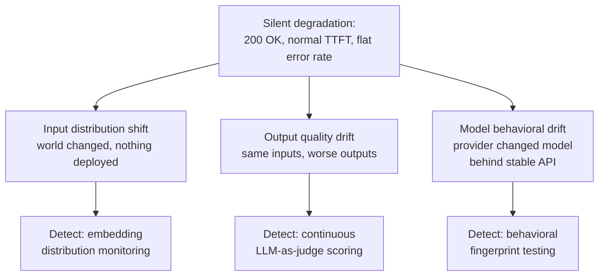
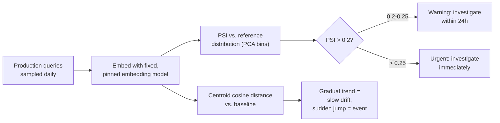
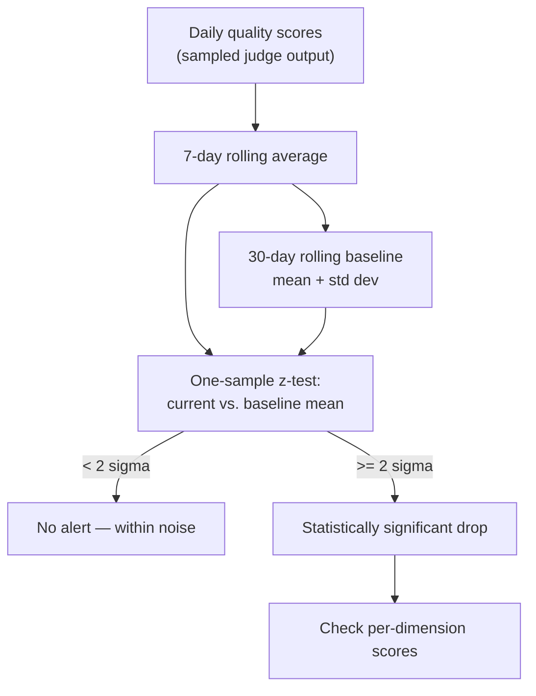
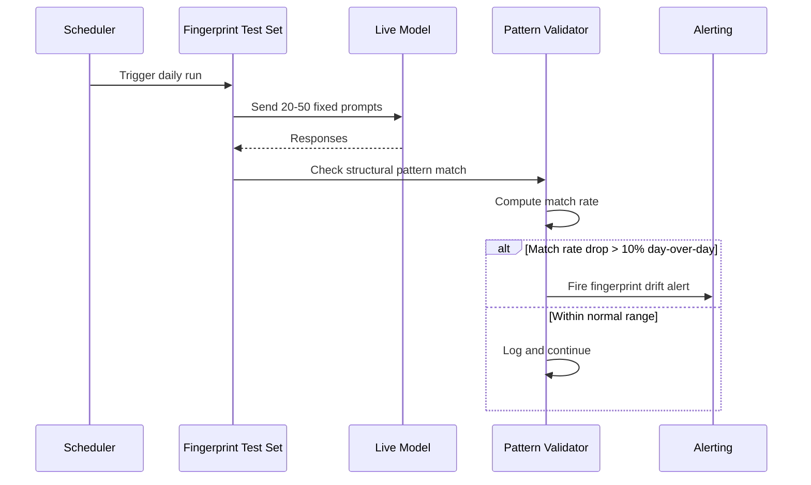
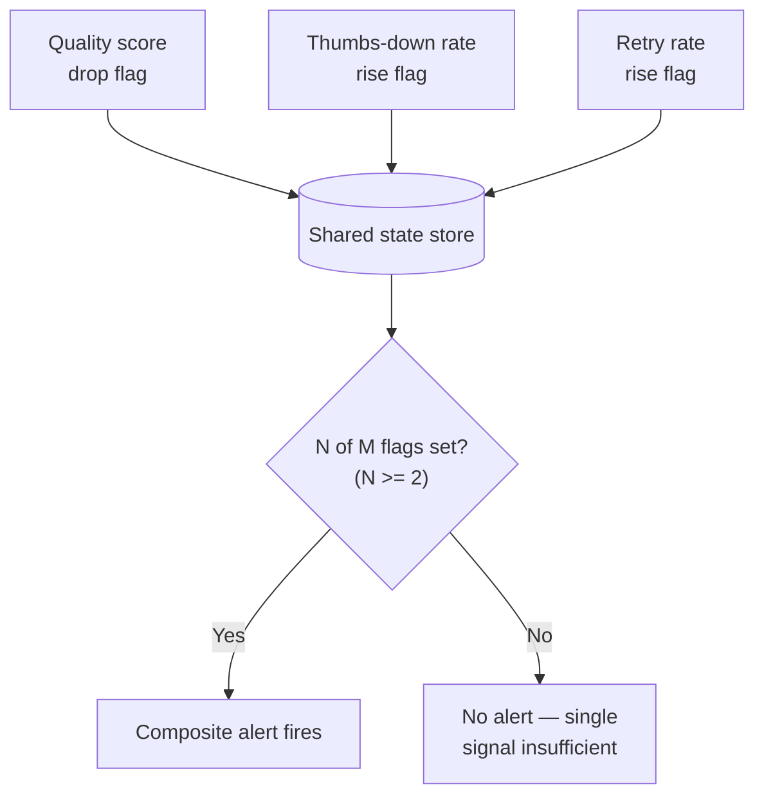
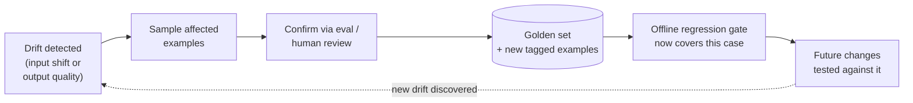

# Drift & Quality Monitoring

## Overview

This is the hardest monitoring problem in production AI systems, because it produces no service error, no timeout, no exception, and no classical APM alert. Every previous chapter in this section assumed a failure eventually shows up somewhere — an elevated error rate, a cost spike, a latency regression. Drift doesn't. The model returns 200 OK. TTFT is inside SLA. Error rate is flat. The response is just subtly worse than it was last week, and nothing in the infrastructure stack was built to notice that on its own. This chapter covers the three independent ways an AI system quietly gets worse, why each needs its own detection method, and how to alert on a signal that is inherently noisy without either drowning in false alarms or missing the regression until it's affected a large share of users.

## Definition

Drift and quality monitoring is the practice of detecting a decline in AI system output quality that leaves no trace in classical service-health metrics — covering input distribution shift (what users ask changes), output quality drift (the same inputs now produce worse outputs), and model behavioral drift (the provider silently changed the model) — each with its own detection signal, and a shared alerting discipline calibrated against the real noise floor of quality metrics so that alerts stay credible rather than becoming background noise.

## Problem Statement

In traditional software, degradation almost always manifests as something loud: errors, timeouts, slowdowns, exceptions. In AI systems, quality can decline with none of that. This decoupling between service health and quality health is the defining operational challenge of running AI systems in production, and it has exactly three independent root causes, each requiring a different monitor:

- **Input distribution shift** — users are asking different things than before. Nothing was deployed; the system changed because the world changed.
- **Output quality drift** — the model's responses to the *same* inputs have gotten worse, caused by a provider-side model update, a stale retrieval corpus, or a cascading context change.
- **Model behavioral drift** — the upstream provider silently updated model weights behind a stable API version. Same request, different behavior, entirely outside your own deploy log.



No single monitor catches all three, and that's the organizing idea of this chapter: input distribution shift is invisible to a judge scoring fixed prompts, model behavioral drift is invisible to embedding-distribution monitoring of user queries (the queries haven't changed), and output quality drift on real traffic is invisible to a fingerprint test that only checks a fixed prompt set. Each cause needs its own monitor running continuously, in parallel.

## Core Concepts

- **Population Stability Index (PSI)** — a symmetric measure of how much a distribution has shifted from a reference baseline, used here on embedded query distributions.
- **Behavioral fingerprint** — a fixed set of handcrafted prompts with expected structural output patterns, run against the live model on a schedule to detect provider-side changes.
- **Rolling average window** — a smoothing technique that absorbs day-to-day quality score noise while preserving real week-over-week trends.
- **Implicit signal composite** — a weighted combination of behavioral proxies (thumbs-down rate, retry rate, escalation rate) used when explicit quality scoring is unreliable or unavailable.
- **Statistical significance gate** — a check (typically a one-sample z-test against a baseline noise floor) that prevents alerting on movement that's within normal variance.
- **Golden set feedback loop** — the mechanism by which a confirmed drift-caused regression becomes a permanent addition to the offline regression set, closing the loop from detection back into the release gate.

## Input Distribution Drift

**What it is and why it happens.** The statistical distribution of user queries shifts over time for reasons that have nothing to do with any change your team made: a new product feature launches and attracts users with different query patterns; a marketing campaign brings a new user demographic; a viral moment floods the product with a query type it was never designed for; seasonal patterns shift the topic mix; early adopters had different needs than the mainstream users who arrive later.

**Why it matters for quality.** The prompt and model were co-optimized against the *historical* query distribution — the golden set, the few-shot examples, the retrieval corpus were all built against what users used to ask. When the distribution shifts, the system encounters inputs it wasn't tuned for, and quality can decline specifically for the new input types while the aggregate quality metric barely moves, because the shift is diluted across a large volume of unaffected traffic rather than concentrated in one obvious failure.

**Detection — embedding distribution monitoring.** Sample production queries daily (or hourly at high volume), embed them with a fixed, version-pinned embedding model — the embedding model itself must never change silently, or every subsequent comparison becomes invalid — and track two signals:

*Population Stability Index (PSI)*:

```
PSI = Σ [(observed_freq_i - expected_freq_i) × ln(observed_freq_i / expected_freq_i)]
```

computed across buckets of the embedding space. The standard bucketing approach: run PCA on the reference-period embeddings, discretize the first principal component into N bins (N=10 is typical), and compute observed vs. expected frequencies per bin. Interpretation:

| PSI range | Meaning |
|---|---|
| < 0.1 | No significant shift |
| 0.1 – 0.2 | Minor shift, monitor |
| 0.2 – 0.25 | Moderate shift, investigate |
| > 0.25 | Major shift, quality impact likely |

PSI is used rather than KL divergence specifically because PSI is symmetric — two distributions that are "different" from each other in the same way, regardless of which one is labeled "reference," should produce the same distance, and KL divergence doesn't guarantee that. The computational cost is light: embedding roughly 1% of daily queries plus a PSI computation over a handful of bins is cheap relative to the traffic volume it's monitoring.

*Mean embedding drift*: compute the centroid of today's query embeddings and the centroid of the baseline period's embeddings, and track the cosine distance between them over time. A gradual upward trend indicates slow drift; a sudden jump indicates a discrete event — a feature launch, a viral moment — that's worth correlating against a product change log directly.



**Detection — complementary input feature monitoring.** Embedding distribution is the primary signal, but several cheaper, more interpretable signals corroborate it: input length distribution (P25/P50/P75/P99 tracked daily — a rising P99 means more edge-case-length queries arriving); language distribution for multilingual products (a shift toward underrepresented languages is a specific, checkable quality risk); query intent classification distribution, if an intent classifier exists (a new intent class appearing in the top-5 is a coverage gap worth investigating directly); vocabulary novelty (new terms entering the top-100 most frequent words that weren't present 30 days ago).

**Alert thresholds and response.** PSI ≥ 0.2 is a warning — investigate within 24 hours. PSI ≥ 0.25 is urgent — investigate immediately. The response sequence: (1) cluster recent query embeddings and identify which clusters are new or have shifted; (2) sample representative examples from the shifted clusters; (3) run those examples through the quality eval pipeline; (4) if quality is degraded specifically on the new inputs, update the prompt or plan a fine-tuning pass; (5) add examples from the new input clusters into the golden set, tagged by the new cluster, so the same shift can never again cause a silent regression.

## Output Quality Drift

**The online quality score time series** is the primary detection mechanism: an async pipeline scores a sample of production requests with an LLM-as-judge and writes per-dimension quality scores into a time-series database, exactly the eval-as-signal pillar described in [AI Observability Architecture](01-ai-observability-architecture.md) and detailed in [LLM-as-Judge](../19-evaluation/03-llm-as-judge.md). This is the signal that catches a regression when *nothing* about the inputs changed and *nothing* about deployed artifacts changed either — the model itself simply started responding differently.

**Smoothing and trend detection.** Daily quality scores carry natural variance from input distribution patterns alone — weekday traffic differs from weekend traffic, evening queries differ from morning ones — so a raw daily plot is dominated by noise that has nothing to do with real quality movement. A 7-day rolling average smooths this out while preserving genuine week-over-week trends, tracked against a 30-day rolling baseline; when the 7-day average drops below the 30-day baseline by more than a set threshold, that's the trigger to check statistical significance.

**Statistical significance checking before alerting.** Before treating an observed drop as real, check whether it's larger than the noise floor: estimate the noise floor from roughly two weeks of stable baseline data (the standard deviation of the daily 7-day rolling average during that period), then alert only when the current rolling average sits more than 2 standard deviations below the baseline mean — a one-sample z-test. At 2σ, the false positive rate is roughly 2.5% under a normal approximation — tight enough to be trustworthy without generating constant noise. Alerting at 1σ would push the false positive rate high enough (roughly 16%) to produce unacceptable alert fatigue; the team would learn to ignore the channel within weeks.



**Per-dimension monitoring.** Track every rubric dimension separately, not just the aggregate. An aggregate score that stays flat can hide a real regression on one dimension offset by an improvement on another — a safety-dimension drop masked by a tone improvement is exactly the failure a per-dimension view exists to catch, and safety dimension drops should alert at a lower threshold than a style dimension drop, because the cost of missing one is categorically higher.

**Proxy metrics when ground truth is unavailable.** For outputs where quality is inherently hard to judge — creative writing, open-ended advice, multi-turn dialogue — proxy metrics become the primary drift signal instead of a supplement to it:

- **Implicit signal composites** — combine thumbs-down rate, retry rate, and escalation rate into one weighted composite. Each individual signal is noisy on its own; the composite is materially more stable, and is tracked against a 30-day baseline with the same rolling-average-plus-z-test approach used for the quality score itself.
- **Response length consistency** — track the output token count distribution (P25/P50/P75/P99). A model that used to give 200-300 token answers but now consistently gives 50-token answers has likely regressed toward under-informativeness; one that jumps to 1,000-token answers for previously 200-token tasks may have entered an unwanted verbose mode.
- **Format compliance rate** — for outputs expected to conform to a structure (JSON, specific markdown headings, numbered lists), the fraction passing a format validator is a measurable regression signal independent of semantic quality — a real, quantifiable metric even when "is this a good answer" is hard to score directly.
- **Refusal rate** — the fraction of requests where the model refuses, returns an empty response, or trips the content filter. An unexplained rise means the model is over-triggering and turning away legitimate requests, a distinct and directly measurable failure mode.

## Behavioral Fingerprint Testing for Provider-Side Model Updates

**The problem.** A provider updates model weights behind a stable API version — no changelog entry, no notification, nothing in your own deploy log. Your model's behavior changes anyway. Because nothing was deployed on your side, this failure mode is invisible to any monitoring built around "what changed in our system."

**The behavioral fingerprint.** Maintain a fixed set of 20-50 handcrafted prompts, each paired with an expected *structural* output pattern rather than an exact string — "should return a JSON object with these specific keys," "should refuse this request with a safety message," "should respond in under 100 words," "should produce at least one code block when given a programming question." Run this fixed set against the live model on a schedule (every 24 hours is typical), independent of any deployment trigger — the whole point is that it runs on a clock, not on a deploy event, because the change being detected doesn't correspond to any deploy event at all.

**Pattern matching, not string matching.** Match against structural patterns — regex, structural validators, presence-of-content-type checks — rather than exact strings, because the exact wording of a response varies even within a single, unchanged model version. A pattern that's too loose misses real behavioral shifts; one that's too tight false-positives on normal model variance. The calibration goal is a pattern specific enough to catch a real structural change (missing JSON key, unexpected refusal, format violation) while tolerant of the paraphrase-level variance a model produces on every call regardless of any underlying change.



**Fingerprint drift alert.** If the fraction of prompts matching their expected pattern drops by more than 10% in a single day, alert. The investigation path: which specific prompts failed their pattern check; what did the model actually respond with instead of the expected pattern; is the new behavior better, worse, or just different. The response options: update the prompt to work with the new behavior (if the change is benign or even an improvement); pin to an explicit, older model version if the provider's API supports version pinning and the new behavior is a regression; or file a support ticket with the provider documenting the specific structural change observed.

**Calibration of the fingerprint set.** The set itself needs maintenance, not a set-and-forget assumption: add new prompts whenever a new capability ships (a new tool integration needs its own fingerprint test checking the model invokes the tool correctly), remove prompts for deprecated capabilities, and review the full set on a quarterly cadence to confirm it still reflects what the product actually depends on the model to do reliably.

## Alert Design for Inherently Noisy Quality Metrics

**The core tension.** Quality scores have real, natural variance. Alert too sensitively and engineers stop responding because the channel is always firing on noise; alert too insensitively and a real regression reaches a large share of users before anyone notices. The right calibration depends on the actual noise floor of the specific metric being tracked, not a one-size-fits-all threshold copied from another system.

**Rolling average windows scale with sample size, not a fixed rule.** At 100,000 requests/day with 1% sampling, that's 1,000 quality scores/day — a 7-day rolling average aggregates 7,000 points, plenty for a stable estimate. At 1,000 requests/day with 5% sampling, that's only 50 scores/day — a 7-day window gives just 350 points, materially lower confidence; the right response is either a longer window (14 days) or a higher sampling rate, not treating the same 7-day rule as universally sufficient.

**Relative thresholds beat absolute thresholds.** Alert when the rolling average drops more than N% below the 30-day baseline — not when it crosses a fixed absolute value. An absolute threshold of 0.75 is meaningless without context: if the baseline was 0.78, a 3-point drop from baseline is a real, significant regression; the same absolute 0.75 reading with a baseline of 0.72 is actually an improvement. Absolute thresholds also go stale as the model genuinely improves over time — yesterday's 0.75 might be today's 0.80 baseline, and a threshold frozen at launch either stops firing on real regressions or fires constantly on normal variance around a shifted baseline.

**Composite alert signals reduce false positives without losing sensitivity.** No single metric should page anyone by itself. Alert when multiple *independent* signals move in the same direction simultaneously — quality score drops *and* thumbs-down rate rises *and* retry rate rises. The implementation pattern: each signal check writes a flag to a shared state store, and a composite alert fires when N of M flags are set (N ≥ 2 is typical). This composite has a far lower false positive rate than any individual signal, because independent noisy signals rarely align by chance, while remaining highly sensitive to a real regression, which tends to move several correlated signals together.



**Alert severity tiers with different response SLOs**:

| Tier | Trigger | Channel | Response SLO |
|---|---|---|---|
| Informational | Small sustained drift over 7+ days, one composite signal moving | Slack notification to ML team | Next business day |
| Warning | Statistically significant drop in two or more signals, sustained over 48 hours | Slack page to ML team | Within 4 hours |
| Critical | Large sudden drop in quality score plus implicit signals, or any safety-dimension drop | PagerDuty page to on-call ML engineer | Immediately |

**Avoiding alert fatigue by separating channels.** Quality alerts should route to a separate channel from infrastructure alerts, mirroring the alert-routing discipline in [AI Observability Architecture](01-ai-observability-architecture.md). An on-call engineer receiving quality regression alerts mixed with 5xx alerts learns, correctly but unhelpfully, to deprioritize the ones that don't look as immediately dangerous — and quality regressions, while real incidents, rarely look as immediately dangerous as a 5xx spike even when they're just as costly over time. Separate channels reinforce that quality regressions get treated as genuine incidents, not background noise.

## Closing the Loop: From Drift Detection to Golden Set Update

Detection without a feedback mechanism just means the same failure mode gets rediscovered — and re-investigated from scratch — every time it recurs. Both drift-detection paths close the same way, back into the offline regression set covered in [Regression Testing for LLMs](../19-evaluation/05-regression-testing-for-llms.md):

- **Input distribution drift detected** → sample examples from the new input clusters → run them through the quality eval pipeline → if quality is degraded, add them to the golden set tagged under the new input cluster → the same shift can no longer cause a silent regression the next time it recurs, because the offline gate now tests against it directly.
- **Output quality drift detected** → pull the low-scoring production samples from the drift window → human-review a sample to confirm the drop is real, not a judge artifact → add confirmed examples to the golden set → update the prompt or fine-tune to address the root cause → verify the fix specifically against the new golden set entries before considering it resolved.



This loop — drift detected, examples added to the golden set, offline gate strengthened — is what makes the eval and monitoring system compound in value over time instead of staying static; see [AI Incident Response](../18-llmops/06-ai-incident-response.md) for how this same feedback discipline shows up in the post-mortem process, and [Continual Learning and Model Freshness](../18-llmops/07-continual-learning-and-model-freshness.md) for how a confirmed, persistent input-distribution shift feeds into the model refresh cycle rather than only the golden set.

## Tradeoffs

| Advantages | Disadvantages |
|---|---|
| Three independent monitors catch three genuinely independent failure causes no single signal would see | Running all three (embedding drift, judge scoring, fingerprint tests) is real, ongoing infrastructure, not a one-time build |
| Statistical significance gating keeps alerts credible instead of firing on routine variance | Requires a genuinely stable baseline period to calibrate against — a baseline computed during an atypical week produces a miscalibrated noise floor |
| Composite alerting sharply reduces false positives while preserving sensitivity to real regressions | Adds coordination complexity — multiple independent flag sources need a shared state store and a defined N-of-M rule |
| The golden-set feedback loop compounds detection coverage over time | Requires disciplined triage after every drift alert; a detection with no follow-through provides no lasting benefit |

## Scalability

- **Embedding sampling cost**: embedding roughly 1% of daily queries at 100,000 requests/day is 1,000 embedding calls/day — negligible relative to the LLM call volume it's monitoring.
- **PSI computation**: bucketing into ~10 bins and computing PSI daily is a lightweight aggregation, well under a second of compute even at millions of sampled queries.
- **Fingerprint test cost**: 20-50 prompts run once every 24 hours is a trivial, fixed daily cost regardless of production traffic volume — it doesn't scale with request volume at all, which is exactly why it's cheap enough to run unconditionally.
- **Quality score sample size at low volume**: a product doing 1,000 requests/day at 5% sampling produces only 50 judge scores/day; below roughly this volume, widening the rolling window (14 days instead of 7) or raising the sampling rate is necessary to keep the statistical significance test meaningful — see [LLM Evaluation Architecture](../19-evaluation/01-llm-evaluation-architecture.md#scalability) for the underlying sample-size guidance this borrows from.

## Reliability

| Failure | Degradation strategy |
|---|---|
| Embedding model used for drift detection is silently updated | Pin the embedding model version explicitly; any embedding model change invalidates prior baselines and requires re-establishing them, not a direct comparison across the change |
| Fingerprint test set goes stale (no longer reflects current product capabilities) | Quarterly review cadence with mandatory updates whenever a new capability ships — treat fingerprint coverage gaps the same as golden-set coverage gaps |
| Composite alert never fires because independent flags rarely align | Periodically audit whether N (the flags-required threshold) is calibrated correctly against real historical incidents, not just theoretical noise reduction |
| Statistical baseline computed during an atypical period (e.g., a holiday week) | Validate the baseline period against a longer historical window before trusting it; flag and exclude known atypical periods from baseline computation |
| Drift detected but never triaged into the golden set | Treat "drift alert with no golden-set follow-up within N days" as its own tracked metric — an untriaged alert provides no lasting benefit |

## Production Best Practices

1. Run all three drift monitors — embedding distribution, continuous judge scoring, behavioral fingerprint testing — in parallel and independently; none of them substitutes for either of the others.
2. Pin the embedding model used for drift detection the same way you pin the production LLM's version — an unpinned embedding model invalidates every baseline comparison silently.
3. Use rolling averages and relative (baseline-percentage) thresholds instead of raw daily values and absolute thresholds — both choices exist specifically to survive natural variance and long-term score drift without going stale.
4. Require statistical significance (a z-test against a genuinely stable baseline) before any quality alert fires — this is what keeps the channel trustworthy enough that engineers keep responding to it.
5. Require at least two independent signals to move together before paging anyone — a composite alert rule with N ≥ 2 cuts false positives sharply while staying sensitive to real regressions.
6. Route quality and drift alerts to a channel separate from infrastructure alerts, with severity tiers mapped to different response SLOs, not one undifferentiated stream.
7. Treat every confirmed drift incident as an update to the golden set, not just an incident to close — the feedback loop is what prevents the same regression from recurring silently next time.

## Interview Questions

### Beginner

**Q: Why can an AI system's quality decline while every infrastructure metric stays completely normal?**
Because error rate, latency, and uptime measure whether the service is running correctly, not whether its output is good. A model can return a 200 status code within normal latency and still produce a subtly worse answer than it did last week — nothing about that failure mode touches any signal infrastructure monitoring was built to catch, which is exactly why quality needs its own dedicated monitoring pipeline.

**Q: What's the difference between input distribution shift and output quality drift?**
Input distribution shift means users are asking different things than before — the queries themselves changed, and the system wasn't tuned for the new pattern, even though nothing about the model or prompt changed. Output quality drift means the *same* inputs now produce worse outputs than they used to — nothing about what users ask changed, but the system's response to it got worse, typically from a provider-side model update, a stale retrieval corpus, or a prompt regression.

### Intermediate

**Q: Why use a 7-day rolling average for quality scores instead of plotting raw daily scores?**
Daily quality scores have real variance driven by input distribution patterns that have nothing to do with actual quality change — weekday traffic differs from weekend traffic, for instance. A raw daily plot is dominated by this noise. A 7-day rolling average smooths it out while still revealing a genuine week-over-week trend, which is the signal that actually matters for detecting drift.

**Q: A behavioral fingerprint test's match rate drops 15% overnight with no deploy on your side. What's your first hypothesis, and how do you confirm it?**
The first hypothesis is a provider-side model update behind a stable API version — the classic cause of a fingerprint drop with nothing in your own deploy log. Confirm by looking at exactly which fingerprint prompts failed and what the model returned instead of the expected structural pattern; if the new outputs are structurally different (a missing JSON key, an unexpected refusal, a different response length pattern) rather than just superficially reworded, that's strong evidence of an actual behavioral change rather than normal model variance.

### Senior

**Q: Your quality score dashboard shows a statistically significant drop, but thumbs-down rate and retry rate haven't moved at all. How do you interpret this?**
This is exactly the scenario a composite alerting rule is designed to catch before paging anyone: a single signal moving without corroboration from independent behavioral proxies is weaker evidence than it looks, and could reflect a judge-model artifact (the judge itself drifted, or a rubric dimension is being scored inconsistently) rather than a real, user-visible quality change. The right response is to investigate the judge pipeline's own stability first — check judge/human agreement on recent samples — before treating this as a confirmed regression, precisely because a composite of independent signals is more trustworthy than any single one.

**Q: How would you distinguish input distribution shift from output quality drift when a quality score drops and you can't immediately tell which caused it?**
Run the embedding distribution monitor and the continuous judge score in parallel and look at where the quality drop concentrates. If the drop is spread evenly across the traffic distribution with no shift in the input embedding distribution or PSI, it's more likely output quality drift — the same kinds of inputs are being handled worse. If the quality drop is concentrated specifically in newly-appearing or shifted embedding clusters, with PSI simultaneously elevated, it's input distribution shift — the system is encountering genuinely new input patterns it wasn't tuned for. The two signals, run together, are what make this distinguishable rather than a guess.

### Staff

**Q: Design the full drift and quality monitoring architecture for a new production AI feature, from scratch. What's the build order, and why?**
Start with continuous judge scoring on sampled production traffic, because output quality drift — including prompt regressions your own team causes — is the most common and highest-frequency failure mode, and it reuses the eval-as-signal infrastructure that should already exist from the offline eval gate. Next, build the behavioral fingerprint test, because it's cheap (a fixed, small prompt set run daily, independent of traffic volume) and catches an entire failure category — provider-side model drift — that judge scoring on production traffic alone won't reliably distinguish from a genuine prompt issue, since both look like "quality dropped" without a fingerprint test to separate cause. Last, build embedding-based input distribution monitoring, because it requires the most new infrastructure (an embedding pipeline, PSI computation, clustering tooling) and addresses a slower-moving, less frequent failure mode than the other two. Wire the golden-set feedback loop in from day one for all three, not as a later addition — a drift monitor that detects but doesn't feed back into the offline gate provides only half its value. The order reflects frequency and cost: cover the common, cheap-to-detect failure first, then the cheap-but-distinct one, then the more expensive and slower-moving one.

**Q: Your composite alert (quality score + thumbs-down + retry rate) has fired correctly for six months with no false positives, but a competitor's model update caused a real quality regression your system never caught. What does this reveal about the monitoring architecture?**
It reveals a coverage gap, not a calibration failure — a zero false-positive rate for six months on a composite threshold this conservative most likely means the bar was set to catch large, multi-signal regressions, while the missed regression was either small enough to stay under threshold on every signal, or was a category (like a subtle behavioral change caught only by fingerprint testing, not by the aggregate judge score or implicit signals) that this particular composite was never built to detect. The fix isn't to loosen the composite threshold — that reintroduces the false-positive problem this design specifically avoided — it's to check whether the missed regression would have shown up in a different monitor (the fingerprint test, or a specific rubric dimension rather than the aggregate score) and invest there, treating "six months with no false positives" as a data point about specificity, not a signal that the whole system is well-calibrated across every failure mode.

## Google-Level Follow-Ups

- "Your embedding-based drift monitor and your LLM-judge quality score disagree — PSI shows no significant input shift, but quality score has dropped. What does this combination specifically rule out, and what does it point to instead?" — probes whether the candidate reasons through the taxonomy correctly: no input shift plus a real quality drop on the same input mix rules out input distribution shift as the cause and points specifically at output quality drift — either a provider-side model change (check the fingerprint test) or an internal cause (retrieval corpus staleness, a prompt regression) — rather than treating "quality dropped" as one undifferentiated category.
- "You're running a behavioral fingerprint test with 30 prompts. The provider ships a genuine, disclosed model improvement that changes the exact wording of typical responses without changing their structure. Does your fingerprint test fire, and should it?" — probes whether the candidate understands the pattern-matching-not-string-matching design specifically: a well-calibrated fingerprint test should tolerate wording changes that preserve structure and shouldn't fire, and if it does fire on this case, that's evidence the patterns were defined too tightly (closer to string matching than structural matching), which is a design bug in the fingerprint set, not a real detection.
- "Your golden-set feedback loop adds every confirmed drift example back into the regression set. After two years, the golden set has grown 50x. What operational problem does this create, and how do you manage it?" — probes for awareness of golden-set bloat's real cost: CI gate runtime scales with golden-set size, and an unbounded set eventually makes the offline gate too slow to run on every change (echoing the same tension in [LLM Evaluation Architecture](../19-evaluation/01-llm-evaluation-architecture.md)) — the fix is periodic curation, retiring redundant examples within a well-covered slice, not letting every historical drift incident accumulate forever unmanaged.
- "A customer complains their AI experience feels worse, but your quality score, thumbs-down rate, retry rate, and fingerprint test are all clean for your traffic overall. What's the specific monitoring gap this suggests?" — probes whether the candidate identifies that aggregate monitoring across all traffic can mask a regression concentrated in one customer's or one segment's specific query pattern, and proposes stratified monitoring (per-customer or per-segment quality tracking, not just a global aggregate) as the fix — the same principle as stratified sampling in the offline eval architecture, applied to the online monitoring side.

## Common Mistakes

- **Building only one of the three drift monitors** and assuming it covers all silent degradation — input shift, output drift, and model behavioral drift are independent causes that each require their own detection method.
- **Alerting on raw daily quality scores instead of a rolling average** — natural day-to-day variance drowns any real signal and trains the team to distrust or ignore the metric.
- **Using an absolute quality score threshold** instead of a baseline-relative one — goes stale as the model genuinely improves, and is meaningless without knowing what the baseline actually was.
- **Letting a single noisy signal trigger a page** instead of requiring corroboration from independent signals — the single largest driver of alert fatigue in quality monitoring.
- **Running a behavioral fingerprint test with exact string matching instead of structural pattern matching** — false-positives constantly on normal model paraphrase variance that has nothing to do with a real behavioral change.
- **Detecting drift without a golden-set feedback step** — the same regression class recurs and gets re-investigated from scratch every time, because nothing was learned from the first occurrence.

## Key Takeaways

- Silent quality degradation is the defining operational challenge of production AI systems — the model returns 200 OK, latency and error rate stay normal, and nothing in classical APM was built to notice the output got worse.
- There are three independent causes of silent degradation — input distribution shift, output quality drift, and model behavioral drift — each requiring its own detection method: embedding distribution monitoring, continuous LLM-as-judge scoring, and behavioral fingerprint testing, respectively.
- PSI is the standard metric for embedding distribution drift because it's symmetric, with clear interpretation bands (< 0.1 none, 0.1-0.2 minor, 0.2-0.25 moderate, > 0.25 major).
- Rolling averages and baseline-relative thresholds, not raw values and absolute thresholds, are what keep quality alerting meaningful as both traffic and the model's own baseline shift over time.
- Composite alerting — requiring two or more independent signals to move together before paging — is what keeps quality alerts credible; any single noisy signal alone produces unacceptable alert fatigue at the sensitivity needed to catch real regressions.
- Behavioral fingerprint tests run on a schedule, independent of any deploy trigger, because model behavioral drift is caused by the provider, not by anything in your own deploy log, and pattern matching (not exact string matching) is what keeps the test tolerant of normal paraphrase variance.
- The golden-set feedback loop — every confirmed drift incident becomes a new, tagged golden-set entry — is what makes drift monitoring compound in value over time rather than re-discovering and re-investigating the same failure mode indefinitely.

---

*Part of [Observability](index.md) in the [AI System Design Notes](../index.md). Previous: [Cost & Token Monitoring](03-cost-and-token-monitoring.md).*
