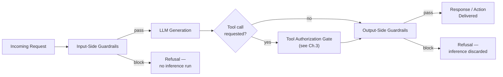
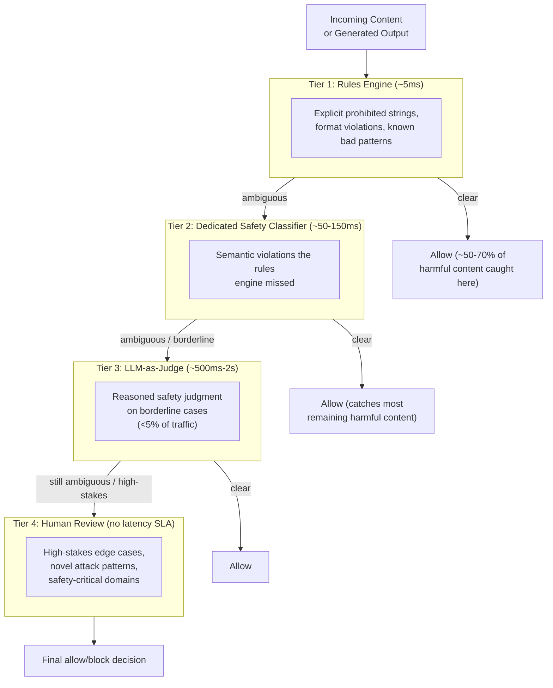
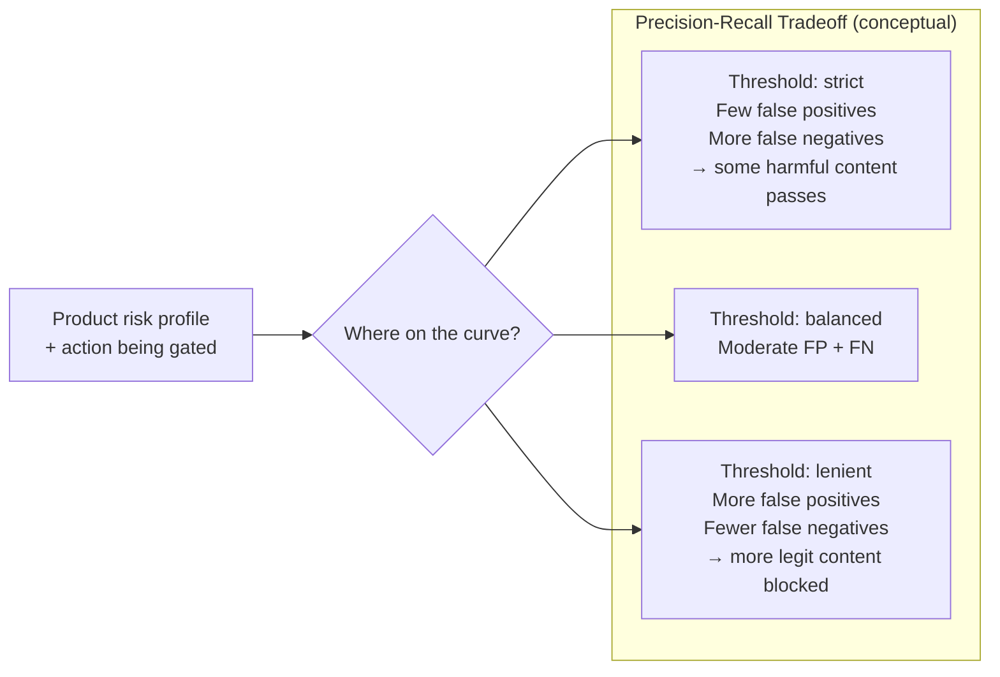
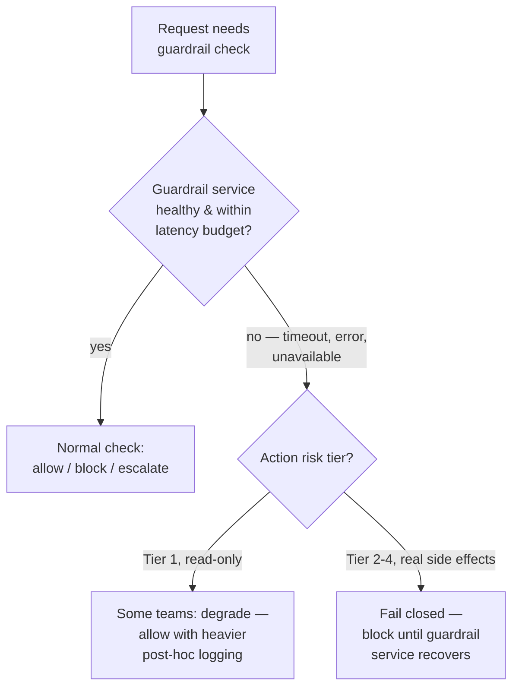
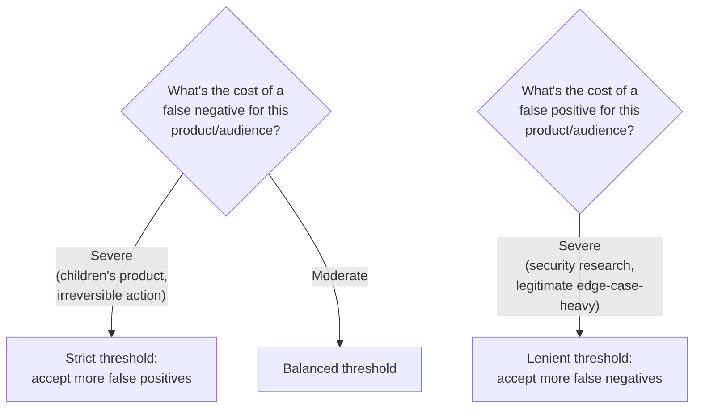

# Guardrails & Content Safety

## Overview

[Prompt Injection & Jailbreaks](02-prompt-injection-and-jailbreaks.md) and [Data Exfiltration & Tool Abuse](03-data-exfiltration-and-tool-abuse.md) cover attacks that deliberately try to manipulate a model. This chapter covers the detection-and-enforcement layer that catches unsafe content regardless of whether it came from a deliberate attack, an edge case in the model's own training, or an ordinary user request the model happened to mishandle — the guardrail stack that sits around the model, independent of the model's own safety training.

## Definition

A guardrail is an independent check — rule-based, classifier-based, or model-based — that evaluates input before it reaches the model or output before it reaches the user or triggers a downstream action, and enforces a policy decision (allow, block, or escalate) regardless of what the generation model itself believes about its own output's safety.

## Problem Statement

Model safety training — RLHF, Constitutional AI, DPO on preference data — reduces the probability that a model produces harmful content in general. It is trained into the same weights that produce every other response, which creates a specific structural weakness: a model that has been successfully jailbroken or adversarially prompted will, if asked, also report that its own output is safe — because the same manipulation that produced the harmful output has also compromised the model's judgment about that output. Asking the model to grade its own homework after it's already been tricked into cheating doesn't work.

Guardrails solve a narrower, more mechanical problem than "make the model safer." They are a second, independent check — built, trained, and evaluated separately from the generation model — that inspects input and output regardless of what the generation model produced or believes. This chapter covers how that layer is actually built in production: where it sits in the request path, what kind of check runs at each tier, and how the tradeoffs between precision, recall, latency, and cost get calibrated for a specific product.

## Why Guardrails Are a Separate Layer From the Model's Own Safety Training

The "classifier sandwich" rationale is the core architectural insight here: the input and output classifiers are not the same model as the generation model, and are typically not even the same architecture or training process. An adversarial prompt engineered to manipulate the generation model does not automatically manipulate a separate, independently-trained classifier — the attacker would have to craft a payload that fools both the generation model *and* a classifier they may not even know exists, with a different training distribution and a narrower, more mechanical task. This architectural independence — not the classifiers' raw accuracy — is the primary value of the sandwich. A classifier with modest accuracy that the attacker cannot see or target is often a stronger practical control than an extremely accurate check that's baked into the same model being attacked.

The correct mental model to hold onto: safety training reduces the *prior probability* of harmful output; guardrails catch the *tail* of the distribution where harmful output still occurs despite that training — an adversarial prompt that found a gap in the training distribution, a subtle edge case, or an ordinary-looking request that happened to trigger an unexpected generation. Neither layer makes the other unnecessary. Safety training that were perfect would need no guardrails; guardrails that were perfect would need no safety training. Production systems have neither, so both layers run.

## Core Concepts

- **Classifier sandwich** — running independent input and output classifiers around the generation model, so a successful manipulation of the model doesn't automatically defeat the check.
- **Rule-based guardrail** — deterministic pattern, keyword, or schema check; fast, auditable, brittle under paraphrase.
- **Classifier-based guardrail** — a dedicated, purpose-built model scoring input or output for harm categories; probabilistic, semantically aware, itself attackable.
- **Model-based guardrail (LLM-as-judge)** — a strong LLM evaluating safety with full reasoning capability; most expensive, most nuanced, never the sole gate on the main path.
- **Cascade architecture** — tiering checks from cheapest/fastest to most expensive/slowest, so only a shrinking fraction of traffic reaches the costly tiers.
- **Precision-recall tradeoff** — the fundamental tension a classifier threshold controls: fewer false positives means more false negatives, and no single threshold optimizes both.
- **Fail-closed guardrail dependency** — treating the guardrail service's own availability as a hard requirement, defaulting to block or degrade rather than allow when the guardrail itself is unavailable.

## Input-Side vs. Output-Side Guardrail Placement

The same underlying check types (rule-based, classifier-based, model-based) run at two structurally different points in the request path, with different jobs, different latency budgets, and different costs when they get it wrong.

**Input-side guardrails (run before the LLM call).**

- **Purpose.** Block requests that should not be processed at all: known jailbreak patterns, prohibited content categories, requests from banned accounts, content that violates policy regardless of what the model would generate in response.
- **Latency position.** Must complete before time-to-first-token starts. At a 1-second TTFT SLA, budget 50–150ms for input classification — it has to be a small fraction of the total budget, not a competing latency source.
- **False-positive cost.** The user is refused before any model inference runs at all — the highest-friction outcome, since a legitimate request is rejected at the gate with no chance for the model to even attempt it.
- **False-negative cost.** A harmful request that passes the input classifier is still seen by the model, so the model's own safety training remains a second line of defense — the input classifier missing something is not automatically an incident, just a narrower margin.
- **What to check.** Injection-pattern scores, prohibited content category detection, account-level blocks, rate-limiting signals, PII in input that shouldn't be forwarded to an external API.

**Output-side guardrails (run after generation, before the response is returned).**

- **Purpose.** Catch harmful content the model produced despite safety training and input-side filtering — a subtle adversarial input the classifier missed, a genuine edge case in the model's training, or an unexpected generation on an apparently benign prompt.
- **Latency position.** For non-streaming responses, adds to total latency after generation completes. For streaming responses, the check can run in parallel with the stream and interrupt mid-generation if it flags content, rather than waiting for the full response.
- **False-positive cost.** A valid response is blocked *after* the model has already spent inference compute generating it — wasted compute plus a refusal on a legitimate request.
- **False-negative cost.** Harmful content reaches the user or, for tool-enabled agents, triggers a downstream action — the more severe failure mode of the two.
- **What to check.** Harmful content categories, PII leakage, system-prompt extraction, policy-violating format or content, and — for agentic systems — whether a generated tool call is sanctioned for this session.
- **Output-side guardrails for tool calls.** When the model requests a tool call, the tool authorization gate (covered in full in [Data Exfiltration & Tool Abuse](03-data-exfiltration-and-tool-abuse.md)) is itself a specific output-side guardrail — it checks the call against the session's granted scope before the executor runs it. This is the single highest-leverage guardrail in an agentic system, because it prevents real-world side effects, not just bad text reaching a screen.

## Guardrail Types: Rule-Based, Classifier-Based, Model-Based

Each type sits at a different point on the cost/latency/accuracy curve, and production systems use all three, not one exclusively.

| Type | Mechanism | Advantages | Disadvantages | Best for |
|---|---|---|---|---|
| **Rule-based** | Keyword lists, regex, schema validators, allowlist/denylist | Deterministic, nanoseconds–ms, no inference cost, no non-determinism, easily audited | Brittle under paraphrase, trivially bypassed by synonyms or character substitution, no semantic understanding | Format validation (valid JSON schema?), known bad strings (credit card patterns, banned phrases), explicit rules with a clean textual expression |
| **Classifier-based** | Dedicated small model (LlamaGuard 3, DistilBERT fine-tune, purpose-built safety classifier) trained on harm categories | Semantic understanding of paraphrase, 10–50x faster/cheaper than the generation model, fine-tunable for product-specific categories | Probabilistic (has real FP/FN rates), itself adversarially attackable, needs maintenance as attack patterns evolve | Main-path input and output screening at scale — the default workhorse layer |
| **Model-based (LLM-as-judge)** | A strong LLM reasons about the safety of the input or output | Highest semantic understanding, reasons about nuanced/contextual edge cases (same text safe in one context, harmful in another) | Most expensive (a full additional inference call), highest latency (500ms–2s), itself manipulable, risk of correlated failure with the model being judged | Borderline cases escalated from the classifier layer, high-stakes requests where certainty matters more than latency, audit sampling — never the sole gate on the main path |

Typical classifier accuracy runs 90–97% on in-distribution examples and measurably lower against inputs specifically crafted to evade that classifier's training distribution — the same asymmetry covered in [Prompt Injection & Jailbreaks](02-prompt-injection-and-jailbreaks.md#the-layered-defense-stack): an accuracy number from a static eval set describes performance against known patterns, not against an adaptive adversary.

## The Cascade Architecture

The standard production pattern tiers checks by cost and latency so the expensive tiers only ever see the traffic the cheap tiers couldn't confidently clear.

1. **Tier 1 — rules engine (~5ms).** Catches explicit prohibited strings, format violations, known bad patterns. Handles roughly 50–70% of all harmful content in simple products, at essentially zero marginal cost.
2. **Tier 2 — dedicated safety classifier (~50–150ms).** Catches semantic violations the rules engine missed — paraphrase, novel phrasing, context-dependent harm. Handles most of the remaining harmful content.
3. **Tier 3 — LLM-as-judge (~500ms–2s).** Handles borderline cases the classifier scored ambiguously. Runs on under 5% of traffic by design — it's a targeted escalation tier, not a general-purpose filter.
4. **Tier 4 — human review.** For high-stakes edge cases, novel attack patterns, and safety-critical domains. No latency SLA, since these cases are, by definition, the ones automated tiers couldn't resolve confidently.

**The average-latency math.** Because most traffic resolves at tier 1 or 2, average latency impact is weighted heavily toward the cheap checks, not the expensive ones. If 80% of traffic is handled by tier 1+2 (≈75ms average), 15% escalates to tier 3 (≈750ms), and 5% goes to tier 4 (no fixed SLA, excluded from the latency average): average automated-traffic overhead ≈ 0.80 × 75ms + 0.15 × 750ms = 60ms + 112ms ≈ **172ms** — a small fraction of a typical 1–3+ second end-to-end LLM response, not the 2+ seconds a tier-3 check alone would add if it ran on every request.

## False Positive / False Negative Tradeoffs and Threshold Calibration

**The fundamental tradeoff.** A classifier is a precision-recall tradeoff, full stop. At threshold T_high: few false positives, more false negatives — some harmful content gets through. At threshold T_low: more false positives — some legitimate content gets blocked — fewer false negatives. No single threshold achieves both simultaneously; every choice is a point on that curve, not a way around it.

**The cost asymmetry is product-dependent, not universal.** For a children's educational product, a false negative (harmful content reaching a child) is catastrophic; a false positive (blocking a legitimate math question) is minor friction — the threshold should sit toward strict. For a general adult security-research platform, a false positive (blocking a legitimate CVE discussion) is a severe product failure, while a false negative is bad but the audience is comparatively less vulnerable — the threshold should sit toward lenient. This is a product decision expressed as an acceptable false-positive rate and a minimum required recall, not a purely technical optimum to be solved for once and left alone.

**Threshold calibration process:**

1. Construct a labeled evaluation set covering known-harmful examples (including adversarial ones), borderline edge cases, and known-benign examples — specifically including examples that look superficially harmful but are legitimate, since these are exactly what a naive threshold gets wrong.
2. Run the classifier at multiple threshold values across that set.
3. Plot the precision-recall curve.
4. Select the threshold at the product's target operating point — the acceptable FP/FN balance decided in step zero above, not the point that happens to maximize a generic F1 score.
5. Compute expected FP and FN rates at that threshold against the actual production traffic distribution, not just the eval set — production traffic and eval sets diverge over time.
6. Monitor continuously and recalibrate when the production distribution shifts — a threshold tuned against last year's traffic mix degrades silently as usage patterns change.

**Tiered thresholds by action risk.** Use a strict threshold (accepting more false positives) for tool calls with high blast radius — Tier 3 and Tier 4 actions in the irreversibility tiering from [Data Exfiltration & Tool Abuse](03-data-exfiltration-and-tool-abuse.md#least-privilege-tool-scoping). Use a lenient threshold for read-only, reversible actions. A single global threshold across all request types under-protects high-risk actions and over-restricts low-risk ones simultaneously — it is a worse choice on both axes than tiering by risk.

**Monitoring false-positive rate in production.** Track the escalation/block rate as a guardrail health metric. A sudden spike is either an attack wave (expected, a good sign the guardrail is working) or a classifier regression (unexpected, needs investigation) — distinguish the two by reviewing the actual blocked content: an attack wave produces recognizable harmful patterns; a regression produces blocked legitimate requests. Measure real FP rate by sampling blocked requests and having human reviewers rate whether the block was correct, computing the fraction incorrectly blocked as an ongoing metric, not a one-time launch check.

## Harm Taxonomy and Product-Specific Coverage

Generic classifiers (LlamaGuard 3, OpenAI Moderation API) cover broad, universal harm categories — violence, sexual content, hate speech, self-harm, harassment, dangerous activities — which handles most of the harm surface for general-purpose products out of the box.

**When generic classifiers are insufficient.** Domain-specific products carry additional harm categories a generic classifier doesn't cover at all. A financial-advice product needs to detect regulatory non-compliance (specific investment advice that violates SEC rules), not just generic "harmful content." A medical product needs to detect dangerous clinical advice a general safety classifier would never flag. A children's product needs age-appropriate content enforcement at a materially stricter threshold than a general classifier defaults to. A security-research platform needs to *allow* CVE and exploit-technique discussion a generic classifier might reflexively flag, while still blocking genuine exploitation instructions — the opposite calibration direction from the other three examples, underscoring why "just use the generic classifier's default threshold" is never actually a complete answer.

**Extending with product-specific fine-tuning.** Take a base classifier (LlamaGuard 3 is a natural starting point — open-source, fine-tunable) and fine-tune it on labeled examples of the product-specific harm categories. This needs hundreds to thousands of labeled examples per new category, the same fine-tuning infrastructure as any LoRA fine-tune, and ongoing maintenance — new product features routinely introduce new harm categories that have to be added to the classifier's taxonomy, not assumed to already be covered by the base model's training.

**Red-team evaluation of the guardrail stack.** This is a continuous process, not a launch gate. A guardrail stack red-teamed once at launch and never tested again has degrading coverage by default, simply because new attack techniques get published after launch. Maintain a red-team prompt library covering known injection/jailbreak techniques, updated as new techniques appear; run it on a fixed schedule (weekly, or on every model/classifier update, whichever is more frequent); and set a regression threshold — if the pass rate on the red-team set drops below it, alert and block the deployment that triggered the drop, the same release-blocking treatment covered in [Prompt Injection & Jailbreaks](02-prompt-injection-and-jailbreaks.md#production-best-practices).

## Fail-Closed and the Guardrail Service as a Dependency

**The fail-closed requirement.** When the guardrail service is unavailable, the system should block or degrade — never allow traffic through unguarded. A guardrail that fails open under load or timeout is effectively absent exactly when it's most likely to matter, since load spikes and timeouts are also conditions an attacker actively probing the system is likely to trigger or exploit.

**The guardrail service needs its own SLO.** Treat the guardrail service's availability and latency as first-class SLOs, monitored independently from the main model's availability — not folded into a single "system health" number. A guardrail service at 95% availability sitting in front of a main model at 99.9% availability means the product operates unguarded roughly 5% of the time, which is not an acceptable security posture even though the headline "system uptime" number might still look fine if the two are conflated in a single dashboard.

## Components

| Component | Responsibility | Does NOT own |
|---|---|---|
| Rules engine | Deterministic pattern/format/schema checks at the first tier | Semantic understanding of paraphrase or novel harmful phrasing |
| Safety classifier | Semantic scoring of input/output against harm categories | Deciding the final threshold — that's a product policy decision fed into the classifier's deployment config |
| LLM-as-judge | Reasoned safety evaluation on escalated, borderline cases | Serving as the sole gate on the main request path |
| Human review queue | Final adjudication on high-stakes or novel edge cases | Latency-bound decisions — it has no SLA by design |
| Threshold/policy config | Encode the product's chosen FP/FN operating point per action-risk tier | Running the classifier itself |
| Red-team harness | Continuously test the full guardrail stack against a maintained attack corpus | Fixing regressions it finds — it reports, engineering fixes |
| Guardrail service health monitor | Track guardrail-specific availability/latency SLOs independent of the main model | Model-level availability monitoring |

## Tradeoffs

| Advantages | Disadvantages |
|---|---|
| Classifier sandwich is harder to defeat than relying on the generation model's own judgment | Adds a real, separate attack surface — the classifier itself can be adversarially targeted |
| Cascade tiering keeps average latency low while still catching tail-risk cases with expensive checks | Requires ongoing tuning as attack patterns and legitimate traffic both shift over time |
| Product-specific fine-tuning covers domain harm categories generic classifiers miss entirely | Needs real labeled data investment (hundreds–thousands of examples) per new category |
| Fail-closed guardrail dependency prevents silent unsafe operation under load or outage | Fail-closed on a guardrail outage trades availability for safety — the product can go down or degrade when the guardrail does |

## Scalability

- **Rules and classifier tiers scale near-linearly with QPS** at low marginal cost per request; they're the tiers designed to absorb volume, which is exactly why the cascade routes the bulk of traffic to them first.
- **LLM-as-judge does not scale to full traffic** at reasonable cost or latency — its ~5% escalation-tier design is load-bearing, not incidental; a rising escalation rate is the first sign either attack volume is genuinely up or tier 1/2 thresholds have drifted too strict.
- **Human review is a hard ceiling**, the same as human-in-the-loop confirmation gates elsewhere in this section — systems anticipating growth invest in tightening the automated tiers to keep escalation volume roughly flat as total traffic grows, not in scaling the review queue linearly with traffic.
- **Red-team corpus evaluation scales by running against a fixed, versioned corpus on a schedule**, not against live production traffic — it's a pre-deployment and periodic regression gate, independent of production QPS.

## Reliability

| Failure | Degradation strategy |
|---|---|
| Rules engine or classifier tier unavailable | Route around the failed tier to the next tier up (classifier down → route to LLM-as-judge with a tighter budget), not straight to allow |
| LLM-as-judge tier unavailable | Fall back to the classifier tier's decision with a stricter threshold applied, rather than skipping the check entirely |
| Guardrail service globally unavailable | Fail closed for Tier 2-4 actions; some teams accept degraded, heavily-logged operation for Tier 1 read-only paths only, as a documented exception |
| Human review queue backs up beyond SLA | Escalated items stay blocked pending review rather than auto-approving on timeout — timeout is not evidence of safety |
| Red-team regression detected on a scheduled run | Treat as release-blocking; roll back the model/classifier version that introduced the regression rather than shipping past it |

Track **guardrail service availability and latency as a dedicated SLO**, separate from the main model's — a security layer that's down more often than the model it protects is a worse failure mode than the model itself being down, especially if the integration isn't strictly fail-closed.

## Cost Optimization

- **Tier by cost intentionally** — the entire cascade design exists to keep the expensive tiers (LLM-as-judge, human review) reserved for the fraction of traffic that actually needs them; running tier 3 on 100% of traffic is the most common way this budget gets blown.
- **Use small, distilled classifiers**, not the flagship generation model, for tiers 1 and 2 — a purpose-built safety classifier is typically an order of magnitude cheaper and faster with comparable or better precision on its narrow task.
- **Sample rather than fully log every allowed request** at full fidelity; reserve full-fidelity logging for flagged, escalated, or blocked traffic, where the audit value is highest.
- **Calibrate thresholds to the actual cost of each outcome**, not to a generic target — lowering a classifier's threshold catches more true positives but raises the false-positive rate, and each false positive costs a wasted escalation review or a refused benign request; teams commonly target sub-few-percent false-positive rates on production traffic while still catching the large majority of known attack patterns in the red-team set, re-tuning as both attack and legitimate traffic shift.

## Monitoring

- **Guardrail trigger rate (block/escalate)** over time, broken out by tier and category — a sudden spike usually means either an attack campaign or a classifier regression, distinguishable by inspecting the underlying flagged traffic.
- **False-positive rate** measured against a maintained, labeled eval set of known-benign traffic, sampled continuously from production — without this, a stricter classifier's impact on real users is invisible until complaints arrive.
- **Escalation rate to tier 3 and tier 4**, tracked as its own leading indicator — a creeping rate here usually means tier 1/2 thresholds have drifted, not that the world has genuinely gotten more adversarial.
- **Latency added per tier**, p50/p95/p99 — a guardrail tier that silently creeps from 50ms to 300ms degrades the product with no obvious root cause unless tracked per-stage, not just as one aggregate "guardrail latency" number.
- **Guardrail service availability and error rate**, on its own dashboard, separate from the main model's.
- **Red-team/adversarial-eval pass rate**, run on a fixed schedule against a maintained corpus — a regression with no corresponding code change usually means an underlying model or classifier version changed behavior the old suite didn't anticipate.

## Production Best Practices

- Run input and output classifiers as genuinely separate models from generation, never as the same model asked to grade its own output — the independence is the point, not the accuracy number alone.
- Tier checks by cost and route the bulk of traffic through the cheapest tiers that can confidently clear it; reserve LLM-as-judge and human review for the fraction that's actually ambiguous.
- Calibrate thresholds to the product's actual cost asymmetry (children's product vs. security-research platform look nothing alike), and tier thresholds further by the risk of the action being gated, not with one global number.
- Extend generic classifiers with product-specific fine-tuning for domain harm categories — a financial, medical, or child-safety product has harm categories no general-purpose classifier ships with by default.
- Default every guardrail integration to fail-closed, and treat any fail-open exception as a deliberate, reviewed, documented decision for a specifically low-risk path — never as an accident of how a timeout was handled.
- Track the guardrail service's own availability and latency as a first-class SLO, separate from the model's — and re-run red-team evaluation on a fixed schedule, not just at launch, since attack techniques and model behavior both drift over time.

## Real World Examples

The following are publicly discussed patterns illustrative of an industry-wide direction, not confirmed internal specifics of any one vendor's production system.

- **OpenAI's Moderation API and Google's Perspective API** are both publicly documented, managed classifier services designed to run independently of the generation model — a direct commercial instance of the classifier-sandwich pattern.
- **Meta's LlamaGuard family** is publicly released specifically as an open-source, fine-tunable safety classifier meant to be deployed alongside — not as a replacement for — a separate generation model's own safety training, matching the two-layer architecture this chapter describes.
- **NVIDIA's NeMo Guardrails and Guardrails AI** are both publicly documented frameworks implementing tiered, configurable input/output policy enforcement, consistent with the cascade architecture covered above rather than a single monolithic check.
- **Consumer AI products serving minors** have publicly discussed applying materially stricter content thresholds than their general-audience products, a direct real-world instance of tiering thresholds by audience risk profile rather than using one global setting.

## Tools and Ecosystem

| Category | Tools | When to prefer |
|---|---|---|
| **Input / output classifiers** | LlamaGuard 3 (Meta), OpenAI Moderation API, Perspective API (Jigsaw/Google) | LlamaGuard: open-source, self-hosted, fine-tunable for product-specific categories; OpenAI Moderation: fast, free, managed; Perspective: toxicity/civil-discourse focus |
| **Guardrail orchestration frameworks** | Guardrails AI, NeMo Guardrails (NVIDIA) | Guardrails AI: schema validation plus safety checks with retry logic; NeMo Guardrails: Colang-based conversation-flow policy control, strong for multi-turn enforcement |
| **PII detection for input/output scanning** | Microsoft Presidio, AWS Comprehend, GLiNER | Presidio: open-source, 20+ entity types, highly customizable; Comprehend: managed, tight AWS integration; GLiNER: modern NER for custom entity types |
| **Red-team / adversarial evaluation** | Garak (NVIDIA), PyRIT (Microsoft), Promptbench | Garak: automated probe suite across jailbreak/injection/leakage categories; PyRIT: structured, threat-model-driven red-teaming with reporting — run both on a recurring schedule, not just at launch |
| **Fine-tuning infrastructure for custom classifiers** | Hugging Face `transformers` + LoRA/PEFT, standard fine-tuning pipelines | Use for extending a base classifier (e.g., LlamaGuard 3) with product-specific harm categories not covered by the generic taxonomy |

## Interview Questions

### Beginner

**Q: Why can't the model just check its own output for safety instead of using a separate classifier?**
Because a model that's already been manipulated into producing harmful output shares the same compromised judgment when asked to evaluate that output — the manipulation that fooled the generation step tends to also fool a self-check by the same model. A separate, independently-trained classifier isn't the target of the original manipulation, which makes it a meaningfully harder thing for the same attack to also defeat.

**Q: What's the difference between an input-side and an output-side guardrail?**
Input-side guardrails run before the model generates anything and decide whether to process the request at all — false positives here mean the model never even gets a chance to respond. Output-side guardrails run after generation and decide whether to release the response — false positives here mean inference compute was already spent on a response that then gets blocked. Both matter, but they sit at different points with different cost profiles for getting it wrong.

### Intermediate

**Q: Your product blocks a legitimate user request about "how ransomware attacks typically spread" for a security awareness training tool. What guardrail decision led to this, and how would you fix it?**
Almost certainly a generic classifier trained on broad harm categories, applied with a threshold tuned for a general-audience product rather than the security-research/training use case this product actually serves. The fix isn't lowering the threshold globally — that trades away real protection — it's recognizing this product needs its own calibrated threshold, and likely a product-specific fine-tune, that permits legitimate security-education content the generic classifier's default training distribution wasn't built to distinguish from genuine attack instructions.

**Q: Why does a cascade architecture keep average latency low even though tier 3 (LLM-as-judge) takes up to 2 seconds?**
Because the vast majority of traffic — typically 80%+ — resolves at tier 1 or tier 2, which run in single-digit to low-hundreds of milliseconds, and only a small escalated fraction (often under 5%) ever reaches tier 3. The weighted average is dominated by the cheap tiers' latency, not the expensive tier's, as long as the escalation rate stays low — which is itself something worth monitoring, since a rising escalation rate quietly erodes this latency advantage.

### Senior

**Q: How do you decide the classifier threshold for a new product with no existing production traffic to calibrate against?**
Start from the product's cost asymmetry, decided as a product policy question before any technical tuning: what's worse for this specific audience, a missed harmful response or a blocked legitimate one? Build a labeled eval set from the closest available proxy data (a generic red-team corpus plus hand-authored product-specific edge cases) and pick an initial threshold on that basis. Treat the initial choice as provisional — recalibrate against real production traffic and a continuously sampled false-positive review process as soon as there's enough volume to measure it, since any pre-launch estimate is necessarily a proxy for the traffic distribution you don't have yet.

**Q: A guardrail service outage takes down your product entirely for 20 minutes because every request path is fail-closed. Was that the right call?**
It depends on what the guardrail was gating. For any request path with real-world side effects (Tier 2+ actions, agentic tool calls), fail-closed was correct — the alternative is unguarded operation during exactly the kind of instability an attacker might be probing for or exploiting. For a purely read-only, low-risk path, a documented fail-open exception with heavier post-hoc logging might have kept the product partially available without materially increasing risk — but that has to be a deliberate, pre-reviewed exception for that specific path, not a blanket policy discovered mid-incident. The postmortem question isn't "should we have fail-closed less" in general, it's "did we correctly scope which paths actually needed it."

### Staff

**Q: You inherit a guardrail stack that passed its security review at launch a year ago and hasn't been touched since. What's your assessment before signing off on its continued use?**
Treat a year-old, untested guardrail stack as unverified against the current threat landscape, not as still-passing by default — jailbreak and injection techniques published in the last year almost certainly weren't in scope for the original review. Before signing off: re-run the red-team corpus updated with techniques published since launch, verify the classifier hasn't drifted against current production traffic (a false-positive rate check against recent, not year-old, samples), and confirm the guardrail service's own availability SLO has actually been tracked as a dependency, not assumed. The absence of new incidents in that year is weak evidence of continued safety — it's equally consistent with nobody having tried a technique from the last twelve months yet.

## Google-Level Follow-Ups

- "Your safety classifier reports 96% recall in eval. Product wants to ship without an LLM-as-judge escalation tier to save cost and latency. What's your counterargument?" — probes whether the candidate connects the 4% recall gap to concrete production volume (thousands of missed items per day at scale) and argues from consequence rather than an abstract "more layers are always better" stance.
- "How would you detect that your classifier's false-positive rate has silently increased over the last month with no code changes?" — probes for a monitoring-first answer: continuous sampling of blocked requests with human review, compared against a rolling baseline, rather than assuming a stable number without an active measurement process.
- "Two products in your company need very different threshold calibrations — a children's education app and an internal security-research tool. Do they share a classifier?" — probes whether the candidate recognizes they can share the same base classifier and infrastructure while requiring separately configured thresholds (and possibly separate fine-tunes) per product, rather than either forcing one global threshold or building fully separate stacks unnecessarily.
- "If red-teaming the guardrail stack weekly finds no new bypasses for six months straight, do you reduce the frequency?" — probes whether the candidate ties monitoring cadence to the actual rate of new published attack techniques and model/classifier version changes rather than to a fixed schedule chosen once and left unexamined — six clean months says more about the corpus needing refreshing than about the stack being solved.

## Common Mistakes

- **Letting the generation model grade its own output's safety** instead of using an independently trained classifier — a self-check shares the same compromised judgment as whatever manipulated the original output.
- **Running the most expensive check (LLM-as-judge or human review) on all traffic** instead of reserving it for the cascade's escalation tier, which blows the latency and cost budget the tiering exists to protect.
- **Using one global classifier threshold across all products and all action types** instead of tiering by both product risk profile and the specific action being gated — a read-only chat response and an irreversible tool call warrant very different tolerances.
- **Treating a generic classifier's out-of-the-box taxonomy as complete** for a domain-specific product, missing harm categories (regulatory non-compliance, clinical safety, age-appropriateness) the generic model was never trained to catch.
- **Failing open on guardrail service timeout or outage**, which means the security layer disappears exactly under load or instability — the conditions an attacker is most likely to be probing for.
- **Red-teaming only at launch** and treating a passed review as a permanent state, when new injection and jailbreak techniques are published continuously and a stack unverified in months has no real evidence behind its current effectiveness.

## Key Takeaways

- Guardrails are architecturally independent from the model's own safety training specifically because a manipulated model's self-assessment shares the same compromise — the classifier sandwich's value is independence, not just accuracy.
- Input-side and output-side guardrails have different jobs and different false-positive/false-negative cost profiles; both are needed, and neither substitutes for the other.
- The cascade architecture — cheap rules, then a classifier, then LLM-as-judge, then human review — keeps average latency low by routing only a shrinking fraction of traffic to each more expensive tier.
- No classifier threshold optimizes both precision and recall simultaneously; the correct threshold is a product decision about acceptable FP/FN cost, tiered further by the risk of the action being gated.
- Generic classifiers cover broad harm categories well but miss domain-specific ones by default — financial, medical, child-safety, and security-research products all need calibration or fine-tuning beyond the out-of-the-box taxonomy.
- Fail-closed is the correct default for guardrail integrations, and the guardrail service's own availability needs to be tracked as a first-class SLO, separate from the model it protects — a security layer down more than the thing it guards is a worse failure mode than either being down alone.

---

*Part of [AI Security](index.md) in the [AI System Design Notes](../index.md).*
