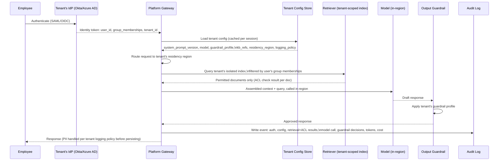
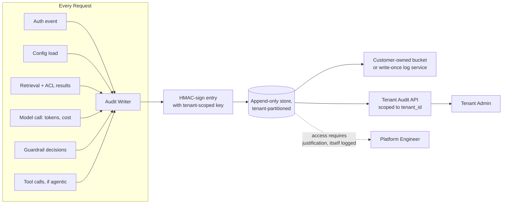

# Enterprise AI Architecture

## Overview

Enterprise AI architecture is the set of system-level changes required when an AI product stops being used by individuals and starts being sold to organizations. Nothing about the model changes. Everything about who is accountable for its behavior, who is allowed to see what it produces, and who can prove what it did changes. This chapter is the orientation map for the section: it names the seven requirements that consumer-AI architecture doesn't have to satisfy, traces the request lifecycle that results from adding them, and sets up the deeper chapters — multi-tenancy, data governance, permission-aware retrieval, PII engineering, and responsible AI — each of which expands one piece of this map.

## Definition

Enterprise AI architecture is the layer of identity federation, per-tenant configuration, data isolation, permission-aware retrieval, and tamper-evident auditing wrapped around an AI product so that it can be procured, deployed, and operated inside an organization whose buyer, user, and risk-bearer are three different people — and whose relationship with the vendor is governed by a signed contract, not a terms-of-service checkbox.

## Problem Statement

A consumer AI product answers to one person: the user is the customer, the customer is the one who experiences quality or failure, and the terms of service are a unilateral, revisable agreement. Port that architecture directly into an enterprise sale and three things break immediately:

- **No tenant boundary.** A consumer product has one global user pool. An enterprise product must guarantee, and prove, that Company A's employees cannot see Company B's data — not "shouldn't," but "cannot," backed by an architecture a security team can audit, not a promise in a README.
- **No permission model inside the tenant.** Even within one company, not everyone should see everything. A RAG system that retrieves the CEO's compensation letter for a junior analyst's query isn't a bug in the traditional sense — the retrieval worked exactly as designed. It just wasn't designed to ask "is this user allowed to see this."
- **No accountability trail.** When an enterprise customer's compliance team asks "what did your AI tell our employee on March 3rd, and why," a consumer-grade system has no reliable answer. Logs may be sampled, unstructured, or simply absent. In an enterprise contract, that question comes with a contractual deadline to answer it.

Left unaddressed, these gaps don't surface as user complaints — they surface as failed security reviews that kill a deal before it's signed, or as an incident that triggers a termination-for-cause clause after it is.

## Why This Architecture Exists

### The buyer/user split

In consumer AI, the person who evaluates the product, the person who pays for it, and the person who uses it are the same person. If they're unhappy, they churn — a private, low-stakes event.

In enterprise AI, four distinct people are involved before an employee ever types a prompt: IT and security evaluate the product against a checklist that has nothing to do with output quality (data isolation, SSO support, audit capability); finance negotiates a contract with usage-based or seat-based pricing and liability terms; legal reviews the data processing agreement (DPA) and decides whether the vendor's data handling is acceptable; and only then do employees use the thing. A single objection from any of the first three — "we can't verify tenant isolation," "there's no SSO integration," "the DPA doesn't cover sub-processor liability" — can kill a deal that the eventual end users would have loved. This is the single fact that reshapes the architecture: audit trails, isolation proofs, and SSO integration are not nice-to-haves discovered late — they are first-class, load-bearing requirements evaluated before a single employee touches the product.

### Role-stratified access

Enterprise organizations already run on role-based and attribute-based access control (RBAC/ABAC) for every other system — the file server, the CRM, the HR system. An AI layered on top of an enterprise's documents cannot ignore this and retrieve indiscriminately. A junior analyst's query must not retrieve the CEO's compensation documents through RAG just because they're semantically similar to the query. An HR representative's AI assistant should retrieve employee records a peer in engineering cannot. This is a solved problem in traditional enterprise software — RBAC and ABAC are decades old — but it requires new architecture in AI because retrieval is a new kind of access path that traditional permission systems were never wired into. [Chapter 04](04-sso-permissions-and-rag-acl-enforcement.md) covers this in full.

### Failure blast radius

A consumer AI product that leaks one user's data or gives one user a bad answer has a contained failure: one unhappy person, maybe one churned account. The same failure in an enterprise product is not contained by the tenant boundary the way you'd hope — it's amplified by it. A cross-tenant data leak affecting Company A doesn't just cost Company A's trust; it is evidence, in the eyes of every other prospect running due diligence, that the platform's isolation claims are unverified. Enterprise contracts routinely include liability clauses, SLA penalty credits, and — for regulated customers — a contractual or legal obligation to notify affected parties within a fixed window. One incident can end a vendor relationship that took a year to build and generates seven figures of annual revenue.

### Contractual and regulatory obligations

Enterprise customers buy with paper, not just a click-through EULA. The DPA specifies what data the vendor is a processor of and what they may do with it — critically, whether it may be used to train or improve models, which large customers routinely prohibit contractually. The security exhibit specifies technical and organizational controls the vendor commits to. The SLA specifies uptime commitments with financial penalties for misses. Audit rights give the customer (or their auditor) the right to inspect the vendor's security controls directly, not take their word for it. These are legally binding constraints, and they close off architectural choices a vendor might otherwise make freely — where data is stored, how long it is retained, whether it crosses regional boundaries, whether an engineer can query production data without a documented reason.

## The Seven Enterprise Requirements

Each of these is a distinct architectural obligation. Naming them precisely — and which chapter goes deep on each — is the point of this section.

| # | Requirement | Architectural implication | Covered in |
|---|---|---|---|
| 1 | Multi-tenancy with isolation | Serve many customers from one platform with documented, testable controls that one tenant cannot access another's data | [Chapter 02](02-multi-tenancy-for-ai-platforms.md) |
| 2 | SSO and identity federation | Employees authenticate via their company's IdP (Okta, Azure AD, Google Workspace) over SAML or OIDC — the platform integrates with arbitrary customer IdPs, not its own local accounts | [Chapter 04](04-sso-permissions-and-rag-acl-enforcement.md) |
| 3 | Permission-aware retrieval | RAG queries must respect the requesting user's document permissions, enforced at retrieval time, not filtered after the fact | [Chapter 04](04-sso-permissions-and-rag-acl-enforcement.md) |
| 4 | Data governance and compliance | Residency, retention, right-to-delete, and certifications (SOC 2, GDPR, HIPAA) constrain where and how long data lives | [Chapter 03](03-data-governance-and-compliance.md) |
| 5 | Auditability | A complete, customer-accessible, tamper-evident record answering "what did the AI tell this user, and when" | This chapter, and throughout |
| 6 | PII protection | Personal data anywhere in the request path — prompts, retrieved documents, tool outputs — must be detected and handled per classification | [Chapter 05](05-pii-and-privacy-engineering.md) |
| 7 | Per-tenant customization | Custom system prompts, knowledge bases, and guardrail configurations per customer — not one shared default | This chapter (configuration layer) |

## The Enterprise AI Request Lifecycle

The steps below don't exist — or don't need to be this deliberate — in a consumer AI request. Each one is a control point an enterprise buyer's security review will ask about by name.

Every step in this diagram that isn't "call the model and return the answer" exists because an enterprise customer, at some point, asked a vendor to prove it happens. The identity step exists because IT will not create and manage local accounts for thousands of employees. The tenant-scoped retrieval step exists because a demo where the AI answers correctly isn't the bar — the bar is the AI never being able to answer with a document it shouldn't have seen. The audit write exists because "trust us" is not evidence in a compliance audit.

## Per-Tenant Configuration Management

Enterprise customers do not share a system prompt, a model version, or a guardrail threshold — each tenant configures its own, and the platform must serve N different configurations from one codebase without cross-contamination.

**Schema** (conceptually, one row per tenant):

| Field | Purpose |
|---|---|
| `tenant_id` | Primary key, referenced by every other table in the platform |
| `system_prompt_id` + `system_prompt_version` | Which prompt template, pinned to a version for reproducibility |
| `model_selection` | Model family and version this tenant is pinned to (some tenants lag behind the latest model deliberately for stability) |
| `guardrail_profile` | Strictness level plus any custom harm categories this tenant's industry requires (e.g., additional financial-advice restrictions for a bank) |
| `knowledge_base_refs` | Which vector indexes this tenant's retrieval queries are allowed to touch |
| `data_residency_region` | EU / US / APAC — drives request routing (see [Chapter 03](03-data-governance-and-compliance.md)) |
| `logging_policy` | Full-fidelity / anonymized / metadata-only (see [Chapter 05](05-pii-and-privacy-engineering.md)) |
| `rate_limit_tier` | Requests/sec and tokens/minute ceilings (see [Chapter 02](02-multi-tenancy-for-ai-platforms.md)) |
| `sso_config_ref` | Pointer to this tenant's IdP connection details |

**Storage and caching.** A tenant configuration database keyed by `tenant_id`, loaded once at session start and cached for the session's duration — not re-fetched per request. Configuration changes rarely mid-session; re-fetching on every request adds latency for no real freshness benefit. A cache invalidation hook on config write ensures new sessions pick up changes immediately, while in-flight sessions finish on the config they started with.

**Access control.** The tenant configuration API is scoped to the requesting tenant's `tenant_id`, verified from the authenticated session — a tenant admin can read and write only their own tenant's configuration, never another's. This sounds obvious until it's implemented as "check a `tenant_id` field in the request body" instead of "derive `tenant_id` from the verified session and ignore whatever the request body claims" — the former is a direct path to one tenant editing another's config by changing a parameter.

**Audit.** Every configuration change is itself logged to that tenant's audit log — actor, timestamp, field changed, old value, new value. This closes a real incident pattern: an accidental system-prompt change breaks the product for an entire tenant, and without a change log, the on-call engineer is debugging a phantom regression instead of reading the diff.

## Auditability as a First-Class Requirement

Auditability is not "turn on verbose logging." It is a designed subsystem with its own schema, immutability guarantees, access model, and retention policy — because the question it has to answer under pressure is specific: *what did the AI tell this user, at this time, based on what data, and why did it decide what it decided.*

**Audit log schema.** `event_id`, `timestamp`, `tenant_id`, `user_id`, `session_id`, `request_hash` (SHA-256 fingerprint of the request — not the full text, which can be too large and itself too sensitive to duplicate into a log store), `response_hash`, `model_id` + `model_version`, `prompt_template_id` + `version`, `retrieved_document_ids` with per-document ACL check result (permitted/denied), `guardrail_trigger_events` (which guardrails fired, at what confidence), `tool_calls_executed` (for agent sessions), `cost_usd`, `input_tokens`, `output_tokens`. The hash fields matter specifically: they let the platform prove *that* a given request and response occurred and match a customer's own record of it, without the audit store itself becoming a second copy of every sensitive prompt ever sent.

**Immutability and tamper-evidence.** An audit log an engineer can quietly edit is not an audit log — it's a diary. Three patterns, often combined: signed entries (each entry HMAC-signed with a key the application layer cannot access at write time, so a compromised app server can't forge history); delivery to a customer-controlled storage bucket (the tenant owns the S3 bucket, grants the vendor write-only access, and the vendor architecturally cannot delete or edit what's already there); or a dedicated write-once log service (object lock / WORM storage) that enforces immutability at the infrastructure layer rather than trusting application code to behave.

**Tenant access.** Each tenant's admin queries their own audit log through a platform API scoped to their `tenant_id` — the same isolation discipline as the configuration API. The platform's own engineers get access to raw audit data only through a documented-justification path that is itself logged — access to the audit log is an auditable event.

**Retention.** Specified in the contract, not a platform-wide constant: financial services customers commonly require 7 years; healthcare under HIPAA requires 6; general enterprise commonly runs 1–3 years. At expiry, the record is deleted or archived per the DPA — and that deletion event is logged in a deletion audit trail (see [Chapter 05](05-pii-and-privacy-engineering.md) for the mechanics of deletion-that-still-leaves-evidence-of-itself).

## Compliance Certifications That Gate Enterprise Sales

These aren't checkboxes — each maps to observable technical controls a security reviewer or auditor actually inspects.

| Certification | What it requires, concretely | Gates sales to |
|---|---|---|
| **SOC 2 Type II** | An independent auditor observes controls operating effectively over a period (commonly 6 months) — access logging on production data, documented change management for model/prompt updates, incident response with evidence of drills, vendor management over sub-processors (the LLM API provider) | The baseline ask from nearly every mid-market and enterprise buyer in the US |
| **ISO 27001** | International information security management standard; requires a documented information security management system (ISMS), risk assessment process, and continuous improvement cycle, audited by an accredited body | Required by most EU and APAC enterprise buyers, often in place of or alongside SOC 2 |
| **HIPAA** | Applies when the system processes Protected Health Information. Requires a signed Business Associate Agreement (BAA) with every party that touches PHI, including the LLM API provider; minimum-necessary data handling; encryption at rest and in transit; 6-year audit log retention | Any healthcare customer, and any customer whose employees' AI usage might touch health data (e.g., HR benefits questions) |
| **GDPR** | Applies to any EU personal data. Requires a signed DPA with the LLM API provider (a data processor under GDPR), a documented lawful basis for processing, and technical support for the data subject rights covered in [Chapter 03](03-data-governance-and-compliance.md) | Any customer with EU employees or EU end users |

## Interview Questions

### Beginner

**Q: What is the single biggest structural difference between consumer AI and enterprise AI architecture?**
The buyer, the payer, and the user are the same person in consumer AI and three different people in enterprise AI — IT/security evaluates, finance/legal contracts, employees use. That split forces the architecture to satisfy concerns (audit trails, isolation proofs, SSO) that end users never think about but that gate whether the product is bought at all.

**Q: Why can't an enterprise AI platform just use one shared login system the way a consumer app does?**
Enterprise employees authenticate through their company's existing identity provider (Okta, Azure AD, Google Workspace) — IT will not create and manage a separate set of local credentials for every employee across every SaaS tool. The platform has to integrate with each customer's own IdP via SAML or OIDC rather than owning identity itself.

### Intermediate

**Q: A RAG system correctly retrieves the most semantically relevant document for a query, but that document is one the requesting user isn't permitted to see. Is this a bug?**
It's a bug relative to the enterprise requirement, even though retrieval "worked" by its own metric. Semantic relevance and permission are orthogonal — a consumer-grade retriever optimizes only for the first. Enterprise retrieval has to filter the candidate set to permitted documents before the model ever sees them, not just before the user sees the citation (see [Chapter 04](04-sso-permissions-and-rag-acl-enforcement.md)).

**Q: Why does per-tenant configuration get cached per session instead of loaded fresh on every request?**
Tenant configuration (system prompt version, model selection, guardrail profile) changes rarely — certainly not multiple times within one user session. Loading it fresh on every request adds a database round trip to every single call for a value that's almost always unchanged. Caching per session with invalidation on write gets the freshness that matters (new sessions see the update) without paying the cost that doesn't (mid-session re-fetches).

### Senior

**Q: An enterprise customer's security reviewer asks: "Prove that your audit log can't have been edited after the fact." What do you show them?**
Point to the specific tamper-evidence mechanism in place — signed entries with keys the application layer can't access, delivery to a bucket the customer owns and the vendor can only append to, or WORM/object-lock storage enforced at the infrastructure layer. The proof has to be architectural, not procedural — "our engineers promise not to edit it" is not evidence; "the storage layer physically rejects edit and delete operations" is.

**Q: Your platform's tenant configuration API checks `tenant_id` by reading it from the request body. A pentest reveals a tenant can edit another tenant's system prompt by changing that field. What's the actual bug, and what's the fix?**
The bug is trusting client-supplied identity for an authorization decision. The `tenant_id` used to scope the config write must be derived from the verified, server-side session/token — never accepted as a parameter the caller controls. The fix isn't "validate the tenant_id field more strictly," it's removing the field as a trust input entirely and deriving authorization context exclusively from the authenticated session.

### Staff

**Q: You're designing the audit subsystem for a new enterprise AI product from scratch. Walk through what you build first and why, given that engineering will want to defer it in favor of feature work.**
Start with the schema and the write path before any feature ships, not after — retrofitting audit logging onto requests that were never structured to capture ACL results or guardrail decisions means those early production requests are permanently unauditable, which is exactly the gap a customer's incident investigation will hit first. Make the audit write synchronous-enough to guarantee it happens before the response is considered complete (an async "best effort" log write that can silently drop under load defeats the purpose). Get immutability right early — deciding "we'll add tamper-evidence later" means every log written before "later" is retroactively unverifiable. Ship the tenant-facing audit API alongside the internal one; a log only engineers can query isn't satisfying the requirement that motivated building it. The ordering argument: audit is one of the few subsystems where "ship now, harden later" produces a permanent, non-recoverable gap in historical data, unlike almost any other feature.

## Google-Level Follow-Ups

- "If isolation is purely logical (shared database, `tenant_id` filters everywhere), is that ever good enough for an enterprise sale?" — probes whether the candidate can map isolation model to actual buyer requirements rather than treating "isolation" as binary; tests awareness that shared-everything is acceptable for some segments and disqualifying for others (see [Chapter 02](02-multi-tenancy-for-ai-platforms.md)).
- "Your audit log retention is 3 years, but a customer's incident investigation needs a record from 4 years ago. What happened, and what should have been designed differently?" — probes for either a documented exception-to-deletion process being missing, or the retention period not matching the contract in the first place; tests whether the candidate treats retention as a fixed platform constant versus a per-tenant contractual parameter.
- "A tenant admin reports the AI gave a wrong answer to an employee. How does the audit architecture help you determine whether the model was wrong or the retrieval was wrong?" — probes whether the candidate designed the audit schema to separately capture retrieved-document IDs and ACL results, not just the final prompt and response, since undifferentiated logging can't distinguish a retrieval failure from a generation failure.
- "Two enterprise customers in the same industry ask for contradictory guardrail configurations. How does the architecture accommodate both without one tenant's configuration leaking into the other's request path?" — probes understanding of per-tenant configuration isolation as a runtime property, not just a database schema property; tests for awareness of cache-key and session-scoping bugs that leak tenant B's config into tenant A's request.

## Common Mistakes

- **Treating audit logging as a logging concern instead of a designed subsystem.** Verbose application logs are not an audit trail — they lack the schema, immutability, and access-control properties an auditor or customer will actually test for.
- **Deriving tenant identity or authorization from client-supplied parameters.** Any field the caller can set (a `tenant_id` in a request body, a role claimed in a form field) is not a trust boundary; only values derived from the verified session are.
- **Building configuration as global settings with per-tenant overrides bolted on later.** This inverts the actual requirement — configuration should be per-tenant by default, with shared defaults as the exception, or cross-tenant leakage becomes the easy path, not the hard one.
- **Assuming SSO integration is "just OAuth."** Enterprise IdPs vary widely in claim formats, group-claim availability, and protocol (SAML vs. OIDC); treating it as a solved, uniform integration leads to a platform that only actually works with the one IdP it was tested against.
- **Conflating "logged" with "auditable."** A log an engineer can edit, that isn't tenant-scoped, or that a customer can't query themselves fails the actual enterprise requirement even if every request technically produces a log line.
- **Deferring compliance certification work until a deal requires it.** SOC 2 Type II specifically requires evidence of controls operating over a period of months — it cannot be produced retroactively under deal pressure, unlike most other diligence artifacts.

## Key Takeaways

- Enterprise AI architecture exists because the buyer, payer, and user are three different people with three different sets of concerns — audit trails and isolation proofs are first-class requirements the end user never sees, not afterthoughts layered on top of a consumer product.
- The seven enterprise requirements — multi-tenancy, SSO, permission-aware retrieval, data governance, auditability, PII protection, per-tenant customization — each drive a distinct piece of architecture, not a single generic "enterprise mode" flag.
- Permission-aware retrieval is a new problem AI introduces, even though RBAC/ABAC are solved problems elsewhere in enterprise software — retrieval is a permission-checking gap most systems were never built to close.
- Auditability has to be designed as a subsystem — schema, immutability, tenant-scoped access, contractual retention — not bolted on as verbose logging after the fact, because it cannot be retrofitted onto requests that already happened.
- Per-tenant configuration must derive its trust boundary (`tenant_id`) from the verified session, never from a client-supplied parameter — this is the single most common way tenant isolation breaks in practice.
- Compliance certifications (SOC 2, ISO 27001, HIPAA, GDPR) each require specific, observable technical controls, not a policy document — and several require evidence collected over months, which means starting late is not recoverable under deal pressure.
- This chapter is the map: [Chapter 02](02-multi-tenancy-for-ai-platforms.md) through [Chapter 06](06-bias-fairness-and-responsible-ai.md) each go deep on one requirement named here.

---

*Part of [Enterprise AI](index.md) in the [AI System Design Notes](../index.md).*
