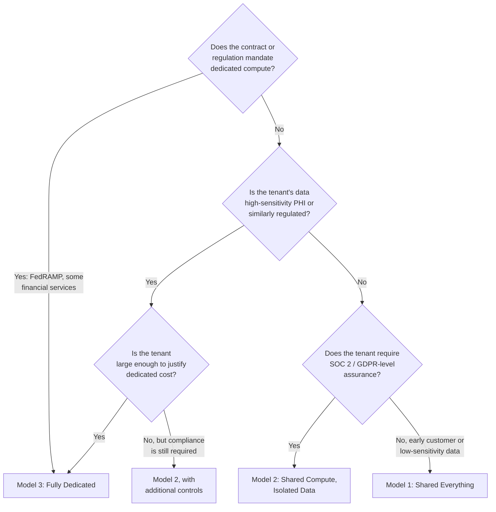
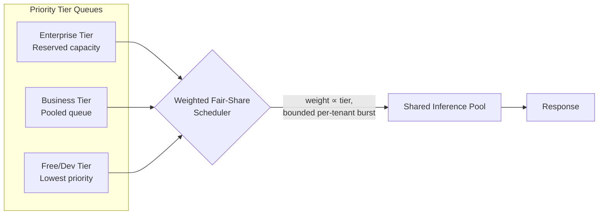
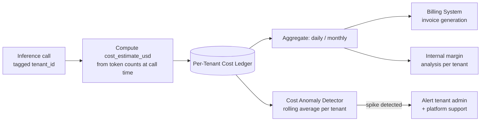

# Multi-Tenancy for AI Platforms

## Overview

Multi-tenancy is the operational mechanics behind the isolation promise made in [Chapter 01](01-enterprise-ai-architecture.md): how does one platform actually serve hundreds of enterprise customers from shared infrastructure without one tenant's load, cost, or data touching another's? This chapter covers the three canonical isolation models, the scheduling and rate-limiting mechanisms that prevent one tenant's traffic from degrading another's, the cost-attribution pipeline that makes usage-based billing possible, and the continuous validation discipline that keeps isolation true after launch, not just at launch.

## Definition

Multi-tenancy for AI platforms is the architecture that determines, along a spectrum from fully shared to fully dedicated, which layers of compute, data storage, and operational tooling are shared across enterprise customers versus isolated per customer — and the rate-limiting, scheduling, and cost-attribution systems required to make sharing safe and billable.

## Problem Statement

A single-tenant AI product has one customer, one usage pattern, one cost center. A multi-tenant AI platform has N customers, each with a different usage pattern, a different compliance requirement, and a different willingness to pay for isolation — and all of that has to run on infrastructure the vendor can actually afford to operate. Three problems emerge the moment a second paying tenant is onboarded:

- **Isolation vs. cost.** Perfect isolation (dedicated everything, per tenant) is straightforward to reason about and prohibitively expensive to run for anyone but the largest customers. Shared infrastructure is affordable but requires proving — not assuming — that isolation holds.
- **Noisy neighbors.** Shared inference capacity means one tenant's traffic spike is, by construction, capacity taken from every other tenant on the same pool, unless the platform actively schedules against it.
- **Attribution.** Usage-based enterprise pricing requires knowing, per tenant, exactly what was consumed and what it cost to serve — a requirement that doesn't exist in a single-tenant system where all cost is simply "the cost."

## Why This Architecture Exists

Early multi-tenant SaaS solved this problem for stateless compute and relational data decades ago — shared application servers, `tenant_id` columns, connection pooling. AI platforms inherit that playbook but add two properties that break the old assumptions. First, inference is expensive and latency-sensitive in a way a typical CRUD request isn't — a single tenant's batch job can consume GPU capacity for minutes, not milliseconds, making "just add a `tenant_id` filter and move on" insufficient for the compute plane even where it's sufficient for the data plane. Second, the sensitivity of what's being isolated is higher: a leaked row in a shared database is bad, but a shared vector index that returns another tenant's proprietary documents in a RAG response is a leak the requesting user will read as an AI-generated answer, at the exact moment they're least likely to notice it's actually a different company's confidential data. These two properties are why multi-tenancy for AI platforms needs its own architecture chapter rather than inheriting the traditional SaaS answer wholesale.

## The Isolation Model Spectrum

There are three canonical models, differing in what's shared and what's dedicated. The right choice for a given tenant is a decision, not a platform-wide constant — most platforms run all three simultaneously for different tenant tiers.

```mermaid
flowchart TB
    subgraph Shared["Model 1: Shared Everything"]
        direction TB
        S1[Shared Inference Fleet]
        S2[Shared Vector Index\ntenant_id tagged]
        S3[Shared DB\ntenant_id filtered]
    end

    subgraph Pooled["Model 2: Shared Compute, Isolated Data"]
        direction TB
        P1[Shared Inference Fleet]
        P2[(Tenant A Vector Index)]
        P3[(Tenant B Vector Index)]
        P4[(Tenant A Audit Log)]
        P5[(Tenant B Audit Log)]
    end

    subgraph Dedicated["Model 3: Fully Dedicated"]
        direction TB
        D1[Tenant A Inference Instances]
        D2[Tenant A Data Stores]
        D3[Tenant A Logging Pipeline]
        D4[Tenant B Inference Instances]
        D5[Tenant B Data Stores]
        D6[Tenant B Logging Pipeline]
    end
```

### Model 1: Shared everything (pool model)

All tenants share the same inference infrastructure, the same vector index, and the same databases. Isolation is purely logical — every document is tagged with `tenant_id`, every query includes a `tenant_id` filter, every audit log entry is tagged. There is no physical separation of any kind between tenants' data or compute.

| | |
|---|---|
| **Advantages** | Lowest cost — no per-tenant infrastructure to provision or idle-pay for; lowest operational overhead — one fleet, one deployment, one on-call rotation; fastest onboarding — a new tenant is a row in a config table, not a provisioning ticket |
| **Disadvantages** | Lowest isolation assurance — a single misconfigured query or a shared-infrastructure vulnerability affects every tenant simultaneously; limited per-tenant customization — can't run different model versions or fine-tunes per tenant; often insufficient for enterprise compliance requirements out of the box |
| **Acceptable for** | Early-stage products with small teams and small tenant counts, low-sensitivity business data, customers who haven't yet asked for a compliance certification |

### Model 2: Shared compute, isolated data (the enterprise default)

Inference compute — the model-serving fleet — remains shared across tenants, because that's the most expensive layer and the one that benefits most from pooling. Data storage is isolated per tenant: a dedicated vector index (or a shared index with strictly enforced tenant partitioning), dedicated audit log storage, dedicated configuration store.

| | |
|---|---|
| **Advantages** | Moderate cost — the largest cost driver (compute) is still amortized across tenants; high isolation on the data plane — cross-tenant data access now requires compromising both the query layer and the ACL/partition filter simultaneously; sufficient for most enterprise compliance requirements (SOC 2, GDPR) |
| **Disadvantages** | The shared compute plane is still a real risk surface — a vulnerability in the serving layer could theoretically expose in-flight requests from multiple tenants; noisy-neighbor risk remains on the shared inference fleet and must be actively managed (see below) |
| **Acceptable for** | The majority of enterprise deployments carrying SOC 2 and GDPR requirements — this is the default for most B2B AI platforms once they clear early-stage scale |

### Model 3: Fully dedicated (silo model)

Each tenant gets dedicated inference compute (their own serving instances or reserved GPU allocation), dedicated data stores, and a dedicated logging pipeline. Nothing is shared except, at most, the underlying cloud provider's physical infrastructure.

| | |
|---|---|
| **Advantages** | Maximum isolation assurance; zero noisy-neighbor risk by construction; enables true per-tenant model customization (different model versions, custom fine-tunes); satisfies the most stringent compliance requirements — FedRAMP, HIPAA for high-sensitivity PHI, financial-services regulatory compute-isolation mandates |
| **Disadvantages** | Highest cost — commonly 5–20× the shared-model cost for a tenant with modest usage, since dedicated capacity is paid for whether or not it's fully utilized; highest operational overhead — N tenants means N deployment targets for every model update, prompt change, or security patch; slowest onboarding — infrastructure has to be provisioned before the tenant can use the product at all |
| **Required for** | Government (FedRAMP High), healthcare handling highly sensitive PHI, financial services with regulatory compute-isolation requirements, and any customer whose contract explicitly specifies dedicated infrastructure |

### Decision framework

The practical pattern: most platforms run Model 2 as the default tier, offer Model 1 economics to early or low-tier customers, and reserve Model 3 as a premium, explicitly-priced tier sold to the handful of customers whose regulatory posture or contract requires it — not as the default for everyone "to be safe," which makes the platform unaffordable to operate.

## Noisy-Neighbor Risk in Shared Inference Capacity

Even in Model 2, the shared compute plane means one tenant's unusual load pattern — a batch document-ingestion job, a burst of unusually long-context requests, a traffic spike from a customer's own product launch — can consume a disproportionate share of shared capacity and degrade latency for every other tenant on the same pool. Four mechanisms, layered, keep this contained.

**Per-tenant rate limiting.** Each tenant is issued a limit expressed as two separate numbers: requests/second *and* tokens/minute. Separating them matters — a tenant making a small number of very long-context requests can saturate a shared pool just as effectively as a tenant making many short ones, and a single "requests/sec" limit misses the first case entirely. Implemented as a token-bucket: a bucket fills continuously at the tenant's contracted rate, and each request draws from the bucket proportional to its estimated token count (input plus expected output). When the bucket is empty, the request receives a `429` with a `Retry-After` header rather than being silently queued indefinitely.

**Weighted fair-share scheduling.** Inside the inference queue itself, requests from different tenants are served in weighted round-robin order — weight proportional to the tenant's contracted tier — rather than strict FIFO. This is the mechanism that actually prevents starvation: a burst from one low-tier tenant cannot monopolize the queue indefinitely, because the scheduler is structurally bounded to return to other tenants after serving a capped number of requests from any one tenant, regardless of how many that tenant has queued.

**Priority tier queues.** Separate queues per pricing/SLA tier, not just weights within one queue. Enterprise tier gets a dedicated queue with reserved capacity carved out of the pool — requests here are served ahead of the business and free tiers even when the platform is near saturation, which is what actually makes an SLA commitment credible rather than aspirational. Business tier shares a pooled queue with fair-share scheduling. Free/developer tier is lowest priority and the first to see degraded latency or shedding under load.

**Burst absorption with soft limits.** A hard rate limit that rejects any request above the sustained rate is unnecessarily strict for legitimate, predictable bursts — e.g., every employee at a tenant starting their workday within the same 30-minute window. The token bucket carries a burst-capacity parameter, typically 2–5× the sustained rate, that absorbs short spikes without touching other tenants' capacity. Once burst capacity is exhausted, the hard limit applies.

## Per-Tenant Cost Allocation

Enterprise AI pricing is commonly usage-based — pay-per-token, pay-per-call, or a tier with overage billing — which means the platform must attribute inference cost to individual tenants with enough precision to invoice correctly. The same pipeline also drives internal margin analysis: which customers are profitable to serve, and which cost more than they pay.

**The attribution pipeline.** Every inference call carries `tenant_id` from the request context; a cost estimate is computed at call time from actual input and output token counts against the model's per-token pricing; the estimate is written to a per-tenant cost ledger; the ledger aggregates to daily and monthly totals; those totals feed the billing system for invoice generation. Precision here matters more than it would in a flat-rate product — an under-attribution error doesn't just distort internal margin reporting, it produces an invoice a customer can dispute with their own usage logs.

**Sub-tenant (department-level) chargeback.** Enterprise customers frequently want cost attribution *within* their own organization — charging HR's usage separately from engineering's. The data model extends naturally: each user belongs to a `department_id` within their `tenant_id`, and cost is attributed to both. The tenant admin gets a chargeback report through the management API broken out by department. The limitation is important to state explicitly: this attribution is advisory for the customer's internal accounting — the platform still bills the tenant as a whole; it has no separate billing relationship with the tenant's departments.

**Cost anomaly detection per tenant.** The same rolling-average anomaly detection pattern used for platform-wide cost monitoring (see the observability practices in [Section 20](../20-observability/01-ai-observability-architecture.md)) applies per tenant. If one tenant's cost-per-request spikes unexpectedly — commonly caused by a prompt change on their side that doubled token usage, or an integration bug causing redundant calls — the tenant's admin and the platform's support team are both alerted, catching cost surprises before they show up as a disputed invoice.

## Tenant Isolation Validation as an Operational Practice

Isolation is a property that has to be *continuously* true, not a property that was true once at design time and is assumed to remain true forever. Isolation bugs are introduced the same way most production bugs are: a misconfigured ACL filter shipped in a routine change, a schema migration that silently drops a `tenant_id` column, a query-caching layer that returns tenant A's cached result to tenant B because the cache key didn't include tenant scope, a log-aggregation pipeline misconfigured to merge streams across tenants.

**The isolation test suite.** A battery of automated, integration-level tests — not unit tests, because unit tests validate logic in isolation and this specifically needs to validate the actual system's behavior end to end — that runs after every deployment and on a recurring schedule regardless of deploys. Representative tests:

- A query authenticated as Tenant A cannot retrieve any document tagged `tenant_id = B`, at the vector index layer, not just filtered out at the API layer.
- Tenant A's admin, calling the audit API, cannot read any entry belonging to Tenant B, regardless of query parameters supplied.
- Tenant A's configuration is never returned by any call to Tenant B's admin API, including error responses (a common leak vector is a verbose error message that echoes back internal state).
- Tenant A's rate-limit consumption has zero measurable effect on Tenant B's available rate-limit budget under simulated concurrent load.

**Tenant onboarding validation.** Before a new tenant is activated, the full isolation suite runs with the new tenant participating as *both* the requesting tenant and the target tenant — verifying not just that existing tenants are protected from the new one, but that the new tenant is itself protected from day one. Activation is gated on all tests passing; there is no "activate now, verify isolation later" path, because that ordering is exactly how a preventable leak becomes an actual incident.

## Tradeoffs

| Advantages | Disadvantages |
|---|---|
| Shared compute (Model 2) captures most of the cost efficiency of full pooling | The shared compute plane remains a residual risk surface even with isolated data |
| Fair-share scheduling and priority queues make SLA commitments credible under load | Requires ongoing scheduler tuning as tenant mix and tier distribution shifts |
| Per-tenant cost attribution enables accurate usage-based billing | Attribution precision adds real engineering surface — every call path must propagate `tenant_id` correctly, with no silent gaps |
| Continuous isolation testing catches drift before it becomes an incident | Isolation test suites need real maintenance as the schema and query paths evolve, or they silently stop covering new leak vectors |
| Tiered isolation models let cost scale with what each tenant actually needs | Running three isolation models simultaneously is more operationally complex than picking one for the whole platform |

## Scalability

- **Config and rate-limit state at high tenant counts.** A platform with thousands of tenants needs the tenant config and rate-limit-bucket lookups to be O(1) — typically an in-memory cache (Redis or equivalent) keyed by `tenant_id`, backed by the durable config store, rather than a database round trip on every request.
- **Isolation test suite runtime.** As the platform grows tenant count and data volume, a naive isolation suite that tests every tenant pair grows quadratically. Production suites typically test a representative sample of tenant pairs plus every newly onboarded tenant against a fixed reference set, not full pairwise coverage.
- **Weighted fair-share scheduler overhead.** The scheduler itself needs to stay cheap relative to inference latency — a scheduling decision that takes tens of milliseconds is a rounding error against a multi-second inference call, but the same scheduler run at very high QPS with many tenant weights can become a bottleneck if implemented naively (e.g., recomputing full tenant-weight state on every request instead of maintaining it incrementally).
- **Cost ledger write volume.** At high request volume, writing a cost-ledger row per inference call is a real storage line item; production systems typically batch ledger writes and aggregate asynchronously rather than committing a row synchronously in the request's critical path.

## Reliability

| Failure | Degradation strategy |
|---|---|
| Shared inference pool saturated | Enterprise-tier reserved capacity absorbs the SLA-bearing traffic; lower tiers see increased latency or `429`s first — degrade in tier order, not uniformly |
| Tenant config cache stale after a config write | Invalidate on write and accept that in-flight sessions finish on the prior config; never serve a request with no config rather than a stale one |
| Rate-limit service unreachable | Fail closed for burst allowance beyond sustained rate (deny the burst, allow the contracted sustained rate from local fallback state) rather than fail-open, which defeats the entire purpose under the exact conditions (an attack or a runaway job) it exists to catch |
| Isolation test suite fails post-deploy | Automatic rollback of the triggering deploy — isolation failures are not a "file a ticket and fix later" class of bug given the blast radius described in [Chapter 01](01-enterprise-ai-architecture.md) |
| Cost ledger write failure | Buffer and retry asynchronously rather than blocking the response; a delayed cost record is recoverable, a blocked user response for a billing-pipeline hiccup is not an acceptable tradeoff |

## Monitoring

- **Per-tenant p50/p95/p99 latency**, so a degradation affecting one tenant (a noisy-neighbor symptom) is visible before it's reported by that tenant's admin.
- **Rate-limit rejection rate per tenant**, distinguishing sustained-limit rejections from burst-limit rejections — the former suggests the tenant's contracted tier may need revisiting, the latter is expected, healthy behavior.
- **Fair-share scheduler queue depth per tier**, to catch a tier's reserved capacity being encroached on before an SLA is actually breached.
- **Cost-per-request trend per tenant**, with anomaly alerting — the leading indicator for both billing disputes and a tenant-side integration bug.
- **Isolation test suite pass/fail trend**, run on every deploy and on schedule — a suite that has never failed in months is worth auditing to confirm it's still actually exercising the leak vectors that matter, not just passing because it stopped testing anything meaningful.

## Production Best Practices

- Default new tenants to Model 2 (shared compute, isolated data) and reserve Model 1 and Model 3 for explicit, deliberate cases — not the reverse, where cost pressure quietly erodes isolation for everyone.
- Separate requests/second and tokens/minute as distinct rate-limit dimensions from day one; retrofitting the token dimension after a long-context-driven incident is a much harder migration than building it in from the start.
- Give the enterprise tier reserved, not just prioritized, capacity — priority alone still degrades under true saturation; reservation is what makes an SLA number defensible.
- Run the isolation test suite on every deploy and on a fixed schedule independent of deploys, and gate new tenant activation on it passing with the new tenant in both the requesting and target role.
- Attribute cost at the point of the inference call, using actual token counts, not an after-the-fact estimate reconstructed from logs — reconstruction is where attribution accuracy quietly degrades.
- Treat isolation test coverage as a living artifact that has to grow with every new query path, cache layer, or schema change — not a suite written once at launch and trusted indefinitely.

## Real World Examples

- **Salesforce**, as a long-running multi-tenant SaaS platform, has publicly discussed its shift toward pooled compute with strict per-org (tenant) data partitioning as its AI features (Einstein/Agentforce) scaled — illustrative of the Model 2 pattern applied at large scale, not a confirmed internal architecture.
- **Snowflake and Databricks**, in their AI/ML platform offerings, publicly document tiered isolation options ranging from shared multi-tenant warehouses to dedicated single-tenant deployments for regulated customers, mirroring the three-model spectrum in this chapter.
- **OpenAI and Anthropic's enterprise API tiers** publicly describe dedicated-capacity and provisioned-throughput offerings as a premium tier above standard shared API access — a productized instance of the shared-vs-dedicated tradeoff, sold explicitly rather than left implicit.

These are offered as illustrative, publicly-discussed patterns consistent with the models in this chapter, not confirmed internal specifics of any vendor's architecture.

## Tools and Ecosystem

| Category | Tools | When to prefer |
|---|---|---|
| **Rate limiting / token bucket** | Redis (with Lua scripts for atomic bucket updates), Envoy rate-limit service, Kong | Redis: simplest, self-hosted, works at very high QPS; Envoy/Kong: when rate limiting needs to live at the API-gateway layer alongside other traffic policy |
| **Fair-share / weighted scheduling** | Custom priority-queue implementations, Kubernetes priority classes (for compute-level scheduling), Apache Kafka consumer group partitioning (for request-queue fan-out) | Custom implementation is typical for request-level fair-share; K8s priority classes help when tenant tiers map to dedicated node pools |
| **Multi-tenant vector databases** | Pinecone (namespaces), Weaviate (multi-tenancy classes), Qdrant (collections/payload partitioning), pgvector (row-level security) | Pinecone/Weaviate: native multi-tenancy primitives purpose-built for this; pgvector: when the platform already standardizes on Postgres and wants isolation via RLS |
| **Cost attribution / FinOps** | CloudZero, Kubecost, custom per-call cost ledgers | CloudZero/Kubecost: infra-level cost allocation; custom ledgers are typically still required for per-token, per-call inference cost, since infra tools don't see model API line items |
| **Isolation / security testing** | Custom integration test suites (pytest + test tenants), OWASP ZAP (for API-level authorization testing) | Isolation-specific tests are almost always custom-written against the platform's actual tenant model; generic security scanners catch a different, complementary class of bug |

## Interview Questions

### Beginner

**Q: What's the difference between the "shared everything" and "shared compute, isolated data" isolation models?**
In shared everything, tenants share both compute and data storage, with isolation enforced purely by a `tenant_id` filter applied in queries. In shared compute/isolated data, the inference fleet is still shared, but each tenant gets dedicated (or strictly partitioned) storage for their vector index, audit logs, and configuration — raising isolation assurance on the data plane while keeping the most expensive layer, compute, pooled for cost efficiency.

**Q: Why does a token-bucket rate limiter track tokens/minute in addition to requests/second?**
Because request count alone doesn't capture load — a tenant sending a small number of very long-context requests can consume as much inference capacity as a tenant sending many short ones. Tracking both dimensions catches noisy-neighbor behavior that a requests-only limit would miss entirely.

### Intermediate

**Q: A tenant on the shared inference pool starts a large batch document-ingestion job and other tenants' latency degrades. What's the root cause, and what mechanism should have prevented it?**
The root cause is the shared inference pool having no scheduling discipline beyond FIFO — the batch job's requests queue ahead of or alongside other tenants' interactive requests with no weighting. The fix is weighted fair-share scheduling (bounding how many consecutive requests one tenant's traffic can consume before the scheduler returns to others) combined with a priority queue that reserves capacity for interactive, SLA-bearing tenants separately from bulk/batch traffic.

**Q: Why is department-level chargeback within a tenant described as "advisory" rather than a real billing relationship?**
Because the platform's actual contract and billing relationship is with the tenant as a legal entity, not with the tenant's internal departments. The department-level cost breakdown is a report the tenant's admin can use for their own internal accounting, but the platform issues one invoice to one tenant regardless of how usage is internally attributed.

### Senior

**Q: How would you decide, for a new enterprise customer, which of the three isolation models to sell them into?**
Start from contractual and regulatory constraints, not preference — if the contract or a regulation (FedRAMP, certain financial-services rules) mandates dedicated compute, that's Model 3 regardless of tenant size. Otherwise, weigh data sensitivity against tenant size: high-sensitivity data from a large tenant can justify Model 3's cost; the same sensitivity from a small tenant more often lands on Model 2 with additional controls, since dedicated infrastructure at that scale would be unprofitable to operate. Most tenants land on Model 2 by default; Model 1 is reserved for early-stage or explicitly low-sensitivity cases.

**Q: Your isolation test suite passes on every deploy, but a customer reports a cross-tenant data leak found during their own penetration test. What does this tell you about the test suite, and how do you fix the gap going forward?**
It tells you the suite is testing a fixed, known set of leak vectors and the actual leak came through a path the suite never modeled — a new cache layer, a new query path, or a schema change that wasn't covered when the suite was written. The immediate fix is patching the specific vulnerability; the systemic fix is treating every confirmed leak the same way a security incident is treated: root-cause it, then add the exact reproduction as a new permanent isolation test, so the suite's coverage grows with every incident rather than staying frozen at its original scope.

### Staff

**Q: Design the isolation and scheduling architecture for a platform that needs to support all three isolation models simultaneously, onboarding new tenants into whichever tier their contract specifies, without three separate codebases.**
The core design move is treating isolation model as tenant configuration, not as a fork in the codebase. The request-routing and inference-serving layers are written once, parameterized by the tenant's isolation tier: Model 1 and Model 2 tenants route through the shared fleet with tier-appropriate scheduling weights and data-partition keys; Model 3 tenants route through dedicated compute at the same routing layer, just resolved to different infrastructure endpoints. The scheduler, rate limiter, and audit pipeline are shared logic operating on tenant configuration rather than tenant-specific code paths. This keeps one codebase serving all three tiers, with the tier boundary expressed as data (tenant config) rather than as a build-time or deploy-time fork — critical because a fork means every security fix and feature has to be applied N times and can silently diverge.

## Google-Level Follow-Ups

- "If Model 2 already isolates the data plane, why does the shared compute plane still matter for a security review?" — probes whether the candidate understands that in-flight request state (context windows, KV caches, intermediate activations) is itself a potential leak surface, not just data at rest.
- "A tenant on the free tier is generating 90% of total request volume. How does your fair-share scheduler behave, and is that the right behavior?" — probes whether the candidate can reason about whether tier-weighted scheduling is protecting paying tenants correctly, or whether it should also protect against a single tenant of any tier monopolizing a shared queue.
- "Your cost-attribution pipeline shows a tenant's spend halved overnight with no usage change on their end. What are the possible causes, and which do you check first?" — probes systems debugging instinct: a pricing change, a routing bug sending their traffic to another tenant's ledger, or a token-counting regression are all plausible; the candidate should reason about which is most likely and cheapest to rule out first.
- "How would this architecture need to change to support a tenant that wants to bring their own fine-tuned model, served only to their users?" — probes whether the candidate sees this as a natural extension of Model 3 (dedicated compute is already a prerequisite for tenant-specific model weights) or tries to force it into the shared-compute model, which usually can't cleanly support per-tenant model artifacts.

## Common Mistakes

- **Choosing one isolation model for the entire platform instead of tiering it.** Forces either uncompetitive cost (everyone on Model 3) or insufficient assurance for regulated customers (everyone on Model 1).
- **Rate-limiting only on requests/second.** Misses the token-volume dimension entirely, leaving the platform exposed to noisy-neighbor degradation from long-context-heavy tenants regardless of their request count.
- **Treating priority queues as sufficient without reserved capacity.** Priority alone still degrades for every tier under true saturation; only reserved capacity for the top tier makes an SLA commitment actually defensible under load.
- **Writing the isolation test suite once at launch and never expanding it.** New query paths, caches, and schema changes introduce new leak vectors the original suite never modeled — an isolation suite needs the same continuous-maintenance discipline as the code it's testing.
- **Estimating per-tenant cost from logs after the fact instead of at call time.** Reconstruction from logs is where attribution accuracy degrades — sampled or incomplete logs produce systematically wrong bills.
- **Activating new tenants before running the isolation suite with them in both the requesting and target role.** Verifies existing tenants are safe from the new one but misses whether the new tenant is itself exposed from day one.

## Key Takeaways

- The three isolation models — shared everything, shared compute/isolated data, fully dedicated — trade cost and operational overhead against isolation assurance, and the right choice is a per-tenant decision driven by contract, regulation, and data sensitivity, not a single platform-wide setting.
- Model 2 (shared compute, isolated data) is the enterprise default because it captures most of the cost benefit of pooling while providing isolation assurance sufficient for SOC 2 and GDPR-level requirements.
- Noisy-neighbor risk on shared inference capacity is controlled by four layered mechanisms: per-tenant token-bucket rate limiting on both requests and tokens, weighted fair-share scheduling, priority tier queues with reserved capacity, and burst absorption with soft limits.
- Accurate per-tenant cost attribution requires tagging `tenant_id` at the point of the inference call and computing cost from actual token counts — not reconstructing it after the fact from logs — because it drives both customer billing and internal margin analysis.
- Isolation is a property that must be continuously validated, not verified once at design time — automated, integration-level isolation tests should run on every deploy and gate every new tenant's activation.
- Sub-tenant (department-level) cost attribution is advisory for the customer's internal accounting; the platform's actual billing relationship remains with the tenant as a whole.
- Running all three isolation models simultaneously, parameterized by tenant configuration rather than forked by codebase, is what lets a platform serve both cost-sensitive and highly-regulated customers without maintaining separate systems.

---

*Part of [Enterprise AI](index.md) in the [AI System Design Notes](../index.md).*
