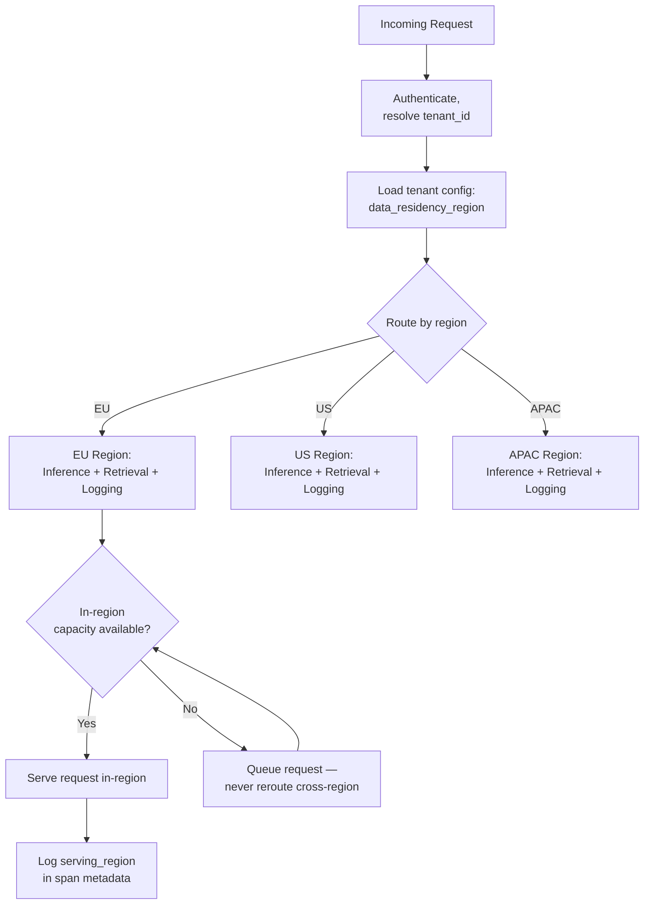
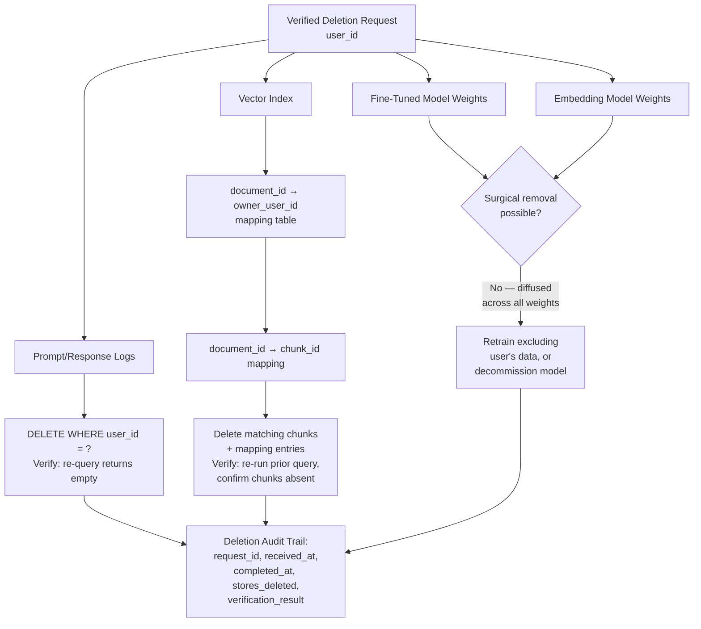

# Data Governance & Compliance

## Overview

Data governance and compliance is where the enterprise contract stops being a legal artifact and starts being an architectural constraint. A DPA clause that says "EU personal data is processed only in the EU" is not satisfied by a database migration — it requires the request-routing layer, the retrieval layer, and the logging pipeline to all honor a regional boundary, for every request, without exception. This chapter covers data residency enforcement, retention policy per data type, the right-to-delete pipeline (including the data types AI introduces that make deletion genuinely hard), and what each major compliance framework concretely requires of the architecture.

## Definition

Data governance and compliance, for an AI platform, is the set of architectural controls that enforce where data is processed, how long each category of AI-generated and AI-consumed data is retained, how a verified deletion request is executed across every store that data touched, and how the platform produces evidence — not just assertion — that these controls hold, sufficient to satisfy SOC 2, GDPR, HIPAA, and equivalent regulatory frameworks.

## Problem Statement

Compliance requirements are usually described in prose a lawyer wrote — "we do not transfer personal data outside the EU without an appropriate safeguard," "personal data is deleted upon a verified request within 30 days" — and engineering has to translate that prose into enforceable system behavior. Three places this translation typically breaks:

- **Residency at rest vs. residency in processing.** Storing data in the right region is the easy 80%. Guaranteeing that *processing* — the actual inference call — also happens in that region, and that no intermediate hop crosses the boundary, is the hard 20% that a naive implementation misses entirely.
- **Retention that isn't just "the database."** An AI system doesn't have one place data lives — prompts and responses, retrieved vector embeddings, fine-tuned model weights, and audit logs are four different data types with four different deletion mechanics, and a retention policy written for "the database" doesn't specify what happens to the other three.
- **Deletion that runs into a wall.** GDPR's right to erasure assumes deletion is technically possible. For data that shaped a fine-tuned model's weights, it isn't — not with any production-ready technique — and that gap has to be disclosed contractually, not discovered during an incident.

## Data Residency and Regional Processing

### Why storage-level residency is insufficient

The naive implementation of "store EU customer data in the EU" is: point the database at an EU region. This satisfies data-at-rest residency and stops there. If a user's prompt — which may itself contain personal data — is routed to a US inference cluster because the EU cluster is momentarily at capacity, personal data has just been processed outside the contractually required region. That's a potential GDPR international-transfer violation, and it happened without a single byte of storage ever leaving the EU. Data residency requires all three of the following to hold, architecturally, not just the first:

1. Data is **stored** in the required region.
2. **Processing** (inference, retrieval, guardrail scoring) occurs in the required region.
3. Data does **not transit** through infrastructure in non-permitted regions, even transiently.

### Per-tenant residency routing architecture

Each tenant's configuration (introduced in [Chapter 01](01-enterprise-ai-architecture.md)) carries a `data_residency_region`. The routing layer reads it and directs the request to the in-region inference cluster, retrieval service, and logging pipeline. The critical design decision is what happens when the in-region cluster is at capacity: the request is **queued**, not rerouted to another region. Latency degrades under load; residency is never violated to preserve latency. This is a case where the correct engineering answer is the opposite of the usual availability instinct — failing over to another region is normally the right move for resilience, and here it's the one failover option that isn't allowed.

### Provider constraints

Residency for hosted LLM APIs depends entirely on the provider offering a regional endpoint in the required jurisdiction:

| Provider | Regional processing options |
|---|---|
| Anthropic | Offers EU and US processing regions for API traffic |
| Azure OpenAI | Regional deployments available in most Azure regions, inheriting Azure's regional infrastructure |
| Google Vertex AI | Regional endpoints across Google Cloud's standard region set |

When no regional endpoint exists from the required provider in the required jurisdiction, the options, roughly in order of preference, are: (a) switch to a different provider that does offer the required region, (b) self-host an open-weight model within the required region — the most operationally expensive option, reserved for when no provider covers the requirement, and (c) obtain a documented legal opinion that a specific cross-border transfer is permissible under an adequacy decision or Standard Contractual Clauses. Option (c) is a legal decision, not an engineering one — it should never be assumed by an engineering team acting alone.

### SCCs and adequacy decisions

Where data legitimately needs to cross a regional boundary for operational reasons, two legal mechanisms make that permissible under GDPR. **Adequacy decisions** are the EU's determination that a specific third country's data protection law is adequate, permitting transfer without additional safeguards — the UK, Japan, and Israel are examples of countries with adequacy decisions. **Standard Contractual Clauses (SCCs)** are EU-approved contract terms between the data exporter and importer, commonly the mechanism used for transfers to the US since the *Schrems II* ruling invalidated the prior EU-US Privacy Shield framework. Engineering's role is to make the *actual* data flow match whatever legal mechanism has been put in place — if the DPA specifies SCCs cover a specific processor, the architecture needs to route only to that processor for the covered data, not any processor that happens to be convenient.

## Retention Policies Per AI Data Type

A retention policy that says "delete after 90 days" means something different, and requires different mechanics, for each of the following. Treating them as one undifferentiated "data" bucket is the most common way retention policy fails to actually be enforced.

| Data type | Retention mechanics | Key complication |
|---|---|---|
| **Prompt/response logs** | Scheduled nightly deletion job, `WHERE created_at < retention_cutoff`; verify by attempting to query deleted records post-job | Security incident investigation may need records past standard retention — requires a documented exception process, not an ad hoc override |
| **Vector embeddings** | Deleting a source document does not auto-delete its embeddings; requires a `document_id → [chunk_id, ...]` mapping table maintained at indexing time, so deletion can find every derived chunk | Without the mapping table, embeddings become orphaned data with no reliable way to find and delete them later |
| **Embedding model weights** | If the embedding model was fine-tuned on customer data, that data is diffused into the embedding space | Practical approach: prohibit fine-tuning the embedding model on individual customer data — use a shared base model — or retrain periodically excluding expired-retention examples |
| **Fine-tuned LLM weights** | Same diffusion problem as embeddings, at higher stakes | At retention expiry: retrain excluding the expired data, or decommission the fine-tuned model. Expensive enough that it creates real pressure to avoid per-customer fine-tuning unless the business case clearly justifies the ongoing cost |
| **Audit logs** | Retained *longer* than other types, not shorter — the audit log is the evidence base for compliance and incident response | Retention period is contractual, typically equal to or exceeding the primary data retention period |

The vector-embedding and fine-tuned-model rows are the two that most consumer-software retention policies never had to handle, because consumer software rarely trains a persistent artifact on individual users' content the way an AI platform's fine-tuning or embedding pipeline can.

## Right-to-Delete (GDPR Article 17) and Its AI-Specific Complications

### The standard scenario

An enterprise customer submits a deletion request for a specific employee's data. GDPR's formal deadline is to respond within 30 days; the practical enterprise-grade implementation target is to complete deletion within 72 hours of a *verified* request — verification matters, since an unverified deletion request is itself a potential attack vector (deleting a different user's data via a spoofed request).

### Where that user's data actually lives

**Prompt/response logs (straightforward).** Query by `user_id`, delete all matching records, verify by re-querying for that `user_id` and confirming an empty result, log the deletion event.

**Vector index (requires document ownership tracking).** The harder question is *which* documents in the index were owned by, or are substantively about, the deleted user — answering that requires a `document_id → owner_user_id` mapping maintained at indexing time, combined with the `document_id → [chunk_id]` mapping already needed for retention deletion above. Delete every chunk where the owner matches, delete the mapping entries, and verify by re-running a query that previously retrieved those chunks and confirming they no longer appear.

**Fine-tuned model weights (the hard case).** If the user's documents contributed to a fine-tuning run, there is no technique in production use today that can surgically remove one training example's contribution from a trained model's weights — the contribution is diffused across every parameter the training process touched. "Machine unlearning" is an active research area, not a deployable solution. The only reliable approach is retraining on a dataset that excludes the user's data, or decommissioning the fine-tuned model entirely. This limitation must be disclosed in the DPA before any customer data goes into a fine-tuning pipeline — discovering it during a live deletion request is a compliance failure that was avoidable at the contract stage.

**Embedding model weights.** Same diffusion problem as fine-tuned LLM weights, if the embedding model itself was fine-tuned on customer-specific data — another reason most platforms keep the embedding model on a shared base rather than per-tenant fine-tuning.

### The deletion audit trail

Every deletion event is logged — deliberately keeping a *record* of the deletion while deleting the underlying *data*, which is not a contradiction: the record contains metadata about the deletion (what was deleted, when, verification outcome), not the deleted content itself. Fields: `deletion_request_id`, `user_id`, `request_received_at`, `deletion_completed_at`, `data_stores_deleted` (the list of tables/indexes actually touched), `verification_result`. This log is retained *after* the underlying data is gone — it is the evidence that the deletion obligation was met.

## Compliance Frameworks at a Systems Level

Each framework below is translated into what a security reviewer or auditor actually inspects — not the policy document, the running system.

### SOC 2 Type II

Requires continuous evidence of controls operating effectively over an audit period, commonly six months — meaning it cannot be produced retroactively under deal pressure. AI-specific implications:

- **Access logging** — every engineer's access to production data (including prompt/response content) is logged and reviewable, with a documented justification requirement for access outside normal automated paths.
- **Change management** — model version updates and prompt changes go through a documented review-and-approval process, with evidence (not just a policy stating it should happen) that changes were actually reviewed before shipping.
- **Vendor management** — the LLM API provider itself must carry an equivalent security certification; Anthropic and OpenAI both maintain SOC 2 Type II, which the platform inherits into its own vendor-risk documentation.
- **Incident response** — a documented, AI-specific incident response procedure (what does "incident" mean for a prompt-injection event or a cross-tenant retrieval leak, specifically) with evidence of tabletop exercises, not just a generic IR runbook that never mentions AI-specific failure modes.

### GDPR

Most enterprise AI processing relies on "legitimate interests" or "contract performance" as the lawful basis for processing personal data. The data subject rights that require real technical implementation, not just a privacy-policy statement:

| Right | Technical requirement |
|---|---|
| Right of access | The system must be able to aggregate all data about a given user across every store that holds it — logs, vector index, any fine-tuning dataset — on request |
| Right to rectification | Support updating stored data and re-indexing corrected documents, not just editing a source-of-truth record while stale copies persist in the vector index |
| Right to portability | Users can receive their data in a machine-readable format |
| Right to object to automated decision-making | If the AI makes consequential decisions about users (see [Chapter 06](06-bias-fairness-and-responsible-ai.md)), they have the right to request human review |

The LLM API provider is itself a data processor under GDPR — a signed DPA with that provider is a prerequisite before any EU personal data is sent to their API, independent of the platform's own DPA with its customer.

### HIPAA

Applies whenever the system processes Protected Health Information. A signed Business Associate Agreement (BAA) with every party that touches PHI — including the LLM API provider — is required before any PHI reaches the API; Anthropic, OpenAI (via Azure), and Google Cloud all offer HIPAA-eligible configurations with a BAA available. Beyond the BAA itself:

- **Minimum necessary standard** — don't send more PHI than the specific task requires; strip unneeded patient identifiers before the model call (see [Chapter 05](05-pii-and-privacy-engineering.md) for the detection and redaction mechanics).
- **Audit controls** — log all access to any system containing PHI, retained for 6 years.
- **Encryption** — PHI at rest requires AES-256; PHI in transit requires TLS 1.2 or higher.

### EU AI Act high-risk classification

If the AI system is used for employment decisions (hiring, performance evaluation), credit, education, or critical infrastructure, it is classified high-risk under the EU AI Act, triggering obligations distinct from GDPR:

- **Technical documentation** describing the system's capabilities, limitations, and training data in enough detail for a regulator to assess it.
- **Conformity assessment** — self-assessment or third-party audit, depending on the specific high-risk category.
- **Registration** in the EU's high-risk AI system database.
- **Human oversight provisions** — a human must be able to meaningfully review and override the system's output for the affected decision.
- **Accuracy and robustness testing**, with evidence, not just a claim.
- **Logging sufficient to reconstruct system behavior** for post-hoc review — a materially stricter bar than general audit logging, since it has to support reconstructing *why* the system reached a specific high-stakes decision.
- **Transparency to affected persons** — people subject to a high-risk AI system's decision must be told that's what's happening.

## Interview Questions

### Beginner

**Q: Why isn't storing data in the correct region enough to satisfy a data residency requirement?**
Because residency covers processing, not just storage — if a prompt containing personal data is routed to an inference cluster outside the required region because the in-region cluster was at capacity, personal data has been processed outside the contractual boundary even though nothing was ever stored there. All three — storage, processing, and transit — must stay within the region.

**Q: What's the difference between a retention policy for prompt logs and a retention policy for a fine-tuned model?**
Prompt logs are deleted with a straightforward `DELETE WHERE` query against a database, verifiable by re-querying. A fine-tuned model has the retained data diffused into its weights during training with no way to surgically remove one contribution — retention expiry for fine-tuned weights means retraining without the expired data or decommissioning the model, which is a fundamentally more expensive operation.

### Intermediate

**Q: A tenant's in-region inference cluster is at capacity. Why should the request queue instead of routing to another region?**
Because routing to another region, even temporarily and even to preserve latency, means personal data is processed outside the contractually required jurisdiction — a potential regulatory violation. Queuing degrades latency but never breaches the residency boundary; that tradeoff (latency over residency) is the correct one precisely because residency is a hard legal constraint and latency is a soft product one.

**Q: A customer asks you to delete a specific employee's data. Walk through what you actually have to touch.**
Prompt and response logs (a straightforward delete by `user_id`), the vector index (requires a document-ownership mapping to find every chunk derived from that user's documents, plus the chunk-mapping table itself), and — if applicable — any fine-tuned model or embedding model trained on that user's data, which cannot be surgically edited and instead requires retraining or decommissioning. Each of the four data types needs its own deletion mechanism; there is no single "delete this user" operation that reaches all of them automatically.

### Senior

**Q: Your platform wants to offer per-customer fine-tuned models. What does this do to your right-to-delete obligations, and how would you scope the offering to manage that risk?**
It creates an obligation the platform may not be able to fulfill on the required timeline — a deletion request for one user whose data was part of a fine-tuning run requires retraining the whole model or decommissioning it, not a quick per-record delete. The scoping response is to disclose this limitation explicitly in the DPA before any customer opts into fine-tuning (so the customer accepts a specific, understood tradeoff rather than discovering the gap during an actual deletion request), and to design the fine-tuning pipeline so retraining without a specific user's data is operationally feasible — versioned training datasets with per-user provenance tracked from the start, rather than an opaque, unreproducible training run.

**Q: How would you design the mapping tables needed to make both retention-based deletion and right-to-delete requests actually executable against a vector index?**
Two mapping tables maintained at indexing time, not reconstructed after the fact: `document_id → [chunk_id, chunk_id, ...]` so any deletion (retention-triggered or request-triggered) can find every chunk derived from a document, and `document_id → owner_user_id` so a right-to-delete request for a specific user can first resolve which documents are theirs before using the chunk mapping to find the actual vector-store records. Without both tables built at index time, deletion degrades into a best-effort search over embedding content, which is neither reliable nor fast enough to meet a 72-hour completion target.

### Staff

**Q: You're advising a company about to accept its first customer requiring HIPAA compliance. What does the AI architecture need to change, beyond signing a BAA?**
The BAA is necessary but not sufficient — it's a legal agreement that the technical architecture then has to actually satisfy. Concretely: implement the minimum-necessary standard by stripping non-essential patient identifiers before any model call, not relying on the model to "be careful" with what it received; extend audit logging to cover every access to any PHI-containing store specifically, with 6-year retention, which is likely longer than the platform's existing general audit retention; verify encryption meets AES-256 at rest and TLS 1.2+ in transit end to end, not just at the primary database; and audit every sub-processor in the request path (the LLM API provider, any embedding service, any third-party classifier) for their own BAA status, since PHI flowing through an uncovered sub-processor breaks compliance regardless of the primary platform's controls. The broader point: HIPAA compliance is a property of the entire request path, and the weakest uncovered link in that path is what determines actual compliance, not the strongest.

## Google-Level Follow-Ups

- "Your platform has EU and US regions. A retrieved document for an EU tenant's RAG query was originally uploaded from a US-based subsidiary's SharePoint. Is this a residency violation?" — probes whether the candidate reasons about the data's *current* processing location versus its origin, and recognizes this needs a real legal/data-mapping answer, not just an engineering assumption either way.
- "Why can't 'anonymize the training data first' fully solve the fine-tuned-model deletion problem?" — probes whether the candidate understands that anonymization at training time doesn't retroactively help when a *specific* user later requests deletion of data that was already blended into weights — the diffusion problem exists regardless of whether the data was labeled with PII at the time.
- "A regulator asks you to demonstrate that EU AI Act high-risk logging requirements are met for a hiring-decision AI feature. What's the difference between what you'd show them versus what you'd show for a standard SOC 2 audit?" — probes whether the candidate distinguishes general operational audit logging from the stricter EU AI Act requirement to reconstruct *why* a specific high-stakes decision was reached, which needs reasoning traces or decision factors logged, not just request/response pairs.
- "Your deletion pipeline successfully deletes a user's data from every store, but the deletion audit trail itself contains the user's name and email as metadata. Is that a problem?" — probes whether the candidate recognizes the audit trail needs its own data-minimization discipline (log the `user_id`, not re-embedded PII) even though it's evidence of compliance, since an audit record that itself contains undeleted PII can undermine the very deletion it's documenting.

## Common Mistakes

- **Treating data residency as a storage-location problem only.** Missing the processing and transit legs of the requirement is the most common way a technically-compliant-looking system still violates a residency clause.
- **Rerouting to another region under capacity pressure "just this once."** Any cross-region failover for a residency-bound tenant is a violation regardless of how brief or well-intentioned — queuing is the only acceptable response to in-region capacity limits.
- **Building retention deletion for the primary database and assuming it covers everything.** Vector embeddings and fine-tuned weights need separate, purpose-built deletion mechanics that most default "delete old rows" jobs never touch.
- **Not maintaining document-to-chunk and document-to-owner mapping tables at indexing time.** Without them, both retention deletion and right-to-delete requests degrade into unreliable best-effort search rather than a verifiable operation.
- **Accepting per-customer fine-tuning requests without disclosing the deletion limitation upfront.** Discovering during an active deletion request that a fine-tuned model can't be surgically edited is a preventable compliance failure if it had been addressed in the DPA before the data was ever used for training.
- **Treating SOC 2 Type II as a point-in-time certification effort.** It requires evidence of controls operating over months — starting the evidence-collection process only after a deal requires it means the certification simply cannot be produced in time.

## Key Takeaways

- Data residency requires enforcing storage, processing, and transit boundaries together — storage-only enforcement is the most common gap, and it's invisible until an audit or incident surfaces it.
- Per-tenant regional routing should queue, never reroute, when the in-region cluster is at capacity — latency degradation is an acceptable tradeoff for a residency violation; a residency violation is not acceptable to preserve latency.
- Retention policy has to be defined separately for prompt/response logs, vector embeddings, embedding model weights, fine-tuned LLM weights, and audit logs — each has different deletion mechanics, and audit logs are retained *longer* than the rest, not shorter.
- Right-to-delete is executable for logs and vector index entries with the right mapping tables built at indexing time, but has no production-ready surgical solution for fine-tuned model weights — that limitation must be disclosed in the DPA before customer data enters a fine-tuning pipeline, not discovered during a live deletion request.
- Every deletion event is itself logged in a deletion audit trail retained after the underlying data is gone — the evidence of compliance, not a contradiction of the deletion.
- SOC 2, GDPR, HIPAA, and the EU AI Act each translate into specific, observable technical controls — access logging, DPAs and BAAs with every sub-processor in the request path, encryption standards, and (for high-risk AI Act systems) reasoning-level logging sufficient to reconstruct a specific decision.
- Compliance requirements are legal constraints that close off architectural choices a vendor might otherwise make freely — residency, retention, and fine-tuning decisions all need to be made with the DPA in hand, not worked out independently by engineering.

---

*Part of [Enterprise AI](index.md) in the [AI System Design Notes](../index.md).*
