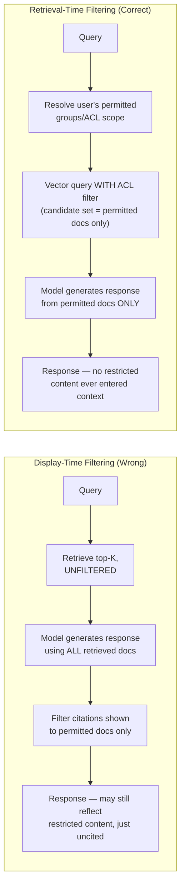
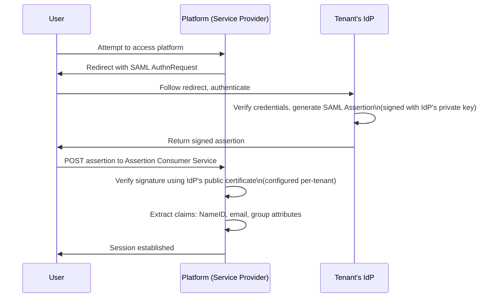
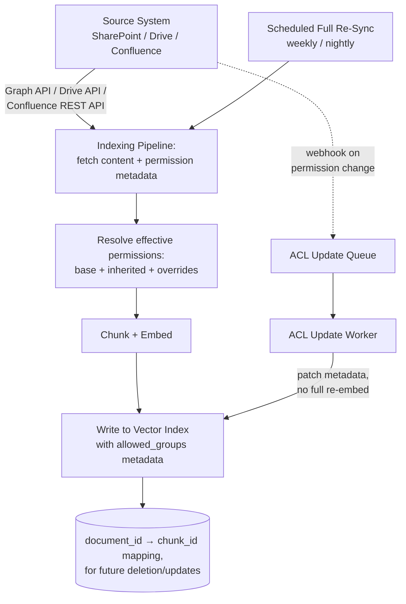
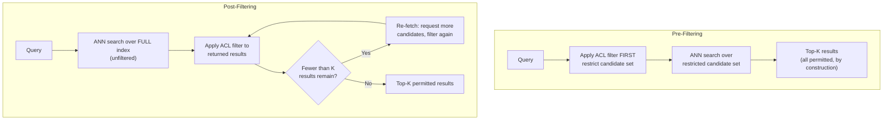

# SSO, Permissions & RAG ACL Enforcement

## Overview

This is the hardest technical problem in enterprise RAG: guaranteeing that retrieval never surfaces a document the requesting user isn't permitted to see. It sounds like a filtering problem. It isn't — filtering *after* retrieval is a well-known trap that looks correct in a demo and leaks in production, because the model has already read the restricted content before anything is filtered from the display. This chapter covers why enforcement has to happen at retrieval time, how enterprise SSO actually authenticates the user whose permissions matter, how document ACLs get from a source system into a vector index in the first place, and the concrete implementation patterns — pre-filtering, post-filtering, subindexes — that make permission-aware retrieval fast enough to ship.

## Definition

Permission-aware RAG is retrieval architecture in which the candidate document set returned to the model is restricted, at query time, to only the documents the requesting user is authorized to see — where authorization is resolved from the user's authenticated identity and group memberships (via enterprise SSO) and enforced as a filter on the vector search itself, not as a post-hoc filter on the documents shown to the user after the model has already processed them.

## Problem Statement

RAG systems are built around a metric — semantic relevance — that has nothing to do with authorization. The retriever's job, as usually built, is "find the K most relevant chunks." Nothing in that objective asks "is the requesting user allowed to see this." Bolting permission checks onto a system built around pure relevance produces two recurring failure patterns:

- **Filtering happens at the wrong layer.** Documents are retrieved unfiltered, the model generates a response using all of them, and only the *citations shown to the user* are filtered for permission. The response itself may already reflect restricted content the user never sees cited.
- **Permissions in the AI system drift from permissions in the source system.** SharePoint, Google Drive, and Confluence permissions change constantly — someone leaves a team, a document is reclassified, an employee is terminated. If the vector index's copy of those permissions isn't kept current, the index becomes a stale, unauthorized side channel into content the source system itself no longer grants access to.

## Why Permission Enforcement Must Happen at Retrieval Time, Not Display Time

### The display-time filtering approach — and why it's wrong

The naive, common-in-early-prototypes approach: retrieve the top-K documents by semantic similarity with no permission filter at all, then filter out any documents the user doesn't have permission to see before displaying citations to them. It looks correct — the user never *sees* a citation to a restricted document. It is nonetheless a real information-leak architecture, for one specific reason: **the model has already processed the restricted documents as part of its context window before any filtering happens.** Their content can influence the response even after the citation is removed. The model may reproduce specific facts from the restricted document verbatim, synthesize a conclusion that depends on the restricted information without directly quoting it, or hallucinate in a direction shaped by contextual signals the restricted document introduced. The display-time filter removes the *evidence trail*; it does nothing about the *information* that already flowed through generation.

### The correct approach

The vector index query itself includes an ACL filter that restricts the *candidate set* to documents the requesting user is permitted to see, before semantic ranking ever happens. The model receives only permitted documents in its context window. There is no restricted content available for the model to absorb, because it was never retrieved in the first place — not because it was hidden after the fact.

### The additional risk: false confidence

Display-time filtering is dangerous specifically because it creates the *appearance* of a solved problem. Engineering believes permissions are enforced because there's a filter step in the code. A security reviewer, testing the product by checking that restricted documents never appear in citations, confirms that appearance. But the model's output was influenced by restricted content the whole time, through a channel — the model's generated text, not a citation list — that's much harder to detect and audit. This is the single most important idea in this chapter: a control that's visibly present in the code is not the same as a control that's actually closing the leak it's meant to close.

## SSO Integration Mechanics

Permission-aware retrieval is only as trustworthy as the identity it's keyed on — and enterprise employees don't create local accounts, they authenticate through their company's own identity provider.

### SAML 2.0

The incumbent enterprise SSO standard. The customer's IdP (Okta, ADFS, or Azure AD acting as an IdP) is the Identity Provider; the AI platform is the Service Provider.

### OIDC (OpenID Connect)

The modern standard, built on OAuth 2.0. The IdP issues a JWT ID token after authentication; the platform verifies the JWT's signature against the IdP's JWKS endpoint (the IdP's published public keys) rather than a manually configured certificate. Claims typically available in the token: `sub` (the canonical, stable user identifier — critical to use this rather than email, since email addresses can change), `email`, and `groups` if the IdP is configured to include them. The platform extracts `sub` as the canonical `user_id` and the group claims as the input to ACL resolution.

### Per-tenant SSO configuration

Each tenant configures its own IdP connection independently — there is no single IdP the platform trusts globally. Conceptually: `tenant_id → { sso_type: "saml2" | "oidc", idp_entity_id, idp_sso_url, idp_certificate, attribute_mapping: { user_id_claim, email_claim, groups_claim } }`. This configuration is loaded at login time, resolved from the `tenant_id` implied by the login URL (e.g., `tenant.ai-platform.com`) or by the user's email domain. Getting this resolution wrong — trusting a tenant identifier supplied by the client instead of derived from the login context — reproduces the exact tenant-isolation failure pattern flagged in [Chapter 01](01-enterprise-ai-architecture.md).

### Group claims and attribute mapping

Not every IdP hands over group membership cleanly:

- Some IdPs omit group claims from the token entirely by default, requiring explicit configuration to include them.
- Some IdPs cap the token's group list (a common limit is the first 200 groups), silently truncating for users in many groups.
- Some encode groups as distinguished names (`CN=Engineering,OU=Groups,DC=company,DC=com`) rather than human-readable identifiers, and some as opaque IDs.

The attribute-mapping configuration exists specifically to normalize this per-tenant variance — defining how to extract a usable group identifier from whatever format that tenant's IdP actually returns. For the truncation case, the mitigation is supplementing the token's group list with a live lookup against the IdP's SCIM endpoint or directory API rather than trusting the token as the sole source of truth. And critically: ACL resolution should always key on the IdP's stable group **identifier**, never the display name — display names get renamed ("Sales" becomes "Revenue"), and a permission system keyed on display name silently breaks the moment someone renames a team in the IdP.

## Document-Level ACL Syncing From Source Systems

Enterprise knowledge lives in source systems — SharePoint, Google Drive, Confluence, GitHub, Jira — each with its own permission model. When a document is indexed for RAG, its permissions have to be indexed alongside it, or the vector index becomes a permission-blind copy of permission-aware content.

**The sync pipeline.** The source system exposes both content and permission metadata through its API — Microsoft Graph for SharePoint/OneDrive, the Google Drive API, the Confluence REST API. The indexing pipeline fetches both together for every document, chunks and embeds the content, and writes each chunk to the vector index with its permission metadata attached at the index-entry level (not stored only alongside the parent document, since retrieval operates on chunks). A `document_id → [chunk_id, ...]` mapping table is written at the same time — the same table [Chapter 03](03-data-governance-and-compliance.md) requires for retention and right-to-delete, doing double duty here for ACL updates and deletions.

**Permission inheritance resolution.** Enterprise documents rarely carry only their own explicit permissions — a document in a SharePoint site inherits the site's permissions unless explicitly overridden at the document level. The indexing pipeline must resolve the *effective* permission set — base permissions, plus anything inherited from the containing folder or site, plus any document-level override — rather than indexing only whatever permissions happen to be set directly on the document. Indexing only document-level overrides silently under-restricts every document that relies on inherited (the common case) rather than explicit permissions.

**Permission propagation latency.** Different permission-change events tolerate different lag before the vector index must reflect them:

| Event | Acceptable propagation latency | Mechanism |
|---|---|---|
| User termination (access revoked) | Minutes | Webhook or SCIM deprovisioning event triggers immediate cache invalidation and ACL patch |
| Permission grant (user added to a group) | Hours | Can ride the normal webhook/queue path without urgency |
| Document reclassification (moved to restricted area) | Hours or less | Same webhook path, prioritized similarly to termination given the sensitivity direction |

The propagation mechanism itself: a webhook fired by the source system on a permission change lands in an ACL update queue, consumed by a worker that patches the affected chunks' metadata directly in the vector index — critically, without needing to re-embed the content, since only the permission metadata changed, not the semantic content.

**Full re-sync as a safety net.** Webhook-driven updates alone accumulate drift over time — missed webhooks, partial worker failures, source-system outages during the event window. A full permission re-sync, re-fetching every document's current permissions from the source system and reconciling against the index, runs on a fixed schedule (commonly nightly or weekly) independent of the event-driven path. This is the same "continuous validation, not one-time correctness" discipline [Chapter 02](02-multi-tenancy-for-ai-platforms.md) applies to tenant isolation, applied here to document-level ACLs.

## Permission-Aware Indexing Implementation Patterns

### Metadata filter at query time — the standard pattern

Each chunk in the vector index carries a metadata field, typically `allowed_groups: [group_id_1, group_id_2, ...]`. At query time, the platform resolves the requesting user's group memberships, then issues the vector query with a metadata filter requiring `allowed_groups` to intersect with the user's groups. Implementation varies by vector database: Pinecone metadata filters support an `$in` operator over the group list; Weaviate's `where` filter offers `containsAny`; Qdrant supports nested filters on array-type payload fields; pgvector implementations typically join against a separate ACL table in the `WHERE` clause. In every case, the filter runs against a metadata index — fast, typically sub-millisecond to low-single-digit milliseconds — and only the matching subset is passed into the actual approximate-nearest-neighbor (ANN) vector search.

### Pre-filtering vs. post-filtering

**Pre-filtering** applies the ACL filter to the candidate set *before* the ANN search runs, so the search space itself is already restricted to permitted documents. This is faster and structurally safer when the user has access to only a small fraction of the total corpus — the search space shrinks accordingly, and there's no risk of the top-K semantic results being dominated by documents that get filtered out afterward.

**Post-filtering** runs the full ANN search unfiltered, then applies the ACL filter to whatever comes back. This is necessary when the underlying vector database doesn't support pre-filtering on array-type metadata efficiently. Its risk is structural: if the user has access to only 5% of the corpus and the unfiltered top-K happens to be dominated by documents outside that 5%, the post-filtered result set may come back with far fewer than K permitted documents — sometimes zero.

### The re-fetch problem and its mitigations

Post-filtering returning fewer than K results after filtering needs an explicit mitigation, not silent under-delivery to the model:

- **Over-fetch** — request top-N candidates where N is deliberately much larger than K (e.g., request 100 to guarantee 10 after filtering), sized against the tenant's typical permission density. Simple, but wastes ANN search work when N is poorly calibrated.
- **Iterative queries** — request K, filter, and if fewer than K survive, request another batch and repeat until K permitted results are obtained or a retry ceiling is hit. Adapts to actual permission density but adds latency proportional to how restrictive the user's access is.
- **Per-user subindexes** — build a dedicated index containing only the documents each individual user is permitted to see. Optimal retrieval performance and correctness by construction, but storage cost scales with (users × their permitted document set), which becomes prohibitive at any meaningful user base — this is the "fully dedicated" end of a spectrum, structurally similar to the isolation-model tradeoff in [Chapter 02](02-multi-tenancy-for-ai-platforms.md).

### Per-group subindexes

A middle ground for the common enterprise case where most users fall into a small number of permission tiers rather than a unique permission set each — e.g., "all employees," "finance team," "executive." Build one index per tier rather than per user or one shared index with per-query filtering. The query router sends each request to the index matching the user's highest applicable permission tier. This dramatically reduces the re-fetch problem (each tier's index contains only content that tier can see, so no filtering — and no re-fetch — is needed at query time) at the cost of maintaining N indexes per tenant and keeping documents correctly assigned to tiers as their classification changes.

## Group Membership Caching and Freshness

Resolving group membership from the IdP or directory service on every single RAG query — an LDAP or SCIM lookup typically costing 50–200ms — adds meaningful latency to every request if done synchronously and uncached. The standard mitigation is caching group memberships per user with a TTL chosen to balance freshness against performance and cache-stampede risk: **5–15 minutes** is a common range, long enough to avoid excessive re-fetching, short enough that most legitimate permission changes propagate within a reasonable window. The one case that cannot wait out a TTL is **termination** — a deprovisioned user's cached group membership must be invalidated immediately, not left to expire naturally, which is why termination events are wired to a webhook that force-invalidates the cache rather than relying on TTL expiry alone.

## Interview Questions

### Beginner

**Q: Why is filtering restricted documents out of the citations shown to the user not sufficient permission enforcement?**
Because by the time citations are filtered, the model has already read the restricted documents as part of its context and generated its response using them. The response text itself — not just the citation list — may reflect facts or conclusions drawn from restricted content, even if that content is never explicitly cited. Removing the citation doesn't undo the model having already processed the information.

**Q: What's the difference between SAML 2.0 and OIDC for enterprise SSO?**
SAML uses signed XML assertions issued by the IdP and verified against a manually configured certificate; OIDC uses signed JWTs verified against the IdP's published JWKS endpoint. OIDC is the more modern standard, generally simpler to integrate, but many enterprise customers — especially larger, older organizations — still run SAML-based IdPs, so a platform typically needs to support both.

### Intermediate

**Q: A user's group membership is cached for 10 minutes. They're terminated at 9:00am. What's the risk, and how is it mitigated?**
For up to 10 minutes, the cached group membership could still grant access to documents the user should no longer see, since the cache hasn't expired. The mitigation is not relying on TTL expiry for termination specifically — a deprovisioning webhook from the IdP or HR system force-invalidates that user's cached permissions immediately, independent of the normal TTL cycle.

**Q: Why does permission inheritance resolution matter for the indexing pipeline, not just the query-time filter?**
Because most enterprise documents don't carry explicit, document-level permissions — they inherit from their containing folder or site. If the indexing pipeline only captures document-level overrides and ignores inherited permissions, it will under-restrict the majority of documents that rely on inheritance, indexing them as if they had no owner-defined restriction at all.

### Senior

**Q: Design the ACL sync path so that a user's termination is reflected in RAG retrieval within minutes, without requiring a full re-index of the corpus.**
Two components working together: the IdP or HR system fires a deprovisioning webhook on termination, which immediately invalidates that user's cached group-membership entry — closing the fast path within seconds, independent of document-level ACL sync. Separately, the source system's own permission-change webhooks (e.g., a SharePoint permission revocation cascading from the termination) feed an ACL update queue whose worker patches only the affected chunks' `allowed_groups` metadata in place, without re-embedding content — this is what keeps propagation to minutes rather than requiring a full corpus re-crawl. A full re-sync still runs on schedule as a safety net for any webhook that was missed.

**Q: Your platform uses post-filtering because the vector database doesn't support efficient pre-filtering on array metadata. A user with access to only 2% of a 10-million-chunk corpus gets zero results back from a query that should have several good matches. Diagnose and fix.**
The ANN search returned its top-K from the unfiltered 10 million chunks, and because the user's permitted set is such a small fraction of the corpus, none of the semantically top-ranked chunks survived the ACL filter — a structural failure mode of post-filtering under low permission density, not a relevance failure. The fix is either switching to pre-filtering (restricting the ANN search space to the user's permitted chunks before ranking, which for a 2%-density user makes the search both correct and cheaper) or, if pre-filtering isn't available, moving to iterative over-fetching sized to the user's actual permission density rather than a fixed over-fetch multiplier that assumes typical density.

### Staff

**Q: You're designing permission-aware retrieval for a platform where some tenants have thousands of fine-grained, mostly-unique permission sets (large enterprise with document-level ACLs) and others have three broad tiers (small business with "everyone sees everything" plus an executive tier). Should these use the same retrieval architecture?**
No — forcing one architecture onto both wastes engineering effort in one direction or the other. For the small-tenant case with a handful of broad tiers, per-group subindexes are cheap to maintain and eliminate the re-fetch problem entirely, since each tier's index only ever contains what that tier can see. For the large-tenant case with near-unique permission sets per user, subindexing per group provides little benefit (nearly as many "groups" as users) and the platform should invest in efficient pre-filtering at the vector-database layer instead, since that scales with corpus size rather than with permission-set cardinality. The architectural decision should be driven by the tenant's actual permission-density distribution, exposed as a per-tenant configuration choice — not a single global retrieval strategy applied uniformly regardless of fit.

## Google-Level Follow-Ups

- "If a document is retrieved, fed into the model's context, but never appears in the final response at all — was it a leak?" — probes whether the candidate understands the blast radius of retrieval-time exposure exists independent of whether the model's specific output happens to reveal it; the risk is the exposure, not just the observed outcome in one instance.
- "Your ACL sync pipeline uses webhooks from the source system. What happens during a source-system outage that drops webhook delivery for six hours?" — probes for the full re-sync safety net as the answer, and whether the candidate treats webhook-only sync as sufficient (it isn't) or as one layer of a system that assumes delivery failures will happen.
- "A user is a member of 300 groups, but the IdP's OIDC token truncates group claims at 200. How does this affect retrieval correctness, and how would you detect it's happening at all?" — probes for the live SCIM/directory lookup mitigation, and specifically for a detection strategy (e.g., comparing token group count against a known directory total) since silent truncation is otherwise invisible until a user reports a permission-related retrieval gap.
- "How would your retrieval-time ACL enforcement need to change for an agentic system where the model can call a search tool multiple times within one reasoning trajectory, not just once at the start?" — probes whether the candidate recognizes the ACL filter has to be enforced on every tool-mediated retrieval call within a trajectory, not just the initial RAG call, since a multi-step agent can re-query with different phrasing at any point in its reasoning.

## Common Mistakes

- **Filtering restricted documents from citations instead of from the retrieval candidate set.** The single most common and most dangerous mistake in this chapter — it looks correct in testing and leaks through generated text that was never audited for restricted-content influence.
- **Keying ACL resolution on group display names instead of stable identifiers.** Display names get renamed in the IdP; a permission system keyed on them silently breaks (either over- or under-restricting) the moment a team is renamed.
- **Indexing only document-level permission overrides, ignoring inheritance.** Under-restricts the majority of enterprise documents, which rely on inherited folder/site permissions rather than explicit per-document grants.
- **Relying solely on webhook-driven ACL updates with no scheduled full re-sync.** Webhook delivery failures accumulate as silent permission drift with no safety net to catch and correct it.
- **Using a fixed over-fetch multiplier for post-filtering regardless of a user's actual permission density.** Works fine for typical users and silently returns too few or zero results for users with unusually restrictive access — exactly the users where getting retrieval right matters most.
- **Treating group-membership cache TTL as sufficient for termination events.** A terminated user retains access to whatever was cached until the TTL naturally expires unless termination is wired to an immediate cache-invalidation webhook.

## Key Takeaways

- Permission enforcement must happen at retrieval time — restricting the candidate document set before the model ever sees it — not at display time, because a model that has processed restricted content can leak it through generated text even after citations are filtered.
- Enterprise SSO (SAML 2.0 or OIDC) establishes the authenticated identity and group memberships that permission-aware retrieval depends on; per-tenant IdP configuration and attribute mapping are required because IdPs vary widely in claim format and group-list completeness.
- Document ACLs must be synced from source systems alongside content at index time, with permission inheritance resolved (not just document-level overrides captured), and kept current through both event-driven updates and a scheduled full re-sync safety net.
- Pre-filtering the ANN search space is generally faster and structurally safer than post-filtering, especially for users with low permission density relative to the corpus, where post-filtering risks returning far fewer than K results.
- Per-user subindexes give optimal retrieval correctness but don't scale in storage cost; per-group subindexes are a practical middle ground for tenants with a small number of broad permission tiers.
- Group membership should be cached with a short TTL for performance, but termination events must bypass the TTL entirely via immediate, webhook-triggered cache invalidation — the one case where stale cached permissions carries the highest risk.
- The core architectural discipline underlying this entire chapter is the same one from [Chapter 01](01-enterprise-ai-architecture.md): never let a control that's merely present in the code substitute for a control that's actually verified to close the leak it's meant to close.

---

*Part of [Enterprise AI](index.md) in the [AI System Design Notes](../index.md).*
