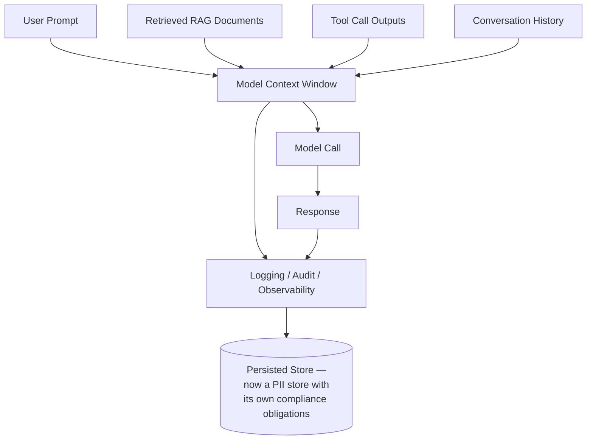
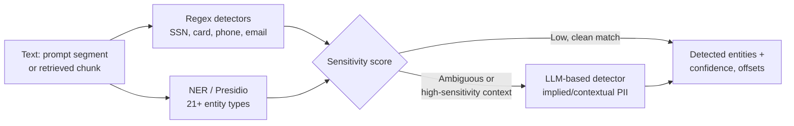
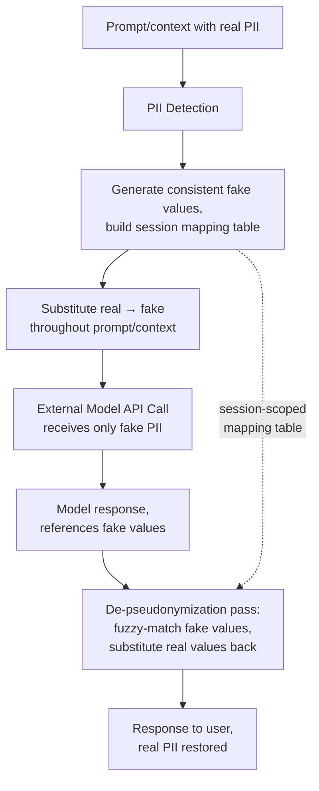
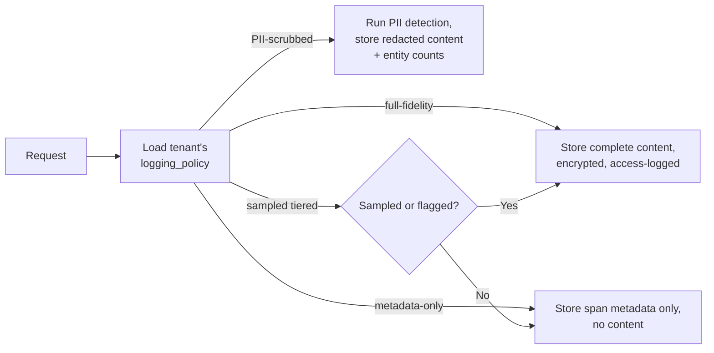
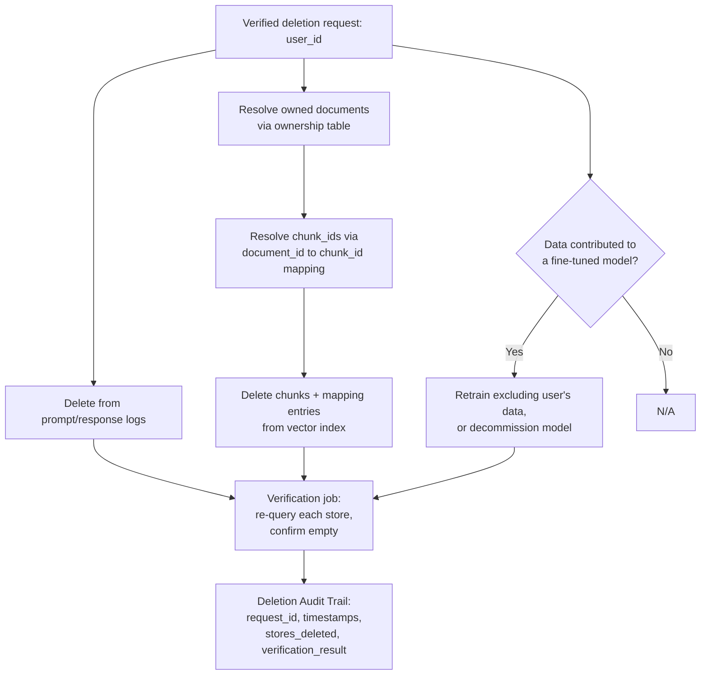

# PII and Privacy Engineering in AI Systems

## Overview

Personal data doesn't enter an AI system through one door. It arrives typed into prompts, embedded in retrieved documents, returned from tool calls, and accumulated across multi-turn conversation history — and every one of those entry points becomes a compliance surface the moment it's logged, sent to a third-party model API, or persisted in a vector index. This chapter works through the problem in the order it actually occurs in a live system: where PII enters, how it's detected, how it's redacted or pseudonymized before it leaves the platform's boundary, how logging policy has to bend to compliance constraints, how right-to-delete is actually executed once PII has propagated across four different data stores, and how regional routing keeps personal data inside the jurisdiction it's contractually bound to.

## Where PII Enters the AI Pipeline

PII in an enterprise AI system is not an edge case to be handled defensively — it's the norm, arriving through at least four distinct channels, each with a different risk profile.

**User-typed prompts.** Employees routinely include personal information without a second thought, because the request itself is about a person: *"Draft a rejection email to john.smith@company.com about the position he applied for."* *"My employee Maria Garcia (DOB 1985-03-12) has been underperforming — help me write a performance improvement plan."* In healthcare contexts: *"My patient is a 52-year-old male with T2DM and hypertension..."* Every enterprise domain — HR, sales, healthcare, legal — surfaces PII in prompts as a matter of course, not exception.

**Retrieved documents via RAG.** HR records, customer records, email archives, medical records, and financial statements are exactly the kind of content enterprise RAG systems are built to retrieve. Once retrieved, their PII travels into the model's context window and, potentially, into the model's generated response — the same channel [Chapter 04](04-sso-permissions-and-rag-acl-enforcement.md) covers for permission enforcement is simultaneously a PII-propagation channel.

**Tool call outputs.** An agent calling a CRM tool gets back customer names, emails, and addresses. An agent calling an HR system tool gets back employee records. Every tool call in an agentic session is a potential PII-injection point into the model's context, independent of anything the user typed.

**Conversation history in multi-turn sessions.** PII shared in turn one is carried forward into the context for every subsequent turn. The PII surface area of a session grows monotonically with turn count — a ten-turn conversation about an employee's performance case has accumulated far more exposed personal data in context than the first turn alone.

**The logging surface.** Every one of the above eventually flows into whatever the platform persists — audit logs, debugging traces, observability spans. A request that never should have been logged in full fidelity gets logged anyway if the logging pipeline doesn't know to treat PII differently from any other request content, quietly creating a PII store with compliance obligations nobody explicitly designed for.

## PII Detection

Detection is a layered pipeline, not one classifier — different techniques catch different classes of PII, at different cost, with different accuracy characteristics, and production systems cascade cheap-and-broad checks with expensive-and-precise ones.

**Regex-based detection.** Deterministic pattern matching for structured formats: credit card numbers, Social Security numbers, phone numbers (US and international), postal codes, IP addresses, passport numbers, and state-specific driver's license formats. Advantages: fully deterministic, essentially zero false negatives on exact-format matches, nanosecond-to-millisecond cost. Disadvantages: brittle across format variation (an SSN written `123 45 6789` may not match a pattern authored for `123-45-6789`) and no semantic understanding whatsoever — a regex can't recognize that "my salary is $95,000" is sensitive financial information, because there's no fixed pattern for an arbitrary dollar amount in a sensitive context.

**Named entity recognition (NER).** ML models trained to identify entity types like `PERSON`, `ORG`, `LOC`, `EMAIL`, `PHONE`. spaCy's pretrained models are fast and adequate for common entity types in clean text. GLiNER (generalist NER) generalizes better to custom entity types and zero-shot categories the model wasn't explicitly trained on. Fine-tuned Hugging Face token-classification models can be trained on domain-specific PII categories. Typical accuracy: 85–95% precision and recall for standard entity types on clean, formal text — materially lower on informal text, medical abbreviations, or non-English content. False positives are a real cost: "Apple" gets flagged as a person's name because it's ambiguous with the company, "NY" gets flagged as a person-name abbreviation.

**Learned classifiers for domain-specific PII.** Standard NER underperforms badly on Protected Health Information — clinical notes use abbreviations and conventions general-purpose models were never trained on. Fine-tuned clinical-domain models (Amazon Comprehend Medical, Microsoft Text Analytics for Health, or custom fine-tunes on clinical NER datasets) achieve substantially higher recall on medical PII specifically, and are the appropriate choice wherever HIPAA-scope content is in the pipeline.

**LLM-based PII detection.** An LLM can catch *implied* PII that neither regex nor NER can see structurally: *"My employee has been dealing with a recent hospitalization"* contains implied health information — PHI — with no named entity present at all. This requires genuine contextual understanding, which is exactly what an LLM has and a pattern-matcher or entity-tagger doesn't. The tradeoff is cost — an additional inference call per request — which is why LLM-based detection is used as the top tier of a cascade: cheap regex-plus-NER runs on all traffic, and only content that trips a lower-confidence signal (or falls in a known high-sensitivity context) escalates to the LLM-based check.

**Microsoft Presidio.** The production-grade open-source PII detection library, covering 21+ entity types out of the box with a pluggable recognizer architecture for adding domain-specific entities. Output is a list of `RecognizerResult` objects, each with entity type, start/end character offsets, and a confidence score. The standard integration pattern wraps Presidio's `AnalyzerEngine` in the request pipeline, running it on the text content of every prompt segment and every retrieved document chunk before either reaches the model call.

## Redaction and Pseudonymization Before Sending to External Model APIs

**The compliance driver.** Sending a prompt containing EU personal data to a US-based LLM API with no legal transfer mechanism in place is a potential GDPR international-transfer violation — the same concern [Chapter 03](03-data-governance-and-compliance.md) covers for data residency generally, but resolvable here at the content layer: if the PII itself is removed or masked before the API call, there's no personal data in the transfer to be a violation of.

**Redaction.** PII is replaced with a typed placeholder: `[PERSON_NAME]`, `[EMAIL_ADDRESS]`, `[SSN]`, `[MEDICAL_RECORD_NUMBER]`. The model receives placeholders in place of real values and produces a response referencing them. Simple to implement and audit, but the model's response can read awkwardly when it needs to naturally address a person by name or use correct pronouns, since a placeholder carries none of that information.

**Pseudonymization.** A session-scoped mapping table is built at the start of the session: `John Smith → Alex Chen`, `john@company.com → alex@example.com`. Every occurrence of the same real entity throughout the session is replaced with the same fake entity, preserving relationships, pronoun agreement, and narrative coherence. The model receives realistic-looking (but fake) PII and produces a natural response; a de-pseudonymization pass then reverse-substitutes the real values back in before the response reaches the user.

**Implementation.** The pseudonymization engine runs before the model call — detect PII, generate fake values, build the mapping — and the de-pseudonymization pass runs on the model's response, searching for occurrences of the fake values and substituting the corresponding real ones back in.

**Failure modes.** The model can transform a fake name in ways the reverse-substitution pass doesn't anticipate — capitalization changes, possessive forms ("Alex Chen's"), abbreviations, or splitting a full name into just a first name mid-response. The practical mitigation is choosing fake values that are distinctive and easy to detect across morphological variants, and running the de-pseudonymization match with fuzzy matching rather than exact string matching alone.

**Zero-data-retention API configurations.** Both Anthropic and OpenAI offer "zero retention" or API opt-out configurations in which prompt and response content is not stored by the provider after the call completes. This does *not* address the PII-in-transit concern — the data still physically travels to and through the provider's inference infrastructure during the call — but it removes the provider-side log-retention concern, which is a required configuration for HIPAA-eligible use specifically, independent of and complementary to redaction/pseudonymization.

## Logging Policies Under Compliance Constraints

Every request that touches PII eventually needs a logging decision, and the right decision is not the same for every tenant or every request class.

| Policy | What's stored | Use case |
|---|---|---|
| **Full-fidelity logging** | Complete prompt and response, encrypted at rest, strict access control with justification-required access itself logged, retention tied to sensitivity classification, deletion process that can remove a specific user's entries | Maximum debuggability; required where logs double as the audit trail |
| **PII-scrubbed logging** | PII detection runs before persistence; the redacted content (placeholders, not raw PII) is stored, alongside a `pii_entity_count_by_type` field (e.g., `{PERSON: 2, EMAIL: 1}`) so debugging retains context about what kind of data was present without storing the data itself | When full-fidelity logging creates too large a PII compliance surface relative to its debugging value |
| **Metadata-only logging** | Only span metadata — token counts, model version, latency, cost, error codes — with zero content | Highest-sensitivity contexts, where any logged content creates unacceptable risk regardless of redaction quality |
| **Sampling with tiered retention** | Full-fidelity for a small sampled percentage (e.g., 1%) with shorter retention; metadata-only for the rest; flagged requests (safety triggers, complaints, quality anomalies) stored full-fidelity regardless of the sampling rate | Balancing debugging value against storage and compliance cost at meaningful production volume |

**Per-tenant logging policy.** This is a tenant contractual parameter, not a platform-wide setting — enterprise customers specify their required logging level as part of their contract, and the platform enforces whichever policy that tenant selected, the same way [Chapter 01](01-enterprise-ai-architecture.md) treats `data_residency_region` and `guardrail_profile` as per-tenant configuration rather than global constants.

## Right-to-Delete Across AI Data Types

This is the same right-to-delete obligation introduced in [Chapter 03](03-data-governance-and-compliance.md), worked through here specifically for where PII actually lands once it's propagated through the pipeline described above.

**Logs (prompt/response/span records).** Keyed by `user_id`; deletion is a straightforward `DELETE WHERE user_id = ?`; verified by re-querying for that `user_id` and confirming an empty result.

**Vector index.** Requires the `document_id → [chunk_id]` mapping table maintained at indexing time. Steps: identify every document owned by or attributable to the deleted `user_id` via a document-ownership table; resolve those document IDs to their full set of chunk IDs; delete the chunk records from the vector index; delete the now-orphaned mapping-table entries; verify by re-issuing a semantic query that previously retrieved those chunks and confirming they no longer appear in results.

**Fine-tuned model weights.** No surgical removal technique exists in production use — the contribution is diffused across the model's parameters. Three options, in order of typical preference: retrain on a dataset that excludes the deleted user's documents (slow and expensive, but preserves the model); decommission the fine-tuned model and fall back to the shared base model (fast, but loses whatever value the fine-tune provided); or, for cases where retraining isn't practical on the required timeline, document the technical infeasibility in the DPA and obtain explicit informed consent from the data subject for that specific use case — which is a legal accommodation, not an engineering workaround, and should be used narrowly.

**The deletion verification pipeline.** After the deletion job runs, a separate automated verification job independently queries every relevant data store for the deleted `user_id` and confirms each returns empty. The verification result — not just the deletion attempt — is what gets logged in the deletion audit trail, because a deletion job that silently failed partway through is a compliance gap the audit trail needs to catch, not paper over.

## Data Residency Routing

The same per-tenant routing enforcement covered architecturally in [Chapter 03](03-data-governance-and-compliance.md), restated here from the PII-flow perspective: the routing middleware reads `tenant_id` from the authenticated request, looks up `data_residency_region` from tenant configuration, and routes the request — inference, retrieval, and logging together — to the region-specific stack. If the region-specific cluster is unavailable, the request queues; it is never rerouted to another region to preserve latency, because doing so would mean personal data is processed outside its contractually required jurisdiction. The routing decision and the actual serving region are both written into span metadata specifically so residency compliance is independently verifiable after the fact, not just assumed to have worked because the routing code exists.

**Monitoring for residency violations.** The `serving_region` field is aggregated across all spans and alerted on if any request for a tenant with a non-US residency requirement is ever served by the US region — treating a residency violation as a first-class monitored event, not something discovered only if a customer happens to ask.

## Interview Questions

### Beginner

**Q: Name three distinct places PII can enter an AI system's request path, beyond the user's typed prompt.**
Retrieved documents via RAG (HR records, customer data, medical records), tool call outputs (a CRM or HR system query returning names and contact details), and conversation history accumulated across multi-turn sessions — each is a distinct channel with its own exposure characteristics, not a variant of the same problem as the typed prompt.

**Q: What's the difference between redaction and pseudonymization?**
Redaction replaces PII with a typed placeholder like `[PERSON_NAME]`, which is simple but can produce an awkward response since the model has no real value to work with. Pseudonymization replaces PII with a consistent fake value (a session-scoped mapping, e.g., "John Smith" → "Alex Chen") so the model produces a natural response using the fake identity, which is then reverse-substituted back to the real value before the response reaches the user.

### Intermediate

**Q: Why can't regex-based PII detection alone be trusted as the only detection layer?**
Regex is deterministic and fast but only catches PII with a fixed, well-defined format — it has no semantic understanding, so it misses PII expressed in natural language without a matching pattern (an arbitrary salary figure, an implied health condition) and is brittle to format variation even within its intended scope (an SSN written with unexpected spacing). It needs to be layered with NER and, for high-sensitivity contexts, LLM-based detection that can catch contextual and implied PII.

**Q: A tenant's contract specifies "PII-scrubbed logging." What does the platform actually need to do differently from full-fidelity logging, and what's lost?**
PII detection has to run on every prompt and response *before* persistence, storing the redacted content (placeholders) plus an entity-count summary rather than the raw text. What's lost is the ability to see the actual PII values during debugging — an engineer investigating a quality issue can see that two person names and one email were present, but not which — which is the deliberate tradeoff the tenant is making in exchange for a smaller PII compliance surface.

### Senior

**Q: Design the pseudonymization pipeline for a multi-turn session where the same person is referenced in turn 1, and again — using a nickname — in turn 5. What has to hold for de-pseudonymization to work correctly?**
The session-scoped mapping table has to persist across the full session, not be rebuilt per turn, so the same real entity always maps to the same fake entity regardless of which turn it first appeared in. The harder requirement is entity resolution across turns — recognizing that a nickname in turn 5 refers to the same real person tagged in turn 1 requires either coreference resolution ahead of substitution or accepting that an unresolved nickname will pass through unpseudonymized, which is a real gap that needs to be explicitly tested for, not assumed away.

**Q: A customer's fine-tuned model was trained on a dataset that included an employee who has since submitted a valid right-to-delete request. Walk through the decision.**
Surgical removal from the trained weights isn't technically available, so the real decision is retrain-versus-decommission, weighed against the deletion timeline commitment in the DPA. If the fine-tuning dataset is versioned with per-user provenance, retraining on a dataset excluding that employee's records is feasible within a reasonable window and preserves the customer's fine-tuned model. If it isn't — if the training data was never tracked with that granularity — the practical options collapse to decommissioning the model back to the shared base, which is a worse outcome for the customer but the only technically honest one available; it also means this is exactly the gap that should have been disclosed in the DPA before fine-tuning was offered, not discovered under deletion-request pressure.

### Staff

**Q: You're designing PII handling for a platform where the same tenant wants full-fidelity logs for debugging but has EU employees whose data can't leave the EU. How do these two requirements interact, and does one architecture serve both?**
They're actually orthogonal requirements that get conflated if logging policy and residency routing are treated as one setting instead of two independent tenant-configuration axes. Full-fidelity logging can be satisfied entirely within the EU region — the logging pipeline for that tenant simply runs in-region, same as inference and retrieval, so "full fidelity" and "EU-only" aren't in tension; the tension only appears if the logging infrastructure was built as a single global pipeline that wasn't designed to be region-scoped per tenant. The fix is treating `logging_policy` and `data_residency_region` as independent configuration dimensions from the start, both enforced by the same per-tenant routing layer, rather than assuming a single logging pipeline can serve every tenant regardless of region.

## Google-Level Follow-Ups

- "Your pseudonymization pass replaces 'Sarah Chen' with 'Alex Rivera' consistently, but the model's response refers to her only as 'she' in the final paragraph. Is that a leak?" — probes whether the candidate recognizes pronouns aren't a leak by themselves (they don't identify anyone without an antecedent) but that de-pseudonymization still needs the antecedent correctly resolved for the final response to read coherently — a correctness issue, not strictly a privacy one, worth distinguishing.
- "How would you detect that your PII detection cascade (regex + NER) is missing a category of PII that matters to a specific tenant's industry, before a customer tells you?" — probes for a systematic answer: periodic red-team-style audits with domain-specific test sets (e.g., clinical PII for a healthcare tenant), rather than assuming general-purpose detectors generalize to every vertical's specific PII shape.
- "Zero-data-retention API configuration is in place. Does that mean you no longer need redaction or pseudonymization before the API call?" — probes whether the candidate understands zero-retention addresses provider-side storage only, not the fact that personal data is still processed by, and transits to, the provider's infrastructure during the call — the two controls address different legal concerns and aren't substitutes for each other.
- "A deletion verification job reports success for all four data stores, but a customer's own audit six months later finds the deleted user's data still present in a vector index backup. What does this reveal about the original verification, and how do you prevent recurrence?" — probes whether the candidate thinks about backup and snapshot retention as a fifth data-location category the deletion pipeline needs to cover explicitly, since "delete from the live index" and "delete from every backup that includes that data" are different, easily conflated obligations.

## Common Mistakes

- **Treating PII detection as a single classifier instead of a layered cascade.** No single technique — regex, NER, or LLM-based — has both the coverage and the cost profile to run alone at production scale; each layer exists to catch what the cheaper layer upstream of it misses.
- **Redacting or pseudonymizing only the user's prompt, not retrieved documents or tool outputs.** PII entering through RAG or tool calls bypasses protection entirely if the pipeline only inspects the literal text the user typed.
- **Building pseudonymization without a fuzzy-match de-pseudonymization pass.** The model will morphologically alter fake values (possessives, capitalization, abbreviation) in ways an exact-match reverse-substitution silently fails to catch, leaking fake — and therefore effectively real, since the mapping is known — identifiers into the response.
- **Treating zero-data-retention API configuration as equivalent to not sending PII at all.** It addresses provider-side storage, not the fact that the data is still transmitted to and processed by the provider during the call — a distinct legal concern that redaction or pseudonymization addresses and zero-retention does not.
- **Applying one logging policy platform-wide instead of per tenant.** Logging fidelity is a contractual parameter customers specify individually; a single global policy either over-collects for privacy-sensitive tenants or under-collects for tenants who explicitly want full-fidelity debugging support.
- **Scoping the right-to-delete pipeline to live data stores only, ignoring backups and snapshots.** A deletion that succeeds against the live vector index but leaves the deleted data recoverable from a backup has not actually fulfilled the deletion obligation.

## Key Takeaways

- PII enters an AI system through at least four channels — typed prompts, retrieved RAG documents, tool call outputs, and accumulated conversation history — and detection and protection have to cover all four, not just the prompt.
- PII detection is a cascade, not a single technique: regex for deterministic formats, NER for general entity recognition, domain-specific classifiers for clinical or other specialized PII, and LLM-based detection for implied or contextual PII that structural techniques can't see.
- Redaction and pseudonymization exist to remove personal data from the content actually transmitted to a third-party model API — pseudonymization additionally preserves narrative coherence through a session-scoped mapping table, at the cost of needing a robust, fuzzy-matched de-pseudonymization pass.
- Zero-data-retention API configurations address provider-side storage of prompts and responses; they do not address the fact that personal data is still processed in transit — the two protections are complementary, not substitutes.
- Logging policy — full-fidelity, PII-scrubbed, metadata-only, or sampled-tiered — is a per-tenant contractual configuration, not a platform-wide constant, because different customers have genuinely different debuggability-versus-exposure tradeoffs they're entitled to choose.
- Right-to-delete has to reach every store PII actually landed in — logs, vector index (via ownership and chunk-mapping tables built at indexing time), and, where technically infeasible for fine-tuned weights, a disclosed retrain-or-decommission decision — plus any backups, and the deletion itself must be independently verified, not just attempted.
- Data residency routing enforces the same in-region-or-queue discipline for PII specifically that [Chapter 03](03-data-governance-and-compliance.md) establishes generally — the serving region is logged per request specifically so residency compliance is verifiable, not assumed.

---

*Part of [Enterprise AI](index.md) in the [AI System Design Notes](../index.md).*
