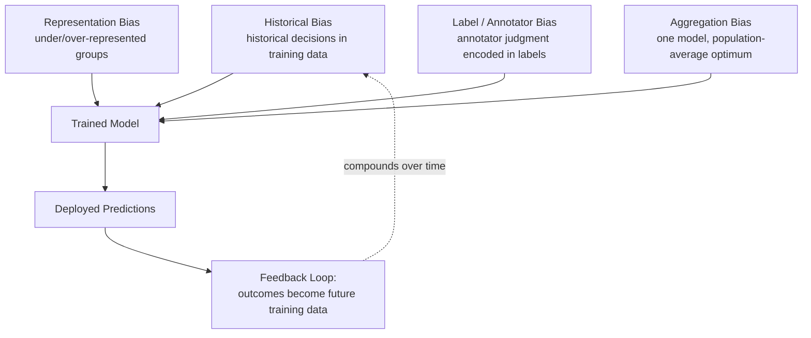
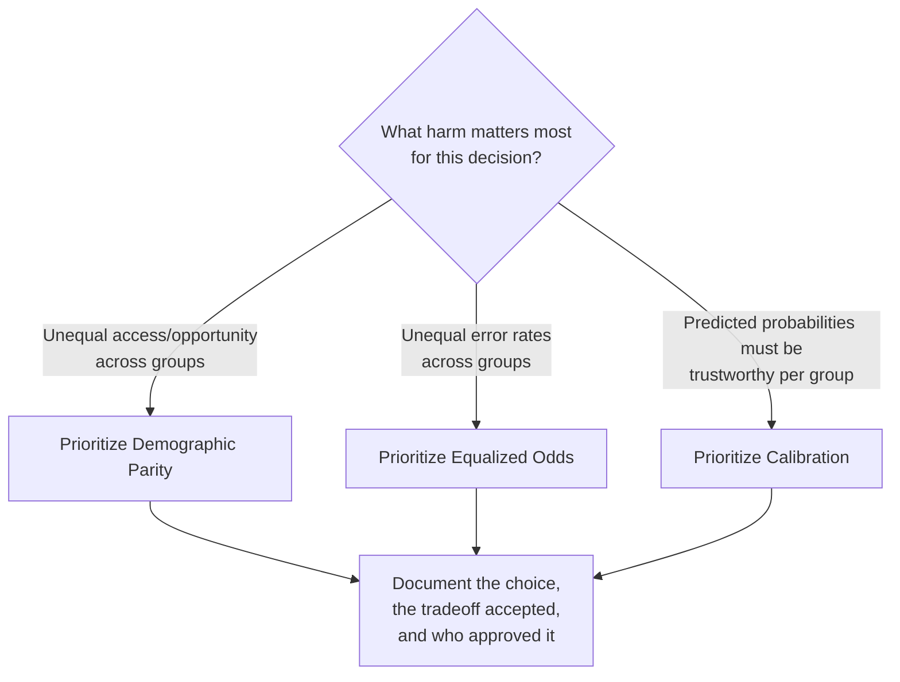
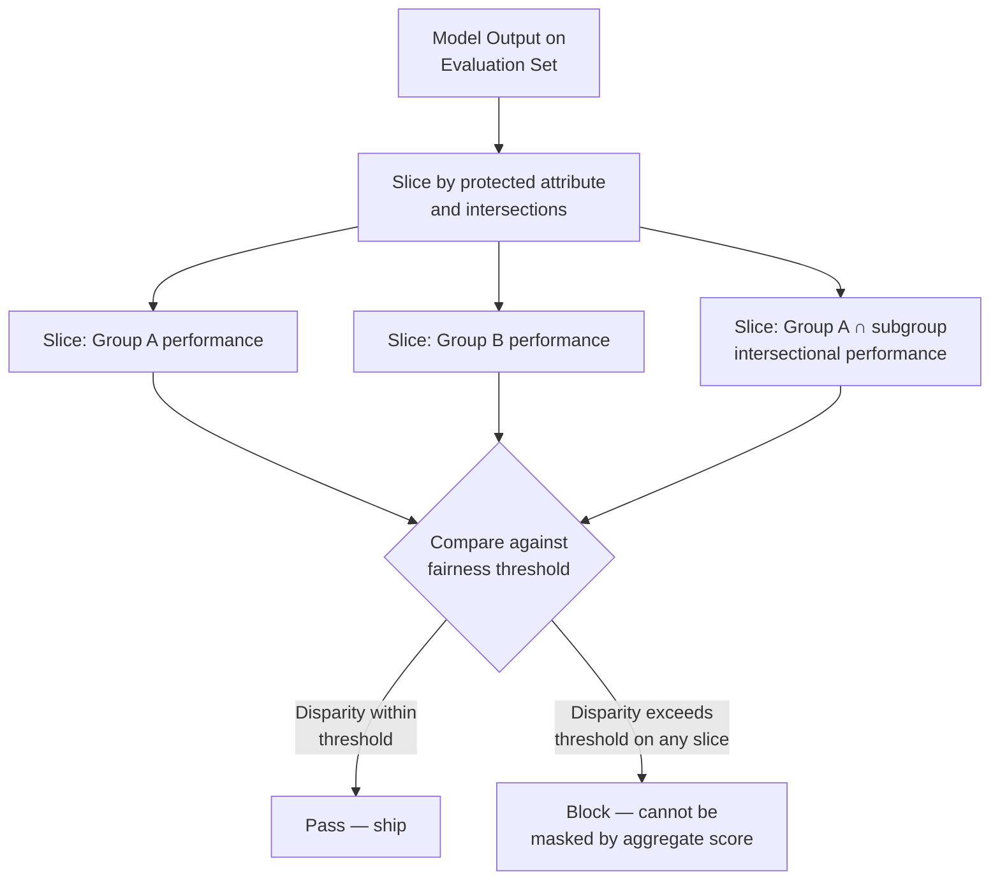

# Bias, Fairness, and Responsible AI Systems

## Overview

A model that is accurate on average can still be systematically wrong for a specific demographic group — and "accurate on average" is exactly the metric most teams optimize for by default, which is precisely why this failure mode is so common in production. This chapter works through where bias actually enters an AI system, why fairness cannot be reduced to a single metric (there is a mathematical reason multiple reasonable fairness definitions cannot all be satisfied at once), how to build an auditing architecture that catches disparate performance across groups instead of hiding it inside an aggregate score, what debiasing techniques exist and what they trade away, what high-stakes domains require beyond what general-purpose fairness testing covers, and what the current regulatory landscape actually obligates a team to do.

## Sources of Bias in AI Systems

Bias doesn't require an ill-intentioned engineer. It is the default outcome of training a model on real-world data, because real-world data reflects real-world patterns of inequality, and a model's job is to learn patterns.

**Historical bias in training data.** Training data reflects historical decisions, and a model trained on it learns those decisions as "correct" — because from a pure pattern-matching standpoint, they are the pattern. A hiring model trained on twenty years of a company's historical hiring decisions inherits whatever gender or race patterns shaped those decisions, even when demographic attributes are explicitly excluded from the input features. This is the well-documented **proxy feature** problem: vocabulary choices common in resumes, the specific universities listed, and zip codes all carry demographic signal even with no protected attribute present as a labeled field. The model is not behaving badly *in spite of* the training data — it is faithfully learning the patterns actually present in that data, which is exactly the problem.

**Representation bias.** Some groups are systematically over- or under-represented in training data, and model quality tracks representation, not some group-independent notion of task difficulty. An LLM trained predominantly on English-language internet text performs measurably better on English than on Swahili — not because Swahili is linguistically harder, but because the training distribution was dominated by English. A medical AI trained on clinical notes from a handful of US academic medical centers performs worse on disease presentations that differ in other populations, or that are more prevalent among demographics underrepresented in those specific centers' patient population.

**Label bias / annotator bias.** Training labels reflect the judgment — and the biases — of whoever created them. A toxicity classifier trained on labels from a demographically narrow group of annotators can systematically over-flag dialects, in-group language, or communication styles that differ from the annotators' own norms as "toxic," not because the content is more harmful, but because it reads as unfamiliar to the specific people who labeled the training examples.

**Feedback loops.** A deployed model's outputs shape future training data, and a biased model can compound its own bias over successive training cycles. A resume-screening model that under-selects a group produces fewer hired examples from that group, which — if hiring outcomes are fed back into future training data — makes the model even more confident that group is a poor fit, entirely independent of actual qualification.

**Aggregation bias.** A single model trained to perform well on average across a population can systematically underperform for subgroups whose optimal decision boundary differs from the population's — not because any group was excluded from training, but because a one-size-fits-all model averages away group-specific structure that a stratified approach would have preserved.

## Fairness Metrics and the Impossibility Theorem

"Make the model fair" is not one requirement — it's a choice among several mathematically distinct, individually reasonable definitions of fairness, and a foundational 2016 result (Kleinberg, Mullainathan, Raghavan; and independently Chouldechova) proved that except in narrow special cases, **you cannot satisfy all of them simultaneously.** This isn't an engineering limitation to be solved with more data or a better model — it's a mathematical property of the metrics themselves. Choosing a fairness metric is choosing what you're willing to trade away, not selecting the "correct" one.

| Metric | Definition | What it guarantees | What it doesn't |
|---|---|---|---|
| **Demographic parity** | The positive-prediction rate is equal across groups | No group is approved/selected at a systematically different rate than another | Says nothing about accuracy — a model can satisfy demographic parity by being equally inaccurate for every group |
| **Equalized odds** | True positive rate and false positive rate are both equal across groups | Groups are treated with equal accuracy, not just equal outcome rate | Can require different decision thresholds per group to achieve, which is itself legally and ethically contested in some jurisdictions and use cases |
| **Calibration** | Among people the model scores at a given probability, the actual outcome rate matches that probability, equally across groups | A "70% likely" prediction genuinely means 70% likely, regardless of group | Can coexist with substantially different false-positive/false-negative rates across groups — calibration and equalized odds are two of the metrics the impossibility theorem shows generally cannot both hold |

**Why the impossibility result matters architecturally.** Teams that don't know this result tend to discover it operationally — they tune a model to satisfy demographic parity, a fairness audit later flags an equalized-odds violation, they retune for equalized odds, and calibration breaks. Without understanding this is a structural tradeoff rather than a bug to eliminate, that cycle repeats indefinitely with each fix appearing to "break" a previously-fixed property. The correct response is choosing, deliberately and with stakeholder input (including legal and, for regulated domains, affected-community input), which fairness definition matters most for the specific decision the model makes — and documenting that choice, because a regulator or auditor will ask why that metric was chosen over the alternatives.

## Bias Auditing Architecture

An aggregate accuracy number cannot reveal disparate performance across groups — this is the same structural lesson [Section 19](../19-evaluation/01-llm-evaluation-architecture.md) establishes for quality evaluation generally: a single score hides exactly the regressions that matter most, and for fairness specifically, the "regression" is disparate impact on a subgroup that a population-average metric structurally cannot surface.

**Slice-based evaluation is the core architectural pattern.** Rather than one accuracy or quality score, bias auditing decomposes evaluation into per-group slices — race, gender, age band, disability status, and their intersections — and tracks each slice's performance independently, the same way [LLM evaluation architecture](../19-evaluation/01-llm-evaluation-architecture.md) stratifies golden sets by known failure mode rather than trusting one aggregate pass rate.

**Sampling and labeling for audit.** Bias audits require ground-truth demographic labels on the evaluation set, which raises its own sensitive-data-handling question — collecting protected-attribute labels for auditing purposes is itself data that needs its own access control and, in some jurisdictions, a distinct legal basis to collect at all. Where self-reported demographic data isn't available or appropriate, audits sometimes use proxy methods (e.g., Bayesian Improved Surname Geocoding for race/ethnicity inference in the US) — a documented, imperfect approximation, not a substitute for real labels where they can be legitimately collected.

**Intersectional slices matter, not just single-attribute slices.** A model can show acceptable performance on race alone and acceptable performance on gender alone while still performing badly on a specific intersection — e.g., a hiring model with acceptable aggregate performance across race and acceptable aggregate performance across gender, but a real disparity specifically for Black women, invisible to either single-attribute slice alone. This is the direct fairness analog of the stratified-golden-set principle in [LLM evaluation](../19-evaluation/01-llm-evaluation-architecture.md): an aggregate "pass" — here across two separate single-attribute checks — can hide a failure that only appears at the intersection.

**Continuous, not one-time, auditing.** A model that passes a bias audit at launch is not guaranteed to remain fair as the input distribution shifts, as the model is fine-tuned or updated, or as the population it's applied to changes. Bias auditing needs the same continuous, scheduled discipline as the isolation testing in [Chapter 02](02-multi-tenancy-for-ai-platforms.md) and the red-team evaluation in [LLM evaluation architecture](../19-evaluation/01-llm-evaluation-architecture.md#safety-and-red-team-evaluation) — a control validated once at launch is not validated permanently.

## Debiasing Techniques

Three points in the pipeline where a debiasing intervention can be applied, each with a different cost and a different tradeoff.

**Pre-processing (fix the data before training).** Reweighting training examples so underrepresented groups aren't structurally underweighted in the loss function; resampling to balance representation; removing or transforming proxy features correlated with protected attributes. Advantages: the intervention happens once, upstream, and doesn't require touching the model architecture or the deployed inference pipeline. Disadvantages: removing proxy features can meaningfully hurt overall model accuracy if those features carry real predictive signal beyond their demographic correlation, and reweighting doesn't fix label bias baked into the ground-truth labels themselves.

**In-processing (fix the training objective).** Adding a fairness constraint or penalty term directly to the training loss — e.g., an adversarial debiasing setup where a secondary model tries to predict the protected attribute from the primary model's internal representations, and the primary model is trained to make that adversarial prediction fail, at the same time it optimizes the main task. Advantages: directly optimizes for the fairness property you actually want, rather than hoping a data fix propagates correctly through training. Disadvantages: requires retraining, adds real training complexity, and typically costs some amount of raw task accuracy — the fairness-accuracy tradeoff has to be made explicit and accepted, not treated as free.

**Post-processing (fix the model's output, unchanged model).** Adjusting decision thresholds per group to equalize a chosen fairness metric (e.g., different score cutoffs per group to achieve equalized odds) without retraining the underlying model at all. Advantages: fast to implement, doesn't require retraining, can be tuned and re-tuned quickly as fairness requirements or population shift. Disadvantages: per-group thresholds are legally and ethically contested in some jurisdictions and use cases specifically because they constitute differential treatment by protected attribute on their face, even when the goal is equalizing outcomes — this is not a purely technical decision and needs legal review before deployment, not just an engineering sign-off.

| Approach | When to use | Primary cost |
|---|---|---|
| Pre-processing | Bias traceable to data imbalance or clear proxy features | Possible accuracy loss from feature removal; doesn't fix label bias |
| In-processing | Bias requires directly optimizing a fairness objective, not just fixing inputs | Training complexity; explicit fairness-accuracy tradeoff |
| Post-processing | Fast iteration needed; retraining is expensive or infeasible on the current timeline | Per-group thresholds may be legally contested; treats the symptom, not the underlying model behavior |

No single layer is sufficient alone — this mirrors the defense-in-depth principle from [AI Security Architecture](../21-ai-security/01-ai-security-architecture.md): a debiasing intervention at one stage can be undone or masked by bias reintroduced at a later stage, so production systems commonly combine at least a data-level intervention with continuous output auditing, rather than treating any one technique as "the fix."

## High-Stakes Domain Requirements

General-purpose fairness testing is not sufficient for domains where AI decisions have consequential, legally regulated effects on individuals — these domains carry their own, often stricter, requirements layered on top of everything above.

**Hiring.** In the US, the EEOC's "four-fifths rule" is a widely used practical threshold: if the selection rate for any protected group is less than 80% of the selection rate for the highest-selected group, that's evidence of disparate impact requiring justification. Automated hiring tools are increasingly subject to explicit local law — New York City's Local Law 144 requires an independent bias audit of automated employment decision tools, published publicly, before the tool can be used, plus advance notice to candidates that such a tool is in use.

**Credit.** The US Equal Credit Opportunity Act (ECOA) prohibits discrimination in credit decisions on the basis of protected characteristics, and — critically for AI specifically — requires that adverse action notices give applicants a *specific, actionable reason* for a denial. A model whose reasoning is not explainable at the level of "why was this specific application denied" is a compliance problem in credit decisioning even if its aggregate fairness metrics look acceptable, because explainability is itself a separate legal requirement, not a fairness metric substitute.

**Healthcare.** Beyond HIPAA's privacy requirements (covered in [Chapter 03](03-data-governance-and-compliance.md)), clinical AI carries a distinct fairness burden because training data is frequently drawn from patient populations that are not representative of the population the model will actually be deployed on — a model trained primarily on one demographic's clinical presentations can systematically underperform on others' presentations of the same condition, with direct patient-safety consequences rather than just an allocation-fairness concern.

**Content moderation.** Moderation classifiers trained on data labeled by a demographically narrow annotator pool can systematically over-flag dialects, reclaimed language, or in-group communication styles as violations, silencing exactly the communities the platform may have intended to protect — the label-bias failure mode from earlier in this chapter, with a directly visible, high-volume production consequence.

| Domain | Key requirement beyond general fairness testing |
|---|---|
| Hiring | Four-fifths rule as a practical disparate-impact threshold; independent published bias audits required by law in some jurisdictions (e.g., NYC Local Law 144) |
| Credit | ECOA-mandated specific, actionable adverse-action reasons — explainability is a distinct legal requirement, not optional |
| Healthcare | Training-population representativeness relative to the deployed population is a patient-safety concern, not just a fairness metric |
| Content moderation | Annotator-pool diversity directly determines whose language gets systematically over-flagged |

## Regulatory Landscape

**EU AI Act.** As introduced in [Chapter 03](03-data-governance-and-compliance.md), systems used for employment, credit, education, or critical-infrastructure decisions are classified high-risk, triggering technical documentation, conformity assessment, mandatory human oversight, and accuracy/robustness testing obligations — fairness and bias testing specifically fall within the "accuracy, robustness, and cybersecurity" requirements the Act imposes on high-risk systems, with real penalties for non-compliance.

**EEOC guidance (US).** The Equal Employment Opportunity Commission has issued specific technical guidance on how existing disparate-impact doctrine (built for pre-AI hiring practices) applies to algorithmic hiring tools — the four-fifths rule described above is EEOC-endorsed practical guidance, not a new AI-specific standard, which is itself a notable pattern: much of the current US regulatory response applies existing anti-discrimination law to AI rather than writing AI-specific rules from scratch.

**FTC guidance (US).** The Federal Trade Commission has stated it will treat deceptive or unsubstantiated claims about an AI system's fairness or lack of bias as a Section 5 (unfair or deceptive practices) enforcement matter — meaning a company that claims its AI is "unbiased" without evidence to support that claim carries real regulatory exposure independent of whether the model is actually biased in practice. This makes documentation of the bias-auditing process, not just the audit outcome, a compliance artifact in its own right.

**State and local law (US).** Beyond NYC Local Law 144, a growing number of US states have passed or proposed AI-specific disclosure and audit requirements for consequential automated decisions — this is an actively expanding area, and a platform operating in multiple jurisdictions needs to track this the same way it tracks data residency requirements: as a per-jurisdiction configuration constraint, not a single global compliance posture.

## Interview Questions

### Beginner

**Q: What is historical bias, and why can't you fix it by simply removing protected attributes like race or gender from the model's input features?**
Historical bias is a model learning discriminatory patterns present in its training data because that data reflects real historical decisions shaped by discrimination. Removing the protected attribute directly doesn't fix this because proxy features — zip code, school name, vocabulary patterns — carry demographic signal even without an explicit protected-attribute field, so the model can reconstruct and rely on the same pattern through correlated features instead.

**Q: What does the four-fifths rule measure, and where does it come from?**
It's a practical threshold used in US employment law: if a protected group's selection rate is less than 80% of the highest-selected group's rate, that's treated as evidence of disparate impact requiring justification. It predates AI — it comes from EEOC guidance on employment practices generally — and has been explicitly applied to algorithmic hiring tools as existing law extended to new technology, rather than a new AI-specific rule.

### Intermediate

**Q: Why can't a model satisfy demographic parity and equalized odds at the same time, in general?**
This follows from a mathematical impossibility result (Kleinberg, Mullainathan, Raghavan, 2016): except in special cases — such as when the base rate of the outcome is genuinely equal across groups, or the model is a perfect predictor — these fairness definitions place conflicting constraints on the same model, and no single set of predictions can satisfy both simultaneously. It's a structural property of the metrics, not something better modeling or more data resolves.

**Q: Why is slice-based bias evaluation necessary even if a model's aggregate accuracy is high?**
Aggregate accuracy is a population-weighted average, and it can be high overall while performance is substantially worse for one or more subgroups — especially if those subgroups are a small share of the population, since their disparate performance has limited pull on the aggregate number. Slice-based evaluation tracks per-group performance independently specifically so that a subgroup's degraded performance can't be mathematically diluted into invisibility by a good aggregate score.

### Senior

**Q: A hiring model passes single-attribute fairness audits on both race and gender independently, but a customer complaint alleges disparate treatment of a specific group. What do you check first, and why?**
Check intersectional slices — specifically the combination of race and gender together, not just each attribute in isolation. A model can be fair on average across race, and fair on average across gender, while still being unfair for a specific intersection (e.g., Black women specifically), because single-attribute audits average across the other attribute and can mathematically hide an intersectional disparity that only appears when both are held constant simultaneously.

**Q: Your team wants to use post-processing (per-group decision thresholds) to fix an equalized-odds violation quickly, ahead of a compliance deadline. What do you flag before this ships?**
Per-group thresholds are fast to implement and don't require retraining, but they constitute differential treatment by protected attribute on their face — a group's outcome now literally depends on a different cutoff than another group's, even though the goal is equalizing accuracy. This is not purely an engineering call: it needs legal review in the relevant jurisdiction before shipping, because whether differential thresholds are legally permissible (versus other debiasing routes) varies by domain and jurisdiction, and shipping it as a pure engineering fix skips a review step that a regulator would expect to see documented.

### Staff

**Q: You're building the bias-auditing architecture for a new high-stakes AI product (say, a credit-decisioning tool) from scratch. What do you build first, and how does this differ from a general-purpose LLM evaluation pipeline?**
Start with the slice-based evaluation infrastructure and the ground-truth demographic labeling process before any fairness metric is chosen, because you can't measure disparate performance without labeled slices to measure it against — this is the same "build the golden set before the scoring logic" ordering [LLM evaluation architecture](../19-evaluation/01-llm-evaluation-architecture.md) recommends generally, applied here to protected-attribute slices specifically. What differs from general-purpose LLM evaluation: the fairness-metric choice itself (demographic parity vs. equalized odds vs. calibration) has to be made deliberately and documented with stakeholder and legal sign-off before it becomes a release gate, because — unlike a quality rubric, where "better" is broadly uncontroversial — the impossibility theorem means this choice is a real, contestable tradeoff a regulator may later ask you to justify. And for a credit product specifically, explainability (ECOA-mandated specific denial reasons) has to be built as a first-class requirement alongside fairness, not treated as a downstream reporting nicety.

## Google-Level Follow-Ups

- "Your fairness audit shows the model satisfies calibration well across all groups. Is that sufficient evidence the model is fair?" — probes whether the candidate understands calibration is one of several fairness definitions, not a general certificate of fairness, and that a well-calibrated model can still have substantially different false-positive/false-negative rates across groups.
- "A debiasing intervention (reweighting training data) improves demographic parity but the audit six months later shows the disparity has crept back. What are the likely causes?" — probes for awareness of feedback loops and distribution shift: the deployed model's outputs may be entering new training data, or the population the model serves may have shifted since the original reweighting was calibrated, both of which argue for continuous rather than one-time auditing.
- "How would you design a bias-auditing pipeline that itself doesn't create new privacy risk, given that it requires access to protected-attribute labels?" — probes whether the candidate recognizes that collecting demographic data for auditing purposes is itself sensitive data requiring its own access control, minimization, and — in some jurisdictions — a distinct lawful basis to collect, connecting back to [Chapter 05](05-pii-and-privacy-engineering.md)'s PII-handling discipline.
- "The EU AI Act and a US state law impose different, partially conflicting fairness-documentation requirements on the same product. How do you architect for that instead of building two separate compliance tracks?" — probes for the same pattern used for data residency in [Chapter 03](03-data-governance-and-compliance.md): treating jurisdiction-specific compliance requirements as configuration the architecture serves per-deployment, not a single hardcoded global compliance posture.

## Common Mistakes

- **Removing protected attributes from model input and considering the bias problem solved.** Proxy features reconstruct the same demographic signal through correlated variables; removing the explicit field rarely removes the actual pattern the model learned.
- **Treating fairness as a single metric to optimize, without acknowledging the impossibility theorem.** Teams that don't understand demographic parity, equalized odds, and calibration are generally mutually incompatible end up chasing a moving target, "fixing" one metric only to break another, indefinitely.
- **Relying on aggregate accuracy or quality scores to certify fairness.** An aggregate score mathematically dilutes subgroup-specific disparities, especially for smaller subgroups — the exact failure mode slice-based evaluation exists to prevent.
- **Auditing only single-attribute slices, missing intersectional disparities.** A model can pass independent race and gender audits while still failing badly for a specific intersection of the two.
- **Treating post-processing (per-group thresholds) as a purely engineering decision.** Differential treatment by protected attribute, even in service of equalizing outcomes, is a legally sensitive choice that needs review beyond engineering sign-off before shipping.
- **Auditing for bias once at launch and never again.** Distribution shift, model updates, and feedback loops from the model's own deployed outputs can reintroduce or worsen disparities that passed audit at launch — bias auditing needs the same continuous discipline as security and quality evaluation.

## Key Takeaways

- Bias enters AI systems through historical patterns in training data, representation imbalance, annotator judgment encoded in labels, and feedback loops from the model's own deployed outputs — not primarily through engineer intent, which is why "the team didn't mean to be biased" is not a defense a fairness architecture needs to rely on.
- Multiple reasonable fairness definitions — demographic parity, equalized odds, calibration — cannot generally be satisfied simultaneously, by mathematical proof, not engineering limitation; choosing one is a deliberate, documented tradeoff, not a search for "the correct" metric.
- Aggregate accuracy or quality scores structurally hide subgroup-specific disparities; bias auditing requires slice-based evaluation across protected attributes and their intersections, mirroring the stratified-evaluation discipline used for general LLM quality.
- Debiasing techniques exist at three stages — pre-processing (fix the data), in-processing (fix the training objective), post-processing (fix the output) — each with a distinct cost, and no single stage is sufficient alone against bias reintroduced elsewhere in the pipeline.
- High-stakes domains — hiring, credit, healthcare, content moderation — carry requirements beyond general fairness testing: explicit legal thresholds, mandated explainability, training-population representativeness as a safety concern, and annotator-pool diversity as a direct driver of who gets silenced.
- The current regulatory landscape largely applies existing anti-discrimination law (EEOC, ECOA) to AI systems rather than writing AI-specific rules from scratch, while the EU AI Act and state/local laws add AI-specific documentation, audit, and disclosure obligations layered on top.
- Bias auditing is a continuous operational practice, not a launch-time gate — distribution shift, model updates, and feedback loops from the model's own outputs can reintroduce disparities that passed the original audit.

---

*Part of [Enterprise AI](index.md) in the [AI System Design Notes](../index.md).*
