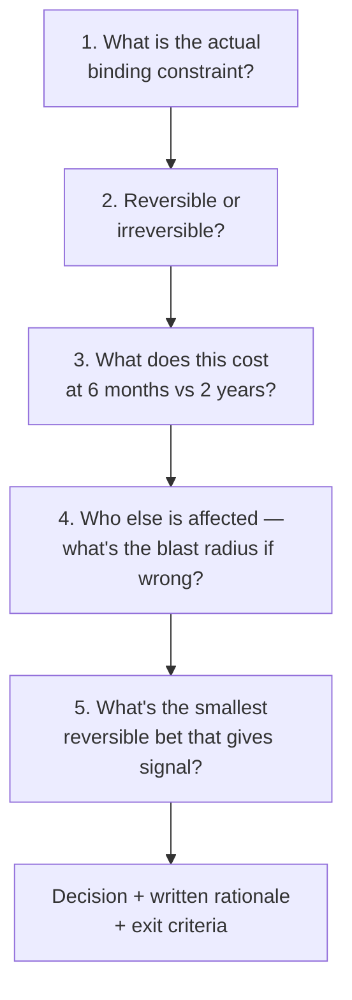
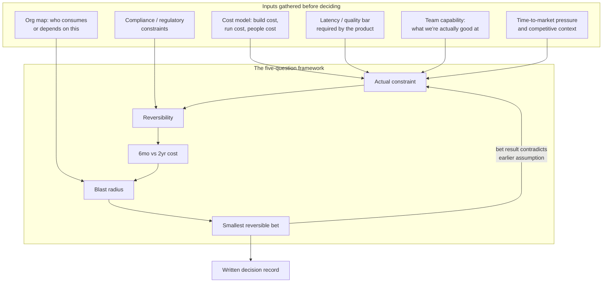
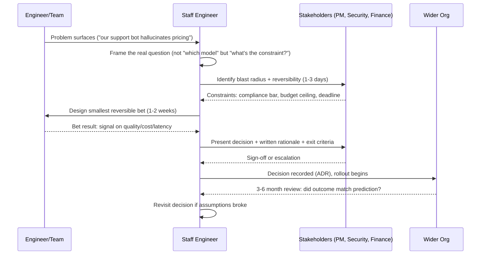
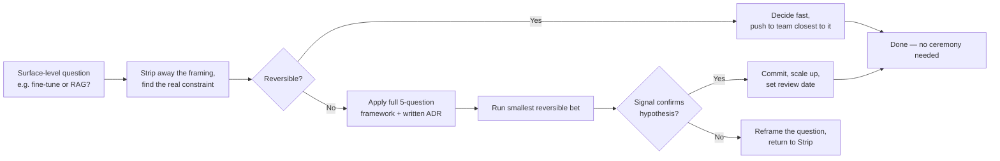
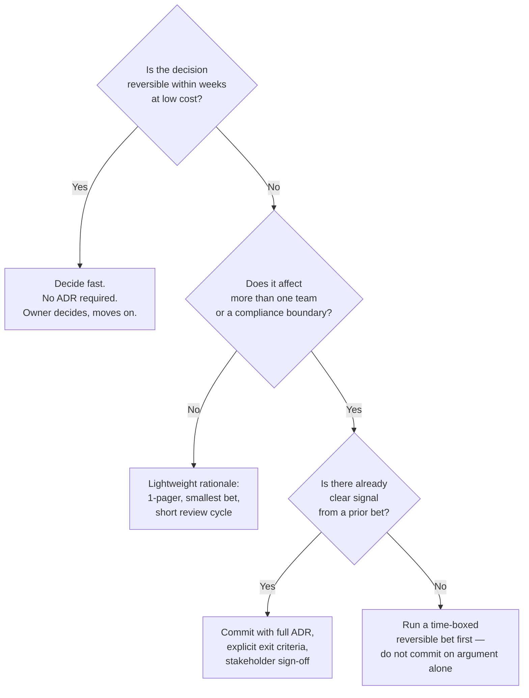

# How Staff Engineers Think

## Overview

Every other chapter in this section — build vs. buy, fine-tuning vs. RAG, single-agent vs. multi-agent, cost/latency/reliability engineering — is a specific instance of the same underlying question: given real constraints and an uncertain future, what is the smallest commitment that gives us the most signal? This chapter is not about a technology choice. It is about the reasoning process Staff engineers run before any of those technology choices get made, and the habits of mind that make that reasoning repeatable instead of ad hoc.

## Definition

At Staff level, the job changes from "can I build this" to "should we build this, what does it cost the organization over the next two years, and what does building it foreclose." A Staff engineer is evaluated less on the code they personally ship and more on the quality of the decisions they make or shape, and on the leverage of their influence — how many teams, roadmaps, or dollars move correctly because of a judgment call they made. The deliverable of a Staff-level engagement is frequently not a system; it is a decision, written down, with its reasoning and its exit criteria attached.

## Problem Statement

Without this discipline, organizations make AI architecture decisions the way most engineers make code-level decisions: locally, quickly, and optimistically. A team picks fine-tuning because it's the first thing that worked in a notebook. A team builds an in-house vector database because a senior engineer enjoys infrastructure work. A team adopts a multi-agent framework because a conference talk made it look inevitable. Each decision is individually defensible and collectively expensive: six months later the organization is locked into a fine-tuning pipeline costing $40,000 a quarter to keep current, a vector database team of three nobody budgeted for, or an agent framework whose debugging cost has quietly eaten the velocity gains it promised. None of these failures show up as a bug. They show up as a slow, compounding tax nobody can point to a single commit to explain — because the failure was in the decision, not the implementation.

## Why This Way of Thinking Exists

Senior engineers are trained, correctly, to optimize the system in front of them: make it correct, fast, maintainable. That training doesn't generalize automatically to *which system should exist at all*. As AI systems became cheap to prototype — a working RAG demo or a fine-tuned model takes a strong engineer a week — the bottleneck moved from "can we build it" to "we built five things and don't know which one to commit to, and committing to the wrong one is expensive in ways that don't show up until the second year." Staff-level judgment exists because someone has to be accountable for that second-year cost, not just the first sprint's velocity, and because the number of plausible-sounding architecture choices is now large enough that picking among them by enthusiasm or recency is actively dangerous.

## Core Concepts

- **Constraint** — the actual binding limit on a decision (cost, latency, quality bar, team capability, time-to-market, regulatory requirement). Most bad decisions trace back to optimizing the wrong constraint, not bad execution against the right one.
- **Reversibility** — whether a decision can be cheaply undone. Jeff Bezos's "one-way vs. two-way door" framing applies directly: a two-way door decision should be made fast by whoever is closest to it; a one-way door deserves Staff-level scrutiny regardless of how small it looks today.
- **Time horizon** — the gap between what a decision costs *today* (prototype effort, initial dollars) and what it costs at 6 months and 2 years (maintenance, retraining, headcount, opportunity cost).
- **Blast radius** — who else is affected if the decision is wrong: one team, one product line, every downstream consumer of a shared platform, or the company's compliance posture.
- **Smallest reversible bet** — the minimum-cost experiment that produces real signal about whether a larger, harder-to-reverse commitment is worth making.
- **Decision debt** — the AI-era analog of technical debt: a decision made under time pressure with a known gap in its reasoning, revisited later at a higher cost than if done right the first time.
- **Leverage** — the multiplier a Staff engineer applies to their time by influencing a decision many teams will inherit, versus doing equivalent individual implementation work.

## Architecture

The decision framework itself has a structure, the same way a software system does. At the highest level, every Staff-level architecture decision routes through five questions, applied in order, regardless of whether the surface question is "build vs. buy," "fine-tune vs. RAG," or "one agent vs. many."

The detailed view shows what feeds each of those five questions — the actual inputs a Staff engineer gathers before answering them, and the fact that the process is not strictly linear: new information from a cheap bet can send you back to re-answer an earlier question.

## Components

Each of the five questions is a distinct analytical step with its own failure mode if skipped.

**The actual constraint.** Teams default to optimizing the constraint that's easiest to measure (latency, demo quality) rather than the one that actually gates the decision (often team capability or compliance). Naming the real constraint out loud is the first job — the rest of the framework is wasted effort against the wrong variable.

**Reversibility.** Switching embedding models is reversible (re-index, hours to days); a proprietary agent orchestration framework three product teams build against is not (a multi-quarter migration once adopted). Classify *before* committing, not after six teams already depend on the thing.

**Time horizon.** The component most often skipped under deadline pressure. A fine-tuned model that looks free because "we already have the GPUs" has a real 2-year cost: every policy change now needs a retrain-evaluate-redeploy cycle instead of a config change, and that cost compounds with every shift in behavior.

**Blast radius.** A decision scoped to one team's internal tool has a blast radius of one team. The same decision made a platform default that other teams inherit without realizing they had a choice has a blast radius of the whole org. Map who inherits a decision before making it — rigor should scale with blast radius, not with how interesting the problem is.

**Smallest reversible bet.** The component that converts analysis into action. Rather than debating fine-tuning vs. RAG for a month, ship a RAG prototype against 50 real support tickets in a week and measure it — one bet often resolves what pure argument cannot.

## Lifecycle of a Staff-Level Architecture Decision

A decision is not a meeting; it is a process with a start (a problem surfaces) and an end (a written, revisitable record), and the cost of skipping steps compounds the further along you are.

Two details matter operationally. First, the "smallest reversible bet" step is time-boxed — typically one to three weeks, not an open-ended research project, since the point is to buy signal cheaply, not re-create the full build as a "prototype." Second, the loop doesn't end at sign-off: a 3-6 month review against the original rationale is the only mechanism that catches a decision that looked right and turned out wrong.

## Design Patterns

The same recurring decision pattern shows up under every surface-level question in this section. Recognizing it is what lets a Staff engineer answer "fine-tune or RAG," "single agent or multi-agent," and "build or buy" with the same muscle instead of starting from zero each time.

The pattern generalizes because every one of this section's chapters is the same shape with different vocabulary substituted in: in [Build vs. Buy](02-build-vs-buy.md), the "bet" is a time-boxed vendor pilot instead of a custom-build sprint; in [Fine-Tuning vs. RAG](04-fine-tuning-vs-rag.md), the bet is a RAG prototype against real queries before committing to a training pipeline; in [Single-Agent vs. Multi-Agent](05-single-agent-vs-multi-agent.md), the bet is shipping the single-agent version first and measuring exactly where it breaks before adding orchestration complexity.

### Worked Example: "Should We Fine-Tune Our Support Bot, or Invest in Better RAG?"

A mid-size SaaS company's support bot gives wrong answers on pricing and plan-limit questions about 12% of the time. The team's first instinct is to fine-tune on 5,000 historical tickets — it feels like the directly-targeted fix. Running the framework instead:

1. **Actual constraint.** Support leads reveal the failures aren't about tone or format (fine-tuning's strength) — the model doesn't know this week's pricing tiers, which change monthly. The real constraint is fact freshness, not behavior shaping.
2. **Reversibility.** Fine-tuning commits the team to a retrain-evaluate-redeploy cycle every time pricing changes (roughly monthly) — nearly a one-way door once support flows depend on its latency/cost profile. RAG is a re-index, reversible in hours.
3. **6-month vs. 2-year cost.** A fine-tune pipeline needs a recurring training job and a re-validated eval set every cycle — roughly 0.5 engineer-quarters/year ongoing. RAG's recurring cost is mostly inference tokens, estimated at $1,800/month at current ticket volume.
4. **Blast radius.** Only the support bot consumes this today, but sales-enablement has asked about reusing "whatever knowledge layer support builds" — a likely two-team blast radius within a year, favoring the more extensible option now.
5. **Smallest reversible bet.** Ship a RAG prototype over current pricing docs against the 50 worst-performing real tickets from last month. One engineer, one week.

The bet resolves it: RAG drops the failure rate on those 50 tickets from 12% to 3%, confirming the constraint was fact gaps, not tone. The team ships RAG, skips the fine-tuning pipeline, and writes a decision record with a 3-month review date. (Compare against [Fine-Tuning vs. RAG](04-fine-tuning-vs-rag.md) for the general case.)

## Tradeoffs

The central tension in this kind of thinking is speed versus rigor — and the decision tree below is how a Staff engineer resolves it without defaulting to "always be rigorous," which is itself a mistake (it burns goodwill and calendar time on decisions that didn't need it).

| Advantages of applying the framework | Disadvantages / costs of applying it |
|---|---|
| Catches expensive, hard-to-reverse mistakes before they're load-bearing | Adds latency to decisions that genuinely don't need it |
| Produces a written rationale that survives the original team leaving | Can be weaponized as bureaucratic stalling if applied indiscriminately |
| Converts debate-by-opinion into debate-by-evidence | Requires real authority to enforce — a framework with no teeth is theater |
| Makes blast radius visible before other teams build on top of it | Risk of analysis paralysis if "smallest bet" scope creeps into a full build |
| Scales judgment across teams a Staff engineer can't personally review | Time-boxing the bet well takes its own judgment — easy to mis-scope |

## Scalability

How this thinking scales is itself a design problem. A single Staff engineer applying this framework to every decision they touch works at the scale of one team, then breaks down — not because the reasoning stops being correct, but because the reviewer becomes the bottleneck.

- **At team scale (1-2 teams)**: the Staff engineer applies the framework directly to most decisions crossing their desk — in practice, a handful of genuinely irreversible calls per week.
- **At org scale (5-20 teams)**: direct review doesn't scale. The lever shifts from "decide every case" to writing the framework down as a reusable rubric (an ADR template, a build-vs-buy checklist) so other engineers apply the same reasoning without a bottleneck reviewer — the same shift as a linter replacing a human gating every PR.
- **At platform scale (dozens of teams)**: the highest-leverage move is setting defaults rather than deciding case by case. If the platform's default RAG stack is good enough for 80% of use cases, most teams never need to run the fine-tune-vs-RAG decision themselves — it was already applied once, upstream (see [AI Governance & Platform Strategy](10-ai-governance-and-platform-strategy.md)).
- **The bottleneck that doesn't move**: irreversible, large-blast-radius decisions (a model vendor commitment, a data residency architecture) still require direct Staff or Principal reasoning regardless of org size — these can't be delegated to a rubric, because the rubric itself is what's being decided.

## Reliability — Avoiding Reasoning Failure Modes

"Decision-quality reliability" means catching the predictable ways this kind of judgment fails, the same way a systems chapter catches predictable failure modes in a service.

| Reasoning failure mode | What it looks like | Mitigation |
|---|---|---|
| **Recency bias** | Picking the architecture from the latest conference talk, not the one fitting your constraints | Force the "actual constraint" question first |
| **Sunk cost anchoring** | Continuing a fine-tuning pipeline because $200K was spent, even after RAG prototypes show it's wrong | Ask "would we choose this starting from zero today?" |
| **False reversibility** | Calling a decision a "two-way door" because the code deletes easily, ignoring that other teams built on it | Classify reversibility by blast radius, not undo-cost |
| **Local optimization** | A team builds what's best for its service, duplicating a capability the platform already owns | Map who else solves an adjacent problem first |
| **No exit criteria** | Committing to a multi-agent system with no predefined "this isn't working, revert" signal | Every commitment gets a written review date and exit condition |
| **Analysis paralysis** | Running the full framework on a decision that's genuinely a two-way door | Apply the decision tree's first branch honestly |

The single highest-value habit here is the **written decision record** (an ADR-style 1-pager: constraint, alternatives considered, reversibility classification, bet result, decision, review date). It is cheap to produce and is the only thing that lets the org check, six months later, whether the reasoning held up — which is the actual feedback loop that makes Staff-level judgment improve over time instead of being unfalsifiable.

## Security

Compliance and security constraints frequently *are* the actual binding constraint identified in step one of the framework, not an afterthought layered on at the end. A build-vs-buy decision for a vector database changes completely if the data is subject to residency requirements that rule out a SaaS vendor outright — at that point it isn't build-vs-buy on technical merit, it's build-because-buy-is-disqualified. A Staff engineer treats compliance/security requirements as a constraint-discovery input gathered *before* the framework runs, not a review gate applied after a preferred solution is already chosen — discovering a disqualifying constraint after six weeks of build is a process failure, not a security team failure.

The blast-radius question doubles as a security question: a platform-level default (an internal LLM gateway, a shared retrieval service) that many teams build on inherits a review obligation proportional to how many downstream systems trust it, which is why those decisions route through the heavier branch of the [Tradeoffs](#tradeoffs) decision tree rather than getting decided by the first team that needed it.

## Cost Optimization

The framework's cost discipline is itself a cost-optimization lever, separate from any specific technical cost lever covered in [Cost Engineering](07-cost-engineering.md):

- **The 6-month-vs-2-year framing catches recurring costs a first-quarter budget hides.** A fine-tuning approach that looks cheaper than RAG in month one frequently costs more by month eighteen once retraining cadence and evaluation overhead are counted — an organization that only budgets the first quarter routinely picks the more expensive option without realizing it.
- **The smallest-reversible-bet discipline avoids the most common AI cost overrun**: a multi-month, multi-engineer build that turns out, after the fact, not to have been the right architecture. A $15K, two-week prototype that prevents a $400K, two-quarter misbuild is the highest-leverage cost optimization available, and it's a process lever, not a technical one.
- **Naming the real constraint prevents paying for the wrong axis.** Teams that conflate "we need lower latency" with "we need a bigger model" often spend on GPU upgrades when the actual fix was a smaller model plus caching.
- **Blast-radius mapping avoids duplicated spend.** Three teams independently building near-identical RAG pipelines because nobody mapped who else had the same problem is a recurring, avoidable cost at any company past a few hundred engineers.

## Monitoring — Knowing If a Decision Was Good, In Retrospect

A decision needs the same kind of after-the-fact instrumentation a production system gets, and for the same reason: intuition about whether something "worked" is unreliable without a stated baseline to check against.

- **Did the outcome match the stated prediction at the review date?** This requires the decision record to have made a falsifiable prediction (e.g., "RAG will get us to 85% answer accuracy within $2K/month in inference cost") rather than a vague goal — vague goals can't be scored as right or wrong later.
- **What did the decision actually cost, versus the 6-month and 2-year estimate made at commit time?** A persistent gap across many decisions signals the estimation process itself is biased, not just that one decision went over.
- **How many downstream teams inherited this decision, and was that blast radius correctly anticipated?** Under-anticipated blast radius is itself a leading indicator that the next similar decision needs a heavier process tier.
- **Was the exit criterion ever actually exercised?** A decision record with an exit clause that's never invoked even when warranted suggests organizational reluctance to reverse course.
- **Track decision reversal rate as an org-level metric**, the way an SRE org tracks incident rate — a healthy organization reverses some fraction of its bets, and a reversal rate of zero is itself a warning sign that bets aren't being placed small enough to ever need reversing.

## Production Best Practices

- Write the decision down before building anything — a one-page ADR with constraint, alternatives, reversibility, and exit criteria — because writing forces the reasoning to be explicit instead of implicit.
- Default to the smallest *reversible* bet, not the smallest *demo*: a demo that skips the hard part (real data, real latency, real failure cases) produces false confidence, worse than no signal.
- Classify reversibility by blast radius, not code deletion cost — the moment two other teams depend on something, its effective reversibility has changed even though the code hasn't.
- Set the review date when the decision is made, not when someone notices it's not working — an unscheduled review never happens.
- Route decisions through the heavy process only when both irreversibility and blast radius are present; full rigor on every decision trains the org to avoid asking for review at all.
- Apply the framework to your own decisions before imposing it as policy on others — a Staff engineer who can't do this has no standing to require it of a team.

## Real World Examples

The following are illustrative reasoning patterns consistent with each company's known public product surface and engineering culture — not confirmed internal decisions.

- **Google**: a plausible Staff-level question inside a Gemini-powered Search or Workspace feature team is whether to serve a smaller, distilled model at the edge versus routing to a larger model server-side. The actual constraint is likely latency and serving cost at Google's request volume, not raw quality, given how thin the quality gap is at that scale and how directly serving cost compounds across billions of queries.
- **OpenAI / Anthropic**: a recurring build-vs-buy question for either lab's API platform team is whether to build first-party agent orchestration primitives (memory, tool routing, planning) into the core API versus leaving that layer to the ecosystem of frameworks built on top. Reversibility dominates: a first-party primitive that thousands of integrations come to depend on is close to a one-way door once shipped.
- **Meta**: a plausible tradeoff inside a team integrating Llama-family models into a consumer product is open-weight self-hosted serving versus a hosted API, where the actual constraint is frequently data residency and the ability to fine-tune on sensitive interaction data without it leaving Meta's infrastructure — not cost or quality.
- **Glean**: a representative decision, given Glean's connector-heavy enterprise search surface, is one shared retrieval/ranking pipeline across all connector types versus per-connector pipelines. Blast radius dominates: a shared pipeline serves every customer but a regression hits all of them at once, while per-connector pipelines isolate blast radius at the cost of duplicated maintenance.
- **Cursor**: a representative build-vs-buy question for an AI coding tool is a proprietary code-retrieval index versus relying on existing language-server/IDE tooling for symbol resolution. The likely deciding constraint is latency (sub-second feedback expectations) combined with code retrieval's exact-match requirements, which generic vector search handles poorly — plausibly tipping the build toward purpose-built despite the cost.

## Interview Questions

### Beginner

**Q: What's the difference between how a Senior engineer and a Staff engineer approach a technical decision?**
A Senior engineer is handed a problem and optimizes the system that solves it. A Staff engineer questions whether that's the right problem at all, weighs the decision's cost over a longer time horizon and across more of the organization, and is expected to be right about which problems are worth solving, not just solve the one given to them.

**Q: Why would a Staff engineer recommend *not* building something the team is capable of building?**
Capability is necessary but not sufficient. The real question is whether building it is the best use of the team's time given the 2-year cost (maintenance, retraining, on-call burden) versus buying or reusing a solution, and whether that capability is better spent elsewhere. "We could build this" and "we should build this" are different claims, and conflating them is a common mistake.

### Intermediate

**Q: Describe a framework you'd use to decide between fine-tuning a model and improving RAG for a support bot.**
Name the actual constraint: does the model lack facts (RAG's strength) or respond in the wrong tone/format (fine-tuning's strength)? Check reversibility: a RAG change is a re-index, hours; a fine-tune needs a retrain-evaluate-redeploy cycle every time the underlying policy changes. Project the 2-year cost: RAG's marginal cost is mostly inference tokens; fine-tuning's includes a recurring training pipeline and eval harness. Then run the smallest reversible bet — a one-week RAG prototype against real tickets — before committing either way. (See the worked example above and [Fine-Tuning vs. RAG](04-fine-tuning-vs-rag.md).)

**Q: How do you avoid analysis paralysis when applying a heavyweight decision framework?**
Apply the reversibility-and-blast-radius gate honestly first. If a decision is cheap to undo and affects only your own team, decide it in an afternoon, no ADR. Reserve the full process for decisions that are genuinely hard to reverse or that other teams will build on — applying maximum rigor indiscriminately is its own failure mode, since it teaches the org that review always means weeks of delay.

### Senior

**Q: Tell me about a time you recommended against a popular or trendy technical approach. How did you make the case?**
A strong answer names a concrete situation (e.g., pressure to adopt a multi-agent framework from industry hype), identifies the constraint the trendy approach didn't address (often: the single-agent version was never tried, so there was no evidence the added complexity was needed), and describes running a cheap, reversible bet — shipping the simpler version and measuring where it broke — rather than winning the argument rhetorically.

**Q: How do you make an irreversible decision when you don't have complete information?**
You don't wait for complete information — you shrink the bet until partial information is enough to act on safely. Identify what specifically is uncertain, design the smallest experiment that resolves that uncertainty, set a review date, and commit with an explicit acknowledgment that it may be revisited. The discipline is in making the bet small, not in achieving certainty first.

### Staff

**Q: Walk me through a decision where you had to weigh organizational cost against technical merit. What did you choose, and why?**
A strong answer (structured, not necessarily this exact scenario): "A team wanted to build an in-house vector database — technically justified, faster and cheaper at our query volume than a managed service. Running the framework: the actual constraint wasn't query performance, it was that nobody would own a stateful, scaling-sensitive piece of infra long-term once the proposing team rotated off within the year. Reversibility was the deciding factor — three other teams would start depending on it within two quarters, before we could evaluate whether the build was worth it. I proposed a smaller bet instead: run the managed service for two quarters, instrument real cost and latency at our actual volume, and revisit with numbers instead of a benchmark. It came in within 15% of the projected in-house cost, so we never built the in-house version. The technical merit of the build was real; the organizational cost of committing before we had a long-term owner was the deciding constraint."

**Q: How do you know, in retrospect, whether a Staff-level architecture decision you made was actually good?**
By checking it against a falsifiable prediction made at decision time, not gut feeling after the fact. The decision record should have stated a measurable expectation (cost, latency, quality, adoption target) and a review date. At review, compare actual outcome to that expectation, account for what was knowable versus unknowable at the time, and check whether the exit criteria would have fired had the bet gone the other way. Good Staff-level judgment is measured by calibration across many decisions, not by any single outcome.

## Google-Level Follow-Ups

- "You ran the smallest reversible bet, it gave a positive signal, you committed — eighteen months later the bet's conditions don't generalize to production scale. Whose mistake was that?" — probes whether the candidate understands a reversible bet reduces risk but doesn't eliminate it, and would fix the *bet design* rather than abandon the framework.
- "Two teams ran this same framework on the same problem and reached opposite conclusions. How do you reconcile that?" — probes whether the candidate sees this usually means the teams identified different actual constraints (cost vs. time-to-market), and that reconciliation means surfacing the mismatch, not re-running the framework harder.
- "How do you prevent this framework from becoming a way for risk-averse engineers to block decisions they simply don't like?" — probes for time-boxing the bet, requiring a falsifiable prediction up front, and an escalation path that doesn't route every disagreement through endless re-analysis.
- "At what organizational size does writing every decision down become its own bottleneck?" — probes whether the candidate sees the shift to encoded defaults/platform rubrics (see Scalability) rather than assuming the process scales by adding reviewers.

## Common Mistakes

- **Treating every decision as irreversible.** Running the full framework on a two-way-door decision wastes calendar time and trains the org to avoid asking for review.
- **Treating every decision as reversible.** The inverse — assuming a platform default can always be changed later, ignoring that three teams built on top of it and migration is now a multi-quarter project.
- **Confusing "we could build this" with "we should build this."** Capability isn't the deciding question; cost over time and opportunity cost are.
- **Skipping the written decision record.** Nobody can check six months later whether the reasoning held up, and the same debate re-litigates from scratch each time someone new joins.
- **Letting the "smallest reversible bet" scope-creep into a full build.** A bet that takes three months and ten engineers wasn't small, and momentum then forces commitment regardless of the result.
- **Optimizing the easiest-to-measure constraint instead of the real one.** Chasing latency when the actual gate was team capability or compliance produces an excellent answer to the wrong question.
- **No review date.** A decision with no scheduled re-check never gets revisited even when its assumptions visibly break.

## Key Takeaways

- Staff-level judgment is about deciding which system should get built, and at what organizational cost, not just building the system well once a decision is made.
- The same five questions — actual constraint, reversibility, 6-month/2-year cost, blast radius, smallest reversible bet — apply underneath every surface-level architecture question in this section.
- Reversibility should be classified by blast radius (who else depends on it), not by how easy the code is to delete.
- The smallest reversible bet is the highest-leverage move available: it converts an opinion-based debate into an evidence-based one before the cost of being wrong gets large.
- A decision without a written rationale and a review date cannot be checked for quality later, which means the organization never gets better at making this kind of decision.
- Applying maximum process rigor to every decision is itself a failure mode; the discipline is knowing which decisions warrant it.
- This way of thinking scales by being encoded into reusable rubrics and platform defaults, not by one person reviewing every decision as the org grows.
- The chapters that follow — [Build vs. Buy](02-build-vs-buy.md), [Fine-Tuning vs. RAG](04-fine-tuning-vs-rag.md), [Single-Agent vs. Multi-Agent](05-single-agent-vs-multi-agent.md), [Cost Engineering](07-cost-engineering.md), [Latency Engineering](08-latency-engineering.md), [Reliability Engineering](09-reliability-engineering.md), and [AI Governance & Platform Strategy](10-ai-governance-and-platform-strategy.md) — are this framework applied to specific, recurring AI architecture questions.
