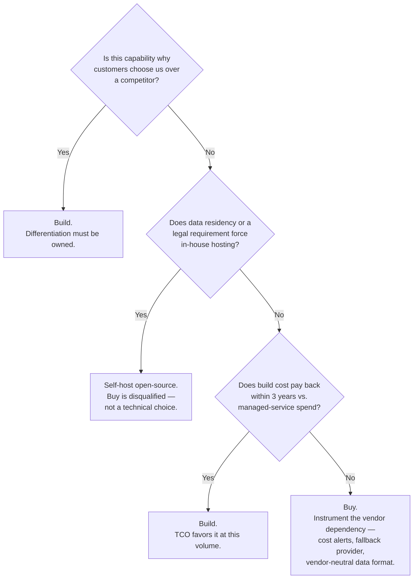

# Build vs Buy

## Overview

Every AI stack has a model layer, a retrieval layer, an orchestration layer, and an evaluation layer, and for every one of those layers a team will eventually ask "should we build this ourselves or buy it?" The question feels like it should be answered on technical merit — which option performs better, which is faster to integrate, which the team is more excited about. It shouldn't be. The question that actually matters is: what do we need to own to differentiate, and what should we treat as commodity? A team that builds the wrong things buries itself in maintenance it never budgeted for. A team that buys the thing that was supposed to be its competitive advantage hands that same advantage to every competitor with a credit card. This chapter applies the five-question framework from [How Staff Engineers Think](01-how-staff-engineers-think.md) to the specific, recurring decision of which layers of the AI stack to own versus commoditize.

## Definition

Build vs. buy, in the AI-stack context, is the decision of whether a given capability — pretraining, retrieval, orchestration, evaluation, fine-tuning, vector search — should be developed and operated in-house or acquired as a managed service, open-source component, or vendor API. It is not a single decision made once for the whole stack; it is a per-layer decision, and the right answer for one layer (buy the vector database) is frequently the wrong answer for the adjacent layer in the same system (build the ranking logic on top of it). Treating it as one company-wide policy — "we build" or "we buy" — is itself a category error that this chapter argues against throughout.

## The Real Question

The question is not "which option is technically better?" Technical superiority is necessary but not sufficient, and it's the wrong first filter because it's answerable in isolation from the thing that actually decides the outcome: whether the capability is why customers choose you. A vector database that your team builds better than Pinecone is still a bad use of two engineers' time if customers were never going to notice or care — the differentiation dollars were spent on the wrong layer. Conversely, a retrieval-and-ranking pipeline that's merely adequate, when ranking quality is the entire reason a customer picks your product over a competitor's, is a bad place to have settled for "buy and move on." The real question, restated: **what do we need to own to differentiate, and what should be treated as commodity?** Everything else in this chapter — the TCO math, the decision tree, the worked example — is in service of answering that one question concretely, layer by layer, instead of by company-wide instinct.

## Core Concepts

- **Commodity layer** — a capability where the market has already converged on mature, interchangeable solutions, and where owning it in-house produces no customer-visible advantage over buying it. Competing on a commodity layer is competing on a dimension customers can't perceive.
- **Differentiating layer** — a capability that is directly why customers choose this product over a competitor's. The test is counterfactual: if this layer were mediocre, would customers leave? If yes, it's differentiating and worth owning.
- **Total cost of ownership (TCO)** — the full cost of a build decision, not just the engineering time to ship v1: it includes ongoing maintenance, the opportunity cost of the engineers who built it not working on something else, and the operational burden of running it in production indefinitely.
- **Vendor risk premium** — the cost of depending on a third party for a capability: pricing volatility, deprecation risk, outage exposure, and the negotiating leverage lost once a system is built against a vendor's specific API surface.
- **Switching cost** — what it costs to leave a vendor once adopted: data migration, re-integration engineering, and the risk window during cutover. A buy decision that ignores switching cost is only pricing the relationship's honeymoon period.
- **Data residency forcing function** — a legal or contractual requirement that data cannot leave the organization's infrastructure, which overrides the differentiation question entirely and forces self-hosting regardless of whether the layer would otherwise be a clean "buy."
- **Crossover point** — the usage volume or spend level at which TCO(build) becomes cheaper than TCO(buy), the single number that turns a build-vs-buy debate from an opinion contest into arithmetic.

## Layers Where Buying Is Almost Always Right

These are the layers where the market has already solved the problem at a level of investment no single application team can rationally match, and where owning the layer produces no customer-visible differentiation even if it were done perfectly.

**Foundation model pretraining.** This requires $10M–$100M+ in compute and a world-class research organization to do competently. No application team — not even a large, well-funded one — should be attempting this; the capital and talent bar is a different category of investment than building a product on top of a model. The live question for this layer isn't build vs. buy at all — nobody is building a foundation model as a side project — it's API vs. open-weight, which is a different tradeoff covered in [Open-Source vs. Closed Models](03-open-source-vs-closed-models.md).

**Vector database.** Managing HNSW graph indexes, IVF-PQ quantization, shard rebalancing under write load, and GPU-accelerated approximate nearest-neighbor search is a full-time infrastructure specialization, not a side effect of building a RAG feature. Pinecone, Weaviate Cloud, and Qdrant Cloud have years of engineering invested in exactly this problem and have already amortized that cost across thousands of customers — a single team re-deriving it captures none of that leverage. There are two legitimate exceptions, and they're narrow: corpora under roughly 5 million vectors, where `pgvector` on an existing Postgres instance is perfectly adequate and adds no new operational surface; and strict data residency requirements that rule out SaaS vector stores outright, which is the data-residency forcing function from Core Concepts overriding the default.

**Agent orchestration frameworks.** Buying a framework for prototyping speed is correct — frameworks like LangChain or LlamaIndex compress weeks of scaffolding into days. The mistake is letting that same framework own the production agent loop. The reason is observability, not taste: when something goes wrong in production, three abstraction layers sitting between your code and the actual model call mean the failure is invisible at exactly the moment you need to see it. The right production pattern is a thin internal wrapper around direct model calls — one that adds retry logic, cost tagging, and tracing — not an opinionated framework that owns the control flow. Prototype with the framework; ship the production path with a wrapper you can step through line by line.

**Evaluation UI.** Buy the dashboard and collaboration layer — Braintrust, Arize Phoenix, and LangSmith all do this well, and rebuilding a comparison UI, a labeling workflow, and a regression-tracking dashboard is pure sunk cost with no differentiation upside. What you own instead is the evaluation criteria, the golden set contents, and the quality rubric — because those are inherently product-specific and no vendor can write them for you. Buying the UI and owning the judgment is the correct split; buying the judgment (accepting a vendor's default rubric wholesale) is not.

## Layers Where Building Is a Genuine Differentiator

These are the layers where the counterfactual test from The Real Question comes back "yes" — if this layer were mediocre, customers would leave — and where a generic vendor solution structurally cannot match a purpose-built one.

**The retrieval and ranking pipeline, when it is the core product.** Glean's connector-based retrieval across dozens of enterprise data sources isn't a commodity component bolted onto a chat interface — it is the product. A generic vector-search wrapper would produce a worse enterprise search experience than Glean's purpose-built ranking, and customers would notice immediately because relevance quality is the entire value proposition. When retrieval quality *is* the product, buying a generic retrieval layer means buying away your own differentiation.

**Code retrieval indexing, when retrieval quality is the competitive edge.** Cursor builds a purpose-built code index rather than relying on generic vector search, because code retrieval has exact-match requirements — symbol resolution, exact identifier lookup, structural understanding of imports and call graphs — that semantic embedding search handles poorly by construction. A generic semantic vector store optimizes for "similar meaning," but code retrieval frequently needs "this exact symbol, this exact definition," which is a different problem with a different data structure. Building here is not empire-building; it's recognizing that the commodity tool solves an adjacent but different problem.

**The fine-tuning pipeline, but only under two specific conditions.** Build a custom fine-tuning pipeline when training data legally cannot leave the organization's infrastructure, or when a genuinely custom training loop is needed (non-standard objective, unusual data modality, research-grade experimentation). Outside of those two conditions, for standard LoRA fine-tuning, managed services — Modal, or a vendor's hosted fine-tuning API — are cheaper once the maintenance overhead is accounted for, which the worked example below quantifies. The trap is defaulting to "we're fine-tuning, so of course we own the pipeline" without checking whether either condition actually applies.

## Decision Framework

The five-question framework from [How Staff Engineers Think](01-how-staff-engineers-think.md) — actual constraint, reversibility, 6-month/2-year cost, blast radius, smallest reversible bet — applies here with build-vs-buy-specific substitutions. The actual constraint is almost always differentiation or data residency, not raw technical capability. Reversibility is asymmetric: buying and later building is comparatively cheap (you've lost only the vendor spend and a migration project), but building and later admitting the vendor would have been fine is expensive (sunk engineering cost, plus the team is now attached to what it built). The 6-month/2-year cost is exactly the TCO comparison worked out below. Blast radius is which teams would inherit this build if it becomes a platform default versus which teams are exposed to a single vendor's pricing and reliability. And the smallest reversible bet, for this specific decision, is a time-boxed vendor pilot rather than a custom-build sprint — run the vendor for one quarter at real volume before writing a line of infrastructure code to replace it.

Collapsed into a single ordered decision tree, the layer-by-layer question resolves like this:



Two things about this tree matter more than the boxes themselves. First, the "buy" leaf is not "buy and forget" — it explicitly requires instrumenting the vendor dependency: cost alerts so a pricing change is caught immediately rather than discovered on an invoice, a fallback provider so a single vendor outage doesn't take down the product, and a data format that isn't vendor-specific so a future migration doesn't start from zero. Second, the differentiation question is asked first and dominates the tree — a capability that's genuinely differentiating gets built even if the TCO math would otherwise favor buying, because the cost of ceding differentiation to a competitor isn't captured in a spend comparison at all.

## Worked Example: "Should We Build Our Own Fine-Tuning Pipeline?"

A team running LoRA fine-tuning for a mid-size product wants to build an in-house training pipeline instead of using Modal at $3/GPU-hour. Running the five-question framework:

1. **Actual constraint.** The team's stated reason is "more control," but under questioning the real driver is that a senior engineer wants to own infrastructure work, not a customer-facing requirement. Neither data residency nor a custom training loop applies — standard LoRA fine-tuning on public-ish data, no legal blocker. This is squarely a TCO question, not a differentiation or compliance one.
2. **Reversibility.** Building the pipeline is close to irreversible in practice — once the training infra exists and an engineer's calendar is built around maintaining it, switching back to a managed service means admitting the build was unnecessary, which teams are reluctant to do even when the numbers say so. Staying on Modal and building later, if volume justifies it, is the reversible ordering.
3. **6-month vs. 2-year cost — the TCO math.** Build cost: roughly 6 engineer-weeks at ~$5,000/week = **$30,000** upfront. Ongoing maintenance: **$6,000/year** (roughly 20% of build cost per year, the standard maintenance-tax rule of thumb). Modal cost at the team's actual volume — 10 training runs/month × 4 hours/run × $3/GPU-hour = 40 GPU-hours/month = **$120/month = $1,440/year**. The build "saves" $1,440/year in avoided Modal spend but costs $30,000 upfront and $6,000/year to maintain. It never pays for itself at this volume — the payback horizon is effectively infinite, since ongoing maintenance alone exceeds what's being saved.
4. **Blast radius.** Only this one team's training runs are affected today. No other team has expressed a need for shared training infrastructure, so building it wouldn't even amortize across multiple consumers — it would be one team's bespoke tooling, the worst-leverage version of a build.
5. **Smallest reversible bet.** Stay on Modal for two more quarters and track actual GPU-hour spend as volume grows. Revisit only if monthly spend trend suggests crossing the crossover point.

The crossover point is the number that ends the debate: build only starts to pay back within a 3-year horizon once managed-service spend exceeds roughly **$20,000/year**. At $20K/year in Modal spend, building saves $20,000 − $6,000 maintenance = $14,000/year, which pays back the $30,000 build cost in a little over two years — inside the 3-year window that makes a build decision defensible. At this team's actual $1,440/year, they are nowhere near that line, and the team ships nothing, stays on Modal, and writes a one-line decision record with a review trigger tied to spend, not to a calendar date.

## Tradeoffs

| Dimension | Build | Buy |
|---|---|---|
| **Control** | Full control over roadmap, behavior, and failure modes | Bounded by vendor's roadmap and API surface |
| **Debugging transparency** | Full visibility — you can step through your own code | Opaque past the API boundary; incidents require vendor support |
| **Cost at scale** | Marginal cost approaches infrastructure cost only, favorable at high volume | Marginal cost scales linearly with usage, can dominate at high volume |
| **Maintenance burden** | Permanent — roughly 20%/year of build cost, forever, on your team | Amortized across the vendor's entire customer base |
| **Time to value** | Weeks to months before first production use | Days, often hours |
| **Vendor pricing risk** | None — cost structure is under your control | Real — LLM API pricing has moved 5-10x in two years |
| **Switching cost** | N/A — you already own it | Real, and easy to underestimate if the vendor's data format is proprietary |

The pattern across every row is the same one from [How Staff Engineers Think](01-how-staff-engineers-think.md): build wins on control and cost-at-scale, buy wins on time-to-value and amortized maintenance, and the right call depends on which of those axes is the actual binding constraint for this specific layer — not a global preference for one column.

## Cost Implications

The sticker price on either side of a build-vs-buy decision is only part of the real cost. The full TCO equation, stated once so every layer-specific decision can be checked against it:

**TCO(build) = (engineer-weeks × cost per engineer-week) + (20% of build cost per year, ongoing maintenance) + (opportunity cost of that engineer capacity not spent on product features)**

**TCO(buy) = (usage × price) + (vendor risk premium) + (switching cost, amortized over the expected relationship length)**

```mermaid
flowchart LR
    subgraph Build["TCO(build)"]
        B1[Engineer-weeks ×\ncost per engineer-week]
        B2["Maintenance ≈ 20%\nof build cost / year"]
        B3[Opportunity cost —\nengineers not on\nproduct features]
    end
    subgraph Buy["TCO(buy)"]
        S1[Usage × vendor price]
        S2[Vendor risk premium —\npricing volatility,\noutage exposure]
        S3[Switching cost,\namortized]
    end
    B1 --> TB[TCO(build) total]
    B2 --> TB
    B3 --> TB
    S1 --> TS[TCO(buy) total]
    S2 --> TS
    S3 --> TS
    TB --> CMP{Compare over a\n3-year horizon}
    TS --> CMP
    CMP --> DEC[Lower TCO wins —\nunless the layer is\ndifferentiating, which\noverrides the comparison]
```

The opportunity-cost term is the one teams most reliably drop from the calculation, and it's frequently the largest term in practice: the 6 engineer-weeks spent building a fine-tuning pipeline in the worked example above are 6 engineer-weeks not spent on whatever feature would have moved the product forward. A build decision that "only" costs $30,000 in direct labor can easily cost more than that in foregone product velocity, and that cost never appears on an invoice, which is exactly why it's the term most often ignored under deadline pressure — the same failure mode the 6-month-vs-2-year framing in [How Staff Engineers Think](01-how-staff-engineers-think.md) exists to catch.

## Common Mistakes

- **Building a vector database for the engineering challenge, not the product need.** A capable infrastructure engineer finds HNSW tuning and shard rebalancing genuinely interesting work — that's a reason it happens, not a reason it's correct. Interest is not a proxy for differentiation.
- **Inheriting a framework's debugging model in production.** Prototyping with an agent orchestration framework is fine; shipping production traffic through the same three-layer abstraction means the first serious incident is spent reverse-engineering the framework's internals instead of your own code.
- **Computing build cost as "time to build" and ignoring the 20%/year maintenance tax.** A build that looked like a one-time $30,000 cost is actually a $30,000 cost plus a recurring $6,000/year forever — and forever is long enough that the recurring cost eventually dwarfs the upfront one.
- **Assuming vendor pricing is stable.** LLM API pricing has moved 5–10x in two years and will keep moving; a buy decision priced against today's rate card without stress-testing a pricing change is optimistic accounting, not analysis.
- **Treating build-vs-buy as one company-wide policy instead of a per-layer decision.** "We're a build-first company" or "we're a buy-first company" both skip the actual question — the answer legitimately differs between the vector database (buy) and the ranking pipeline sitting on top of it (build), in the same system, for the same team.
- **Buying without instrumenting the dependency.** A buy decision that doesn't add cost alerts, a fallback provider, and a vendor-neutral data format is a buy decision with an invisible, growing switching cost that only becomes visible during a pricing shock or an outage — exactly when there's no time to address it calmly.

## Real World Examples

- **Glean** builds its connector-based retrieval and ranking pipeline in-house because it is the product — a generic vector-search wrapper across enterprise data sources would produce visibly worse relevance, and relevance quality is the entire reason a customer picks Glean over a generic search box.
- **Cursor** builds a purpose-built code retrieval index rather than relying on generic semantic vector search, because code has exact-match requirements — symbol resolution, structural call-graph awareness — that a commodity embedding store handles poorly, and retrieval quality is a direct driver of the sub-second, "the tool understood my codebase" experience the product sells on.
- **A typical mid-size SaaS team building a support or internal-tools RAG feature** should buy nearly everything below the application layer: a managed vector store (or `pgvector` if the corpus is small), an evaluation dashboard, and a thin wrapper instead of a full orchestration framework in production — because none of those layers are why a customer chose this product, and the differentiation, if any exists, lives in the prompt and retrieval logic specific to their domain, not the infrastructure underneath it.
- **A regulated enterprise (healthcare, financial services) evaluating a vector database** frequently ends up self-hosting an open-source option (Qdrant, Weaviate, self-managed) not because the managed SaaS is technically worse, but because the data-residency forcing function from the Core Concepts list overrides the default "buy" answer entirely — the decision was never actually a technical build-vs-buy comparison once the compliance constraint was identified.
- **A team fine-tuning models on customer-support transcripts that cannot leave a VPC** for contractual reasons is in the second exception carved out under Layers Where Building Is a Genuine Differentiator — the fine-tuning pipeline gets built in-house not because building is cheaper, but because the data-residency condition disqualifies every managed alternative before cost is even compared.

## Interview Questions

### Beginner

**Q: What's the difference between a commodity layer and a differentiating layer in an AI stack?**
A commodity layer is a capability where the market has already converged on mature, interchangeable solutions and where building your own version in-house produces no advantage a customer would ever notice — a vector database is the standard example. A differentiating layer is the opposite: it's directly why a customer picks this product over a competitor's, and a generic off-the-shelf version would be visibly worse. The practical test is counterfactual — if this layer were mediocre, would customers leave? If yes, it's differentiating and worth owning; if no, it's commodity and should be bought.

**Q: Why shouldn't a small AI product team build its own vector database?**
Because managing HNSW indexes, quantization, shard rebalancing, and GPU-accelerated approximate nearest-neighbor search under production write load is a full-time infrastructure specialization that vendors like Pinecone or Qdrant Cloud have already invested years into and amortized across thousands of customers. A small team re-deriving that work captures none of that leverage, and the resulting in-house database is very unlikely to be why any customer picked the product — it's pure commodity infrastructure with real ongoing maintenance cost and no differentiation upside.

### Intermediate

**Q: Walk through the total cost of ownership comparison for building a fine-tuning pipeline versus using a managed service like Modal.**
TCO(build) is engineer-weeks to build times cost per engineer-week, plus roughly 20% of that build cost per year in ongoing maintenance, plus the opportunity cost of the engineers not spending that time on product features. TCO(buy) is usage times the vendor's price, plus a vendor risk premium for pricing volatility and outage exposure, plus amortized switching cost. In the standard worked example, building costs $30,000 upfront plus $6,000/year in maintenance, against a managed-service cost of roughly $1,440/year at typical early-stage training volume — the build never pays for itself at that volume, and only starts to make sense once managed-service spend crosses roughly $20,000/year, at which point the savings pay back the build cost within a 3-year horizon.

**Q: Your team wants to adopt an agent orchestration framework. What's the right way to bring it into the codebase?**
Use it for prototyping — frameworks compress weeks of agent-loop scaffolding into days, and that speed is real and worth taking. Do not let it own the production agent loop. The reason is observability: when a production incident happens, every abstraction layer between your code and the actual model call is a layer you have to reverse-engineer under pressure instead of debug directly. The production pattern is a thin internal wrapper around direct model calls that adds retry, cost tagging, and tracing — giving up the framework's convenience in exchange for keeping the failure surface visible and owned.

### Senior

**Q: A team argues they should build an in-house vector database because it will be faster and cheaper than a managed service at their query volume. How do you evaluate that claim?**
Start by checking whether the technical claim is even the deciding one — differentiation comes first in the decision tree, and a vector database is very rarely why a customer chooses a product, so the claim needs to clear that bar before cost is relevant at all. If it's genuinely commodity, treat "faster and cheaper" as a testable prediction rather than a justification: run the managed service at real production volume for a defined period, instrument actual query latency and monthly cost, and compare that against the build's full TCO — engineer-weeks, 20%/year maintenance, and the opportunity cost of the engineers who'd otherwise be on product work. Most of these claims are true on raw infrastructure cost and false once maintenance and opportunity cost are included, and the only way to know which is true for this team is the actual numbers, not the initial technical argument.

**Q: How would you decide whether to build a custom code-retrieval index versus using an off-the-shelf vector search library, for a developer tool product?**
Apply the counterfactual differentiation test first: if code search were mediocre, would developers churn? For a coding assistant product where sub-second, precise symbol-level retrieval is the core experience, the answer is yes — generic semantic vector search is poorly suited to code's exact-match requirements (symbol resolution, call-graph structure) that a purpose-built index handles natively. That makes this a build decision on differentiation grounds before TCO is even relevant, which is the same override the decision tree applies when data residency forces self-hosting — some constraints dominate the cost comparison rather than feeding into it.

### Staff

**Q: A team built an in-house agent orchestration layer eighteen months ago because "frameworks weren't mature enough at the time." It now costs two engineers' full attention to maintain, and mature frameworks and vendor primitives exist today. How do you approach revisiting this decision?**
I'd apply the framework as if starting from zero, explicitly separating sunk cost from the current decision — the two-engineer maintenance cost today is real regardless of why the system was built, and "would we build this if starting today" is the only fair test. I'd map blast radius first: how many teams and production paths depend on this orchestration layer now, since that determines whether migration is a two-week project or a two-quarter one — this is very likely close to a one-way door at this point given eighteen months of dependents, even though it started as a reasonable two-way-door bet. Then I'd run the TCO comparison with current numbers: two engineers' fully-loaded cost per year against what a managed alternative or off-the-shelf framework would cost at current usage, including a realistic migration cost amortized over the expected remaining lifetime of the system. If the numbers favor migrating, I would not attempt a full cutover — I'd pick the least-load-bearing consumer of the in-house layer, migrate it as the smallest reversible bet, and use the real migration cost and behavior delta from that one move to price out the rest of the migration honestly, rather than trusting an estimate made before any of it had actually been attempted.

**Q: How do you prevent build-vs-buy from becoming a single company-wide philosophy ("we're a build company" or "we're a buy company") instead of a per-layer decision?**
By making the differentiation test the first and loudest step in every instance of the decision, and by naming explicitly, in the written decision record, which layer is being decided — not "our AI stack" but "the vector database" or "the ranking pipeline," each with its own answer. The failure mode is cultural: an engineering org that prides itself on building things starts building commodity infrastructure out of identity rather than analysis, and an org that prides itself on shipping fast starts buying away capabilities that were supposed to be its moat. The fix is structural, not persuasive — require the counterfactual differentiation question and the TCO comparison to be answered in writing for each layer before a build or buy commitment is made, so the decision is anchored to that layer's actual economics rather than to whichever philosophy currently has more social capital on the team.

## Google-Level Follow-Ups

- "Your TCO math said buy, the team built anyway, and eighteen months later it turned out to be the right call because a differentiation opportunity emerged that wasn't visible at decision time. Was the original analysis wrong?" — probes whether the candidate understands TCO answers the cost question, not the differentiation question, and that a correct TCO analysis can still be overridden by a real, if unpredicted, shift in what's differentiating.
- "Two teams in the same org, facing the same buy-vs-build choice for the same layer, reach opposite conclusions and both can defend their numbers. What's actually going on?" — probes whether the candidate looks for different usage volumes, different maintenance capacity, or different differentiation contexts before assuming one team did the math wrong.
- "A vendor you depend on for a 'commodity' layer just raised prices 4x. Walk me through your response in the first 48 hours and over the next two quarters." — probes for immediate mitigation (fallback provider, negotiate, absorb short-term) versus the longer re-evaluation (does the TCO crossover point now favor building, was the dependency properly instrumented in the first place) — and whether the candidate distinguishes the two timescales.
- "How do you keep the build-vs-buy decision from being re-litigated by every new engineer who joins and has a strong opinion?" — probes for the written decision record as the actual mechanism (constraint, TCO numbers, differentiation test, review date) rather than re-arguing from scratch each time, connecting back to the decision-debt discipline from [How Staff Engineers Think](01-how-staff-engineers-think.md).

## Key Takeaways

- The central question is never "which option is technically better" — it's "what do we need to own to differentiate, and what should be treated as commodity."
- Foundation model pretraining, vector databases, agent orchestration frameworks in production, and evaluation UIs are commodity layers almost every team should buy, with narrow, well-defined exceptions.
- Retrieval-and-ranking pipelines, code retrieval indexing, and fine-tuning pipelines constrained by data residency or custom training needs are the layers where building is a genuine, defensible differentiator.
- TCO(build) includes engineer-weeks, roughly 20%/year ongoing maintenance, and opportunity cost — not just the visible upfront build cost.
- TCO(buy) includes usage-based price, a vendor risk premium, and amortized switching cost — not just the sticker price on the pricing page.
- The crossover point where build starts to pay back within three years is a real number, not a feeling — in the standard fine-tuning worked example, it's roughly $20,000/year in managed-service spend.
- This decision is per-layer, not company-wide — the same organization correctly buys its vector database and builds its ranking pipeline, and the discipline is applying the differentiation test and TCO math to each layer independently rather than defaulting to one philosophy everywhere.

---

*Part of [Staff-Level Architecture](index.md) in the [AI System Design Notes](../index.md). Tracked in [BACKLOG.md](https://github.com/GyanendraChaubey/AI-System-Design-Notes/blob/main/BACKLOG.md).*
