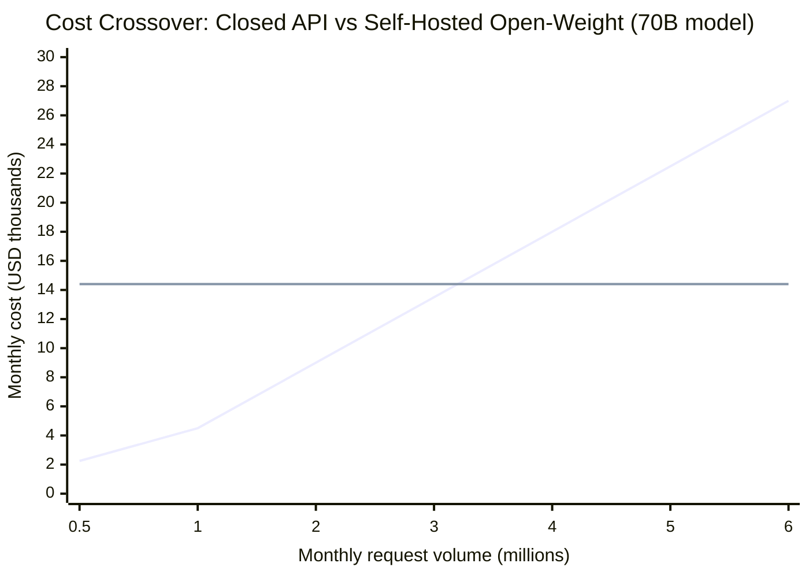
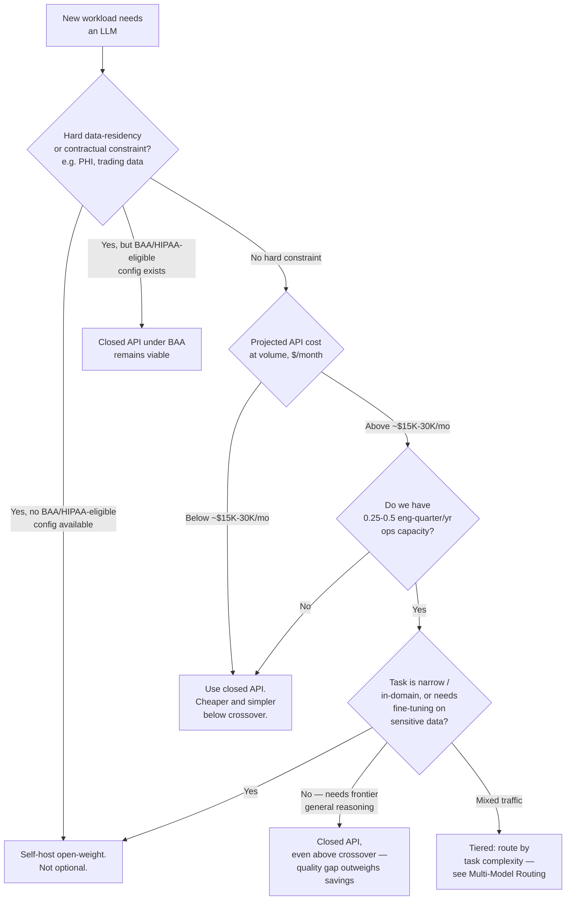

# Open Source vs Closed Models

## Overview

Every AI platform team eventually has to answer a question that sounds like a procurement decision but is actually an architecture decision: do we call a closed, hosted API (GPT-4o, Claude, Gemini) or do we download open-weight model files (Llama, Mistral, Qwen, Phi, Gemma, DeepSeek) and run them ourselves? The question gets asked once per project and re-asked every time a new frontier model or a new open-weight release changes the calculus. A Staff engineer's job is not to have a permanent opinion — "we're an open-weight shop" or "we only use frontier APIs" is exactly the kind of enthusiasm-driven, non-reversible commitment [How Staff Engineers Think](01-how-staff-engineers-think.md) warns against. The job is to run the same decision cleanly every time, across four dimensions — cost, data control, customization, and operational burden — and to recognize that for most production systems at scale, the honest answer is "both, tiered," with the reasoning for *which tier handles which traffic* being where the actual judgment lives.

## Definition

Precision on terminology matters here because the marketing language is loose. "Open source" in the AI model context almost always means **open-weight**: the trained parameter files are downloadable and can be deployed on infrastructure you control. It does not mean open training data, and it does not mean open training code — the large majority of open-weight models (Llama, Mistral, Qwen, Phi, Gemma, DeepSeek) publish weights but not the data or pipeline used to produce them, which means "open source" is doing less work than the term implies in traditional software. **Closed-API models** (GPT-4o, Claude, Gemini) sit at the other end: you submit a request over HTTPS and get a response back, but the weights never leave the vendor's infrastructure, and you have no ability to inspect, modify, or self-host them. The distinction that actually matters architecturally is not "open" versus "closed" as a philosophy — it's **weight access**: whether your organization can put the model on its own GPUs, under its own security boundary, and change what's inside it.

## The Real Question

The surface question — "which model should we use" — is the wrong question to answer first, for the same reason picking a technology before naming the constraint is the wrong order in every chapter in this section. The real question is: **which of these four forcing functions is actually binding for this workload — cost at our volume, a data-residency requirement we cannot negotiate around, a need to fine-tune on data that can't leave the building, or our organization's appetite for owning inference infrastructure — and does that forcing function point toward open-weight, closed-API, or (most often) a mix where different request types land on different tiers?** Teams that skip straight to "let's benchmark GPT-4o against Llama 3.1 70B on our eval set" are optimizing model quality before they've established which constraint the model choice is even supposed to satisfy. Quality is real, but it is rarely the binding constraint — cost, compliance, and ops capacity usually are.

## Core Concepts

- **Open-weight** — model parameters are downloadable and deployable on infrastructure you control. Distinct from open-data or open-training-code, neither of which is typically included.
- **Closed-API** — a hosted model accessed by request/response over an API; weights are never exposed to the caller.
- **Cost crossover point** — the request volume at which self-hosting an open-weight model becomes cheaper than paying per-token for an equivalent closed-API model, once GPU cost and engineering ops time are both counted.
- **Data-in-transit risk** — the exposure created by sending prompt content (potentially containing PHI, proprietary data, or privileged information) to a third-party API, even one with strong contractual protections.
- **Forcing function** — a constraint (usually regulatory or contractual) that removes a choice from the table entirely rather than merely weighting it — the framework's "reversibility" question often resolves instantly once a forcing function is identified.
- **Model routing / tiering** — sending different request types to different model tiers based on task complexity, the same pattern covered in [Multi-Model Serving & Routing](../15-model-serving/05-multi-model-serving-and-routing.md), applied specifically at the open/closed boundary.
- **Operational burden** — the recurring engineering cost of running inference infrastructure: serving frameworks, GPU provisioning, quantization, version management, and on-call, distinct from the sticker price of the GPUs themselves.

## The Cost Crossover Point

The comparison has to be run with real numbers, not a vibe, because "self-hosting is cheaper at scale" is true only past a specific volume that depends heavily on model size.

**Closed-API cost** scales linearly with volume: `V × avg_tokens × price_per_token`. Take a concrete case: a closed model priced at $3 per million input tokens and $15 per million output tokens, serving 1,000,000 requests per month, each averaging 500 input tokens and 200 output tokens. Per-request cost is `(500 × $3 + 200 × $15) / 1,000,000 = (1,500 + 3,000) / 1,000,000 = $0.0045`. At 1M requests/month that's **$4,500/month**.

**Self-hosting cost** is GPU instance cost plus engineering time for the serving stack, and it does not scale down with lower volume the way API cost does — a 4×A100 80GB cluster costs the same whether it serves 100K or 900K requests a month, because you're paying for provisioned capacity, not consumption. At roughly $16/hr for 4×A100 80GB, running Llama 3.1 70B costs `$16 × 24 × 30 = $11,520/month` in raw compute, before adding the ongoing ops overhead (roughly 0.25 engineer-quarter/year, covering serving-framework upkeep, autoscaling, and on-call — see [Operational Burden](#operational-burden) below).

At the 1M-request volume above, self-hosting the 70B model costs **2.5× more** than the API ($11,520 vs. $4,500) — the API wins decisively at this volume for a model of this size. The crossover point moves with model size: an 8B model fits on a single A100 at roughly $5/hr = $3,600/month, and the API-equivalent crossover for a model that small happens around **$4,000–$5,000/month in API spend** — much closer, and easy to cross with moderate volume. But that $3,600/month figure is raw GPU cost only; it excludes the ops overhead that's almost always underestimated (see below).

Folding in ops overhead, the practical rule most teams converge on: **open-weight self-hosting becomes cost-competitive when the closed-API equivalent would run $15,000–$30,000/month**, with the exact threshold depending on model size and how much spare ops capacity the team already has. Below that, the API is both cheaper and organizationally simpler. Above it, self-hosting starts paying for itself — assuming the team is prepared to carry the ops burden that comes with it, which is a separate question from whether the raw dollars cross over.

Reading the chart: the API line is linear in volume because you pay per token; the self-hosted line is flat because you're paying for provisioned GPU capacity plus a fixed ops overhead regardless of how much of that capacity you use. The two lines cross around 3.2M requests/month for a 70B-class model at these prices — below that volume, the API is unambiguously cheaper; above it, self-hosting starts to win on raw compute cost alone, before even counting the strategic value of owning the infrastructure.

## Data Control as a Forcing Function

Cost is an optimization. Data control is frequently not — it's a forcing function that removes the API option from the table regardless of what the crossover math says. For a healthcare organization handling PHI, a financial services firm with proprietary trading signals in its prompts, or any organization operating under a contractual data-isolation clause, sending prompt content to an external API can be legally prohibited or contractually blocked outright. In these cases, running the cost-crossover calculation is beside the point: open-weight self-hosting isn't the cheaper option, it's the *only* option.

There is a middle path worth naming precisely because it's easy to overlook: obtaining a **BAA (Business Associate Agreement)** with a closed-API provider is a legitimate alternative for HIPAA-covered entities, and several providers now offer HIPAA-eligible configurations of their APIs under signed BAAs. Where that configuration exists and covers the specific workload, it can keep the closed-API option viable even under PHI constraints. But where no HIPAA-eligible configuration is offered for the model or region needed, or where the BAA's terms don't cover the specific use case (e.g., prompt logging for abuse monitoring that the compliance team can't accept), self-hosting is the forced path — not a preference, a requirement. The Staff-level move here is checking for a BAA option *before* assuming self-hosting is necessary, since teams sometimes over-conclude "we must self-host" when a properly scoped vendor agreement would have satisfied the actual constraint at a fraction of the operational cost.

## Customization and Fine-Tuning Flexibility

Fine-tuning requires access to model weights, which immediately splits the two categories. Several closed-API vendors do offer fine-tuning APIs for a subset of their models (GPT-3.5 fine-tuning, Anthropic fine-tuning for select Claude tiers), and these are real, useful products — but it's important to be precise about what they don't solve: the fine-tuned model still runs on the vendor's infrastructure. If the reason you wanted to fine-tune in the first place was to avoid sending sensitive data to a third party, a closed-API fine-tuning product doesn't address that; the fine-tuning *step itself* still requires uploading the training data to the vendor, and every subsequent inference call still leaves your infrastructure.

Open-weight models remove that constraint: full fine-tuning happens on infrastructure you control, and the resulting fine-tuned weights stay under your control indefinitely. When the training data used for fine-tuning is itself sensitive — contract text, patient records, proprietary code, financial transaction data — and cannot leave the organization for either the training step or the inference step, open-weight is the only viable path, independent of cost or raw quality. This is the customization axis converging with the data-control axis: they're often the same underlying constraint (data cannot leave the org) expressed at two different pipeline stages.

## The Performance Gap

Stated honestly, without hedging: as of 2025, frontier closed models (GPT-4o, Claude Sonnet, Gemini 1.5 Pro) outperform open-weight models on complex multi-step reasoning, broad instruction following across novel tasks, coding on unfamiliar codebases, and general world knowledge. A team that needs a model to handle open-ended, unpredictable inputs at the highest achievable quality is generally better served by a frontier closed model, and pretending otherwise for ideological reasons ("we should use open-weight on principle") is its own anti-pattern — it optimizes an axis (weight ownership) the actual task doesn't need.

The gap narrows or disappears in specific, identifiable conditions: open-weight models match or exceed closed models on **narrow, specialized tasks after domain fine-tuning**, on tasks where the training distribution closely matches the deployment domain, and on tasks that are fundamentally pattern-matching rather than reasoning-intensive. A fine-tuned Llama 3.1 8B trained on a company's own historical customer-support transcripts can match GPT-4o on that specific support task — not because the 8B model has become a better general reasoner, but because the task itself is closer to pattern recall over a known distribution than to novel multi-step reasoning, and fine-tuning on in-domain examples closes exactly that gap. Knowing which category a given task falls into — general reasoning versus in-domain pattern-matching — is the actual skill here, more than tracking benchmark leaderboards.

## Operational Burden

Self-hosting is not just a GPU bill; it's a standing engineering commitment that is routinely underestimated in project proposals. The recurring work includes: downloading and containerizing model weights, provisioning and autoscaling a GPU cluster, configuring a serving framework (vLLM, TGI, TensorRT-LLM) and tuning it for the target hardware, applying inference optimizations (quantization, speculative decoding) to hit latency and cost targets, and — the part most often left out of the initial estimate — **model version management**. When a new open-weight model generation ships (Llama 3.1 to 3.2, for instance), evaluating whether to adopt it and rolling it out safely requires the same eval-then-deploy discipline as any other model change, which means the "we already have the infra" argument doesn't make future upgrades free. On top of all of that sits on-call for the serving infrastructure itself — GPU node failures, OOM crashes under load spikes, and autoscaling misconfiguration are now your team's incidents, not a vendor's.

This is a real, ongoing cost of **0.25–0.5 engineer-quarter per year**, and it is the single most commonly underestimated line item in a self-hosting proposal, because it's easy to budget the GPU rental (a clean dollar figure) and forget to budget the recurring human attention (a fuzzier, easy-to-defer number that shows up as on-call pages six months later).

## Decision Framework

Running the four dimensions in order — data requirements first, since they can end the decision outright, then cost, then operational capacity — keeps the analysis from wasting time on a cost model when data control has already forced the answer.

The flowchart resolves to one of four outcomes, and the fourth — tiered routing — is what most mature production systems land on once traffic is diverse enough that no single branch of the tree is true for 100% of requests.

## Worked Example

Consider an enterprise legal contract review tool. The first fact that matters is not cost — it's that contract content is privileged and confidential, and the client agreements the product operates under prohibit sending contract text to an external API. That's a data-control forcing function identified in step one of the decision framework, and it ends the "should we use a closed API" debate immediately, regardless of how the cost crossover would have played out. The real question becomes *which* open-weight model, not *whether* to self-host.

Running the eval against real contract-review tasks shows the workload splits into two distinct request types with very different complexity profiles: complex clause analysis (identifying non-standard indemnification language, flagging ambiguous termination clauses, reasoning about how one clause interacts with another elsewhere in the document) and routine extraction (pulling out party names, effective dates, defined terms, and standard boilerplate that appears near-verbatim across most contracts). The first category needs strong general reasoning; the second is closer to pattern recall.

The team deploys two self-hosted models rather than one: **Llama 3.1 70B on 4×A100** handles the complex clause-analysis requests, and a **Llama 3.1 8B fine-tuned on the firm's own historical contract-clause examples** handles the routine extraction tasks. Because extraction is roughly 80% of request volume and the 8B model serves it at roughly one-tenth the per-request compute cost of the 70B model, the two-model setup lands both cheaper and closer to quality expectations than running everything through a single 70B deployment — the 70B model would be overkill (and more expensive) for extraction, and an 8B-only deployment would underperform on clause analysis. This is the tiering pattern from [Multi-Model Serving & Routing](../15-model-serving/05-multi-model-serving-and-routing.md) applied entirely within the open-weight tier, because both models had to be self-hosted — the constraint that forced self-hosting didn't go away just because the team wanted cost tiering too.

## Tradeoffs

| Dimension | Favors closed-API | Favors open-weight self-hosted |
|---|---|---|
| Cost at low-to-moderate volume | Cheaper — no fixed infra cost, pay only for usage | GPU cost is fixed regardless of volume; loses below crossover |
| Cost at high volume | Scales linearly, gets expensive fast | Fixed cost stops scaling with volume past crossover (~$15K–$30K/mo equivalent) |
| Data control / compliance | Only viable if a BAA / HIPAA-eligible config exists and covers the use case | The only option when no such config exists or contract terms prohibit external transmission |
| Fine-tuning on sensitive data | Not solved by vendor fine-tuning APIs — data still leaves the org | Full control; weights and training data never leave your infrastructure |
| Raw quality, general reasoning | Frontier models win clearly as of 2025 | Competitive only after domain fine-tuning on narrow, in-domain tasks |
| Operational burden | Near zero — vendor owns serving infra | Real, recurring 0.25–0.5 engineer-quarter/year, routinely underestimated |
| Time to first deploy | Fast — an API key and a prompt | Slower — GPU provisioning, serving stack, containerization |
| Reversibility | High — swapping API providers is often a config change | Lower — GPU commitments, custom serving code, and fine-tuned weights are stickier |

## Cost Implications

- **The crossover point is model-size-dependent, not a single number.** An 8B model crosses over around $4K–$5K/month in API-spend-equivalent; a 70B model doesn't cross over until roughly $15K–$30K/month once ops overhead is included. Applying one rule of thumb to every model size is a common estimation error.
- **Ops overhead is the line item that gets left out of the proposal.** Budgeting only the GPU rental and skipping the 0.25–0.5 engineer-quarter/year of serving-stack maintenance and on-call is the single most common way a self-hosting business case looks better on paper than it turns out to be in production.
- **Fixed self-hosting cost means under-utilization is a hidden cost, not a savings.** A 4×A100 cluster provisioned for peak load but running at 30% average utilization is still billing $11,520/month — self-hosting only pays off if utilization stays high enough to justify the fixed spend, which argues for tiering low-volume, bursty traffic to a closed API even inside an org that self-hosts for its high-volume traffic.
- **Tiered routing captures savings on both ends.** Routing the 80% of high-volume, low-complexity requests to a small self-hosted (or small closed) model while reserving the frontier closed model for the 20% that need it is usually cheaper in total than an all-closed or all-self-hosted deployment — this is the same principle as the legal-contract worked example, generalized.
- **Data-control-forced self-hosting removes cost as the deciding variable, but not as a real cost.** Even when self-hosting isn't optional, the GPU-size decision (70B vs. 8B, one model vs. two) is still a live cost optimization within the constraint.

## Common Mistakes

- **Treating "open source" as meaning open data or open training code.** Almost no popular open-weight model publishes its training data or training pipeline; the correct mental model is "weights you can download and run," not "fully transparent model," and conflating the two leads to false assumptions about auditability.
- **Running the cost-crossover calculation before checking for a data-control forcing function.** If a hard compliance constraint rules out the closed API entirely, the cost model is irrelevant — checking data requirements first saves real analysis time.
- **Ignoring ops overhead in the self-hosting cost model.** Comparing only "$11,520/month in GPU cost" against "$4,500/month in API cost" while omitting the 0.25–0.5 engineer-quarter/year of ops work understates self-hosting's true cost and produces a biased recommendation.
- **Assuming a fine-tuned open-weight model will match a frontier closed model on general tasks.** Fine-tuning closes the gap on narrow, in-domain tasks; it does not turn an 8B model into a general reasoner competitive with GPT-4o on open-ended novel problems.
- **Picking a single model tier for all traffic instead of tiering.** Sending simple classification or extraction requests through the same frontier closed model used for complex reasoning wastes money on the 80% of low-complexity volume that a cheaper model would handle just as well.
- **Assuming self-hosting is a one-time decision.** New open-weight model generations ship every few months; treating the initial deployment as "done" rather than an ongoing eval-and-upgrade cycle means the self-hosted fleet quietly falls behind the quality bar a new release would have cleared.

## Real World Examples

The following are illustrative reasoning patterns consistent with each company's known public product surface and engineering culture — not confirmed internal decisions.

- **Meta**: a plausible internal tradeoff when integrating Llama-family models into a consumer product is open-weight self-hosted serving versus routing to a third-party closed API, where the deciding constraint is frequently data residency and the ability to fine-tune on sensitive user-interaction data without it leaving Meta's own infrastructure — not raw cost or quality, since Meta both owns the model and the GPU fleet.
- **A healthcare AI vendor**: a clinical documentation product handling PHI is a canonical forcing-function case — unless a signed BAA with HIPAA-eligible API configuration exists and covers every downstream use (including any logging or retraining), self-hosting an open-weight model on infrastructure inside the compliance boundary is close to mandatory, independent of the cost crossover.
- **A fintech trading-signal platform**: proprietary trading strategies embedded in prompts represent exactly the kind of data no compliance team will approve sending to an external API regardless of contractual assurances, making self-hosted open-weight models the default architecture for any LLM feature touching live strategy data.
- **A high-volume consumer support product**: at tens of millions of monthly support interactions, the cost crossover math favors self-hosting decisively — well above the $15K–$30K/month threshold — making a tiered self-hosted deployment (small fine-tuned model for routine intents, larger model for escalations) the likely production architecture once volume justifies the fixed ops investment.
- **A small B2B SaaS startup**: at a few thousand requests per month, the crossover point is nowhere close, and the ops overhead of standing up a serving stack would dwarf the API bill — the closed-API-only architecture is correct here, and reaching for self-hosting at this volume would be a Staff-level anti-pattern (optimizing an axis the workload doesn't need).

## Interview Questions

### Beginner

**Q: What does "open source" actually mean for an AI model, and how is it different from traditional open-source software?**
In the AI model context, "open source" almost always means open-*weight*: the trained parameter files can be downloaded and run on your own infrastructure. It typically does not include the training data or the training code, which is the opposite of traditional open-source software where the source (the thing that produces the artifact) is exactly what's published. This matters practically because you can self-host and fine-tune an open-weight model, but you generally can't audit or reproduce how it was trained.

**Q: Name two reasons a team might choose a closed-API model over an open-weight model even if open-weight would be cheaper.**
First, quality: as of 2025, frontier closed models outperform open-weight models on complex reasoning, broad instruction following, and general knowledge, so a task that needs top-tier general capability may not be well served by a cheaper open-weight model even if the dollars favor it. Second, operational simplicity: self-hosting requires standing up and maintaining serving infrastructure — GPU provisioning, a serving framework, version management, on-call — which is a real ongoing engineering cost (0.25–0.5 engineer-quarter/year) that a small team may not want to carry regardless of the raw GPU math.

### Intermediate

**Q: Walk through how you'd calculate whether self-hosting an open-weight model is cheaper than a closed API for a given workload.**
Compute the closed-API monthly cost as volume × average tokens per request × price per token, split across input and output pricing — for example, 1M requests/month at 500 input and 200 output tokens against $3/$15 per million tokens comes out to $4,500/month. Then compute self-hosting cost as GPU instance cost (e.g., 4×A100 at $16/hr ≈ $11,520/month for a 70B model) plus ongoing engineering ops time, typically 0.25–0.5 engineer-quarter/year. Compare the two, but don't stop at raw dollars — check whether the volume is stable enough to justify the fixed self-hosting cost, since self-hosting doesn't get cheaper if utilization drops. In this example, the API is 2.5× cheaper at this volume for a 70B-class model; the crossover doesn't favor self-hosting until API-equivalent spend would be in the $15K–$30K/month range.

**Q: When does fine-tuning capability specifically require an open-weight model rather than a closed-API model with a fine-tuning product?**
When the training data used for fine-tuning is itself sensitive and cannot leave the organization. Closed-API fine-tuning products (available for some GPT and Claude tiers) let you customize behavior, but the fine-tuned model still runs on the vendor's infrastructure — the training data has to be uploaded to the vendor to run the fine-tuning job, and every inference call afterward still leaves your infrastructure. If that data transfer itself is the thing you're trying to avoid — because of PHI, proprietary data, or contractual restrictions — only an open-weight model fine-tuned on infrastructure you control actually solves the problem.

### Senior

**Q: A team wants to self-host an open-weight model purely because "it's cheaper than the API." How do you pressure-test that claim?**
I'd ask for the actual volume and per-request token counts, then run the crossover calculation with real numbers rather than accepting the claim at face value — a lot of "self-hosting is cheaper" proposals compare only the GPU rental against the API bill and skip the ops overhead entirely. I'd add in the 0.25–0.5 engineer-quarter/year of serving-stack maintenance, version management, and on-call, and I'd check utilization: a fixed GPU cluster is only cheaper than the API if volume stays consistently high enough to keep it busy, otherwise the org is paying for idle capacity. In my experience the crossover point for a mid-size open-weight model lands somewhere in the $15K–$30K/month API-equivalent range once ops cost is properly counted — below that, "cheaper" claims usually don't survive the full accounting.

**Q: How do you decide, for a workload with mixed request complexity, whether to use a single model or a tiered open/closed setup?**
I'd segment the traffic by task type first — which requests are pattern-matching or extraction-like versus which require genuine multi-step reasoning — because that segmentation usually tracks the quality gap between open-weight and closed models directly. If one segment dominates volume and is well within a fine-tuned open-weight model's competence (as in the legal-contract extraction example), routing it there while reserving a frontier closed model for the smaller, harder segment usually beats an all-one-tier deployment on both cost and quality. The test is whether the complexity split is stable and detectable at request time — if it is, tiering wins; if request complexity is unpredictable or the split is unclear, the added routing complexity may not be worth it, and a single model (probably the closed API, for simplicity) is the better bet until the traffic pattern is better understood.

### Staff

**Q: Your org has a strong opinion — "we're an open-weight shop" — driven by a security team that had one bad experience with a vendor data leak years ago. A new project doesn't have any PHI or contractual data restrictions, and the cost math favors the API. How do you handle this?**
I'd separate the org's standing policy from this project's actual constraints. The blanket "open-weight shop" stance was presumably a reasonable response to a real incident, but treating it as a permanent rule rather than a re-evaluated default is exactly the kind of non-reversible, enthusiasm-driven commitment that should get revisited per the five-question framework. For this specific project, I'd name the actual constraint (there isn't a data-control forcing function here), run the cost crossover honestly, and if it favors the closed API, make that case explicitly rather than defaulting to policy — while being direct that the earlier security concern deserves a real answer, not dismissal: I'd show what contractual and technical protections the API vendor offers (BAA availability, data retention terms, SOC 2 status) and let the security team evaluate those on their merits for this workload. If the org-wide policy is genuinely miscalibrated for a meaningful fraction of future projects, the higher-leverage move is proposing it get revisited as a platform default rather than re-litigating it project by project — but that's a separate, larger conversation from this one project's decision.

**Q: Two teams at your company independently concluded opposite things — one self-hosts, one uses a closed API — for what looks like a similar workload. Is that a problem?**
Not necessarily — it depends on whether they identified genuinely different actual constraints or whether one of them skipped the analysis. I'd check three things: did they have different data-control requirements (one handling PHI, one not) — that alone fully explains a different outcome and isn't a problem at all; did they have meaningfully different volume, since the crossover point is real and workload-size-dependent — a 10x volume difference can flip the conclusion legitimately; or did one team simply not run the ops-overhead accounting and is under-costing its self-hosted deployment. If the divergence traces to a real constraint difference, that's the framework working correctly — different constraints, different answers, no reconciliation needed. If it traces to one team skipping a step, that's a process gap worth fixing, ideally by turning the crossover math and the data-control checklist into a shared rubric so both teams run the same analysis instead of re-deriving it independently each time.

## Google-Level Follow-Ups

- "You self-hosted at what looked like a clear cost win. Eighteen months later, a new closed-model price cut moves the crossover point and your self-hosted deployment is now the more expensive option. Do you migrate back?" — probes whether the candidate treats the crossover point as a fixed fact or a moving target that needs periodic re-evaluation, and whether they've weighed migration cost (sunk GPU commitments, custom serving code) against the new numbers rather than reflexively re-optimizing.
- "Your fine-tuned open-weight model matches GPT-4o on your eval set today. How do you know that will still be true in six months?" — probes whether the candidate understands eval sets can drift out of distribution as real traffic shifts, and that "matches on eval" is a point-in-time claim requiring ongoing monitoring, not a permanent guarantee.
- "A closed-API vendor offers a BAA, but its terms require prompt logging for abuse monitoring that your compliance team won't accept. How does this change your decision?" — probes whether the candidate reflexively treats "a BAA exists" as sufficient, versus checking whether the BAA's actual terms cover the specific use case, since a BAA that doesn't cover the real constraint doesn't actually unlock the closed-API path.
- "You've tiered traffic between an open-weight and a closed model. How do you decide, per request, which tier it goes to — and what happens when your router misclassifies a complex request as simple?" — probes whether the candidate has thought through the router's own failure mode (a misrouted request silently gets worse-quality handling) and has a fallback or confidence-threshold mechanism, not just a routing rule that's assumed to be correct.

## Key Takeaways

- "Open source" in this context means open-weight, not open-data or open-training-code — most open-weight models publish neither, which limits what "open" actually buys you.
- The cost crossover point is model-size-dependent: roughly $4K–$5K/month in API spend for an 8B-class model, and $15K–$30K/month for a 70B-class model once ops overhead is properly counted — applying one number to every model size is a common error.
- Data control is often a forcing function, not an optimization: for PHI, proprietary trading data, or contractually isolated data, self-hosting isn't the cheaper option, it's the only option, unless a BAA or HIPAA-eligible API configuration genuinely covers the use case.
- Fine-tuning on sensitive data requires open-weight models specifically because closed-API fine-tuning products still require the training data to leave your infrastructure and the fine-tuned model to run on the vendor's servers.
- The performance gap is real and should be stated honestly: frontier closed models win on general reasoning as of 2025; open-weight models close the gap only on narrow, in-domain tasks after fine-tuning.
- Operational burden — 0.25–0.5 engineer-quarter/year — is the most commonly underestimated cost in a self-hosting proposal, and it doesn't disappear once the initial deployment ships; new model versions require the same eval-and-deploy discipline as any other model change.
- For most production systems at real scale, the resolved answer is "both, tiered": a cheap open-weight or small model for high-volume, low-complexity traffic, and a frontier closed model for low-volume, high-complexity traffic — the same model-routing pattern from [Multi-Model Serving & Routing](../15-model-serving/05-multi-model-serving-and-routing.md) applied at the open/closed boundary, and an instance of the five-question framework from [How Staff Engineers Think](01-how-staff-engineers-think.md): constraint (data or cost) first, reversibility (GPU commitments are stickier than API swaps) second, then the smallest reversible bet before committing a fleet.

---

*Part of [Staff-Level Architecture](index.md) in the [AI System Design Notes](../index.md). Tracked in [BACKLOG.md](https://github.com/GyanendraChaubey/AI-System-Design-Notes/blob/main/BACKLOG.md).*
