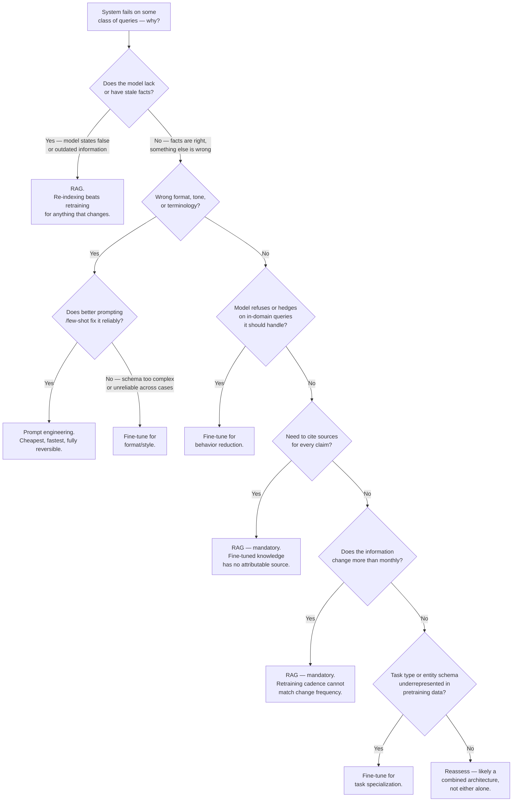
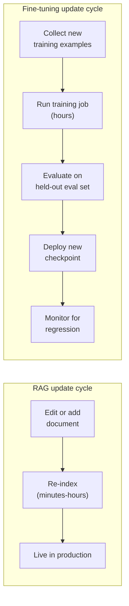
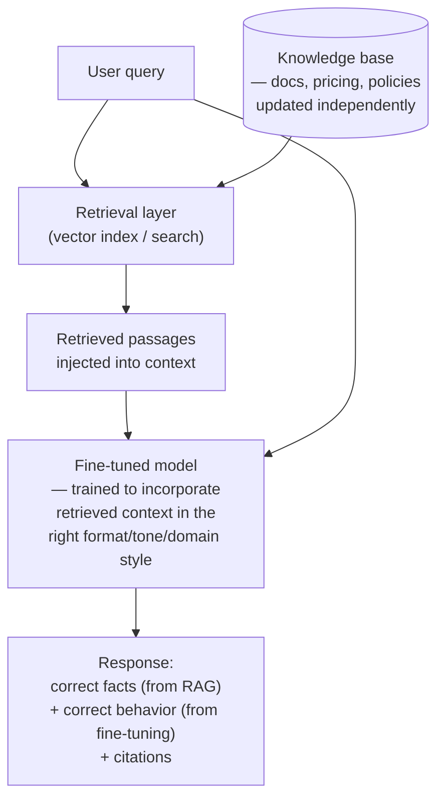

# Fine-Tuning vs RAG

## Overview

This chapter covers the single most common architectural fork in applied AI. Almost every team building an LLM-powered product eventually hits a moment where the system is wrong often enough to matter, and someone proposes fine-tuning as the fix. The core argument of this chapter: fine-tuning and RAG are not competing approaches for the same problem — they close different gaps. Fine-tuning changes what the model *does* with information it already has baked into its weights; RAG changes what information the model *has access to* at the moment it answers. Treating them as two options on the same menu, to be chosen between by preference or hype, produces exactly the kind of expensive, hard-to-reverse mistake [How Staff Engineers Think](01-how-staff-engineers-think.md) warns about — a fine-tuning pipeline that costs real money every quarter to keep current, built to solve a problem that a re-indexed document would have fixed in an afternoon.

The framing "fine-tuning vs. RAG" is itself the trap. It implies a choice between equals, decided by which one sounds more sophisticated or which one a strong engineer on the team has more experience with. The correct framing is: *what type of failure does my system have, and which approach closes that specific type of failure?* Get the diagnosis right and the choice of tool stops being a debate.

## Definition

**Fine-tuning** adjusts a pretrained model's weights on a curated dataset of examples so the model's default behavior — its output format, tone, task-specialization, or willingness to engage with certain queries — shifts toward what those examples demonstrate. The knowledge and behavior fine-tuning instills is baked into the weights: it is present on every inference call without needing to be retrieved, but it is also opaque (you cannot point to which training example produced a given output) and static (it reflects the training data as of the last training run, not the current moment).

**RAG (Retrieval-Augmented Generation)** leaves the model's weights untouched and instead retrieves relevant passages from an external knowledge store — a vector index, a search engine, a document database — at inference time, injecting them into the model's context window alongside the query. The model's behavior is unchanged; what changes is the information available to it for this specific request. Retrieved knowledge is current as of the last index update and is directly attributable: every claim in the output can, in principle, be traced back to a specific retrieved chunk.

The distinction that matters operationally: fine-tuning is a change to the model; RAG is a change to what the model sees. Confusing these — trying to fine-tune in fresh facts, or trying to use retrieval to force a deep behavioral change — is the root of most bad decisions in this space.

## The Real Question

The real question a Staff engineer asks is never "fine-tuning or RAG?" as a standalone technology preference. It is: **"Where exactly does my current system fail, and does that failure look like a knowledge gap or a behavior gap?"** A knowledge gap looks like: the model states something false or outdated that it could not possibly have known correctly, no matter how well it was prompted, because the information didn't exist or changed after training. A behavior gap looks like: the model has the right underlying knowledge but consistently expresses it in the wrong format, wrong tone, wrong terminology, or refuses to engage with a class of query it should handle.

This diagnostic question matters because it's falsifiable in a way "which technology is better" is not. You can look at a sample of failing outputs and sort them into "the model didn't know this" versus "the model knew something like this but expressed it wrong," and the sort tells you which lever to pull. Skipping this diagnosis and jumping straight to a technology choice is Anti-pattern 3 from [How Staff Engineers Think](01-how-staff-engineers-think.md#ai-specific-decision-anti-patterns) in a new costume: treating a distributional failure as a single bug to patch with whichever tool is top of mind, instead of classifying what kind of failure it actually is.

## Core Concepts

- **Knowledge gap** — the model lacks or has stale information it needs to answer correctly. No amount of prompting or fine-tuning fixes this reliably at scale; the information must be supplied, either by retrieval or by retraining on it (and retraining goes stale again immediately).
- **Behavior gap** — the model has access to the right information but expresses, formats, or reasons about it in a way that doesn't match requirements. Prompting and fine-tuning both operate on this axis; RAG does not.
- **Parametric knowledge** — information encoded in the model's weights during pretraining or fine-tuning. Opaque, uncitable, and frozen as of the last training run.
- **Non-parametric knowledge** — information supplied at inference time via retrieval. Transparent, citable, and as current as the last index update.
- **Attribution** — the ability to point to the specific source of a claim in the model's output. RAG provides this by construction (a chunk ID and source document); fine-tuning cannot, because there is no mechanism to trace a generated token back to a specific training example.
- **Distribution shift** — what fine-tuning does to the model's default behavior: it moves the model's output distribution toward the patterns in the fine-tuning set. This is the mechanism behind both its power (genuine behavior change) and its risk (it can degrade capabilities outside the fine-tuning set if not carefully scoped).
- **Retrieval quality** — the ceiling on RAG's effectiveness. A perfect generator fed irrelevant or missing retrieved passages produces a wrong answer regardless of the model's underlying capability; RAG failures are frequently retrieval failures, not generation failures.

## What Fine-Tuning Is Actually Good At

Fine-tuning earns its cost in a specific, narrow set of situations, and naming them precisely is more useful than a general endorsement or dismissal.

**Output format and style.** When the model must consistently produce a specific, complex structure — a particular JSON schema with nested conditional fields, medical SOAP notes formatted to a jurisdiction-specific standard, legal opinions following a house citation style — getting this right on every single call matters more than getting it right most of the time. Few-shot prompting handles simple schemas well: two or three examples in the prompt are often enough. Fine-tuning starts to justify its overhead once the schema is complex enough, or varies by enough sub-cases, that reliably demonstrating it via few-shot examples would consume a large fraction of the context budget on every single request, or once few-shot prompting's reliability plateaus below what the product needs.

**Task-type specialization.** Classifying support tickets into 50 custom categories that don't map to any general-purpose taxonomy, recognizing named entities specific to a proprietary domain (internal part numbers, custom project codenames), or parsing a proprietary file format the model has never seen in pretraining — these are patterns that are underrepresented or entirely absent from the pretraining distribution. No amount of prompting teaches a model a classification scheme it has zero exposure to when the scheme is idiosyncratic and the boundary cases are subtle; fine-tuning on a few thousand labeled examples closes this gap far more reliably than prompting ever will.

**Behavior reduction.** Base models ship with default behaviors that are useful in general but wrong for a specific domain: excessive caveating on questions that have a clear, confident, correct answer inside your domain; generic, hedging responses to domain-specific queries where the user needs a direct answer; refusals on safe-but-unusual queries that trip a general-purpose safety heuristic but are routine in a specialized professional context (a clinician asking about a drug interaction, a lawyer asking about a specific liability scenario). Fine-tuning on examples that demonstrate the desired confident, direct, non-refusing behavior shifts the model's default away from these unwanted patterns in a way that's hard to achieve purely through system-prompt instructions, because the base model's trained-in caution can outweigh an instruction that contradicts it.

**Latent skill activation.** Some domain-specific reasoning patterns — mathematical derivations in a field-specific notation, structured differential-diagnosis reasoning in a clinical domain, a specific multi-step legal-analysis structure — improve measurably with fine-tuning on domain examples in ways that few-shot prompting cannot fully replicate, because the pattern involves a chain of domain-specific steps that's difficult to fully specify in a handful of in-context examples but is learnable from a larger training set.

**What fine-tuning is NOT good at.** It is not a mechanism for injecting fresh, time-sensitive facts. A model fine-tuned on this quarter's pricing becomes stale the moment pricing changes next quarter, and there is no way to "patch" just the pricing fact without a full retrain-evaluate-redeploy cycle. Fine-tuned knowledge is opaque — you cannot inspect which specific facts or examples produced a given output, which makes debugging a wrong answer materially harder than with RAG, where you can inspect exactly which chunk was retrieved. And fine-tuned knowledge cannot be cited: there is no mechanism to attribute a generated claim to a specific training source, which disqualifies fine-tuning outright for any product requirement that needs source attribution (legal, medical, financial contexts especially). For anything that changes — pricing, policy, product documentation, recent events — fine-tuning is the wrong tool, full stop, regardless of how good the fine-tuned model's writing sounds.

## What RAG Is Actually Good At

RAG's strengths are close to the mirror image of fine-tuning's weaknesses, which is exactly why the two are complementary rather than competing.

**Fresh, citable facts.** Product documentation, pricing tables, legal statutes and case citations, company policies, internal wikis, research papers — this is the natural home for RAG. These sources change on their own schedule, and RAG's knowledge store can be updated independently of the model: update a document, re-index it, and the next query against that document reflects the change. Every retrieved passage carries a source document and chunk reference, so every claim in the model's output can be traced back to a specific piece of evidence — a property that matters enormously in any regulated or high-stakes domain where "why did the model say that" needs a real answer.

**Per-query personalization.** Information specific to this particular user — their account details, their uploaded documents, their support history, their permission scope — cannot be baked into a shared model's weights; it has to be retrieved at inference time, scoped to the requesting user. This is not a nice-to-have RAG feature; it's structurally the only correct place to put this kind of information, since fine-tuning a shared model per user is not viable at any real scale.

**Large knowledge corpora.** A corpus of 10 million documents cannot fit in any current context window, but it can be indexed once and retrieved from efficiently at query time. Fine-tuning a model to "know" 10 million documents would mean a full training run over that corpus, and even then the resulting knowledge would be opaque and uncitable — you'd have spent a large training budget to produce a worse version of what a retrieval index gives you directly.

**What RAG is NOT good at.** It is not a mechanism for deep behavioral change. Retrieving a handful of examples of the correct output format and injecting them into context as few-shot examples is not the same operation as fine-tuning on thousands of such examples — the model may underweight retrieved examples relative to its trained-in priors, particularly when the desired behavior is far from what the base model was trained to do by default. If a support bot needs to stop hedging and start giving direct, confident answers as a matter of consistent behavior across every response, retrieving "examples of confident responses" into context helps at the margin but does not reliably reshape the model's default behavior the way fine-tuning does. RAG supplies context; it does not rewire what the model does with context it wasn't given.

## Decision Framework

The decision is diagnosable directly from the failure mode, which is why the diagnostic step in [The Real Question](#the-real-question) has to come first — everything below is downstream of correctly answering "what kind of gap is this."

Reading the tree top to bottom mirrors how the diagnosis should actually happen: rule out a knowledge gap first, because it's the most common failure mode in production support and knowledge-work bots, and because RAG is cheap enough to prototype that ruling it in or out costs a few days, not a quarter. Only after knowledge gaps are ruled out does the tree move into format, tone, refusal, and task-specialization questions — the territory where fine-tuning earns its cost. The two "mandatory RAG" branches (citation requirement, change frequency above monthly) are structural: no amount of fine-tuning sophistication overrides them, because they are properties fine-tuning cannot provide by construction, not properties it happens to be worse at.

## Cost and Iteration Speed Comparison

The two approaches differ starkly in how fast a change can ship, and this difference is frequently the deciding factor when "either could technically work."

**The RAG change cycle**: update a document in the knowledge base, re-index it (minutes to hours depending on corpus size and index type), and the change is live. No model artifact changes, no retraining, no held-out eval set to re-run before deploying — although a lightweight regression check against a standing eval set is still good practice, it's a check, not a training job.

**The fine-tuning change cycle**: collect new training examples reflecting the desired change, run a training job, evaluate the resulting checkpoint against a held-out eval set to confirm it improved the target behavior without regressing anything else, deploy the new checkpoint, and monitor production traffic for regressions the eval set didn't catch. Every one of those steps takes real calendar time even when the training job itself is fast.

The dollar cost of the training job itself is often smaller than people assume, but it is not the whole cost. For a 7B-parameter model fine-tuned with LoRA, a training run costs roughly 4 GPU-hours at $3/hour — about $12 per run. That number alone makes fine-tuning look nearly free. But the total pipeline around that $12 run — collecting and cleaning new examples, running the eval, reviewing results, deploying, monitoring — takes days even when the training job itself finishes in an hour, because the surrounding process is where the real time goes.

At larger scale the gap widens further. Consider a 70B-parameter model updated on a monthly cadence to keep pace with policy changes: roughly 160 GPU-hours per run at the same rate works out to about $480 per training run, or $5,760/year in direct compute — plus an estimated 0.5 engineer-quarters/year of pipeline maintenance (data curation, eval-set upkeep, deployment and monitoring tooling) that dwarfs the compute line item. RAG's recurring cost at comparable scale is mostly inference-time retrieval and the marginal tokens retrieved passages add to each request — no recurring training pipeline exists to maintain at all.

This iteration-speed gap is often the decisive argument in practice: in a fast-moving product where pricing, policy, or documentation changes weekly, the team that can update knowledge in hours (RAG) ships correct answers faster than the team that must retrain to update knowledge (fine-tuning) — and that speed advantage compounds every time the underlying facts change again.

## The Combined Architecture

Mature production systems rarely use one approach exclusively; they assign fine-tuning and RAG to different jobs within the same system, because the two techniques solve genuinely different problems and stacking them is additive, not redundant. The fine-tuned model is better at *using* retrieved context — it has been trained on examples of how to incorporate retrieved passages into a response in the expected format, tone, and domain style — while RAG supplies the facts that the fine-tuning could never keep current on its own.

In this architecture, RAG owns freshness and attribution; fine-tuning owns the behavioral template for how retrieved facts get incorporated — the specific tone, the citation format, the domain terminology, the confident-not-hedging posture the base model wouldn't produce on its own. Neither piece is trying to do the other's job: nobody is fine-tuning in pricing data, and nobody is expecting retrieved few-shot examples alone to durably fix a refusal pattern. This is also why "fine-tuning vs. RAG" is the wrong framing for a mature system — the real end state for a system that has been through several iterations is usually both, each scoped to the failure mode it actually closes, not a single winner-take-all technology bet.

## Worked Example

*(Referenced in [How Staff Engineers Think](01-how-staff-engineers-think.md#worked-example-should-we-fine-tune-our-support-bot-or-invest-in-better-rag) — this section goes deeper on the same scenario, using the same numbers.)*

A mid-size SaaS company's support bot gives wrong answers on pricing and plan-limit questions about **12% of the time**. This failure rate is high enough that support leads have escalated it, and the team's first instinct is to fine-tune on 5,000 historical support tickets — it feels like the directly-targeted fix, since the tickets are real examples of the exact failure the bot needs to stop making.

Applying the diagnostic before committing to that instinct: are the failures happening because the model doesn't know the pricing (a knowledge gap) or because it responds in the wrong format or tone about pricing it does know (a behavior gap)? This is the single question that determines whether fine-tuning is even the right category of fix, and it's answerable by actually reading a sample of the failing transcripts rather than guessing.

Investigation into the 12% of failing tickets shows the failures are concentrated on questions about pricing tiers that changed three months ago. The model isn't confused about tone, format, or terminology — it is confidently and fluently stating the *old* pricing, because that's what was in its training and pretraining data. This is a pure knowledge gap, not a behavior gap. Fine-tuning on the 5,000 historical tickets would not fix this — a meaningful fraction of those tickets themselves reference the outdated pricing, so fine-tuning would bake last quarter's numbers in even more firmly, and the moment pricing changes again next quarter, the newly fine-tuned model goes stale on day one.

The smallest reversible bet: a RAG prototype indexing the current pricing documentation, tested against the 50 worst-performing real tickets from the last month. One engineer, one week. The result: the failure rate on those 50 tickets drops from **12% to 3%** — a direct measurement, not a projection. The decision: ship RAG for the knowledge problem; no fine-tuning pipeline gets built. The team writes a short decision record noting the diagnosis (knowledge gap, not behavior gap), the bet result, and a review date to confirm the fix holds at full production volume rather than just on the 50-ticket sample — the same discipline [How Staff Engineers Think](01-how-staff-engineers-think.md#the-five-questions-in-depth) prescribes for any decision of this size: name the constraint, check reversibility, project the 6-month/2-year cost, map blast radius, and run the smallest reversible bet before committing further.

## Tradeoffs

| Dimension | Fine-Tuning | RAG |
|---|---|---|
| Fixes knowledge gaps | No — bakes in stale facts, cannot cite sources | Yes — this is its primary strength |
| Fixes behavior/format gaps | Yes — its primary strength | Weakly, via few-shot in context; unreliable for deep change |
| Update latency | Days (data collection, train, eval, deploy) | Minutes to hours (re-index) |
| Attribution / citation | Not possible — no mechanism to trace output to source | Built in — chunk and document reference per claim |
| Cost profile | Training pipeline + eval harness maintenance, recurring per update | Retrieval infra + inference tokens, mostly usage-scaled |
| Reversibility | Low — committing to a retrain cadence is close to a one-way door once other systems depend on the checkpoint's latency/behavior profile | High — swapping or re-indexing the knowledge base is cheap |
| Failure mode if misapplied | Confidently wrong, uncitable, stale answers | Confidently wrong answers when retrieval misses — a generation problem masquerading as a retrieval problem, or vice versa |
| Best combined with | RAG, for using retrieved context correctly | Fine-tuning, for consistent behavior around retrieved facts |

The deeper tradeoff underneath the table is that fine-tuning trades iteration speed for behavioral depth, while RAG trades behavioral depth for iteration speed and attribution. Neither trade is free, and a Staff-level judgment call is about which trade the actual failure mode requires — not which trade sounds more rigorous or more impressive in a design review.

## Cost Implications

- **RAG's marginal cost scales with usage, not with change frequency.** Adding a new document costs nothing beyond the one-time indexing job; the model doesn't need to be touched. This means a knowledge base that changes daily costs roughly the same to maintain as one that changes monthly — the update itself is cheap regardless of frequency.
- **Fine-tuning's marginal cost scales with change frequency, and that's the trap.** A $12 LoRA training run on a 7B model looks negligible in isolation, but a change that must be retrained monthly, plus the surrounding eval-and-deploy pipeline, adds up to real recurring engineering time — the 70B-model example above works out to $5,760/year in compute alone plus roughly 0.5 engineer-quarters/year in pipeline upkeep, which a first-quarter budget comparison against RAG's inference-token cost routinely misses.
- **The eval harness is a hidden fine-tuning cost most teams underbudget.** Every fine-tuning run needs a held-out eval set re-validated for the new checkpoint to catch regressions — this is not optional if the model is customer-facing, and building and maintaining that harness is itself an ongoing cost separate from the training compute.
- **RAG's hidden cost is retrieval quality, not compute.** A cheap, low-quality retrieval pipeline (poor chunking, no re-ranking, stale embeddings) produces wrong answers just as confidently as a knowledge gap does, and diagnosing "is this a retrieval problem or a generation problem" itself takes engineering time — RAG is cheap to update but not free to get right.
- **The combined architecture has both cost profiles simultaneously**, which is a real cost, not a discount — a team adopting the combined pattern from [The Combined Architecture](#the-combined-architecture) should budget for both a retrieval pipeline and a (much less frequent) fine-tuning cadence, not assume the two costs cancel out.

## Common Mistakes

- **Fine-tuning to fix a knowledge gap.** The single most common version of this mistake: the model is wrong because it doesn't know something current, and the team fine-tunes on examples that happen to contain the *old* version of that fact, which locks the staleness in more firmly instead of fixing it.
- **Skipping the format-gap-vs-knowledge-gap diagnosis and jumping to a technology preference.** Choosing fine-tuning because "that's what worked last time" or RAG because "that's our default stack" without first sorting the actual failing examples into knowledge-gap versus behavior-gap buckets is a decision made on pattern-matching, not evidence.
- **Trying to prompt or retrieve your way into a deep behavioral change.** Injecting a handful of retrieved "correct tone" examples into context is not a substitute for fine-tuning when the desired behavior is far from the base model's default — this produces a system that looks fixed on the easy cases and reverts to default behavior on the harder ones.
- **Treating fine-tuning as free because the training job itself is cheap.** A $12 LoRA run is real, but it ignores the days of surrounding pipeline work (data curation, eval, deploy, monitor) that make the true cost of a single update far higher than the compute line item suggests.
- **Building a citation requirement on top of a fine-tuned model.** If the product needs to show users where an answer came from — a legal, medical, or financial context especially — fine-tuning cannot satisfy that requirement at all, regardless of how good the fine-tuned model's answers are, because there is no mechanism to attribute output to source.
- **Assuming RAG is automatically correct once retrieval returns something.** A retrieval pipeline that returns the wrong chunk, a stale chunk, or a chunk that's technically relevant but doesn't answer the actual question produces a confidently wrong answer that looks like a generation failure but is actually a retrieval failure — diagnosing which layer failed is a distinct skill from deciding fine-tuning vs. RAG in the first place.

## Real World Examples

The following are illustrative reasoning patterns consistent with each company's known public product surface — not confirmed internal architecture decisions.

- **Google**: a plausible pattern inside a Workspace AI feature (drafting emails, summarizing documents) is RAG over the user's own Drive/Gmail content for freshness and personalization, combined with a model fine-tuned or otherwise specialized for Workspace-appropriate tone and formatting — the personal-document knowledge could never be baked into shared model weights, but the writing style benefits from consistent behavioral shaping.
- **OpenAI / Anthropic**: a representative internal question for either lab's enterprise-facing product surface is whether a customer's proprietary support documentation should be handled via retrieval (the default, and the only viable option for customer-specific, frequently changing content) versus offering fine-tuning as an add-on specifically for customers who need consistent output formatting or domain terminology on top of retrieval — RAG as the mandatory base layer, fine-tuning as an optional behavioral layer on top.
- **Meta**: a plausible tradeoff for a Llama-based enterprise deployment is fine-tuning for a customer's specific compliance-driven output format (a regulated industry's required disclosure language) layered on top of RAG over that customer's own current policy documents — the compliance-language requirement is a behavior gap, the policy content is a knowledge gap, and conflating the two into a single fine-tuning effort would bake stale policy text into the model.
- **Glean**: a representative decision, given Glean's role as an enterprise search and knowledge layer, is RAG as the non-negotiable foundation — enterprise knowledge changes constantly and must be attributable per customer — with fine-tuning considered only for a narrow behavioral layer, such as consistently formatting answers to match a specific customer's internal documentation conventions.
- **Cursor**: a representative tradeoff for an AI coding assistant is RAG-style retrieval over the current codebase (which changes with every commit, ruling out fine-tuning as a way to keep the model current on it) combined with a model tuned or prompted for consistent code-style conventions — the codebase content is unambiguously a knowledge-freshness problem, while code style consistency is a behavior problem.

## Interview Questions

### Beginner

**Q: In one sentence, what's the difference between what fine-tuning changes and what RAG changes?**
Fine-tuning changes the model's weights so its default behavior shifts; RAG changes what information the model has access to at inference time without touching the model at all — one reshapes the model, the other reshapes the model's input.

**Q: Why can't you cite a source for something a fine-tuned model "knows"?**
Because fine-tuning blends training examples into the model's weights through gradient updates — there's no mechanism that preserves a link from a specific generated output back to a specific training example, unlike RAG, where the retrieved passage that fed the answer is directly inspectable.

### Intermediate

**Q: A team's support bot is factually correct but responds in a generic, hedging tone that doesn't match the company's confident brand voice. Which approach fixes this, and why?**
This is a behavior gap, not a knowledge gap — the facts are right, so RAG has nothing to fix here. Fine-tuning on examples of the desired confident, direct tone is the right lever, since RAG can't reliably reshape a model's default tone through retrieved context alone, especially if the current hedging behavior is close to the base model's trained-in default. Before committing to a full fine-tune, the cheaper first bet is testing whether a strong system prompt with a few tone-setting examples closes the gap — fine-tuning is justified only once prompting has been tried and plateaus below what's needed.

**Q: Walk through how you'd decide whether a wrong-answer failure in production is a retrieval failure or a generation failure.**
Pull a sample of failing cases and inspect what was actually retrieved for each one. If the retrieved passages don't contain the correct answer at all, that's a retrieval failure — the fix is in chunking, indexing, or the retrieval query, not the model. If the correct passage was retrieved but the model still produced a wrong or poorly synthesized answer from it, that's a generation failure, and the fix is in prompting or, if consistent enough, fine-tuning the model to better incorporate retrieved context. Conflating the two wastes effort on the wrong layer — an team that fine-tunes to fix a retrieval failure will see no improvement, because the model never had the right information in front of it to begin with.

### Senior

**Q: A stakeholder insists on fine-tuning because "RAG feels like a hack — the model should just know this." How do you respond?**
The response starts by naming the actual tradeoff rather than arguing aesthetics: "know this" implies static, memorized knowledge, which is precisely wrong for anything that changes — fine-tuning a fact in means it goes stale the next time that fact changes, silently, with no mechanism to detect it, whereas RAG makes the freshness and source of every fact explicit and correctable in minutes. If citation or auditability matters at all to the product, RAG isn't a workaround, it's a requirement fine-tuning cannot satisfy regardless of preference. Where the stakeholder's instinct is worth taking seriously is if the actual complaint is about behavior — the model using retrieved facts clumsily — which is a legitimate argument for the combined architecture, not for abandoning RAG.

**Q: You've shipped RAG for a knowledge-gap problem and it's working, but a related behavior issue remains (the bot still doesn't cite sources in the company's required legal disclosure format). Do you now fine-tune, and how do you scope it?**
Yes, but narrowly. The knowledge problem is solved and shouldn't be touched again; the remaining problem is a well-defined formatting/behavior gap layered on top of an already-working retrieval pipeline — exactly the combined-architecture case. Scope the fine-tuning set specifically to examples of correctly formatted citations over retrieved content, not a broad retrain that risks regressing the retrieval-usage behavior that already works. Evaluate the new checkpoint specifically against the citation-format requirement plus a regression check against the existing RAG-answer-quality eval set, so a fix to formatting doesn't silently degrade the knowledge-gap fix already shipped.

### Staff

**Q: Your team already has a working RAG pipeline. A new stakeholder wants to fine-tune a model "to reduce hallucinations." How do you evaluate this request?**
Start by getting specific about what "hallucination" means in their failure cases, because the word is used to describe at least two different failures that need opposite fixes. If the model is inventing facts not present in the retrieved context, that's usually a generation-discipline problem — the model isn't reliably grounding its answer in what was retrieved — which is addressable by fine-tuning the model specifically on examples of grounding answers strictly in provided context (a legitimate, narrow use of fine-tuning layered on the existing RAG pipeline). If instead the model is stating things confidently that simply aren't in the knowledge base at all, that's a retrieval-coverage gap — the knowledge base is missing the information — and no amount of fine-tuning fixes a document that was never indexed. I'd ask for a sample of the actual hallucinating outputs, sort them into "context was there but ignored" versus "context was never there," and only then scope a fix — likely a narrow grounding-focused fine-tune for the first bucket and a retrieval/indexing fix for the second, not a broad retrain justified by an imprecise diagnosis.

**Q: How do you decide, at a platform level, whether to standardize on RAG as the default for every team versus letting each team choose fine-tuning or RAG independently?**
This is a blast-radius and defaults question more than a technical one, in the same shape as the platform-scale reasoning in [How Staff Engineers Think](01-how-staff-engineers-think.md#scalability). If most teams' problems are knowledge-gap-shaped — and in practice, most customer-facing and internal-knowledge products are, since the world keeps changing underneath them — a shared, well-built retrieval platform as the default serves the majority of teams without each one re-running this decision from scratch, the same way a linter replaces a human gate on every PR. Fine-tuning should remain available but not the default, reserved for teams with a genuine, demonstrated behavior gap after they've shown RAG or prompting doesn't close it — gating it behind evidence prevents every team with a vague "our bot doesn't feel right" complaint from spinning up its own training pipeline. The platform's job is to make the common case (RAG) cheap and well-supported, and to make the exception case (fine-tuning) available but deliberately a little more friction-full, so it gets chosen only when the diagnosis actually calls for it.

## Google-Level Follow-Ups

- "Your RAG prototype dropped the failure rate from 12% to 3% on 50 hand-picked worst-performing tickets. What could make that number misleading at full production scale, and how would you find out before committing?" — probes whether the candidate recognizes selection bias in a small, hand-picked eval sample and would validate against a random production sample before treating the bet result as conclusive.
- "You've built the combined architecture — RAG for facts, fine-tuning for behavior. A production incident happens: the bot gives a wrong, confidently-stated answer. How do you determine which layer is at fault, under time pressure?" — probes for a structured incident-triage process (inspect what was retrieved, compare to what was generated) rather than guessing based on which layer was more recently changed.
- "A team argues that since their fine-tuning pipeline only costs $12 per run, cost isn't a reason to prefer RAG. Is this argument correct?" — probes whether the candidate can separate the marginal training-compute cost from the full pipeline cost (data curation, eval, deploy, monitor, cadence) and articulate why the $12 number is real but not the relevant number for the decision.
- "At what point does maintaining both a RAG pipeline and a fine-tuning pipeline for the same product become worse than picking one, even if each individually is justified?" — probes whether the candidate sees that combined architectures add real operational surface area (two systems to monitor, two failure-diagnosis paths, two on-call burdens) and can articulate when that overhead outweighs the marginal quality gain of the second layer.

## Key Takeaways

- Fine-tuning and RAG close different types of failure — a knowledge gap or a behavior gap — and the decision between them should be driven by diagnosing which one you actually have, not by technology preference.
- Fine-tuning is good at output format, task-type specialization, behavior reduction, and latent skill activation; it is never the right tool for fresh, time-sensitive, or citable facts.
- RAG is good at fresh facts, per-query personalization, and large knowledge corpora with attribution; it does not reliably produce deep behavioral change on its own.
- Two conditions make RAG mandatory regardless of other preferences: a requirement to cite sources, and information that changes faster than a retraining cadence can match (roughly, more often than monthly).
- RAG's update cycle is minutes to hours; fine-tuning's is days end-to-end even when the training job itself is cheap — this iteration-speed gap is frequently the deciding factor when both approaches are technically viable.
- Mature production systems commonly use both: RAG supplies current, citable facts, and fine-tuning supplies the behavioral template for how the model incorporates retrieved context — additive, not redundant.
- The worked example (12% failure rate, concentrated in a knowledge gap from a 3-month-old pricing change, RAG prototype dropping it to 3% in one week) is the pattern to reach for by default: diagnose before you build, and run the smallest reversible bet before committing to a training pipeline.

---

*Part of [Staff-Level Architecture](index.md) in the [AI System Design Notes](../index.md). Tracked in [BACKLOG.md](https://github.com/GyanendraChaubey/AI-System-Design-Notes/blob/main/BACKLOG.md).*
