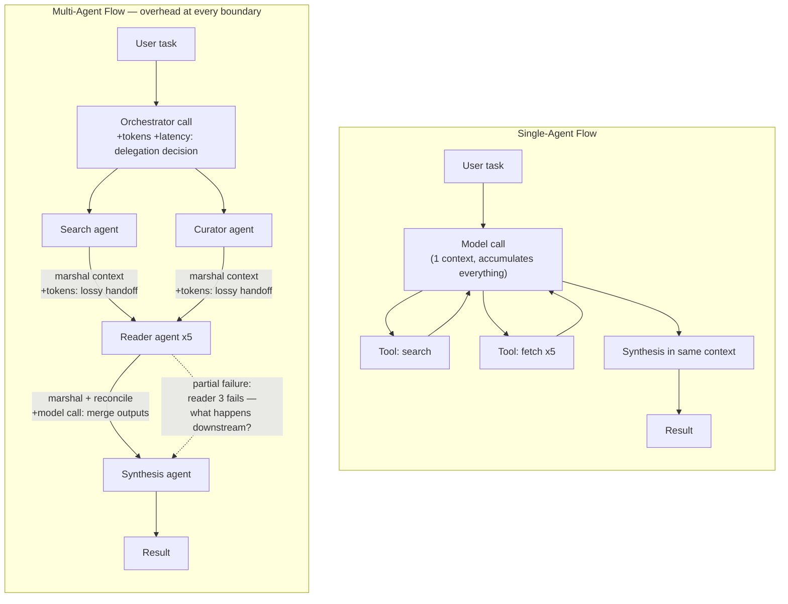
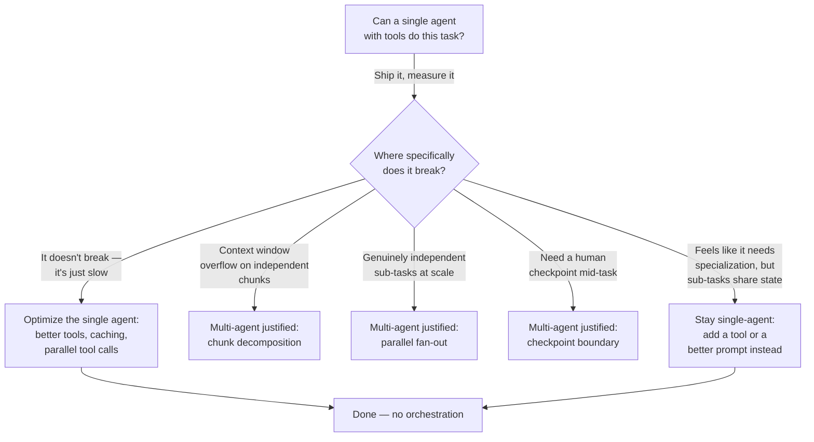

# Single-Agent vs Multi-Agent

## Overview

Multi-agent orchestration is one of the most overhyped patterns in applied AI, and the hype has a specific shape: it presents "agents talking to agents" as free parallelism — more agents, more throughput, more capability, at roughly the cost of writing an orchestrator. That framing is wrong in a way that matters at Staff level, because it hides a real, non-negotiable cost. Every agent boundary is a coordination boundary, and coordination is never free — it is paid in extra model calls, extra prompt tokens, context that has to be marshaled and re-explained, errors that propagate instead of getting caught, and a debugging surface that grows combinatorially with the number of agents. This chapter's argument is not "multi-agent systems are bad." It is that a well-scoped single agent with tools is more reliable, cheaper, and easier to debug than a multi-agent system for the large majority of production tasks, and that the burden of proof should sit on multi-agent, not on single-agent.

## Definition

A **single-agent system** is one model, one context, one loop: the model reasons, calls tools (search, code execution, file read/write, API calls), observes results, and continues — all within a single accumulating context window, under a single point of control. A **multi-agent system** decomposes a task across multiple independent model invocations — often with an orchestrator agent that delegates to specialized sub-agents (a planner, a researcher, a coder, a reviewer) — each running its own context, and each producing an output that must be passed to, and reconciled by, another agent. The distinction that matters is not "one model call vs. many" (a single agent making seven tool calls is still one agent); it's whether reasoning and context are unified in one place or partitioned across independently-reasoning components that must communicate to complete the task.

## The Real Question

The question a Staff engineer should be answering is never "should we use multi-agent architecture" in the abstract — frameworks and conference talks make it sound like a maturity milestone, the thing you graduate to once a single agent feels too simple. The real question is narrower and much harder to dodge: **specifically where does the single-agent version break, and does that failure require independent reasoning contexts to fix, or does it just need another tool call?** Most of the time, a single agent with a better tool, a longer context window, or a retry loop fixes the failure that looked like it demanded orchestration. Multi-agent is justified only when the sub-tasks are genuinely independent, genuinely parallelizable, or genuinely require different context that shouldn't be mixed — not when the task merely looks complex.

## Core Concepts

- **Coordination tax** — the unavoidable overhead of splitting reasoning across agent boundaries: orchestration model calls, context marshaling, output reconciliation, and partial-failure handling. It is a cost floor, not a bonus, and it scales with the number of agents.
- **Context marshaling** — the work of extracting exactly the information a sub-agent needs from a shared or upstream context and re-expressing it as that sub-agent's input. Every marshaling step is lossy and costs tokens.
- **Output reconciliation** — the orchestrator's job of parsing, merging, and resolving conflicts between sub-agent outputs, which is itself either another model call or brittle parsing logic.
- **Partial failure propagation** — in a pipeline of dependent agents, one agent's failure or hallucination doesn't stay contained; it becomes the next agent's (bad) input, and error compounds downstream instead of being caught mid-stream the way a single agent can self-correct.
- **Genuine independence** — the property that actually justifies parallel agents: sub-tasks that share no intermediate state and don't need each other's in-progress reasoning to proceed.
- **Derived context vs. accumulated context** — a sub-agent working from a summary another agent produced is working from *derived* context (compressed, potentially lossy); a single agent that read the same material directly is working from *accumulated* context (richer, and revisable in place).

## The Coordination Tax

Every agent boundary in a multi-agent system introduces four distinct costs, and they are additive, not occasional:

1. **The orchestrator's delegation call.** Before any sub-agent runs, the orchestrator's model has to decide what to delegate and to whom — a model call that produces tokens and adds latency before real work starts.
2. **Context marshaling.** A sub-agent needs enough context to do its job correctly. Passing that context from the orchestrator (or from another sub-agent) costs tokens on every hop; if agents share mutable state, keeping that shared context current and consistent gets expensive fast, since every update has to be re-broadcast or re-fetched.
3. **Output reconciliation.** The orchestrator must parse and merge sub-agent outputs into something coherent — either another model call (more tokens, more latency, another point where meaning can be lost in translation) or hand-written parsing logic that's brittle against any sub-agent's output format drifting.
4. **Partial failure handling.** If sub-agent 2 fails or hallucinates, what happens to sub-agents 1, 3, and 4 that depend on its output? A single agent can notice a mistake mid-stream and revise before continuing. A multi-agent pipeline has already handed a bad output downstream by the time anyone notices — the error propagates instead of getting caught.

The single-agent flow has one context that accumulates everything it has seen; nothing has to be re-explained to itself. The multi-agent flow pays a labeled tax at every arrow — and note that the diagram doesn't even show the retry/error-handling paths that a production system needs at each of those boundaries, which would add more overhead, not less.

## Worked Example: Research Task Token Math

Take a concrete task: *"Summarize the 5 most relevant papers on RAG from the last 6 months."*

**Single-agent:** one model, one context. The agent makes a search tool call, then five fetch tool calls (one per paper), then generates the synthesis in the same context that has now accumulated all five papers' content. Total: **1 model call with 7 tool calls**, roughly **3,000 output tokens** for the final synthesis. The model that writes the summary is the same model that read all five papers directly — no compression step in between.

**Multi-agent:** an orchestrator call decides the plan → a search agent and a curator agent run in parallel to find and rank candidate papers → five reader agents run in parallel, one per paper, each producing a summary → a synthesis agent merges the five summaries into the final answer. Total: **8 model calls**, each carrying its own context overhead (system prompt, task framing, marshaled input, output formatting instructions) on top of the actual work.

At **$3/M input tokens + $15/M output tokens**, the multi-agent version costs roughly **5× more** in model inference for the same end result. The parallel reader agents genuinely save wall-clock time — maybe 2 minutes, since five papers get read simultaneously instead of sequentially. But the orchestration overhead (delegation call, marshaling five summaries into the synthesis agent's context, the synthesis agent's own reasoning about how to merge them) costs those same 2 minutes back in added model calls and sequencing. **Net result: zero time savings, a 5× cost increase, and 8 failure points instead of 1.** Every one of those 8 model calls is a place the pipeline can produce a malformed output, hallucinate a citation, or silently drop a paper — and the orchestrator has to detect and handle every one of those failure modes, which single-agent tool-calling doesn't need, because the same model that made the mistake can see its own tool output and correct it in the next turn.

## Worked Example: The Coding Agent Case

Take a task that looks like it obviously needs specialization: *"Fix the bug in the authentication middleware."*

**Single-agent:** the model reads the failing test, reads the middleware file, understands the bug in the context of having seen both, writes the fix, runs the test, and iterates if the fix doesn't pass — all in one accumulating context that never loses information between steps.

**Multi-agent:** an orchestrator delegates to a planner agent (reads the bug report, produces a plan), a codebase-reader agent (reads the relevant files, produces a summary), a coder agent (writes the fix from the planner's plan and the reader's summary), a test-runner agent (runs tests), and a debugger agent (handles failures). This sounds like sensible separation of concerns — until you notice what actually happens at the coder agent's input: it never reads the bug report or the middleware file directly. It receives a *compressed, marshaled summary* produced by two upstream agents. The coder is reasoning about a derived description of the problem, not the problem itself. The single agent's context — having read both the failing test and the actual code in the same session — is strictly richer than what the coder sub-agent receives, because nothing about the code was lost to summarization before the agent that has to fix it ever sees it.

This is why production coding tools don't decompose this way. **Cursor, GitHub Copilot, and Claude Code all use single-agent loops with tool calls for code editing, not multi-agent orchestration.** The code-editing task — read, understand, plan, write, test, debug — has sequential dependencies where each step needs the full context of the previous ones. Parallel agent decomposition is actively harmful here: it partitions and re-marshals context that would be more useful left whole. The single agent with tools outperforms multi-agent precisely because context accumulates in one place instead of being split up and passed through lossy handoffs.

## Decision Framework

The decision is not "single vs. multi-agent" as a style preference; it routes through the same [five-question framework](01-how-staff-engineers-think.md#the-five-question-decision-framework) as every other chapter in this section — actual constraint, reversibility, 6-month/2-year cost, blast radius, smallest reversible bet — with this chapter's version of the smallest reversible bet being a specific, recurring pattern: **ship the single-agent version first and measure exactly where it breaks before adding orchestration complexity.**

## When Multi-Agent Genuinely Wins

Multi-agent architecture earns its coordination tax in four recurring situations, and all four share a common trait: the sub-tasks don't need each other's in-progress reasoning.

- **Genuinely independent sub-tasks at scale.** Twenty competitive-intelligence reports on twenty different companies, each completely independent of the others, is the canonical case: twenty parallel reader agents give roughly 20× throughput at a small, fixed orchestration overhead. There's no shared state and no reconciliation logic beyond collecting twenty separate outputs.
- **Specialization with truly different requirements.** A code-review pipeline where a security-focused agent, a performance-focused agent, and a style-focused agent each operate independently on the same codebase — potentially each running a different model or fine-tune suited to its specialty — with no shared intermediate outputs required between them. Each agent's review stands alone; nothing downstream needs to merge their reasoning mid-task, only their final findings.
- **Context window overflow on decomposable input.** A task that requires processing more text than fits in a single context window, where the input naturally decomposes into independent chunks — a large document corpus where each agent handles one document — is legitimately forced into multi-agent by a hard technical constraint, not a preference. The chunking itself is the decomposition justification; if the chunks needed to reference each other's reasoning mid-task, this justification wouldn't hold.
- **Human-in-the-loop checkpoints between agents.** Agent 1 produces a plan; a human reviews and approves it; Agent 2 executes the approved plan. The checkpoint is a real boundary that a single continuous agent loop can't represent — the human's approval is itself the reason the two-agent structure is correct, not incidental to it.

## The Decision Checklist

1. **Can a single agent with tools complete this task?** Ship that first. Don't design the multi-agent version before you've measured where the simple version actually fails.
2. **Where specifically does the single-agent version break?** Not "multi-agent would be more scalable" as a general claim — name the exact step that fails, why it fails, and why adding a tool call inside the single agent wouldn't fix it. If you can't name the specific step, you don't have a justification yet.
3. **Are the sub-tasks truly independent?** Do they share intermediate state? If yes, passing that state between agents costs tokens on every hop and loses context in the process — that's the coordination tax working against you, not a reason to add more agents.
4. **What is the coordination tax at expected volume?** N agents × N model calls × coordination overhead per boundary is the *floor* cost of the architecture, not a bonus feature. Compute it before committing, the same way the token math above was computed for the research task.
5. **When something goes wrong in the multi-agent version, how will you debug it?** With one agent, the failure is in one transcript. With five agents, the failure could be in the orchestrator's delegation, any sub-agent's reasoning, or the reconciliation step — and reproducing it means reproducing the exact interleaving that produced the bad output.

## Worked Example: Applying the Checklist

A team wants to build a "market research assistant" that produces a competitive landscape report on a given industry. The first instinct, shaped by conference-talk hype, is a five-agent pipeline: a planner, a search agent, a company-profile agent, an analysis agent, and a writer agent. Running the checklist instead:

1. A single agent with a web-search tool and a fetch tool can plausibly do the whole task — search for companies, fetch pages, synthesize — in one accumulating context. Ship that version first.
2. Measured over real usage, the single-agent version breaks only when the industry has more than roughly 15 competitors, at which point the context window starts filling with fetched pages before synthesis, degrading output quality. That's the specific, named failure.
3. The fifteen-plus-competitor case decomposes into genuinely independent sub-tasks: one competitor's profile doesn't depend on another's. This satisfies the "genuinely independent" test from the checklist.
4. At the checklist's cost step: N parallel profile agents at that volume costs roughly N× the profiling tokens plus one orchestration call and one reconciliation call — a small, bounded tax relative to the throughput gained, unlike the earlier research-task example where the tax outweighed the benefit.
5. Debugging plan: each profile agent's output is logged independently and validated against a schema before reconciliation, so a bad profile is traceable to one agent's one output rather than buried in a merged pipeline.

The team ships single-agent for the common case (under 15 competitors) and only invokes the parallel-profile multi-agent path above that threshold — the multi-agent version is a scale-triggered escape hatch, not the default architecture, and it exists because a specific, measured failure justified it rather than because multi-agent looked more sophisticated.

## Tradeoffs

| Single-Agent | Multi-Agent |
|---|---|
| One context, no marshaling loss | Context split across agents, marshaling loses fidelity |
| One failure point per task | N failure points, one per agent + orchestrator |
| Debugging is one transcript | Debugging spans N transcripts + reconciliation logic |
| Cost scales with the task's real token need | Cost scales with N agents × coordination overhead, often ~5× for no wall-clock benefit |
| No parallelism for genuinely independent large-N work | Real throughput win at scale for genuinely independent sub-tasks (e.g., 20× on 20 independent reports) |
| Sequential dependencies handled naturally (context accumulates) | Sequential dependencies are actively harmed by decomposition (context gets compressed and re-derived) |
| Simpler to reason about, ship, and maintain | Justified only by context-window limits, true independence at scale, specialization with no shared state, or human checkpoints |

## Cost Implications

Cost is not a secondary concern here — it is often the deciding factor, because the coordination tax is denominated in the same tokens the task's real work is denominated in. The research-task worked example above showed a concrete **~5× inference cost multiplier** for zero wall-clock benefit when the decomposition wasn't genuinely independent. That multiplier compounds at production volume: a task run 10,000 times a month at 5× the cost is not a rounding error, it's the difference between a $3,000/month feature and a $15,000/month feature for identical output quality. The cost model that should gate a multi-agent proposal is the same one from the [decision checklist](#the-decision-checklist): N agents × N model calls × per-boundary coordination overhead, computed against expected production volume, compared directly against the single-agent baseline's token cost for the same task. If that number isn't computed before the architecture is chosen, the team is committing to a cost structure it hasn't measured — which is exactly the kind of decision-debt this section's framework exists to prevent (see [How Staff Engineers Think](01-how-staff-engineers-think.md#core-concepts)).

## Common Mistakes

- **Reaching for multi-agent before shipping the single-agent version.** The single-agent baseline is the control group; without it, there's no measurement of what multi-agent actually bought you, only an assumption that it helped.
- **Justifying multi-agent with "it would be more scalable" instead of a named failure.** Scalability claims that don't point to a specific step, a specific volume, or a specific context-window limit are hype, not analysis.
- **Treating context sharing between agents as free.** Every piece of state passed between agents costs tokens to marshal and risks being compressed lossily — teams that let agents share a growing pool of "conversation state" often rediscover the coordination tax as a runaway token bill.
- **Decomposing sequentially-dependent tasks into parallel agents.** Code editing, debugging, and any task where step N genuinely needs the full context of step N-1 is harmed, not helped, by splitting it across agents that only see each other's summaries.
- **Underestimating the debugging cost.** A five-agent pipeline doesn't have five times the debugging surface of a single agent — it has combinatorially more, because a bad output can originate at any agent and be masked or amplified by any agent downstream of it.
- **Assuming parallel wall-clock savings are net savings.** As the research-task example showed, time saved by parallel sub-agents is frequently paid straight back in the sequential orchestration and reconciliation steps around them, leaving zero net time benefit at several times the cost.

## Real World Examples

- **Cursor, GitHub Copilot, and Claude Code** all use single-agent loops with tool calls for code editing, not multi-agent orchestration — direct evidence, from the highest-scrutiny production coding tools available, that the sequential-dependency argument in this chapter holds in practice, not just in theory.
- **Anthropic and OpenAI's own agent-building guidance** converges on the same "start simple" bias: begin with a single agent using tools, and only introduce orchestration (routing, parallelization, or a supervisor pattern) once a specific, measured limitation of the single-agent approach justifies the added complexity — the same ordering this chapter's decision checklist encodes as step 1.
- **Enterprise research and report-generation tools** (competitive intelligence, market research platforms) are the clearest legitimate multi-agent use case in production: genuinely independent per-company or per-document sub-tasks at real scale, parallelized with a thin orchestration layer and no shared intermediate state — matching this chapter's "genuinely independent sub-tasks at scale" criterion exactly.
- **Glean**, given its connector-heavy enterprise search surface, plausibly runs something closer to independent parallel retrieval across connector types (each connector's search is genuinely independent of the others) rather than a sequential multi-agent reasoning pipeline — an architecture that looks like "multiple agents" but is actually the parallel-fan-out pattern this chapter endorses, not the sequential-orchestration pattern it warns against.

## Interview Questions

### Beginner

**Q: What is the "coordination tax" in a multi-agent system?**
It's the unavoidable overhead every agent boundary introduces: the orchestrator's model call to decide what to delegate, the tokens spent marshaling context from one agent to another, the work (often another model call) of reconciling multiple agents' outputs into one result, and the handling required when one agent's failure would otherwise propagate to agents downstream of it. It's called a tax because it's paid regardless of whether the decomposition was necessary — it's the fixed cost of splitting reasoning across multiple contexts.

**Q: Give an example of a task where multi-agent architecture is clearly justified.**
Twenty independent competitive-intelligence reports on twenty different companies is a clean case: each report requires no information from any other report, so twenty parallel reader agents give roughly 20× throughput for a small, fixed orchestration overhead. The independence is what justifies it — there's no shared state to marshal and no reconciliation beyond collecting twenty separate outputs.

### Intermediate

**Q: Walk through the token-cost math for why multi-agent can cost significantly more than single-agent for the same task.**
Take "summarize the 5 most relevant papers on RAG from the last 6 months." Single-agent does this as one model call with 7 tool calls (1 search + 5 fetches) producing about 3,000 output tokens. Multi-agent splits this into an orchestrator, a search agent, a curator agent, five reader agents, and a synthesis agent — 8 model calls total, each carrying its own context overhead on top of the actual work. At $3/M input + $15/M output, that's roughly 5× the inference cost for the same result, and the parallel readers' wall-clock savings (maybe 2 minutes) get paid straight back in the sequential orchestration and reconciliation steps around them. Net: no time savings, 5× the cost, and 8 failure points instead of 1.

**Q: Why do production coding agents like Cursor and Claude Code use a single-agent loop instead of a multi-agent pipeline?**
Code editing has sequential dependencies — read the bug, understand the code, plan the fix, write it, test it, debug failures — where each step needs the full context of the previous ones, not a summary of it. A single agent's context accumulates everything it has read directly; a multi-agent pipeline would have a coder agent working from a compressed, marshaled summary produced by a planner and a reader agent, which is strictly less information than having read the code directly. That's why decomposing this task hurts rather than helps: it partitions context that's more valuable kept whole.

### Senior

**Q: A team on your org proposes a multi-agent architecture for a new feature, citing scalability. How do you evaluate the proposal?**
Start by asking them to name, specifically, where a single agent with tools would break — not a general scalability claim, but the exact step, the volume at which it fails, and why a tool call or a longer context window inside the single agent wouldn't fix it. If they can't name it, the proposal hasn't cleared the bar yet; ask them to ship the single-agent version first and measure. If they can name a specific failure — context-window overflow on genuinely independent chunks, or true task independence at scale — then compute the coordination tax at expected production volume (N agents × N model calls × per-boundary overhead) and compare it directly against the single-agent baseline's cost, the same way the research-task worked example does. The proposal is justified only if the named failure is real and the tax is smaller than the benefit it buys.

**Q: How would you debug a multi-agent pipeline that's producing wrong outputs intermittently, and how does that compare to debugging a single agent?**
With a single agent, the failure is contained in one transcript — you can see the exact sequence of reasoning and tool calls that led to the bad output. With a multi-agent pipeline, the bad output could have originated at any agent (a bad plan, a bad summary, a bad synthesis) and been masked or amplified by any agent downstream of it, so debugging means reconstructing which agent introduced the error and whether the reconciliation step compounded it — combinatorially harder than a single transcript. The practical mitigation is logging every sub-agent's output independently and validating it against a schema before it's passed downstream, so a bad output is traceable to one agent rather than buried inside a merged result — but that logging and validation is itself part of the coordination tax that a single agent never had to pay.

### Staff

**Q: A team has already built and shipped a five-agent research pipeline. Your job is to decide whether to keep it, simplify it, or let it stand. Walk through your reasoning.**
I'd apply the five-question framework from how Staff engineers think about any architecture decision, with this chapter's specific version of it. First, the actual constraint: is the pipeline underperforming on cost, latency, reliability, or debugging burden, or is it just architecturally more complex than it needs to be with no measured downside yet? If nobody's measured it against a single-agent baseline, that's the first gap — I'd have the team build the single-agent version now, even post-hoc, purely to get the comparison numbers, since without a control group "it works" tells you nothing about whether the complexity was earning its cost. Second, reversibility: how many other systems now depend on this pipeline's specific agent boundaries and output formats — a five-agent pipeline three downstream consumers built against is a much harder simplification than one nothing else touches yet. Third, the 6-month/2-year cost: I'd compute the coordination tax at current and projected volume — N agents × N model calls × per-boundary overhead — and compare it to what the single-agent baseline would cost at the same volume, the same math as the research-task worked example. Fourth, blast radius: if this pipeline's failure modes (partial failures propagating downstream, reconciliation errors) have caused incidents, that's evidence the coordination tax isn't just a cost line, it's a reliability liability. Fifth, the smallest reversible bet: rather than a wholesale rewrite, I'd propose collapsing the pipeline one boundary at a time — starting with the agents that share the most state or need the least true independence — and measuring quality and cost after each collapse, stopping when quality degrades or cost benefit disappears. The team's instinct to defend the existing architecture because it's shipped is exactly the sunk-cost anchoring this section's framework is built to catch; the question isn't "does it work," it's "would we choose this shape again starting from today's numbers."

**Q: How do you convince a team that's excited about multi-agent architecture, for genuinely good technical reasons in their specific case, that the burden of proof should still sit on them rather than on the single-agent default?**
I'd agree with them that multi-agent is sometimes the right call, and point to the same four cases this chapter names — genuine independence at scale, true specialization with no shared state, context-window overflow on decomposable input, or a real human-in-the-loop checkpoint — as the actual bar, not a rhetorical one. Then I'd ask them to run the decision checklist explicitly and in writing: ship the single-agent version, name the exact step where it breaks, confirm the sub-tasks are truly independent (not just conceptually separable), compute the coordination tax at their expected volume, and describe how they'll debug the multi-agent version when it fails. If their case is genuinely one of the four, this process doesn't slow them down much — it mostly produces the evidence that makes the proposal easy to approve. If it isn't, the process itself reveals that before any engineering time is spent, which is the entire point of putting the burden of proof on the more expensive architecture rather than on the cheaper one. The framing that works best isn't "no," it's "show me the specific break and the tax math, and I'll sign off" — which keeps the standard high without making it personal.

## Google-Level Follow-Ups

- "Your team measured a single agent breaking at 15 competitors in a report-generation task and moved to multi-agent above that threshold. Six months later, model context windows double. Do you revert?" — probes whether the candidate treats the multi-agent threshold as a re-testable measurement tied to a specific technical constraint, not a permanent architectural commitment.
- "You've shown the research-task example costs 5× more in multi-agent with no time savings. A PM argues the 8 separate model calls give better observability into which step failed, and that's worth the cost. How do you respond?" — probes whether the candidate can separate a genuine tradeoff (observability) from the original justification (scalability), and whether cheaper observability (structured logging inside a single agent's tool calls) could get the same benefit without the coordination tax.
- "Your multi-agent pipeline's reconciliation step is itself an LLM call that occasionally merges two sub-agent outputs incorrectly. How do you even know this is happening, given each individual agent's output looks locally correct?" — probes whether the candidate understands that reconciliation errors are a distinct failure mode from any single agent's error, requiring output-level validation of the merged result, not just per-agent correctness checks.
- "A competitor ships a flashy multi-agent demo for a task you concluded should be single-agent. Your quality bar is objectively higher on the same benchmark. How do you handle the internal pressure to match their architecture rather than their outcome?" — probes whether the candidate can hold the line that the architecture is a means, not the deliverable, and can communicate that distinction to non-technical stakeholders who see the demo, not the coordination tax.

## Common Mistakes

- **Defaulting to multi-agent because it looks more sophisticated.** Architectural sophistication is not a requirement; matching the architecture to a measured, named failure is — anything else is optimizing for how the system looks rather than how it performs.
- **Never shipping a single-agent baseline to compare against.** Without a control group, there's no way to know whether the added complexity of multi-agent bought anything, only an assumption that it did.
- **Underestimating context marshaling cost.** Teams budget for the "interesting" model calls (the sub-agents doing real work) and forget that every context handoff between agents costs tokens and risks losing information in the compression.
- **Decomposing sequentially-dependent tasks in parallel.** Code editing, debugging, and multi-step reasoning tasks where each step needs the previous step's full context are actively harmed by agent decomposition, not helped by it.
- **Treating parallel wall-clock savings as net savings.** Time saved by running sub-agents in parallel is frequently paid back in the sequential orchestration and reconciliation steps that wrap them, leaving no net time benefit at several times the cost.
- **No plan for debugging the multi-agent version before shipping it.** A pipeline with N agents has a debugging surface that grows combinatorially, not linearly, and teams that don't plan for per-agent output logging and validation up front discover this during an incident, not during design.

## Key Takeaways

- Multi-agent systems are not free parallelism — every agent boundary carries a coordination tax paid in extra model calls, context marshaling, output reconciliation, and error propagation.
- The default should be a single agent with tools; multi-agent needs to earn its added cost with a specifically named, measured failure, not a general scalability claim.
- The worked token-cost example shows a concrete ~5× inference cost increase for a multi-agent research pipeline with zero net wall-clock benefit over a single agent — coordination overhead frequently cancels out parallelism's time savings.
- Multi-agent genuinely wins in four cases: genuinely independent sub-tasks at scale, specialization with no shared intermediate state, context-window overflow on decomposable input, and real human-in-the-loop checkpoints between agents.
- Sequentially-dependent tasks (like code editing) are actively harmed by agent decomposition, because sub-agents work from derived, compressed context instead of the richer accumulated context a single agent builds by seeing everything directly — which is why Cursor, GitHub Copilot, and Claude Code all use single-agent loops.
- The decision checklist — ship the single-agent version, name the specific break, confirm true independence, compute the coordination tax at volume, and plan the debugging story — mirrors this section's five-question framework applied to this specific architecture choice.
- This chapter's "bet" pattern is the same one that runs under every chapter in this section: ship the single-agent version first and measure exactly where it breaks before adding orchestration complexity, rather than architecting for a scale or complexity that hasn't been demonstrated yet.

---

*Part of [Staff-Level Architecture](index.md) in the [AI System Design Notes](../index.md). Tracked in [BACKLOG.md](https://github.com/GyanendraChaubey/AI-System-Design-Notes/blob/main/BACKLOG.md).*
