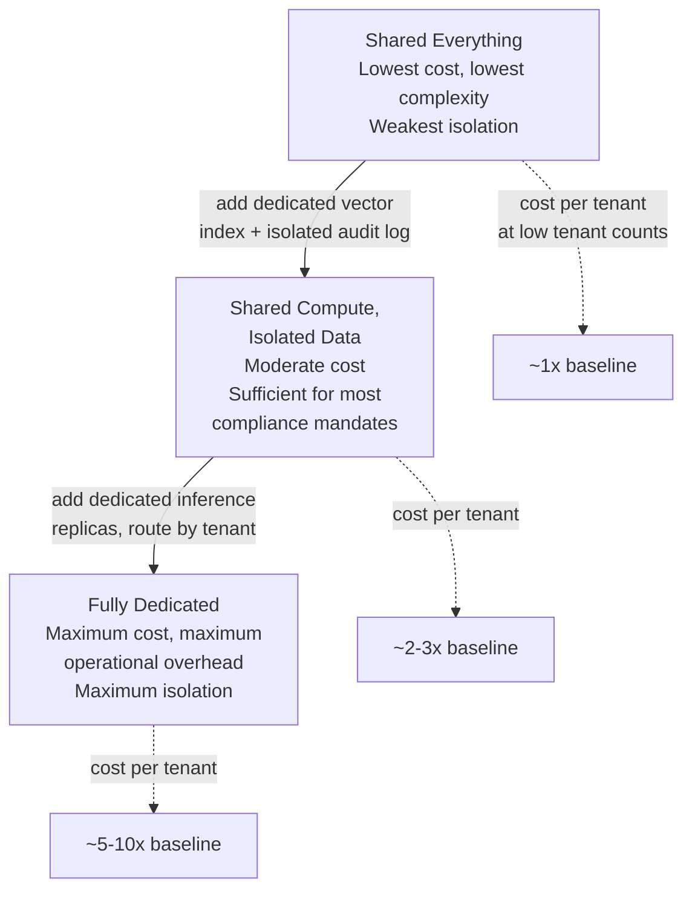
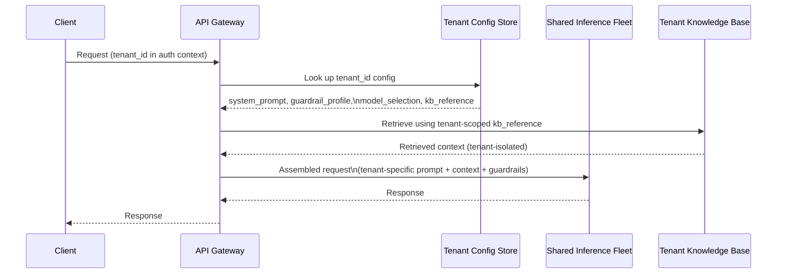
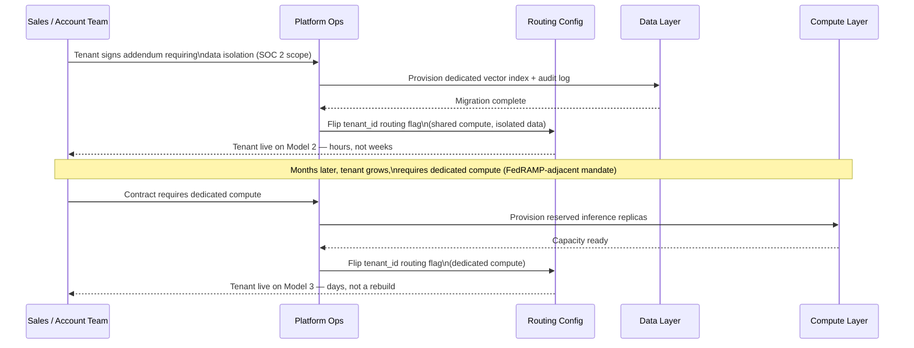

# Multi-Tenant Architecture

## Overview

Every isolation model in a multi-tenant AI platform is technically achievable — shared everything, shared compute with isolated data, or fully dedicated silos can all be built correctly. The Staff-level question is never "can we build this isolation model." It's "which isolation model does *this* tenant, at *this* stage, actually need — and how do we avoid committing to more isolation, more cost, and more operational surface than the business has confirmed it requires." Section 22's [Multi-Tenancy for AI Platforms](../22-enterprise-ai/02-multi-tenancy-for-ai-platforms.md) chapter covers how to build each isolation model: the token-bucket rate limiter, the weighted fair-share scheduler, the cost-attribution pipeline, the isolation test suite. This chapter is the decision layer that sits above that implementation — how a Staff engineer decides which model a given tenant belongs in, when to move a tenant between models, and how to avoid the two failure modes that dominate this decision in practice: over-engineering isolation the business hasn't been asked for, and under-engineering it until a regulated customer's contract is blocked eighteen months in.

## Definition

Multi-tenant architecture *decision logic* is the discipline of matching each tenant's isolation model to their actual, documented requirement — rather than the platform's default posture, engineering preference, or a hypothetical future customer — while keeping a designed, low-cost migration path available for when that requirement changes. It is a cost-placement decision as much as a technical one: every unit of isolation moves cost from the platform's shared infrastructure to a specific tenant's dedicated line item, and the Staff-level job is deciding who absorbs that cost, and when.

## The Real Question

Strip away the implementation detail and the surface question — "should this tenant be on shared or dedicated infrastructure?" — resolves to the same five-question framework from [How Staff Engineers Think](01-how-staff-engineers-think.md), applied to isolation specifically.

**The actual constraint.** It's tempting to treat "isolation" as the constraint itself, but isolation is never the real constraint — a documented compliance requirement, a signed contract clause, or a specific regulatory mandate is. A team that reaches for dedicated infrastructure because "enterprise customers expect it" hasn't named a constraint; they've named an assumption. The first job is forcing the question: does a specific, current tenant have a specific, current, written requirement for this level of isolation — or is the team pre-building for a hypothetical future one?

**Reversibility.** Isolation upgrades and downgrades are not symmetric. Moving a tenant from shared everything to shared compute + isolated data is a config change and a data migration — days, reversible. Moving a tenant onto dedicated compute is closer to a one-way door in practice, not because the infrastructure can't be torn down, but because once a tenant's contract references dedicated infrastructure, SOC 2 audit rights, or a specific SLA tied to reserved capacity, downgrading them is a commercial and trust problem, not just a technical one. The asymmetry means the cost of moving too early (over-isolating) is lower than the cost of promising too little and having no path to deliver more — which is exactly why the migration path (below) has to be designed before it's needed.

**6-month vs. 2-year cost.** Building dedicated-tenant infrastructure for a customer who never needed it costs real money every month it sits underutilized — that's a 2-year cost that compounds silently, unlike a one-time engineering cost that shows up once and is done. The inverse failure — staying on shared infrastructure past the point a tenant's compliance requirement demands isolation — has a 2-year cost too, but it's lumpier: it shows up as a blocked deal or a breached contract clause, not a steadily accumulating cloud bill.

**Blast radius.** A single tenant's isolation upgrade, done through a designed migration path, has a blast radius of one tenant. A platform-wide default of "everyone gets dedicated infrastructure to be safe" has a blast radius of the entire cost structure of the business. Conversely, a platform with *no* migration path to higher isolation has a blast radius that only reveals itself the day a regulated enterprise customer's legal team asks for something the architecture can't produce without a rebuild.

**Smallest reversible bet.** Default every new tenant to the minimum isolation model that satisfies their actual, documented requirement today. Instrument usage and revisit as the tenant grows or as their compliance posture changes — rather than debating, at signup, what a tenant might need in two years.

## Core Concepts

- **Isolation model** — one of three canonical points on the spectrum (shared everything, shared compute + isolated data, fully dedicated), each with its own cost, complexity, and isolation-assurance profile, defined in depth in [Section 22, Chapter 2](../22-enterprise-ai/02-multi-tenancy-for-ai-platforms.md).
- **Cost placement** — the decision of who pays for isolation: the platform absorbs it as shared infrastructure overhead, or a specific tenant pays for it as a dedicated line item, typically reflected in a pricing tier.
- **Isolation-cost tradeoff curve** — the relationship between how isolated a tenant's infrastructure is and how much it costs to serve them, which is not linear: the jump from shared compute to dedicated compute costs far more per tenant than the jump from shared everything to shared compute + isolated data.
- **Noisy neighbor** — the risk that one tenant's usage pattern degrades another tenant's experience on shared infrastructure; a capacity-planning problem, not an isolation problem, and the two are frequently conflated.
- **Per-tenant configuration** — the mechanism that delivers customization (system prompts, knowledge bases, guardrail profiles, model selection) without per-tenant infrastructure, by keying behavior off a config row rather than a separate deployment.
- **Migration path** — the pre-designed, low-effort sequence of steps that moves a tenant from one isolation model to the next, executable by an ops team as configuration rather than a re-architecture.
- **Isolation debt** — the AI-platform-specific analog of technical debt: a platform that promised or implied an isolation level it has no designed path to actually deliver, discovered at the worst possible moment (mid-contract-negotiation with a regulated customer).

## The Isolation-Cost Tradeoff Curve

The curve is not linear, and where it bends matters more than the fact that it rises. Three canonical points anchor it.

**Shared everything.** All tenants share the same model-serving fleet, the same vector index, the same databases. Isolation is purely logical — every document tagged with `tenant_id`, every query filtered by `tenant_id`. This is the lowest-cost, lowest-operational-complexity point on the curve, and also the weakest isolation guarantee: a single misconfigured filter is a cross-tenant leak.

**Shared compute, isolated data.** Tenants continue to share inference compute — the most expensive layer, and the one that benefits most from pooling — but get isolated data stores: a dedicated vector index (or a strictly partitioned one) and isolated audit-log storage. This is a moderate step up in cost and a large step up in isolation assurance, because it's sufficient for most enterprise compliance mandates, which are almost always about *data* isolation, not compute isolation.

**Fully dedicated.** Each tenant gets their own inference compute, their own data stores, their own logging pipeline. Maximum isolation, maximum cost, maximum operational overhead — N tenants on this tier means N deployment targets for every model update or security patch.

The key insight, and the one that generates the most avoidable cost in practice: most organizations default to too much isolation too early. At low tenant counts, dedicated infrastructure costs 5–10× the shared model's per-tenant cost — before the compliance requirement that would justify that spend has actually been confirmed in writing. Concretely: a platform with ten early tenants sharing one inference pool costing $3,000/month is paying roughly $300/tenant/month. Standing up dedicated compute for one of those ten tenants — even at modest, low-utilization sizing — commonly costs $1,800–$3,000/month for that tenant alone, because reserved capacity is paid for whether or not it's fully used. That's the 5–10× gap, paid every month, for isolation nobody has yet asked for in a contract.

The correct engineering stance is not "always start minimal" as a blanket rule — it's "start at the minimum isolation that satisfies the actual, documented compliance requirement, and upgrade tenants to higher isolation as they grow or as their requirements change." The requirement has to be documented (a contract clause, an audit finding, a signed compliance addendum) — not inferred from the size of the logo or a sales team's assumption about what "enterprise" customers expect.

## Per-Tenant Customization Without Per-Tenant Maintenance Burden

Enterprise customers ask for customization constantly: a custom system prompt, a custom knowledge base, a custom guardrail profile, a specific model selection for their use case. The instinct this triggers — "we need to deploy something different for this tenant" — is usually wrong. None of that requires separate infrastructure per tenant. It requires a per-tenant configuration database, keyed by `tenant_id`, loaded at request time by a single shared serving fleet.

One fleet, N behaviors, zero additional deployments. This is the pattern that lets a platform sell customization as a product feature without it becoming an operational tax — the config lookup adds a cache-backed round trip, not a new service to run.

The limit is real and worth naming precisely: this pattern covers prompt-level, retrieval-level, and policy-level customization, all of which are just different data loaded at request time into a shared execution path. It stops working the moment a tenant requires a genuinely custom fine-tuned model — a bespoke checkpoint, not a LoRA adapter or a prompt variant. A distinct set of model weights cannot be "config" on a shared fleet; it needs its own serving infrastructure. That single requirement is usually the actual trigger that pushes a tenant from shared compute onto dedicated compute — worth flagging explicitly during any sales conversation about "can we get our own model," because the answer changes the isolation tier, not just the product surface.

## Capacity Planning Across Tenants

Shared infrastructure only stays viable if one tenant's usage pattern can't silently degrade another's — the noisy-neighbor problem. The Staff-level framing is that this is a capacity-planning and scheduling problem, solved independently of the isolation-model decision above; even tenants correctly placed in "shared compute, isolated data" still need protection from each other's load.

Two numbers, tracked independently, are what make this tractable: **requests/second** and **tokens/minute**. Tracking only requests/second misses a real failure mode — a tenant making a small number of very long-context requests can saturate the shared pool just as completely as a tenant making many short ones, and a requests-only limit would wave that tenant straight through. The implementation is a token bucket: a bucket fills continuously at the tenant's contracted rate, and each request draws from the bucket proportional to its estimated token count (input plus expected output). When the bucket is empty, the tenant receives a `429` rather than being silently queued or, worse, allowed to degrade every other tenant on the pool.

The sizing question underneath capacity planning is where a subtle mistake creeps in: sizing the shared pool for the *sum* of every tenant's contracted peak rate is expensive and usually unnecessary, because tenants don't all peak simultaneously. The correct sizing target is the **P95 of total cross-tenant load** — the actual observed or modeled combined demand across the tenant population — not the arithmetic sum of individually negotiated ceilings. Sizing to the sum of peaks is buying capacity that sits idle nearly all the time; sizing to P95 of combined load accepts a small, bounded, and monitored risk of contention in exchange for a materially cheaper shared pool, and that tradeoff is a capacity decision, not an isolation decision — one more reason not to reach for dedicated compute as a fix for a scheduling problem it isn't designed to solve.

## Migration Paths From Shared to Dedicated as a Tenant Grows

The migration path has to be designed before a tenant needs it, not after — this is the single detail that determines whether an isolation upgrade is a Tuesday-afternoon config change or a two-quarter fire drill negotiated under contract pressure. There are two moves, and each should be executable by the ops team without touching the product's core architecture.

**Move 1: shared everything → shared compute + isolated data.** Provision a dedicated vector index (or a strictly enforced partition) for the tenant, migrate their existing documents into it, and flip a routing flag so their write path targets the new isolated store going forward. Isolated audit-log storage follows the same pattern. This is a data-migration job plus a config flag, not a deploy.

**Move 2: shared compute + isolated data → dedicated compute + isolated data.** Provision dedicated inference replicas (reserved capacity or dedicated instances) for the tenant, and update the request-routing layer to send that tenant's traffic to the dedicated pool instead of the shared fleet. Because the request-routing and serving code was already parameterized by tenant configuration (see the per-tenant config pattern above), this is a routing-table change and a capacity-provisioning ticket — not a rewrite of the serving layer.

The anti-pattern this prevents: a platform that launched on shared everything with no designed path to isolated data or dedicated compute discovers, eighteen months into a contract with a regulated enterprise customer, that delivering the isolation the deal now requires means re-architecting request routing and data storage under active deal pressure — a deal-blocking problem that a few days of upfront design work, done before any tenant needed it, would have avoided entirely.

## Decision Framework

Applying the five-question framework concretely to a specific tenant's isolation placement produces a repeatable answer instead of a debate re-litigated for every new enterprise prospect:

1. **Actual constraint** — is there a specific, written compliance requirement, contract clause, or regulatory mandate for this tenant, today? If the answer is "no, but they might ask" or "our biggest competitor offers it," that is not yet a constraint — it's a hypothesis to track, not a reason to provision.
2. **Reversibility** — moving this tenant up the isolation curve later is a designed, low-cost migration (see above) as long as the migration path exists. Moving them down is a commercial and trust problem once their contract references a specific isolation guarantee. This asymmetry is why the default should lean toward starting minimal and upgrading, not the reverse.
3. **6-month vs. 2-year cost** — what does carrying this tenant on dedicated infrastructure cost per month if their growth stalls, versus the cost of a migration ticket the day their requirement actually materializes? The idle-capacity cost of premature dedication compounds monthly; the cost of a well-designed later migration is a one-time ops task.
4. **Blast radius** — does over-isolating this one tenant set a platform-wide precedent ("well, tenant X got dedicated compute, why can't we") that erodes the tiering discipline for every subsequent deal? Rigor in holding the line scales with how visible and precedent-setting the tenant is, not just their individual contract value.
5. **Smallest reversible bet** — default to the minimum isolation tier that satisfies today's documented requirement, instrument usage and compliance conversations, and revisit at the next contract renewal or the next time the tenant's own compliance posture changes.

## Worked Example: A Three-Tier B2B SaaS Launch

A B2B SaaS AI company launches with three pricing tiers, and the isolation model for each tier is chosen to match what that tier's customer actually needs and pays for — then checked against the infrastructure cost to confirm the pricing covers it.

**Starter — $50/month: shared everything.** Target customer: small teams, low-sensitivity data, no compliance mandate. Isolation is logical only — `tenant_id`-tagged documents and filtered queries on a shared fleet and shared vector index. Infra cost: the shared inference pool and shared vector index, amortized across hundreds of Starter tenants, comes to roughly $4–6/tenant/month. Against $50/month, that's an ~88–92% gross margin on infrastructure alone — room to cover support and platform overhead, and comfortably justified because Starter customers have no isolation requirement to satisfy in the first place.

**Business — $500/month: shared compute + isolated data.** Target customer: mid-market teams whose contracts start including data-isolation language, though not compute isolation. They get a dedicated vector index namespace and isolated audit-log storage, while inference still runs on the shared fleet. Incremental infra cost over Starter: roughly $25–35/month for the dedicated vector index plus $10–15/month for isolated audit storage — call it $40/tenant/month total. Against $500/month, that's a ~92% margin, which is intentionally generous: it has to cover not just infrastructure but the compliance and support overhead of carrying data-isolation contract language (audit responses, isolation-test-suite coverage for this tenant, account management).

**Enterprise — $5,000/month: dedicated compute.** Target customer: large or regulated accounts requiring dedicated inference replicas, dedicated data stores, a dedicated logging pipeline, SOC 2 audit rights, and a GDPR Data Processing Addendum. Infra cost: dedicated reserved inference capacity at modest-to-medium volume runs roughly $1,800–2,200/month, dedicated data stores another $150–200/month, a dedicated logging pipeline $100–150/month — call it $2,100–2,500/tenant/month, before counting the amortized cost of SOC 2 audit preparation and DPA review specific to this tier. Against $5,000/month, that's roughly a 50–58% margin — visibly thinner than the lower tiers, which is expected and correct: dedicated compute is the point on the curve where cost stops being amortizable across a tenant population and starts being paid, largely, by the one tenant consuming it. The tier price has to clear that bar, and confirming it does — before selling the tier — is exactly the kind of arithmetic that prevents a sales team from pricing a $5,000/month contract under an isolation cost structure that actually runs $6,000/month to serve.

Walking the infrastructure cost against each tier's price is the concrete version of "start at the minimum isolation that satisfies the actual requirement": each tier's isolation cost is priced into what that tier's customer pays, so no tier is cross-subsidizing another tier's isolation guarantee, and no tenant ends up consuming isolation the business isn't being paid to provide.

## Tradeoffs

| Isolation model | Cost per tenant (relative) | Operational overhead | Isolation assurance | Typical fit |
|---|---|---|---|---|
| Shared everything | ~1x baseline | One fleet, one deploy target | Logical only — weakest | Early-stage, low-sensitivity, no compliance mandate |
| Shared compute, isolated data | ~2–3x baseline | Shared fleet + per-tenant data provisioning | Strong on data plane, sufficient for most enterprise mandates | The majority of paying enterprise tenants |
| Fully dedicated | ~5–10x baseline | N tenants = N deployment targets | Maximum — compute, data, and logs all isolated | Regulated, contract-mandated, or large enough to justify the cost |

| Advantages of staging isolation by documented need | Disadvantages / risks |
|---|---|
| Keeps infrastructure cost proportional to actual, paid-for requirements | Requires disciplined sales and account-management conversations to avoid promising isolation ahead of contract language |
| Preserves margin at every tier by matching cost to price | Under-communicating the isolation model to prospects can lose deals that assumed a higher tier by default |
| A designed migration path avoids a deal-blocking rebuild later | Building the migration path costs real design time upfront, before any tenant has asked for it |
| Prevents platform-wide cost bloat from over-isolating everyone "to be safe" | Requires ongoing discipline to hold the line as sales pressure pushes for exceptions |

## Cost Implications

The isolation decision is fundamentally a cost-placement decision, and getting the placement wrong shows up in two opposite, equally expensive ways. Over-isolating early means the platform absorbs dedicated-infrastructure cost — 5–10× the shared baseline per tenant — for a compliance requirement that was never actually documented, and that cost recurs every month regardless of whether the tenant ever needed it. Under-isolating late means the cost shows up as a blocked or lost deal, or as an emergency migration executed under contract pressure at a multiple of what the same migration would have cost done calmly, months earlier, on a designed path.

The worked example above shows the discipline that keeps both failure modes in check: price each tier to cover its actual infrastructure cost with margin appropriate to that tier's isolation overhead, rather than setting price by market instinct and discovering after the fact that Enterprise-tier isolation costs more than Enterprise-tier customers pay. The single highest-leverage cost lever in this domain isn't a technical optimization — it's simply not building a tenant's dedicated infrastructure until a documented requirement, not a hypothetical one, exists.

## Common Mistakes

- **Defaulting new tenants to more isolation than they've asked for.** "Enterprise customers expect dedicated infrastructure" is an assumption, not a documented requirement — verify the actual contract language before provisioning against it.
- **Building isolation upgrades with no migration path designed in advance.** A platform that can't move a tenant from shared to isolated data without a re-architecture turns a routine account-management conversation into a multi-quarter engineering project.
- **Confusing customization with isolation.** A tenant asking for a custom system prompt or knowledge base doesn't need dedicated infrastructure — it needs a config row. Reaching for infrastructure when configuration would do inflates both cost and operational surface for no isolation benefit.
- **Sizing shared capacity to the sum of tenant peaks instead of the P95 of combined load.** Tenants don't all peak simultaneously; provisioning as if they do buys capacity that sits idle almost all the time.
- **Rate-limiting only on requests/second.** Missing the tokens/minute dimension leaves the platform exposed to a tenant whose long-context requests saturate shared capacity while staying well under any request-count ceiling.
- **Pricing a tier without checking whether it covers that tier's isolation cost.** A dedicated-compute tier sold at a price that doesn't clear its own infrastructure cost is a margin problem discovered only after the contract is signed and the tenant is already provisioned.

## Real World Examples

The following are illustrative reasoning patterns consistent with each company's known public product surface, not confirmed internal decisions.

- **Salesforce**, operating one of the longest-running multi-tenant SaaS platforms, has publicly described tiering isolation by customer segment rather than applying one model uniformly — a plausible instance of the same staged-isolation discipline this chapter describes, applied at a much larger scale.
- **Snowflake and Databricks** publicly document tiered isolation options for their AI/ML platform offerings, from shared multi-tenant environments to dedicated single-tenant deployments reserved for regulated customers — an explicit, productized version of "isolation should match documented requirement, not be given away by default."
- **OpenAI and Anthropic's enterprise API tiers** sell provisioned-throughput and dedicated-capacity offerings as an explicit premium tier above standard shared API access, rather than as the default — a public instance of pricing the isolation tier to cover its own cost, consistent with the worked example above.
- **A representative early-stage AI SaaS startup** (illustrative, not any specific company) launching with three pricing tiers mirroring this chapter's worked example is a common pattern precisely because it lets a small team ship one architecture, parameterized by tenant configuration, that still serves customers ranging from self-serve trials to regulated enterprise accounts.

## Interview Questions

### Beginner

**Q: What's the difference between "shared everything" and "shared compute, isolated data," and why would a platform pick one over the other for a given tenant?**
In shared everything, tenants share both inference compute and data storage, with isolation enforced only by a `tenant_id` filter in every query — lowest cost, weakest isolation guarantee. In shared compute, isolated data, tenants still share the inference fleet (the most expensive layer) but get a dedicated or strictly partitioned data store, which satisfies most enterprise compliance mandates because those mandates are almost always about data isolation, not compute isolation. The choice between them should be driven by whether the tenant has a documented requirement for data isolation — not by assumption or by matching what a competitor offers.

**Q: Why doesn't a request for a custom system prompt or knowledge base require dedicated infrastructure for that tenant?**
Because that kind of customization is just data — a config row keyed by `tenant_id` that a single shared serving fleet reads at request time and uses to assemble the right prompt, retrieval scope, and guardrail profile. Dedicated infrastructure is only required when a tenant needs something the shared fleet structurally cannot serve, like a distinct fine-tuned model checkpoint. Reaching for infrastructure to solve a configuration problem adds cost and operational overhead without adding any real isolation benefit.

### Intermediate

**Q: A platform sizes its shared inference pool to the sum of every tenant's contracted peak rate. What's wrong with that, and what should it size to instead?**
It's expensive and largely wasted, because tenants don't all peak at the same time — sizing to the sum of individual peaks provisions for a worst case (every tenant peaking simultaneously) that essentially never occurs. The correct target is the P95 of total observed or modeled cross-tenant load, which captures realistic combined demand at a much lower cost, accepting a small, bounded, monitored risk of contention in exchange for materially cheaper shared capacity.

**Q: Why should a per-tenant rate limiter track both requests/second and tokens/minute instead of just requests/second?**
Because request count alone doesn't capture load on the shared pool — a tenant sending a small number of very long-context requests can consume as much capacity as a tenant sending many short ones, and a requests-only limit lets that tenant straight through undetected. Tracking both dimensions with a token bucket, where each request draws down the bucket proportional to its estimated token count, catches the noisy-neighbor pattern that a single-dimension limit misses.

### Senior

**Q: A mid-market tenant asks whether they can get "their own dedicated infrastructure" during a sales conversation, with no specific compliance driver mentioned. How do you respond, architecturally and organizationally?**
Architecturally, the answer is: don't provision it yet — first get the actual requirement in writing. "Dedicated infrastructure" as a request usually means one of a few underlying needs: a specific compliance certification, a perceived reliability guarantee, or simply prestige-signaling from the buyer. Each has a different right answer — a compliance requirement routes to the documented five-question framework and possibly Model 3; a reliability concern might be solved by the platform's existing SLA tier rather than dedicated infrastructure at all; prestige-signaling shouldn't drive an infrastructure decision. Organizationally, this means looping in whoever owns the sales conversation before committing, and making sure the migration path exists so that if the requirement turns out to be real, delivering it later is a config change, not a scramble.

**Q: Your platform's Enterprise tier is priced at $5,000/month, but a recent tenant on that tier is costing $6,200/month to serve in dedicated infrastructure. How do you diagnose and fix this?**
First, separate two possible causes: either this tenant's actual usage is genuinely outside the assumptions the tier price was built on (unusually high request volume or context length), or the tier's cost model was wrong from the start and every Enterprise tenant is underpriced. Check other Enterprise tenants' costs against the same $5,000 price point — if they're clustered near or under it and this one tenant is the outlier, the fix is usage-based overage billing for this tenant specifically, consistent with how the tier's contract should already be structured. If most Enterprise tenants are running over cost, the tier itself is mispriced, and the fix is a pricing correction for new contracts plus a review of whether the dedicated-compute cost assumptions used at launch (reserved instance sizing, data store costs) still hold at current cloud pricing.

### Staff

**Q: You're advising a platform team that's about to build dedicated-tenant infrastructure for their first large enterprise prospect, before the deal is signed. What do you tell them?**
I'd apply the five-question framework directly. The actual constraint: is there a signed or near-final contract clause specifying dedicated compute, or is the team building ahead of a deal that might not close on those terms? If it's the latter, building now is spending real, recurring infrastructure cost against a hypothesis, not a requirement. Reversibility: building dedicated infrastructure that never gets used is cheap to tear down technically, but the deeper cost is opportunity cost — the engineering time spent standing it up early could have gone toward the migration-path work that makes building it *when the deal signs* fast enough not to matter. 6-month/2-year cost: idle dedicated capacity costs 5–10× the shared baseline every month it sits unused; that's a real, compounding number, not a rounding error. Blast radius: if this becomes the pattern — build ahead of signature for every prospect that asks — the platform's cost structure degrades for every tenant, not just this one deal. My recommendation would almost always be: don't build it yet. Instead, invest in the migration path (the routing and provisioning automation that makes standing up dedicated compute for a signed tenant a days-long ops task, not a rebuild), and time the actual provisioning to contract signature. If the sales team is worried about proving feasibility to the prospect, a design doc and a cost estimate demonstrate the capability without paying to run it early.

**Q: How do you decide, at a platform level, when it's time to formalize a fourth isolation tier rather than stretching the existing three?**
This is a blast-radius and repeated-pattern question more than a technical one. A single tenant asking for something between Model 2 and Model 3 — say, isolated compute but shared data, or a specific hybrid — doesn't justify a new tier; it's cheaper to solve as a one-off configuration within the existing framework. The signal that a fourth tier is warranted is when multiple, unrelated tenants converge on the same specific gap the three-tier model doesn't cover, and sales or account management is repeatedly improvising the same workaround. At that point, the cost of continuing to solve it ad hoc (inconsistent contracts, inconsistent infrastructure, no reusable migration path) exceeds the cost of formalizing a fourth tier: defining its isolation model precisely, pricing it against its actual infrastructure cost the way the worked example does for the existing three, and building the migration path into and out of it. The discipline is the same five-question framework applied one level up — don't add platform complexity for a single tenant's request, but don't keep improvising once the pattern repeats enough that the improvisation itself has become the expensive part.

## Google-Level Follow-Ups

- "You defaulted a new Enterprise prospect to shared compute, isolated data, and they walked because a competitor promised dedicated infrastructure in the sales call. Was the isolation decision wrong?" — probes whether the candidate can distinguish a correct architecture decision from a lost deal, and recognizes the fix is usually in the sales conversation or the migration-path story, not in over-provisioning by default.
- "Your migration path from shared to dedicated compute is a config flag and a provisioning ticket, as designed. A tenant needs the migration executed in four hours for a same-day compliance audit. Does the design hold?" — probes whether the candidate treats 'the migration path is fast' as a tested operational capability with a measured SLA, or an untested assumption that only gets discovered under pressure.
- "Two teams inside the same platform independently built isolated-data provisioning for their own product surface, because neither knew the other had solved it. How does the isolation-decision framework prevent this?" — probes whether the candidate connects this back to the blast-radius-mapping discipline from [How Staff Engineers Think](01-how-staff-engineers-think.md) — this is a duplicated-build problem the framework is supposed to catch upstream, not an isolation-model problem specifically.
- "At what tenant count does per-tenant rate limiting itself become the bottleneck, and what changes?" — probes whether the candidate can reason past the isolation-model decision into the operational scaling of the mechanisms underneath it (config lookup latency, token-bucket state at high tenant cardinality), rather than treating the decision framework as the end of the analysis.

## Key Takeaways

- Every isolation model is technically achievable; the Staff-level question is where to place the cost (platform-absorbed vs. tenant-paid) and when to incur it, not whether it can be built.
- Dedicated infrastructure costs roughly 5–10× the shared model's per-tenant cost at low tenant counts — the default stance should be starting at the minimum isolation that satisfies a documented requirement, then upgrading as that requirement changes.
- Per-tenant customization (prompts, knowledge bases, guardrails, model selection) is a configuration problem solvable on a single shared fleet, and does not require dedicated infrastructure — until a tenant needs a genuinely distinct fine-tuned model, which is the real trigger for dedicated compute.
- Capacity planning across tenants is a scheduling problem, solved with two-dimensional (requests/second and tokens/minute) token-bucket rate limiting and pool sizing to the P95 of combined load, not the sum of individual peaks — and it is independent of the isolation-model decision.
- The migration path from shared to dedicated must be designed before any tenant needs it; a platform with no such path turns a routine isolation upgrade into a deal-blocking rebuild under contract pressure.
- Pricing each tier against its actual infrastructure cost — as the three-tier worked example shows — is what prevents a platform from selling an isolation guarantee it isn't being paid enough to deliver.
- The same five-question framework from [How Staff Engineers Think](01-how-staff-engineers-think.md) — actual constraint, reversibility, 6-month/2-year cost, blast radius, smallest reversible bet — applies directly to isolation-tier placement; the implementation mechanics of each tier live in [Multi-Tenancy for AI Platforms](../22-enterprise-ai/02-multi-tenancy-for-ai-platforms.md).

---

*Part of [Staff-Level Architecture](index.md) in the [AI System Design Notes](../index.md). Tracked in [BACKLOG.md](https://github.com/GyanendraChaubey/AI-System-Design-Notes/blob/main/BACKLOG.md).*
