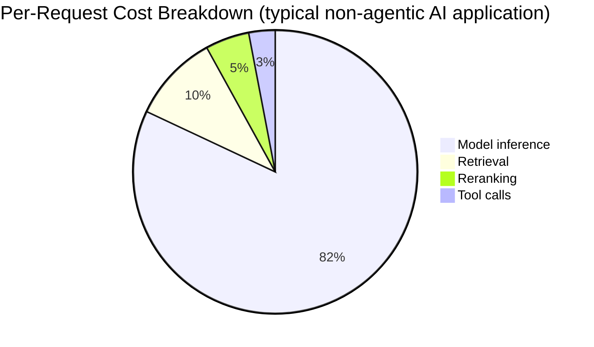
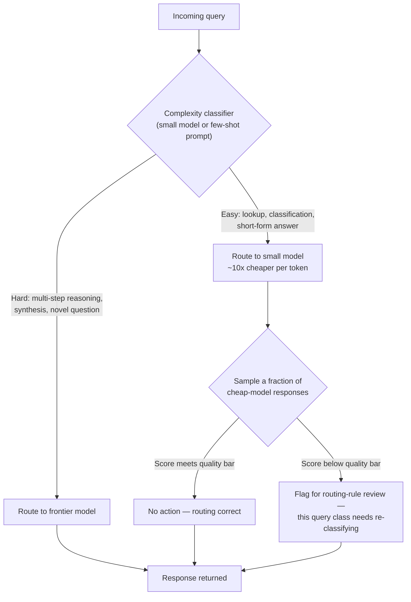
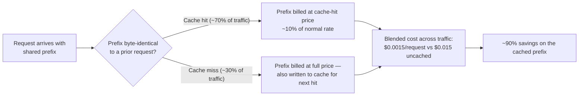
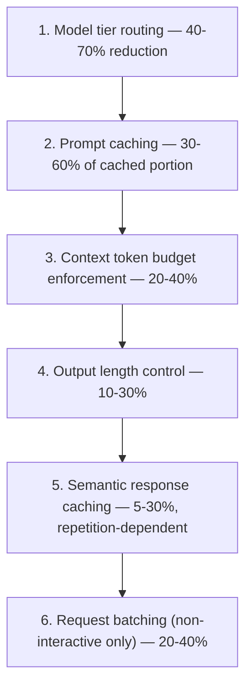

# Cost Engineering

## Overview

This chapter treats AI cost as an engineering problem with specific, rankable, measurable levers — not a finance problem solved by negotiating vendor discounts. The core argument: the same discipline applied to [Latency Engineering](08-latency-engineering.md) — identify the bottleneck, apply the lever with the highest impact, measure, repeat — applies to cost. Most teams skip this discipline entirely. They either accept runaway cost as the price of doing business with frontier models, or they reach for the wrong lever first: calling the vendor to negotiate a volume discount before they've exhausted the engineering levers that would have cut the bill by 70% for free. A 10% negotiated discount on a bill that could have been cut by 70% through routing and caching is optimizing the wrong variable, in the same way [How Staff Engineers Think](01-how-staff-engineers-think.md) names optimizing the easiest-to-measure constraint instead of the real one as a recurring failure mode.

## Definition

Cost engineering, in the AI systems context, is the practice of measuring where inference spend actually goes at the request level, then applying a ranked set of engineering interventions — model routing, caching, context management, output shaping, batching — to reduce cost per unit of value delivered, with each intervention's effect on quality explicitly measured before and after. It is distinct from procurement (negotiating unit price) and from capacity planning (provisioning compute); it operates on the request path itself, and its unit of success is dollars per request, not total dollars spent.

## Problem Statement

AI inference cost has a property that most infrastructure cost does not: it scales linearly and immediately with usage, with no economy-of-scale curve bending it downward the way amortized hardware or negotiated committed-use discounts do for traditional compute. A traditional web service that grows 10× in traffic might see its per-request infra cost fall as fixed costs amortize across more requests. An AI service that grows 10× in traffic sees its inference bill grow roughly 10×, because every request pays for its own tokens at a near-fixed marginal rate. This means cost discipline has to be engineered into the request path itself — it cannot be fixed later by a platform team buying more capacity, and it does not improve on its own as the product matures.

The failure mode this produces is predictable: a team ships a RAG-based feature with a working prototype, the prototype's cost looks trivial at demo volume (a few dollars a day), and nobody revisits the cost structure until a finance review six months later reveals the feature now costs $80,000 a month at production scale. At that point the fix requires an architecture review under pressure, on a system three teams now depend on — exactly the scenario [How Staff Engineers Think](01-how-staff-engineers-think.md) describes as decision debt: a gap in the reasoning at commit time, revisited later at a much higher cost than if it had been addressed up front. Cost engineering exists to catch this before the finance review, by treating "what does this cost per request, and why" as a first-class question at design time, not an afterthought discovered in a billing dashboard.

## Core Concepts

- **Cost attribution** — breaking a single request's dollar cost down by component (model inference, retrieval, reranking, tool calls) before attempting to optimize any of them. Optimizing a component that isn't the dominant cost driver is wasted engineering effort.
- **Cost per request** — the unit that actually matters for detecting regressions; total cost rising with traffic is healthy business growth, cost per request rising is an engineering regression.
- **The routing asymmetry** — the fact that the two failure directions of a cost lever are not symmetric in consequence: sending a hard query to a cheap model produces a quality regression a user notices, while sending an easy query to an expensive model only wastes money silently. Every cost lever in this chapter has some version of this asymmetry, and it determines which failure direction to bias toward when a lever is uncertain.
- **Cache hit rate** — the fraction of requests where a cost-saving shortcut (a cached prompt prefix, a cached response) applies; every caching-based lever's savings are a direct function of this number, and it must be measured, not assumed.
- **Marginal token cost** — the fact that every token, input or output, has a near-fixed dollar cost at a given model tier, which is why token count is the primary lever surface, not a secondary detail.
- **Quality-cost frontier** — the curve describing, for a given task, the cheapest model/configuration that still clears the required quality bar; the goal of cost engineering is to operate on this frontier, not below it (which loses quality) and not above it (which wastes money).

The typical cost structure of an AI request breaks into four components, and the relative magnitude of each determines which lever is worth pulling first. Model inference — input tokens times price, plus output tokens times price — is almost always the dominant term, typically 70–90% of total per-request cost. Retrieval, meaning the embedding call plus the approximate-nearest-neighbor query against the vector index, typically runs 5–15%. Reranking, the cross-encoder pass over retrieved candidates, typically runs 2–10%. Tool calls — external API calls, sandboxed code execution, function-calling round trips — are the most variable component, ranging from effectively 0% in a simple Q&A bot to over 50% in an agentic workflow that makes many tool calls per user turn.

The practical implication of this breakdown is the single most important discipline in this chapter: every cost optimization effort should start with a verified, measured cost attribution for the specific application in question, not an assumption carried over from a different system. A team that spends a sprint optimizing retrieval latency and cost when model inference is 85% of the bill has improved a component that couldn't move the total by more than a few percent, no matter how well it's optimized — the equivalent, in latency terms, of shaving milliseconds off a fast path while the slow path dominates end-to-end time. Measure first. Rank levers by their share of the actual bill, not by which component is most interesting to optimize.

## The Levers in Depth

The levers below are ordered by typical impact, based on how much of the per-request bill each one can realistically move for a representative RAG or agentic application. This ordering is a starting point, not a universal law — an application with heavy tool-call cost should re-rank accordingly after running its own attribution — but for the common case where model inference dominates, this order reflects where the leverage actually is.

### 1. Model Tier Routing (typically 40–70% cost reduction)

Routing 70–80% of requests to a model that costs an order of magnitude less, with no quality regression on those requests, is the single most impactful cost lever available, because it acts directly on the component that is 70–90% of the bill. The mechanism: a lightweight classifier — either a small trained model or a few-shot prompt sent to a cheap model — estimates query complexity before the expensive model is invoked. "Easy" requests (simple lookups, short-form answers, well-defined classification tasks) route to a small, cheap model. "Hard" requests (multi-step reasoning, synthesis across sources, genuinely novel questions the classifier hasn't seen the shape of) route to the frontier model.

The routing asymmetry matters here more than in any other lever: routing a genuinely hard query to the cheap model produces a wrong or degraded answer a user experiences directly — a quality regression. Routing an easy query to the expensive model only wastes money, invisibly, with no user-facing symptom. Because the failure directions are asymmetric in consequence, the classifier should be tuned conservatively — biased toward escalating borderline cases to the frontier model rather than risking a quality miss on the cheap path. This means the achievable cost reduction is somewhat lower than a naive split would suggest, but it protects the quality bar the routing exists to preserve.

Evaluating routing accuracy requires the same eval discipline named in [How Staff Engineers Think](01-how-staff-engineers-think.md): a held-out labeled set of queries with a ground-truth "should this have been easy or hard" label, checked against the classifier's actual routing decision, with a false-easy rate (hard queries misrouted to the cheap model) tracked separately from a false-hard rate (easy queries misrouted to the expensive model) — because only the first one costs quality. The ongoing monitoring signal is a continuous sample: score a fraction (commonly 5–10%) of cheap-model responses against the expected quality bar using the same rubric the eval suite uses, and treat a drop in that sampled score as a routing-rule regression, not a model regression.

### 2. Prompt Caching (typically 30–60% savings on the cached portion)

For any request with a large shared prefix — a system prompt, a retrieved knowledge-base preamble, persistent tool definitions or instructions — prompt caching eliminates most of the input token cost for that prefix on cache hits. Anthropic charges roughly 10% of the normal input token price for cache hits; OpenAI charges roughly 50% for cached tokens. The saving is proportional to how large the shared prefix is relative to the total prompt, and how often it repeats byte-for-byte across requests.

Worked example: a 5,000-token system prompt at $3/M input tokens. Without caching, every request pays the full price on that prefix: 5,000 × $3/M = **$0.015/request**. With caching at a 70% cache hit rate, and a cache-hit price of $0.30/M (10% of normal): 0.7 × 5,000 × $0.30/M + 0.3 × 5,000 × $3/M = $0.00105 + $0.00045 = **$0.0015/request**. That is a 90% reduction on the cached prefix specifically — the direct consequence of Anthropic's cache-hit pricing being 10% of the standard rate.

The implementation requirement is strict and easy to violate silently: the cached portion must come first in the prompt, and it must be byte-identical across requests — a single differing character (a timestamp, a request ID, a reordered instruction) invalidates the cache and every request becomes a full-price miss. Any personalization, retrieved content that varies per request, or conversational history must go after the cached prefix, not interleaved with it. Teams that discover their cache hit rate is near zero almost always find the cause is a per-request variable accidentally placed inside the supposedly-static prefix.

### 3. Context Token Budget Enforcement (typically 20–40% savings)

The default behavior of many RAG implementations is to include as many retrieved chunks as fit in the context window, on the theory that more context can only help. This is expensive and frequently false. At 8,192 tokens of retrieved context per request versus 4,096 tokens, the input token cost on that portion exactly doubles — 8,192 / 4,096 = 2× — while retrieval-quality research consistently shows marginal answer-quality improvement flattens out well before the top-10 or top-15 chunk mark, and can even decline past a certain point as low-relevance chunks compete for the model's attention with the genuinely relevant ones.

The fix is a strict token budget enforced at retrieval time: include only the top-K chunks that pass a minimum relevance threshold — for example, a reranker score above 0.7 — rather than a fixed top-K regardless of relevance. A query with three highly relevant chunks should send three chunks; a query with only one relevant chunk in the entire index should send one, not pad out to a fixed count with low-relevance filler. Low-relevance chunks are not free insurance against missing information — they cost money on every request, and they can measurably confuse the model into synthesizing from the wrong source.

### 4. Output Length Control (typically 10–30% savings)

For tasks where the output structure is predictable — classification, structured extraction, yes/no decisions — constraining the output format reduces output tokens dramatically, and output tokens are typically priced 4–5× higher than input tokens, which makes this lever disproportionately effective per token saved. A classification task that returns a compact structured object like `{"category": "billing", "confidence": 0.93}` costs roughly 15 output tokens. The same task returning a natural-language explanation of the classification ("Based on the content of this message, I believe this falls under the billing category because...") costs 100–200 output tokens for an identical underlying result. At $15/M output tokens, 15 tokens costs $0.000225/request; 100–200 tokens costs $0.0015–$0.003/request — a 7× to 15× difference in output cost for the same task outcome.

The lever is straightforward to apply — a structured output schema or a strict system instruction to omit explanation — but the risk to watch is over-constraining tasks that genuinely need explanatory output (a customer-facing answer, not an internal classification label). This lever is highest-leverage specifically on internal, structured, non-user-facing outputs where verbosity was never adding value in the first place.

### 5. Semantic Response Caching (5–30%, highly variable with query repetitiveness)

For applications with meaningful query repetition — FAQ bots, standard lookup queries, support flows with a bounded set of common questions — caching the full LLM response, keyed by a semantic hash of the query rather than an exact string match, avoids model inference entirely on cache hits. The mechanism: embed the incoming query, look up nearest neighbors in the response cache, and if a match is found above a similarity threshold, return the cached response without calling the model at all.

Two things need explicit management. First, correctness risk: a cached response becomes stale the moment the underlying knowledge base updates, so cache TTL must be matched to knowledge-base update frequency — a pricing FAQ that updates monthly needs a cache TTL measured in days, not weeks, or the cache will confidently serve outdated pricing. Second, realistic expectations on hit rate: conversational applications with open-ended user phrasing typically see only 5–15% cache hit rates, because genuine query diversity is high; FAQ-style applications with a bounded, well-known question set can see 20–40%. Teams that budget for a 40% hit rate on a conversational assistant and get 8% in production have usually mis-scoped which category their application falls into.

### 6. Request Batching for Non-Interactive Workloads (typically 20–40% cost reduction)

For workloads without a real-time latency requirement — document indexing, batch evaluations, background summarization — batching requests together enables higher GPU utilization on the serving side and correspondingly lower per-token pricing (most providers offer a dedicated batch API at a meaningfully lower rate than the synchronous endpoint, commonly around half the per-token cost). The tradeoff is latency: a 50-document batch job submitted at off-peak hours to a shared batch inference pool costs significantly less per token than running the same 50 documents as individual real-time requests, but it returns results on a completion window of minutes to hours, not seconds. This lever only applies where the product doesn't need the answer immediately — using it on a user-facing interactive path trades away responsiveness for a savings the user experience can't absorb.

### Worked Example: Combining the Levers

Consider a support bot handling 500,000 requests/day, with 800 input tokens per request (a 500-token system prompt, a 300-token user message plus history) and 200 output tokens, served on a model priced at $3/M input and $15/M output tokens.

**Baseline daily cost**: 500,000 × (800 × $3/M + 200 × $15/M) = 500,000 × ($0.0024 + $0.003) = 500,000 × $0.0054 = **$2,700/day**.

**Apply prompt caching** on the 500-token system prompt at a 70% cache hit rate and 10% cache price: savings = 500,000 × 0.7 × 500 × $2.7/M (the per-token savings on a hit, $3/M − $0.3/M) = **$472.50/day**.

**Apply model tier routing**, with 60% of queries (300,000/day) routable to a model roughly 10× cheaper with no quality loss on those requests: savings = 300,000 × (800 × $3/M + 200 × $15/M) × (1 − 0.1) = 300,000 × $0.0054 × 0.9 = **$1,458/day**.

**Combined effect**: $2,700/day − $472.50 − $1,458 ≈ **$770/day** — roughly a **70% cost reduction**, achieved without any quality change for the requests that were routed or cached, because both levers were applied to the subset of traffic where they carry no quality risk. This is the pattern a cost engineering effort should produce: a large, measurable reduction with an explicit accounting of which requests were affected and why quality was preserved on each one — not a single blended number with no attribution behind it.

## The Cost Dashboard

The dashboard a team will actually use day-to-day is not a total-spend graph — total spend rising is compatible with a perfectly healthy, growing product. The right primary unit is **cost per request**, tracked as a daily P50 (and P90, to catch a fat tail of unusually expensive requests a P50 would hide). A cost-per-request line that climbs while traffic is flat is an engineering regression — a prompt that grew, a cache that stopped hitting, a routing rule that quietly started sending more traffic to the expensive tier — and it should page the team the same way a latency regression would.

Beyond the headline number, four supporting views make the dashboard actionable rather than just descriptive:

- **Cost per feature** — which product surfaces consume disproportionate cost relative to their usage. A "summarize my full document history" feature might represent 2% of total requests but 30% of total cost, because its input context is an order of magnitude larger than a typical query — a fact invisible in a total-spend or even a per-request-average view, and only visible once cost is sliced by feature.
- **Cost per tenant** — essential in any multi-tenant deployment (see [Multi-Tenant Architecture](06-multi-tenant-architecture.md)); without it, a single high-usage tenant's cost is invisibly subsidized by the aggregate, until a pricing or margin review discovers that tenant is unprofitable at their current plan tier.
- **Cache hit rate**, tracked per cache type (prompt cache, semantic response cache) — the direct leading indicator for whether the caching levers above are actually delivering their modeled savings in production, versus degrading silently because a prefix stopped being byte-identical.
- **Model tier distribution** — the percentage of requests routed to each model tier over time, which is the leading indicator for the routing lever's health; a sudden shift toward the expensive tier, with no change in the underlying query mix, points at a routing classifier regression before it shows up as a cost spike.

## When Optimization Creates Regressions

Every lever in this chapter buys cost savings by making a decision that can be wrong, and the failure mode for each is a specific, predictable quality regression rather than a system outage — which makes it easy to miss without deliberate monitoring, because nothing crashes.

| Lever | How it creates a regression | Monitoring signal to catch it |
|---|---|---|
| Model tier routing | Classifier miscategorizes a genuinely hard query as easy, and the cheap model produces a degraded or wrong answer | Sampled quality scoring on cheap-model responses (5–10% of that traffic), false-easy rate on a labeled eval set |
| Context token budget enforcement | Aggressive pruning drops the one chunk that actually contained the answer | Retrieval recall@K on a held-out eval set, tracked after any budget change, not just at launch |
| Output length control | Capping output length truncates answers for queries that legitimately require a longer response | Truncation rate (responses hitting the token cap), user-reported "answer got cut off" signal |
| Semantic response caching | Cache TTL outlasts the knowledge base's actual update cycle, serving a stale answer with high confidence | Cache-age distribution at serve time, cross-checked against the knowledge base's last-updated timestamp |
| Prompt caching | Not a quality risk directly, but a silent cost regression if the "cached" prefix stops being byte-identical and every request becomes a full-price miss | Cache hit rate trending toward zero with no corresponding traffic change |

The general principle underneath this table: a cost lever should never be deployed without a paired quality metric that would catch its specific failure mode, because a cost lever, by construction, is spending less compute per request — and less compute is the one resource a model cannot make up for with better judgment.

## Tradeoffs

| Lever | Cost savings | Quality risk if misapplied | Engineering effort to build |
|---|---|---|---|
| Model tier routing | 40–70% | High — the routing asymmetry means a misclassified hard query is a visible quality miss | Medium — needs a classifier and an ongoing eval loop |
| Prompt caching | 30–60% of cached portion | Low — mostly a cost-regression risk, not quality, if cache hit rate degrades | Low — prompt restructuring plus provider cache flag |
| Context token budget enforcement | 20–40% | Medium — aggressive pruning can drop the answer-bearing chunk | Low-Medium — threshold tuning against a retrieval eval set |
| Output length control | 10–30% | Medium — truncation risk on legitimately long-form tasks | Low — schema constraints or system instruction |
| Semantic response caching | 5–30%, repetition-dependent | Medium-High — staleness risk scales with how fast the knowledge base changes | Medium — needs embedding infra, similarity threshold tuning, TTL policy |
| Request batching | 20–40% | Low on quality, but not usable on latency-sensitive interactive paths at all | Low-Medium — mostly a scheduling/queueing change |

## Scalability

Cost engineering's own scaling story mirrors the levers it recommends: the mechanism that works at small scale becomes the wrong mechanism at large scale, and the transition point is worth naming explicitly.

- **At low request volume** (a few thousand requests/day), the absolute dollar savings from any of these levers are small enough that engineering time is better spent on product quality than on cost — a $200/month bill doesn't justify a routing classifier's build and maintenance cost.
- **At moderate volume** (hundreds of thousands of requests/day, the worked example's scale), the ranked-lever approach in this chapter applies directly: attribute cost, apply the top two or three levers, measure the combined effect, and the $2,700/day → $770/day result is realistic and repeatable.
- **At very high volume** (tens of millions of requests/day), the marginal value of routing accuracy compounds — a routing classifier that's 2 percentage points more accurate is worth proportionally more in absolute dollars — which justifies investing in a purpose-trained routing classifier rather than a few-shot prompt, and justifies building a dedicated semantic cache infrastructure rather than a lightweight lookup table.
- **Across a multi-tenant platform** (see [Multi-Tenant Architecture](06-multi-tenant-architecture.md)), the highest-leverage move shifts from optimizing any single tenant's request path to setting cost-aware defaults platform-wide — a shared prompt-caching convention, a shared routing classifier — so that every new tenant inherits the cost discipline instead of every team re-deriving it, the same platform-default pattern [How Staff Engineers Think](01-how-staff-engineers-think.md) describes for architecture decisions generally.

## Cost Optimization

Running an actual cost optimization initiative, as opposed to reading about levers, has its own operating discipline distinct from the technical mechanics of any single lever:

- **Attribute before you optimize.** Every initiative should start with a measured cost breakdown for the specific application, not an assumed one — the 70–90% model inference figure is typical, not universal, and an agentic application with heavy tool use can look completely different.
- **Rank levers by measured share of the bill, then by ease of implementation.** A lever that could save 40% but requires a classifier and an ongoing eval loop is not automatically the first thing to build if a 20-minute prompt-restructuring change captures a 50% caching win with near-zero engineering cost.
- **Model every lever's savings before building it**, the way the worked example above does — a back-of-envelope calculation using real production token counts and real pricing catches a lever that isn't worth the engineering effort before any code is written, not after.
- **Pair every cost lever with the quality metric that would catch its specific regression**, from the table in [When Optimization Creates Regressions](#when-optimization-creates-regressions) — a lever shipped without its paired metric is a cost win with an invisible quality cost waiting to surface.
- **Treat cost-per-request as a release-blocking metric**, the same way a latency SLO gates a release — a change that increases cost-per-request by 15% with no corresponding quality gain should fail review exactly like a latency regression would.
- **Revisit the attribution periodically, not just at initiative kickoff** — a feature mix that shifts over six months (more summarization, less simple lookup) changes which lever has the most leverage, and a cost dashboard that isn't watched will miss the drift.

## Monitoring

- **Cost per request, P50 and P90, daily** — the primary regression-detection signal; a P90 spike with a flat P50 usually means a small number of unusually large requests (long documents, long conversation histories) rather than a systemic issue.
- **Cache hit rate by cache type**, alerted on a threshold drop — the single fastest-to-detect, easiest-to-fix regression category in this chapter, since a cache hit rate collapse is almost always a prefix byte-identity break, fixable in one line once found.
- **Model tier distribution over time** — a shift toward the expensive tier with no corresponding shift in query mix is the leading indicator of a routing classifier regression, visible well before it shows up as a dollar-cost spike on the dashboard.
- **Sampled quality score on cost-optimized traffic** — routed-to-cheap-model responses and cache-served responses both need an ongoing sampled quality check, not just a launch-time validation, because query mix and knowledge-base content both drift over time.
- **Cost per feature and cost per tenant**, reviewed on a recurring cadence (not just when someone asks) — the mechanism that catches the disproportionate-cost feature or tenant before it becomes a finance-review surprise.
- **Truncation rate and cache-staleness rate** — the specific leading indicators for the output-length and semantic-caching regression modes respectively, both invisible in a pure cost or latency view.

## Production Best Practices

- Measure cost attribution before writing any optimization code — the four-component breakdown (inference, retrieval, reranking, tool calls) takes an afternoon of instrumentation and prevents a sprint spent on the wrong lever.
- Apply model tier routing and prompt caching first in the common case where model inference dominates — they carry the highest ratio of savings to engineering effort for a typical RAG or chat application.
- Ship every cost lever with its paired quality metric from day one, not as a follow-up — a lever without its regression signal is a cost win with a hidden, undetected quality cost.
- Enforce byte-identical prefixes for cached prompts through a lint check or a structured prompt-builder, not developer discipline alone — a single accidental per-request variable inside the cached region silently zeroes out the caching lever's entire benefit.
- Track cost per request as a release-blocking metric alongside latency and quality, so a regression is caught in review rather than discovered a month later in a billing dashboard.
- Set explicit hit-rate and cost-reduction targets before building a caching or routing lever, and compare actual production numbers against the target — a caching lever built on an assumed 40% hit rate that actually achieves 8% in production is a wasted build if nobody checks.
- Revisit the cost attribution on a quarterly cadence at minimum — feature mix, traffic patterns, and model pricing all shift, and a lever ranking done once at launch goes stale.

## Real World Examples

The following are illustrative reasoning patterns consistent with each company's known public product surface — not confirmed internal decisions.

- **Google**: at Google's request volume inside a Gemini-powered Search feature, a plausible cost lever is aggressive model tier routing between a small, fast model for the large majority of straightforward queries and a larger model reserved for genuinely complex reasoning — because at billions of queries a day, even a few cents of per-request savings compounds into a figure large enough to justify substantial investment in routing classifier accuracy.
- **OpenAI / Anthropic**: both labs' own API platforms are a natural home for prompt caching as a first-class product feature (which is exactly what both have shipped) rather than an opt-in customer optimization, because the labs can see in aggregate that a large fraction of API traffic shares long, static system-prompt prefixes across many customers' applications — making the caching lever's savings-to-effort ratio unusually favorable to expose as a platform primitive.
- **Perplexity**: a search-answering product with per-query cost pressure at consumer scale is a plausible candidate for tiered model routing keyed on query complexity — a simple factual lookup routed to a cheap model, a multi-source synthesis question routed to a frontier model — since the alternative (frontier model on every query) doesn't hold up economically at free-tier consumer volume.
- **Glean**: a connector-heavy enterprise search product with a multi-tenant customer base is a natural fit for cost-per-tenant tracking as a first-class dashboard, not an afterthought — because tenant usage patterns vary enormously (a tenant with heavy document-summarization usage looks nothing like one doing simple lookup), and a platform-wide average would hide which tenants are actually profitable at their contracted price.
- **Cursor**: a coding assistant with extremely high request volume per active user (autocomplete-style suggestions fire far more often than chat turns) is a plausible case for output length control and aggressive context budget enforcement as primary levers, since the per-suggestion economics only work if each individual completion request stays cheap — a single verbose completion multiplied across millions of keystroke-triggered requests would be the dominant cost driver.

## Interview Questions

### Beginner

**Q: Why is "cost per request" a better metric to track than total daily spend?**
Total spend conflates two very different signals: a business growing (more requests, more revenue, proportionally more spend — healthy) and an engineering regression (the same request volume now costing more per request — unhealthy). Cost per request isolates the second signal from the first, which is what actually needs an engineering response. A team watching only total spend will miss a 30% per-request cost regression entirely if traffic happens to be flat that week, and will falsely alarm on rising total spend during a legitimate traffic-growth period.

**Q: What's the difference between optimizing cost through engineering levers and optimizing it through vendor negotiation?**
Vendor negotiation changes the unit price of tokens — a fixed percentage discount applied uniformly to whatever the system already consumes. Engineering levers (routing, caching, context management, output shaping) change how many tokens the system consumes and at what price tier, which is typically a much larger effect: a 10% negotiated discount is smaller than the 40–70% reduction available from model tier routing alone, and the two are not mutually exclusive — engineering levers should be exhausted first because they're usually higher-leverage, and a negotiated discount then applies on top of the reduced baseline.

### Intermediate

**Q: Walk through how you'd approach a support bot whose inference bill has tripled over the last quarter with no corresponding traffic increase.**
Start with cost-per-request, not total spend, to confirm this is a regression and not a traffic artifact — tripled spend on flat traffic means cost-per-request roughly tripled too. Then check cost attribution: has the request shape changed (longer conversation histories being included, a new feature retrieving more chunks), has a cache hit rate collapsed (check whether a recent prompt change broke prefix byte-identity), or has the model tier distribution shifted toward the expensive tier (a routing classifier regression, or a routing rule quietly disabled). Each of these has a distinct, checkable signal, and the fix is specific to which one turns out to be the cause — this is the same attribute-before-optimize discipline as any cost investigation, just applied retroactively to a regression instead of proactively at design time.

**Q: How would you decide whether prompt caching is worth implementing for a given application?**
Model the savings before building anything: measure the shared prefix's token count and how often it repeats byte-identical across real production requests (not assumed — measured), apply the provider's cache-hit discount rate to that repeat frequency, and compare the resulting dollar savings against the engineering cost of restructuring the prompt so the cached portion comes first and stays byte-identical. For an application with a large, genuinely static system prompt and high query volume, this is almost always worth it at low engineering cost; for an application where every prompt is substantially personalized per request with little shared static content, the achievable cache hit rate may be too low to justify the restructuring effort.

### Senior

**Q: You've implemented model tier routing and it's saving 55% on inference cost, matching your projection. Three months later, a support escalation reveals the cheap-tier model has been giving subtly wrong answers on a query type nobody was sampling. How did this happen, and what would you change?**
This is the routing asymmetry playing out exactly as expected: a misrouted hard query produces a silent quality miss, not a crash, so it doesn't surface until a human notices a pattern of wrong answers. The root cause is almost certainly a monitoring gap — the sampled quality check either wasn't covering that query type's distribution, or the sample rate was too sparse to catch a low-frequency-but-consistent failure mode. The fix has two parts: first, use the escalation to build a new eval case covering that specific query type and re-tune the routing classifier's boundary so it stops classifying that pattern as easy; second, treat the underlying gap as systemic rather than a one-off — the sampled monitoring should be stratified by query type or intent category, not a single uniform random sample, since a uniform sample under-covers rare-but-important query classes exactly like the one that caused this incident.

**Q: A teammate proposes negotiating a larger volume discount with the model provider as the team's primary cost initiative this quarter. How do you respond?**
The response isn't "no" — it's "let's measure what the engineering levers get us first, because they're likely larger and don't require a multi-month vendor negotiation cycle." Concretely: run the cost attribution, model the savings from routing and caching using real production numbers the way the worked example in this chapter does, and put a number next to the volume-discount option (a typical negotiated discount is single-digit-to-low-double-digit percent) versus the engineering levers (often 40–70% combined). If the engineering levers get to 70% and the negotiated discount would add another 10% on top of the reduced baseline, both are worth doing — but the sequencing matters, because negotiating a discount on an un-optimized baseline anchors the vendor conversation on a number that's about to shrink anyway, and the engineering work is squarely inside the team's own control on a timeline the team sets, not the vendor's.

### Staff

**Q: You inherit a system where cost has grown 4x over a year, traffic has grown 2x, and nobody can explain the other 2x. How do you approach this, and how do you prevent it from recurring?**
The immediate diagnosis follows the attribution discipline: cost-per-request has doubled, which means something changed in the request path itself — feature mix, prompt size, context budget, model tier, or cache health — and the investigation is to check each of those against a timeline of feature launches and configuration changes over the year, because a 2x per-request cost growth without a single "aha" cause is usually the sum of several smaller, individually-approved changes (a slightly larger context window here, a new summarization feature there, a cache that degraded when a prompt was refactored) none of which was reviewed against cost impact at the time. The structural fix is what prevents recurrence, not the one-time investigation: cost-per-request becomes a release-blocking metric with the same review weight as latency and quality, cost attribution gets a recurring quarterly review rather than a launch-time-only check, and any change that touches prompt structure, context budget, or model selection requires an explicit before/after cost delta in its review — the same way a Staff engineer would insist on a written decision record and a review date for an architecture choice, cost impact needs the equivalent paper trail so it can't silently compound for a year before anyone notices.

**Q: How do you decide how much engineering investment a cost optimization initiative deserves, versus spending that time on product features?**
The same way any Staff-level tradeoff gets decided: model the actual dollar impact before committing resources, not after. If cost attribution shows a $2,700/day inference bill and the ranked levers project a realistic $1,900/day reduction (roughly the worked example's outcome), that's close to $700,000/year — a number that easily justifies an engineer-week or two of routing and caching work, and the modeling itself (a back-of-envelope calculation against real production numbers) takes an afternoon, which is itself the smallest reversible bet that resolves whether the larger investment is worth it. Conversely, at a lower request volume where the same percentage savings translates to a few hundred dollars a month, the same levers aren't worth dedicated engineering time yet — the framework doesn't change, but the answer it produces scales with the actual numbers, which is why the modeling step has to happen before the resourcing decision, not as a justification written after the fact.

## Google-Level Follow-Ups

- "Your model tier routing classifier has a 2% false-easy rate on your eval set. Is that acceptable? What would make you say no?" — probes whether the candidate can connect an abstract error rate to concrete production consequence (2% of what volume, what does a wrong answer cost in user trust or downstream escalation) rather than treating the number as self-evidently fine or unfine.
- "You've cut cost per request by 70% using routing and caching. Product now wants to use that budget headroom to 3x the context window for every request. Do you support it?" — probes whether the candidate treats a cost win as a one-time budget to be immediately re-spent, versus recognizing that re-inflating context erodes the exact discipline that produced the saving, and that the decision should go through the same quality-bar-first reasoning as any other cost tradeoff.
- "Two teams both claim their caching implementation is 'working' but one shows 65% hit rate and the other shows 12% on structurally similar traffic. How do you find out why?" — probes for the byte-identical-prefix diagnosis specifically, and whether the candidate would instrument the actual cache-key construction rather than accepting both self-reports at face value.
- "At what point does the engineering cost of maintaining a routing classifier exceed the savings it produces?" — probes whether the candidate can reason about the ongoing maintenance cost of a cost lever (eval set upkeep, retraining cadence, on-call burden for routing regressions) against its savings at a given traffic volume, rather than treating a cost lever as a one-time build with no ongoing cost of its own.

## Common Mistakes

- **Optimizing the component that isn't the bottleneck.** Spending a sprint on retrieval cost when model inference is 85% of the bill moves the total by a few percent at best — always attribute before optimizing.
- **Treating cache hit rate as a launch-time check instead of an ongoing metric.** A caching lever validated once at launch and never monitored again silently degrades to zero savings the first time a prompt change breaks prefix byte-identity, with nobody noticing until the next billing review.
- **Ignoring the routing asymmetry when tuning a classifier.** A routing classifier tuned to maximize overall accuracy, rather than specifically minimizing the false-easy rate, will happily trade a few visible quality regressions for a slightly higher cost saving — the wrong tradeoff given how much more a quality miss costs than a wasted dollar.
- **Reaching for vendor discount negotiation before exhausting engineering levers.** A single-digit-to-low-double-digit percentage discount looks like progress until compared against the 40–70% available from routing and caching — sequencing matters, and negotiating first anchors on a baseline about to shrink anyway.
- **Shipping a cost lever without its paired quality metric.** Every lever in this chapter has a specific, named failure mode; deploying one without the monitoring signal that would catch that failure mode is a cost win with an invisible, undetected quality cost.
- **Treating total spend as the health metric instead of cost per request.** Total spend rising is compatible with a healthy, growing product; cost per request rising while traffic is flat is the actual regression signal, and a team watching only the former will miss real regressions during growth periods and false-alarm during legitimate scale-up.

## Key Takeaways

- Cost engineering is an engineering discipline with rankable, measurable levers — the same "identify the bottleneck, apply the highest-impact lever, measure" discipline as [Latency Engineering](08-latency-engineering.md) — not a finance problem solved primarily through vendor negotiation.
- Model inference is almost always the dominant cost component (70–90% of a typical request), which means model tier routing and prompt caching are usually the highest-leverage levers to apply first — but this must be verified per application, not assumed.
- The worked example in this chapter — $2,700/day to roughly $770/day, a 70% reduction — shows the combined effect of just two levers (prompt caching and model tier routing) applied to a single representative support-bot workload, with the arithmetic shown explicitly rather than asserted.
- Every cost lever has a specific, named quality-regression failure mode, and none of them should ship without the monitoring signal that would catch that specific failure — a cost win without its paired quality check is a hidden liability, not a clean win.
- The routing asymmetry — a misrouted hard query costs quality visibly, a misrouted easy query only wastes money invisibly — should bias every cost lever's tuning toward protecting quality over maximizing savings at the margin.
- Cost per request, not total spend, is the metric that actually detects engineering regressions; total spend conflates healthy growth with genuine cost regressions and should be a secondary view, not the primary dashboard.
- Cost attribution should be a recurring practice, not a one-time launch check — feature mix, traffic patterns, and pricing all drift, and a lever ranking done once goes stale exactly the way an un-revisited architecture decision does in [How Staff Engineers Think](01-how-staff-engineers-think.md).

---

*Part of [Staff-Level Architecture](index.md) in the [AI System Design Notes](../index.md). Tracked in [BACKLOG.md](https://github.com/GyanendraChaubey/AI-System-Design-Notes/blob/main/BACKLOG.md).*
