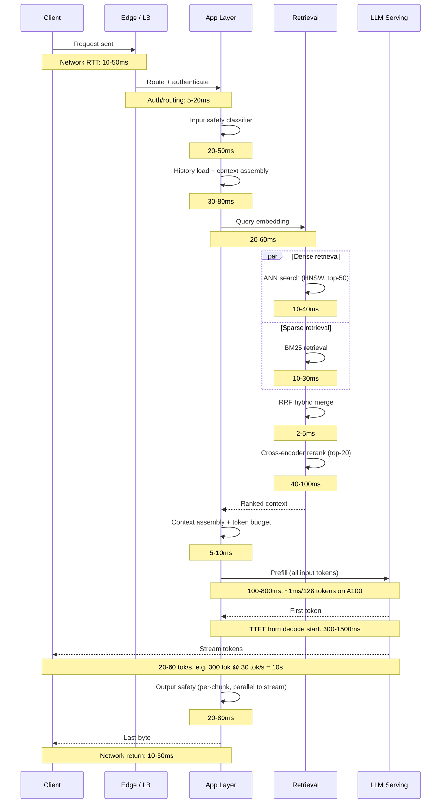
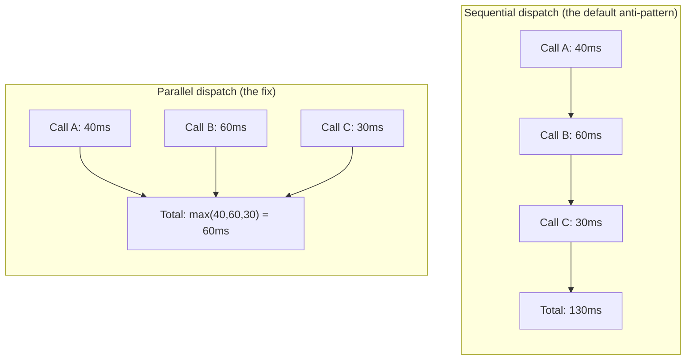
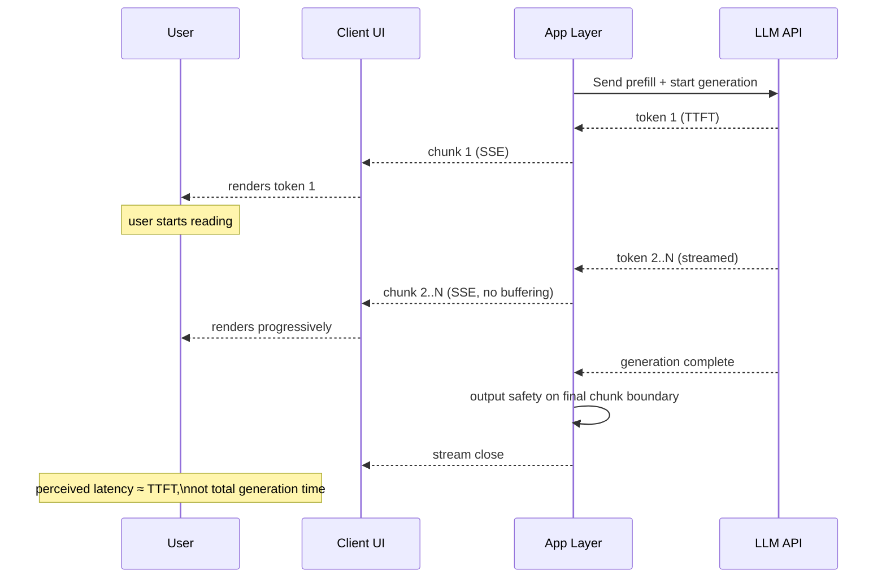
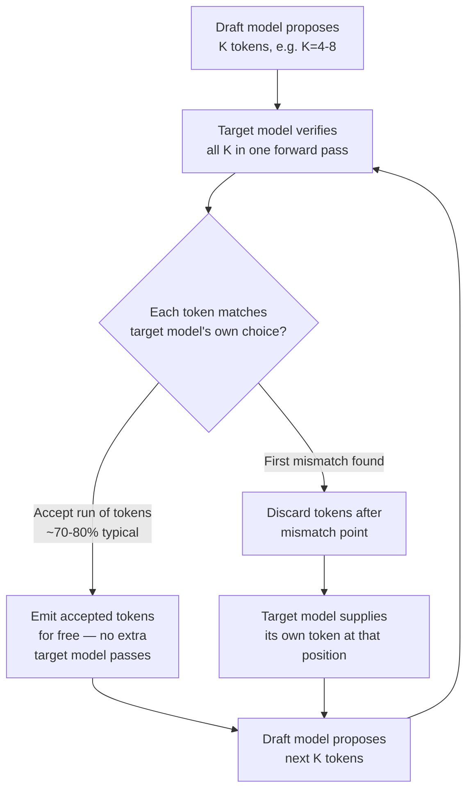
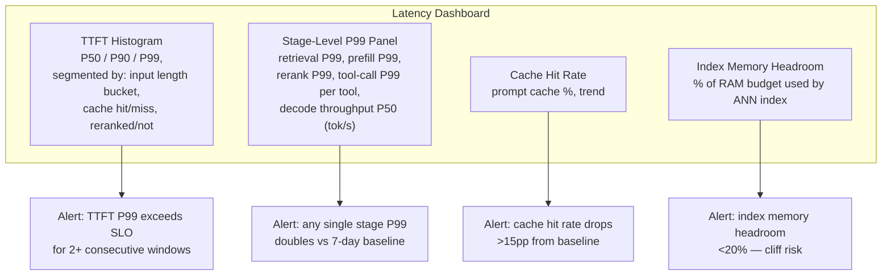

# Latency Engineering

## Overview

Ask an engineer where latency comes from in an AI request and the answer is almost always "the model is slow." That answer is wrong often enough to be dangerous, because it points every subsequent optimization at the wrong stage. A typical RAG + LLM chat request accumulates latency across twelve to fifteen distinct hops — network, auth, safety classification, retrieval, reranking, prefill, decode, and the return trip — and the model's decode step is frequently not even the largest single contributor once retrieval and reranking are counted. This chapter maps where latency actually accumulates, assigns a specific, numbered lever to each stage, and introduces the single most important reframe in this entire domain: for most AI applications, the correct optimization target is time-to-first-token (TTFT), not total generation time — because streaming eliminates most of the *perceived* latency of a slow generation, and optimizing total generation time when the product doesn't stream, or optimizing it further once TTFT is already fast, is frequently effort spent on a number users never experience directly.

## Definition

Latency engineering for AI systems is the discipline of decomposing an end-to-end request into its constituent stages — network, middleware, retrieval, prefill, decode, tool calls, and safety checks — measuring each stage's contribution independently, and applying the specific lever available at each stage (caching, parallelization, batching, speculative execution, streaming) rather than treating "latency" as one undifferentiated number to be reduced by throwing more GPU at the model. It is distinguished from throughput engineering (maximizing requests served per unit of hardware, covered alongside cost in [Cost Engineering](07-cost-engineering.md)) by its unit of concern: a single request's perceived responsiveness to the human waiting on it, not the aggregate efficiency of the fleet serving many requests at once — though, as this chapter shows, the two are frequently in tension and the tradeoffs have to be made explicitly rather than by default.

## Problem Statement

Without stage-level decomposition, latency optimization defaults to whichever lever is most visible, which is almost never the highest-leverage one. A team notices generation feels slow, concludes the model is too big, and either downgrades to a weaker model (trading quality for a metric — total generation time — the user may not have actually been experiencing as pain) or spends a quarter on inference infrastructure to shave decode throughput from 25 tok/s to 40 tok/s, while the product renders the response only after it finishes generating — meaning every millisecond of that hard-won throughput improvement is invisible to the user, who was staring at a spinner the entire time regardless. Meanwhile the retrieval stage, running dense search and BM25 sequentially instead of in parallel, is silently doubling retrieval latency for no reason, and the cross-encoder reranker — which adds 40–100ms per query — is running unconditionally on every request including the simple ones that didn't need the extra precision.

This is the core anti-pattern this chapter exists to prevent: **optimizing the loud metric instead of the perceived one.** Total generation time is loud — it shows up in a trace as the longest single span, it's the number that "feels like the model," and it's the number a GPU vendor's benchmark slide is built around. TTFT is quiet — it's a smaller number, spread across many small stages, none of which look individually alarming. But TTFT is what the user actually waits for before anything happens on screen, and once streaming starts, a slow decode rate is a UX detail, not a UX blocker. A latency engineering effort that doesn't start by separating these two categories will reliably spend its budget on the wrong one.

## The Latency Budget

The first job is building an honest, stage-by-stage budget for a representative request, because intuition about where time goes is usually wrong and the fix is always specific to the stage, never generic. For a typical RAG + LLM chat request, a representative budget looks like this:

| Stage | Latency | Notes |
|---|---|---|
| Network round trip (client → load balancer) | 10–50ms | Geographic distance, CDN/edge placement |
| Auth and routing middleware | 5–20ms | Token validation, tenant routing |
| Input safety classifier | 20–50ms | Runs before the request reaches the model |
| History load and context assembly | 30–80ms | Fetching conversation state, session store round trip |
| Query embedding | 20–60ms | Embedding model inference for the retrieval query |
| ANN vector search (HNSW, top-50 candidates) | 10–40ms | Dense retrieval |
| BM25 retrieval | 10–30ms | Sparse retrieval, run in parallel with ANN, not after it |
| Hybrid merge (RRF) | 2–5ms | Reciprocal rank fusion of the two result sets |
| Cross-encoder reranking (top-20 candidates) | 40–100ms | The single most expensive pre-generation stage per query |
| Context assembly and token budget | 5–10ms | Final prompt construction |
| Prefill (processing all input tokens) | 100–800ms | Scales linearly with input tokens — roughly 1ms per 128 input tokens on an A100 |
| Decode first token (TTFT, from generation start) | 300–1,500ms | Depends on model size and prefill queue depth |
| Decode throughput | 20–60 tok/s | 300 tokens at 30 tok/s = 10s total generation time |
| Output safety classifier | 20–80ms | Parallelizable with streaming if applied per-chunk |
| Network return (last byte) | 10–50ms | |

Laid out as a sequence, with dense and sparse retrieval running as a genuine parallel branch (the parallel fan-out lever covered below), the request looks like this:

The critical insight this budget makes visible: **decode throughput is not a latency problem for the user — it is a streaming problem.** A 10-second total generation that streams from token 0 at 30 tok/s feels instant, because the user starts reading at second one and finishes reading roughly when generation finishes. A 3-second total generation that buffers the response and delivers it all at once feels slow, because the user stares at nothing for the full 3 seconds and then receives a wall of text. The 10-second response is objectively three times "slower" by the loud metric and objectively faster by the metric that governs user-perceived responsiveness. The most impactful latency investment for user-facing AI applications is almost always implementing and optimizing streaming, not reducing absolute generation time — and a team that hasn't done the former has no business spending a quarter on the latter.

## The Levers

Each stage in the budget above has a distinct binding resource and a distinct lever. Applying a lever from the wrong stage — buying more GPU to fix a retrieval bottleneck, for instance — is the recurring mistake this section exists to prevent.

### Prefill Latency

Prefill is the pass where the model processes every input token before generating the first output token, and it is compute-bound: latency scales close to linearly with input token count.

- **Input token count is the primary lever.** Shorter prompts mean shorter prefill, full stop. Context token budget enforcement — trimming retrieved context, summarizing history, capping few-shot examples — is a latency optimization as much as a cost optimization; the two levers are the same action viewed from different budgets (see [Cost Engineering](07-cost-engineering.md) for the cost side of this same lever).
- **Prompt caching** reduces effective prefill latency by 80%+ on the cached portion: tokens that were already processed in a prior request don't need to be re-run through the prefill pass, cutting prefill time in proportion to how much of the input is cached. Concretely, a 5,000-token cached system prompt at a 70% cache-hit rate eliminates that prefix's prefill cost on 70% of requests — the remaining 30% pay full prefill, but the blended latency (and cost) improvement is substantial for any workload with a stable system prompt or shared document context.
- **Flash Attention** reduces prefill compute for long inputs by making the attention computation memory-bandwidth-efficient rather than the naive O(n²) implementation in sequence length. For inputs over 2,000 tokens, this typically cuts prefill time by 30–50%. Most production serving frameworks (vLLM, TGI, TensorRT-LLM) include it by default, which means the more common failure is *not knowing whether it's actually enabled* on a custom serving stack rather than needing to implement it.

### Decode Throughput

Decode is memory-bandwidth-bound, not compute-bound: the GPU spends most of its time moving model weights and KV-cache through memory for each token generated, one token at a time, which is why decode throughput levers look different from prefill levers.

- **Speculative decoding**: a small "draft" model proposes K tokens (typically 4–8), and the large model verifies all K in a single forward pass instead of K sequential passes. When the draft is right — typically 70–80% of tokens for natural text — effective throughput increases 2–3×, because verification is cheap relative to the sequential generation it replaces. The overhead when the draft is wrong is low: generation resumes from the rejection point, not from scratch. This is best suited to tasks with predictable, common output patterns — code, structured JSON, templated responses — and less effective for creative generation, where the draft model's guesses diverge from the target model's distribution more often. See [Speculative Decoding at Scale](../17-distributed-inference/03-speculative-decoding-at-scale.md) for the serving-infrastructure detail.
- **Quantization**: INT4/INT8 quantized models run 2–4× faster than FP16 at the cost of a 1–3% quality reduction on standard benchmarks. For a large share of production tasks — where that quality delta is genuinely below the threshold anyone would notice — quantization is the cheapest throughput improvement available, because it requires no architectural change, only a converted model artifact. See [Quantization and Compression](../15-model-serving/04-quantization-and-compression.md).
- **Continuous batching**: a serving-layer optimization, standard in vLLM and TGI, that keeps GPU memory bandwidth — the binding resource for decode — near 100% utilization by interleaving tokens from multiple in-flight requests instead of serving one request at a time. A single-request server leaves bandwidth idle in the gaps between that request's token generations; continuous batching fills those gaps with other requests' tokens, which is a throughput lever for the fleet more than a latency lever for any one request — the distinction matters when reasoning about which problem it actually solves. See [Batching and Continuous Batching](../15-model-serving/02-batching-and-continuous-batching.md).

### Retrieval Latency

Retrieval latency levers are, unusually for this chapter, mostly about removing accidental sequentiality rather than making individual operations faster.

- **Parallel fan-out** is the highest-leverage and most underimplemented lever in this entire chapter. Dense vector retrieval and BM25 retrieval should run simultaneously, not sequentially — combined retrieval time should equal `max(dense_latency, BM25_latency)`, not `dense_latency + BM25_latency`. A surprising number of production RAG systems run these sequentially by accident, because they were built incrementally (dense search first, BM25 added later as a bolt-on), and the fix is a pure engineering change with no quality tradeoff at all — which makes it the first thing to check in any retrieval latency audit.
- **HNSW `ef` parameter tuning** trades search width for speed: a lower `ef` (the size of the candidate list explored during search) means faster ANN search at lower recall. At `ef=50` versus `ef=200`, search runs roughly 3× faster with a 2–5% recall reduction. For latency-sensitive applications, reducing `ef` is frequently the right tradeoff — a 3× latency win for a few points of recall is a good trade when the reranker downstream can compensate for some of that recall loss. See [Indexing Algorithms (ANN)](../05-retrieval-systems/03-indexing-algorithms-ann.md).
- **Index residency in RAM** is a binary latency cliff, not a tuning knob: disk-based ANN lookups are 50–100× slower than in-memory lookups, so the entire index must fit in CPU or GPU RAM for the ANN latency numbers above to hold at all. A 50M-vector HNSW index in FP32 requires roughly 450 GB of RAM; quantized to INT8, the same index requires roughly 150 GB. Instance selection for the retrieval tier has to be sized against this number explicitly — teams that size retrieval infrastructure against query volume alone and discover the index doesn't fit in memory find out via a 50–100× latency cliff in production, not a gradual degradation.
- **Reranker placement** should be conditional, not universal. The cross-encoder reranker adds 40–100ms per query — real money on the latency budget — for a precision gain that matters more on some queries than others. The right pattern is selective: apply the reranker to complex queries (long user messages, low-confidence initial retrieval scores) and skip it for simple, high-confidence lookups where the extra precision doesn't change the outcome. See [Hybrid Search and Reranking](../05-retrieval-systems/04-hybrid-search-and-reranking.md).

### Tool Call Latency in Agent Loops

Agent loops introduce a class of latency risk that doesn't exist in single-turn chat: tool calls with unbounded and highly variable latency, run in a loop where the model waits on each result before deciding the next step.

- **Parallel tool dispatch**: when the model requests multiple independent tool calls in the same step — e.g., searching three different knowledge bases — dispatch them simultaneously. Combined latency equals the slowest call, not the sum of all calls, exactly the same principle as the retrieval fan-out lever above.
- **Tool timeout caps**: set explicit, per-tool timeouts rather than waiting indefinitely on a tool that may hang — a representative set is browsing: 5s, code execution: 30s, database query: 2s. A call that exceeds its timeout triggers a graceful degradation path: the model receives an explicit error message and can retry with a simplified call or answer without that tool's output, rather than the request hanging until an outer request-level timeout fires and the user gets nothing at all.
- **Streaming tool results**: for tool calls that produce large outputs — a database query returning many rows, a full web page fetch — stream the tool output to the model as it arrives instead of buffering the complete result before the model can act on it. This reduces TTFT on the generation step that follows the tool call, which otherwise waits on the full buffered result even when the model only needed the first few rows to proceed.

The parallel-versus-sequential distinction generalizes across both retrieval and tool calls, and is worth internalizing as a single mental model rather than two separate rules:

Independent calls dispatched sequentially cost the sum of their latencies; the same calls dispatched in parallel cost only the slowest one. This is not a probabilistic improvement or an infrastructure investment — it is a correctness fix to how the calls are issued, and it is why it should be the first thing audited in any system where retrieval or tool calls feel slow.

## Streaming Architecture

Streaming is the primary lever for perceived latency, and it earns that status because it changes what the user is measuring against, not just how fast the underlying work happens. Delivered via Server-Sent Events (SSE) or chunked HTTP responses, streaming means the user sees the first token within TTFT rather than waiting for total generation time — and TTFT, per the budget above, is typically 300–1,500ms versus a total generation time that can run into many seconds for a long response.

Three implementation details separate a streaming implementation that actually delivers this benefit from one that only looks like it does:

1. **Stream end-to-end without buffering.** Tokens must flow from the LLM API through every layer of the application — gateway, safety classifier, application server — to the client without any layer collecting the full response before forwarding it. A single buffering hop anywhere in that chain (a safety classifier that waits for the complete response before scoring it, an API gateway with response buffering enabled by default) silently converts a streaming architecture back into a blocking one, and it is a common enough regression that it belongs in the monitoring section below as a tracked stage, not assumed correct once implemented.
2. **Show intermediate states during tool calls.** An agent loop that goes silent for the 2–5 seconds a tool call takes reintroduces the exact perceived-latency problem streaming was built to solve. Surfacing "searching...", "reading the documentation...", "running the code..." during those gaps keeps the user informed that progress is happening, even though no token is being generated in that window.
3. **Render partial responses progressively.** The client displays each token as it arrives rather than waiting for a paragraph or sentence boundary, letting the user begin reading while the model is still generating the rest of the response.

The distinction to hold onto operationally: **TTFT is the time until the first token is visible to the user; total generation time is the time until the last token is visible.** Product teams that report "latency" as a single number without specifying which of these two they mean are measuring the wrong thing half the time — and in most product contexts, TTFT is the number that actually drives user satisfaction, because a stream that starts fast and runs at a merely adequate throughput reads as responsive, while a stream that starts slow reads as broken regardless of how fast it finishes.

## Speculative Decoding

Speculative decoding deserves its own section, separate from the general decode-throughput lever list above, because it is the mechanism most likely to be misapplied without understanding its accept/reject dynamics.

The mechanism: a small, fast draft model generates K candidate tokens (typically 4–8) autoregressively, cheaply. The large target model then runs a single forward pass over all K draft tokens simultaneously — not K sequential passes — and checks whether each one matches what the large model itself would have generated at that position. Every token that matches is accepted for free; the first token that doesn't match is rejected, the large model's own token is substituted at that position, and generation resumes from there with a fresh draft.

Because verifying K tokens in one forward pass costs roughly the same as generating one token normally, an accept rate of 70–80% — typical for natural text — turns what would have been K sequential large-model passes into roughly one, yielding the 2–3× effective throughput improvement. The overhead on a rejection is low precisely because generation resumes from the rejection point rather than restarting the whole sequence; the cost of a wrong guess is one wasted draft step, not a wasted large-model step.

The practical implication for when to reach for this lever: speculative decoding's payoff scales with how predictable the output distribution is. Code generation, structured JSON output, and templated responses have high accept rates because there are fewer plausible next tokens at each position, which is exactly what lets a small draft model guess correctly. Open-ended creative generation has a flatter, less predictable token distribution, so the draft model's guesses diverge more often, accept rates drop, and the throughput win shrinks or disappears — meaning a team that adopts speculative decoding for a creative-writing product and doesn't see the throughput numbers reported for code-generation workloads is not observing a bug; they're observing the technique operating exactly as expected outside its best-fit domain. See [Speculative Decoding at Scale](../17-distributed-inference/03-speculative-decoding-at-scale.md) for draft-model selection and serving-infrastructure tradeoffs, and [Disaggregated Prefill/Decode](../17-distributed-inference/02-disaggregated-prefill-decode.md) for how this interacts with separating prefill and decode onto different hardware pools.

## Latency SLOs

Latency SLOs need to be set per-segment, not as a single end-to-end number, because TTFT and streaming throughput fail independently and a single blended SLO hides which one broke. Representative targets:

| Metric | Consumer product | Enterprise product |
|---|---|---|
| TTFT P50 | < 300ms | < 1s |
| TTFT P99 | < 1s | < 3s |
| Streaming throughput | > 30 tok/s (reads as instant) | > 30 tok/s |
| Individual tool call P99 | < 5s, with visible "still working" state | < 5s, with visible "still working" state |

The 30 tok/s streaming throughput floor is worth explaining rather than treating as an arbitrary number: it approximates typical adult reading speed, so a stream at or above that rate delivers tokens at least as fast as the user consumes them — the user is never waiting on the model once streaming has started. Below that threshold, the reader periodically catches up to the cursor and perceives the generation as "typing slowly," which is a qualitatively different (and more noticeable) complaint than a slow TTFT, even when the total latency numbers are comparable.

## Tradeoffs

Every lever in this chapter costs something — usually money, sometimes quality — and the tradeoff needs to be made explicitly rather than assumed away.

| Lever | Latency gain | What it costs |
|---|---|---|
| Prompt caching | 80%+ reduction in prefill on cached portion | Cache infrastructure; stale cache risk if the cached prefix changes without invalidation |
| Flash Attention | 30–50% prefill reduction on inputs >2,000 tokens | Effectively free — already default in vLLM/TGI/TensorRT-LLM; the cost is only in custom serving stacks that must add it |
| Speculative decoding | 2–3× decode throughput at 70–80% accept rate | A second (draft) model to host, tune, and keep in sync with the target model; smaller or negative gains on unpredictable output |
| Quantization (INT4/INT8) | 2–4× decode throughput | 1–3% quality reduction on standard benchmarks — must be validated against the product's actual eval set, not assumed acceptable |
| Continuous batching | Near-100% GPU bandwidth utilization (fleet throughput, not single-request latency) | Implementation complexity in the serving layer; can increase tail latency for a single request under heavy concurrent load |
| Parallel retrieval fan-out | Retrieval time drops from sum to max of dense/BM25 | None — this is a pure engineering fix with no tradeoff, which is why it should always be done |
| Lower HNSW `ef` | ~3× faster ANN search at `ef=50` vs `ef=200` | 2–5% recall reduction — acceptable if the reranker downstream compensates, risky if it's the only retrieval quality gate |
| Selective reranker skipping | Saves 40–100ms on queries where it's skipped | Precision loss on the skipped queries — must be gated on a real confidence signal, not a blanket toggle |
| In-RAM index residency | Avoids the 50–100× disk-lookup latency cliff | Real infrastructure cost — a 50M-vector index needs ~450GB RAM at FP32, ~150GB at INT8 |
| Streaming implementation | Perceived latency ≈ TTFT instead of total generation time | Engineering cost across every layer (no buffering anywhere in the chain); output safety classification must move to a per-chunk model |

The through-line across this table: most of the levers with the largest latency wins (speculative decoding, quantization, aggressive `ef` reduction) trade against quality or infrastructure cost, and the one lever with no tradeoff at all — parallel fan-out for retrieval and tool calls — is also the most commonly left undone, which is why it should be the first stop in any latency audit before reaching for anything that costs money or quality.

## Scalability

Latency levers behave differently as request volume grows, and a lever that's free at low scale can become a genuine capacity planning problem at high scale.

- **Prompt caching's hit rate is a function of traffic pattern, not traffic volume.** A shared system prompt across all requests gets a high hit rate regardless of QPS; a highly personalized prompt prefix per user gets a low hit rate no matter how much traffic there is. Scaling doesn't automatically improve caching — the prompt architecture has to be designed for cache-ability.
- **Continuous batching's throughput benefit grows with concurrent request volume**, up to the point where GPU memory (holding KV-cache for all in-flight requests) becomes the binding constraint rather than compute or bandwidth — at that point, adding more concurrent requests degrades per-request latency instead of improving fleet throughput, and capacity planning has to size the KV-cache budget against expected concurrency explicitly.
- **In-RAM index residency is the sharpest scaling cliff in this chapter.** Retrieval latency numbers hold as long as the index fits in memory; past that point, the system doesn't degrade gradually, it falls off a 50–100× latency cliff onto disk-backed lookups. Index growth has to be forecast and instance sizing planned ahead of it, not reacted to after a latency regression.
- **Parallel tool dispatch scales linearly in the number of independent external dependencies**, but each additional parallel dependency raises the probability that at least one of them is slow or down on any given request — timeout caps and graceful degradation (covered below under Reliability) become more load-bearing, not less, as the number of parallel tools grows.

## Reliability

Latency and reliability are coupled at every stage in this chapter: a stage that's slow because it's unhealthy looks identical, from the outside, to a stage that's slow because of load — the mitigation has to distinguish the two.

| Failure mode | Latency symptom | Mitigation |
|---|---|---|
| Reranker service degraded or overloaded | The 40–100ms reranking stage balloons to seconds | Circuit breaker: skip reranking and fall back to raw retrieval ranking past a latency threshold, rather than blocking the whole request |
| Prompt cache eviction or cold start | Prefill latency spikes back to the uncached baseline unexpectedly | Monitor cache hit rate as a first-class metric; treat a hit-rate drop as an incident, not a silent cost/latency regression |
| A parallel tool call hangs | The whole agent step waits on the slowest call, which never returns | Hard per-tool timeout caps (browsing 5s, code execution 30s, database query 2s) with a defined degradation path, not an indefinite wait |
| Buffering silently reintroduced at one layer | Streaming stops feeling instant; TTFT-to-user regresses even though model-side TTFT is unchanged | Trace the full response path stage by stage; a single buffering hop anywhere between the model and the client defeats the entire streaming architecture |
| Draft model in speculative decoding drifts from the target model (after either is updated independently) | Accept rate drops, throughput gain shrinks or reverses | Version-pin draft and target models together; re-validate accept rate whenever either is updated |
| ANN index falls out of RAM (index growth outpaces provisioned memory) | Retrieval latency jumps 50–100× with no warning | Alert on index memory headroom directly, not just on retrieval latency after the fact — the cliff is too sharp to catch from a latency trend alone |

The general pattern across all six: every latency lever in this chapter introduces a new failure mode that degrades *back toward* the unoptimized baseline, not a random one, which means the correct mitigation is almost always "detect the degradation and fall back to the slower-but-correct path," not a bespoke fix per lever.

## Monitoring

Two monitoring primitives matter more than any others in latency engineering, and both are more informative than a single "average response time" number, which hides everything this chapter cares about.

**The TTFT histogram, not TTFT average.** An average TTFT of 500ms is consistent with a system where every request lands near 500ms, or one where 90% of requests land at 300ms and 10% spike to 2 seconds — those are operationally very different systems, and only the histogram distinguishes them. Track TTFT as a full distribution (P50, P90, P99) segmented by the dimensions that actually drive variance: input length bucket (prefill scales with input tokens), whether the request hit the prompt cache, and whether reranking was applied. A P99 TTFT regression that only shows up in the "cache miss + reranked" segment is invisible in an aggregate P99 number and immediately diagnosable in a segmented one.

**Stage-level P99 tracking**, not just end-to-end P99. Every stage in the budget table earns its own P99 metric: retrieval P99, prefill P99, TTFT P99, decode-throughput P50 (tok/s), tool-call P99 per tool. This is what turns "the request is slow" into "the reranker's P99 tripled" — the difference between a symptom and a diagnosis. A dashboard built around end-to-end latency alone forces every investigation to start from scratch tracing through the request; a dashboard built around stage-level P99s lets an on-call engineer see which specific stage moved.

Alerting on stage-level regressions rather than only end-to-end regressions is what catches problems before they blow the overall SLO: a reranker P99 that doubles is worth investigating immediately even while the end-to-end TTFT SLO is still nominally met, because headroom that erodes silently in one stage eventually shows up as an SLO breach with no warning once another stage also degrades even slightly.

## Production Best Practices

1. Instrument TTFT and total generation time as two separate, explicitly labeled metrics from day one — a single "response latency" number conflates two different user experiences and makes it impossible to tell which one a given optimization actually improved.
2. Build stage-level P99 tracking before optimizing anything — a latency effort that starts from "the model feels slow" instead of "stage X's P99 is Y" is optimizing on a hunch, and hunches about latency are wrong often enough to be expensive.
3. Fix parallel fan-out (retrieval, tool calls) before spending on any paid lever — it's the only lever in this chapter with zero quality or cost tradeoff, and it's routinely left undone in systems built incrementally.
4. Make the reranker and other precision-latency tradeoffs conditional on query characteristics, not blanket on/off — most production traffic doesn't need maximum precision, and a blanket "always rerank" policy pays the 40–100ms tax on every request regardless.
5. Treat streaming as an end-to-end architectural property, not a feature flag on the model call — verify with an actual trace that no layer between the model and the client buffers the response, because a single buffering hop anywhere defeats the whole investment.
6. Size retrieval infrastructure against index memory headroom explicitly, with alerting before the index outgrows RAM — the disk fallback is a 50–100× cliff, not a gradual degradation, and it will not show up as a warning trend in advance.
7. Re-validate speculative decoding's accept rate whenever either the draft or target model changes — a stale draft model against an updated target silently erodes the throughput gain the system was built to rely on.

## Real World Examples

The following are illustrative reasoning patterns consistent with each company's known public product surface and engineering culture — not confirmed internal architecture.

- **Google**: a plausible latency engineering question inside a Gemini-powered Search feature is whether to invest further in speculative decoding versus serving a smaller distilled model directly, given that Google's own research popularized speculative decoding as a technique. At Google's request volume, the deciding factor is likely which lever gives a better TTFT-per-dollar tradeoff at fleet scale rather than which gives the larger single-request throughput number in isolation.
- **OpenAI / Anthropic**: both labs' public API design — streaming as the default response mode, and Anthropic's prompt caching feature specifically — reflects the TTFT-first framing this chapter argues for: prompt caching exists because a large fraction of API traffic reuses a stable prefix (a system prompt, a long document context), and the latency win from not re-running prefill on that prefix compounds across enormous request volume.
- **Meta**: a representative tradeoff for a team serving Llama-family models in a consumer product is quantization aggressiveness — INT8 versus INT4 — traded against on-device or edge latency constraints, where the actual constraint is plausibly the hardware footprint of the deployment target (mobile, edge) rather than raw model quality, since the quality delta from quantization is small relative to what edge hardware constraints force regardless.
- **Glean**: given Glean's connector-heavy enterprise search surface, a representative latency decision is exactly the conditional-reranker pattern described above — applying the cross-encoder reranker selectively based on query complexity and initial retrieval confidence, since enterprise search queries vary enormously in how much precision they actually need, and a blanket reranking policy would tax the majority of simple lookups for the benefit of a minority of ambiguous ones.
- **Cursor**: an AI coding tool is close to the ideal use case for speculative decoding described in this chapter — code completions have a highly predictable token distribution (a small draft model correctly predicts common syntax, variable names in scope, and boilerplate patterns), which plausibly makes speculative decoding's accept rate for code meaningfully higher than the 70–80% general-text baseline, and TTFT for inline suggestions is likely the single most latency-sensitive metric in the entire product given the sub-second feedback loop developers expect while typing.

## Interview Questions

### Beginner

**Q: What is TTFT, and why does it usually matter more than total generation time?**
TTFT (time-to-first-token) is the time from when a request starts until the first token of the response is visible to the user. It matters more than total generation time in most product contexts because streaming means the user starts consuming the response as soon as the first token arrives — a response that streams from token 0 feels responsive even if it takes ten seconds to fully generate, while a response that's buffered and delivered all at once feels slow even if the underlying generation was faster in absolute terms. Total generation time only becomes the dominant perceived-latency factor when the product doesn't stream at all.

**Q: What's the difference between prefill and decode, and why do they have different latency characteristics?**
Prefill is the pass where the model processes all input tokens at once before generating anything, and it's compute-bound — its latency scales roughly linearly with input token count, at around 1ms per 128 tokens on an A100. Decode is the pass where the model generates one output token at a time, and it's memory-bandwidth-bound — each step has to move the model's weights and KV-cache through memory regardless of how much compute is available, which is why decode throughput (20–60 tok/s for a large model) doesn't scale the same way prefill does, and why the levers for each stage (input token reduction and prompt caching for prefill; speculative decoding, quantization, and batching for decode) are different tools entirely.

### Intermediate

**Q: How does prompt caching reduce latency, not just cost?**
Prompt caching stores the intermediate computation (the KV-cache) for a previously-seen prefix, so when a new request shares that prefix, the model doesn't need to re-run the prefill pass over those tokens — it resumes from the cached state. This cuts prefill latency in proportion to how much of the input is cached, not just the token cost: a 5,000-token cached system prompt at a 70% hit rate eliminates that prefix's prefill latency (not just its billed tokens) on 70% of requests. Because prefill can be a large fraction of the pre-TTFT budget on long-context requests, this is as much a TTFT lever as it is a cost lever, and treating it as purely a cost optimization undersells its latency impact.

**Q: Design the retrieval stage of a RAG pipeline for minimum latency. Walk through the levers you'd apply.**
Start with parallel fan-out: dense (ANN) and sparse (BM25) retrieval run simultaneously, so combined retrieval latency is the max of the two (10–40ms and 10–30ms respectively) rather than their sum — this is free and should always be done. Merge with reciprocal rank fusion, which is cheap (2–5ms). Tune the HNSW `ef` parameter down for latency-sensitive traffic — `ef=50` versus `ef=200` is roughly 3× faster at a 2–5% recall cost, an acceptable trade if reranking downstream can partially compensate. Make cross-encoder reranking conditional rather than universal: apply it to complex or low-confidence queries (the 40–100ms cost is worth it there) and skip it on simple, high-confidence lookups. Finally, ensure the entire index fits in RAM — a 50M-vector index needs roughly 450GB at FP32 or 150GB quantized to INT8 — because falling back to disk is a 50–100× latency cliff, not a gradual slowdown, and no amount of query-level tuning fixes that if the index doesn't fit.

### Senior

**Q: When would you specifically avoid speculative decoding, even though it can give a 2–3× throughput improvement?**
Speculative decoding's win is proportional to the draft model's accept rate, which is proportional to how predictable the target output distribution is. For open-ended, creative, or highly variable generation, the draft model's guesses diverge from the target model more often, accept rates fall well below the 70–80% seen on natural text or code, and the throughput gain shrinks or can even go slightly negative once the overhead of running and hosting a second model is counted. I'd also avoid it in the early stage of a system where the draft and target models aren't both stable — a draft model that goes stale relative to an updated target silently erodes the gain over time unless accept rate is actively monitored and the two are re-validated together after any model update. And since decode throughput is frequently not the actual bottleneck perceived by the user once streaming is in place, I'd first confirm the product genuinely needs faster total generation time — not just a faster TTFT, which speculative decoding doesn't directly address — before spending the engineering effort to stand up and maintain a second model.

**Q: How do you decide whether to enable the cross-encoder reranker for a given query, rather than applying it universally?**
The decision should be driven by a real confidence signal, not a blanket toggle: query length (short lookups tend to need less precision than long, ambiguous ones), the confidence spread of the initial retrieval scores (a tight cluster of similar top-k scores suggests genuine ambiguity worth reranking; a clear top result suggests reranking won't change the outcome), and query classification if available (a known-simple query type like "look up policy X" versus an open-ended question). The 40–100ms reranker cost is worth paying selectively on the subset of queries where precision genuinely changes the answer, and wasted on the majority of simple queries where it doesn't — a universal policy pays that tax on every request for a benefit that's concentrated in a minority of them.

### Staff

**Q: You're asked to cut P99 TTFT in half for an enterprise support product without increasing infrastructure cost. Walk through your approach.**
I'd start with the stage-level P99 breakdown, not the model, because "cut TTFT in half" is a claim about the sum of many stages and the answer is almost never "make the model faster" alone. If the trace shows retrieval running dense and sparse search sequentially, fixing that fan-out is free latency with no cost tradeoff — likely the first move. Next I'd check prompt cache hit rate: if the system prompt or a large shared context isn't being cached, or the cache-hit segment of the TTFT histogram is small, restructuring the prompt for cache-ability (stable prefix, variable content pushed to the end) recovers a large chunk of prefill latency at effectively zero infra cost. I'd audit whether reranking runs universally — if so, making it conditional on query confidence removes 40–100ms from the majority of requests without touching infrastructure. Only after those no-cost or low-cost levers are exhausted would I look at paid levers like quantization, and I'd frame that tradeoff explicitly (the 1–3% quality delta needs sign-off against the eval set, not an assumption). Throughout, I'd track the TTFT histogram segmented by these dimensions specifically so I can show which lever moved which segment, rather than reporting a single before/after number that can't be attributed to a cause.

**Q: A team wants to reduce total generation time by upgrading GPU infrastructure, but the product already streams responses well within the TTFT SLO. How do you handle this?**
I'd separate the question of whether this is worth doing from the question of whether it's technically achievable, because the team's instinct — total generation time feels slow, therefore buy faster GPUs — is exactly the anti-pattern this chapter is built around: optimizing the loud metric instead of the perceived one. If the product streams well, users are reading the response roughly as fast as it's generated once decode throughput clears the ~30 tok/s reading-speed floor, so a further throughput increase is invisible to a user already reading in real time. I'd ask what's actually driving the request: is there a genuine downstream consumer of total generation time — a batch pipeline, an automation that waits for the complete response before acting — where total time matters on its own merits, separate from the interactive UX? If so, that's a legitimate throughput problem, best solved with continuous batching or quantization at the fleet level rather than a single-request latency framing. If the actual driver is an executive or PM's intuition that "faster must be better" without a specific user-facing metric behind it, the right move is redirecting the investment toward whichever stage's P99 is actually closest to breaching the TTFT SLO, and making the case with the segmented histogram rather than a general appeal to speed.

## Google-Level Follow-Ups

- "Your TTFT P50 is well within SLO, but P99 is three times the target. Where do you look first, and why not the model?" — probes whether the candidate reaches for stage-level P99 segmentation (cache misses, long-input tail, reranking-triggered queries) rather than assuming a uniform model slowdown, since a P50/P99 gap that large is almost always a tail-segment problem, not a global one.
- "You've implemented speculative decoding and measured a 2.5x throughput gain in a benchmark, but production shows almost no improvement in perceived latency. What happened?" — probes whether the candidate distinguishes decode throughput from TTFT, and recognizes that a throughput-only lever doesn't move the metric the user actually experiences if the product already streams responsively.
- "A cost-conscious VP asks why you're not applying the reranker to every query, since it clearly improves quality. How do you make the latency-versus-precision tradeoff case in terms they'll accept?" — probes whether the candidate can translate a systems tradeoff (40-100ms tax on 100% of traffic for a precision gain concentrated in a minority of ambiguous queries) into a business argument, rather than only defending it in latency-engineering terms.
- "Your retrieval index has grown 3x over the past year and just crossed available RAM, and nobody noticed until a 50x latency spike hit production. How do you prevent this exact failure from recurring, structurally, not just this once?" — probes whether the candidate proposes leading-indicator monitoring (index memory headroom as a first-class alerted metric) rather than a one-time fix, and understands why a latency-trend alert alone is insufficient for a cliff-shaped failure mode.

## Common Mistakes

- **Optimizing total generation time in a product that already streams well.** If TTFT is healthy and throughput clears the ~30 tok/s reading-speed floor, further decode speedups are frequently invisible to the user reading in real time — the effort belongs elsewhere.
- **Running dense and sparse retrieval sequentially instead of in parallel.** This silently doubles retrieval latency for zero benefit, and it's the single most common accidental latency bug in RAG systems, usually introduced when BM25 or reranking is bolted on after the initial dense-only pipeline.
- **Applying the cross-encoder reranker universally instead of conditionally.** Paying 40–100ms on every query, including simple high-confidence lookups that don't need the extra precision, taxes the majority of traffic for a benefit concentrated in a minority of ambiguous queries.
- **Reintroducing buffering at one layer of a "streaming" pipeline.** A safety classifier, API gateway, or proxy that waits for the complete response before forwarding it defeats the entire streaming investment even though the model itself streams correctly — the fix requires tracing the full path, not just checking the model call.
- **Sizing the retrieval index without accounting for RAM headroom.** Disk-based ANN lookups are 50–100× slower than in-memory ones, and this shows up as a sudden cliff, not a gradual trend — capacity planning has to track index memory headroom directly, not react to a latency regression after the fact.
- **Treating "latency" as one number instead of TTFT and total generation time separately.** A blended average hides which of the two actually regressed, makes it impossible to attribute an optimization's effect correctly, and routinely leads teams to solve the wrong one.

## Key Takeaways

- The correct optimization target for most AI applications is TTFT, not total generation time — streaming eliminates most of the perceived latency of a slow generation, and decode throughput becomes a UX detail rather than a UX blocker once streaming is implemented correctly.
- A request's latency accumulates across twelve to fifteen distinct stages, each with its own binding resource and its own lever; treating "latency" as one undifferentiated number to fix by upgrading the model is the core anti-pattern this chapter exists to prevent.
- Prefill is compute-bound and scales with input tokens (prompt caching, Flash Attention, and input trimming are its levers); decode is memory-bandwidth-bound (speculative decoding, quantization, and continuous batching are its levers) — the two stages need different tools entirely.
- Parallel fan-out — for retrieval (dense + BM25) and for independent tool calls — is the one lever in this chapter with zero quality or cost tradeoff, and it's also the most commonly left undone, making it the right first stop in any latency audit.
- Every latency lever with a large win (speculative decoding, quantization, aggressive HNSW `ef` reduction) trades against quality or infrastructure cost, and that tradeoff has to be made explicitly against the product's actual eval set, not assumed acceptable.
- Monitoring has to be stage-level and distribution-level — a TTFT histogram segmented by cache-hit/miss and reranked/not, plus per-stage P99s — because an aggregate average latency number hides exactly the information needed to diagnose a regression.
- Reliability and latency are coupled: nearly every lever in this chapter introduces a new failure mode that degrades back toward the unoptimized baseline (cache eviction, reranker overload, index outgrowing RAM), and the mitigation is almost always detect-and-fall-back rather than a bespoke fix per lever.

---

*Part of [Staff-Level Architecture](index.md) in the [AI System Design Notes](../index.md). Tracked in [BACKLOG.md](https://github.com/GyanendraChaubey/AI-System-Design-Notes/blob/main/BACKLOG.md).*
