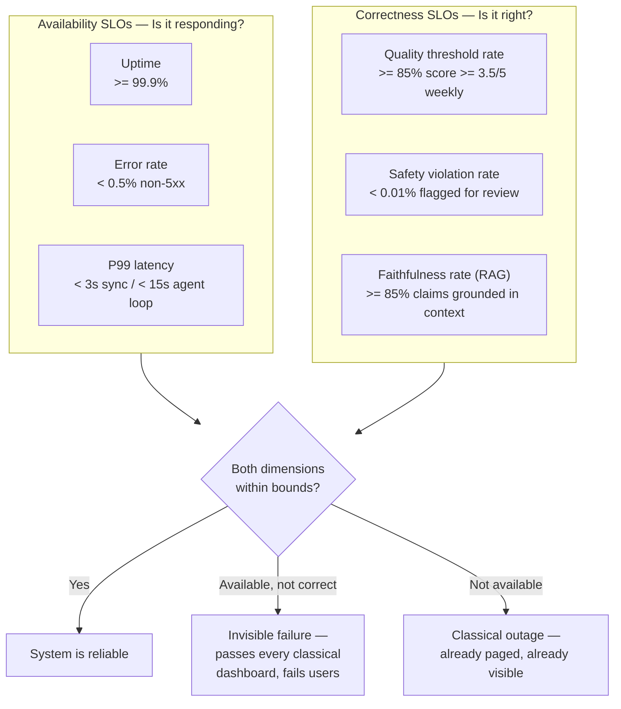
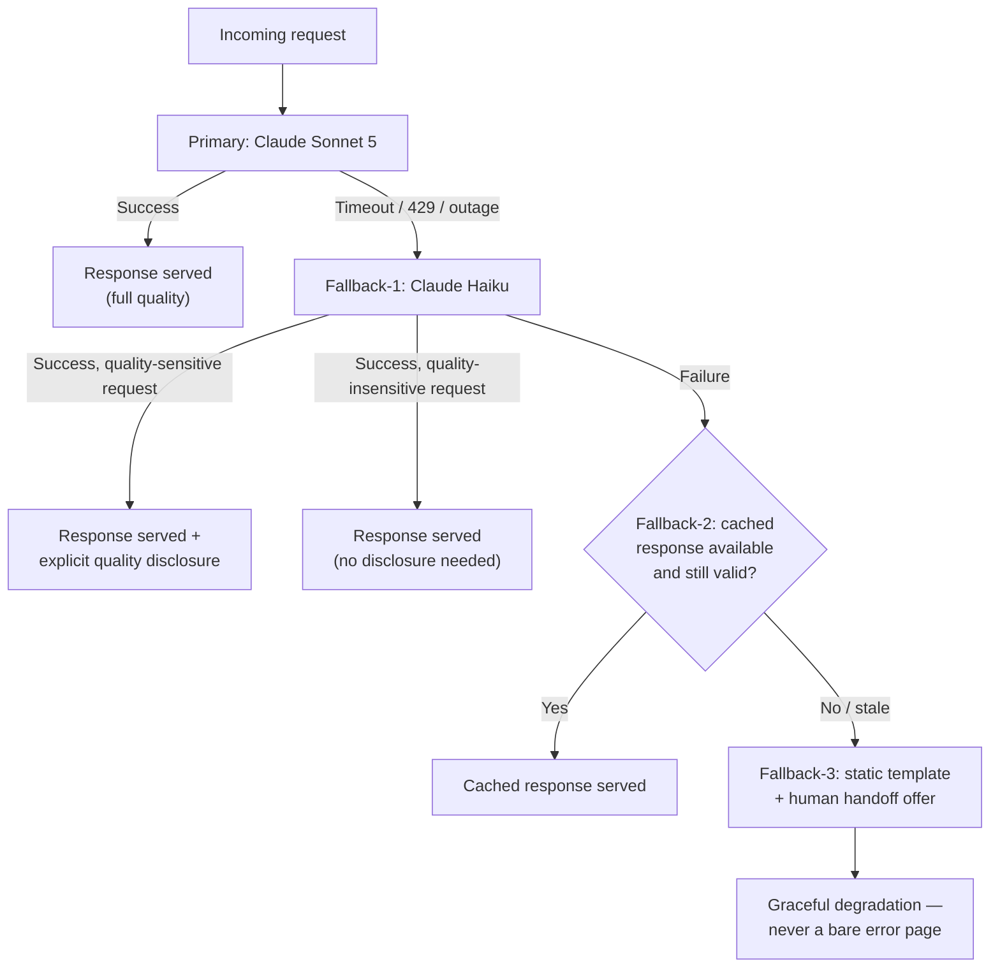
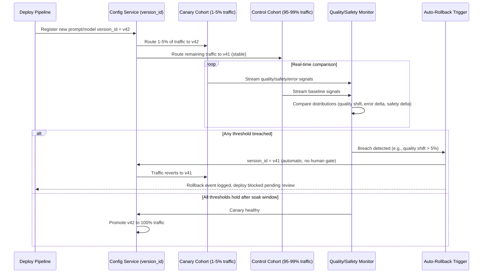
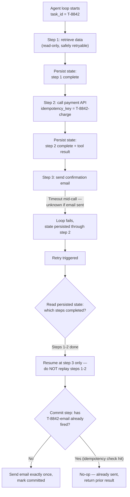
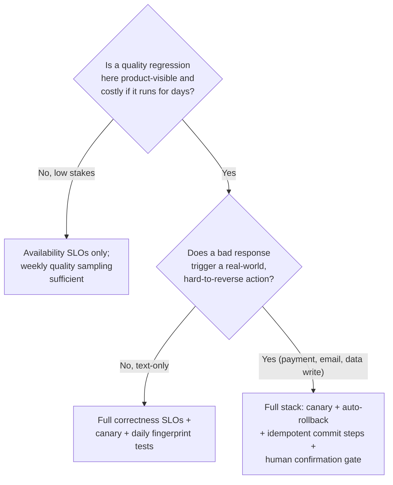

# Reliability Engineering

## Overview

Classical reliability engineering answers one question: is the system responding correctly, within budget, under load? For a stateless CRUD service, "correctly" is a solved problem — the response either matches the deterministic contract or it doesn't, and every SRE practice (SLOs, error budgets, on-call, chaos testing) is built on top of that assumption. AI systems break the assumption at the root. The model is a probabilistic dependency: the same input can produce a different output on two consecutive calls, "correct" is a graded judgment rather than a boolean, and the dependency itself can silently change behavior — a provider can swap the model behind a version alias with no announcement, no error code, and no latency change. This chapter is the Staff-level treatment of what reliability means once correctness stops being free to assume, and what has to be built, monitored, and rehearsed to keep both dimensions of reliability — availability and correctness — inside their bounds. It sits alongside [Cost Engineering](07-cost-engineering.md) and [Latency Engineering](08-latency-engineering.md) as the third axis of the tradeoff triangle every AI system architecture ultimately gets evaluated against, and it leans on the monitoring and security infrastructure covered in [Observability](../20-observability/index.md) and [AI Security](../21-ai-security/index.md) rather than duplicating it.

## Definition

Reliability, for an AI system, is the joint property of **availability** (the system responds within its latency and error-rate budget) and **correctness** (the response meets a defined quality and safety bar) — measured continuously, both independently, because a system can satisfy one dimension while silently failing the other. A system that is "reliable" in the classical sense — 99.9% uptime, P99 latency under budget, near-zero 5xx rate — can simultaneously be unreliable in the AI-specific sense if the model is hallucinating on 15% of requests, has quietly regressed after a provider-side version bump, or is missing an increasing share of policy-violating content. Neither dimension alone is a complete reliability story; both have to be defined, measured, and alerted on, or the second one degrades invisibly until a user, a journalist, or a regulator finds it first.

## Problem Statement

Uptime and error rate measure whether the API is responding. They do not measure whether the model is hallucinating, whether output quality has silently degraded after a model version change behind the scenes, or whether the safety classifier is missing a growing share of harmful content. This gap is not a minor omission in classical monitoring — it is the defining reliability challenge for AI systems, and it has no analog in traditional distributed systems.

Concretely: a support bot answering pricing and account questions is running at 90% answer accuracy at launch, verified against a 200-case eval set. Three months later, following an unannounced upstream model update and several unreviewed prompt edits, accuracy has drifted down to 60% — a collapse severe enough that a meaningful fraction of customers are receiving wrong information about their bills. Across that entire three-month window, uptime holds at 99.95%, the error rate (non-5xx responses) stays under 0.1%, and P99 latency doesn't move. Every dashboard a classically-trained SRE team would build says the system is healthy. The failure is real, it is costing the business real money in support escalations and customer trust, and it is completely invisible without quality-specific instrumentation. This is the scenario every AI reliability program is built to prevent, and building the two-dimensional SLO framework below before this happens — not after the first quality incident forces the conversation — is the actual job.

## The Two-Dimensional SLO Framework

The fix is architectural, not procedural: define and monitor two independent SLO families from day one, and treat neither as a proxy for the other.

**Availability SLOs (traditional, necessary but not sufficient):**

- **Uptime**: e.g., 99.9% of requests receive a response (success or a well-formed error) within the service's defined availability window.
- **Error rate**: non-5xx response rate — e.g., fewer than 0.5% of requests return an unhandled error.
- **P99 latency**: e.g., under 3s for synchronous single-turn generation, under 15s for a multi-step agent loop.

**Correctness SLOs (AI-specific, actively measured — cannot be inferred from the availability numbers):**

- **Quality threshold rate**: the minimum fraction of responses scoring at or above a defined bar on a quality rubric — e.g., "≥ 85% of responses must score ≥ 3.5/5 on the quality rubric, measured on a weekly rolling basis, sampled at 100% for high-stakes intents and 5% for general traffic."
- **Safety violation rate**: near-zero by design — e.g., "fewer than 0.01% of responses trigger a safety flag requiring human review," tracked as an absolute count as well as a rate, since a rate can look flat while absolute volume grows with traffic.
- **Faithfulness rate** (RAG systems specifically): the fraction of response claims traceable to retrieved context — e.g., "≥ 85% of claims in a response must be supported by the retrieved documents," measured via an LLM-as-judge faithfulness check on a sampled stream.

The critical operational point: the correctness SLO family requires active measurement infrastructure — a judge model, a rubric, a sampling pipeline, a labeled eval set — that does not exist by default the way uptime monitoring does. It has to be built deliberately, and the SLO has to be written down and reviewed at product launch, not retrofitted after the first quality incident makes it unavoidable. A team that ships without a correctness SLO isn't choosing not to have quality problems — it's choosing not to know about them until a downstream signal (support tickets, churn, a viral screenshot) surfaces them expensively.

The quadrant worth internalizing is the top-right branch of that gate: "available but not correct" is the quadrant classical monitoring cannot see by construction, because nothing in a 200-status-code, low-latency response signals that the content is wrong. It is also, in practice, the quadrant that costs the most — a full outage pages someone immediately and gets fixed in minutes to hours; a quality regression can run for weeks before anyone notices, because nothing alarms.

## Provider Failure Modes and Handling

Each failure mode below is a distinct root cause with a distinct mitigation — treating them as one generic "the API failed" bucket produces retry logic that's wrong for at least three of the five.

| Failure mode | What it looks like | Mitigation |
|---|---|---|
| **Request timeout** | The model API call doesn't return within the timeout window | Explicit per-call timeouts — 30–60s for synchronous generation, longer (e.g., 120s per step) for agent loops with tool calls. Exponential backoff with jitter on retry: initial 1s, max 32s, ±500ms jitter. Failover to the secondary provider after N consecutive timeouts (e.g., N = 3). |
| **Rate limit (429)** | The vendor's rate limit is exhausted, requests start getting rejected | A request queue with a rate-limited consumer, rather than firing requests directly and hoping they clear — the queue absorbs bursts the vendor's ceiling can't. Monitor rate-limit headroom as a leading indicator: alert when headroom drops below 20% of the negotiated ceiling, before requests actually start failing. Negotiate higher limits ahead of known traffic spikes (launches, marketing pushes), not reactively after the first 429 storm. |
| **Silent quality degradation** | Correct-format responses with degraded content quality — no error code, no latency anomaly | Continuous quality monitoring on a sampled stream: LLM-as-judge or behavioral fingerprint checks on 1–5% of live traffic. Daily behavioral fingerprint tests: 20–50 fixed prompts with known expected output patterns, run automatically and diffed against baseline. This is the only failure mode in this table that produces zero signal in any traditional monitoring dashboard — it has to be actively looked for. |
| **Model alias version change** | The API behind a version alias (e.g., "claude-sonnet-latest") quietly shifts to a new underlying model, changing behavior without a deploy on your side | Pin production calls to specific, immutable model version identifiers — never a floating alias. Run any new version in canary (see [Blast Radius Containment](#blast-radius-containment) below) before promoting it to the pinned production identifier. |
| **Provider outage** | The primary API is completely unavailable | Multi-provider fallback: route to a secondary provider's model, with an explicit acknowledgment that the secondary model may have different quality characteristics. Trigger the failover automatically when the primary provider's error rate exceeds a defined threshold (e.g., > 20% error rate) sustained for 60 seconds — long enough to avoid flapping on a transient blip, short enough that users aren't stuck on a dead primary for minutes. |

## Fallback Model Cascade Design

A well-designed cascade degrades capability gracefully — the user sees reduced functionality at each level, never a bare error page. Each level is a deliberate tradeoff of quality against availability, and the cascade should be designed and tested end-to-end before it's ever needed in production, not improvised during an incident.

- **Primary: Claude Sonnet 5.** Highest quality, the default path for essentially all traffic under normal operating conditions.
- **Fallback-1: Claude Haiku.** Lower cost, faster, and — critically — usually still available when Sonnet is being throttled or is degraded, since it draws on separate capacity. Acceptable quality for the majority of requests; for the subset of requests where the quality difference is product-visible (e.g., complex multi-step reasoning), surface an explicit disclosure to the user rather than silently serving a lower-quality answer as if it were the primary tier.
- **Fallback-2: cached response for common queries.** Appropriate only when the cached response is still semantically valid for the current request — a cache-hit on a pricing question from three weeks ago is a liability, not a fallback, if pricing has changed since. This tier requires its own staleness check, not just a cache-key match.
- **Fallback-3: static fallback template + human handoff offer.** The floor of the cascade: a pre-written, reviewed response acknowledging the system can't currently help, with an explicit offer to route to a human. This is still a successful response from the user's perspective — a slow, honest "I can't answer this right now, here's a human" beats a fast, wrong answer or a raw 500.

## Blast Radius Containment

A bad model version or a bad prompt version is, functionally, the AI-system equivalent of a bad code deploy — and it needs the same three controls a mature SRE org already applies to code: staged rollout, automated rollback, and a rollback path fast enough that a mistake doesn't stay live for hours.

**Canary deployment.** Route 1–5% of traffic to the new model or prompt version. Compare quality metrics on the canary cohort against the control group in real time, before any broader rollout — not after a fixed soak period ends, since the point of a canary is to catch a regression before it reaches full traffic, not to log evidence of one after the fact.

**Automated rollback triggers.** Set conservative, automatic thresholds rather than relying on a human noticing a dashboard:

- Quality score distribution on the canary shifts by more than 5% relative to the control cohort.
- Error rate on the canary rises by more than 2 percentage points above the control baseline (e.g., from a 0.5% baseline to above 2.5%).
- Safety trigger rate on the canary rises by more than 50% relative to the control baseline (e.g., from 0.01% to above 0.015%) — the tolerance here is deliberately tighter than the error-rate trigger, because safety regressions carry a different cost profile than a generic quality dip.

Any one of these tripping should roll the canary back automatically, with no human in the loop required to confirm. The thresholds should be set conservatively on purpose: it is cheaper to roll back a good deploy on a false alarm and re-canary it than to let a bad deploy run past its detection window because the threshold was tuned to avoid false positives.

**Versioned prompt deployment.** Prompts are deployed with a version ID, and the system reads the currently active version from a configuration service rather than having it baked into application code. A prompt rollback is then a configuration change — `version_id = previous` — not a code deployment through a build and release pipeline. That distinction matters operationally: a prompt rollback takes seconds; a code-deploy rollback takes however long the CI/CD pipeline takes, typically minutes, during which a bad prompt is still live.

## Idempotency in Agent Loops

Agent loops introduce a reliability hazard that doesn't exist in a single-turn request: a tool call inside the loop can execute a real side effect — send an email, write a database row, charge a payment — and then the loop itself can fail from a provider timeout or transient error *after* that side effect has already happened but *before* the loop reaches a clean completion state. If the natural instinct — retry the whole loop from the beginning — is applied here, the side effect fires again. An email gets sent twice, a database row gets inserted twice, a file gets written twice. The failure isn't in the model; it's in treating a multi-step, side-effecting process as if it were a single atomic, retryable request.

The mitigations operate at three levels:

1. **Design tool calls to be idempotent where possible.** Use idempotency keys for write operations (the same logical operation, retried with the same key, either no-ops or returns the original result rather than executing twice) and read-then-conditionally-write patterns (check current state before writing, so a retried write that finds its target state already achieved becomes a no-op).
2. **Persist agent loop state.** Record which steps have completed and what each tool call executed and returned, so a retry after a failure resumes from the last successfully completed step rather than replaying the whole loop from the start. This turns "retry the loop" into "resume the loop," which is the actual safe operation.
3. **Require an explicit commit step for genuinely non-idempotent side effects.** Sending an email or charging a payment can't always be made naturally idempotent at the tool level. For these, require explicit human confirmation, or route through a dedicated "commit" step that is itself idempotent and keyed to a logical task ID — it fires the side effect exactly once per task ID no matter how many times the surrounding loop is retried, because the commit step checks "has task ID X already been committed?" before acting.

## Chaos-Testing an AI System

Chaos engineering applies to the AI-specific failure surface just as much as it applies to infrastructure — and an untested failover path or an untested quality monitor is not a real mitigation, it's an assumption. Four experiments cover the failure modes named earlier, and should run on a recurring schedule (monthly, and additionally before any major traffic event — a product launch, a marketing push, a known seasonal spike) rather than once at initial launch and never again.

1. **Provider outage simulation.** Kill the primary model API in a staging environment and verify the fallback cascade activates within the expected time budget and the user sees graceful degradation — the Fallback-1/2/3 path described above — not a raw error. This validates the entire cascade end to end, not just that a fallback config exists on paper.
2. **Rate-limit injection.** Artificially throttle the provider connection to 10% of normal capacity and verify the request queue backs up gracefully — requests wait, don't drop, and the backpressure doesn't cascade into unrelated services that happen to share infrastructure with the queue consumer.
3. **Latency spike injection.** Inject 5–10s of artificial latency into the model call and verify timeout and retry logic behaves as configured rather than compounding. The specific failure this catches: a naive "retry immediately on timeout" policy turning one slow request into a retry storm that multiplies load on an already-struggling provider — exactly the failure mode exponential backoff with jitter exists to prevent, and this experiment is how you find out whether it's actually wired up correctly rather than just configured in a settings file nobody has exercised.
4. **Silent quality degradation injection.** Swap in a deliberately worse model version in staging and verify the quality-monitoring pipeline actually detects the regression within its expected detection window (e.g., within 24 hours, matching the daily fingerprint-test cadence). This is the single most important chaos experiment in the set, because it's the only one that tests the *correctness* dimension of reliability rather than the *availability* dimension — and a quality monitor that has never caught an injected regression in staging has no demonstrated ability to catch a real one in production.

Running these on a schedule, not just once, matters because the failure surface moves: a new fallback provider gets added, a new agent tool gets introduced, a prompt version changes what "expected output" looks like for the fingerprint tests. A chaos suite that passed at launch and hasn't run since is testing a system that no longer exists.

## Tradeoffs

Reliability investment is not free, and the central tension is how much redundancy, monitoring, and rollback machinery to build against the cost, latency, and engineering time each layer consumes.

| Advantages of the full reliability stack | Costs of the full reliability stack |
|---|---|
| Catches silent quality regressions before they compound into a support/trust crisis | Continuous quality sampling and daily fingerprint tests are a real, recurring inference cost |
| Canary + auto-rollback bounds the blast radius of any single bad deploy to minutes, not days | Canary infrastructure and comparison tooling is nontrivial to build and keep correct |
| Idempotent agent loops prevent duplicated side effects (double charges, double emails) | Designing every tool call to be idempotent is real engineering effort, not a config flag |
| Fallback cascades keep the product usable through a provider outage | A secondary provider's quality profile is genuinely different, and that gap has to be disclosed or accepted, not hidden |
| Chaos testing finds gaps in monitoring and failover before an incident does | Regular chaos exercises consume staging environment time and engineering attention every month |

## Scalability

- **Quality sampling rate scales down as traffic scales up**, in absolute engineering terms — sampling 5% of 1,000 requests/day and 5% of 1,000,000 requests/day cost very different amounts, so mature systems tier the sampling rate: 100% for known high-stakes intents (billing, account changes, safety-adjacent topics), 1–5% for general traffic, adjusted so the absolute number of judged samples stays within a fixed evaluation budget rather than scaling linearly with traffic forever.
- **The request queue absorbing rate-limit pressure has to scale its own capacity plan alongside traffic growth** — a queue sized for last quarter's peak silently becomes the bottleneck as volume grows, and queue depth/wait-time should be tracked as its own leading indicator, not just the downstream 429 rate.
- **Canary infrastructure scales by cohort percentage, not absolute headcount of engineers watching a dashboard** — at low traffic, a 5% canary may not produce enough samples to detect a real quality shift with statistical confidence in a reasonable window, so canary sizing (percentage and soak duration) has to be tuned against actual QPS, not left at a fixed default across every service.
- **Chaos testing scales by scope, not frequency, as the system grows** — a single-provider system needs one outage-simulation experiment; a multi-provider, multi-agent-tool system needs the experiment matrix to grow with the number of independent failure surfaces (each provider, each tool, each fallback tier), or the suite quietly stops covering the system it was built for.

## Monitoring

- **Correctness SLO attainment**, tracked as its own first-class metric alongside uptime and error rate — not folded into a generic "health" score where a quality dip can be masked by good availability numbers.
- **Quality score trend over time**, from the sampled judge pipeline, with alerting on both absolute threshold breach and rate-of-change — a slow week-over-week decline is exactly the pattern that produces the invisible 90%-to-60% collapse described in the Problem Statement, and rate-of-change alerting catches it before it crosses the hard threshold.
- **Daily fingerprint test pass rate**, diffed against the known-good baseline output pattern for each of the 20–50 fixed prompts — a sudden drop is one of the fastest, cheapest signals available for a provider-side model change or a silent regression.
- **Rate-limit headroom**, alerting below 20% of the negotiated ceiling, as a leading indicator ahead of actual 429s.
- **Canary vs. control delta**, live during every rollout — quality score distribution, error rate, and safety trigger rate, each compared continuously rather than only at the end of a fixed soak window.
- **Fallback cascade activation rate**, broken out by tier (Fallback-1, -2, -3) — a rising Fallback-1 activation rate is an early warning the primary provider is degrading before it fully outages, and a nonzero Fallback-3 rate every week means users are hitting the floor of the cascade and should be treated as an incident-adjacent signal, not background noise.
- **Idempotency audit trail**: count of commit-step no-ops caused by a detected retry — a healthy system shows a small, nonzero number of these (proof the safety net is working), and a persistent zero across a system with meaningful retry volume is itself worth investigating, since it may mean retries aren't hitting the commit check at all.

This monitoring layer builds directly on the tracing and drift-detection infrastructure covered in [Observability](../20-observability/index.md) — this chapter defines *what* to alert on for reliability specifically; the observability section covers *how* the underlying tracing and drift pipelines are built.

## Production Best Practices

- Define the correctness SLO at product launch, in writing, before the first production quality incident forces the conversation — a correctness bar decided under incident pressure is reactive and usually miscalibrated.
- Pin every production model call to a specific version identifier, never a floating alias — the model alias version-change failure mode is entirely avoidable and costs nothing to prevent.
- Treat prompt and model version rollout with the same rigor as a code deploy: canary first, automated rollback triggers, versioned config for instant rollback — a prompt change is a production change, not a text edit.
- Build the daily behavioral fingerprint test suite before launch, not after the first silent-degradation incident — 20–50 fixed prompts with known-good output patterns is a cheap, high-signal investment.
- Design tool calls in agent loops for idempotency from the start; retrofitting idempotency keys onto a system already running non-idempotent side effects in production is materially harder than building it in from the first version.
- Run the chaos-testing suite on a real recurring schedule with an owner and a calendar entry, not as a one-time launch checklist item — a mitigation that hasn't been exercised in six months is a hypothesis, not a control.

## Real World Examples

The following are illustrative reasoning patterns consistent with each company's known public product surface and engineering culture — not confirmed internal architectures.

- **Google**: a plausible reliability posture for a Search-integrated generative feature is that availability SLOs are necessary but explicitly insufficient — at Google's query volume, a silent quality regression affecting even 1% of responses represents an enormous absolute number of degraded answers, which argues for correctness monitoring sampled and evaluated continuously rather than on a periodic audit cadence.
- **OpenAI / Anthropic**: a recurring reliability question for either lab's own API platform is how aggressively to version-pin model aliases for enterprise customers versus rolling new model versions in automatically — the tension is exactly the one covered above: aliasing offers customers convenience, but it reintroduces the silent-version-change failure mode for every customer who didn't explicitly opt into pinning.
- **Meta**: a plausible chaos-testing practice for a consumer product built on Llama-family models is provider-outage simulation being lower-stakes than for a company depending on a third-party API, since self-hosting removes the "vendor outage" failure mode — but it correspondingly raises the bar on internal serving-infrastructure chaos testing (a self-hosted fleet has its own outage surface a third-party API doesn't).
- **Glean**: a representative reliability question for a connector-heavy enterprise search product is what a "correctness SLO" even means when the underlying data itself is heterogeneous across dozens of connector types — a plausible answer is per-connector faithfulness monitoring rather than one blended metric, since a regression isolated to one connector would otherwise be diluted into an aggregate number that looks healthy.
- **Cursor**: a representative reliability tradeoff for an AI coding tool is that "correctness" for a code-completion suggestion is closer to a binary compile/test-pass signal than a graded rubric score, which argues for a different correctness SLO shape (pass rate against a held-out suite of real completions) than the rubric-based approach that fits a conversational support bot.

## Interview Questions

### Beginner

**Q: Why can't you use uptime and error rate alone to determine whether an AI system is reliable?**
Uptime and error rate measure whether the API responds and whether it returns a well-formed response — they say nothing about whether the content of that response is correct. A model can return a fast, valid, 200-status response that is confidently wrong, and every classical metric stays green through the entire incident. AI reliability needs a second, independently-measured dimension — correctness SLOs like quality threshold rate, safety violation rate, and faithfulness rate — because the failure mode that matters most for AI systems is invisible to availability monitoring by construction.

**Q: What's the difference between a fallback and a retry, and when would you use each?**
A retry re-attempts the exact same request against the same (or an equivalent) dependency, on the assumption the failure was transient — appropriate for a timeout or a rate limit where the provider is expected to recover shortly. A fallback switches to a different, lower-tier path — a cheaper model, a cached response, a static template — when the primary dependency isn't expected to recover in time to serve the current request. Retries buy time against transient failures; fallbacks provide a degraded-but-working path when the primary truly isn't available, and a well-designed system uses retry with backoff first, escalating to fallback only after retries are exhausted.

### Intermediate

**Q: A support bot's uptime and latency dashboards have been green for three months, but support ticket volume for "the bot gave me wrong information" has tripled. Walk through how you'd investigate and what you'd build to prevent this next time.**
The dashboards being green rules out an availability problem, which points directly at the correctness dimension — the model's answers are likely wrong more often than before, with no infrastructure signal to show it. I'd first check whether the model version behind any alias in use has changed, since an unannounced provider-side version bump is a common root cause with zero latency or error-rate signature. In parallel I'd pull a sample of the escalated tickets and manually score the bot's actual responses against a quality rubric to confirm the regression and estimate its size. To prevent recurrence, I'd stand up the two-dimensional SLO framework: pin the model to a specific version identifier instead of a floating alias, add continuous sampled quality monitoring (1–5% of traffic scored by an LLM-as-judge), and add a daily fingerprint test suite of fixed prompts with known-good outputs — so the next regression shows up as a monitoring alert within a day, not a three-month ticket-volume trend someone eventually notices.

**Q: Design a fallback cascade for a customer-facing chatbot that must never show a raw error page. What are the levels, and what does the user experience at each?**
The cascade should degrade capability, not availability of *some* response. Primary: the flagship model, full quality, normal experience. Fallback-1: a smaller, faster, usually-still-available model — served with an explicit quality disclosure only for requests where the gap is product-visible, since silently downgrading complex requests erodes trust more than disclosing it does. Fallback-2: a cached response, used only when the cache entry is confirmed still valid for the current request — a stale cached answer to a pricing question is worse than no answer. Fallback-3, the floor: a reviewed static message acknowledging the system can't help right now, with an explicit human handoff offer. At every level the user gets a coherent, honest response — the design goal is that the user experiences reduced capability, never a broken page or a raw stack trace.

### Senior

**Q: How would you design automated rollback triggers for a canary prompt deployment, and how do you decide where to set the thresholds?**
I'd compare the canary cohort (1–5% of traffic) against the control cohort in real time on three signals: quality score distribution shift, error rate delta, and safety trigger rate delta. I'd set the quality threshold around a 5% relative shift, the error-rate threshold around a 2-percentage-point absolute rise over baseline, and the safety threshold materially tighter — around a 50% relative rise — because a safety regression carries a different cost profile than a generic quality dip and shouldn't need to accumulate as much evidence before triggering. Any one trigger firing rolls the canary back automatically, with no human confirmation required, because the cost of a false-positive rollback (re-canary a good deploy) is far lower than the cost of a missed true-positive (a bad deploy running at scale until someone notices manually). The thresholds themselves get revisited periodically against how often they fire versus how often a human reviewing the same data would have called it a real regression, to correct for being set too loose or too paranoid over time.

**Q: An agent loop that sends a confirmation email times out partway through a multi-step task. The naive fix is "just retry the loop." Why is that wrong, and what's the correct design?**
Retrying the whole loop from the start assumes the loop is a single atomic operation, but it isn't — by the time the timeout occurred, an earlier step may have already executed a real side effect, like sending that confirmation email. Replaying the loop from scratch resends the email, which is a correctness failure, not just an inefficiency. The correct design persists the loop's state after every step completes, so a retry resumes from the last successfully completed step rather than replaying everything before it. For the genuinely non-idempotent step itself — the email send — I'd wrap it in a dedicated commit step keyed to the logical task ID, which checks "has this task ID's email already fired?" before sending, so even a retry that does reach that step again is a safe no-op rather than a duplicate send. The general principle: side-effecting steps need idempotency keys or a commit-once gate, and the loop as a whole needs persisted, resumable state — retry-from-scratch is only safe when every step in between is provably idempotent, which most real agent loops with tool calls are not.

### Staff

**Q: Your org has strong availability SLOs and dashboards, but no correctness SLOs, and leadership doesn't see the gap as urgent because "nothing's on fire." How do you make the case for investing in this before an incident forces it?**
I'd reframe the absence of fire as the actual risk, not evidence of safety — the whole property of a correctness gap is that it produces zero signal in the dashboards leadership is already looking at, so "nothing's on fire" is exactly what a live quality regression looks like from where they're sitting. I'd make the case concrete rather than abstract: pull a sample of real production responses, score them against a quality rubric leadership can understand, and show the actual current quality rate — in most systems that have never measured this, the number is lower than assumed, which converts an abstract argument into a specific, uncomfortable data point. I'd frame the ask as small and time-boxed, consistent with the smallest-reversible-bet discipline: a two-week pilot standing up sampled LLM-as-judge scoring on 5% of traffic and a 20-prompt daily fingerprint suite, cheap enough to approve without a lengthy process, and likely to surface a real finding fast enough to make the larger investment self-justifying. The goal isn't to win the argument rhetorically — it's to produce the evidence that makes the investment obviously worth it, the same way a canary result resolves an architecture debate better than continued discussion does.

**Q: You inherit a production AI system with no fallback cascade, no canary process, and a single hard-coded model provider. Leadership wants new features shipped, not "reliability work" with no visible user benefit. How do you sequence this?**
I wouldn't pitch it as reliability work in the abstract — I'd tie each piece of the missing infrastructure to a specific, named risk with an estimated cost, and sequence by risk-reduction-per-unit-effort rather than by textbook completeness. Pinning the model to a specific version identifier and adding basic timeout/backoff logic is a day of work that closes the two failure modes most likely to bite first (silent version drift, retry storms under provider latency spikes) — that goes first because the cost-to-benefit ratio is the highest available. Next is a minimal fallback to a second, cheaper model, framed explicitly as "the difference between a provider outage costing us zero revenue-hours versus N revenue-hours," which is a number leadership can weigh against feature velocity directly. Canary deployment and automated rollback come after that, timed to land before the next major prompt or model change ships, rather than as a standalone project — the pitch becomes "we're changing the prompt anyway; doing it safely costs one extra week, not a new initiative." Correctness SLOs and chaos testing are the final layer, justified by the same silent-regression argument as above. Sequencing this way means every piece ships attached to a concrete, already-scheduled piece of feature work instead of competing with the roadmap as a separate ask — which is usually the actual reason reliability work stalls, not that leadership doesn't value it in principle.

## Google-Level Follow-Ups

- "Your correctness SLO says 85% of responses must score >= 3.5/5 — who wrote the rubric, and how do you know the judge model scoring against it isn't itself drifting the same way the production model can?" — probes whether the candidate recognizes the judge is itself a probabilistic dependency that needs its own calibration and drift checks, not an assumed ground truth.
- "Your automated rollback fires on a canary, but the canary's 1% traffic sample happened to be unrepresentative that day and the rollback was a false positive. How do you tell the difference between a false positive and a real regression after the fact, and does it change how you'd set the thresholds?" — probes for statistical reasoning about sample size and cohort variance, not just a fixed-threshold answer, and whether the candidate would adjust canary sizing rather than just loosening the trigger.
- "You've pinned every model call to a specific version identifier for stability. The provider announces they're deprecating that version in 90 days. How does your reliability posture handle a forced migration you didn't choose the timing of?" — probes whether the candidate has a re-validation and canary process ready to run on demand, versus treating version pinning as a one-time decision that eliminates the need for ongoing change management.
- "Two independent teams each built their own fallback cascade for the same underlying model dependency, with different thresholds and different secondary providers. What's the actual risk here, and what would you do about it?" — probes for recognizing duplicated, inconsistent reliability logic as its own platform-level failure mode (inconsistent user experience across products, duplicated on-call burden) rather than treating each team's cascade as independently fine.

## Common Mistakes

- **Treating error rate as a proxy for quality.** A 0.1% error rate says the API is well-behaved; it says nothing about whether the 99.9% of successful responses are actually correct — these are independent measurements and one cannot substitute for the other.
- **Pinning to a model alias instead of a version identifier.** "claude-sonnet-latest" is convenient until the provider updates what it points to and production behavior shifts with no code change, no deploy, and no error to alert on.
- **Building the fallback cascade but never chaos-testing it.** A fallback path that has never actually been exercised under a simulated outage is an assumption dressed as a mitigation — the first real outage is not the time to discover the cascade doesn't activate correctly.
- **Retrying an entire agent loop from the start after a mid-loop failure.** This silently duplicates any side effects that already executed in earlier steps — sent emails, written rows, charged payments — because the retry logic assumes atomicity the loop doesn't actually have.
- **Setting canary rollback thresholds loose enough to avoid false positives.** A threshold tuned to minimize false alarms is, by construction, also tuned to miss real regressions longer — conservative thresholds that sometimes roll back a good deploy are cheaper than thresholds that let a bad one run.
- **Deferring correctness SLOs until after the first quality incident.** By the time a quality regression is bad enough to force the conversation, it has usually already been running, unmonitored, for weeks or months — the SLO and its measurement infrastructure need to exist before launch, not get retrofitted under incident pressure.

## Key Takeaways

- AI reliability is two-dimensional — availability and correctness — and a system can pass every classical availability metric while failing completely on correctness, invisibly.
- Correctness SLOs require active measurement infrastructure (sampled judge scoring, daily fingerprint tests, faithfulness checks) that doesn't exist by default and has to be built deliberately before launch.
- Provider failure modes are distinct root causes — timeout, rate limit, silent quality degradation, alias version change, full outage — each needing its own specific mitigation, not one generic retry policy.
- A well-designed fallback cascade degrades capability gracefully at every tier; the user should experience reduced functionality, never a raw error.
- Canary deployment with automated, conservatively-thresholded rollback bounds the blast radius of a bad model or prompt version to minutes, and versioned prompt config makes rollback a seconds-long configuration change rather than a code deploy.
- Agent loops with tool calls need persisted, resumable state and idempotent or commit-gated side effects — retrying a multi-step loop from scratch duplicates any side effect that already fired.
- Chaos-testing the AI-specific failure surface (provider outage, rate-limit throttling, latency spikes, injected quality degradation) on a recurring schedule is the only way to know a mitigation actually works, rather than assuming it does because it exists on paper.

---

*Part of [Staff-Level Architecture](index.md) in the [AI System Design Notes](../index.md). Tracked in [BACKLOG.md](https://github.com/GyanendraChaubey/AI-System-Design-Notes/blob/main/BACKLOG.md).*
