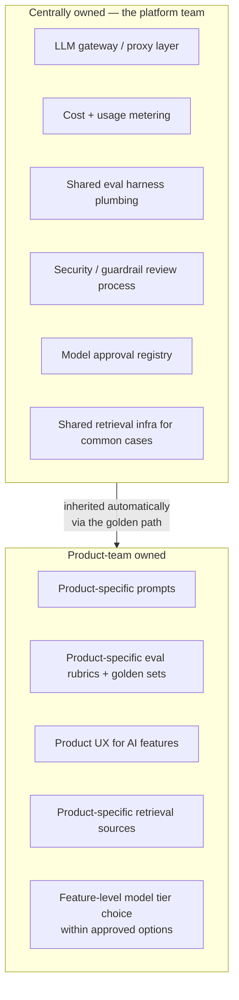
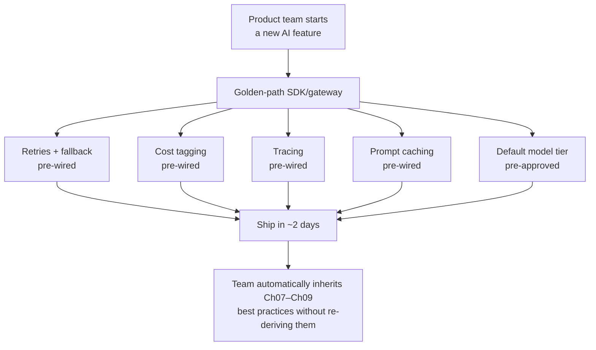
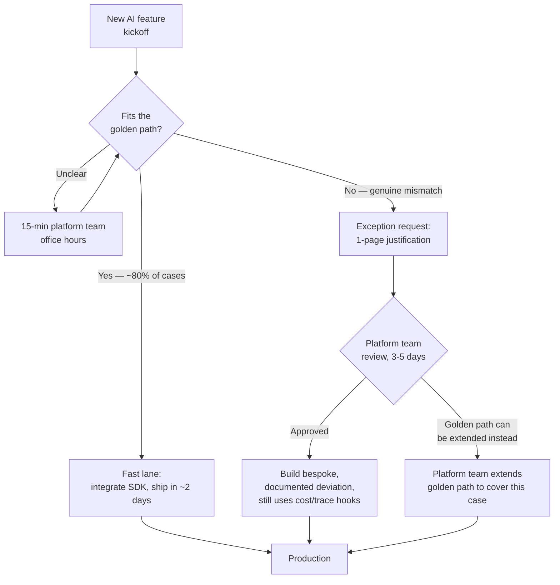
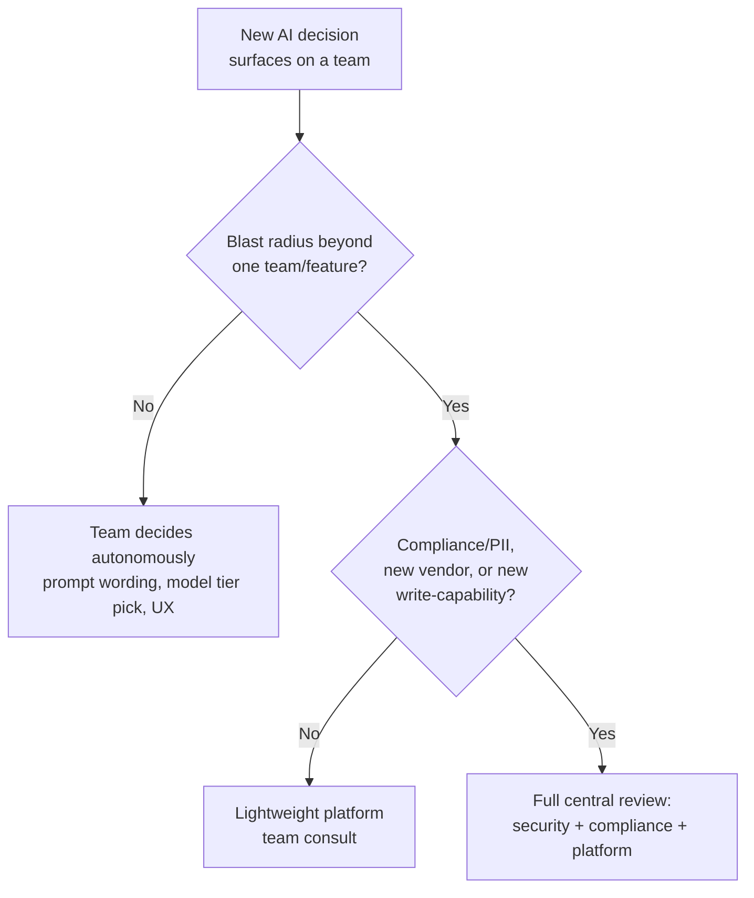
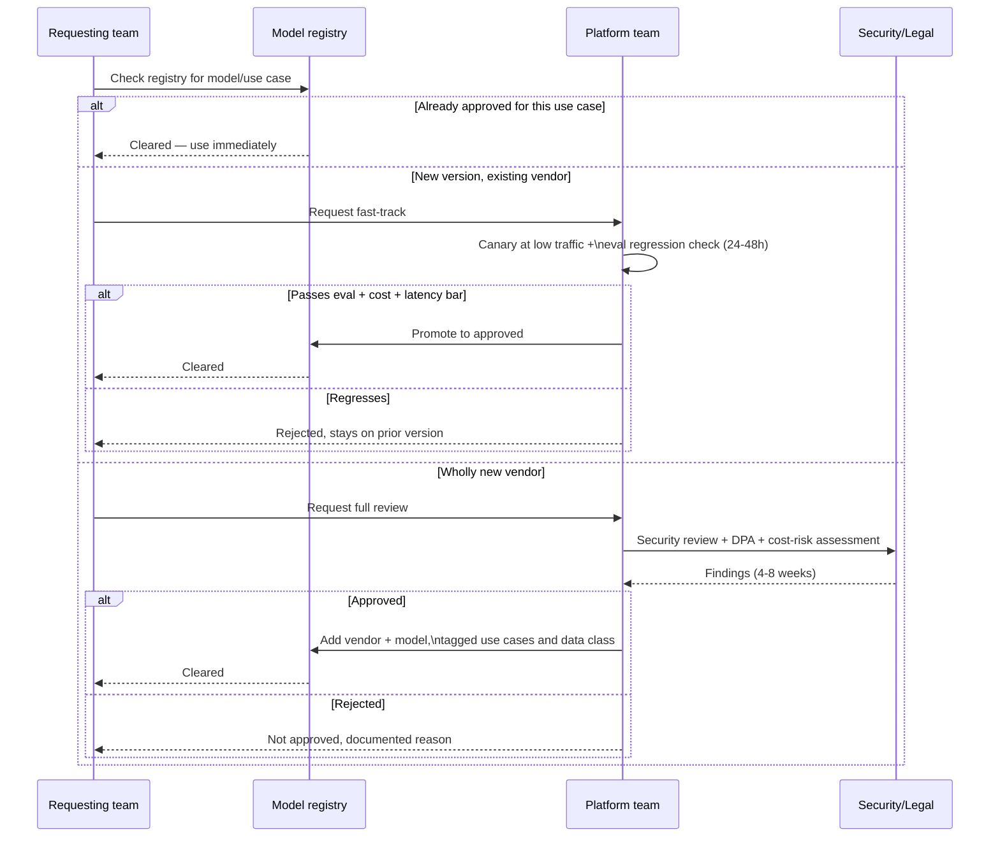

# AI Governance & Platform Strategy

## Overview

Every preceding chapter in this section is a decision framework for a single team facing a single choice: build or buy, fine-tune or RAG, one agent or many, which tenancy model, which cost levers, which latency budget, which reliability posture. This chapter is about what happens once fifteen teams are facing those same choices simultaneously, and a Staff engineer realizes that reviewing each decision individually — even with a good framework — does not scale. The answer is not a better review process. It is removing the decision entirely for the routine case, by building a platform that already embodies the right answer. This is the chapter [How Staff Engineers Think](01-how-staff-engineers-think.md) points to when its Scalability section says that at platform scale, "the highest-leverage move is setting defaults rather than deciding case by case" — this chapter is that move, worked through in full.

## Definition

AI governance and platform strategy is the discipline of deciding, once, which parts of an organization's AI stack should be centrally owned and standardized versus which parts should remain team-owned and locally decided — then building the paved road that makes the standardized answer the path of least resistance rather than a policy that has to be enforced. Done well, it is invisible: product teams experience it as "the fast way to ship an AI feature," not as a governance process they're subject to. Done badly, it is either a bottleneck (every model call requires a committee) or a fiction (a policy nobody follows because the sanctioned path is slower than going around it).

## The Real Question

The real question a Staff engineer is answering is not "how do we govern AI usage" — that framing produces committees and checklists. The real question is: **which decisions in the five-question framework from Chapter 1 are we willing to answer once, centrally, and bake into infrastructure — and which decisions do we deliberately leave to the team closest to the problem?** Every chapter in this section is, from the platform team's point of view, a decision that gets made *once*, correctly, by someone who has the time and the mandate to do it right, and then gets *inherited* by every team that follows, the same way a company doesn't ask each engineer to decide whether to use TCP or roll their own transport protocol. Getting this boundary wrong in either direction is expensive: draw it too narrowly and every team re-derives Chapter 7 through 9's lessons independently, at $40K–$150K of duplicated engineering time per team; draw it too broadly and the platform becomes a single point of friction that teams route around, which is worse than no platform at all because it creates a false sense that governance is happening.

## Core Concepts

- **Golden path** — the platform-provided, pre-integrated default (SDK, gateway, deployment template) that is deliberately the fastest way to ship, not merely an approved way. If the compliant path is also the slow path, adoption fails regardless of how correct it is.
- **Commodity layer vs. differentiating layer** — the same lens as [Build vs. Buy](02-build-vs-buy.md) applied inward: infrastructure that is identical in shape across every team (retries, tracing, cost tagging, model routing) is commodity and belongs on the platform; infrastructure that encodes actual product judgment (prompt content, retrieval sources, UX) is differentiating and belongs with the product team.
- **Model registry** — the canonical, queryable list of approved models, each tagged with its approved use cases, data-handling classification, and cost tier, which turns "can I use this model for this" from a Slack thread into a lookup.
- **Review tiers** — a graduated set of governance processes (autonomous, lightweight, full review) whose intensity is set by blast radius, not by how novel the underlying technology is — directly inheriting Chapter 1's blast-radius question rather than inventing a new axis.
- **Exception process** — the deliberate, lightweight escape hatch from the golden path for teams whose use case genuinely doesn't fit it. A golden path with no exception process becomes a golden path with shadow IT running in parallel.
- **Adoption as the leverage metric** — the platform team's output isn't the gateway or the registry; it's the fraction of the org's AI surface area running on defaults the platform team got right. A golden path nobody uses has produced zero leverage no matter how well-engineered it is.

## The Platform-vs-Product-Team Boundary

The boundary follows the same commodity-vs-differentiating logic as [Build vs. Buy](02-build-vs-buy.md), just applied to internal ownership rather than a build-or-vendor decision. Anything that looks the same regardless of which product team is asking — auth to model providers, cost attribution, tracing, retry/fallback logic, the eval harness's plumbing, the guardrail review process, the list of approved models — is commodity from the org's point of view even though it's deeply technical, and centralizing it is a pure win: one team builds it correctly once, instead of fifteen teams building fifteen mediocre versions. Anything that encodes actual product judgment — what a support bot's prompt says, which documents a legal-research feature retrieves against, what the golden-set of "correct answers" looks like for a specific feature, what the loading UX looks like while a response streams — is differentiating, in the sense that no central team can decide it better than the team that owns the product outcome, and centralizing it produces the opposite of a win: slow, generic, one-size-fits-none decisions imposed on people closer to the problem.

A useful test for which side of the line a given piece of work falls on: if getting it wrong creates an org-wide incident (a leaked API key, a cost runaway across every tenant, a compliance violation), it's platform-owned; if getting it wrong creates a bad feature (an awkward prompt, a stale retrieval source), it's product-owned. The platform team's job, stated plainly, is to make the first category disappear as a decision any product team has to make.

## Golden Paths: Making the Safe Choice the Easy Choice

A golden path is not a mandate — mandates get circumvented the moment they're inconvenient, the same way an over-restrictive corporate VPN produces shadow SaaS usage. A golden path is an economic argument: it has to actually be the fastest way to ship, not merely the approved way. Concretely, this means a platform-provided SDK and gateway that a product team drops into their service, and gets, without writing a line of it themselves: exponential backoff and provider fallback (inheriting [Reliability Engineering](09-reliability-engineering.md)'s patterns), automatic cost tagging per team/feature/tenant (inheriting [Cost Engineering](07-cost-engineering.md)), distributed tracing across the LLM call (inheriting [Latency Engineering](08-latency-engineering.md)'s observability requirements), prompt-response caching for repeated queries, and a default model tier that's already cleared the org's quality/cost bar for the common case.

The economics are the actual enforcement mechanism. A team integrating the golden path ships in an estimated 2 engineer-days. A team building the equivalent from scratch — its own retry logic, its own cost dashboard, its own tracing instrumentation, its own eval harness, its own understanding of which model tier clears the bar — takes an estimated 5 to 6 engineer-weeks, and typically ends up with a worse version of all five, because reliability and cost engineering are not any single product team's core competency. That 15x-or-larger gap is what makes teams choose the golden path voluntarily; no mandate is required, and mandate-based enforcement without that gap in place will fail regardless of how it's worded in a policy doc.

Golden paths that don't fit every case are inevitable and should be designed for from the start, not treated as a failure of the golden path's design. A team building a low-latency, high-throughput inference pipeline for a real-time product surface may have latency requirements the general-purpose gateway's overhead genuinely can't meet; a team working with data under a stricter regulatory regime may need a retrieval path the shared infrastructure doesn't yet support. The right response is a lightweight, explicit exception process — a short written justification, a time-boxed review by the platform team (targeting 3-5 business days, not weeks), and a documented deviation — not a blanket "no exceptions" policy. A platform that refuses exceptions teaches teams to quietly build parallel infrastructure and never mention it, which is strictly worse than a visible, reviewed exception, because the org loses both the standardization and the visibility.

Note the third branch: a well-run exception process is also the platform team's product discovery mechanism. If three unrelated teams request the same exception within a quarter, that's a signal the golden path's coverage is wrong, not that three teams are being difficult — the fix is to extend the paved road, not to deny the third request on principle.

## Central Governance vs. Team Autonomy

The question of what requires central review and what a team can decide unilaterally is the blast-radius question from [How Staff Engineers Think](01-how-staff-engineers-think.md) applied directly, not a new axis invented for governance's sake — review intensity should scale with how many people are affected if the decision is wrong, not with how novel or interesting the underlying technology is. A team adopting a genuinely new prompting technique for their own feature is low blast radius even though it might be the most technically interesting thing happening that week; a new foundation model vendor being added to the approved list is high blast radius even though from the outside it looks like a routine procurement action, because every downstream team that starts building against it inherits its compliance posture, its pricing volatility, and its outage risk.

**Requires central review:**

- Adding a new foundation model *vendor* (not just a new model version from an existing vendor) to the approved list — this carries org-wide compliance exposure (a new data processing agreement, a new subprocessor disclosure to customers) and cost-risk exposure (a vendor with a different pricing model or reliability track record that the org hasn't yet learned to operate against).
- Any tenant-facing feature that touches PII or regulated data — this is where [Section 22](../22-enterprise-ai/index.md)'s data governance and [Section 21](../21-ai-security/index.md)'s security concerns become load-bearing, and a product team's local judgment about what's "probably fine" is exactly the failure mode central review exists to catch.
- Granting a customer-facing agent a new *class* of tool or write-access (e.g., an agent that could previously only read account data being extended to issue refunds) — this changes the blast radius of a single bad model output from "wrong answer displayed" to "money moved," which is a different risk category entirely and should trigger the heavy branch of Chapter 1's tradeoff tree regardless of how incremental the code change feels to the team shipping it.

**Left to team autonomy:**

- Prompt wording and iteration — this is squarely differentiating work with a blast radius of one feature, and routing it through central review would be applying maximum rigor to a two-way door, one of Chapter 1's named anti-patterns.
- Which *already-approved* model tier to call for a given feature — the registry has done the hard work of pre-clearing options; picking among cleared options is a local cost/quality tradeoff the team is best positioned to make for their own feature.
- UX decisions for AI surfaces — streaming vs. non-streaming display, loading-state design, how errors are surfaced to the end user. These affect one product's users, not the org's compliance posture or shared infrastructure.

## The Model Approval Board and Registry Pattern

The mechanism that makes central governance operationally cheap rather than a bottleneck is a **model registry**: a queryable record, not a meeting, listing every approved model against its approved use cases (e.g., "cleared for customer-facing chat, not cleared for autonomous write-actions"), its data-handling classification (does the vendor train on inputs, what's the data retention window, which compliance certifications apply), and its cost tier (dollars per million tokens, mapped to the tier language used in [Cost Engineering](07-cost-engineering.md)). A product team's question "can I use this model for this" becomes a lookup against the registry instead of a Slack thread to a security engineer, which is the same shift Chapter 1's Scalability section describes — from a bottleneck reviewer to a reusable rubric — applied to model approval specifically.

The registry needs two distinct paths, matching two genuinely different risk profiles, the same way [Reliability Engineering](09-reliability-engineering.md) distinguishes a canary rollout from a full architectural migration:

**Fast-track — a new model version behind an already-approved vendor.** When an existing, approved vendor ships a new model version, the data-handling and vendor-relationship risk is already cleared; what's new is only the model's behavior. This gets a canary-style check, directly mirroring [Reliability Engineering](09-reliability-engineering.md)'s canary pattern: run the new version against the shared eval harness and the product team's golden set at low traffic (targeting a 24-48 hour turnaround), compare regression on quality, cost-per-request, and latency against the currently-approved version, and promote automatically if it clears the bar. No committee meeting required — the gate is the eval regression check.

**Full review — a wholly new vendor.** Adding a vendor the org has never contracted with triggers a slower path: a security review of the vendor's infrastructure and data handling, a data processing agreement negotiated by legal, and a cost-risk assessment (pricing volatility, minimum commitments, exit cost if the vendor underperforms). This realistically takes 4-8 weeks and should — the point of the fast-track isn't to eliminate rigor everywhere, it's to reserve the slow, expensive path for the cases that actually carry vendor-level risk, per Chapter 1's blast-radius framing.

## Decision Framework

Applying Chapter 1's five questions to "should this capability be centralized or left to teams" gives a Staff engineer a repeatable answer instead of a case-by-case argument each time a new capability comes up.

1. **What's the actual constraint?** Usually not "which team is more capable" — it's whether the capability is commodity (identical shape across teams, so centralizing captures economies of scale) or differentiating (requires product context only the local team has).
2. **Reversible or irreversible?** A platform default is reversible cheaply *before* teams adopt it and expensively *after* — three teams building against a gateway's API shape turns a config change into a migration. Decide the interface carefully before the first team onboards, since that's the actual one-way door, not the decision to centralize itself.
3. **6-month vs. 2-year cost.** Decentralized ownership looks cheap today (no platform team to staff) and expensive at 2 years (fifteen mediocre, duplicated reliability/cost stacks, no consistent security posture). Centralized ownership looks expensive today (headcount for a platform team before it's proven itself) and cheap at 2 years (one well-built stack, inherited for free by every new team).
4. **Blast radius.** This is the primary axis for the review-tier question specifically — see the section above.
5. **Smallest reversible bet.** Don't centralize everything on day one. Build the platform's first version around the 2-3 highest-leverage, most clearly commodity pieces (gateway, eval harness, registry — see the worked example), prove adoption and incident-rate improvement, then expand scope based on evidence rather than a comprehensive plan drawn up before any team has used it.

## Worked Example: Standing Up a Platform Team at a Mid-Size Company

A company with roughly 400 engineers and 15 product teams either shipping or planning to ship an AI feature decides to stand up a dedicated AI platform team — 4 engineers, reporting to a Staff engineer who previously watched three separate teams independently rebuild the same retry/fallback logic over two quarters. Rather than trying to govern everything at once, the team runs the smallest-reversible-bet discipline on the platform itself.

**What gets built first (the first two quarters):**

1. **The LLM gateway**, with cost tagging and tracing pre-wired, fronting the two already-approved model vendors. This is picked first because it's the most clearly commodity piece — every team needs it, no team's version of it should differ, and it's the direct enabler of Chapter 7 and Chapter 8's levers being inherited automatically.
2. **A shared eval harness** (plumbing only — the CI hooks, the scoring infrastructure, the golden-set storage format) that product teams plug their own rubrics and golden sets into, rather than the platform team writing every team's evals for them.
3. **A model approval registry**, initially covering just the two existing vendors' models, with the fast-track canary process described above ready before the first new model version ships.

**What's deliberately left to product teams initially:** prompt content, retrieval source selection, and eval rubric design — the platform team resists the temptation to also own these, correctly reading them as differentiating work where a central team would produce worse answers slower.

**Adoption over three quarters**, illustrative numbers:

| Quarter | Teams on golden path | Golden-path incident rate | Bespoke incident rate | Avg. time-to-ship (golden path) | Avg. time-to-ship (bespoke) |
|---|---|---|---|---|---|
| Q1 (launch) | 2 of 15 (13%) | 0 incidents | 1 sev-2/team/quarter | 4 days | 5-6 weeks |
| Q2 | 6 of 15 (40%) | 1 minor incident across 6 teams | 1.2 sev-2/team/quarter | 3 days | 5-6 weeks |
| Q3 | 11 of 15 (73%) | 1 minor incident across 11 teams | 1.1 sev-2/team/quarter | 2 days | 5-6 weeks |

The adoption curve isn't driven by a mandate — it's driven by the two teams in Q1 shipping visibly faster and having a visibly quieter on-call rotation than the teams still building bespoke, which is word-of-mouth evidence the rest of the org responds to faster than a policy memo would. By Q3, the incident-rate gap (roughly 1 incident across 11 golden-path teams versus what would project to ~12 incidents across 11 bespoke teams at the observed bespoke rate) becomes the platform team's strongest argument for expanding scope — into shared retrieval infrastructure for common cases next — because it's a number, not an opinion.

## Tradeoffs

| Advantages of a strong platform layer | Costs / risks of a strong platform layer |
|---|---|
| Reliability and cost best practices inherited automatically, not re-derived per team | Requires real upfront headcount investment (a platform team) before any product value ships |
| Consistent security/compliance posture across every AI feature, auditable in one place | A wrong early interface choice in the gateway becomes expensive to change once adopted |
| Fast time-to-ship for the 80% common case (days, not weeks) | The remaining 20% edge cases need a genuinely good exception process, or they go underground |
| Incident rate becomes measurable and comparable across teams | Platform team can become a bottleneck if governance scope creeps past commodity work |
| Org-wide visibility into AI cost and usage (impossible with 15 independent stacks) | Over-centralizing differentiating work (prompts, UX) produces slow, generic outcomes |
| A registry turns ad hoc approval conversations into a fast, auditable lookup | A registry that's out of date or poorly maintained is worse than no registry — false confidence |

## Cost Implications

- **Duplicated-build avoidance is the largest cost lever.** Fifteen teams independently building retry logic, cost dashboards, and tracing is a recurring, avoidable cost the moment more than two or three teams share the same underlying need — a pattern [How Staff Engineers Think](01-how-staff-engineers-think.md) names directly under blast-radius mapping. At an estimated 5-6 engineer-weeks of duplicated effort per team, 15 teams building independently instead of inheriting a shared gateway represents roughly 70-90 engineer-weeks of avoidable spend in the first year alone — well beyond a 4-person platform team's annual cost.
- **Golden-path features inherit Chapter 7's cost levers by default**, so their average cost-per-request tends to sit meaningfully below bespoke features that never got a cost pass — teams building their own stack rarely have the time or expertise to also implement prompt caching, model-tier routing, and batching correctly, so their cost-per-request commonly runs 2-4x a comparable golden-path feature.
- **The platform team itself is a fixed cost that needs to justify itself against a growing denominator.** Four engineers costing roughly $1.2M-$1.6M/year fully loaded is a bad trade if only two teams ever adopt the golden path; it's an excellent trade once 10+ teams do, which is why the adoption-rate metric (below) is the platform team's own cost-justification number, not just an engagement vanity metric.
- **A poorly governed model registry has a hidden cost**: paying enterprise-tier pricing for a model class that a cheaper, already-approved tier would clear, because no one had a fast way to check what was already available — the registry's ROI includes preventing this kind of avoidable overspend, not just preventing unapproved usage.

## Common Mistakes

- **Building the golden path before it's proven faster than the alternative.** A gateway that adds friction instead of removing it gets bypassed the first time a team is under deadline pressure, and once bypassed once, credibility is hard to earn back.
- **Centralizing differentiating work along with commodity work.** A platform team that insists on owning prompt content or eval rubrics "for consistency" slows every team down on the one axis where local judgment was actually better, and teaches product teams that the platform is a blocker rather than an accelerator.
- **No exception process.** Treating the golden path as mandatory with zero deviation path guarantees shadow IT — a team that genuinely doesn't fit the pattern will build around it quietly rather than loudly, and the org loses visibility exactly where it needed it most.
- **Review intensity that tracks novelty instead of blast radius.** Subjecting an interesting new prompting technique to the same review as a new model vendor wastes the platform team's scarce review capacity on the low-risk case while the org gets a false sense that high-risk cases are getting equivalent scrutiny.
- **Treating registry maintenance as a one-time project.** A registry that isn't updated when a vendor changes its data-retention terms or a model is deprecated becomes actively misleading — worse than the ad hoc Slack-thread process it replaced, because it looks authoritative.
- **Measuring platform success by existence instead of adoption and outcome.** A gateway that's "live" but used by 2 of 15 teams, with no incident-rate comparison ever run, has produced a slide, not leverage — the only real signal is whether teams outside the platform team are choosing to use it and whether it measurably reduces incidents.

## Measuring Platform Success

The metrics that tell a platform team whether the golden path is working are different from the metrics that tell it whether the golden path *exists* — a distinction worth stating explicitly because it's easy to report the second set and imply the first.

- **Adoption rate**: the percentage of new AI features built on the golden path versus bespoke, tracked per quarter. This is the leading indicator — an adoption rate that's flat or declining after a golden path has been available for two quarters means the economics described earlier aren't actually true in practice, and the platform team should treat that as a signal to fix the golden path, not a signal to mandate harder.
- **Incident rate, golden-path vs. bespoke**: this is the number that actually proves or disproves the platform's value, because it's the one metric a skeptical product-team lead can't easily argue with. If golden-path features have a materially lower sev-2+ incident rate than bespoke ones over a comparable period, the platform has demonstrated real value; if the rates are the same, the platform is providing convenience, not safety, and that's a different (weaker) pitch to the org.
- **Time-to-ship**: days from feature kickoff to production, golden-path teams versus teams building from scratch. This is the metric that drives voluntary adoption, since it's the number a product team's own leadership cares about most directly.
- **Cost-per-request, golden-path vs. bespoke**: golden-path features inherit [Cost Engineering](07-cost-engineering.md)'s levers (caching, tiered routing, batching) by default; bespoke features often don't get around to implementing them. A persistent gap here is both a cost argument and evidence the golden path is doing its job, not just being used.

None of these four metrics alone is sufficient — a high adoption rate with no incident-rate improvement suggests the platform is popular but not actually safer; a strong incident-rate improvement with low adoption suggests the platform works but isn't reaching enough of the org to matter. The four together are what let a platform team's Staff sponsor make an honest case to leadership about whether the investment is paying off.

## Real World Examples

The following are illustrative reasoning patterns consistent with each company's known public product surface and engineering culture — not confirmed internal decisions.

- **Google**: a plausible internal pattern is a central "Gemini API access" layer that every internal team building on top of Gemini goes through, rather than each product team negotiating its own quota, auth, and safety-filter configuration — the commodity layer (auth, quota, safety filtering) centralized, the differentiating layer (prompt design per product) left to teams, mirroring exactly the boundary this chapter describes.
- **Microsoft**: a representative governance pattern given Microsoft's enterprise customer base is a central Azure OpenAI Service "model catalog" functioning as a de facto registry — each model tagged with region availability, content-filtering configuration, and enterprise compliance certifications — letting internal and customer teams pick a model without re-deriving its compliance posture themselves each time.
- **Uber**: a plausible platform pattern, given Uber's history of internal platform teams (Michelangelo for ML), is a shared "LLM gateway" analogous to Michelangelo's model-serving layer — centralizing traffic routing, cost attribution per business line, and fallback behavior, while leaving feature-specific prompt and retrieval logic to the dozens of product teams building on top of it.
- **Airbnb**: a representative pattern for a company with a strong internal-tooling culture is a central "AI feature review" gate specifically for anything customer-facing and trust-sensitive (e.g., a host-guest messaging assistant), where the review is proportional to blast radius — a low-risk internal support tool for customer service agents ships with lightweight review, while a guest-facing feature with write-access to bookings gets full review, matching this chapter's review-tier framing.
- **Stripe**: a plausible pattern given Stripe's regulatory exposure is unusually strict central review specifically for any AI feature touching payments data or making autonomous decisions with financial consequence (e.g., an agent that could flag or act on fraud signals), while internal developer-tooling uses of AI (code review assistants, internal documentation search) are left to much lighter, team-level governance — illustrating that the review-tier boundary is set by blast radius and regulatory exposure, not by a single company-wide policy applied uniformly.

## Interview Questions

### Beginner

**Q: What's the difference between a platform team and a product team in the context of AI features?**
A product team owns a specific AI-powered feature end to end — the prompt, the retrieval sources specific to that feature, the UX, and the eval rubric that defines what "correct" means for that feature. A platform team owns the shared infrastructure every product team's AI feature runs on top of — the gateway that talks to model providers, cost and usage tracking, tracing, and the list of models that are approved to use at all. The product team's job is to make one feature good; the platform team's job is to make every team's feature reliable, cost-tracked, and compliant without each team having to solve those problems themselves.

**Q: Why would a company want a single, centrally-owned LLM gateway instead of letting each team call model providers directly?**
Calling a model provider directly looks simple for one team, but it means each team separately implements retry logic, cost tracking, authentication, and fallback behavior — and most teams don't have the time or the specialized knowledge to implement all of that well, so quality is inconsistent and effort is duplicated. A single gateway means those problems get solved once, by a team whose job is specifically to solve them well, and every other team inherits a good implementation for free just by routing their calls through it, the same way most engineers don't write their own TCP stack.

### Intermediate

**Q: How would you decide what belongs on a shared AI platform versus what should stay with individual product teams?**
Use a commodity-versus-differentiating lens, the same one used for build-vs-buy decisions: if the piece of work looks the same regardless of which product team is asking — retries, cost tagging, tracing, which models are approved and how they're vetted — it's commodity, and centralizing it captures real economies of scale with no loss of quality, since no product team benefits from writing its own version. If the piece of work requires product-specific judgment — what a prompt says, which documents to retrieve against, what the eval rubric considers a correct answer, what the loading UX looks like — it's differentiating, and a central team would make it worse and slower than the team closest to the product outcome. The test in practice: would getting this wrong cause an org-wide incident (centralize it) or a bad feature (leave it local)?

**Q: What is a "golden path" and why does it need to be faster than the alternative, not just approved?**
A golden path is the platform-provided default way of building an AI feature — an SDK or gateway with reliability, cost tracking, and tracing already wired in. It has to be genuinely faster to ship on than building the equivalent from scratch, because a mandate alone doesn't survive contact with a real deadline: if a team under time pressure finds the "approved" path slower, they will build around it, and the org loses both standardization and visibility into what actually happened. The golden path's adoption is an economic outcome, driven by the gap between "2 days to integrate" and "5-6 weeks to build the equivalent," not a policy outcome enforced by review.

### Senior

**Q: Describe how you'd design the review process for adding a new model to an approved list, and why it should differ for a new version of an existing model versus a wholly new vendor.**
The two cases carry genuinely different risk. A new version of an already-approved vendor's model changes the model's behavior but not the vendor relationship — the data processing agreement, the compliance certifications, and the security posture are already established. That case should get a fast-track: run the new version through the shared eval harness and the relevant product golden sets at low, canaried traffic, check for quality, cost, and latency regression against the currently-approved version, and promote automatically if it clears the bar, mirroring a canary deploy pattern rather than a committee meeting. A wholly new vendor is a different risk category — it introduces a new party with access to the org's data, under new contractual terms, with an unproven reliability track record — and deserves the slower path: security review, a negotiated data processing agreement, and a cost-risk assessment. Collapsing both cases into one review process either makes the fast case too slow (a new model version taking six weeks because it goes through vendor-level security review) or makes the slow case too fast (a new vendor onboarded with only an eval check and no data-handling review), and both failure modes are avoidable by recognizing they're different risk profiles from the start.

**Q: A product team wants to bypass the golden path because their use case has stricter latency requirements than the shared gateway can meet. How do you handle this?**
This is exactly the case a golden path's exception process exists for, and refusing it outright is a mistake — it teaches the team to build a parallel path quietly instead of visibly, which is worse for the org than a documented deviation. The right response is to treat the request as real signal: have the team write a short justification with the actual latency numbers, review it against the shared gateway's overhead within a few days rather than weeks, and approve a bespoke path if the mismatch is genuine — while still requiring the team's bespoke build to hook into the platform's cost-tagging and tracing infrastructure even if it skips the request-routing layer, so the org doesn't lose visibility just because it granted an exception. If this same exception request comes from more than one or two teams within a quarter, that's a stronger signal: the golden path's latency profile is a real gap, and the platform team should prioritize closing it rather than continuing to grant one-off exceptions indefinitely.

### Staff

**Q: You're brought in to stand up an AI platform team at a company where 15 product teams are independently building AI features with no shared infrastructure. What do you build first, and how do you decide?**
I'd apply the smallest-reversible-bet discipline to the platform itself rather than trying to design a comprehensive platform up front. First, I'd map which pieces of what those 15 teams are building are genuinely identical in shape — almost certainly retry/fallback logic, cost tracking, and model access, since those don't vary by product — versus which pieces are legitimately different per team, like prompt content and retrieval sources. I'd build the smallest version of the commodity layer first: a gateway with cost tagging and tracing, and a lightweight model registry covering whatever vendors are already in use, deliberately leaving eval rubric design and prompt content to the product teams even though I could technically centralize those too. I'd pick two or three early-adopter teams — ideally ones already in pain from duplicated effort — get them onto the golden path within the first quarter, and instrument the four things that actually prove the platform's value: adoption rate, golden-path versus bespoke incident rate, time-to-ship, and cost-per-request. If those numbers show the golden path is faster and safer within two quarters, the rest of the org adopts it on the evidence, and I use that same evidence to justify expanding the platform's scope — shared retrieval infrastructure next, most likely — rather than trying to solve everything in the first release, which is both slower to prove out and, if the initial bet is wrong, more expensive to unwind.

**Q: How does building a good AI platform relate to the concept of "leverage" from Chapter 1, and why is this the natural endpoint of everything else in this section?**
Chapter 1 defines leverage as the multiplier a Staff engineer applies to their time by influencing a decision many teams inherit, rather than doing equivalent individual implementation work, and it explicitly names platform defaults as the mechanism that lets the five-question framework scale past the point where one person can personally review every decision. Every other chapter in this section — build vs. buy, fine-tuning vs. RAG, single- vs. multi-agent, multi-tenancy, cost, latency, reliability engineering — is a decision a Staff engineer could, in principle, walk through individually with each of fifteen teams. But that doesn't scale; the reviewer becomes the bottleneck, exactly as Chapter 1's Scalability section describes. Building the platform is what converts "I personally reviewed this decision for every team" into "I got this decision right once, and every team that uses the golden path inherits the right answer without knowing there was a decision to make." That's the highest-order form of leverage available to a Staff engineer: not being in the room for every choice, but having already shaped the room so that the easy choice is the correct one. It's why this chapter closes the section rather than sitting anywhere else in it — it's not a ninth technology decision alongside the other eight, it's the mechanism by which the other eight get applied at organizational scale instead of remaining one person's private good judgment.

## Google-Level Follow-Ups

- "Your golden path adoption rate has been flat at 30% for two quarters despite the gateway objectively saving teams five weeks of work. What's your first hypothesis?" — probes whether the candidate looks past "teams are lazy or resistant" to check whether the golden path's actual integration cost matches its claimed cost, since a flat adoption curve after the economics were supposedly proven usually means the pitch and the reality have diverged.
- "A team went around the golden path, built their own stack, and it caused a cost-runaway incident that cost $80K in a weekend. How do you respond, and how do you prevent the next one — without banning exceptions?" — probes whether the candidate distinguishes between fixing the incident and fixing the underlying incentive structure, and resists the reflex to respond to one bad exception by eliminating the exception process, which would just push the next deviation further underground.
- "How do you tell the difference between a platform team that's providing real leverage and one that's just accumulating headcount and calling it infrastructure?" — probes for whether the candidate reaches for the adoption-rate and incident-rate-comparison metrics unprompted, rather than defaulting to "the platform exists and is used by some teams" as sufficient evidence.
- "At what point does a model registry itself become a bottleneck — and how would you redesign governance once that happens?" — probes whether the candidate recognizes that governance mechanisms have their own scaling limits (a registry maintained by a small team can itself become the new single point of friction at sufficient org size) and can reason about the next layer of delegation, rather than assuming any one governance structure scales indefinitely.

## Key Takeaways

- The platform team's job is to make the commodity layer of AI infrastructure — the gateway, cost metering, tracing, the eval harness's plumbing, the model registry — disappear as a decision product teams have to make, the same commodity-vs-differentiating lens used in [Build vs. Buy](02-build-vs-buy.md).
- A golden path only works if it's genuinely faster to ship on than the bespoke alternative; the economics, not a mandate, are what actually drive adoption.
- A golden path needs an explicit, fast, lightweight exception process — over-restrictive paved roads get bypassed via shadow IT, which is worse than a visible, reviewed deviation.
- Central-review intensity should scale with blast radius — new vendor, PII exposure, new write-access for an agent — not with how novel or interesting the underlying technology is, directly inheriting Chapter 1's framing.
- A model registry with a fast-track (canary + eval regression, for new versions of approved vendors) and a full-review path (security + legal + cost-risk, for new vendors) turns model approval from a bottleneck meeting into an auditable lookup.
- Platform success is measured by adoption rate, golden-path-vs-bespoke incident rate, time-to-ship, and cost-per-request — not by whether the platform exists, since an unused gateway has produced zero leverage regardless of engineering quality.
- This chapter is the mechanism that lets [How Staff Engineers Think](01-how-staff-engineers-think.md)'s five-question framework scale past the point where one Staff engineer can personally review every decision: a good platform default is leverage applied once, inherited by every team that follows, which is the direct payoff of the leverage concept this whole section is built on.

---

*Part of [Staff-Level Architecture](index.md) in the [AI System Design Notes](../index.md). Tracked in [BACKLOG.md](https://github.com/GyanendraChaubey/AI-System-Design-Notes/blob/main/BACKLOG.md).*
