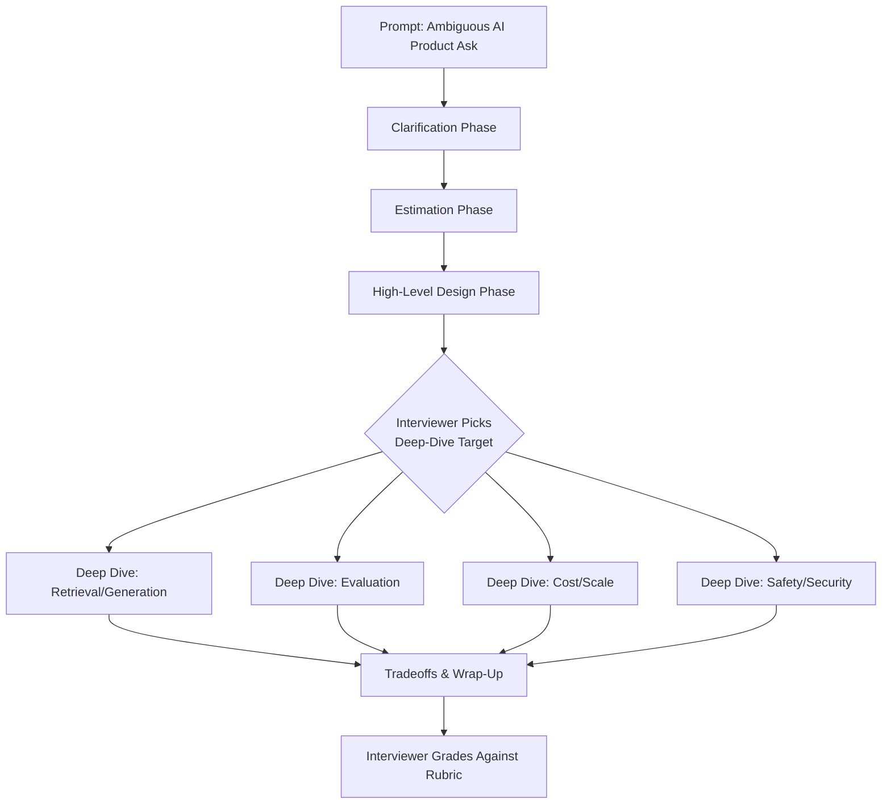
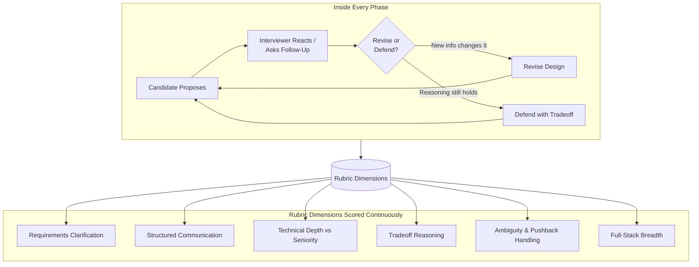
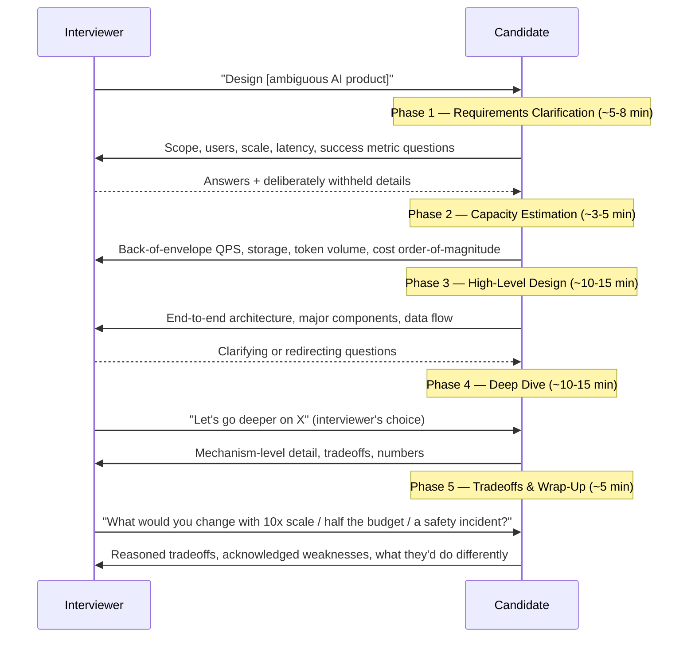
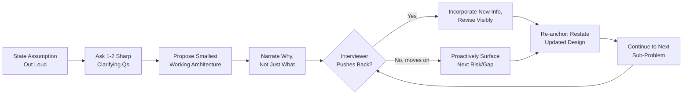
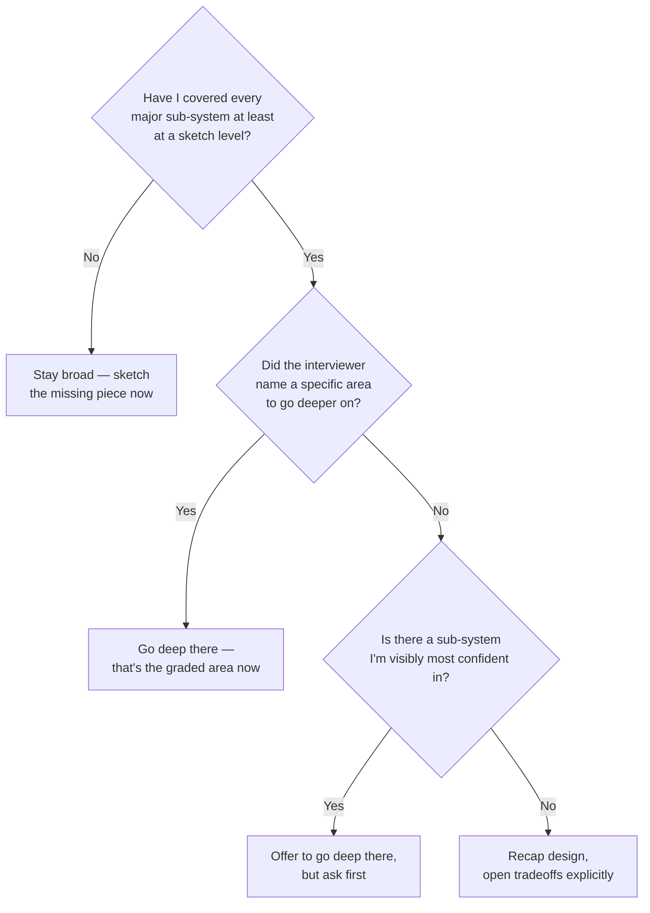

# How AI System Design Interviews Work

## Overview

An AI System Design interview is a 45-60 minute structured conversation in which a candidate is handed an intentionally vague AI product prompt — "design ChatGPT," "design an enterprise search assistant," "design a coding agent" — and is observed working through it out loud. The interviewer is not waiting for a single correct diagram. They are watching *how* the candidate converts ambiguity into a defensible architecture, and how that architecture bends under pushback.

## Definition

An AI System Design interview is a live, interviewer-guided design exercise in which a candidate must clarify requirements, estimate scale, propose and justify an end-to-end architecture (covering retrieval/generation, data, evaluation, cost, and safety, not just "the model part"), and defend or revise that architecture under follow-up questioning — all within a fixed time box, with the candidate's reasoning process, not the final diagram, as the primary graded artifact.

## Problem Statement

Most candidates prepare the wrong way: they study architectures instead of the *conversation*. They memorize a RAG diagram or a multi-agent pattern and walk in expecting to recite it. Three things go wrong as a result:

- **They answer a question that wasn't asked.** "Design ChatGPT" is not a request for a transformer explainer — it's a request to *discover*, through questions, what the interviewer actually wants to discuss (safety filtering at scale, multi-turn memory, tool use). Skipping clarification means solving the wrong sub-problem well, which still fails the interview.
- **They treat pushback as a verdict, not a probe.** Pushback ("what if traffic is 10x that?") is the mechanism the interview is graded by, not a penalty for a bad answer. Getting defensive or backpedaling completely reads as someone who can't survive a real design review.
- **They go deep on the one sub-system they rehearsed and shallow everywhere else.** A candidate who drilled vector database internals will default to spending 20 minutes there and never reach evaluation or cost. Depth in one place does not offset missing breadth — it actively costs points, since it signals optimizing for what's known rather than what the problem needs.

The deeper reason this interview is hard to prepare for: it has no fixed answer key. Two candidates can propose different architectures for the same prompt and both score "Strong Hire," because the grade is mostly about the reasoning trail, not the destination.

## Why Companies Interview This Way

The format screens for "operate effectively when the architecture isn't known yet," not "implement a known architecture." Most real AI product decisions (build vs. buy a vector DB, RAG vs. fine-tune, how much latency budget a reranker gets) arrive looking exactly like this interview: underspecified, with real tradeoffs, under time pressure, with a stakeholder who pushes back.

Companies tried structured alternatives first and moved away from them. Take-home documents reward writing skill and off-hours time more than live reasoning, and are trivially LLM-assisted — a sharp problem specifically for *AI* system design interviews, since the take-home format rewards exactly the skill the cheating tool is best at. Pure trivia interviews ("what is HNSW") test recall, which is cheap to look up on the job. Live design conversation survives both failure modes: it's hard to fake reasoning in real time, and it directly samples the skill — navigating ambiguity with a counterparty in the room — the job actually requires.

## Core Concepts

- **Ambiguity by design** — the prompt is deliberately underspecified. An unambiguous prompt would only test execution, not judgment.
- **The rubric, not the diagram** — interviewers grade a fixed set of dimensions (see [The Rubric Dimensions](#the-rubric-dimensions)) applied to *how* the candidate reached their design, not a reference architecture compared box-for-box.
- **Signal vs. noise** — every clarifying question, assumption, and tradeoff statement is a data point the interviewer uses to place the candidate's level; silence or unjustified assertions are noise that defaults the interviewer toward a lower score.
- **Pushback as a probe, not a verdict** — interviewers escalate scrutiny specifically on the parts of the design the candidate seemed most confident about, to test whether confidence was backed by reasoning.
- **Calibration to seniority** — the same prompt goes to new-grad and Staff candidates; what changes is the bar for depth, proactivity, and judgment, not the prompt.
- **Driving vs. responding** — at senior levels, the candidate is increasingly expected to set the agenda rather than purely answer whatever is asked next.

## The Interview's Structure

Every AI system design interview is the same shape: a linear conversation divided into phases, with an interviewer-controlled fork into a deep dive based on what the candidate has shown the most or least confidence in so far.

Underneath that shape, each phase is a small loop of propose → interviewer reacts → candidate revises, repeated until time runs out. The detailed view makes the rubric explicit as the thing every loop feeds:

The candidate-visible structure is five phases. The interviewer-visible structure is six rubric dimensions scored continuously across all five — a strong clarification question scores on dimension 1 *and* signals dimension 3 (depth) *and* sets up dimension 4 (tradeoffs) minutes later. Nothing is scored phase-by-phase in isolation.

## The Rubric Dimensions

The rubric dimensions are the real "components" of this interview — each a distinct thing the interviewer independently tracks, with its own bar and failure mode.

| Dimension | Rewards | Common failure |
|---|---|---|
| **Requirements clarification** | Questions that narrow the problem to the part worth solving (scale, users, latency, success metric) | Zero clarification, or over-clarifying as a stalling tactic |
| **Structured communication** | A visible plan, explicit signposting between phases | Jumping between sub-topics with no narration |
| **Technical depth proportional to seniority** | Depth matching the level's bar, not maximum depth everywhere | Too shallow (no mechanism under the boxes), or showcasing irrelevant expertise |
| **Tradeoff reasoning** | Naming real options and a reasoned choice ("X over Y because Z, accepting cost W") | Listing options with no resolution |
| **Ambiguity & pushback handling** | Updating the design on new information while keeping what's defensible | Capitulating instantly, or refusing to budge regardless of validity |
| **Full-stack breadth** | Covering generation/retrieval *and* evaluation, cost, security, reliability unprompted | Going deep only on "the model part," never reaching the rest of the stack |

A candidate can be strong on five dimensions and still get a weak overall rating if the sixth — breadth — is missing entirely, since breadth most directly predicts whether someone can own a real production AI system end to end rather than one slice of it.

## The Five Interview Phases

A single interview session moves through five time-boxed phases. The allocation below assumes a 45-minute slot (the most common length); a 60-minute slot stretches design and deep-dive, not clarification or estimation, which don't benefit from extra time past a point.

The full time-boxed framework — including recovering from a phase overrun — is in [The Whiteboarding Framework](02-the-whiteboarding-framework.md). The number worth internalizing now: a candidate still in clarification at minute 12 of a 45-minute interview has already lost the time needed for a credible deep dive, and an interviewer watching that happen will usually intervene — itself a negative time-management signal.

## How Strong Answers Navigate the Conversation

The difference between a "good enough" and a Staff-level answer is rarely the final architecture — both groups often land on similar diagrams. The difference is the *process* that produced the design, and it follows a recognizable pattern.

The recurring strong-answer pattern has four properties, each mapped to something interviewers explicitly listen for:

1. **Assumptions are spoken, not silent.** "I'll assume consumer-scale, ~10M MAU, optimizing for cost over absolute latency unless told otherwise" gives the interviewer a cheap, early hook to correct, instead of a wrong assumption surfacing 30 minutes in.
2. **The first architecture proposed is the smallest one that could plausibly work**, with complexity added only when a stated requirement demands it. Reaching for multi-agent orchestration before establishing simpler retrieval wouldn't suffice reads as over-engineering, not strength.
3. **Every "what" comes with a "why."** "I'd use a vector DB" is weaker than "I'd use a vector DB because the knowledge base updates hourly and fine-tuning can't keep pace" — the second version survives a follow-up because the reasoning, not just the conclusion, is already on the table.
4. **Gaps are surfaced before the interviewer has to ask.** "I haven't covered evaluation yet — here's how I'd know this system actually works" turns a rubric gap (breadth) into a proactive strength instead of waiting to be caught short.

## Tradeoffs

The candidate's hardest live decision is depth versus breadth allocation, remade every few minutes with an incomplete picture of how much time is left.

| Leaning broad | Leaning deep |
|---|---|
| Demonstrates full-stack awareness; lower risk of a missing rubric dimension | Demonstrates the depth the Senior/Staff bar requires; shallow breadth alone caps the rating |
| Risk: reads as a survey with no real expertise shown | Risk: runs out of clock before reaching evaluation, cost, or security |
| Safer default for the first 60-70% of the time box | Right once a shallow end-to-end design exists and the interviewer has signaled where they want depth |
| Costs little if wrong — easy to add a missed area later | Costs a lot if wrong — depth on a sub-system the interviewer doesn't care about is unrecoverable time |

The practical resolution most strong candidates converge on: stay broad until a complete (if shallow) end-to-end design exists, then ask directly — "Where would you like me to go deeper?" — rather than guessing. Asking this is itself a positive signal: it shows the candidate understands depth allocation is negotiated, not unilateral, in this format.

## Scalability

"Scalability" for a candidate means how the bar for a passing answer changes with seniority — the same prompt, four different bars.

| Level | What "passing" looks like | What's specifically graded |
|---|---|---|
| **Beginner / new grad** | A coherent, complete, end-to-end design that works on paper | Avoided an obvious architectural error; asked any clarifying questions at all |
| **Intermediate (mid-level)** | The above, plus reasonable component choices with basic justification | Can explain *why* each component is there; catches one or two non-obvious requirements unprompted |
| **Senior** | Unprompted tradeoff reasoning at most decision points, proactively surfaced non-functional requirements (latency SLOs, cost ceiling, failure modes) | Depth of tradeoff reasoning — typically 4-6 distinct unprompted tradeoffs over the session — and ownership beyond "the model part" |
| **Staff** | Organizational judgment: what *not* to build, buy-vs-build, second-order consequences (on-call burden, security surface, team structure) | Drives the conversation rather than reacting; typically 7+ tradeoffs, several at the "should we build this at all" level |

The quantified gap worth remembering: a "good enough" Senior answer surfaces on the order of 4-6 unprompted tradeoffs in 45 minutes. A Staff answer in the same time surfaces 7 or more, and several are about scope and organizational consequence ("I wouldn't build a custom reranker here — the eval gain doesn't justify owning that pipeline") rather than purely technical choice.

## Reliability

Going down a wrong path mid-interview is not fatal — every candidate does this to some degree, and recovery is itself graded. What's fatal is failing to correct it once new information makes the path visibly wrong.

| Failure mode mid-interview | Recovery move | Why it works |
|---|---|---|
| Early assumption corrected by the interviewer | Acknowledge it, restate the corrected assumption, walk forward — don't silently patch the design | Makes the revision visible, which is the signal graded (handling ambiguity) |
| Spent too long on a sub-system that wasn't the interviewer's focus | Name it: "I want to make sure we reach evaluation and cost — I'll park further detail here unless you want to continue" | Demonstrates time-awareness and self-correction instead of waiting to be cut off |
| Proposed architecture doesn't survive a pushback question | Don't defend reflexively — say what breaks, then fix it: "That doesn't handle bursty traffic — I'd add a queue and degrade to cached results under load" | Turns a wrong turn into a demonstrated tradeoff moment, graded positively despite the original flaw |
| Lost track of the overall design after a long deep dive | Take 30 seconds to restate the current end-to-end picture | Re-anchoring costs almost no time and stops the conversation building on a design the candidate can no longer hold in their head |
| Late realization a rubric dimension was skipped entirely | Say so directly and use remaining time there | A self-caught gap, even at minute 40, scores better than one the interviewer has to point out |

The general principle: interviewers evaluate the trajectory of the conversation, not whether it was correct from minute one. A visible, reasoned correction beats an answer that happened to be right from the start with no shown reasoning.

## Security

A consistently observed reason strong technical answers still receive a middling rating: the candidate never mentions security, safety, or abuse unless explicitly asked — and for AI systems specifically, the interviewer will often *not* ask, treating "did this come up unprompted" as the actual test.

This matters more for AI systems than generic backend design because they carry attack surfaces a CRUD service doesn't: prompt injection through retrieved or tool-returned content, data exfiltration through a generation channel, jailbreaks against safety filters, PII leakage through outputs or logs. A candidate who designs a RAG pipeline or a tool-using agent and never says "prompt injection," "permissions," "PII," or "abuse" has left a rubric dimension empty — even if everything else is excellent.

Under time pressure, the move is not a deep security discussion (that's a deep-dive topic in its own right) — it's one sentence placed naturally where it belongs: "Since this agent can call tools, I'd treat tool output as untrusted input, not instructions" or "retrieval needs document-level permissions filtered at query time, not checked on the final answer." One unprompted sentence at the right point recovers most of the available credit. Saying nothing at all is the single most common reason a technically excellent answer caps below the top rating.

## Cost Optimization

The scarce resource here is not money — it's the 45-60 minutes themselves. Time-budget optimization during the interview is the direct analog of cost optimization in production: spend the budget where it returns the most signal per minute, and notice when a phase has already returned its value.

- **Clarification has rapidly diminishing returns.** The first 3-4 questions (scale, users, success metric, hard constraints) usually unlock 80% of the value; question 8 about a minor edge case rarely earns back the minute it costs. Strong candidates stop once they have enough to start, and say so explicitly.
- **Estimation should be fast and rough, not precise.** A 60-second back-of-envelope ("10M MAU, ~5 queries/day, ~50M queries/day, ~580 QPS average, 3-5x that at peak") beats a slow, precise derivation — the interviewer is checking the candidate *can* reason about scale, not auditing arithmetic.
- **The single highest-cost mistake is over-investing in the first sub-system reached.** Spending 20 of 45 minutes on chunking strategy before reaching generation, evaluation, or cost burns nearly half the budget on one box. The fix is the same "smallest working version first" discipline from Design Patterns: sketch every major piece shallowly before deepening any one.
- **Banking time for wrap-up pays back disproportionately.** The last 5 minutes — explicit tradeoffs, self-identified weaknesses — read as a concentrated sample of judgment. Running out of clock before reaching it costs more than under-developing one mid-interview deep dive.

## Monitoring

The closest a candidate gets to "monitoring" is structured self-assessment after a mock interview, since there's no live dashboard during the real thing. What correlates most with improvement is reviewing a recorded mock session against the same rubric dimensions a real interviewer uses, as data rather than vibes:

- **Time-stamp each phase transition** against the budget in [The Five Interview Phases](#the-five-interview-phases) — most candidates discover their clarification phase runs 2-3x longer than assumed until they actually time one.
- **Count unprompted tradeoffs surfaced**, the same metric from [Scalability](#scalability), and track it across sessions — a flat count usually means tradeoffs are recited for familiar prompts rather than reasoned through live.
- **Check breadth as a post-hoc checklist**: did generation/retrieval, data, evaluation, cost, security, and reliability each get at least one sentence? Skipping the same dimension repeatedly reveals the actual weak spot, not whichever felt weak in the moment.
- **Get feedback on the reasoning trail**, not the final diagram — ask a reviewer where they had to fill in a skipped step, since that's what's actually graded.
- **Track recovery quality**, not just whether a wrong turn happened — every session has one; what matters is whether it was caught and visibly corrected.

## Production Best Practices

- Prepare the *framework*, not a memorized answer per product. Scripting "design ChatGPT" and "design Perplexity" separately fails the moment the prompt is "design an AI scheduling assistant" — drill the five-phase process in [The Whiteboarding Framework](02-the-whiteboarding-framework.md) until automatic, and let architecture content come from genuine systems understanding.
- Practice capacity estimation as an isolated drill, not only inside full mocks — rough live math under time pressure is a distinct skill from architecture reasoning. See [Estimation & Capacity Planning Drills](03-estimation-and-capacity-planning-drills.md).
- Default to narrating the plan before executing it ("a few minutes on requirements, then high-level design, then deep dive wherever you'd like") — costs 15 seconds, scores immediately on structured communication.
- Treat each mock's feedback as input to the next one, tracking the same weak dimension across sessions rather than treating each as unconnected.
- Calibrate to the specific company before the interview, not during it — see [Company-Specific Focus Areas](04-company-specific-focus-areas.md) — so a heavy infrastructure-focused deep dive isn't a surprise.
- Read the architecture chapters for understanding, not quotable lines. [Anatomy of an AI System](../01-fundamentals/03-anatomy-of-an-ai-system.md) and [RAG Architecture](../06-rag/01-rag-architecture.md) are the two chapters most prompts collapse back into at the high-level design phase.

## Real World Examples

The following is a heuristic based on each company's public product surface and engineering blog posts, not insider knowledge of any specific interview bank — a prior to calibrate against, not a leak. See [Company-Specific Focus Areas](04-company-specific-focus-areas.md) for the fuller treatment.

- **Google** — search/infrastructure DNA suggests more weight on scale, latency budgets, and serving infrastructure relative to model-specific nuance.
- **OpenAI / Anthropic** — frontier chat products and developer APIs suggest emphasis on safety/alignment, eval methodology, and the inference-serving path (batching, latency, cost/token) as first-class topics.
- **Meta** — scale and feed/social DNA suggests emphasis on personalization and recommendation-adjacent thinking, defaulting to billions-of-users scale.
- **Amazon** — leadership-principles culture suggests probing on ownership and customer-obsession framing of tradeoffs, plus cost discipline.
- **Uber** — marketplace/logistics core suggests emphasis on real-time systems and reliability under operational load.
- **Stripe** — developer-platform and financial-infrastructure focus suggests emphasis on API quality, correctness guarantees, and security around financial/PII data.
- **Glean** — enterprise search product suggests heavy emphasis on permission-aware retrieval and multi-connector data governance as the core of the design.
- **Cursor** — developer-tool surface suggests emphasis on code-specific retrieval, interactive-loop latency, and agentic tool use.
- **Perplexity** — answer-engine product suggests emphasis on retrieval quality, citation/grounding, and real-time freshness.

## Interview Questions

### Beginner

**Q: "Design a simple AI-powered FAQ chatbot for a single company's help center."**
Clarify scope first (document count, query volume, multi-turn vs. single Q&A). Propose the smallest working architecture: a basic RAG pipeline — chunk and embed documents, embed the query, match, pass top results to an LLM. State the obvious risk (hallucination on uncovered questions) and mitigation (say "I don't know" on low retrieval confidence, fall back to a human-agent link). A passing answer here is complete and coherent end-to-end, without deep tradeoff discussion.

**Q: "What's the difference between this kind of interview and a typical coding interview?"**
A coding interview has a single verifiable output; this one has no single correct output, and the candidate is graded on the clarification, structure, and reasoning that produced the design. The right response to ambiguity is to ask questions and state assumptions, not to guess and start drawing boxes.

### Intermediate

**Q: "Design an AI writing assistant that suggests completions as a user types in a document editor."**
Clarify latency tolerance first — this is a latency-sensitive, interactive-loop product, unlike a chatbot. Pivot to sub-200ms-feeling completions: a smaller/faster model, aggressive context caching, possibly a draft-and-verify pattern (small model proposes, larger model invoked only on demand). Surface the tradeoff unprompted — quality vs. responsiveness — and resolve it: small model by default, explicit "improve this" action calling a larger model.

**Q: "Estimate the infrastructure cost of that FAQ chatbot at 50,000 daily active users."**
Rough math out loud: ~3 queries/user/day → ~150K queries/day; ~1,500 input tokens (query + context) and ~200 output tokens per query → roughly 225M input and 30M output tokens/day, converted to a daily dollar figure with a stated approximate per-token price, explicitly labeled order-of-magnitude. The skill graded is fluency producing the estimate, not the exact number.

### Senior

**Q: "Design ChatGPT, with a focus on what happens after the user hits send."**
A Senior answer surfaces several tradeoffs unprompted: streaming vs. waiting for full generation (perceived latency vs. simplicity), conversation-memory management as context grows (truncation vs. summarization vs. retrieval over history, each a cost/quality tradeoff), handling a tool-use detour mid-generation, and content safety filtering (pre-generation classification vs. post-generation filtering vs. both, and each one's latency cost). The bar is roughly 4-6 such tradeoffs unprompted, plus proactive mention of non-functional requirements like p99 time-to-first-token and abuse-rate monitoring.

**Q: "Your RAG-based support bot's users report answers feel out of date. Walk through your diagnosis."**
Lay out a diagnostic order rather than jumping to a fix: check ingestion freshness lag first, then whether the query distribution shifted toward thinly-covered topics, then whether a recent embedding or reranker change silently degraded relevance. Structured, hypothesis-driven debugging is the Senior-level signal, independent of which cause turns out correct.

### Staff

**Q: "Design an enterprise AI assistant that can read and act on a company's internal tools (email, calendar, tickets, code repos)."**
A Staff answer spends real time on what *not* to build first — e.g., scoping out autonomous multi-step action-taking in v1 in favor of human-confirms-before-write, because the blast radius of a wrong autonomous action across email/calendar/code outweighs the productivity gain until trust is established. It surfaces second-order consequences unprompted: on-call burden, the new security review required by write access to production systems, and a permission model spanning tools with different native ACLs. Several "should we build this at all, and in what order" statements — not just implementation tradeoffs — separate this from a strong Senior answer.

**Q: "This assistant must ship in 6 weeks with a team of 4. How does that change your design?"**
Trade scope for time rather than compressing the original design: cut to one highest-value tool integration instead of four, prefer a managed vector DB and embedding API over custom infrastructure, defer eval automation for a smaller manually-reviewed set — while naming the deferred risk (regressions caught later, by people, not automated gates) rather than pretending the cut is free. Graded on whether the constraint is treated as a real tradeoff with named consequences.

## Google-Level Follow-Ups

- **"You've spent 15 minutes on retrieval and haven't mentioned how you'd know this system is actually working — why?"** Probes whether the candidate notices a self-inflicted breadth gap when called out, and redirects gracefully — defensiveness here is a stronger negative signal than the gap itself.
- **"Convince me this should be a single team's responsibility rather than three teams."** Probes organizational judgment beyond the technical design — ownership boundaries, on-call burden, interface contracts — a distinctly Staff-level extension of the same conversation.
- **"What's the one part of this design you're least confident in, and why?"** Probes intellectual honesty under pressure — claiming total confidence everywhere in a 40-minute improvised design is less credible than naming a specific, reasoned weak point.
- **"If this system causes real-world harm in production six months from now, what's the most likely cause, and what would have caught it earlier?"** Probes whether safety and monitoring were ever more than a checklist item — a strong answer names a specific, plausible failure mode and ties it to a concrete gate that should already exist in the design.

## Common Mistakes

- **Starting to design before clarifying anything.** Produces a confident, detailed answer to a problem the interviewer may not have meant, and the interviewer can't distinguish "wrong problem, strong design" from "right problem, weak design" until well into the session.
- **Treating the interview as a knowledge dump.** Reciting facts about vector databases or transformer internals disconnected from what the current sub-problem needs reads as performing expertise, not applying judgment.
- **Going silent while thinking.** A long unnarrated pause forces the interviewer to guess whether reasoning is productive or stuck — narrating costs nothing and keeps the conversation legible.
- **Never surfacing a tradeoff unprompted.** Listing components without ever saying "I chose X over Y because Z" caps the score regardless of how reasonable the architecture looks, since tradeoff reasoning is graded as its own dimension.
- **Treating pushback as failure.** Capitulating completely the moment a follow-up lands signals the choice was never reasoned through — the right response is to defend with reasoning or revise with a stated reason, never to simply fold.
- **Skipping evaluation, cost, and security entirely.** The single most common reason a technically fluent candidate gets a middling rating — interviewers frequently won't ask about these directly, precisely to see if the candidate raises them anyway.
- **Running out of clock before the wrap-up/tradeoffs phase.** The last few minutes are weighted as a concentrated read on judgment; losing them to an earlier overrun is one of the most avoidable losses in the format.

## Key Takeaways

- The interview grades the reasoning trail, not the final diagram — there is no single correct architecture for any of these prompts.
- Six rubric dimensions are scored continuously throughout the session: requirements clarification, structured communication, depth proportional to seniority, tradeoff reasoning, ambiguity/pushback handling, and full-stack breadth.
- A 45-minute session breaks into roughly: 5-8 minutes clarification, 3-5 minutes estimation, 10-15 minutes high-level design, 10-15 minutes deep dive, 5 minutes tradeoffs/wrap-up — and running over in any early phase steals from the wrap-up, which is read as a concentrated signal of judgment.
- The Beginner-to-Staff bar is the same prompt with a rising bar: coherent end-to-end design, then justified component choices, then 4-6 unprompted tradeoffs plus proactive non-functional requirements, then 7+ tradeoffs including organizational/scope judgment about what not to build.
- Skipping evaluation, cost, and security unprompted is the single most common reason a technically strong candidate receives a middling rating rather than a strong one.
- A visible, reasoned correction after a wrong turn scores better than an answer that happened to be right from the start with no shown reasoning — recovery is graded, not just the destination.
- Prepare the five-phase framework and genuine systems understanding, not memorized per-product scripts — see [The Whiteboarding Framework](02-the-whiteboarding-framework.md) for the time-boxed mechanics, [Estimation & Capacity Planning Drills](03-estimation-and-capacity-planning-drills.md) for the math practice, [Company-Specific Focus Areas](04-company-specific-focus-areas.md) for calibration, and the [Case Studies](../25-case-studies/index.md) section to practice full end-to-end designs against real product shapes.
- Read [Anatomy of an AI System](../01-fundamentals/03-anatomy-of-an-ai-system.md) and [RAG Architecture](../06-rag/01-rag-architecture.md) first — most AI system design prompts collapse back into these two chapters at the high-level design phase.
