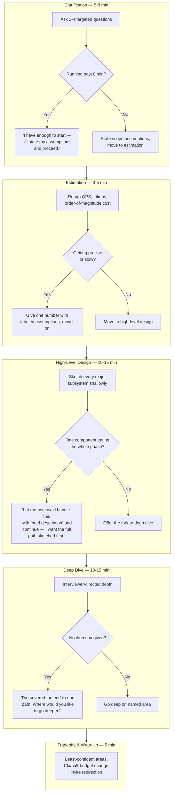
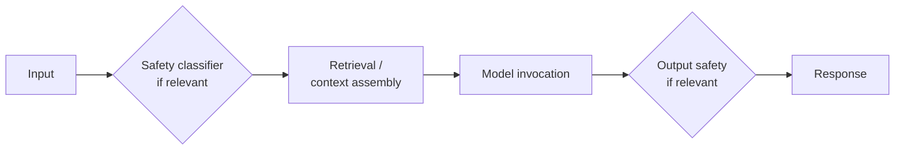
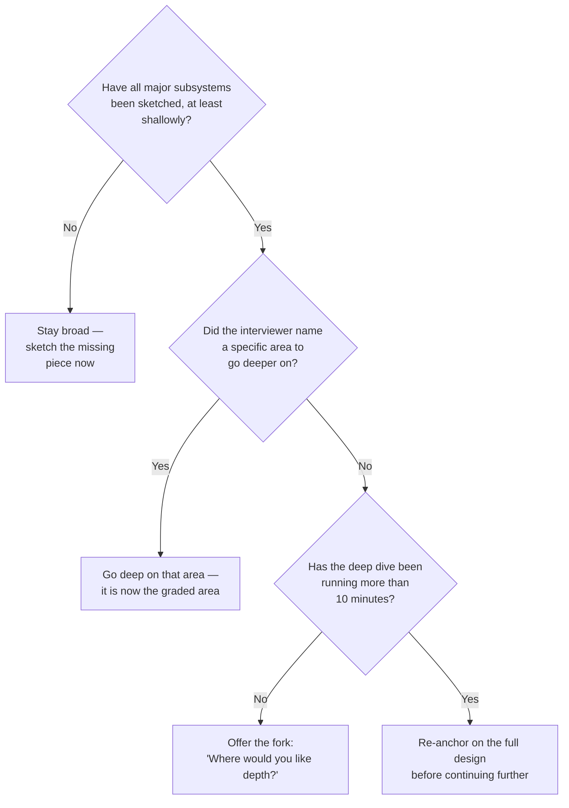
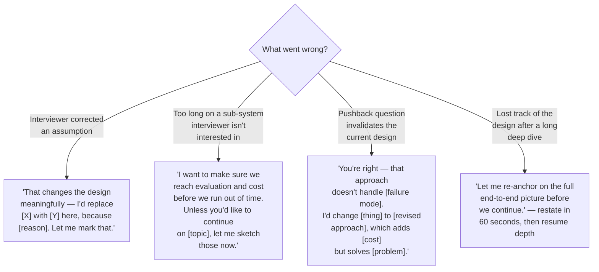

# The Whiteboarding Framework

## Overview

[How AI System Design Interviews Work](01-how-ai-system-design-interviews-work.md) describes what the five phases are and what the six rubric dimensions reward. This chapter is the execution layer underneath that description — the minute-by-minute mechanics of actually running clarification, estimation, high-level design, deep dive, and wrap-up under a clock the candidate can't see. Knowing that clarification "should take 5-8 minutes" is not the same skill as noticing, live, that it's running long and having a rehearsed sentence ready to close it out. This chapter is that rehearsed sentence, for every phase and for the four failure modes that recur most often mid-interview.

## Definition

The whiteboarding framework is a repeatable sequence of moves — an opening script, a set of per-phase time budgets with a named intervention for each, a rule for structuring the high-level design phase that prevents the single most common time-allocation failure, and four verbatim recovery moves for the most common ways a design goes visibly wrong mid-session. It is not a design methodology; it says nothing about which architecture to choose. It is a time-and-communication discipline that sits underneath whatever architecture the candidate proposes, and it is learnable independently of systems knowledge — which is exactly why it rewards direct drilling.

## Opening the Interview: The First Two Minutes

The first two minutes of the interview are graded before a single component reaches the whiteboard, because structured communication and requirements clarification — two of the six rubric dimensions — are scored on how the candidate *opens*, not on the content of the design. The opening is a fixed three-move sequence, always in the same order, and it should be close to automatic by the time a candidate is in a real interview.

**Move 1 — state the plan out loud.** Before asking a single question: *"Let me start by clarifying a few requirements, then sketch a high-level design before going deep on whatever area you'd like."* This costs about ten seconds and earns immediate credit on structured communication — it tells the interviewer the candidate has a process, not just an architecture in their head, and it sets the frame the interviewer will use to judge everything that follows. An interviewer who hears this sentence has already placed the candidate above one who starts talking about a vector database twenty seconds in.

**Move 2 — ask 3-4 targeted questions.** Not eight questions, not one. Four questions is the number that clears the highest-value ambiguity per minute of a 45-minute budget: scale, latency tolerance, data freshness, and the success metric. Each of these four shapes a different part of the architecture (see the next section for exactly how), and asking beyond them runs into sharply diminishing returns — a fifth or sixth question about a minor edge case is rarely worth the clock it costs. Asking fewer than three is its own failure: it signals the candidate is guessing rather than scoping.

**Move 3 — state scope assumptions explicitly, after getting answers.** *"Based on that, I'm assuming 10M MAU, ~5 queries/day each, a 2-second P99 end-to-end latency target, and a $0.05/query cost ceiling. I'll proceed on those unless you correct me."* This is the move most candidates skip, and it's the one that converts four answered questions into a scoped system. It also does something tactically important: it gives the interviewer one cheap, early opportunity to correct a wrong assumption, before twenty minutes of design has been built on top of it. A wrong assumption caught at minute 3 costs nothing; the same wrong assumption caught at minute 25 costs the rest of the interview.

Executed fully, this sequence takes under five minutes and scores three rubric dimensions — requirements clarification, structured communication, and (implicitly) technical depth, since the choice of which four questions to ask is itself a signal of experience — before the candidate has drawn a single box.

## Requirements-Gathering Questions That Signal Seniority

Not all clarifying questions are equal, and the difference between a question that shapes the architecture and one that wastes a minute is the actual skill being tested in the opening phase. The four categories below are the ones worth asking, in roughly the order they unlock information.

| Question category | Example | Why it shapes the architecture |
|---|---|---|
| **Scale** | "How many daily active users, and roughly how many queries per user per day?" | Determines the serving infrastructure — whether a managed API is sufficient or a self-hosted GPU fleet is justified, and how much the QPS peak multiplier matters |
| **Latency tolerance** | "Is this an interactive, user-waiting request, or can it run async in the background?" | Determines model size, whether streaming is required, and whether a reasoning-model or multi-step agentic path is even viable under the budget |
| **Data freshness** | "How often does the underlying knowledge change — daily, hourly, real-time?" | Determines RAG vs. fine-tuning: frequently-updated facts favor retrieval, stable behavior favors fine-tuning or a static system prompt |
| **Success metric** | "How will we know this system is actually working — what's the metric that matters?" | Shapes the evaluation architecture from the start; a candidate who asks this before drawing anything signals that evaluation is a first-class architectural concern, not a bolted-on afterthought |

One category is worth asking about specifically even though it doesn't fit neatly into "shapes the architecture" in the same incremental way the other four do: **compliance and data residency** ("Are there HIPAA, GDPR, or data-residency requirements?"). This question can disqualify an entire class of architecture outright — proposing an API-based design and discovering ten minutes later that the data can't leave a VPC means the rest of the session is spent unwinding a wrong foundation. Asking it early is cheap insurance; discovering the answer late is not recoverable within the time box.

Just as important as knowing which questions to ask is knowing which ones are premature. *"Should we use Python or Java?"* and *"Should we use GPT-4 or Claude?"* are both implementation-detail questions being asked before the requirements that would answer them exist. They signal the candidate is thinking about *how* to build before establishing *what* to build — the same ordering mistake that starting to sketch a design before clarifying anything makes, just one level further into the conversation. A strong candidate defers these questions entirely; they resolve themselves naturally once scale, latency, and cost constraints are on the table.

## Time-Boxing Each Phase

A 45-minute interview has no visible clock for the candidate, which is precisely why an internalized time budget matters — the skill isn't reading a clock, it's noticing when a phase has run past its useful return and having a rehearsed sentence that closes it out without an awkward stall. Each phase below pairs its budget with the specific intervention move for when it runs over.

**Clarification: 5-8 minutes, hard stop at 8.** The intervention when it runs long: *"I have enough to start — I'll state my assumptions and proceed."* This is not a concession; it's the correct move even if a few edge cases remain unresolved, because time spent past minute 8 is time stolen from the deep dive, and the deep dive is the phase most predictive of the final rating. Clarification time is irreversible in a specific sense the other phases aren't — there's no way to "add back" three minutes of missed depth later by rushing.

**Capacity estimation: 3-5 minutes, and it should feel fast and rough.** The intervention: give a single number with labeled assumptions and move on. *"Roughly 58 QPS average, 200-250 at peak — that's comfortably within managed-API territory, so I won't spend more time here."* Precision does not score extra credit in this phase; the interviewer is checking that the candidate *can* reason about scale, not auditing the arithmetic. Slowness here is a pure cost with no offsetting benefit.

**High-level design: 10-15 minutes.** Every major subsystem must be sketched, at least shallowly, before any single one gets a second pass — this is the rule detailed in the next section, and it's the single highest-leverage discipline in the entire framework. The intervention when one component is consuming disproportionate time: *"I want to make sure I sketch the full path before going deep — let me note that we'd handle this with [brief description] and continue."* This sentence does real work: it acknowledges the component without abandoning it, commits to returning if there's time, and gets the design moving again.

**Deep dive: 10-15 minutes, interviewer-directed.** If the interviewer doesn't name a direction, the candidate should offer the fork rather than guess: *"I've covered the end-to-end path. Where would you like to go deeper?"* Offering this is itself a positive signal — it demonstrates the candidate understands that depth allocation in this format is negotiated, not unilateral.

**Tradeoffs and wrap-up: 5 minutes — the single most undervalued phase.** This phase should cover three things: the two or three things the candidate is least confident about and why, what they'd change with 10x the scale or half the budget, and an explicit invitation for the interviewer to redirect. Running out of clock before reaching this phase is the most avoidable loss in the entire format, because everything covered here is cheap to say and reads as a concentrated sample of judgment — see [Making the Last 5 Minutes Count](#making-the-last-5-minutes-count) below.

**For a 60-minute interview,** add roughly 8 minutes, split between high-level design and deep dive. Clarification and estimation don't benefit from additional time past their budgets above — the value in both phases is front-loaded, and stretching them past the point of diminishing returns just delays getting to the parts of the interview that reward depth.

## Structuring the High-Level Design Phase

The single rule that prevents the worst time-allocation mistakes in this entire format: **sketch the entire request path shallowly before deepening any single component.** This rule alone accounts for a large share of the difference between candidates who reach evaluation, cost, and security in 45 minutes and candidates who don't.

The complete request path, at minimum, looks like this:

Every component in this path must exist on the whiteboard before any one of them gets a second pass. A candidate who spends the first 20 minutes explaining chunking strategy in detail without a query path on the board yet has violated this rule outright — no matter how good the chunking explanation is, the interviewer has no way to place it in a system they can't see the shape of.

The rule extends past the request path itself into a specific pass order for everything else on the board:

1. **Data components, in one pass.** Name the vector index, the document store, the knowledge base — what holds the system's state — without yet explaining how any of them work internally.
2. **Processing components, in one pass.** Name the embedding service, the retrieval service, the reranker — what transforms data as it moves through the path — again without diving into any single one.
3. **Cross-cutting concerns, in one final pass.** Evaluation, monitoring, and safety don't belong to any single box on the diagram; they cut across all of them, and naming them explicitly in their own pass is what prevents them from being silently forgotten — which is exactly the failure the Common Mistakes section in Chapter 01 flags as the single most common reason a technically strong candidate gets a middling rating.

This three-pass structure — data, then processing, then cross-cutting — gives the interviewer a complete picture of the system at roughly the 15-minute mark and a deep one by the 30-minute mark, which is the actual target shape of a strong 45-minute session.

### What to Label on Every Diagram Component

An unlabeled box is worse than no box, because it forces the interviewer to ask what it does and why — spending the clock the candidate needed for depth on information that should have been given for free. Every component on the whiteboard should carry three things: **the component name, its primary responsibility in one clause, and the reason it was chosen over an obvious alternative.**

For example: *"Vector DB (Qdrant, self-hosted) — stores document embeddings; chosen over Pinecone because data residency rules out SaaS."* That single label answers what it is, what it does, and why it's there instead of the first alternative an interviewer would think to ask about — which means the interviewer doesn't have to ask, and the candidate has just demonstrated tradeoff reasoning without being prompted for it.

## When to Go High-Level vs. Deep

Depth allocation is not a decision made once; it's remade every few minutes, with an incomplete picture of how much time is left. The decision reduces to four states, checked continuously:

The first state dominates all the others: as long as any major subsystem hasn't been sketched yet, the answer is always to go broad, regardless of how interesting or well-rehearsed a deeper explanation of the current component would be. Once breadth is satisfied, the next check is whether the interviewer has already named a direction — if so, that's the graded area and the candidate should go there without hesitation. If not, offering the fork explicitly is better than guessing, because guessing risks spending the deep-dive budget on a sub-system the interviewer has no interest in. And if a deep dive has already been running past 10 minutes without a checkpoint, re-anchoring on the full design is worth the 60 seconds it costs — it prevents the rest of the conversation from being built on a design neither party can clearly hold in their head anymore.

## Recovery Moves for the Four Most Common Mid-Interview Failures

Every 45-minute live design session under expert scrutiny includes at least one wrong turn — that's not a sign of a weak candidate, it's a statistical certainty of the format. What separates ratings is whether the recovery is visible and specific, or absent. Below are verbatim moves for the four failures that recur most often, because having the sentence ready in advance is what makes the recovery actually happen live instead of dissolving into a vague, unstructured backpedal.

**Wrong assumption corrected by the interviewer.** *"That changes the design meaningfully — I'd replace [component X] with [component Y] here, because [reason]. Let me mark that."* The critical detail is stating the revision out loud rather than silently patching the design and hoping the interviewer doesn't notice the seam. The revision itself is the graded moment, not the original error — an interviewer who sees a clean, reasoned update reads it as evidence the candidate's designs are genuinely reasoned through, not memorized.

**Spent too long on a sub-system the interviewer isn't interested in.** *"I want to make sure we reach evaluation and cost before we run out of time. Unless you'd like to continue on [this topic], let me sketch those now."* This preserves the interviewer's right to redirect — maybe they *do* want more on the current topic — while making clear the candidate is tracking the clock and the remaining breadth obligation. It converts a potential time-management failure into a demonstrated one.

**Pushback question whose answer invalidates the current architecture.** *"You're right — that approach doesn't handle [the failure mode]. I'd change [specific thing] to [revised approach], which adds [cost/complexity] but solves [the specific problem]."* Name what broke, name what changed, name the tradeoff — in that order. This turns an error into an explicit, structured tradeoff moment, which scores higher than an originally correct answer given with no shown reasoning at all.

**Lost track of the design after a long deep dive.** *"Let me re-anchor on the full end-to-end picture before we continue."* State the complete design in about 60 seconds, then resume the depth. This costs almost no time relative to the interview's total budget, and it prevents the remainder of the conversation from being built on a design that neither the candidate nor the interviewer can clearly hold in their head anymore — a state that, left uncorrected, tends to produce visibly confused answers to otherwise reasonable follow-ups.

## Making the Last 5 Minutes Count

The wrap-up is a concentrated read on judgment, and interviewers weight it disproportionately because it's the only point in the session where a candidate can demonstrate intellectual honesty about their own design, under no external pressure to do so. It is not a summary. Restating what was already covered wastes the one phase in the interview that rewards something the rest of the session structurally can't: unprompted self-critique.

A strong wrap-up covers three things, in this order:

1. **Name the two or three things you're least confident about, and why.** Not a vague hedge — a specific, reasoned weak point. *"I'm least confident in the reranker's latency budget under peak load — I estimated 50ms but haven't validated that against a real cross-encoder at this corpus size."*
2. **Propose what you'd change under a specific constraint** — 10x the scale, half the budget, or a new safety incident. This tests whether the design was actually reasoned through or just assembled to look complete; a candidate who can say precisely which parts survive a 10x scale change and which don't is demonstrating the design was never arbitrary.
3. **Explicitly invite the interviewer to redirect.** *"Is there a part you'd like to revisit or go deeper on?"* This closes the session the same way it opened — handing control of depth allocation back to the interviewer rather than assuming the candidate's own judgment about what mattered most was correct.

A strong wrap-up delivered at minute 43 of a 45-minute session recovers a surprising amount of score from a middling middle — it's cheap to execute and disproportionately remembered, precisely because so few candidates reach it with any clock left.

## Common Mistakes

- **Skipping the opening sequence and starting to sketch immediately.** Losing the ten-second "state the plan" move and the explicit assumption statement means the interviewer has to infer structure from the design itself instead of being told it upfront — a self-inflicted loss on structured communication for no time saved.
- **Asking too many or too few clarifying questions.** Fewer than three risks scoping the wrong system; more than five or six runs into sharply diminishing returns and eats into the design phases that actually differentiate ratings.
- **Letting clarification run past 8 minutes without a hard stop.** Every extra minute here is a minute subtracted from the deep dive, and the deep dive is the phase most predictive of the final rating — this tradeoff is rarely worth it even when a few edge cases remain genuinely unresolved.
- **Going deep on the first interesting component instead of sketching the full path first.** Explaining chunking strategy in detail before a query path exists on the board is the canonical version of this mistake — it violates the single highest-leverage rule in this chapter.
- **Leaving diagram components unlabeled.** A box with just a name forces the interviewer to ask what it does and why it was chosen, spending the candidate's own clock on information that should have been given for free.
- **Running out of time before the wrap-up phase.** Losing the last five minutes to an earlier overrun forfeits the single phase most disproportionately weighted by interviewers — the fix is enforcing the hard stops in every earlier phase, not trying to compress the wrap-up itself.

## Interview Questions

### Beginner

**Q: What should you say in the first thirty seconds of an AI system design interview, before asking any questions?**
State the plan out loud: "Let me start by clarifying a few requirements, then sketch a high-level design before going deep on whatever area you'd like." This costs about ten seconds and immediately signals structured communication — one of the six rubric dimensions — before any content has been produced. It also sets the frame the interviewer will judge the rest of the session against, since they now know what to expect and can compare the candidate's actual pacing to the plan they stated.

**Q: Why is asking exactly 3-4 clarifying questions recommended, rather than one or eight?**
One question under-scopes the problem — the candidate risks designing the wrong system entirely, which fails every downstream rubric dimension that depends on the requirements. Eight questions runs into sharply diminishing returns; the first four (scale, latency tolerance, data freshness, success metric) unlock the large majority of architecture-shaping information, and each question past that point costs a minute of the 45-minute budget for progressively less signal. Three to four is the point that clears the highest-value ambiguity per minute spent.

### Intermediate

**Q: A candidate is at minute 11 of a 45-minute interview and still asking clarifying questions. What should they do, and why?**
Stop immediately and say something close to: "I have enough to start — I'll state my assumptions and proceed." Clarification has a hard stop at 8 minutes because every minute spent past that point is subtracted directly from the deep dive, which is the phase most predictive of the final rating. The candidate doesn't need every edge case resolved — they need enough to state a defensible scope and move forward, correcting assumptions later if the interviewer pushes back.

**Q: What's wrong with a design where every component on the whiteboard has just a name — "Vector DB," "Reranker," "LLM" — and nothing else?**
Unlabeled components are worse than no diagram at all, because they force the interviewer to ask what each one does and why it's there, spending the candidate's own clock on information that should have been given upfront. Every component should carry its name, its responsibility in one clause, and the reason it was chosen over an obvious alternative — for example, "Vector DB (Qdrant, self-hosted) — stores document embeddings; chosen over Pinecone because data residency rules out SaaS." That one label does the work of an entire follow-up question exchange.

### Senior

**Q: You've been in a deep dive on the retrieval architecture for what feels like a long time. How do you decide whether to keep going or pull back?**
Check the four-state decision: has the deep dive been running past roughly 10 minutes without a checkpoint? If so, re-anchor — restate the full end-to-end design in about 60 seconds before continuing, since building further depth on a design neither party can clearly hold in their head produces answers that don't cohere. If the deep dive hasn't hit that threshold and the interviewer is still actively engaged and asking follow-ups, continuing is correct — depth in the area the interviewer chose is exactly what the deep-dive phase is for. The discipline is treating "still interviewer-engaged" and "running long" as two separate checks, not conflating them.

**Q: The interviewer just asked a pushback question that reveals a real gap in your proposed architecture. Walk through exactly how you'd respond.**
Name what broke, name what changes, name the resulting tradeoff, in that order: "You're right — that approach doesn't handle bursty traffic. I'd add a queue in front of the model invocation step and degrade to cached results under load, which adds latency during a burst but prevents cascading timeouts." I would not defend the original design once the gap is real, and I would not silently abandon it either — stating the revision explicitly is the graded moment. An interviewer reads a candidate who can do this cleanly as someone who reasons through designs rather than reciting them, which is a stronger signal than having avoided the gap in the first place.

### Staff

**Q: You're 30 minutes into a 45-minute interview. The interviewer hasn't given you a specific deep-dive direction, and you've noticed you haven't mentioned evaluation, cost, or security at all yet. What do you do in the next 60 seconds?**
Say so directly rather than waiting to be asked: "I've covered the end-to-end retrieval and generation path, but I haven't touched evaluation, cost, or security yet — let me make sure I hit those before we run out of time." Then move through each in a sentence or two rather than a full deep dive on any one of them, since 15 minutes remain and three topics need coverage. This converts a self-noticed rubric gap into a proactive strength — catching it yourself, even at minute 30, scores meaningfully better than having the interviewer point it out, and it demonstrates the candidate is tracking breadth as a first-class concern throughout the session, not just reacting to what's asked.

**Q: Design a repeatable opening sequence a candidate could use for any AI system design prompt, and justify why each step is in that specific order.**
State the plan first, before asking anything — this costs ten seconds and establishes structured communication as the frame for the rest of the session, and it has to come first because everything after it is read against that stated plan. Second, ask 3-4 targeted questions covering scale, latency tolerance, data freshness, and the success metric — in that rough order, because scale and latency shape the serving architecture earliest, freshness determines RAG-versus-fine-tune before any component gets drawn, and the success metric question needs to land before design work starts so evaluation is treated as architectural rather than retrofitted. Third, and only after getting answers, state scope assumptions explicitly and invite correction — this has to come last in the sequence because it depends on the answers from step two, and it's the step that actually converts a Q&A exchange into a scoped system the interviewer can hold the candidate to. Reordering any of these three loses something specific: skipping the plan loses the early structured-communication credit, asking questions before stating the plan makes the session feel reactive rather than driven, and skipping the final assumption statement leaves the scope implicit, which means a wrong assumption isn't caught until it's expensive to fix.

## Google-Level Follow-Ups

- **"You just spent four minutes on a component the interviewer visibly wasn't interested in. What should have told you that earlier?"** Probes whether the candidate can read interviewer engagement signals in real time — a lack of follow-up questions, a redirect attempt, a flat "okay" — rather than only noticing the misallocation after the fact.
- **"Your assumption statement at minute 4 turns out to be wrong at minute 28. Why didn't checking it again earlier catch this?"** Probes whether the candidate understands the assumption statement in the opening is a starting hypothesis, not a one-time checkbox — strong candidates periodically re-confirm high-stakes assumptions rather than treating the opening statement as permanently settled.
- **"You offered the fork — 'where would you like to go deeper?' — and the interviewer just says 'you pick.' What now?"** Probes whether the candidate has a fallback heuristic (typically: go deepest on the part they're least confident is correct, since that's where the most learning and the most credible tradeoff reasoning will surface) rather than freezing or picking arbitrarily.
- **"Two candidates both hit every phase's time budget exactly. One gets Strong Hire, one gets No Hire. What's the likely difference?"** Probes whether the candidate understands time-boxing is necessary but not sufficient — it's a discipline that creates the *opportunity* for strong signal in each phase, not a substitute for the requirements clarity, tradeoff reasoning, and breadth that actually get scored inside each time slot.

## Key Takeaways

- The opening is a fixed three-move sequence — state the plan, ask 3-4 targeted questions, state scope assumptions explicitly — and executed fully it takes under five minutes while scoring three rubric dimensions before any component is drawn.
- Scale, latency tolerance, data freshness, and the success metric are the four clarifying questions that shape the architecture; implementation questions like "Python or Java?" are premature and should be deferred until requirements are settled.
- Every phase has a hard time budget and a rehearsed intervention sentence for when it runs over — the specific sentence matters because it's what actually triggers the behavior live, under time pressure, rather than dissolving into an awkward stall.
- The single highest-leverage discipline in high-level design is sketching the entire request path shallowly — input through response — before deepening any one component; violating this rule is the most common cause of running out of time before reaching evaluation, cost, or security.
- Every diagram component needs three things: its name, its responsibility in one clause, and the reason it was chosen over an obvious alternative — an unlabeled box costs more clock than it saves.
- Depth-versus-breadth is a four-state decision remade continuously: stay broad until every subsystem is sketched, go deep where the interviewer directs, offer the fork if they don't, and re-anchor if a deep dive has run past 10 minutes.
- The wrap-up is the most undervalued five minutes in the format — naming genuine uncertainty, proposing a change under a stated constraint, and explicitly inviting redirection reads as a concentrated sample of judgment, and running out of clock before reaching it is the most avoidable loss in the interview.

---

*Part of [Interview Prep](index.md) in the [AI System Design Notes](../index.md). Tracked in [BACKLOG.md](https://github.com/GyanendraChaubey/AI-System-Design-Notes/blob/main/BACKLOG.md).*
