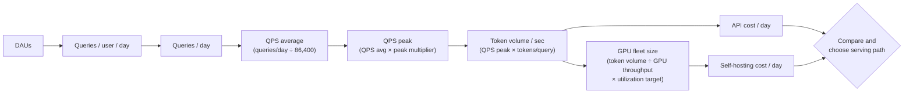
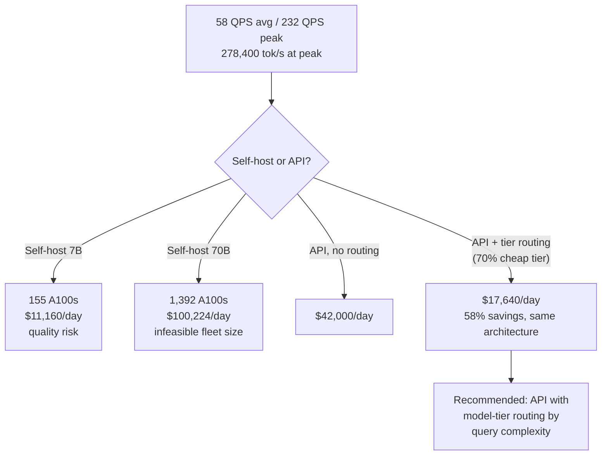
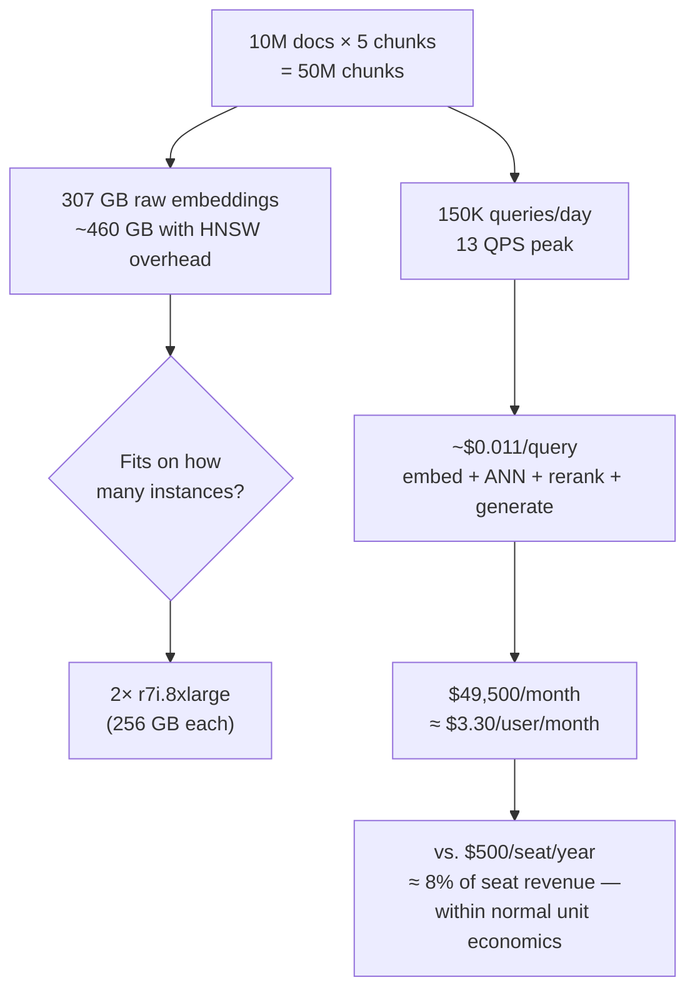
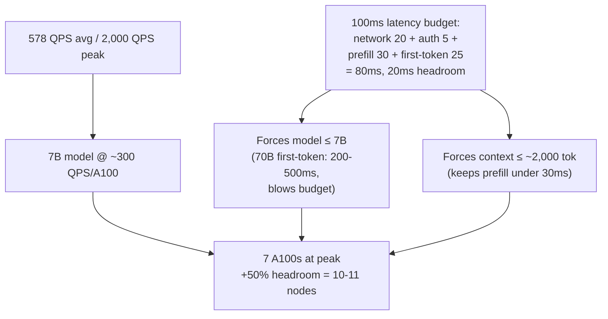
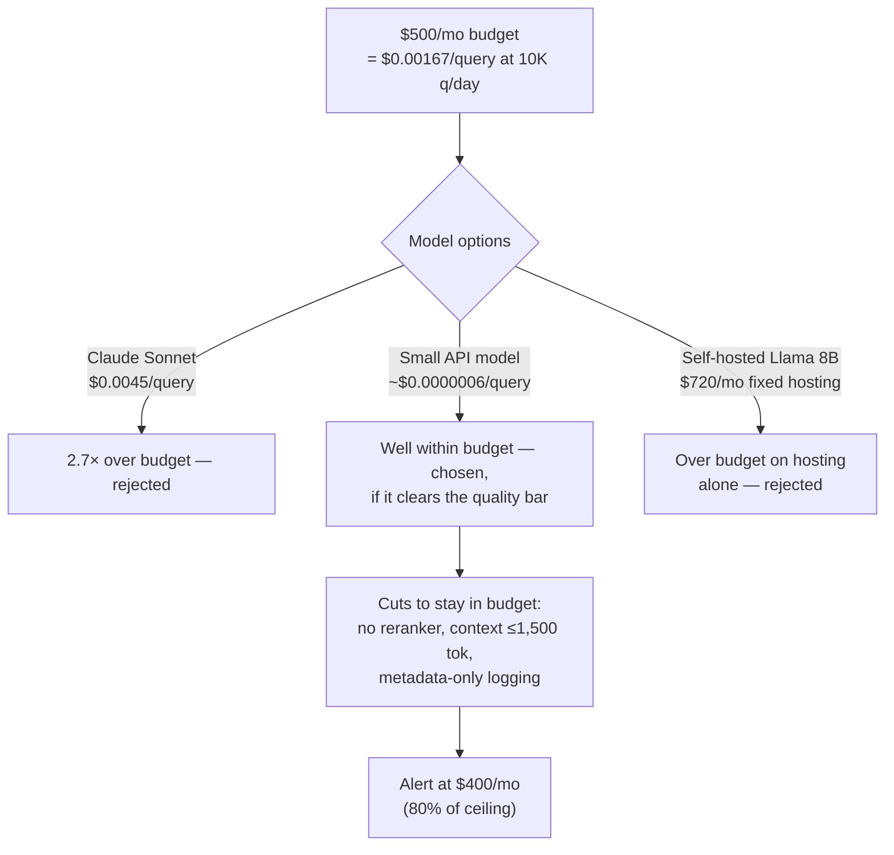
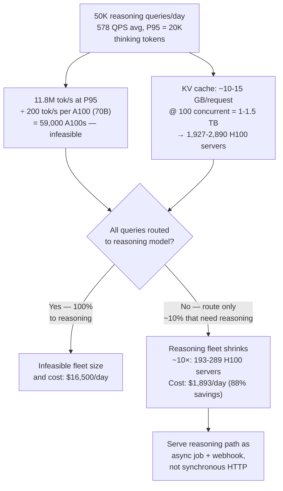

# Estimation & Capacity Planning Drills

## Overview

Capacity estimation in an AI system design interview is a fast, rough, out-loud calculation — not a homework problem. [The Whiteboarding Framework](02-the-whiteboarding-framework.md) budgets it at 3-5 minutes, and the number produced matters less than whether the candidate knows which numbers to reach for and can turn the result into an architectural decision on the spot. This chapter is practice material, not theory: the Alex Xu back-of-envelope framework adapted for the terms AI systems add on top of standard backend estimation, the specific anchor numbers worth memorizing cold, and five fully worked drills that show every step of the reasoning a strong candidate says out loud. There is no interview-questions section here — the drills themselves are the practice.

## The Estimation Framework, Adapted for AI

The canonical Alex Xu sequence for a generic backend system is: DAUs → queries/user/day → queries/day → QPS average → QPS peak → per-query resource usage → fleet/infrastructure sizing. Every AI system design estimate starts from the same chain — there is no reason to reinvent the first five steps, because user behavior determines request volume the same way for an AI product as for any other backend service.

The chain diverges at the last step. "Per-query resource usage" for a CRUD service is usually just CPU time and a database round trip. For an AI system, it expands into three terms that don't exist in generic backend estimation, and each one drives a different part of the architecture:

- **Token volume** — the actual unit of work an LLM performs, and the unit both cost and compute requirements are denominated in. A query isn't "one request"; it's N input tokens and M output tokens, and those two numbers behave very differently (input is usually cheap and compressible via caching, output is expensive and sequential).
- **GPU throughput** — if any part of the system is self-hosted, the model's tokens-per-second output rate under continuous batching determines how many GPUs are needed to sustain a given token volume. This has no analog in stateless CRUD estimation, where compute scales roughly linearly and predictably with request count.
- **KV cache memory** — a constraint independent of raw compute throughput. A GPU can have spare FLOPs and still be unable to serve another concurrent request because it has run out of memory to hold the attention cache for in-flight generations. This is a genuinely new limiting resource that backend capacity planning doesn't have an equivalent for.

The formulas worth having ready, in the order they're used:

- **QPS average** = total_daily_queries / 86,400
- **QPS peak** = QPS_average × peak_multiplier. Use **3-5x** for consumer products, where traffic concentrates in waking hours across time zones and spikes around specific events. Use **2-3x** for enterprise products, where load concentrates in business hours within one primary time zone for a given deployment.
- **Token volume per second** = QPS_peak × (avg_input_tokens + avg_output_tokens)
- **GPU serving fleet size** = token_volume_per_second / (GPU_output_throughput_tok_s × utilization_target). Use **70-80% utilization** as the target — sizing to 100% leaves no headroom for burst and guarantees latency degradation the moment traffic ticks above the average.
- **Storage** = (documents × chunks_per_doc × embedding_dimension × bytes_per_float) for the vector index, plus raw document storage, plus log storage.

Every worked drill below is this same chain, run end to end, with the specific numbers that make it concrete.

## AI-Specific Assumption Anchors

These are the numbers a candidate needs available without derivation — memorized cold, the way `86,400` seconds in a day should already be automatic. Getting these roughly right, out loud, without pausing to calculate them from scratch, is a large part of what "fluent estimation" actually looks like to an interviewer.

| What to estimate | Anchor value | Notes |
|---|---|---|
| Tokens per English word | 1.3 tokens | Rule of thumb; varies by language |
| Tokens per page of text | 500-750 tokens | Dense technical text runs higher |
| Tokens per code file (200 lines) | 1,000-3,000 tokens | Varies by language verbosity |
| Short chat message (user turn) | 50-200 tokens | |
| System prompt | 300-2,000 tokens | Enterprise prompts can run 5,000+ |
| RAG context (5 chunks × 512 tok) | 2,560 tokens | Per request, pre-generation |
| Full multi-turn conversation (10 turns) | 3,000-8,000 tokens | |
| Reasoning model thinking budget | 1,000-32,000 tokens | Use P95, not mean, for sizing |
| A100 80GB output throughput — 7B model | 1,500-3,000 tok/s | With continuous batching |
| A100 80GB output throughput — 70B model | 150-300 tok/s | |
| H100 vs. A100 throughput ratio | ~2-3x faster | |
| Claude Sonnet approximate pricing (2025) | $3/M input, $15/M output | Order-of-magnitude estimates |
| GPT-4o approximate pricing | $2.5/M input, $10/M output | |
| text-embedding-3-large pricing | $0.13/M tokens | |
| Embedding dimension (large) | 1536 | text-embedding-3-large |
| Vector index memory — 1M vectors (1536-d fp32) | ~6 GB raw; ~9 GB with HNSW overhead | |
| Seconds in a day | 86,400 | Memorize this; derive everything else from it |

## Worked Drill 1: Conversational AI at 1M DAU

**Traffic.** 1M DAU × 5 queries/day = 5M queries/day ÷ 86,400 = **58 QPS average**. This is a consumer chat product, so peak at 4x: **232 QPS**.

**Per-query token profile.** 800 input tokens (300 system prompt + 300 conversation history + 200 user message) + 400 output tokens. At peak: 232 × 1,200 = **278,400 tokens/second**.

**Self-hosting option.** 278,400 tok/s ÷ 1,800 tok/s per A100 (7B model, continuous batching) = **155 A100s at peak**. At $3/GPU-hour: 155 × 24 × $3 = **$11,160/day** — but a 7B model's quality may not clear the bar for a flagship conversational product. Re-running the same math for a 70B model: 278,400 ÷ 200 tok/s = **1,392 A100s**, at $3/hr × 24 = **$100,224/day**. The quality-versus-cost gap between the two model sizes is nearly 9x on infrastructure alone, which is the number that should drive the model-size decision, not intuition about which model "feels" better.

**API option.** 5M queries × (800 × $3/M + 400 × $15/M) = 5M × ($0.0024 + $0.006) = **$42,000/day**.

**Model-tier routing.** Apply routing where 70% of queries go to a model roughly 10x cheaper (simple factual queries, short exchanges) and 30% stay on the flagship model (complex reasoning, longer context): 3.5M × ($0.00084 + $0.0006) + 1.5M × ($0.0024 + $0.006) = $5,040 + $12,600 = **$17,640/day**. The insight worth stating out loud: routing reduces cost by 58% without changing the architecture's shape at all — it's a request-classification layer in front of an unchanged serving path, not a redesign.

## Worked Drill 2: Enterprise RAG at 50K Employees

**Traffic.** 50K employees × 30% daily active = 15K DAU. 15K × 10 queries/day = **150K queries/day**. Enterprise peak concentrates in business hours: 150K / (8 hours × 3,600 sec) × 2.5x peak multiplier = **13 QPS peak**.

**Corpus and index size.** 10M enterprise documents × 5 chunks/document = **50M chunks**. 50M × 1536 dimensions × 4 bytes = **307 GB** of raw embeddings. With HNSW graph overhead (~50%): **~460 GB** for the full vector index — this fits across two high-memory instances (r7i.8xlarge at 256 GB each). A BM25 index over the same corpus, run alongside the vector index for hybrid retrieval, adds roughly **50-100 GB** on Elasticsearch.

**Per-query cost breakdown.** Embedding (500 tokens × $0.13/M = **$0.000065**) + ANN search (**$0.00001**, compute only) + reranker (**~$0.0002**) + generation (2,000 input tokens + 300 output tokens at $3/M + $15/M = $0.006 + $0.0045 = **$0.0105**). Total: **~$0.011/query**.

**Monthly cost.** 150K × $0.011 = **$1,650/day = $49,500/month**.

**The insight worth stating out loud.** For an enterprise paying $500/seat/year — a standard SaaS price point — the AI cost is $49,500/month on 15K active users, or about **$3.30/user/month**. Against a $500/year ($41.67/month) seat price, that's roughly 8% of revenue per seat spent on inference — well within normal unit economics for a feature that materially improves the product, and a number worth stating explicitly rather than leaving the interviewer to do the division themselves.

## Worked Drill 3: Coding Assistant with Real-Time Completion (Sub-100ms Budget)

**The constraint that drives everything else.** Interactive code completion requires the first suggested token to appear within roughly 100ms of perceived latency. Breaking that budget down: network 20ms + routing/auth 5ms + model prefill 30ms + first-token generation 25ms = **80ms**, leaving 20ms of headroom. This budget, worked out before anything else, forces two decisions immediately: the model can be no larger than roughly 7B (a 70B model's first-token latency runs 200-500ms on an A100, which blows the budget by 2-6x), and the context window has to stay under roughly 2,000 tokens to keep prefill inside 30ms.

**Traffic.** 1M daily active developers × 10 completion events/session × 5 sessions/day = **50M completion events/day** ÷ 86,400 = **578 QPS average**; peak roughly **2,000 QPS**.

**Fleet size.** A 7B model on a single A100 with continuous batching at this latency target sustains roughly **300 QPS**. At peak: 2,000 / 300 = **7 A100 nodes**. Adding 50% headroom for burst: **10-11 nodes** — a strikingly small fleet relative to the 1,392-GPU number in Drill 1, because completion requests are short (see the token cost below) and the model is small by construction.

**Token cost.** 50M events × (500 input + 30 output tokens) × ($3/M input-proportional + $15/M output-proportional) ≈ 50M × $0.00195 = **$97.50/day**. This is unusually low because output is very short — 20-50 tokens for a single code completion suggestion, versus 300-400 tokens for a chat response. The contrast with Drill 1's chat product is worth stating explicitly at the same order of DAU: a chat product with similar daily active users spends **orders of magnitude more per day** than a completion product, purely because completion output is short and the query volume-per-session, while higher, doesn't offset the token-length difference.

## Worked Drill 4: Cost-Constrained Design — $500/Month, 10K Users

**Budget.** $500/month = **$16.67/day**. 10K users × 20% daily active = 2K DAU × 5 queries/day = **10K queries/day**. Budget per query: $16.67 / 10,000 = **$0.00167/query**.

**Model choice forced by the budget.** Claude Sonnet at $3/M input + $15/M output, with 500 input + 200 output tokens per query, costs **$0.0045/query** — **2.7x over budget** before any other cost is added. A smaller model tier (GPT-3.5-turbo-equivalent pricing, roughly $0.0005/M input + $0.0015/M output): 10K × (500 × $0.0005/M + 200 × $0.0015/M) = 10K × ($0.00000025 + $0.0000003) — trivially cheap, well inside budget. Self-hosting is also worth checking and rejecting explicitly: Llama 3.1 8B on a single A10G at roughly $1/hour = **$720/month** — over budget on hosting alone, before a single query is served, because GPU rental is a fixed cost independent of the (low) query volume.

**The design answer.** At $0.00167/query, a managed API is the only viable serving path — there is no GPU-hosting budget that clears at this volume. The move is: choose the cheapest model tier that clears the quality bar on an eval set (not the cheapest model unconditionally — quality still has to pass a bar), and set an alert at $400/month spend (80% of budget) to catch traffic growth before it hits the ceiling.

**What gets cut to stay in budget, stated explicitly rather than silently dropped:** no reranking (saves the reranker inference cost entirely), shorter context capped at 1,500 tokens (reduces input cost directly), and metadata-only logging instead of full-fidelity content logging (reduces storage cost as a secondary benefit). Naming these cuts out loud, with the reasoning, is the actual graded behavior — a design that silently omits reranking without saying why looks like an oversight; the same omission stated as a deliberate budget tradeoff looks like judgment.

## Worked Drill 5: Reasoning Model Workload at 100K DAU

**Why mean sizing fails here.** Reasoning models generate "thinking tokens" before the visible response, with high per-request variance — 1,000 to 32,000 thinking tokens depending on query complexity. Sizing to the mean leaves the system under-capacity on the long tail: at 100K DAU, if 5% of requests land in that long tail, that's **5,000 users experiencing degraded service at any given time**. The correct anchor is **P95**, not mean.

**Traffic.** 100K DAU × 10% use reasoning features × 5 reasoning queries/day = **50K reasoning queries/day** = 578 QPS average reasoning load.

**Token volume at P95.** At P95 of 20,000 thinking tokens + 500 response tokens per query: 578 × 20,500 = **11.8M tokens/second**. At a 70B model's throughput of 200 tok/s per A100: 11.8M / 200 = **59,000 A100 GPUs** — clearly infeasible at this scale, and the number itself is the signal that a synchronous, uniformly-served architecture is the wrong shape for this workload.

**The architectural answer, not just a bigger fleet.** Separate the reasoning workload onto dedicated, lower-concurrency serving. Use a queue rather than a synchronous response pattern — at P95, a single request takes 20,000 / 200 = **100 seconds** on one A100, which is not an interactive latency budget by any definition. Expose a "reasoning job" API with a status endpoint and a webhook callback, not a synchronous HTTP response.

**The KV cache constraint, independent of compute.** A 32K-token in-context reasoning trace consumes roughly 32K × model_layer_count × head_dimension × 2 bytes (BF16) ≈ **10-15 GB per concurrent request** for a 70B model. At 100 concurrent reasoning requests: **1-1.5 TB of KV cache** — a memory ceiling that binds before compute does. A single 8×H100 server (640 GB GPU memory, roughly 300 GB free after model weights) supports only **~20-30 concurrent reasoning requests**. Sizing for 578 QPS at ~100 seconds per request implies roughly 578 × 100 = **57,800 concurrent requests** in flight → **1,927-2,890 H100 servers**, purely from the concurrency-memory constraint, independent of the 59,000-GPU compute-throughput number above.

**Why routing is the actual fix, not more hardware.** If 90% of queries can be answered by a standard (non-reasoning) model instead, the reasoning fleet shrinks to 10% of the number above: **193-289 H100 servers** — a feasible fleet, versus an infeasible one. This is the single most important architectural conclusion in this drill: the capacity math doesn't get solved by provisioning more GPUs, it gets solved by not sending most traffic to the reasoning path at all.

**Cost.** 50K reasoning queries/day × (20,000 × $15/M + 500 × $60/M) = 50K × ($0.30 + $0.03) = **$16,500/day**. Applying the same 90/10 routing split (10% of queries genuinely require reasoning): 5,000 × $0.33 + 45,000 × $0.0054 = $1,650 + $243 = **$1,893/day** — routing saves **88%** of cost, mirroring the 10x fleet reduction above almost exactly, because both savings come from the same source: most requests never touching the expensive path.

## How Interviewers Grade Estimation

The interviewer is not auditing arithmetic. Four things are actually being checked, and none of them is "did you get the exact right number":

1. **Does the candidate know which numbers matter for this system type?** Token volume and GPU throughput for an AI system, not just raw QPS the way a generic backend estimate would stop. A candidate who estimates QPS and storage but never mentions tokens has estimated the wrong system.
2. **Does the candidate state assumptions explicitly, rather than producing numbers from nowhere?** "800 input tokens — 300 system prompt, 300 history, 200 user message" is a defensible, checkable number. "800 input tokens" with no breakdown is not, even if the value is identical.
3. **Does the estimate get used to make a decision, rather than sitting as an uninterpreted number?** "At 58 QPS, a managed API is clearly viable — we don't need self-hosted infrastructure at this scale" is the actual graded sentence; the QPS figure by itself is just an input to it.
4. **Can the candidate recover gracefully when an assumption turns out to be wrong?** "If the context is actually 4,000 tokens, not 2,000, that doubles the input token cost to roughly $X — still within budget" shows the estimate was a live model, not a memorized output.

A rough number with a clear derivation and a named decision it supports outscores a precise number with no visible reasoning trail — the same principle that governs the rest of the interview, applied to arithmetic specifically.

## Numbers to Memorize

The reference to open the night before an interview — not a teaching document, a lookup table.

**Time constants**

| Constant | Value |
|---|---|
| Seconds in a day | 86,400 |
| Consumer peak multiplier | 3-5× QPS average |
| Enterprise peak multiplier | 2-3× QPS average |
| GPU utilization target | 70-80% |

**AI pricing (order of magnitude, 2025)**

| Item | Value |
|---|---|
| Claude Sonnet | $3/M input, $15/M output |
| GPT-4o | $2.5/M input, $10/M output |
| Reasoning-tier output pricing | ~$60/M output (roughly 4× standard output) |
| text-embedding-3-large | $0.13/M tokens |
| Self-hosted A100 | ~$3/GPU-hour |

**GPU throughput**

| Model size | Throughput (A100, continuous batching) |
|---|---|
| 7B | 1,500-3,000 tok/s |
| 70B | 150-300 tok/s |
| H100 vs. A100 | ~2-3× faster |

**Storage math**

| Item | Value |
|---|---|
| Embedding dimension (large) | 1536 |
| Vector index — 1M vectors, fp32 | ~6 GB raw, ~9 GB with HNSW overhead |
| Bytes per float32 | 4 bytes |

**Token anchors**

| Item | Value |
|---|---|
| Tokens per word | 1.3 |
| Tokens per page | 500-750 |
| Chat message (user turn) | 50-200 tokens |
| System prompt | 300-2,000 tokens (enterprise: 5,000+) |
| RAG context, 5×512-tok chunks | 2,560 tokens |
| 10-turn conversation | 3,000-8,000 tokens |
| Reasoning thinking budget | 1,000-32,000 tokens (size to P95) |

**Scaling rules of thumb**

| Rule | Value |
|---|---|
| QPS average | total_daily_queries ÷ 86,400 |
| QPS peak | QPS_average × peak_multiplier |
| Token volume/sec | QPS_peak × (avg input + avg output tokens) |
| GPU fleet size | token_volume/sec ÷ (GPU throughput × utilization target) |

---

*Part of [Interview Prep](index.md) in the [AI System Design Notes](../index.md). Tracked in [BACKLOG.md](https://github.com/GyanendraChaubey/AI-System-Design-Notes/blob/main/BACKLOG.md).*
