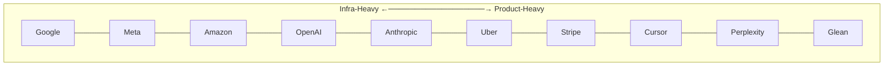

# Company-Specific Focus Areas

## Overview

The same AI system design prompt — "design a RAG-based enterprise Q&A system" — goes differently depending on where it's asked. At Glean, the interesting 20 minutes are retrieval-time permission enforcement; a candidate who spends that time on chunking strategy has answered the wrong question even if every word of it is technically correct. At Google, the interesting 20 minutes are serving efficiency at a scale most candidates have never designed for; the same permission-enforcement depth that would impress at Glean reads as underscaled at Google. Neither interviewer is grading on a different rubric — the six dimensions from [How AI System Design Interviews Work](01-how-ai-system-design-interviews-work.md) don't change. What changes is where the interviewer expects proactive depth, and a candidate who doesn't calibrate spends a scarce 45-minute budget on the sub-system the company cares about least.

## Definition

Company-specific calibration is the practice of biasing depth allocation toward the sub-systems a given company's product surface and engineering culture treat as the core hard problem, inferred from what they actually build and publish — not a leaked interview bank, and not a guarantee of what any specific interviewer will ask. It answers one question before the interview starts: given a generic prompt, where should this candidate's unprompted depth go first?

## The Real Question

The real question isn't "what will this company ask me?" — nobody can answer that reliably, and trying to predict specific prompts is a weaker use of prep time than understanding the underlying systems well. The real question is: **given whatever prompt I get, which sub-system should get my depth budget first, and which can I compress?** This reframes company research from prediction (unreliable) to calibration (a genuinely learnable skill), and it's a skill that survives the prompt being different from anything predicted — a well-calibrated candidate at Glean goes deep on permission enforcement whether the prompt is "design enterprise search" or "design a Slack-integrated AI assistant," because the calibration is about the company, not the specific words in the prompt.

## The Infra-Heavy vs. Product-Heavy Spectrum

Every company in this chapter sits somewhere on a spectrum between two poles, and knowing roughly where is the single highest-leverage piece of calibration — it applies even to a company not covered here by name.

At the **infrastructure-dominant** end, the interesting problems are in serving and data infrastructure at extreme scale — the product UX is comparatively well-understood, and the engineering challenge is doing it efficiently at billions of requests. At the **product-dominant** end, raw infrastructure is largely solved or bought, and the interesting problems are specific to what the product does that no generic AI infrastructure handles out of the box.

Candidates interview better when they know which end of this spectrum a given company sits on and bias their depth accordingly — more serving-infrastructure and latency-budget depth toward the left, more product-specific mechanism depth toward the right. Google and Meta anchor the infra-heavy end because their defining engineering challenge is doing something well-understood (search, feed ranking) at a scale that changes the problem's shape entirely. Glean, Cursor, and Perplexity anchor the product-heavy end because their differentiation lives entirely in a product-specific technical challenge — permission-aware retrieval, code-specific retrieval, citation grounding — that would exist even at a much smaller scale. OpenAI, Anthropic, Amazon, Uber, and Stripe sit in between, each pulled toward one end by a specific dimension of their business: OpenAI and Anthropic by safety and eval methodology at the frontier, Amazon by developer-platform and cost discipline, Uber by real-time infrastructure, Stripe by correctness and compliance.

## How to Use Each Company Profile

For each company below, four things: **the product surface** (what AI products they actually build, which sets the frame for any prompt), **the interview focus** (what the engineering culture obsesses about, inferred from the product surface), **depth allocation guidance** (what to invest more time in unprompted, and what to compress even if it's tempting to demonstrate), and **the seniority signal** — the specific, non-obvious thing a strong candidate raises proactively that a weaker candidate waits to be asked about.

### Google

**Product surface.** Search, including the AI Overviews feature serving billions of queries a day; Gemini as both a consumer app and an API; Google Cloud AI Platform (Vertex AI, Agent Builder); Workspace AI features; Android on-device AI. The scale of Search is the defining context for everything else — Google designs for 1B+ daily queries, not millions, and efficiency at that volume is a first-class engineering discipline in its own right, not a footnote after correctness.

**Interview focus.** Infrastructure scale as a default baseline — size an answer at billions of users unless told otherwise, because assuming tens of millions is itself a miscalibration at this company. Serving efficiency, because small per-query inefficiencies compound directly into large absolute costs at Google's request volume. Multi-modal inputs, because Gemini is natively multi-modal and a text-only architecture should be treated as a special case to call out, not the unstated default. And the distinction between consumer-AI serving (roughly ChatGPT-scale, on the order of a billion tokens/day) and search-adjacent AI serving, which can run an order of magnitude higher.

**Depth allocation.** Invest more in serving infrastructure — KV cache management, speculative decoding, batch scheduling, GPU fleet architecture — and in latency budgets, since Google users and Google engineers both measure search latency in milliseconds, not seconds. Invest in retrieval architecture for web-scale corpora specifically. Compress vendor-comparison discussions almost entirely: "should we use Pinecone or Qdrant?" is close to the wrong frame in a Google interview, since Google builds nearly all of this in-house, and time spent comparing SaaS vendors reads as not understanding the company's actual infrastructure posture.

**Signals seniority.** Noting that retrieval at search scale runs on custom infrastructure, not an off-the-shelf vector database, without being asked. Discussing the compound effect of serving inefficiency explicitly — "a 1ms improvement in prefill latency, multiplied by 1B queries/day, saves roughly 1M seconds of GPU time daily" is the kind of sentence that separates a candidate who's internalized Google's scale from one reciting a generic architecture. Proactively raising the multi-modal dimension: "if this query includes an image, how does the architecture change?"

### OpenAI

**Product surface.** ChatGPT (100M+ weekly users), the GPT API developer platform, DALL-E, Sora, Whisper, the o1/o3 reasoning-model line, and Operator as a browser agent.

**Interview focus.** Safety and alignment integrated into every system design as an architectural requirement from the first component, not an afterthought layer bolted on at the end. Evaluation methodology, specifically the hard version of the problem — how do you measure quality improvement at the frontier, where standard benchmarks saturate quickly and stop discriminating between good and better. Reasoning-model architecture, covering the same async patterns, KV cache sizing, and routing-away-from-reasoning-models territory as the reasoning-model track in [How AI System Design Interviews Work](01-how-ai-system-design-interviews-work.md#reasoning-model-system-design-a-distinct-interview-track). And the inference-serving path at very high throughput, since OpenAI serves more tokens per day than almost any other organization.

**Depth allocation.** Invest heavily in evaluation methodology — what "improving quality" even means once a model is already at or near the frontier on every standard benchmark — and in the safety-helpfulness tradeoff: how the system gets less likely to produce harmful output without becoming less useful on legitimate requests. Invest in reasoning-model cost architecture specifically. Don't spend time on generic RAG chunking strategy or basic embedding-model selection — these are commodity concerns elsewhere in the industry and not what an OpenAI interviewer is listening for.

**Signals seniority.** Distinguishing capability evaluation (does the model get harder tasks right?) from safety evaluation (does it behave well under adversarial input?) as two genuinely different measurement problems, not one "eval" bucket. Proactively naming the measurement problem itself: "how do we know this change improved quality when we've already saturated all the standard benchmarks?" Raising the reasoning-model cost-routing problem — which queries actually need the expensive path — without being prompted for it.

### Anthropic

**Product surface.** The Claude consumer app (claude.ai), the Claude API, Constitutional AI as both a training methodology and a design principle, interpretability research into model internals, and the 200K+ token context window as a defining product differentiator.

**Interview focus.** Safety deeply integrated into product architecture — Constitutional AI's premise is that safety is a property of how the system is structured at every layer, not a final output filter, and this expectation carries into how a candidate should structure any design here. Long-context design, since Claude's competitive edge is its context window and the architecture for handling 100K+ tokens differs meaningfully from a 4K-token design. Enterprise data handling, since the Claude API serves enterprises with strict compliance requirements and data isolation, audit logging, and DPA terms are live product concerns, not hypotheticals. Interpretability-informed design — what it means to build a system that's inspectable, not just functional.

**Depth allocation.** Invest in safety architecture that's genuinely structural — a property of how components are arranged, not a final-layer filter — and in long-context memory management: how a system that can hold an entire codebase in context differs from one built around RAG. Invest in enterprise compliance requirements specifically. Don't spend time on aggressive cost-optimization framing; it's a real concern everywhere, but it's less central to Anthropic's interview culture than it would be at, say, Amazon.

**Signals seniority.** Integrating safety before being asked — "since this agent can take irreversible actions, I'd require human confirmation before any write operation in v1" is the kind of sentence that shows safety was structural, not retrofitted. Discussing the helpfulness-versus-harm-avoidance tension as a genuine, ongoing design tradeoff rather than a solved problem with one correct answer. Proactively raising the long-context-versus-RAG tradeoff: "with a 200K token context window, some use cases that RAG traditionally handles can be served by loading context directly instead — here's when each is the right call."

### Meta

**Product surface.** AI features across Facebook, Instagram, and WhatsApp (3B+ users combined), Llama open-weight model releases, the recommendation systems powering Reels and Feed, content moderation at scale, and the Meta AI assistant embedded across the app family.

**Interview focus.** Extreme scale as the unstated baseline — assumptions should start at billions of users, not millions, without needing to be told to do so. Recommendation and ranking patterns, since Feed and Reels ranking is core Meta ML work and a strong answer treats it as a first-class architectural concern, not "the AI model" as an undifferentiated box. Content moderation at scale, where absolute numbers matter in a way they don't elsewhere — a 0.1% false-positive rate on a 3B-user platform means 3M legitimate posts incorrectly removed per day, a number worth stating explicitly rather than leaving as a percentage. Open-weight model deployment patterns, since Llama underpins Meta's own internal AI products and self-hosting at scale is a genuinely live concern, not a hypothetical.

**Depth allocation.** Size everything at 10B daily events by default. Treat recommendation-system architecture as a first-class topic in its own right — feature engineering, candidate-generation retrieval, the ranking model, and the business-logic layer on top, not just "the AI model." Invest in content-moderation design specifically, including the false-positive/false-negative asymmetry and its real societal stakes. Don't compress scale discussions — Meta interviewers notice, and penalize, candidates who underscale their estimates relative to the company's actual traffic.

**Signals seniority.** Framing decisions in absolute numbers at Meta's actual scale — "a 1% quality regression sounds small, but at Facebook's volume that's 10M affected interactions per day" — rather than leaving impact in percentage terms. Discussing content moderation's political and societal complexity without prompting, since Meta has faced significant public scrutiny on moderation decisions and a candidate who never raises the human-impact dimension is missing a core product consideration specific to this company. Noting that recommendation ML and language-model ML have genuinely different serving infrastructure requirements and would be kept as separate systems, not one undifferentiated "AI platform."

### Amazon

**Product surface.** Alexa, AWS AI services (Bedrock, SageMaker, CodeWhisperer/Amazon Q, Comprehend, Rekognition), supply-chain AI for demand forecasting and logistics, the collaborative-filtering recommendation systems Amazon pioneered at scale, and customer-service AI.

**Interview focus.** AWS leadership principles explicitly shaping the framing of answers — customer obsession, ownership, frugality — and candidates who use this vocabulary fluently signal cultural fit as much as technical competence. Developer API quality, since AWS is fundamentally a developer platform and API design, backwards compatibility, and reliability are treated as first-order engineering obsessions. Cost discipline, since frugality as a leadership principle means cost modeling is expected by default, not an optional add-on at the end. Alexa's voice-specific design concerns — always-on wake-word detection, speech recognition, multi-turn spoken dialogue with no screen to fall back on.

**Depth allocation.** Model every cost explicitly — "for 10M daily users at this architecture, the monthly AWS bill would be approximately..." is the expected shape of an answer, not an optional flourish. Use ownership language in design decisions: "I'd make the inference-service team own the SLA for the retrieval layer's latency contribution." If the prompt is AWS-facing, reference API design considerations explicitly. For Alexa-specific prompts, invest specifically in voice-interface design — no screen, no visible typing, an interaction model fundamentally different from text chat.

**Signals seniority.** Framing every tradeoff in customer-impact terms before technical-impact terms — "the higher cost of the larger model is justified if it reduces the customer's error rate from 12% to 3%; the support-cost savings more than offset the added inference cost" is the Amazon-flavored version of a tradeoff statement. Proactive cost modeling without being asked. Ownership-accountability language throughout, treated as a design consideration and not just a closing remark.

### Uber

**Product surface.** Driver-rider matching, dynamic surge pricing, ETA prediction, trip recommendation, driver-earnings optimization, Uber Eats delivery matching, and safety features including ride recording and in-app emergency sharing.

**Interview focus.** Real-time systems with hard latency requirements — driver matching happens within seconds in a marketplace that refreshes every 15-30 seconds, and missing that window loses both the driver and the rider from the match. Operational reliability under peak load, where New Year's Eve and major events are the hardest serving challenge Uber faces, not average daily traffic — a design that only accounts for typical load is missing the case that actually breaks things. Geospatial ML, since essentially every Uber prediction is geospatial — driver positions, ETAs, and surge zones are continuously computed against a map, not a generic feature vector. Real-world consequence design, since a wrong ETA or a missed match has physical, real-world consequences a wrong chatbot answer does not.

**Depth allocation.** Invest in real-time event processing and decision latency specifically — not just QPS, but the latency of the actual matching decision, which is a distinct and more demanding number. Discuss peak-load reliability as a first-class concern: what happens to the matching algorithm when 10x the average number of drivers and riders are active simultaneously. Raise the real-world-consequence framing upfront: "since this system affects people's physical location and safety, here's how I'd handle the failure mode where..."

**Signals seniority.** Immediately identifying that Uber's AI is real-time and event-driven, not batch-or-interactive the way a chat product is, and structuring the design around that from the start. Discussing peak-load reliability as an explicit, named engineering concern — New Year's Eve preparation is a real and recurring exercise at Uber, and treating it as a case worth naming signals familiarity with the actual operational reality. Raising the geospatial dimension of any ML feature without being asked, since it's easy to describe a ranking or matching model generically and miss that every input and output here is fundamentally located on a map.

### Stripe

**Product surface.** Payment processing at 99.999% uptime, fraud detection via Stripe Radar, financial analytics, Stripe Billing, developer-facing payment APIs, and Stripe Atlas.

**Interview focus.** Correctness as the dominant concern over availability in any tradeoff — a wrong financial transaction is a worse outcome than a brief outage, which inverts the default availability-first instinct many candidates bring from other backend contexts. Security and fraud, since financial data is among the most regulated and most targeted data categories in the world. API quality, since Stripe's reputation rests substantially on API design philosophy as a core engineering value in its own right. Explainability of automated decisions, since GDPR Article 22 requires explanations of automated decisions affecting users, the EU AI Act requires explanations of high-risk AI decisions, and a black-box fraud model that can't explain a decline is both a legal and an operational problem, not just a UX one. PII and financial-data handling under strict compliance throughout.

**Depth allocation.** Lead every design with compliance and security requirements before any architecture is proposed, not appended as "and we'd also need security" at the end. Discuss the asymmetric cost of false positives and false negatives in fraud detection explicitly — a false positive blocks a legitimate transaction and creates support load, a false negative allows fraud through, and these are not symmetric failure modes to optimize with a single accuracy number. Invest in explainability architecture: how the primary reason for a fraud decline gets surfaced to both the cardholder and the merchant.

**Signals seniority.** Leading with "what's the compliance scope here — GDPR, PCI-DSS?" before drawing any component, rather than treating compliance as a detail to fill in later. Discussing counterfactual fairness in fraud ML — does the model discriminate by ZIP code as a proxy for race — as a live design concern, not a hypothetical ethics tangent. Raising GDPR Article 22 explainability requirements for automated fraud decisions without being prompted, since this is the kind of regulatory specificity that separates a candidate who's actually thought about financial AI from one applying generic RAG patterns to a payments prompt.

### Glean

**Product surface.** Enterprise search over company-internal knowledge, connected through data connectors to Google Drive, Slack, Confluence, Jira, GitHub, email, Salesforce, and 50+ other sources, with the product promise that a search across everything in the company returns an AI-generated answer citing its sources.

**Interview focus.** Permission-aware retrieval is the core technical challenge, full stop — the AI must never surface a document the requesting employee doesn't have permission to see, and this is the product's foundational trust requirement, not one feature among many. Multi-connector data ingestion, since indexing 50+ different source systems each with their own format and permission model is a genuinely hard integration problem. Permission propagation latency — when an employee is terminated, their document access must be revoked from the search index quickly, and "quickly" is a real SLA, not a vague aspiration. Enterprise security and compliance broadly.

**Depth allocation.** The retrieval-time permission-enforcement architecture should be the single deepest part of any Glean-flavored interview — more time here than on any other sub-system, by a meaningful margin. Discuss ACL syncing from source systems and the latency tradeoffs in keeping it fresh. Raise the permission-inheritance problem explicitly: a document's effective permissions come from folder-level, site-level, and document-level rules that must be resolved and kept current, not read from a single static field. A candidate who doesn't raise permission enforcement proactively has missed the core product challenge, regardless of how good the rest of the design is.

**Signals seniority.** Proactively stating that permission checks must happen at retrieval time, not at display time — the model must never even see a restricted document, because filtering after generation is a fundamentally weaker guarantee than filtering before retrieval. Discussing the performance cost of permission-aware ANN search and the pre-filtering-versus-post-filtering tradeoff specifically. Raising termination-event propagation latency as a named SLA requirement: "when an employee is terminated, their access must be revoked from the search index within minutes, not hours — here's the webhook architecture for that."

### Cursor

**Product surface.** An AI coding assistant with real-time tab completion (~100ms latency), codebase-aware chat, multi-file automated edits, and tool-calling inside the IDE — running tests, checking types, editing files.

**Interview focus.** Interactive-loop latency, since completions have to appear in under roughly 200ms to feel responsive, and that budget forces specific model-size and serving decisions rather than being a soft target. Code-specific retrieval, since semantic code search behaves differently from semantic text search — identifier names, function signatures, call graphs, and import relationships matter in ways generic embedding models capture poorly. Agentic multi-file editing, where an agent modifying 10 files across a codebase has to handle partial failure, rollback, and atomic-commit semantics. IDE integration with language server protocols, file-system events, and the user's active cursor position.

**Depth allocation.** Invest heavily in the latency-budget breakdown for the completion case — where every millisecond goes, and why that constrains model size the same way Drill 3 in [Estimation & Capacity Planning Drills](03-estimation-and-capacity-planning-drills.md) works out. Discuss code retrieval specifically as a distinct problem from document retrieval. For any agentic-editing prompt, discuss failure modes and rollback mechanics explicitly rather than assuming happy-path execution.

**Signals seniority.** Immediately computing the latency budget and noting that it forces a model smaller than roughly 7B, or requires speculative decoding to hit the target with a larger model. Distinguishing code retrieval from text retrieval explicitly — exact identifier matching, LSP symbol lookup, AST traversal — rather than defaulting to embedding similarity as if code were prose. Raising the atomic-commit problem for multi-file edits unprompted: "if the agent modifies 8 files and the 9th modification fails, what state is the codebase left in?"

### Perplexity

**Product surface.** An AI answer engine with real-time web search, where every answer carries numbered citations with direct quotes, plus Perplexity Pro for more complex queries and a developer-facing API.

**Interview focus.** Retrieval quality and freshness, since the product's differentiator is that answers are grounded in real, current sources rather than a static index. Hallucination mitigation via citation grounding — every claim in a response should be traceable to a specific retrieved source, and faithfulness is a product requirement here, not just a background quality metric. Hybrid retrieval, combining live web search for freshness with semantic search for relevance ranking. Query understanding for ambiguous queries — what a user means by "latest AI news" depends on whether they want the last hour or the last day, and resolving that ambiguity is itself part of the retrieval problem.

**Depth allocation.** Invest in the retrieval-freshness architecture specifically — how the system answers questions about events from yesterday, which a static pre-indexed corpus structurally cannot do. Invest in citation-grounding mechanics: how a generated claim gets verified against a specific retrieved passage rather than merely being plausible. Invest in the hybrid retrieval pipeline — live search plus indexed knowledge base plus reranking, as three distinct stages, not one undifferentiated "retrieval" box. A candidate who designs a static RAG pipeline for a Perplexity-flavored prompt has missed the core architectural difference that defines the product.

**Signals seniority.** Proactively distinguishing Perplexity's architecture from static RAG: "the knowledge base is effectively the live web, not a pre-indexed corpus — freshness is the core requirement here, not just recall over a fixed index." Discussing faithfulness evaluation as a genuine production metric: "how do we know the generated answer actually matches what the cited source says?" Raising the contradictory-sources problem unprompted: "what happens when source A says X and source B says the opposite?"

## Comparison Table

| Company | Spectrum position | Primary focus | Invest depth in | Compress |
|---|---|---|---|---|
| **Google** | Infra-heavy | Serving efficiency at billion-query scale | KV cache, speculative decoding, GPU fleet, latency budgets, multi-modal | Vendor comparisons (mostly built in-house) |
| **OpenAI** | Infra/product mid | Safety-integrated design, frontier eval, reasoning-model cost | Eval methodology at the frontier, safety-helpfulness tradeoff, reasoning routing | Generic RAG chunking, basic embedding selection |
| **Anthropic** | Infra/product mid | Structural safety, long context, enterprise compliance | Safety as architecture (not a filter), long-context vs. RAG, enterprise data handling | Aggressive cost-optimization framing |
| **Meta** | Infra-heavy | Extreme scale, recommendation ranking, moderation | Absolute-number scale framing, ranking architecture, moderation false-positive math | — (don't compress scale) |
| **Amazon** | Infra-heavy | Leadership principles, developer APIs, frugality | Explicit cost modeling, ownership language, API design | — |
| **Uber** | Product-heavy | Real-time marketplace, geospatial ML | Decision latency, peak-load reliability, geospatial framing | — |
| **Stripe** | Product-heavy | Correctness, fraud, explainability | Compliance-first framing, false-positive/negative asymmetry, GDPR explainability | — |
| **Glean** | Product-heavy | Permission-aware retrieval | ACL enforcement at retrieval time, permission inheritance, propagation SLA | Generic retrieval mechanics |
| **Cursor** | Product-heavy | Interactive-loop latency, code retrieval | Latency budget breakdown, code vs. text retrieval, atomic multi-file edits | — |
| **Perplexity** | Product-heavy | Freshness, citation grounding | Hybrid retrieval, faithfulness evaluation, contradictory-source handling | Static RAG framing |

## Worked Example: The Same Prompt, Three Companies

Take the prompt from the comparison table's header: **"design a RAG-based enterprise Q&A system."** The prompt is identical; the 45 minutes unfold differently.

**At Glean**, the clarification phase includes a permissions question almost immediately — "does every employee see the same documents, or does access vary by role and team?" — and the high-level design phase treats the permission-filtering step as a first-class component on the initial sketch, not something added after retrieval works. The deep dive, if not otherwise directed, is offered specifically toward permission enforcement: "I've sketched the retrieval and generation path — I'd like to go deeper on how permissions get enforced at retrieval time, since that's the part most likely to fail silently in a bad way." Fifteen of the interview's 45 minutes plausibly go to ACL syncing, propagation latency, and the pre-filter-versus-post-filter tradeoff in ANN search.

**At Google**, the same prompt gets scoped at a much larger implied scale by default — "I'll assume this needs to handle enterprise-search volume in the hundreds of millions of queries a day, since that's the scale this kind of infrastructure is usually built for here" — and the deep dive gravitates toward serving efficiency: batching strategy, KV cache management under concurrent load, and the cost compounding of small latency deltas at that volume. Permissions still get a sentence, because skipping security entirely is a mistake regardless of company, but it's a sentence, not fifteen minutes.

**At Stripe**, the same prompt gets reframed almost immediately around what the enterprise documents actually contain — "before I design retrieval, I need to know if any of this corpus includes financial or customer PII, since that changes the compliance requirements before anything else" — and the deep dive goes toward audit logging, data isolation between tenants, and, if the Q&A system's answers ever touch a decision with financial consequence, explainability of the generated answer's provenance.

The architecture sketched in all three cases might look structurally similar on a whiteboard — retrieval, generation, some notion of access control. What differs entirely is where the unprompted depth goes, and that's the actual skill this chapter is training.

## Caveats

This is a heuristic built from public product surfaces and public engineering blog posts, not insider knowledge of any company's actual interview bank. Treat it as a prior for calibrating depth allocation, not a script to recite. Two things follow from that directly: interview focus areas shift as products evolve — what Glean's interviewers emphasize this year may differ from two years ago as the product surface changes — and a specific interviewer at any of these companies may simply be interested in something else that day, in which case the actual interviewer's direction always overrides this chapter's prior. The best preparation remains genuine systems understanding; this chapter tells a candidate where to point that understanding first, not what to say when they get there.

## Common Mistakes

- **Preparing a fixed script per company instead of a calibration prior.** Memorizing "at Glean I say X" fails the moment the actual prompt or interviewer direction doesn't match the rehearsed scenario — calibration should shift depth allocation, not replace genuine reasoning.
- **Underscaling at an infra-heavy company.** Sizing a Google or Meta answer at tens of millions of users when the company's actual traffic is in the billions reads as a candidate who hasn't done basic homework on the company they're interviewing at.
- **Overscaling at a product-heavy company.** Spending the first ten minutes of a Glean interview on a hyperscale serving architecture the corpus and query volume don't remotely justify, while permission enforcement — the actual hard problem — goes unmentioned.
- **Treating every company's "compress" list as "skip entirely."** Compressing vendor comparisons at Google doesn't mean never mentioning infrastructure choices at all — it means not spending the deep-dive budget there when the company has clearly already solved it in-house.
- **Assuming the calibration prior overrides the interviewer's actual direction.** If a Glean interviewer explicitly redirects toward cost modeling, follow the interviewer — this chapter's guidance is for the ambiguous stretches where no direction has been given yet, not a reason to resist an explicit steer.
- **Skipping the company research entirely because "the fundamentals matter more."** True in the sense that fundamentals are necessary, but calibration is what turns the same fundamentals into a Staff-level answer instead of a generic one — the two are not competing uses of prep time, since calibration only redirects depth that's already there.

## Key Takeaways

- The rubric doesn't change by company — the six dimensions from [How AI System Design Interviews Work](01-how-ai-system-design-interviews-work.md) are constant — but where unprompted depth is expected to go changes substantially, and a candidate who doesn't calibrate spends the budget on the wrong sub-system.
- The infra-heavy-versus-product-heavy spectrum is the single highest-leverage piece of calibration, and it generalizes to companies not covered here by name — ask which end of that spectrum the company sits on before anything more specific.
- For each company, four things matter: the product surface, what it implies about interview focus, where to invest versus compress depth, and the specific proactive insight that signals seniority at that company.
- Google and Meta anchor infra-heavy calibration — default to billions-scale assumptions and invest in serving efficiency; Glean, Cursor, and Perplexity anchor product-heavy calibration — invest in the one product-specific technical challenge that defines the company.
- The same prompt produces structurally similar architecture across companies but should produce very different depth allocation — the worked example shows the same RAG prompt spending its unprompted depth on permissions at Glean, serving efficiency at Google, and compliance at Stripe.
- This is a heuristic from public information, not a leaked interview bank — treat it as a prior for depth allocation and always defer to the actual interviewer's explicit direction once given.
- The best preparation is still genuine systems understanding; company calibration tells a candidate where to point that understanding first, not what to say instead of having it.

---

*Part of [Interview Prep](index.md) in the [AI System Design Notes](../index.md). Tracked in [BACKLOG.md](https://github.com/GyanendraChaubey/AI-System-Design-Notes/blob/main/BACKLOG.md).*
