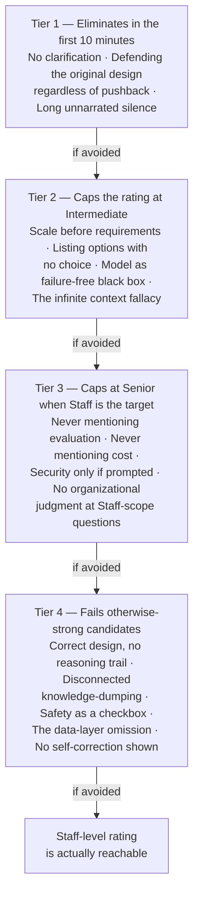

# Common Mistakes & Red Flags

## Overview

Not every mistake in an AI system design interview costs the same amount. Some end the interview's usefulness in the first ten minutes, before the candidate has a chance to recover. Others are survivable but put a hard ceiling on the rating regardless of how strong the rest of the session is. And a handful are subtle enough that they fail candidates who did almost everything else right — the kind of gap a candidate walks out not knowing they left on the table. This chapter catalogs all of them, organized by how much damage each one does, so a candidate reviewing their own mock sessions can triage: fix the mistakes that eliminate you first, then the ones that cap you at Senior, then the subtle ones that separate a strong Senior answer from a Staff one.

## Definition

A mistake, in this chapter's sense, is a specific, recurring pattern in how candidates handle the AI system design interview — distinct from "having the wrong architecture," which is rarely fatal on its own (see [How AI System Design Interviews Work](01-how-ai-system-design-interviews-work.md) on reasoning trail over destination). A red flag is a subtler variant: a pattern that doesn't obviously look wrong in the moment, sometimes coexists with an otherwise technically excellent answer, and still caps the rating because it signals something about how the candidate would behave in a real design review, not just how they answered this one prompt.

## The Real Question

The question this chapter answers isn't "what's wrong with my design?" — that's evaluated by the six rubric dimensions covered elsewhere. The question is: **of everything that could go wrong in this interview, which failures are worth fixing first?** A candidate with limited prep time who spends it eliminating a Tier 4 red flag while a Tier 1 mistake is still live has mis-prioritized — the Tier 1 mistake will end the interview's usefulness before the Tier 4 fix ever gets a chance to matter.

## Core Concepts

- **The severity ladder** — mistakes sorted by how much of the rating they cap, from "ends the interview's usefulness early" down to "caps a technically excellent answer just below the top rating."
- **Rubric gap** — a dimension from the six in [How AI System Design Interviews Work](01-how-ai-system-design-interviews-work.md#the-rubric-dimensions) that received zero coverage across the full session, as opposed to weak coverage. A gap scores worse than a weak attempt, because the interviewer can't distinguish "didn't think of it" from "doesn't think it matters."
- **The reasoning trail** — the visible sequence of questions, assumptions, and tradeoffs that produced a design, as distinct from the design itself. Several of this chapter's most damaging mistakes are really failures to produce a visible reasoning trail, independent of whether the underlying design was any good.
- **Checkbox mention** — raising a topic (safety, evaluation, cost) in name only, with no mechanism, no placement decision, and no tradeoff attached — which reads to an interviewer as knowing the topic should be mentioned rather than having actually reasoned about it.
- **Self-correction** — a visible, stated revision to something the candidate said earlier in the session. Its near-total absence across 45 minutes is itself a red flag, independent of what the (uncorrected) original statements were.

## The Severity Ladder

Each tier assumes the ones above it have already been avoided — there's no point diagnosing a Tier 4 red flag in a session that still has a Tier 1 mistake in it, because the Tier 1 mistake determines the ceiling regardless of what else goes right.

## Tier 1: Mistakes That Eliminate Candidates in the First 10 Minutes

These aren't mistakes that lower a score — they change what the rest of the session is even measuring.

**Starting to design without clarifying anything.** The candidate hears "design ChatGPT" and starts drawing components immediately. This does more damage than it looks like in the moment: it tells the interviewer the candidate plans to answer a question that was never actually asked, and that requirements clarification isn't a skill they reach for under pressure. A strong, detailed design of the wrong system still fails every rubric dimension that depends on the requirements — scale, latency budget, data-freshness constraints — because none of those were ever established. The interviewer is left unable to distinguish "this candidate is technically weak" from "this candidate solved a different, unstated problem well," and that ambiguity itself caps the rating.

**Treating the first proposed architecture as final.** When the interviewer probes — "what if traffic is 10x that?" — the candidate defends the original design rather than updating it. This is read as evidence the original design was never actually reasoned through: if it had been, the candidate would know precisely which parts of it survive a 10x scale change and which don't, and could say so specifically. Reflexive defense in place of that specificity signals the design's apparent confidence was cosmetic.

**Going silent while thinking for more than 30 seconds.** Unnarrated silence in a 45-minute interview is expensive and, worse, illegible — the interviewer has no way to distinguish productive thinking from being stuck, and defaults toward assuming the latter the longer it goes on. Narrating costs almost nothing: "I'm thinking about the tradeoff between pre-filtering and post-filtering here — give me about 15 seconds." A 30-second *narrated* pause reliably scores better than a 10-second silent one, because the narrated version is itself evidence of structured thinking in progress.

## Tier 2: Mistakes That Cap the Rating at Intermediate

These don't end the session, but they put a ceiling on it regardless of how much technical knowledge is on display elsewhere.

**Designing for scale before establishing requirements.** Proposing a multi-region active-active deployment for a system that might turn out to have 100 enterprise users is read as: this candidate knows infrastructure patterns but doesn't know when to apply them. Every scale decision needs to trace back to a specific number from the clarification phase — an interviewer who can't trace a component back to a stated requirement reads it as engineering instinct substituting for engineering judgment.

**Listing options without choosing.** "We could use Pinecone or Qdrant or pgvector — each has tradeoffs" is correct and, on its own, useless. It technically demonstrates knowledge of the option space but earns none of the credit tradeoff reasoning is meant to reward, because nothing was actually decided. The version that scores: "I'd use Qdrant self-hosted, because the data-residency requirement rules out SaaS and our corpus is 50M vectors, which exceeds pgvector's comfortable range — here's what that costs us in operational complexity." The choice and its reasoning are the graded artifact; the list of options is just the raw material for it.

**Treating the model as a black box with no failure modes.** The model is presented as a reliable function that takes context in and returns a correct answer out, with no mention of hallucination, timeout, quality degradation after a model-version change, or silent quality drift over time. Real AI systems fail in all four of these ways on a regular basis, and a design that accounts for none of them is a design that has not been deployed to production, or wasn't designed by someone who has.

**The infinite-context fallacy.** Designing a system where "all the documents get passed to the model in the context window," with no discussion of the context limit, the cost of using a large context, or what happens when the corpus exceeds it. This is a specific, recognizable tell that the candidate hasn't operated a real RAG system and doesn't know where its actual constraints bind — someone who has built one of these systems runs into the context ceiling almost immediately and can't design around it without noticing.

## Tier 3: Mistakes That Cap the Rating at Senior When Staff Is the Target

These are survivable at the Senior bar and even common in strong Senior answers — but they're specifically what separates a strong Senior rating from a Staff one, because Staff-level breadth is graded on exactly these dimensions being present unprompted.

**Never mentioning evaluation.** The system is fully designed — retrieval, generation, safety — with no discussion anywhere of how the candidate would know if any of it is actually working. Staff-bar interviewers read this one of two ways: either the candidate doesn't think in terms of production quality management, or they do think about it but don't treat it as architecturally significant enough to mention. Neither reading scores well. The fix costs almost nothing: a single sentence placed naturally — "I'd validate this with a 200-example golden set before launch and track LLM-as-judge quality scores continuously in production" — recovers most of the available credit on this dimension.

**Never mentioning cost.** A fully designed system with no cost estimate anywhere leaves the interviewer unable to tell whether this is a $500/month system or a $5M/month one — and, more importantly, unable to tell whether the candidate can tell the difference. Cost awareness here isn't about hitting a specific dollar figure; it's about demonstrating that cost modeling is a live part of every architecture decision, not a separate exercise. "At this scale, model inference is the dominant cost — I'd invest in model-tier routing before any other optimization" takes about twenty seconds to say and covers the dimension.

**Never mentioning security or safety unless directly prompted.** Specifically, never naming the AI-specific attack surfaces: prompt injection through retrieved or tool-returned content, PII leakage through generation output, jailbreaks around safety filters, cross-tenant data isolation failures. A candidate who designs a RAG pipeline or a tool-using agent without once saying "prompt injection," "ACL at retrieval time," "PII in outputs," or "output validation" has left a rubric dimension completely empty. The specific pattern that fails otherwise-strong candidates here is subtler than silence: mentioning security *generically* — "of course we'd handle security" — without it being structurally part of any specific design decision. Generic mention signals the topic was remembered, not designed for.

**No organizational judgment at the Staff-scope questions.** When the interviewer asks "what wouldn't you build in v1?", "who should own this system?", or "what's the on-call story here?", a Senior-level answer gives a technical answer: "I'd defer the reranker until after we validate retrieval quality." A Staff answer gives an organizational one: "I wouldn't build the evaluation infrastructure in v1 — I'd use a managed platform like Braintrust or Arize and evaluate whether the cost justifies a custom build once we understand our specific eval requirements. The on-call for this goes to the platform team, since three product teams will consume it, and three separate on-calls for the same underlying service is the wrong structure." The technical answer isn't wrong; it's simply answering at one level below what the question was actually probing for.

## Tier 4: Subtle Red Flags That Fail Technically Correct Candidates

These are the hardest to self-diagnose, because they can coexist with a design that is, on its face, entirely correct. They fail candidates who never hear "that's wrong" from the interviewer during the session, and only find out later why the rating wasn't higher.

**Correct design with no reasoning trail.** The candidate's final architecture happens to be right, but the path to it was never shown — no stated assumptions, no visible weighing of alternatives, no narrated "why." The interviewer has no way to distinguish "arrived here through principled reasoning" from "memorized this shape from a tutorial and got lucky that it fit the prompt." Because the reasoning trail is the actual graded artifact and the final diagram is only its byproduct, a design that happens to be right with no shown reasoning scores *lower* than a slightly wrong design produced with explicit, logical reasoning at every step.

**Knowledge-dumping disconnected from the problem.** Reciting technically accurate detail about HNSW index construction, attention-mechanism internals, or LoRA rank selection that isn't connected to any decision actually being made in the interview. This reads as performing expertise rather than applying judgment — the litmus test is whether the candidate can complete the sentence "this matters here because...". If they can't, the fact doesn't belong in the answer, regardless of how correct or impressive it is on its own.

**Safety as a checkbox.** "Of course we'd add safety guardrails at the output layer" — with no mechanism named, no placement decision, no false-positive tradeoff, no latency cost discussed. Compare that against: "since this system retrieves content from user-uploaded documents, I'd add a prompt-injection classifier between the retrieval output and the context-assembly step — it runs in about 50ms and catches the most common indirect-injection patterns before they reach the model." The second version is structural, placed, and sized; the first is a box ticked in passing. Interviewers can tell the difference immediately, and it's one of the most common ways a candidate who technically "mentioned security" still fails that rubric dimension.

**The data-layer omission.** Designing the query path — query in, retrieval, model, response out — without ever describing how documents got into the vector store in the first place, how the index stays fresh, or what happens when a source document changes. Real RAG systems spend roughly as much engineering effort on the indexing pipeline as on the query path, and omitting it entirely reveals a candidate who has thought carefully about inference-time behavior but never operated the ingestion side of a system like this in production.

**No self-correction shown across 45 minutes.** Going through a full session without once revising a stated position, which is statistically implausible for 45 minutes of live design under genuine expert scrutiny. It reads as one of two things, and neither is favorable: either the candidate isn't actually engaging with the interviewer's pushback — nodding and continuing rather than incorporating it — or the entire design was rehearsed in advance and recited rather than reasoned through live, since a genuinely live reasoning process under real pushback almost always produces at least one visible correction. A single, clearly stated revision — "you're right, that doesn't handle the failure mode I described earlier, let me fix that" — is worth more to the rating than an unbroken run of apparently correct answers with nothing ever revised.

## Self-Diagnostic: What to Fix First

| Tier | Signal in a mock recording | Fix priority |
|---|---|---|
| 1 | Design starts before any question is asked; a pushback question gets defended rather than incorporated; a pause runs past 30 seconds with no narration | Fix immediately — nothing else in the session is measurable until these are gone |
| 2 | A scale decision has no traceable number behind it; "we could use X or Y" appears with no resolution; the model is discussed as if it never fails; documents "just fit in context" with no limit discussed | Fix before running more mocks — these cap the rating regardless of depth elsewhere |
| 3 | A full playback of the session has zero sentences containing "eval," "cost," or "security"; a "what wouldn't you build" question gets a purely technical answer | Fix once Tiers 1-2 are clean — this is the gap between a strong Senior and a Staff rating |
| 4 | The design is right but a reviewer has to ask "why did you choose that?" more than once; any fact recited has no attached decision; safety is one sentence with no mechanism; the ingestion pipeline never comes up; no statement is ever revised | Fix last — these separate a strong Staff answer from a merely good one, and are hardest to hear in your own recording without a second reviewer |

## Worked Example: Two Candidates, One Prompt

Both candidates receive: "Design an AI assistant that answers questions from a company's internal wiki."

**Candidate A** starts sketching a RAG pipeline within the first thirty seconds — chunking, an embedding model, a vector store, a generation step — and spends the next fifteen minutes going deep on chunking strategy specifically, since it's the part they'd rehearsed most. When the interviewer asks "what if the wiki has documents some employees shouldn't see?", Candidate A says "we could add access control later" and continues describing chunk overlap parameters. The session ends with no mention of evaluation, cost, or how the index stays current as wiki pages change. This is a Tier 1 mistake (no clarification) compounding into a Tier 2 one (scale/complexity with no grounding) and leaving multiple Tier 3 gaps (no eval, no cost) unaddressed — the technical content on chunking may be entirely correct, and none of it recovers the rating.

**Candidate B** opens by stating the plan, then asks about document volume, update frequency, whether access varies by employee, and how success would be measured. On hearing that access does vary by role, Candidate B says: "That changes the design — I need permission filtering at retrieval time, before any document reaches the model, not as an afterthought. Let me build that into the initial sketch." The high-level design covers ingestion, retrieval-with-permission-filtering, generation, and a brief mention of a golden-set eval before launch, each labeled with a one-line reason. When the interviewer pushes — "what if the wiki has 2 million pages instead of 2,000?" — Candidate B revises visibly: "At that volume I'd move off pgvector to a dedicated vector store and add a BM25 hybrid pass, since pure semantic search starts missing exact-term matches at that corpus size." The session reaches evaluation, cost, and a wrap-up with time to spare.

Both candidates may know roughly the same amount about chunking, embeddings, and vector databases. The rating gap between them is produced entirely by the mistakes cataloged in this chapter, not by a difference in underlying technical knowledge.

## Interview Questions

### Beginner

**Q: Why does starting to design a system before asking any clarifying questions hurt a candidate's score so much, even if the resulting design is technically solid?**
Because it makes the design's quality unmeasurable against what was actually being asked. The prompt is deliberately vague, and a technically strong answer to the wrong scoped problem still fails every rubric dimension that depends on requirements — scale, latency, data freshness — since none of those were ever established through questions. The interviewer can't tell "weak technically" from "strong technically, wrong problem" until much later in the session, if at all, and both read as a missed rubric dimension regardless.

**Q: What's the difference between "we could use Pinecone or Qdrant, each has tradeoffs" and a version of that same sentence that scores well?**
The first version lists options without resolving them, which demonstrates knowledge of the space but earns no tradeoff-reasoning credit, since nothing was actually decided. The scoring version names a choice and the specific reason behind it: "I'd use Qdrant self-hosted because our data-residency requirement rules out SaaS, and our corpus size exceeds what pgvector handles comfortably." The list of options is raw material; the graded artifact is the decision and its stated reasoning.

### Intermediate

**Q: A candidate designs a complete RAG pipeline and never mentions evaluation once. The design itself has no technical errors. Why does this still cap the rating?**
Because evaluation is one of the rubric dimensions scored across the whole session, and a complete absence is read differently from weak coverage — the interviewer can't distinguish "didn't think of it" from "doesn't consider it architecturally important," and neither interpretation is favorable at the Senior-or-above bar. The fix is cheap: one sentence, placed naturally, like "I'd validate this against a golden set before launch and track quality continuously with an LLM-as-judge in production," recovers most of the available credit without requiring a deep evaluation-architecture discussion.

**Q: What's the difference between a candidate mentioning "we'd need security" once in passing and a candidate who handles security well, even if both technically "cover" the topic?**
The generic mention is a checkbox — it signals the candidate knows security should come up, without it being attached to any specific design decision. Handling it well means naming a mechanism, a placement, and a tradeoff: "since this agent processes user-uploaded documents, I'd run a prompt-injection classifier between retrieval and context assembly, adding about 50ms of latency, to catch the most common indirect-injection patterns before they reach the model." The interviewer can tell the difference immediately, and only the second version actually fills the rubric dimension.

### Senior

**Q: A candidate produces a technically correct final architecture but never states an assumption, never narrates a tradeoff, and never explains why one component was chosen over another. How would you evaluate that session, and why?**
Lower than a session with a slightly flawed design that shows explicit, logical reasoning at each step — because the reasoning trail is the actual graded artifact in this interview format, and the final diagram is only its byproduct. Without a visible trail, there's no way to distinguish a candidate who reasoned through the design from one who recalled a memorized shape that happened to fit this prompt, and the interview format exists specifically to test the former, not the latter.

**Q: How would you distinguish a candidate whose design is genuinely reasoned through from one who is knowledge-dumping accurate but disconnected facts?**
Ask, for any fact volunteered, whether the candidate connects it to a decision being made in the interview — the test is whether they can complete "this matters here because...". A candidate reasoning through the design ties every technical detail to a specific choice: "I'd use a cross-encoder reranker here specifically because our initial retrieval recall is only 70% at k=20, and the cost of a wrong top result is high enough to justify the added latency." A knowledge-dumping candidate states the same fact about cross-encoders in isolation, with no connection to why it applies to this system at this moment — accurate, but not evidence of judgment.

### Staff

**Q: You're reviewing a mock interview recording. The candidate never once revised a statement across the full 45 minutes, despite several pushback questions from the interviewer. How do you read this, and what would you tell the candidate?**
I'd treat the absence of any self-correction as itself the finding, independent of whether each individual answer was correct — 45 minutes of live design under genuine pushback almost always produces at least one visible revision, so a clean run with none is more likely to mean the candidate wasn't actually incorporating the interviewer's questions, or was reciting a rehearsed design rather than reasoning live. I'd tell the candidate specifically: the goal isn't to avoid being wrong, it's to visibly update when new information changes the picture — a single "you're right, that doesn't handle the case I described earlier, here's the fix" is worth more to the rating than an unbroken string of confident, unrevised answers, because the revision is the actual signal the format is built to surface.

**Q: A candidate consistently produces strong, technically correct high-level designs but tops out at a Senior rating rather than Staff. Diagnose the likely gap, and describe how you'd verify it before offering feedback.**
The likely gap sits in Tier 3 of the severity ladder — the candidate has cleared the mistakes that cap Intermediate and even most that fail otherwise-strong sessions, but the design consistently lacks the organizational-judgment layer Staff-level questions probe for: what not to build, who should own the system, what the on-call story looks like. I'd verify by specifically checking how the candidate answers a "what wouldn't you build in v1" or "who owns this" style question in the recording — if the answer stays purely technical ("I'd defer the reranker") rather than organizational ("I'd buy the eval platform rather than build it, and this goes to the platform team since three product teams would otherwise run duplicate on-calls for the same service"), that's the specific, fixable gap. I wouldn't guess at this from the high-level design alone, since a strong technical design and a missing organizational layer look identical until the interviewer asks the Staff-scope question directly — the diagnosis has to come from that specific moment in the recording, not from the rest of the session.

## Google-Level Follow-Ups

- **"A candidate's design was flawless, but they never once said 'I'm not sure' or named a weak point. What does that tell you?"** Probes whether the reviewer understands that unbroken confidence across 45 minutes of live, ambiguous design is itself a red flag — either the design was over-rehearsed, or the candidate isn't being honest about genuine uncertainty, and both read worse than a specific, well-reasoned admission of a weak point.
- **"Two candidates both skip the on-call/ownership question's organizational depth. One is a new grad, one has ten years of experience. Do they fail the same way?"** Probes calibration — for the new grad, missing organizational judgment is expected and not disqualifying at that level; for the senior candidate, the identical gap is a genuine Tier 3 finding, since the bar in [How AI System Design Interviews Work](01-how-ai-system-design-interviews-work.md#scalability) rises with claimed seniority, not the prompt.
- **"A candidate mentions security, cost, and evaluation, each exactly once, each in one generic sentence, and never returns to any of them. Passing or not?"** Probes whether the reviewer can distinguish a checkbox mention from genuine coverage — technically all three rubric dimensions were "touched," but none were structurally part of any specific decision, which is the Tier 4 red flag in a slightly more elaborate disguise.
- **"How would you tell the difference, from a transcript alone, between a candidate who didn't think of evaluation and one who thought about it but decided it wasn't worth mentioning?"** Probes whether the reviewer recognizes this distinction usually can't be made from a transcript alone — which is exactly why the rubric penalizes the omission itself rather than trying to infer intent, and why the fix is always "say the sentence," regardless of which explanation is actually true.

## Key Takeaways

- Mistakes in this interview format aren't uniform in cost — some end the session's usefulness in the first ten minutes, some cap the rating at a fixed ceiling regardless of other strengths, and some are subtle enough to fail candidates who never hear anything went wrong.
- Tier 1 mistakes — no clarification, defending rather than revising under pushback, unnarrated silence past 30 seconds — change what the rest of the session even measures, and have to be fixed before anything else is worth diagnosing.
- Tier 2 mistakes — ungrounded scale decisions, listing options without choosing, a failure-free model, the infinite-context fallacy — cap the rating at Intermediate regardless of how much surrounding technical knowledge is on display.
- Tier 3 mistakes are specifically what separates a strong Senior rating from Staff: never mentioning evaluation, cost, or security unless directly prompted, and answering Staff-scope questions ("what not to build," "who owns this") with a technical rather than organizational answer.
- Tier 4 red flags are the hardest to self-diagnose because they coexist with technically correct designs: no visible reasoning trail, knowledge-dumping disconnected from any decision, safety mentioned as a checkbox rather than a placed mechanism, the data-ingestion layer never discussed, and no statement ever revised across 45 minutes.
- The reasoning trail, not the final diagram, is the actual graded artifact throughout this interview — a design that happens to be correct with no shown reasoning scores lower than a slightly flawed one produced with visible, logical reasoning at every step.
- When reviewing a mock session, triage from Tier 1 down — fixing a Tier 4 red flag is wasted effort while a Tier 1 mistake is still present, since the earlier tier determines the ceiling the later ones would otherwise raise.

---

*Part of [Interview Prep](index.md) in the [AI System Design Notes](../index.md). Tracked in [BACKLOG.md](https://github.com/GyanendraChaubey/AI-System-Design-Notes/blob/main/BACKLOG.md).*
