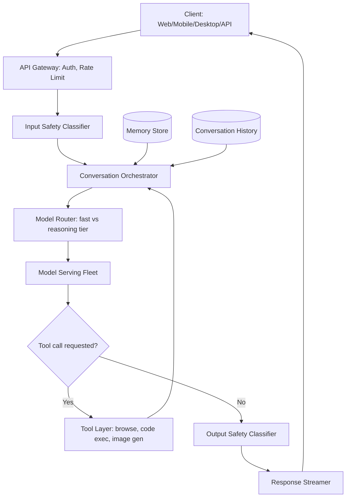
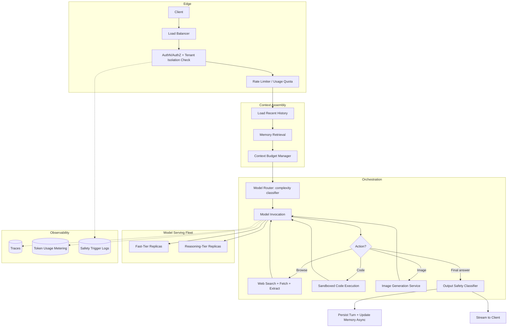
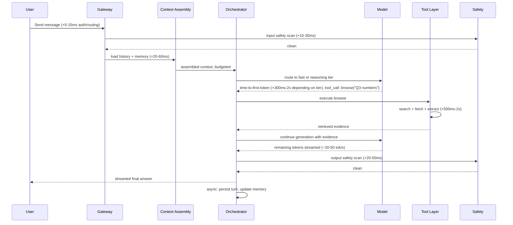
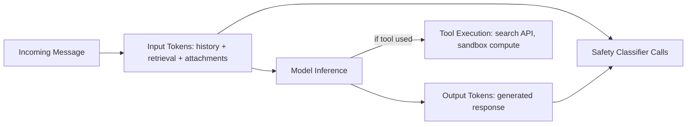
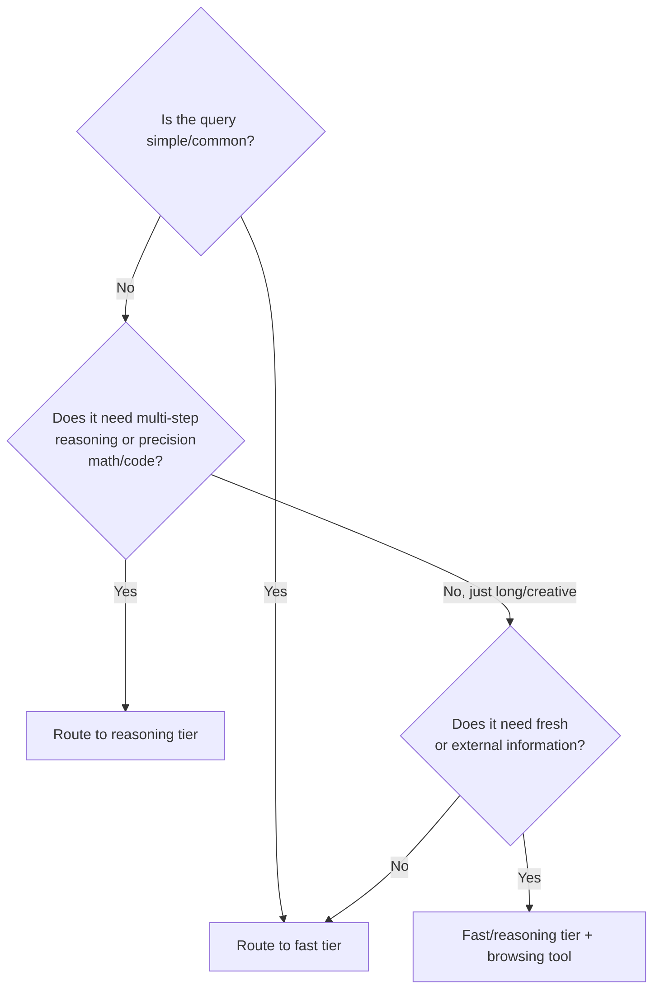

# ChatGPT — System Design Case Study

## Requirements

**Functional**
- Multi-turn conversational chat over text, with image and file (PDF, spreadsheet, code) input.
- Tool use within a conversation: web browsing/search, code execution ("code interpreter"), image generation, and persistent cross-session memory of user facts/preferences.
- Multiple model tiers selectable by the user or auto-routed by the system (a fast/cheap default model vs. a slower, more capable "reasoning" model for hard problems).
- Custom assistants (custom GPTs/Projects) with their own instructions, knowledge files, and tool configuration.
- Both a consumer surface (web/mobile/desktop apps) and a developer-facing API with the same underlying model fleet.
- An enterprise tier (ChatGPT Enterprise) with tenant-level data isolation, SSO, and admin controls.

**Non-functional**
- Time-to-first-token in the low hundreds of milliseconds to ~1-2 seconds for a simple turn; sustained streaming at a readable rate (tens of tokens/sec) thereafter.
- High availability across regions; graceful degradation (a slow tool should not take down chat) rather than hard failure.
- Content safety and policy enforcement on both input and output, at the latency budget of a normal turn, not as a separate slow pass.
- Strict data isolation between enterprise tenants, and between a user's own conversations and any data used to improve the product.
- Cost efficiency at a user base in the hundreds of millions — small per-message inefficiencies compound into large absolute costs.

**Explicitly out of scope for this case study**: pretraining the underlying foundation model (a separate ML research/training system), the model's internal architecture (see [Transformer Internals for Systems Engineers](../02-llm-architecture/01-transformer-internals-for-systems-engineers.md)), and billing/payments infrastructure.

## Capacity Planning

Using the method from [GPU Sizing & Capacity Planning](../16-gpu-systems/02-gpu-sizing-and-capacity-planning.md), with illustrative, order-of-magnitude assumptions (not reported usage figures) to make the arithmetic concrete:

| Step | Assumption | Result |
|---|---|---|
| Active users | 100M weekly active, ~25% active on a given day | 25M DAU |
| Messages per active user/day | 8 turns/day average | 200M messages/day |
| Average over a day | 200M / 86,400s | ~2,300 QPS average |
| Peak-to-average ratio | Consumer chat traffic peaks 3-4x average, concentrated in a handful of waking hours across time zones | ~8,000-9,000 QPS peak |
| Tokens per message | ~600 input tokens (prompt + history) + ~400 output tokens | ~1M input tok/s, ~700K output tok/s at peak |
| Throughput per GPU (illustrative) | An illustrative mid-size model serving at a few thousand output tokens/sec per accelerator under continuous batching | Tens of thousands of accelerators in the serving fleet at peak, before accounting for the slower "reasoning" tier, redundancy, and multi-region headroom |

The single biggest sizing variable is the **mix between fast and reasoning-tier models** — a reasoning-tier request can consume an order of magnitude more compute per message (longer generation, sometimes multiple internal reasoning passes), so the effective fleet size depends heavily on what fraction of traffic routes there, not just total message volume.

## Scale Estimation

- **Conversation storage**: 200M messages/day at ~1-2 KB per message (text) is on the order of 200-400 GB/day of raw conversational data before any media attachments, growing the historical store by tens of terabytes a month.
- **Memory store**: cross-session memory is a much smaller, denser store — a few KB of extracted facts per active user, so tens of millions of users implies a memory index in the tens-of-GB range, small enough to keep latency-sensitive but requiring careful update/versioning logic.
- **Vector index for retrieval (file uploads, custom GPT knowledge)**: scales with attachments per session rather than total users — typically ephemeral, session-scoped indexes rather than one global growing index.
- **Fan-out**: a single user turn with browsing enabled can fan out into several search/fetch calls before generation continues, multiplying effective request volume on the retrieval subsystem relative to raw chat QPS.

## High Level Design



## Detailed Design



## API Design

A simplified view of the conversation-turn endpoint (the same shape underlies both the consumer app and the developer API):

```
POST /v1/conversations/{conversation_id}/messages
{
  "content": "Summarize this PDF and tell me if our Q3 numbers look healthy.",
  "attachments": [{"type": "file", "id": "file_abc123"}],
  "tools_enabled": ["browse", "code_interpreter"],
  "model_preference": "auto"   // or explicit: "fast" | "reasoning"
}

Response: a streamed event sequence —
  event: token        data: {"text": "Looking"}
  event: tool_call     data: {"tool": "code_interpreter", "input": "..."}
  event: tool_result   data: {"tool": "code_interpreter", "output": "..."}
  event: token         data: {"text": " at"}
  ...
  event: done          data: {"usage": {"input_tokens": 612, "output_tokens": 287}}
```

Streaming as Server-Sent Events (or an equivalent chunked transport) is the default, not an optimization — perceived latency depends on it, since time-to-first-token matters more to the user than total completion time.

## Data Flow



A simple fast-tier turn with no tools can land time-to-first-token under a second; a reasoning-tier turn with a browsing tool call realistically spends several seconds before the final answer starts streaming — which is precisely why model and tool routing decisions are made explicit, visible product choices (a visible "thinking" or "searching" state) rather than hidden latency.

## Retrieval Layer

Three distinct retrieval surfaces exist in this product, each with different freshness and scale characteristics, and conflating them is a common design mistake:

1. **Web browsing** — retrieval over the live web via a search API plus fetch-and-extract, used for time-sensitive or out-of-training-data queries. Freshness requirement: seconds-to-minutes; no persistent index owned by the chat product itself.
2. **Memory retrieval** — a small, per-user store of extracted facts/preferences, retrieved by relevance to the current conversation rather than full-text search; this is closer to a key-value/semantic lookup than corpus-scale RAG (see [Memory Architecture for Agents](../12-memory-systems/01-memory-architecture-for-agents.md)).
3. **File/knowledge retrieval** — session- or assistant-scoped RAG over user-uploaded documents or custom-GPT knowledge files (see [RAG Architecture](../06-rag/01-rag-architecture.md)); this index is ephemeral and small relative to enterprise RAG corpora, so simpler infrastructure (in-memory or per-session indexes) is usually sufficient rather than a billion-vector production index.

## Agent Layer

The orchestrator runs a bounded [agent loop](../09-agents/01-agent-fundamentals-and-the-agent-loop.md): the model proposes an action (answer, browse, run code, generate an image), the orchestrator executes it, the result is fed back, and the loop continues until a final answer or a step/time cap is hit. A typical conversational turn caps at a small number of tool-call iterations (single digits) — unlike a long-horizon research agent, the product's latency expectations bound how many loop iterations are acceptable before a user perceives the assistant as "stuck."

## Model Layer

Two or more model tiers sit behind the same conversational interface: a fast, cheaper model for the bulk of everyday turns, and a slower, more capable "reasoning" model for problems that benefit from longer, more deliberate generation (multi-step math, complex code, ambiguous requests). Routing between them can be explicit (the user picks a mode) or automatic (a lightweight classifier estimates query difficulty before the expensive path is engaged) — automatic routing is the higher-leverage lever for cost control, since most everyday turns ("rewrite this email," "what's a good substitute for buttermilk") gain nothing from the slower tier. See [Multi-Model Serving & Routing](../15-model-serving/05-multi-model-serving-and-routing.md).

## Observability Layer

- **Per-turn tracing** capturing model tier selected, tool calls made, and latency per hop, so a regression can be attributed to a specific stage rather than the whole conversation.
- **Token usage metering** per request, since it drives both API billing and internal cost dashboards — undercounting here directly corrupts unit economics.
- **Safety trigger rate**, tracked as a trend on both input and output classifiers, to catch both attack campaigns and false-positive regressions after a classifier update.
- **Tool success/latency rate** per tool (browsing, code execution, image generation) — these are the least predictable hops and the most useful early-warning signal for degraded user experience.

## Security Layer

The dominant product-specific risk is **indirect prompt injection through browsed web content or uploaded files** — a malicious page or document can contain text instructing the model to ignore prior instructions or exfiltrate conversation context; retrieved/fetched content must be treated as untrusted data, never as instructions (see [AI Security Architecture](../21-ai-security/01-ai-security-architecture.md)). Code execution introduces a classic sandboxing requirement: generated code runs in an isolated environment with no access to other users' data or the broader production network. Enterprise tenancy adds a hard isolation requirement: a tenant's conversations, uploaded files, and custom-assistant configurations must never be retrievable by, or used to influence outputs for, another tenant.

## Cost Model



| Cost component | Cost driver | Lever |
|---|---|---|
| Input tokens | Conversation history length, retrieved/attached content | Context budgeting, history summarization |
| Output tokens | Response length, reasoning-tier verbosity | Model routing (don't default everything to the expensive tier) |
| Tool execution | Search API calls, sandbox compute minutes | Cap tool-call iterations per turn |
| Safety classifiers | Two passes (input + output) per turn, on every message | Lightweight first-pass classifiers, escalate to heavier models only on uncertain cases |
| Memory storage/retrieval | Small per-user footprint, but multiplied by hundreds of millions of users | Bounded fact extraction, not full conversation archival into memory |

The single highest-leverage cost lever in this system is **model-tier routing accuracy**: misrouting a large fraction of simple turns to the reasoning tier "to be safe" multiplies the dominant cost line (output tokens on the expensive tier) for no quality benefit on those turns — this is the same lever discussed generally in [Cost Engineering](../23-staff-level-architecture/07-cost-engineering.md).

## Failure Handling

| Failure | Degradation strategy |
|---|---|
| Reasoning-tier fleet overloaded | Fall back to fast tier with a visible note, rather than queueing indefinitely |
| Browsing tool timeout/error | Answer from parametric knowledge with a disclosed "couldn't search the web" caveat instead of failing the turn |
| Code sandbox crash | Surface the error to the model so it can retry or explain the failure, rather than silently dropping the tool call |
| Safety classifier service down | Fail closed on output (hold the response) rather than ship unchecked content; fail-open is not acceptable here given regulatory and trust stakes |
| Regional outage | Multi-region failover for the gateway and serving fleet; conversation history replication lag is an acceptable, bounded tradeoff against full unavailability |

## Tradeoff Analysis



The defining architectural fork in this system is **fast-tier vs. reasoning-tier routing**, because it simultaneously drives latency, cost, and perceived quality. Routing too conservatively (defaulting to fast) loses quality on genuinely hard requests; routing too liberally (defaulting to reasoning) is the single biggest avoidable cost and latency tax on the system. Production systems resolve this with a cheap upfront classifier plus an explicit user override, accepting that the classifier itself will sometimes be wrong in both directions and instrumenting for that error rate rather than assuming it away.

## Interview Discussion

This case study is one of the most commonly asked in AI System Design interviews precisely because every candidate has used the product, which makes it easy for an interviewer to push past surface familiarity into real tradeoffs. A weak answer describes "a chatbot that calls an LLM." A strong answer, within the first few minutes, separates the **conversational core** (context assembly, history, streaming) from the **tool/agent layer** (browsing, code execution) from the **model-routing decision** (fast vs. reasoning tier) — because each has a different scaling story and a different failure mode, and conflating them is exactly the mistake covered in [Anatomy of an AI System](../01-fundamentals/03-anatomy-of-an-ai-system.md).

Strong Staff-level follow-up probes to expect: "How would you decide, technically, whether a query needs the reasoning tier?" (a cheap classifier, not a guess); "What happens to in-flight tool calls during a regional failover?" (idempotency and resumability, not just retry-from-scratch); "How do you stop the per-message cost from growing unbounded as conversation history grows?" (context budgeting and summarization, see [Context Engineering](../04-context-engineering/01-what-is-context-engineering.md)); and "How do you prevent a malicious webpage from hijacking the assistant via browsing?" (treat retrieved content as untrusted data, never as instructions). A candidate who proactively raises model-tier cost tradeoffs and the indirect-injection risk without being prompted is demonstrating exactly the breadth-across-the-full-stack behavior covered in [How AI System Design Interviews Work](../24-interview-prep/01-how-ai-system-design-interviews-work.md).
